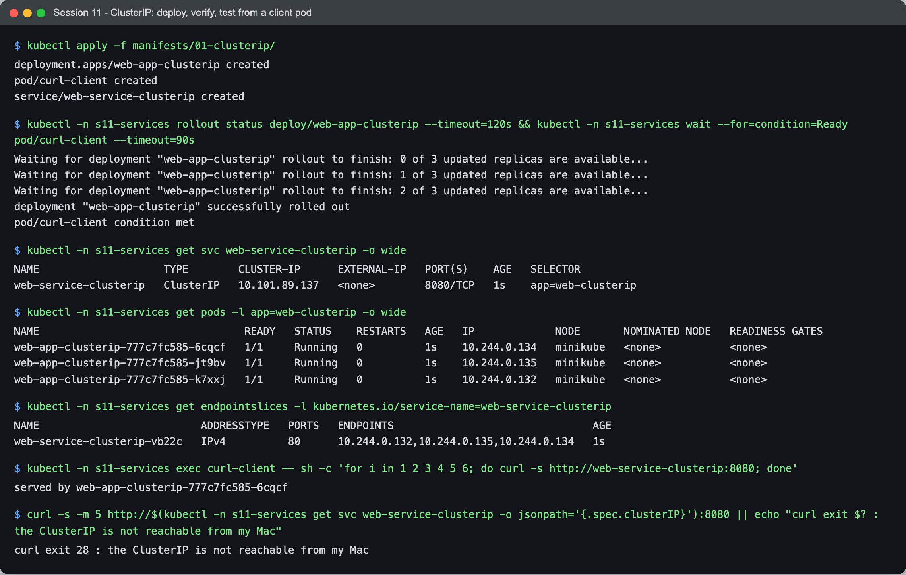
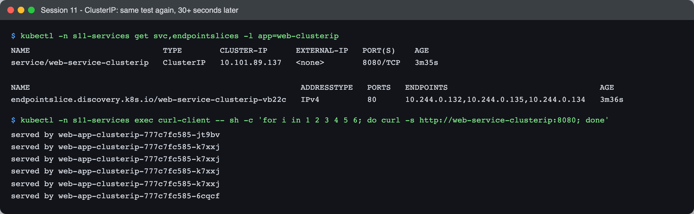
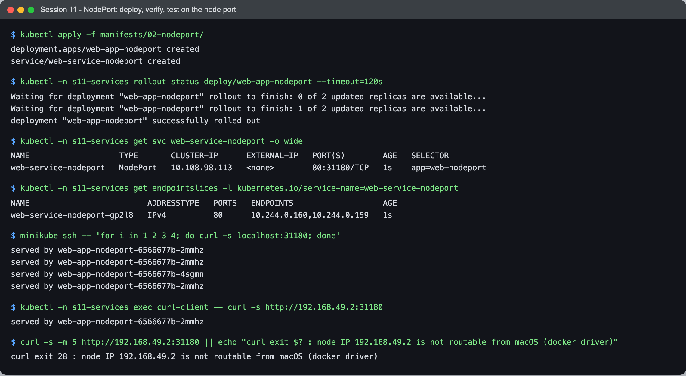
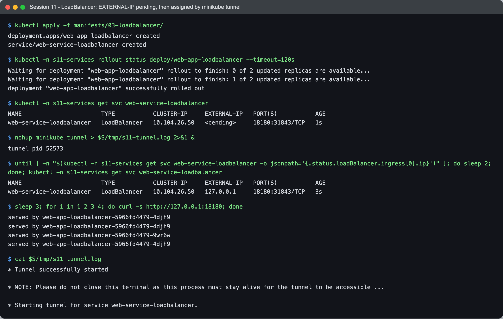
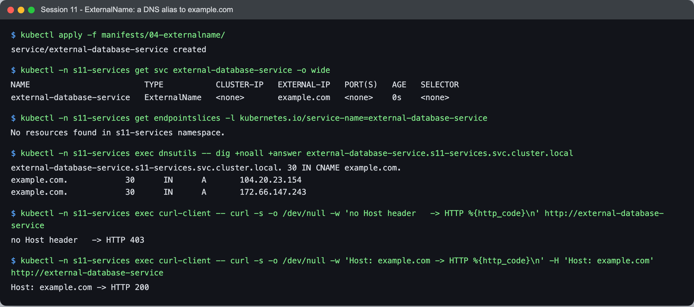
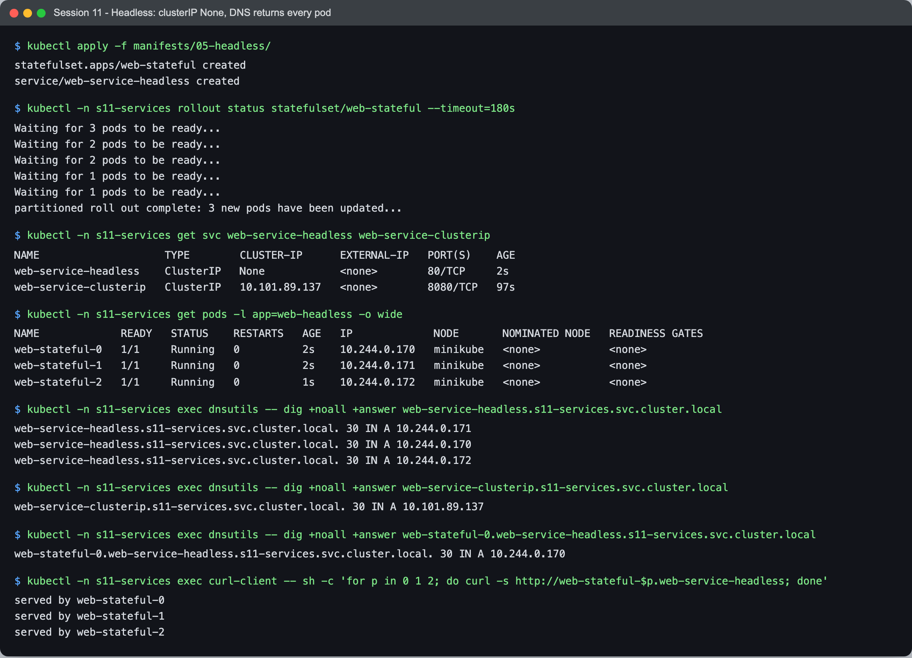

# Session 11 - Kubernetes Networking & Services - Task

- **Name:** Netram
- **Enrollment No:** 24BCS10329

> **Status:** completed

> Run on macOS (Apple Silicon) with Docker Desktop, minikube v1.39.0, Kubernetes v1.37.0.

---

## What the task asked

1. Deploy and demonstrate all 5 Service types (ClusterIP, NodePort, LoadBalancer, ExternalName,
   Headless): write the YAML, deploy the app, verify the Service, test connectivity, capture output.
2. Write a comparison README (Deployment vs ReplicaSet, Deployment vs DaemonSet vs StatefulSet,
   ReplicaSet vs Service).
3. Write `fqdn/README.md`: what an FQDN is, Service DNS, the naming convention, namespaces,
   Pod-to-Service communication, real FQDN examples.
4. Write `coredns/README.md`: what CoreDNS is, why Kubernetes uses it, how lookups are resolved,
   the Corefile, and how to troubleshoot DNS.

| Part | Where |
|---|---|
| Task 1: the 5 Service types | this file (below) |
| Task 2: comparison | [comparison/README.md](comparison/README.md) |
| Task 3: FQDN | [fqdn/README.md](fqdn/README.md) |
| Task 4: CoreDNS | [coredns/README.md](coredns/README.md) |

## My setup

Everything lives in one namespace, `s11-services`, so I can delete it all at the end. I copied the
course manifests (`../01-clusterip` to `../05-headless`) into [manifests/](manifests/) and changed
only what I had to:

| Change | Why |
|---|---|
| Added `namespace: s11-services` to every object | My cluster is shared with other work; I wanted my objects isolated |
| nginx `command` writes `served by $(hostname)` into `index.html` | Every nginx pod returns the same default page, so I could not see which pod answered. Now I can see load balancing |
| NodePort `30080` -> `31180` | `30080` is the port everyone picks; I chose an unusual one so I would not collide on a shared node |
| LoadBalancer port `80` -> `18180`, replicas 3 -> 2 | `minikube tunnel` binds the service port on my Mac; a port below 1024 needs sudo. Fewer replicas to save memory |
| ExternalName `nencyravaliya.me` -> `example.com` | A stable public name I can test against |
| `curlimages/curl:8.5.0` -> `8.11.1` | 8.11.1 was already cached on the node |

Extra debug pods: [manifests/dnsutils-pod.yaml](manifests/dnsutils-pod.yaml) (alpine + `bind-tools`
for `dig`/`nslookup`) and [manifests/other-ns-client.yaml](manifests/other-ns-client.yaml) (same,
in a second namespace `s11-other`).

```bash
export KUBECONFIG=...                      # my minikube cluster
kubectl apply -f manifests/00-namespaces.yaml -f manifests/dnsutils-pod.yaml -f manifests/other-ns-client.yaml
```

One macOS detail matters for this whole task: with the docker driver, the minikube node IP
`192.168.49.2` lives inside Docker Desktop's VM and is **not** routable from my Mac. So I test
NodePort from inside the node (`minikube ssh`) or from a pod, and LoadBalancer through `minikube tunnel`.

---

## 1. ClusterIP

YAML: [manifests/01-clusterip/](manifests/01-clusterip/) (`app-deployment.yaml` 3 replicas,
`service.yaml` port 8080 -> targetPort 80, `client-pod.yaml` curl pod).



```text
$ kubectl apply -f manifests/01-clusterip/
deployment.apps/web-app-clusterip created
pod/curl-client created
service/web-service-clusterip created

$ kubectl -n s11-services rollout status deploy/web-app-clusterip --timeout=120s && kubectl -n s11-services wait --for=condition=Ready pod/curl-client --timeout=90s
Waiting for deployment "web-app-clusterip" rollout to finish: 0 of 3 updated replicas are available...
Waiting for deployment "web-app-clusterip" rollout to finish: 1 of 3 updated replicas are available...
Waiting for deployment "web-app-clusterip" rollout to finish: 2 of 3 updated replicas are available...
deployment "web-app-clusterip" successfully rolled out
pod/curl-client condition met

$ kubectl -n s11-services get svc web-service-clusterip -o wide
NAME                    TYPE        CLUSTER-IP      EXTERNAL-IP   PORT(S)    AGE   SELECTOR
web-service-clusterip   ClusterIP   10.101.89.137   <none>        8080/TCP   1s    app=web-clusterip

$ kubectl -n s11-services get pods -l app=web-clusterip -o wide
NAME                                 READY   STATUS    RESTARTS   AGE   IP             NODE       NOMINATED NODE   READINESS GATES
web-app-clusterip-777c7fc585-6cqcf   1/1     Running   0          1s    10.244.0.134   minikube   <none>           <none>
web-app-clusterip-777c7fc585-jt9bv   1/1     Running   0          1s    10.244.0.135   minikube   <none>           <none>
web-app-clusterip-777c7fc585-k7xxj   1/1     Running   0          1s    10.244.0.132   minikube   <none>           <none>

$ kubectl -n s11-services get endpointslices -l kubernetes.io/service-name=web-service-clusterip
NAME                          ADDRESSTYPE   PORTS   ENDPOINTS                                AGE
web-service-clusterip-vb22c   IPv4          80      10.244.0.132,10.244.0.135,10.244.0.134   1s

$ kubectl -n s11-services exec curl-client -- sh -c 'for i in 1 2 3 4 5 6; do curl -s http://web-service-clusterip:8080; done'
served by web-app-clusterip-777c7fc585-6cqcf

$ curl -s -m 5 http://$(kubectl -n s11-services get svc web-service-clusterip -o jsonpath='{.spec.clusterIP}'):8080 || echo "curl exit $? : the ClusterIP is not reachable from my Mac"
curl exit 28 : the ClusterIP is not reachable from my Mac
```

The Service got a virtual IP (`10.101.89.137`) and its EndpointSlice lists the three pod IPs it picked
with the `app=web-clusterip` selector. From my Mac the ClusterIP times out (curl exit 28), which is the
point: a ClusterIP only exists inside the cluster.

The 6-request loop only printed one line. I had curled about one second after the Service was created,
so most likely kube-proxy had not finished programming the rules for all endpoints yet. I ran the same
loop again a bit later:



```text
$ kubectl -n s11-services get svc,endpointslices -l app=web-clusterip
NAME                            TYPE        CLUSTER-IP      EXTERNAL-IP   PORT(S)    AGE
service/web-service-clusterip   ClusterIP   10.101.89.137   <none>        8080/TCP   3m35s

NAME                                                         ADDRESSTYPE   PORTS   ENDPOINTS                                AGE
endpointslice.discovery.k8s.io/web-service-clusterip-vb22c   IPv4          80      10.244.0.132,10.244.0.135,10.244.0.134   3m36s

$ kubectl -n s11-services exec curl-client -- sh -c 'for i in 1 2 3 4 5 6; do curl -s http://web-service-clusterip:8080; done'
served by web-app-clusterip-777c7fc585-jt9bv
served by web-app-clusterip-777c7fc585-k7xxj
served by web-app-clusterip-777c7fc585-k7xxj
served by web-app-clusterip-777c7fc585-k7xxj
served by web-app-clusterip-777c7fc585-k7xxj
served by web-app-clusterip-777c7fc585-6cqcf
```

Now all 6 requests answer, spread over all three pods. kube-proxy picks a backend at random per
connection, so the split is uneven over only 6 requests.

## 2. NodePort

YAML: [manifests/02-nodeport/](manifests/02-nodeport/) (2 replicas, `port: 80`, `nodePort: 31180`).



```text
$ kubectl apply -f manifests/02-nodeport/
deployment.apps/web-app-nodeport created
service/web-service-nodeport created

$ kubectl -n s11-services rollout status deploy/web-app-nodeport --timeout=120s
Waiting for deployment "web-app-nodeport" rollout to finish: 0 of 2 updated replicas are available...
Waiting for deployment "web-app-nodeport" rollout to finish: 1 of 2 updated replicas are available...
deployment "web-app-nodeport" successfully rolled out

$ kubectl -n s11-services get svc web-service-nodeport -o wide
NAME                   TYPE       CLUSTER-IP      EXTERNAL-IP   PORT(S)        AGE   SELECTOR
web-service-nodeport   NodePort   10.108.98.113   <none>        80:31180/TCP   1s    app=web-nodeport

$ kubectl -n s11-services get endpointslices -l kubernetes.io/service-name=web-service-nodeport
NAME                         ADDRESSTYPE   PORTS   ENDPOINTS                   AGE
web-service-nodeport-gp2l8   IPv4          80      10.244.0.160,10.244.0.159   1s

$ minikube ssh -- 'for i in 1 2 3 4; do curl -s localhost:31180; done'
served by web-app-nodeport-6566677b-2mmhz
served by web-app-nodeport-6566677b-2mmhz
served by web-app-nodeport-6566677b-4sgmn
served by web-app-nodeport-6566677b-2mmhz

$ kubectl -n s11-services exec curl-client -- curl -s http://192.168.49.2:31180
served by web-app-nodeport-6566677b-2mmhz

$ curl -s -m 5 http://192.168.49.2:31180 || echo "curl exit $? : node IP 192.168.49.2 is not routable from macOS (docker driver)"
curl exit 28 : node IP 192.168.49.2 is not routable from macOS (docker driver)
```

`80:31180/TCP` means: port 80 on the ClusterIP and port 31180 on every node. A NodePort Service is a
ClusterIP plus that extra node port, so it works from inside the node (`minikube ssh`, both pods answer)
and from a pod hitting the node IP. From my Mac the node IP times out because of the docker driver, not
because of Kubernetes. On a real cluster with reachable nodes, `<node-ip>:31180` would work from outside.

## 3. LoadBalancer

YAML: [manifests/03-loadbalancer/](manifests/03-loadbalancer/) (2 replicas, `port: 18180`).



```text
$ kubectl apply -f manifests/03-loadbalancer/
deployment.apps/web-app-loadbalancer created
service/web-service-loadbalancer created

$ kubectl -n s11-services rollout status deploy/web-app-loadbalancer --timeout=120s
Waiting for deployment "web-app-loadbalancer" rollout to finish: 0 of 2 updated replicas are available...
Waiting for deployment "web-app-loadbalancer" rollout to finish: 1 of 2 updated replicas are available...
deployment "web-app-loadbalancer" successfully rolled out

$ kubectl -n s11-services get svc web-service-loadbalancer
NAME                       TYPE           CLUSTER-IP     EXTERNAL-IP   PORT(S)           AGE
web-service-loadbalancer   LoadBalancer   10.104.26.50   <pending>     18180:31843/TCP   1s

$ nohup minikube tunnel > $S/tmp/s11-tunnel.log 2>&1 &
tunnel pid 52573

$ until [ -n "$(kubectl -n s11-services get svc web-service-loadbalancer -o jsonpath='{.status.loadBalancer.ingress[0].ip}')" ]; do sleep 2; done; kubectl -n s11-services get svc web-service-loadbalancer
NAME                       TYPE           CLUSTER-IP     EXTERNAL-IP   PORT(S)           AGE
web-service-loadbalancer   LoadBalancer   10.104.26.50   127.0.0.1     18180:31843/TCP   3s

$ sleep 3; for i in 1 2 3 4; do curl -s http://127.0.0.1:18180; done
served by web-app-loadbalancer-5966fd4479-4djh9
served by web-app-loadbalancer-5966fd4479-4djh9
served by web-app-loadbalancer-5966fd4479-9wr6w
served by web-app-loadbalancer-5966fd4479-4djh9

$ cat $S/tmp/s11-tunnel.log
* Tunnel successfully started

* NOTE: Please do not close this terminal as this process must stay alive for the tunnel to be accessible ...

* Starting tunnel for service web-service-loadbalancer.
```

Right after creation `EXTERNAL-IP` is `<pending>`: a LoadBalancer Service only asks for a load balancer,
and minikube has no cloud controller to create one. `minikube tunnel` plays that role; it set the
external IP to `127.0.0.1` and forwards `127.0.0.1:18180` on my Mac to the Service, so I could curl it
from macOS (the only type in this task I could reach directly). Because I used port 18180, the tunnel did
not ask for sudo. A LoadBalancer also gets a ClusterIP and a node port (`31843`, auto-assigned), which
is how a cloud LB usually sends traffic in.

Note: the wait loop shown above is the readable version; the capture really ran a bounded loop (at most
60 tries, 2 s apart) with the same check, and the curl loop also had `-m 5`. When I killed the tunnel
afterwards, `EXTERNAL-IP` still showed `127.0.0.1` (the status is not cleared), so that column alone does
not prove the tunnel is running.

## 4. ExternalName

YAML: [manifests/04-externalname/service.yaml](manifests/04-externalname/service.yaml) (`externalName: example.com`).



```text
$ kubectl apply -f manifests/04-externalname/
service/external-database-service created

$ kubectl -n s11-services get svc external-database-service -o wide
NAME                        TYPE           CLUSTER-IP   EXTERNAL-IP   PORT(S)   AGE   SELECTOR
external-database-service   ExternalName   <none>       example.com   <none>    0s    <none>

$ kubectl -n s11-services get endpointslices -l kubernetes.io/service-name=external-database-service
No resources found in s11-services namespace.

$ kubectl -n s11-services exec dnsutils -- dig +noall +answer external-database-service.s11-services.svc.cluster.local
external-database-service.s11-services.svc.cluster.local. 30 IN	CNAME example.com.
example.com.		30	IN	A	104.20.23.154
example.com.		30	IN	A	172.66.147.243

$ kubectl -n s11-services exec curl-client -- curl -s -o /dev/null -w 'no Host header   -> HTTP %{http_code}\n' http://external-database-service
no Host header   -> HTTP 403

$ kubectl -n s11-services exec curl-client -- curl -s -o /dev/null -w 'Host: example.com -> HTTP %{http_code}\n' -H 'Host: example.com' http://external-database-service
Host: example.com -> HTTP 200
```

An ExternalName Service has no ClusterIP, no selector and no endpoints. It is only a DNS record: CoreDNS
answers the Service name with a `CNAME example.com.`, and the client then resolves `example.com` itself.
No proxying happens, which is why the plain curl got `403`: the HTTP `Host` header was still
`external-database-service`, and the real site rejected it. With `Host: example.com` I got `200`. So
ExternalName is good for TCP things like databases, but for HTTP(S) the remote side has to accept the alias
(and TLS certificates will not match).

## 5. Headless

YAML: [manifests/05-headless/](manifests/05-headless/) (`clusterIP: None` Service + 3-replica StatefulSet with `serviceName: web-service-headless`).



```text
$ kubectl apply -f manifests/05-headless/
statefulset.apps/web-stateful created
service/web-service-headless created

$ kubectl -n s11-services rollout status statefulset/web-stateful --timeout=180s
Waiting for 3 pods to be ready...
Waiting for 2 pods to be ready...
Waiting for 2 pods to be ready...
Waiting for 1 pods to be ready...
Waiting for 1 pods to be ready...
partitioned roll out complete: 3 new pods have been updated...

$ kubectl -n s11-services get svc web-service-headless web-service-clusterip
NAME                    TYPE        CLUSTER-IP      EXTERNAL-IP   PORT(S)    AGE
web-service-headless    ClusterIP   None            <none>        80/TCP     2s
web-service-clusterip   ClusterIP   10.101.89.137   <none>        8080/TCP   97s

$ kubectl -n s11-services get pods -l app=web-headless -o wide
NAME             READY   STATUS    RESTARTS   AGE   IP             NODE       NOMINATED NODE   READINESS GATES
web-stateful-0   1/1     Running   0          2s    10.244.0.170   minikube   <none>           <none>
web-stateful-1   1/1     Running   0          2s    10.244.0.171   minikube   <none>           <none>
web-stateful-2   1/1     Running   0          1s    10.244.0.172   minikube   <none>           <none>

$ kubectl -n s11-services exec dnsutils -- dig +noall +answer web-service-headless.s11-services.svc.cluster.local
web-service-headless.s11-services.svc.cluster.local. 30	IN A 10.244.0.171
web-service-headless.s11-services.svc.cluster.local. 30	IN A 10.244.0.170
web-service-headless.s11-services.svc.cluster.local. 30	IN A 10.244.0.172

$ kubectl -n s11-services exec dnsutils -- dig +noall +answer web-service-clusterip.s11-services.svc.cluster.local
web-service-clusterip.s11-services.svc.cluster.local. 30 IN A 10.101.89.137

$ kubectl -n s11-services exec dnsutils -- dig +noall +answer web-stateful-0.web-service-headless.s11-services.svc.cluster.local
web-stateful-0.web-service-headless.s11-services.svc.cluster.local. 30 IN A 10.244.0.170

$ kubectl -n s11-services exec curl-client -- sh -c 'for p in 0 1 2; do curl -s http://web-stateful-$p.web-service-headless; done'
served by web-stateful-0
served by web-stateful-1
served by web-stateful-2
```

With `clusterIP: None` there is no virtual IP and no kube-proxy load balancing. The DNS name returns all
three pod IPs (compare with the ClusterIP Service, which returns one VIP), and because the pods belong to a
StatefulSet each one also gets its own stable name, `web-stateful-N.web-service-headless`. That is how
databases or clustered apps talk to one specific member (the primary, for example) instead of "any pod".

---

## Task 2, 3, 4

- [comparison/README.md](comparison/README.md): Deployment vs ReplicaSet, Deployment vs DaemonSet vs StatefulSet, ReplicaSet vs Service.
- [fqdn/README.md](fqdn/README.md): FQDNs and Service DNS, with real `nslookup`/`dig` output.
- [coredns/README.md](coredns/README.md): CoreDNS, the real Corefile, and a broken-then-fixed DNS drill.

## What I learned

- A Service is a stable name plus (usually) a virtual IP in front of pods picked by a label selector.
  The EndpointSlice is the list it actually sends to; checking it is the first step when a Service "does nothing".
- The types build on each other: NodePort is ClusterIP plus a port on every node, LoadBalancer is NodePort
  plus an external load balancer. ExternalName and Headless are the odd ones: both are DNS features, one
  without any IP and one without a virtual IP.
- "Pending" `EXTERNAL-IP` is normal on a local cluster. Something outside Kubernetes (a cloud controller,
  MetalLB, or `minikube tunnel`) has to fill it in.
- Where I test from matters as much as the Service. The same NodePort worked from the node and timed out
  from my Mac, purely because of how Docker Desktop networks the minikube node.

## Problems I hit

- **ClusterIP loop printed 1 line instead of 6.** I curled one second after creating the Service; a second
  run later answered all 6. Lesson: wait a moment (or check the EndpointSlice) before calling a fresh Service.
- **NodePort and ClusterIP unreachable from macOS.** Docker driver networking, not a Kubernetes problem. I
  tested from inside the node and from a pod instead.
- **LoadBalancer port.** The course uses port 80, which would make `minikube tunnel` ask for sudo on my Mac;
  I used 18180.
- **ExternalName gave HTTP 403.** The `Host` header still carried the Service name. Fixed by sending
  `Host: example.com`, and documented why.
- **busybox `nslookup` lied to me.** `busybox nslookup web-service-clusterip.s11-services` returned NXDOMAIN
  even though the name works; busybox does not apply the search list to names that already contain a dot.
  I switched my debug pods to alpine + `bind-tools`. Details in [fqdn/README.md](fqdn/README.md).
- **CoreDNS logs rotated too fast to capture.** Other workloads on the cluster were generating thousands of
  DNS queries per minute, so my own query lines were usually rotated out before my capture script grepped for
  them. Details in [coredns/README.md](coredns/README.md).

## Cleanup

```bash
kubectl delete namespace s11-services s11-other
```
