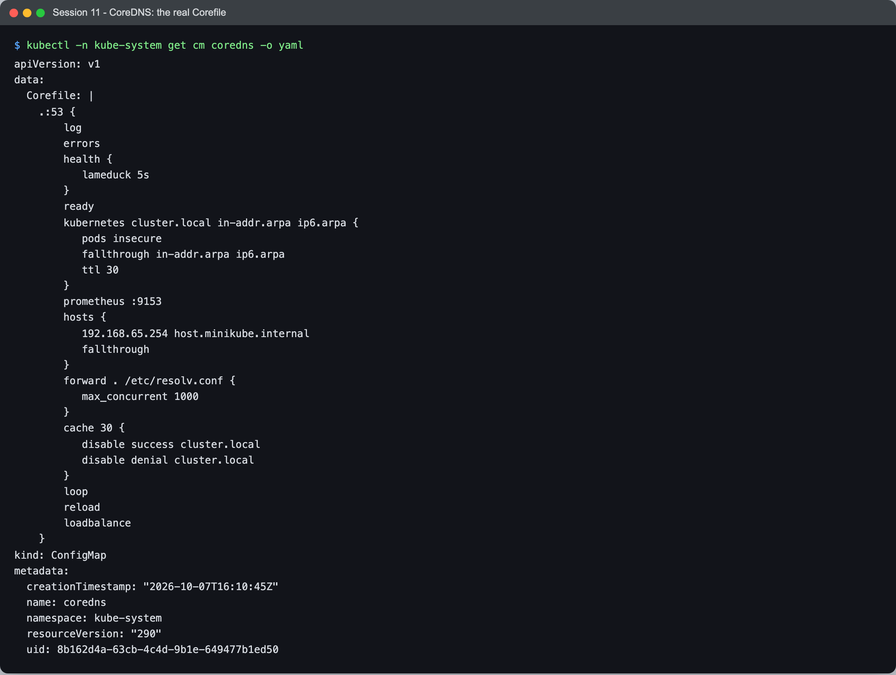
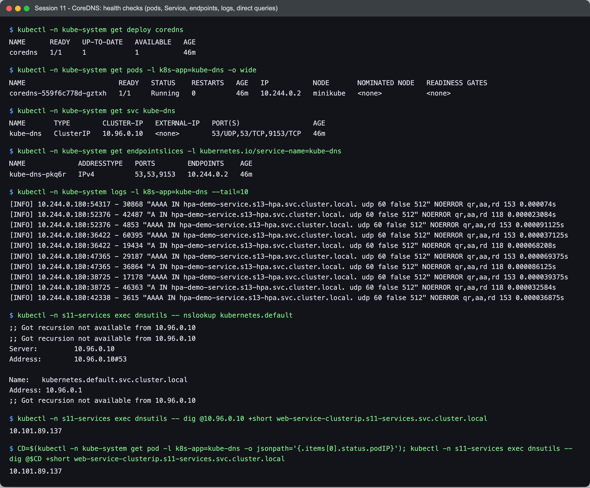
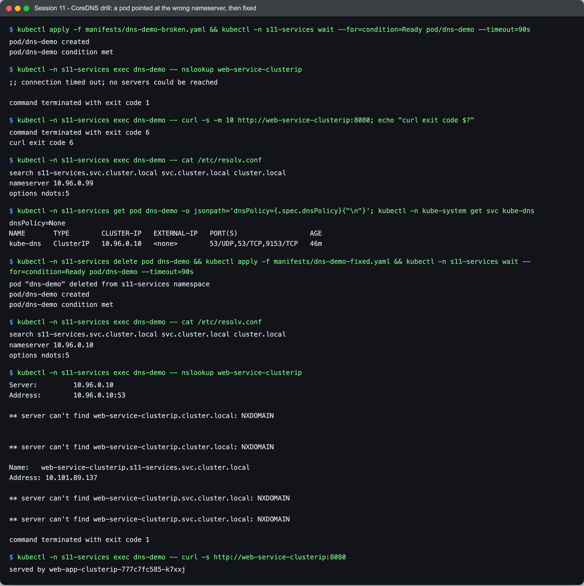
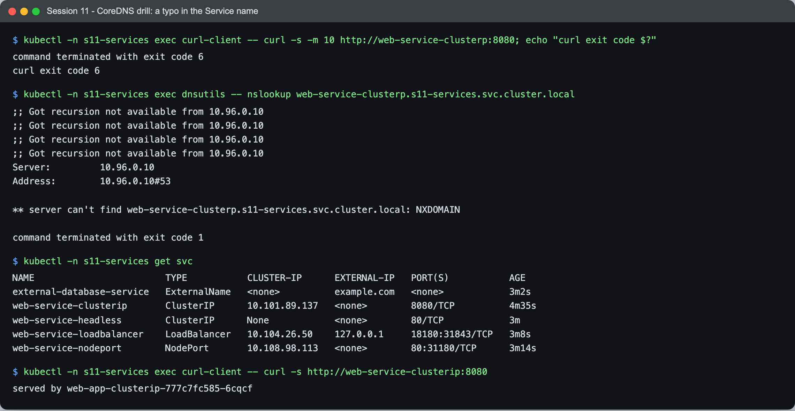

# Session 11 - Task 4 - CoreDNS

- **Name:** Netram
- **Enrollment No:** 24BCS10329

> All output below is real, from my minikube cluster (Kubernetes v1.37.0, CoreDNS image `v1.14.6`).

## What is CoreDNS

CoreDNS is a small DNS server written in Go, built out of plugins. Each line in its config file (the
Corefile) turns on a plugin: one serves Kubernetes records, one forwards to upstream DNS, one caches, one
logs, and so on. It is a CNCF graduated project and has been the default cluster DNS in Kubernetes since 1.13
(it replaced kube-dns, which is why the Service and labels are still called `kube-dns`).

## Why Kubernetes uses it

- Pod and Service IPs are temporary. Apps need stable names, and DNS is the one discovery mechanism every
  language and library already supports.
- The `kubernetes` plugin builds records directly from the API server (Services, EndpointSlices, pods), so a
  new Service is resolvable within seconds with no extra step.
- It is one binary with a plugin chain, which makes it easy to add things like stub domains, rewrites or
  custom host entries (minikube adds `host.minikube.internal` that way).
- It runs as an ordinary Deployment behind an ordinary Service, so it scales and heals like any app.

## How service discovery works

1. CoreDNS runs as Deployment `coredns` in `kube-system`, fronted by Service `kube-dns` at `10.96.0.10`.
2. The kubelet writes `nameserver 10.96.0.10` plus the namespace search list into every pod's
   `/etc/resolv.conf` (see [the FQDN doc](../fqdn/README.md)).
3. CoreDNS's `kubernetes` plugin keeps a watch on the API server. When I created `web-service-clusterip`,
   the plugin saw it and started answering `web-service-clusterip.s11-services.svc.cluster.local`.
4. For headless Services it answers with the ready pod IPs from the EndpointSlices, so DNS changes when pods
   come and go.

## How a DNS query is resolved

For a name inside the cluster, `web-service-clusterip` from a pod in `s11-services`:

1. The pod's resolver expands it with the first search domain (`ndots:5`), giving
   `web-service-clusterip.s11-services.svc.cluster.local.`, and sends it to `10.96.0.10:53`.
2. kube-proxy forwards the packet to a CoreDNS pod (`10.244.0.2`).
3. The plugin chain runs. `kubernetes cluster.local ...` owns that zone, finds the Service and answers
   `A 10.101.89.137`. This answer is authoritative (`aa` flag).
4. For an external name such as `example.com`, the three search-list attempts get NXDOMAIN from the
   `kubernetes` plugin; the final `example.com.` query is not in `cluster.local`, so it falls to
   `forward . /etc/resolv.conf`, which sends it to the node's upstream DNS. `cache 30` keeps that answer
   for 30 seconds.

I could see exactly this in the CoreDNS log (the `log` plugin is on in minikube). This is a real excerpt from
my terminal, filtered to my `curl-client` pod (`10.244.0.133`), after it ran
`curl http://web-service-clusterip:8080` and `curl http://example.com`:

```text
[INFO] 10.244.0.133:37677 - 56725 "A IN web-service-clusterip.s11-services.svc.cluster.local. udp 70 false 512" NOERROR qr,aa,rd 138 0.00202
[INFO] 10.244.0.133:44147 - 59275 "A IN example.com.s11-services.svc.cluster.local. udp 60 false 512" NXDOMAIN qr,aa,rd 153 0.000137833s
[INFO] 10.244.0.133:42206 - 30502 "A IN example.com.svc.cluster.local. udp 47 false 512" NXDOMAIN qr,aa,rd 140 0.001236s
[INFO] 10.244.0.133:57670 - 48454 "A IN example.com.cluster.local. udp 43 false 512" NXDOMAIN qr,aa,rd 136 0.000022417s
[INFO] 10.244.0.133:47251 - 49314 "A IN example.com. udp 29 false 512" NOERROR qr,rd,ra 83 0.024848625s
```

(I trimmed the matching `AAAA` lines, since curl asks for both, and my command cut lines at 140 characters.) The cluster answers carry `aa` (authoritative,
answered by the `kubernetes` plugin in microseconds) and the last one carries `ra` and took 25 ms, because it
went upstream through `forward`. I could not get this into a screenshot: see Problems below.

## CoreDNS configuration (the real Corefile)



```text
$ kubectl -n kube-system get cm coredns -o yaml
apiVersion: v1
data:
  Corefile: |
    .:53 {
        log
        errors
        health {
           lameduck 5s
        }
        ready
        kubernetes cluster.local in-addr.arpa ip6.arpa {
           pods insecure
           fallthrough in-addr.arpa ip6.arpa
           ttl 30
        }
        prometheus :9153
        hosts {
           192.168.65.254 host.minikube.internal
           fallthrough
        }
        forward . /etc/resolv.conf {
           max_concurrent 1000
        }
        cache 30 {
           disable success cluster.local
           disable denial cluster.local
        }
        loop
        reload
        loadbalance
    }
kind: ConfigMap
metadata:
  creationTimestamp: "2026-10-07T16:10:45Z"
  name: coredns
  namespace: kube-system
  resourceVersion: "290"
  uid: 8b162d4a-63cb-4c4d-9b1e-649477b1ed50
```

What each plugin does, in the order they appear:

| Plugin | What it does here |
|---|---|
| `.:53` | Serve every zone (`.`) on port 53 |
| `log` | Log every query (added by minikube; not in a default kubeadm Corefile) |
| `errors` | Log errors to stdout |
| `health { lameduck 5s }` | `:8080/health` for the liveness probe; on shutdown keep serving 5 s so in-flight queries finish |
| `ready` | `:8181/ready` for the readiness probe, ready once all plugins are |
| `kubernetes cluster.local in-addr.arpa ip6.arpa` | Answer Service/pod records for `cluster.local`, plus reverse lookups |
| `pods insecure` | Answer `a-b-c-d.<ns>.pod.cluster.local` without checking the pod exists (kube-dns compatible) |
| `fallthrough in-addr.arpa ip6.arpa` | Reverse lookups that are not cluster IPs go to the next plugin |
| `ttl 30` | Records live 30 s in client caches (the `30` in every `dig` answer) |
| `prometheus :9153` | Metrics (the third port on the `kube-dns` Service) |
| `hosts { 192.168.65.254 host.minikube.internal ... }` | A static record so pods can reach my Mac; minikube adds this |
| `forward . /etc/resolv.conf` | Everything else goes to the node's upstream resolvers |
| `cache 30 { disable success/denial cluster.local }` | Cache external answers 30 s; never cache cluster answers, so Service changes show up immediately |
| `loop` | Detect forwarding loops (CoreDNS forwarding to itself) and stop |
| `reload` | Pick up ConfigMap edits without a restart |
| `loadbalance` | Shuffle the order of A records in each answer (round robin for headless Services) |

To change it you edit the ConfigMap (`kubectl -n kube-system edit cm coredns`) and `reload` applies it. I did
not edit it, because the cluster is shared.

## How to troubleshoot DNS issues

My checklist, from the bottom up.

### 1. Is CoreDNS itself healthy?



```text
$ kubectl -n kube-system get deploy coredns
NAME      READY   UP-TO-DATE   AVAILABLE   AGE
coredns   1/1     1            1           46m

$ kubectl -n kube-system get pods -l k8s-app=kube-dns -o wide
NAME                       READY   STATUS    RESTARTS   AGE   IP           NODE       NOMINATED NODE   READINESS GATES
coredns-559f6c778d-gztxh   1/1     Running   0          46m   10.244.0.2   minikube   <none>           <none>

$ kubectl -n kube-system get svc kube-dns
NAME       TYPE        CLUSTER-IP   EXTERNAL-IP   PORT(S)                  AGE
kube-dns   ClusterIP   10.96.0.10   <none>        53/UDP,53/TCP,9153/TCP   46m

$ kubectl -n kube-system get endpointslices -l kubernetes.io/service-name=kube-dns
NAME             ADDRESSTYPE   PORTS        ENDPOINTS    AGE
kube-dns-pkq6r   IPv4          53,53,9153   10.244.0.2   46m

$ kubectl -n kube-system logs -l k8s-app=kube-dns --tail=10
[INFO] 10.244.0.180:54317 - 30868 "AAAA IN hpa-demo-service.s13-hpa.svc.cluster.local. udp 60 false 512" NOERROR qr,aa,rd 153 0.000074s
[INFO] 10.244.0.180:52376 - 42487 "A IN hpa-demo-service.s13-hpa.svc.cluster.local. udp 60 false 512" NOERROR qr,aa,rd 118 0.000023084s
[INFO] 10.244.0.180:52376 - 4853 "AAAA IN hpa-demo-service.s13-hpa.svc.cluster.local. udp 60 false 512" NOERROR qr,aa,rd 153 0.000091125s
[INFO] 10.244.0.180:36422 - 60395 "AAAA IN hpa-demo-service.s13-hpa.svc.cluster.local. udp 60 false 512" NOERROR qr,aa,rd 153 0.000037125s
[INFO] 10.244.0.180:36422 - 19434 "A IN hpa-demo-service.s13-hpa.svc.cluster.local. udp 60 false 512" NOERROR qr,aa,rd 118 0.000068208s
[INFO] 10.244.0.180:47365 - 29187 "AAAA IN hpa-demo-service.s13-hpa.svc.cluster.local. udp 60 false 512" NOERROR qr,aa,rd 153 0.000069375s
[INFO] 10.244.0.180:47365 - 36864 "A IN hpa-demo-service.s13-hpa.svc.cluster.local. udp 60 false 512" NOERROR qr,aa,rd 118 0.000086125s
[INFO] 10.244.0.180:38725 - 17178 "AAAA IN hpa-demo-service.s13-hpa.svc.cluster.local. udp 60 false 512" NOERROR qr,aa,rd 153 0.000039375s
[INFO] 10.244.0.180:38725 - 46363 "A IN hpa-demo-service.s13-hpa.svc.cluster.local. udp 60 false 512" NOERROR qr,aa,rd 118 0.000032584s
[INFO] 10.244.0.180:42338 - 3615 "AAAA IN hpa-demo-service.s13-hpa.svc.cluster.local. udp 60 false 512" NOERROR qr,aa,rd 153 0.000036875s

$ kubectl -n s11-services exec dnsutils -- nslookup kubernetes.default
;; Got recursion not available from 10.96.0.10
;; Got recursion not available from 10.96.0.10
Server:		10.96.0.10
Address:	10.96.0.10#53

Name:	kubernetes.default.svc.cluster.local
Address: 10.96.0.1
;; Got recursion not available from 10.96.0.10

$ kubectl -n s11-services exec dnsutils -- dig @10.96.0.10 +short web-service-clusterip.s11-services.svc.cluster.local
10.101.89.137

$ CD=$(kubectl -n kube-system get pod -l k8s-app=kube-dns -o jsonpath='{.items[0].status.podIP}'); kubectl -n s11-services exec dnsutils -- dig @$CD +short web-service-clusterip.s11-services.svc.cluster.local
10.101.89.137
```

- Deployment and pod are `1/1 Running` with 0 restarts.
- `kube-dns` has ClusterIP `10.96.0.10` (matching the pods' `resolv.conf`) and its EndpointSlice points at the
  CoreDNS pod. Empty endpoints here would mean every lookup in the cluster times out.
- The logs show traffic; errors such as `[ERROR] plugin/errors` or `i/o timeout` to upstream would show here.
  (These 10 lines are queries from other workloads on the same cluster.)
- Querying through the Service IP and directly to the CoreDNS pod IP both work. If the pod answers but the
  Service IP does not, the problem is kube-proxy/networking, not CoreDNS.

### 2. Real drill: a pod pointed at the wrong DNS server

[dns-demo-broken.yaml](../manifests/dns-demo-broken.yaml) uses `dnsPolicy: None` with a hand-written
nameserver `10.96.0.99`, a typo of the real `10.96.0.10`. The fix,
[dns-demo-fixed.yaml](../manifests/dns-demo-fixed.yaml), goes back to `dnsPolicy: ClusterFirst`.



```text
$ kubectl apply -f manifests/dns-demo-broken.yaml && kubectl -n s11-services wait --for=condition=Ready pod/dns-demo --timeout=90s
pod/dns-demo created
pod/dns-demo condition met

$ kubectl -n s11-services exec dns-demo -- nslookup web-service-clusterip
;; connection timed out; no servers could be reached

command terminated with exit code 1

$ kubectl -n s11-services exec dns-demo -- curl -s -m 10 http://web-service-clusterip:8080; echo "curl exit code $?"
command terminated with exit code 6
curl exit code 6

$ kubectl -n s11-services exec dns-demo -- cat /etc/resolv.conf
search s11-services.svc.cluster.local svc.cluster.local cluster.local
nameserver 10.96.0.99
options ndots:5

$ kubectl -n s11-services get pod dns-demo -o jsonpath='dnsPolicy={.spec.dnsPolicy}{"\n"}'; kubectl -n kube-system get svc kube-dns
dnsPolicy=None
NAME       TYPE        CLUSTER-IP   EXTERNAL-IP   PORT(S)                  AGE
kube-dns   ClusterIP   10.96.0.10   <none>        53/UDP,53/TCP,9153/TCP   46m

$ kubectl -n s11-services delete pod dns-demo && kubectl apply -f manifests/dns-demo-fixed.yaml && kubectl -n s11-services wait --for=condition=Ready pod/dns-demo --timeout=90s
pod "dns-demo" deleted from s11-services namespace
pod/dns-demo created
pod/dns-demo condition met

$ kubectl -n s11-services exec dns-demo -- cat /etc/resolv.conf
search s11-services.svc.cluster.local svc.cluster.local cluster.local
nameserver 10.96.0.10
options ndots:5

$ kubectl -n s11-services exec dns-demo -- nslookup web-service-clusterip
Server:		10.96.0.10
Address:	10.96.0.10:53

** server can't find web-service-clusterip.cluster.local: NXDOMAIN


** server can't find web-service-clusterip.cluster.local: NXDOMAIN

Name:	web-service-clusterip.s11-services.svc.cluster.local
Address: 10.101.89.137

** server can't find web-service-clusterip.svc.cluster.local: NXDOMAIN

** server can't find web-service-clusterip.svc.cluster.local: NXDOMAIN

command terminated with exit code 1

$ kubectl -n s11-services exec dns-demo -- curl -s http://web-service-clusterip:8080
served by web-app-clusterip-777c7fc585-k7xxj
```

How I narrowed it down:

1. Symptom: `nslookup` says "connection timed out; no servers could be reached" and curl exits with code
   6 ("could not resolve host"). A timeout (not NXDOMAIN) means no DNS server answered at all.
2. `/etc/resolv.conf` inside the pod shows `nameserver 10.96.0.99`.
3. The real DNS Service is `10.96.0.10`, and the pod spec shows `dnsPolicy=None`, so the kubelet did not
   inject the cluster settings; someone wrote them by hand.
4. Fix: `dnsConfig` is immutable on a running pod, so I deleted and recreated it with `ClusterFirst`. Now
   `resolv.conf` has `10.96.0.10` and curl works.

The `nslookup` in the fixed pod is busybox's: it queries all search domains and prints NXDOMAIN for the
ones that do not exist, and exits 1, even though it found the right answer
(`web-service-clusterip.s11-services.svc.cluster.local -> 10.101.89.137`). The curl right after it is the
real proof.

### 3. Real drill: a typo in the Service name



```text
$ kubectl -n s11-services exec curl-client -- curl -s -m 10 http://web-service-clusterp:8080; echo "curl exit code $?"
command terminated with exit code 6
curl exit code 6

$ kubectl -n s11-services exec dnsutils -- nslookup web-service-clusterp.s11-services.svc.cluster.local
;; Got recursion not available from 10.96.0.10
;; Got recursion not available from 10.96.0.10
;; Got recursion not available from 10.96.0.10
;; Got recursion not available from 10.96.0.10
Server:		10.96.0.10
Address:	10.96.0.10#53

** server can't find web-service-clusterp.s11-services.svc.cluster.local: NXDOMAIN

command terminated with exit code 1

$ kubectl -n s11-services get svc
NAME                        TYPE           CLUSTER-IP      EXTERNAL-IP   PORT(S)           AGE
external-database-service   ExternalName   <none>          example.com   <none>            3m2s
web-service-clusterip       ClusterIP      10.101.89.137   <none>        8080/TCP          4m35s
web-service-headless        ClusterIP      None            <none>        80/TCP            3m
web-service-loadbalancer    LoadBalancer   10.104.26.50    127.0.0.1     18180:31843/TCP   3m8s
web-service-nodeport        NodePort       10.108.98.113   <none>        80:31180/TCP      3m14s

$ kubectl -n s11-services exec curl-client -- curl -s http://web-service-clusterip:8080
served by web-app-clusterip-777c7fc585-6cqcf
```

This time DNS works fine; the answer is NXDOMAIN ("this name does not exist"), not a timeout. That points at
the name, not at CoreDNS. `kubectl get svc` showed the real name (`clusterip`, not `clusterp`).

### Quick reference

| Symptom | Likely cause | Command that shows it |
|---|---|---|
| `connection timed out; no servers could be reached` | Wrong nameserver, CoreDNS down, kube-dns has no endpoints, or a NetworkPolicy blocks port 53 | `cat /etc/resolv.conf`, `kubectl -n kube-system get pods,endpointslices -l k8s-app=kube-dns` |
| NXDOMAIN for a cluster name | Typo, wrong namespace, Service not created | `kubectl get svc -A \| grep <name>`, try the full FQDN |
| Cluster names work, external names fail | Upstream (`forward`) broken | `kubectl -n kube-system logs -l k8s-app=kube-dns`, `dig example.com.` from a pod |
| Name resolves but the connection fails | Not DNS: Service has no endpoints or wrong targetPort | `kubectl get endpointslices -l kubernetes.io/service-name=<svc>` |
| Slow external lookups | `ndots:5` search-list expansion | `dig +search +showsearch <name>`; use a trailing dot or lower `ndots` |
| CoreDNS pods in CrashLoopBackOff with a `loop` error | Node `resolv.conf` points back at CoreDNS | `kubectl -n kube-system logs <coredns-pod>` |

## Problems I hit

- **CoreDNS logs rotated before I could capture them.** Other workloads on the shared cluster were sending
  thousands of DNS queries a minute, and with the `log` plugin on, the container log file rotated every few
  seconds. `kubectl logs` only reads the current file, so four capture attempts came back empty (and
  `--tail=400` was entirely other pods' queries). The excerpt in "How a DNS query is resolved" is real output
  from a manual run where I grepped right after the queries. On a busy cluster I would turn on `log` only
  temporarily, or use the `prometheus` metrics instead.
- **busybox nslookup is misleading**: exit code 1 and NXDOMAIN lines even on success, and no search list for
  dotted names. I used `bind-tools` (`dig`) for anything I wanted to trust.
