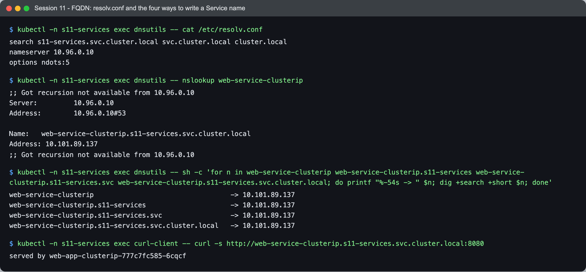
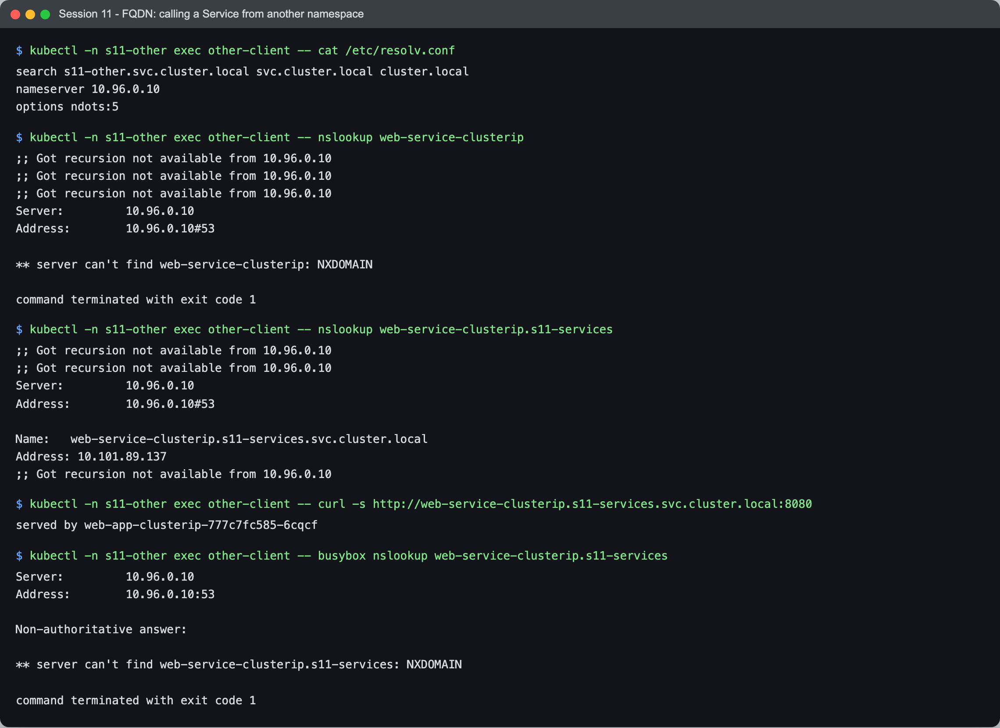
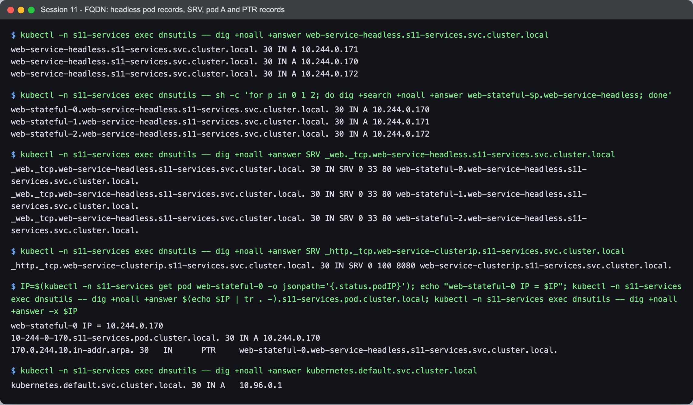
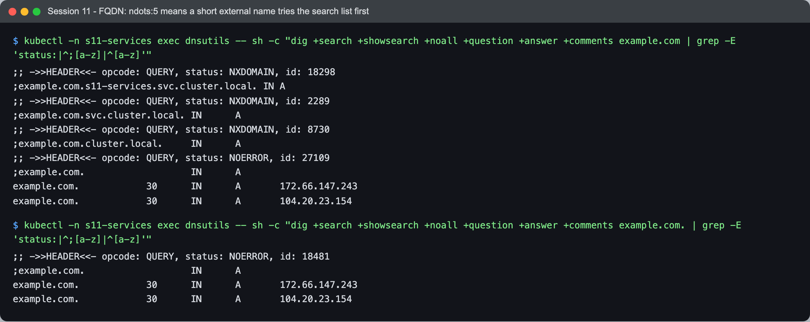

# Session 11 - Task 3 - FQDN in Kubernetes

- **Name:** Netram
- **Enrollment No:** 24BCS10329

> All output below is real, from my minikube cluster (Kubernetes v1.37.0) while the Task 1 Services were
> running in namespace `s11-services`. Debug pods: [dnsutils](../manifests/dnsutils-pod.yaml) and
> [other-client](../manifests/other-ns-client.yaml) (alpine + `bind-tools`).

## What is an FQDN

A Fully Qualified Domain Name is the complete name of a host, all the way up to the DNS root, for example
`www.example.com.` (the trailing dot is the root). It is unambiguous: it does not depend on which machine or
network asks. A short name like `web` only works because the resolver appends something to it (a search
domain) until it finds a match.

## Kubernetes Service DNS

Every Service gets a DNS name from the cluster DNS server (CoreDNS). Pods do not need to know Service IPs,
which change whenever a Service is recreated; they use the name, and DNS hands out the current IP.

| Service type | What the name returns |
|---|---|
| ClusterIP / NodePort / LoadBalancer | A record with the Service's ClusterIP |
| Headless (`clusterIP: None`) | One A record per ready pod, plus per-pod names for StatefulSet pods |
| ExternalName | A CNAME to the external name |

There are also SRV records for named ports: `_<port-name>._<protocol>.<service>.<namespace>.svc.cluster.local`.

## DNS naming convention

```
<service>.<namespace>.svc.<cluster-domain>
web-service-clusterip.s11-services.svc.cluster.local
```

- `<service>`: the Service's `metadata.name`
- `<namespace>`: where the Service lives
- `svc`: fixed label meaning "this is a Service record"
- `cluster.local`: the cluster domain (the default; set in kubelet and in the CoreDNS Corefile)

Other record shapes:

| Record | Form | Example from my cluster |
|---|---|---|
| StatefulSet pod behind a headless Service | `<pod>.<headless-svc>.<ns>.svc.cluster.local` | `web-stateful-0.web-service-headless.s11-services.svc.cluster.local` |
| Any pod by IP | `<ip-with-dashes>.<ns>.pod.cluster.local` | `10-244-0-170.s11-services.pod.cluster.local` |
| SRV for a named port | `_<port>._<proto>.<svc>.<ns>.svc.cluster.local` | `_http._tcp.web-service-clusterip.s11-services.svc.cluster.local` |
| The API server | `kubernetes.default.svc.cluster.local` | resolves to `10.96.0.1` |

## How a pod finds the DNS server: /etc/resolv.conf

The kubelet writes this file into every pod (with the default `dnsPolicy: ClusterFirst`):



```text
$ kubectl -n s11-services exec dnsutils -- cat /etc/resolv.conf
search s11-services.svc.cluster.local svc.cluster.local cluster.local
nameserver 10.96.0.10
options ndots:5

$ kubectl -n s11-services exec dnsutils -- nslookup web-service-clusterip
;; Got recursion not available from 10.96.0.10
Server:		10.96.0.10
Address:	10.96.0.10#53

Name:	web-service-clusterip.s11-services.svc.cluster.local
Address: 10.101.89.137
;; Got recursion not available from 10.96.0.10

$ kubectl -n s11-services exec dnsutils -- sh -c 'for n in web-service-clusterip web-service-clusterip.s11-services web-service-clusterip.s11-services.svc web-service-clusterip.s11-services.svc.cluster.local; do printf "%-54s -> " $n; dig +search +short $n; done'
web-service-clusterip                                  -> 10.101.89.137
web-service-clusterip.s11-services                     -> 10.101.89.137
web-service-clusterip.s11-services.svc                 -> 10.101.89.137
web-service-clusterip.s11-services.svc.cluster.local   -> 10.101.89.137

$ kubectl -n s11-services exec curl-client -- curl -s http://web-service-clusterip.s11-services.svc.cluster.local:8080
served by web-app-clusterip-777c7fc585-6cqcf
```

- `nameserver 10.96.0.10` is the ClusterIP of the `kube-dns` Service, which fronts the CoreDNS pods.
- `search s11-services.svc.cluster.local svc.cluster.local cluster.local` is why all four forms resolve:
  `web-service-clusterip` becomes `web-service-clusterip.s11-services.svc.cluster.local` on the first try;
  `web-service-clusterip.s11-services` matches on the second (`+ svc.cluster.local`); and so on.
- The `;; Got recursion not available` lines are harmless: CoreDNS answers `cluster.local` names itself
  (authoritatively), so it does not set the "recursion available" flag that `nslookup` expects.

## Namespace-based DNS

The first search domain is the pod's own namespace. So a short name only finds Services in the same
namespace. From a pod in `s11-other`:



```text
$ kubectl -n s11-other exec other-client -- cat /etc/resolv.conf
search s11-other.svc.cluster.local svc.cluster.local cluster.local
nameserver 10.96.0.10
options ndots:5

$ kubectl -n s11-other exec other-client -- nslookup web-service-clusterip
;; Got recursion not available from 10.96.0.10
;; Got recursion not available from 10.96.0.10
;; Got recursion not available from 10.96.0.10
Server:		10.96.0.10
Address:	10.96.0.10#53

** server can't find web-service-clusterip: NXDOMAIN

command terminated with exit code 1

$ kubectl -n s11-other exec other-client -- nslookup web-service-clusterip.s11-services
;; Got recursion not available from 10.96.0.10
;; Got recursion not available from 10.96.0.10
Server:		10.96.0.10
Address:	10.96.0.10#53

Name:	web-service-clusterip.s11-services.svc.cluster.local
Address: 10.101.89.137
;; Got recursion not available from 10.96.0.10

$ kubectl -n s11-other exec other-client -- curl -s http://web-service-clusterip.s11-services.svc.cluster.local:8080
served by web-app-clusterip-777c7fc585-6cqcf

$ kubectl -n s11-other exec other-client -- busybox nslookup web-service-clusterip.s11-services
Server:		10.96.0.10
Address:	10.96.0.10:53

Non-authoritative answer:

** server can't find web-service-clusterip.s11-services: NXDOMAIN

command terminated with exit code 1
```

- `web-service-clusterip` alone fails: the resolver tried `web-service-clusterip.s11-other.svc.cluster.local`
  (wrong namespace), then the other search domains, then the bare name. All NXDOMAIN.
- Adding the namespace (`web-service-clusterip.s11-services`) is enough, and the full FQDN works with curl.
- The last command is a trap I fell into: busybox's built-in `nslookup` (which is what `curlimages/curl` and
  `busybox` images ship) did **not** apply the search list to `web-service-clusterip.s11-services` and
  reported NXDOMAIN, while bind's `nslookup` and curl both resolved it. That is why my debug pods use
  `bind-tools`. Lesson: when debugging DNS, test with the full FQDN, or with the same resolver your app uses.

Namespaces do not isolate traffic by themselves: any pod can reach any Service by FQDN unless a
NetworkPolicy blocks it. They only change which short names resolve.

## Pod-to-Service communication, step by step

What happened when `curl-client` ran `curl http://web-service-clusterip:8080` in Task 1:

1. curl asks the C library resolver for `web-service-clusterip`.
2. The resolver reads `/etc/resolv.conf`, sees fewer than 5 dots (`ndots:5`), so it tries the search
   domains first: `web-service-clusterip.s11-services.svc.cluster.local`.
3. The query goes to `10.96.0.10`. kube-proxy rules turn that virtual IP into the CoreDNS pod IP (`10.244.0.2`).
4. CoreDNS's `kubernetes` plugin, which watches Services and EndpointSlices through the API server,
   answers with the ClusterIP `10.101.89.137`.
5. curl connects to `10.101.89.137:8080`. kube-proxy's rules on the node pick one backend pod from the
   EndpointSlice and rewrite the destination to `<pod-ip>:80`.
6. nginx in that pod answers (`served by web-app-clusterip-...`).

DNS only gives out the Service IP; the load balancing across pods happens at step 5, not in DNS. With a
headless Service it is the other way round: DNS returns pod IPs and the client chooses.

## Headless Services and pod records



```text
$ kubectl -n s11-services exec dnsutils -- dig +noall +answer web-service-headless.s11-services.svc.cluster.local
web-service-headless.s11-services.svc.cluster.local. 30	IN A 10.244.0.171
web-service-headless.s11-services.svc.cluster.local. 30	IN A 10.244.0.170
web-service-headless.s11-services.svc.cluster.local. 30	IN A 10.244.0.172

$ kubectl -n s11-services exec dnsutils -- sh -c 'for p in 0 1 2; do dig +search +noall +answer web-stateful-$p.web-service-headless; done'
web-stateful-0.web-service-headless.s11-services.svc.cluster.local. 30 IN A 10.244.0.170
web-stateful-1.web-service-headless.s11-services.svc.cluster.local. 30 IN A 10.244.0.171
web-stateful-2.web-service-headless.s11-services.svc.cluster.local. 30 IN A 10.244.0.172

$ kubectl -n s11-services exec dnsutils -- dig +noall +answer SRV _web._tcp.web-service-headless.s11-services.svc.cluster.local
_web._tcp.web-service-headless.s11-services.svc.cluster.local. 30 IN SRV 0 33 80 web-stateful-0.web-service-headless.s11-services.svc.cluster.local.
_web._tcp.web-service-headless.s11-services.svc.cluster.local. 30 IN SRV 0 33 80 web-stateful-1.web-service-headless.s11-services.svc.cluster.local.
_web._tcp.web-service-headless.s11-services.svc.cluster.local. 30 IN SRV 0 33 80 web-stateful-2.web-service-headless.s11-services.svc.cluster.local.

$ kubectl -n s11-services exec dnsutils -- dig +noall +answer SRV _http._tcp.web-service-clusterip.s11-services.svc.cluster.local
_http._tcp.web-service-clusterip.s11-services.svc.cluster.local. 30 IN SRV 0 100 8080 web-service-clusterip.s11-services.svc.cluster.local.

$ IP=$(kubectl -n s11-services get pod web-stateful-0 -o jsonpath='{.status.podIP}'); echo "web-stateful-0 IP = $IP"; kubectl -n s11-services exec dnsutils -- dig +noall +answer $(echo $IP | tr . -).s11-services.pod.cluster.local; kubectl -n s11-services exec dnsutils -- dig +noall +answer -x $IP
web-stateful-0 IP = 10.244.0.170
10-244-0-170.s11-services.pod.cluster.local. 30	IN A 10.244.0.170
170.0.244.10.in-addr.arpa. 30	IN	PTR	web-stateful-0.web-service-headless.s11-services.svc.cluster.local.

$ kubectl -n s11-services exec dnsutils -- dig +noall +answer kubernetes.default.svc.cluster.local
kubernetes.default.svc.cluster.local. 30 IN A	10.96.0.1
```

- The headless Service name returns all three pod IPs.
- Each StatefulSet pod gets `web-stateful-N.web-service-headless...`. This name follows the pod even if it
  is rescheduled with a new IP, which is why StatefulSets need a headless Service (`serviceName`).
- SRV records list port and target: the headless one points at each pod name, the ClusterIP one points at
  the Service itself with port 8080.
- Every pod also has an IP-based A record (`10-244-0-170.s11-services.pod.cluster.local`), and the reverse
  (PTR) lookup of a StatefulSet pod IP gives back its stable headless name.

## ndots:5 and why a trailing dot matters

`options ndots:5` means: if a name has fewer than 5 dots, try it with each search domain first, and only
then as written. Good for short Service names, wasteful for external names:



```text
$ kubectl -n s11-services exec dnsutils -- sh -c "dig +search +showsearch +noall +question +answer +comments example.com | grep -E 'status:|^;[a-z]|^[a-z]'"
;; ->>HEADER<<- opcode: QUERY, status: NXDOMAIN, id: 18298
;example.com.s11-services.svc.cluster.local. IN A
;; ->>HEADER<<- opcode: QUERY, status: NXDOMAIN, id: 2289
;example.com.svc.cluster.local.	IN	A
;; ->>HEADER<<- opcode: QUERY, status: NXDOMAIN, id: 8730
;example.com.cluster.local.	IN	A
;; ->>HEADER<<- opcode: QUERY, status: NOERROR, id: 27109
;example.com.			IN	A
example.com.		30	IN	A	172.66.147.243
example.com.		30	IN	A	104.20.23.154

$ kubectl -n s11-services exec dnsutils -- sh -c "dig +search +showsearch +noall +question +answer +comments example.com. | grep -E 'status:|^;[a-z]|^[a-z]'"
;; ->>HEADER<<- opcode: QUERY, status: NOERROR, id: 18481
;example.com.			IN	A
example.com.		30	IN	A	172.66.147.243
example.com.		30	IN	A	104.20.23.154
```

`example.com` (1 dot) cost three NXDOMAIN round trips before the real query. Writing it as a true FQDN with
a trailing dot, `example.com.`, skips the search list and needs one query. For apps that call external APIs
a lot, a trailing dot or a lower `ndots` (via `dnsConfig`) cuts DNS load noticeably.

## Examples of Kubernetes FQDNs (all resolved above)

| Name used | Resolved to |
|---|---|
| `web-service-clusterip` (same namespace) | `10.101.89.137` |
| `web-service-clusterip.s11-services` | `10.101.89.137` |
| `web-service-clusterip.s11-services.svc` | `10.101.89.137` |
| `web-service-clusterip.s11-services.svc.cluster.local` | `10.101.89.137` |
| `web-service-clusterip` from namespace `s11-other` | NXDOMAIN |
| `web-service-headless.s11-services.svc.cluster.local` | `10.244.0.170`, `.171`, `.172` |
| `web-stateful-0.web-service-headless.s11-services.svc.cluster.local` | `10.244.0.170` |
| `10-244-0-170.s11-services.pod.cluster.local` | `10.244.0.170` |
| `external-database-service.s11-services.svc.cluster.local` | `CNAME example.com.` (see Task 1) |
| `kubernetes.default.svc.cluster.local` | `10.96.0.1` |
