# Session 12 - Kubernetes Ingress, ConfigMaps & Secrets - Task

- **Name:** Netram
- **Enrollment No:** 24BCS10329

> **Status:** completed

> Run on macOS (Apple Silicon) with Docker Desktop, minikube v1.39.0 (ingress addon), Kubernetes v1.37.0.

Everything below was run for real on my minikube cluster. The text blocks are the exact output of the same run the screenshots were taken from. All secret values in this folder are fake demo values made up for the assignment.

## Folder layout

| Path | What it is |
| --- | --- |
| [task1-configmap/configmap.yaml](task1-configmap/configmap.yaml) | ConfigMap with 5 key/value settings and one whole file (`app.properties`) |
| [task1-configmap/pod.yaml](task1-configmap/pod.yaml) | busybox Pod that reads the ConfigMap as env vars and as a mounted file |
| [task2-secret/secret.yaml](task2-secret/secret.yaml) | Opaque Secret with fake DB credentials and a fake API key |
| [task2-secret/pod.yaml](task2-secret/pod.yaml) | busybox Pod that reads the Secret as env vars and as a mounted file |
| [task3-ingress/apps.yaml](task3-ingress/apps.yaml) | `frontend` and `api` Deployments (2 replicas each) + ClusterIP Services |
| [task3-ingress/ingress-path.yaml](task3-ingress/ingress-path.yaml) | Path-based Ingress: `/api` to api, `/` to frontend |
| [task3-ingress/ingress-host.yaml](task3-ingress/ingress-host.yaml) | Host-based Ingress: `web.` host to frontend, `api.` host to api |
| [ingress-vs-ingress-controller/README.md](ingress-vs-ingress-controller/README.md) | Task 4 write-up with a live demo |
| [task5-troubleshooting/](task5-troubleshooting/) | Postgres + backend that reproduce the trailing-newline Secret bug, broken and fixed Secret |
| [screenshots/](screenshots/) | All screenshots |

Namespaces I used: `s12-config` (Tasks 1 and 2), `s12-web` (Tasks 3 and 4), `s12-debug` (Task 5). I deleted all three at the end.

---

## Task 1 - ConfigMap

A ConfigMap holds plain, non-secret settings outside the image, so the same image can run in dev, staging and prod with different settings. My ConfigMap [configmap.yaml](task1-configmap/configmap.yaml) has five simple keys plus one key (`app.properties`) whose value is a whole file.

The Pod [pod.yaml](task1-configmap/pod.yaml) uses it in three ways:

- `envFrom.configMapRef` turns every key into an environment variable.
- `env.valueFrom.configMapKeyRef` picks one key (`DEFAULT_CURRENCY`) and exposes it under a new name (`CURRENCY`).
- a `configMap` volume with `items` mounts only `app.properties` as a file at `/etc/yatri/app.properties`.

### Create the ConfigMap

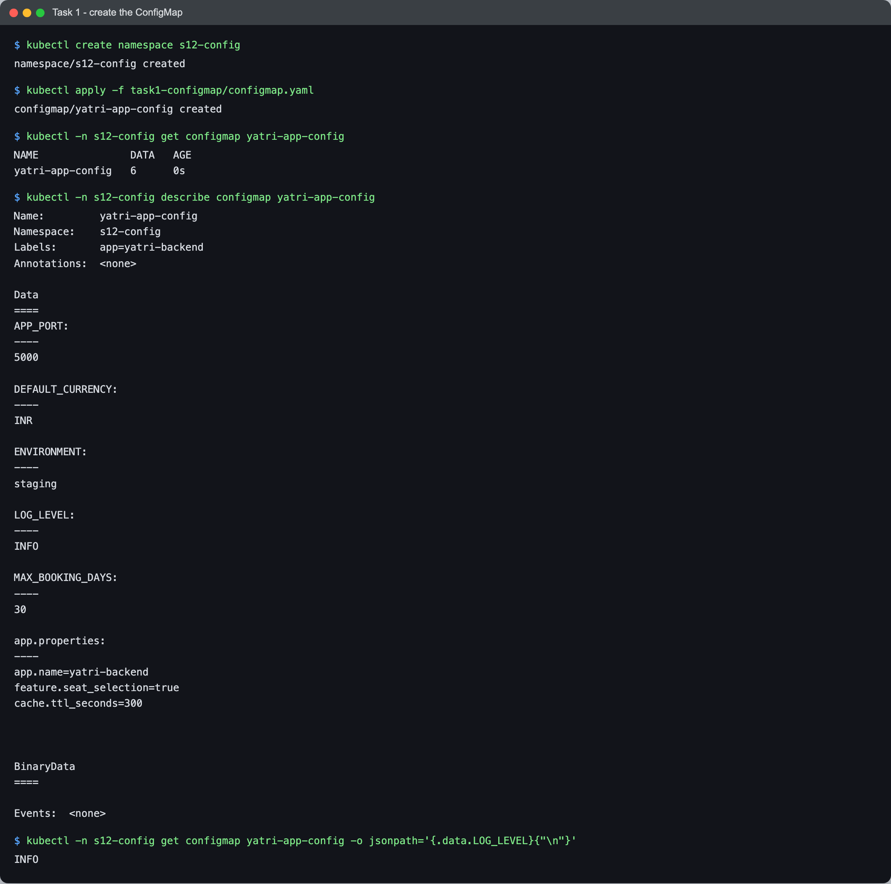

```text
$ kubectl create namespace s12-config
namespace/s12-config created

$ kubectl apply -f task1-configmap/configmap.yaml
configmap/yatri-app-config created

$ kubectl -n s12-config get configmap yatri-app-config
NAME               DATA   AGE
yatri-app-config   6      0s

$ kubectl -n s12-config describe configmap yatri-app-config
Name:         yatri-app-config
Namespace:    s12-config
Labels:       app=yatri-backend
Annotations:  <none>

Data
====
APP_PORT:
----
5000

DEFAULT_CURRENCY:
----
INR

ENVIRONMENT:
----
staging

LOG_LEVEL:
----
INFO

MAX_BOOKING_DAYS:
----
30

app.properties:
----
app.name=yatri-backend
feature.seat_selection=true
cache.ttl_seconds=300


BinaryData
====

Events:  <none>

$ kubectl -n s12-config get configmap yatri-app-config -o jsonpath='{.data.LOG_LEVEL}{"\n"}'
INFO
```

### Inject it into a Pod and verify inside the container

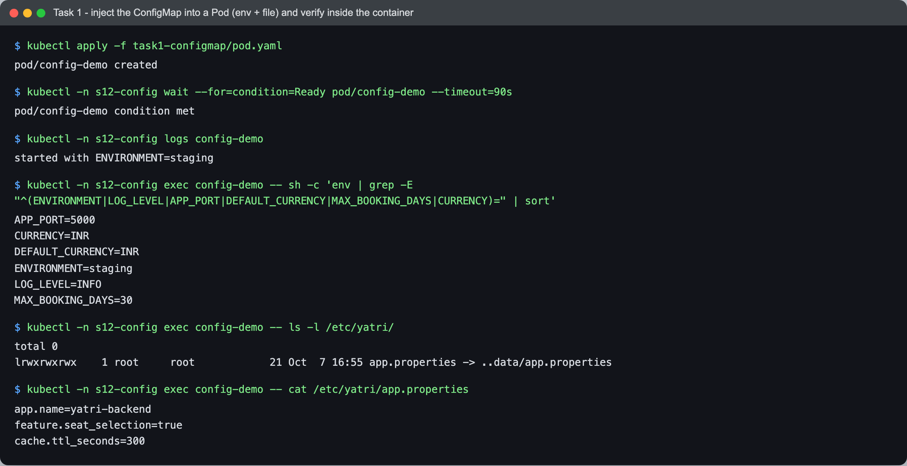

```text
$ kubectl apply -f task1-configmap/pod.yaml
pod/config-demo created

$ kubectl -n s12-config wait --for=condition=Ready pod/config-demo --timeout=90s
pod/config-demo condition met

$ kubectl -n s12-config logs config-demo
started with ENVIRONMENT=staging

$ kubectl -n s12-config exec config-demo -- sh -c 'env | grep -E "^(ENVIRONMENT|LOG_LEVEL|APP_PORT|DEFAULT_CURRENCY|MAX_BOOKING_DAYS|CURRENCY)=" | sort'
APP_PORT=5000
CURRENCY=INR
DEFAULT_CURRENCY=INR
ENVIRONMENT=staging
LOG_LEVEL=INFO
MAX_BOOKING_DAYS=30

$ kubectl -n s12-config exec config-demo -- ls -l /etc/yatri/
total 0
lrwxrwxrwx    1 root     root            21 Oct  7 16:55 app.properties -> ..data/app.properties

$ kubectl -n s12-config exec config-demo -- cat /etc/yatri/app.properties
app.name=yatri-backend
feature.seat_selection=true
cache.ttl_seconds=300
```

All five keys showed up as env vars, `CURRENCY` came from the single-key reference, and the file is there. The file is a symlink into `..data/`, which is how the kubelet swaps in new versions atomically.

### What happens when the ConfigMap changes

I changed `ENVIRONMENT` to `production` and `cache.ttl_seconds` to `600`, then polled the file.

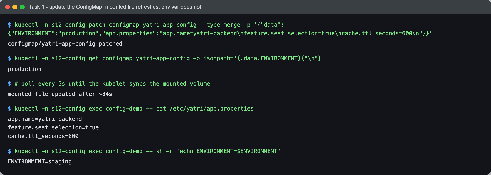

```text
$ kubectl -n s12-config patch configmap yatri-app-config --type merge -p '{"data":{"ENVIRONMENT":"production","app.properties":"app.name=yatri-backend\nfeature.seat_selection=true\ncache.ttl_seconds=600\n"}}'
configmap/yatri-app-config patched

$ kubectl -n s12-config get configmap yatri-app-config -o jsonpath='{.data.ENVIRONMENT}{"\n"}'
production

$ # poll every 5s until the kubelet syncs the mounted volume
mounted file updated after ~84s

$ kubectl -n s12-config exec config-demo -- cat /etc/yatri/app.properties
app.name=yatri-backend
feature.seat_selection=true
cache.ttl_seconds=600

$ kubectl -n s12-config exec config-demo -- sh -c 'echo ENVIRONMENT=$ENVIRONMENT'
ENVIRONMENT=staging
```

**Why this matters:** the mounted file was updated by the kubelet after about 84 seconds, without restarting the Pod. The env var still says `staging`, because environment variables are copied into the process only when the container starts. To pick up env changes you need `kubectl rollout restart` (or a new Pod). So settings that must change live are better as mounted files.

---

## Task 2 - Secret

A Secret is the same idea as a ConfigMap but for sensitive data. Kubernetes treats it a bit more carefully: `describe` hides the values, Secret volumes are `tmpfs` (RAM, not written to the node disk), and access can be locked down with RBAC separately from ConfigMaps.

My [secret.yaml](task2-secret/secret.yaml) stores four fake values. I encoded each with `echo -n ... | base64` (the `-n` matters, see Task 5). The Pod [pod.yaml](task2-secret/pod.yaml) reads the three DB values with `secretKeyRef` env vars and mounts only `PAYMENT_API_KEY` as a read-only file (`defaultMode: 0400`).

### Create the Secret

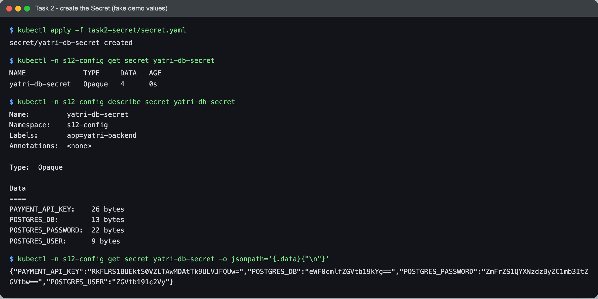

```text
$ kubectl apply -f task2-secret/secret.yaml
secret/yatri-db-secret created

$ kubectl -n s12-config get secret yatri-db-secret
NAME              TYPE     DATA   AGE
yatri-db-secret   Opaque   4      0s

$ kubectl -n s12-config describe secret yatri-db-secret
Name:         yatri-db-secret
Namespace:    s12-config
Labels:       app=yatri-backend
Annotations:  <none>

Type:  Opaque

Data
====
PAYMENT_API_KEY:    26 bytes
POSTGRES_DB:        13 bytes
POSTGRES_PASSWORD:  22 bytes
POSTGRES_USER:      9 bytes

$ kubectl -n s12-config get secret yatri-db-secret -o jsonpath='{.data}{"\n"}'
{"PAYMENT_API_KEY":"RkFLRS1BUEktS0VZLTAwMDAtTk9ULVJFQUw=","POSTGRES_DB":"eWF0cmlfZGVtb19kYg==","POSTGRES_PASSWORD":"ZmFrZS1QYXNzdzByZC1mb3ItZGVtbw==","POSTGRES_USER":"ZGVtb191c2Vy"}
```

`describe` only shows byte counts, but `-o jsonpath='{.data}'` shows the base64 strings to anyone who is allowed to `get` Secrets.

### Inject it into a Pod and verify inside the container

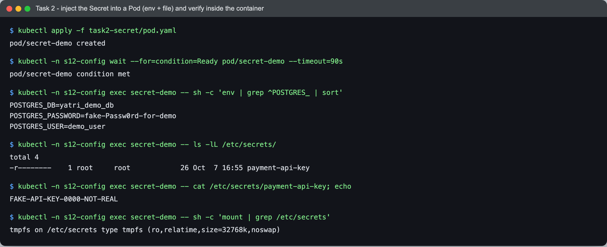

```text
$ kubectl apply -f task2-secret/pod.yaml
pod/secret-demo created

$ kubectl -n s12-config wait --for=condition=Ready pod/secret-demo --timeout=90s
pod/secret-demo condition met

$ kubectl -n s12-config exec secret-demo -- sh -c 'env | grep ^POSTGRES_ | sort'
POSTGRES_DB=yatri_demo_db
POSTGRES_PASSWORD=fake-Passw0rd-for-demo
POSTGRES_USER=demo_user

$ kubectl -n s12-config exec secret-demo -- ls -lL /etc/secrets/
total 4
-r--------    1 root     root            26 Oct  7 16:55 payment-api-key

$ kubectl -n s12-config exec secret-demo -- cat /etc/secrets/payment-api-key; echo
FAKE-API-KEY-0000-NOT-REAL

$ kubectl -n s12-config exec secret-demo -- sh -c 'mount | grep /etc/secrets'
tmpfs on /etc/secrets type tmpfs (ro,relatime,size=32768k,noswap)
```

The container sees plain text values (Kubernetes decodes base64 for you). The key file is mode `0400` and the mount is `tmpfs`.

### Why Secrets must not be committed to Git

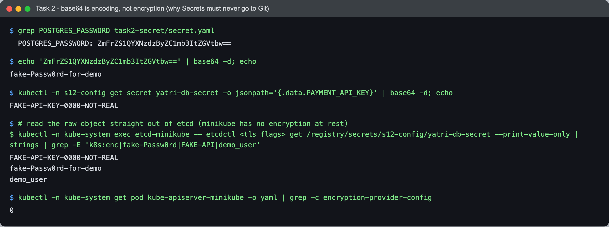

```text
$ grep POSTGRES_PASSWORD task2-secret/secret.yaml
  POSTGRES_PASSWORD: ZmFrZS1QYXNzdzByZC1mb3ItZGVtbw==

$ echo 'ZmFrZS1QYXNzdzByZC1mb3ItZGVtbw==' | base64 -d; echo
fake-Passw0rd-for-demo

$ kubectl -n s12-config get secret yatri-db-secret -o jsonpath='{.data.PAYMENT_API_KEY}' | base64 -d; echo
FAKE-API-KEY-0000-NOT-REAL

$ # read the raw object straight out of etcd (minikube has no encryption at rest)

$ kubectl -n kube-system exec etcd-minikube -- etcdctl <tls flags> get /registry/secrets/s12-config/yatri-db-secret --print-value-only | strings | grep -E 'k8s:enc|fake-Passw0rd|FAKE-API|demo_user'
FAKE-API-KEY-0000-NOT-REAL
fake-Passw0rd-for-demo
demo_user

$ kubectl -n kube-system get pod kube-apiserver-minikube -o yaml | grep -c encryption-provider-config
0
```

`<tls flags>` is shortened in the transcript. The full flags I ran were `--endpoints=https://127.0.0.1:2379 --cacert=/var/lib/minikube/certs/etcd/ca.crt --cert=/var/lib/minikube/certs/etcd/server.crt --key=/var/lib/minikube/certs/etcd/server.key`. The `k8s:enc` pattern would match if the value were encrypted at rest; it matched nothing.

What this proves:

1. **base64 is encoding, not encryption.** There is no key. Anyone who sees the YAML in a Git repo can run `base64 -d` and read the password, like I did with the line straight from my own file. Git also keeps history forever, so deleting the file later does not help; a leaked secret has to be rotated.
2. **By default the Secret is stored in plain text in etcd.** I read the raw object out of minikube's etcd and the password and API key are right there. The API server has no `--encryption-provider-config` flag (count `0`), so encryption at rest is off.

What I would do in a real project:

- Turn on **encryption at rest** for Secrets in etcd (`EncryptionConfiguration` with `aescbc`/`secretbox`, or a KMS provider on EKS/GKE/AKS).
- Use **RBAC** so only the service accounts and people who need a Secret can `get`/`list` it. `list` on Secrets is basically read access to all of them.
- Keep real values out of Git: **External Secrets Operator** (pulls from AWS Secrets Manager, Vault, GCP Secret Manager, Azure Key Vault), **Sealed Secrets** (commit an encrypted `SealedSecret` that only the in-cluster controller can decrypt), or **SOPS** (encrypt the values in the YAML with age/KMS keys).
- Add a secret scanner (gitleaks, trufflehog, GitHub push protection) so a mistake gets blocked before it is pushed.

The values in `task2-secret/secret.yaml` are committed only because they are fake and the point of the task is to show them.

---

## Task 3 - Ingress

Without Ingress each app needs its own NodePort or LoadBalancer. With Ingress there is one entry point (the ingress-nginx controller) and rules decide which Service gets each request, by host name and/or URL path.

### Deploy the apps and Services

[apps.yaml](task3-ingress/apps.yaml) runs two small apps, both `nginx:1.25-alpine` with their config from ConfigMaps:

- `frontend` serves an HTML page that prints the pod name, Host header and path (nginx SSI).
- `api` returns JSON with the pod name, path and host.

Both have 2 replicas and a ClusterIP Service, so neither is reachable from outside on its own.

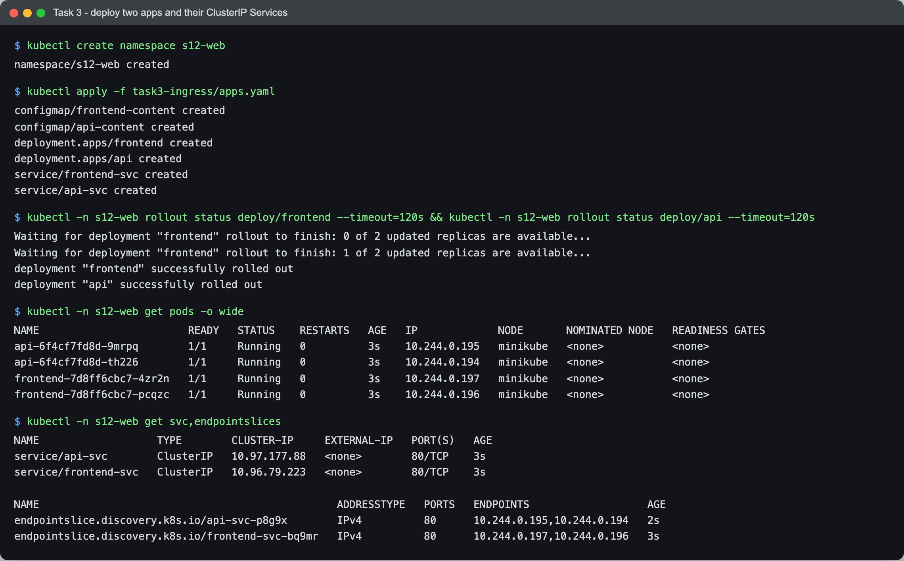

```text
$ kubectl create namespace s12-web
namespace/s12-web created

$ kubectl apply -f task3-ingress/apps.yaml
configmap/frontend-content created
configmap/api-content created
deployment.apps/frontend created
deployment.apps/api created
service/frontend-svc created
service/api-svc created

$ kubectl -n s12-web rollout status deploy/frontend --timeout=120s && kubectl -n s12-web rollout status deploy/api --timeout=120s
Waiting for deployment "frontend" rollout to finish: 0 of 2 updated replicas are available...
Waiting for deployment "frontend" rollout to finish: 1 of 2 updated replicas are available...
deployment "frontend" successfully rolled out
deployment "api" successfully rolled out

$ kubectl -n s12-web get pods -o wide
NAME                        READY   STATUS    RESTARTS   AGE   IP             NODE       NOMINATED NODE   READINESS GATES
api-6f4cf7fd8d-9mrpq        1/1     Running   0          3s    10.244.0.195   minikube   <none>           <none>
api-6f4cf7fd8d-th226        1/1     Running   0          3s    10.244.0.194   minikube   <none>           <none>
frontend-7d8ff6cbc7-4zr2n   1/1     Running   0          3s    10.244.0.197   minikube   <none>           <none>
frontend-7d8ff6cbc7-pcqzc   1/1     Running   0          3s    10.244.0.196   minikube   <none>           <none>

$ kubectl -n s12-web get svc,endpointslices
NAME                   TYPE        CLUSTER-IP     EXTERNAL-IP   PORT(S)   AGE
service/api-svc        ClusterIP   10.97.177.88   <none>        80/TCP    3s
service/frontend-svc   ClusterIP   10.96.79.223   <none>        80/TCP    3s

NAME                                                ADDRESSTYPE   PORTS   ENDPOINTS                   AGE
endpointslice.discovery.k8s.io/api-svc-p8g9x        IPv4          80      10.244.0.195,10.244.0.194   2s
endpointslice.discovery.k8s.io/frontend-svc-bq9mr   IPv4          80      10.244.0.197,10.244.0.196   3s
```

### Configure the Ingress rules

Path-based, [ingress-path.yaml](task3-ingress/ingress-path.yaml):

```yaml
spec:
  ingressClassName: nginx
  rules:
    - host: shop.127.0.0.1.nip.io
      http:
        paths:
          - path: /api
            pathType: Prefix
            backend: {service: {name: api-svc, port: {number: 80}}}
          - path: /
            pathType: Prefix
            backend: {service: {name: frontend-svc, port: {number: 80}}}
```

Host-based, [ingress-host.yaml](task3-ingress/ingress-host.yaml): `web.127.0.0.1.nip.io` goes to `frontend-svc` and `api.127.0.0.1.nip.io` goes to `api-svc`.

I used `nip.io` names because `anything.127.0.0.1.nip.io` resolves to `127.0.0.1` through public DNS, so I did not need to edit `/etc/hosts`. On macOS with the docker driver the minikube node IP (`192.168.49.2`) is not reachable from the Mac, so I port-forwarded the controller Service to local port 18280:

```bash
kubectl -n ingress-nginx port-forward svc/ingress-nginx-controller 18280:80
```

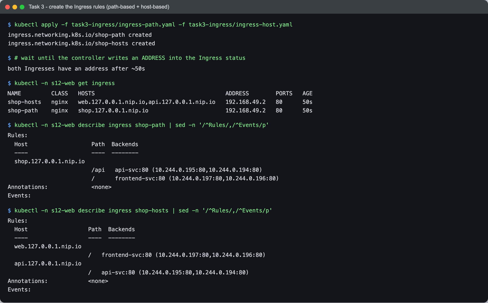

```text
$ kubectl apply -f task3-ingress/ingress-path.yaml -f task3-ingress/ingress-host.yaml
ingress.networking.k8s.io/shop-path created
ingress.networking.k8s.io/shop-hosts created

$ # wait until the controller writes an ADDRESS into the Ingress status
both Ingresses have an address after ~50s

$ kubectl -n s12-web get ingress
NAME         CLASS   HOSTS                                       ADDRESS        PORTS   AGE
shop-hosts   nginx   web.127.0.0.1.nip.io,api.127.0.0.1.nip.io   192.168.49.2   80      50s
shop-path    nginx   shop.127.0.0.1.nip.io                       192.168.49.2   80      50s

$ kubectl -n s12-web describe ingress shop-path | sed -n '/^Rules/,/^Events/p'
Rules:
  Host                   Path  Backends
  ----                   ----  --------
  shop.127.0.0.1.nip.io  
                         /api   api-svc:80 (10.244.0.195:80,10.244.0.194:80)
                         /      frontend-svc:80 (10.244.0.197:80,10.244.0.196:80)
Annotations:             <none>
Events:

$ kubectl -n s12-web describe ingress shop-hosts | sed -n '/^Rules/,/^Events/p'
Rules:
  Host                  Path  Backends
  ----                  ----  --------
  web.127.0.0.1.nip.io  
                        /   frontend-svc:80 (10.244.0.197:80,10.244.0.196:80)
  api.127.0.0.1.nip.io  
                        /   api-svc:80 (10.244.0.195:80,10.244.0.194:80)
Annotations:            <none>
Events:
```

### Access through the Ingress and verify routing

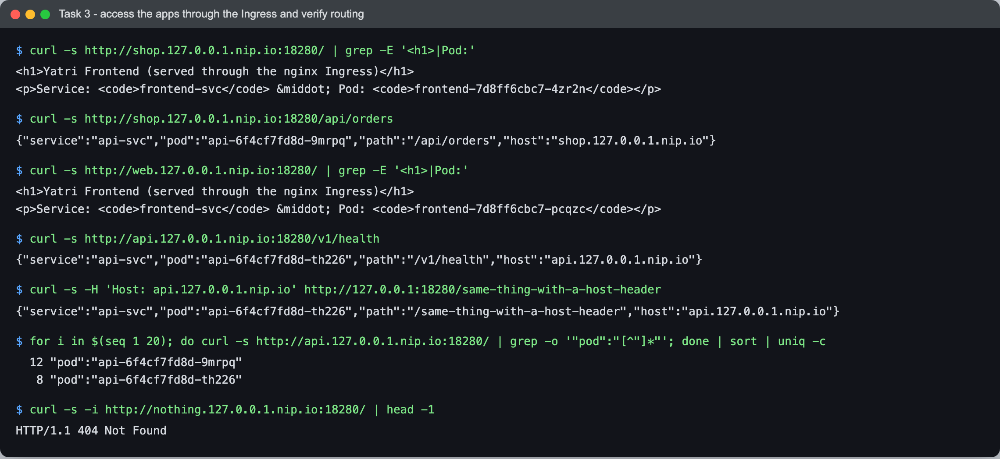

```text
$ curl -s http://shop.127.0.0.1.nip.io:18280/ | grep -E '<h1>|Pod:'
<h1>Yatri Frontend (served through the nginx Ingress)</h1>
<p>Service: <code>frontend-svc</code> &middot; Pod: <code>frontend-7d8ff6cbc7-4zr2n</code></p>

$ curl -s http://shop.127.0.0.1.nip.io:18280/api/orders
{"service":"api-svc","pod":"api-6f4cf7fd8d-9mrpq","path":"/api/orders","host":"shop.127.0.0.1.nip.io"}

$ curl -s http://web.127.0.0.1.nip.io:18280/ | grep -E '<h1>|Pod:'
<h1>Yatri Frontend (served through the nginx Ingress)</h1>
<p>Service: <code>frontend-svc</code> &middot; Pod: <code>frontend-7d8ff6cbc7-pcqzc</code></p>

$ curl -s http://api.127.0.0.1.nip.io:18280/v1/health
{"service":"api-svc","pod":"api-6f4cf7fd8d-th226","path":"/v1/health","host":"api.127.0.0.1.nip.io"}

$ curl -s -H 'Host: api.127.0.0.1.nip.io' http://127.0.0.1:18280/same-thing-with-a-host-header
{"service":"api-svc","pod":"api-6f4cf7fd8d-th226","path":"/same-thing-with-a-host-header","host":"api.127.0.0.1.nip.io"}

$ for i in $(seq 1 20); do curl -s http://api.127.0.0.1.nip.io:18280/ | grep -o '"pod":"[^"]*"'; done | sort | uniq -c
  12 "pod":"api-6f4cf7fd8d-9mrpq"
   8 "pod":"api-6f4cf7fd8d-th226"

$ curl -s -i http://nothing.127.0.0.1.nip.io:18280/ | head -1
HTTP/1.1 404 Not Found
```

What each check shows:

- Same host `shop.`, path `/` went to the frontend and `/api/orders` went to the api. That is path routing. `Prefix` matching picks the longest matching path, so `/api` wins over `/` no matter the order.
- `web.` and `api.` on the same port went to different Services. That is host routing, and the `-H 'Host: ...'` call proves the controller only looks at the Host header, not the IP.
- 20 requests were split 12/8 between the two api pods, so the controller load-balances across the Service endpoints.
- A host with no rule got `404` from the controller's default backend.

### Browser screenshots

Taken with Playwright (Chromium) against the live port-forward. The address bar shows the real URL that was loaded.

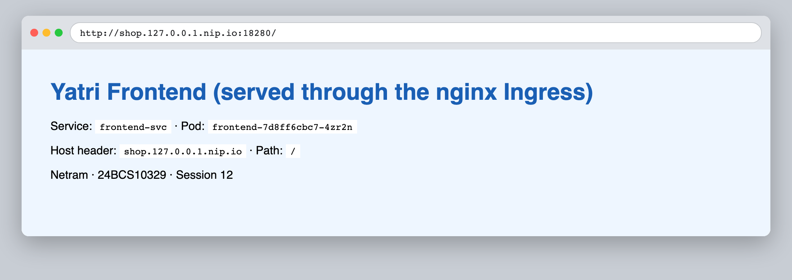

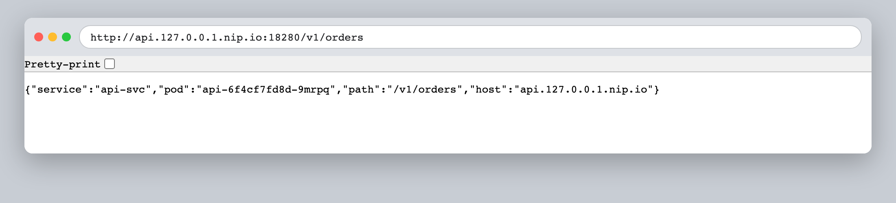

---

## Task 4 - Ingress vs Ingress Controller

Full write-up with a live demo: [ingress-vs-ingress-controller/README.md](ingress-vs-ingress-controller/README.md).

Short version: an **Ingress** is only a set of routing rules stored in the API server. An **Ingress Controller** is a real program (here an nginx pod) that watches those rules and turns them into proxy config. I created the same rule twice: with `ingressClassName: does-not-exist` it never got an ADDRESS and returned 404; with `ingressClassName: nginx` it got an address, the controller wrote a `server` block into its `nginx.conf`, and it returned 200.

---

## Task 5 - Troubleshooting: the trailing-newline Secret bug

The course troubleshooting folder ([../troubleshooting/secret-base64-gotcha.md](../troubleshooting/secret-base64-gotcha.md)) describes a Postgres login failing because a password was encoded with `echo` instead of `echo -n`. I rebuilt that incident for real in namespace `s12-debug`:

- [postgres.yaml](task5-troubleshooting/postgres.yaml): `postgres:16-alpine` with its own admin Secret (made with `stringData`, so no newline).
- [app-db-secret-broken.yaml](task5-troubleshooting/app-db-secret-broken.yaml): the app team's Secret, password encoded with plain `echo`.
- [app.yaml](task5-troubleshooting/app.yaml): a small backend that logs in with `psql` at start-up and exits 1 if the login fails.

### Before: the problem

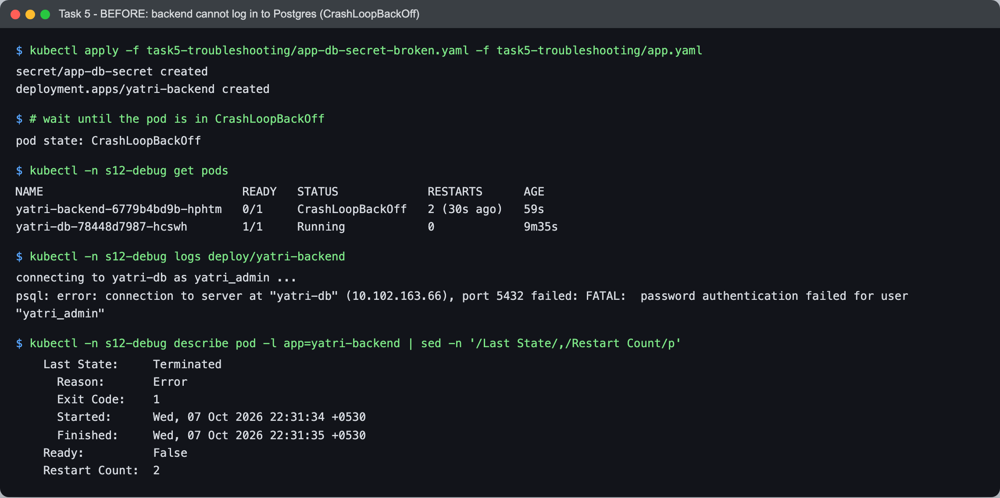

```text
$ kubectl apply -f task5-troubleshooting/app-db-secret-broken.yaml -f task5-troubleshooting/app.yaml
secret/app-db-secret created
deployment.apps/yatri-backend created

$ # wait until the pod is in CrashLoopBackOff
pod state: CrashLoopBackOff

$ kubectl -n s12-debug get pods
NAME                             READY   STATUS             RESTARTS      AGE
yatri-backend-6779b4bd9b-hphtm   0/1     CrashLoopBackOff   2 (30s ago)   59s
yatri-db-78448d7987-hcswh        1/1     Running            0             9m35s

$ kubectl -n s12-debug logs deploy/yatri-backend
connecting to yatri-db as yatri_admin ...
psql: error: connection to server at "yatri-db" (10.102.163.66), port 5432 failed: FATAL:  password authentication failed for user "yatri_admin"

$ kubectl -n s12-debug describe pod -l app=yatri-backend | sed -n '/Last State/,/Restart Count/p'
    Last State:     Terminated
      Reason:       Error
      Exit Code:    1
      Started:      Wed, 07 Oct 2026 22:31:34 +0530
      Finished:     Wed, 07 Oct 2026 22:31:35 +0530
    Ready:          False
    Restart Count:  2
```

Symptom: the backend is in `CrashLoopBackOff` with exit code 1, and its log says `password authentication failed`. The user name and host are right, and the DB pod is healthy, so networking and DNS are fine.

### Investigation: find the root cause

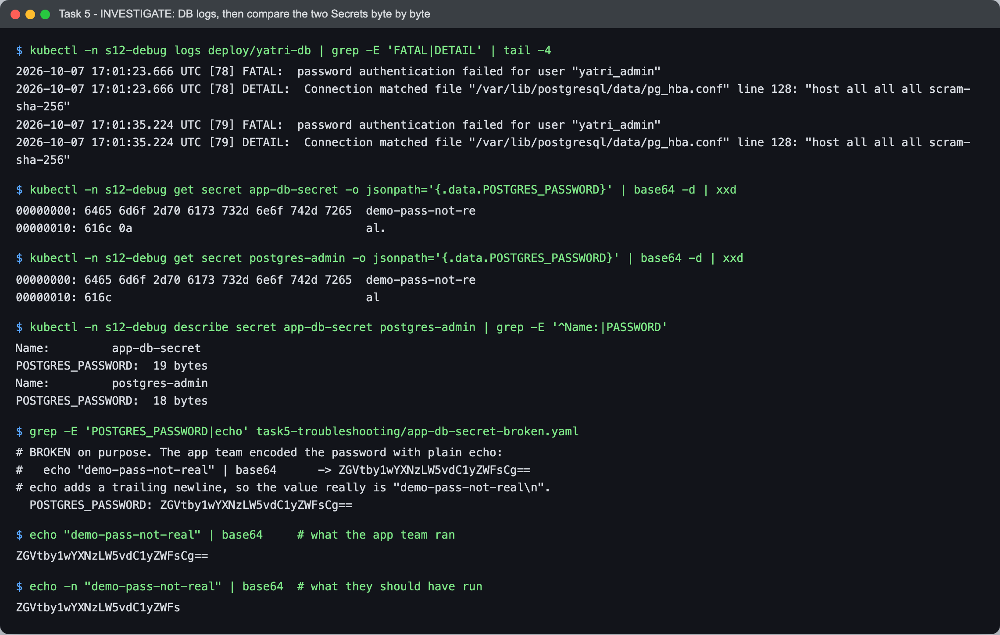

```text
$ kubectl -n s12-debug logs deploy/yatri-db | grep -E 'FATAL|DETAIL' | tail -4
2026-10-07 17:01:23.666 UTC [78] FATAL:  password authentication failed for user "yatri_admin"
2026-10-07 17:01:23.666 UTC [78] DETAIL:  Connection matched file "/var/lib/postgresql/data/pg_hba.conf" line 128: "host all all all scram-sha-256"
2026-10-07 17:01:35.224 UTC [79] FATAL:  password authentication failed for user "yatri_admin"
2026-10-07 17:01:35.224 UTC [79] DETAIL:  Connection matched file "/var/lib/postgresql/data/pg_hba.conf" line 128: "host all all all scram-sha-256"

$ kubectl -n s12-debug get secret app-db-secret -o jsonpath='{.data.POSTGRES_PASSWORD}' | base64 -d | xxd
00000000: 6465 6d6f 2d70 6173 732d 6e6f 742d 7265  demo-pass-not-re
00000010: 616c 0a                                  al.

$ kubectl -n s12-debug get secret postgres-admin -o jsonpath='{.data.POSTGRES_PASSWORD}' | base64 -d | xxd
00000000: 6465 6d6f 2d70 6173 732d 6e6f 742d 7265  demo-pass-not-re
00000010: 616c                                     al

$ kubectl -n s12-debug describe secret app-db-secret postgres-admin | grep -E '^Name:|PASSWORD'
Name:         app-db-secret
POSTGRES_PASSWORD:  19 bytes
Name:         postgres-admin
POSTGRES_PASSWORD:  18 bytes

$ grep -E 'POSTGRES_PASSWORD|echo' task5-troubleshooting/app-db-secret-broken.yaml
# BROKEN on purpose. The app team encoded the password with plain echo:
#   echo "demo-pass-not-real" | base64      -> ZGVtby1wYXNzLW5vdC1yZWFsCg==
# echo adds a trailing newline, so the value really is "demo-pass-not-real\n".
  POSTGRES_PASSWORD: ZGVtby1wYXNzLW5vdC1yZWFsCg==

$ echo "demo-pass-not-real" | base64     # what the app team ran
ZGVtby1wYXNzLW5vdC1yZWFsCg==

$ echo -n "demo-pass-not-real" | base64  # what they should have run
ZGVtby1wYXNzLW5vdC1yZWFs
```

How I got to the root cause:

1. The Postgres log confirms the connection reached the server and was rejected by `scram-sha-256` password auth. So it is the password, not the network.
2. Both Secrets "contain the same password" when you look at them casually, so I dumped the raw bytes with `xxd`. The app Secret ends in `0a` (a newline); the DB Secret does not.
3. `describe` agrees: 19 bytes vs 18 bytes.
4. The base64 in the broken YAML ends in `Cg==`. Re-running both commands shows that `echo` produces exactly that string and `echo -n` does not.

**Root cause:** the app Secret was encoded with `echo "..." | base64`. `echo` appends `\n`, so the backend sent `demo-pass-not-real\n` and Postgres correctly rejected it.

### Fix and after

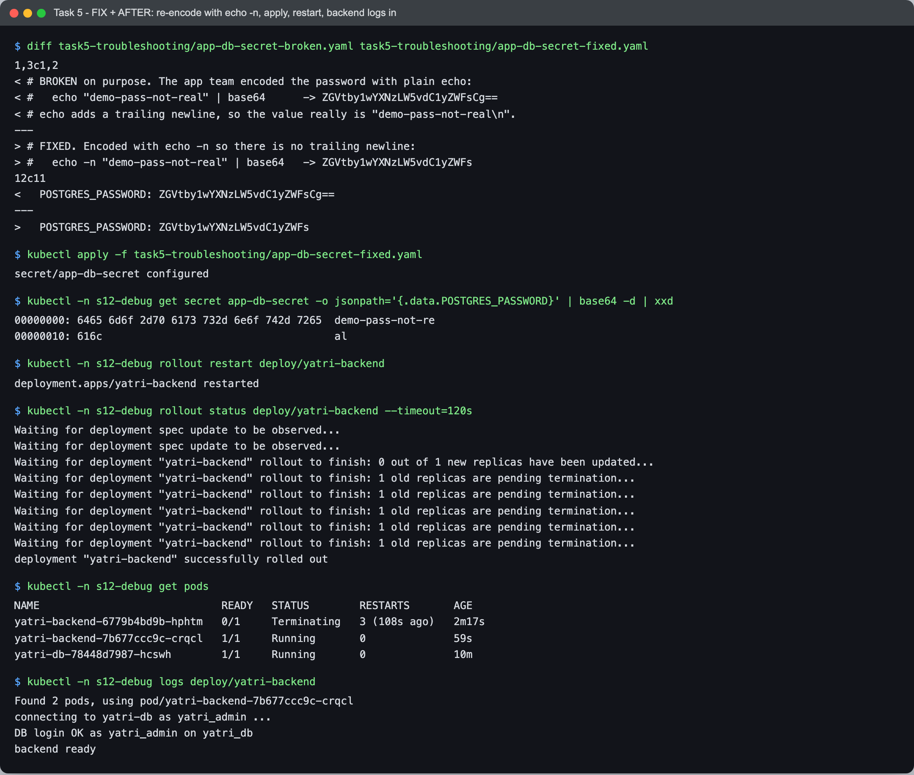

```text
$ diff task5-troubleshooting/app-db-secret-broken.yaml task5-troubleshooting/app-db-secret-fixed.yaml
1,3c1,2
< # BROKEN on purpose. The app team encoded the password with plain echo:
< #   echo "demo-pass-not-real" | base64      -> ZGVtby1wYXNzLW5vdC1yZWFsCg==
< # echo adds a trailing newline, so the value really is "demo-pass-not-real\n".
---
> # FIXED. Encoded with echo -n so there is no trailing newline:
> #   echo -n "demo-pass-not-real" | base64   -> ZGVtby1wYXNzLW5vdC1yZWFs
12c11
<   POSTGRES_PASSWORD: ZGVtby1wYXNzLW5vdC1yZWFsCg==
---
>   POSTGRES_PASSWORD: ZGVtby1wYXNzLW5vdC1yZWFs

$ kubectl apply -f task5-troubleshooting/app-db-secret-fixed.yaml
secret/app-db-secret configured

$ kubectl -n s12-debug get secret app-db-secret -o jsonpath='{.data.POSTGRES_PASSWORD}' | base64 -d | xxd
00000000: 6465 6d6f 2d70 6173 732d 6e6f 742d 7265  demo-pass-not-re
00000010: 616c                                     al

$ kubectl -n s12-debug rollout restart deploy/yatri-backend
deployment.apps/yatri-backend restarted

$ kubectl -n s12-debug rollout status deploy/yatri-backend --timeout=120s
Waiting for deployment spec update to be observed...
Waiting for deployment spec update to be observed...
Waiting for deployment "yatri-backend" rollout to finish: 0 out of 1 new replicas have been updated...
Waiting for deployment "yatri-backend" rollout to finish: 1 old replicas are pending termination...
Waiting for deployment "yatri-backend" rollout to finish: 1 old replicas are pending termination...
Waiting for deployment "yatri-backend" rollout to finish: 1 old replicas are pending termination...
Waiting for deployment "yatri-backend" rollout to finish: 1 old replicas are pending termination...
Waiting for deployment "yatri-backend" rollout to finish: 1 old replicas are pending termination...
deployment "yatri-backend" successfully rolled out

$ kubectl -n s12-debug get pods
NAME                             READY   STATUS        RESTARTS       AGE
yatri-backend-6779b4bd9b-hphtm   0/1     Terminating   3 (108s ago)   2m17s
yatri-backend-7b677ccc9c-crqcl   1/1     Running       0              59s
yatri-db-78448d7987-hcswh        1/1     Running       0              10m

$ kubectl -n s12-debug logs deploy/yatri-backend
Found 2 pods, using pod/yatri-backend-7b677ccc9c-crqcl
connecting to yatri-db as yatri_admin ...
DB login OK as yatri_admin on yatri_db
backend ready
```

Fix: re-encode with `echo -n` ([app-db-secret-fixed.yaml](task5-troubleshooting/app-db-secret-fixed.yaml)), apply it, and restart the Deployment. The restart is needed because Secret values used as env vars are only read when a container starts. After the restart the new pod is `Running` with 0 restarts and logs `DB login OK as yatri_admin on yatri_db`.

How to avoid it next time: use `kubectl create secret generic --from-literal=...` or `stringData:` instead of hand-encoding, or always `echo -n` / `printf '%s'`. When a password "looks right" but fails, check `wc -c` or `xxd`.

---

## What I learned

- ConfigMaps and Secrets keep config out of the image. Env vars are fixed at container start; mounted files are refreshed by the kubelet (about 84 s in my test).
- A Secret is only base64. It is readable by anyone with `get` access, it sits in plain text in etcd unless encryption at rest is turned on, and it must never be committed with real values.
- I also noticed in etcd that `kubectl apply` on a Secret written with `stringData` stores the plain text again inside the `last-applied-configuration` annotation. Another reason to keep real Secrets out of applied YAML.
- Ingress gives one entry point with host and path rules, but it does nothing without a controller. The `ingressClassName` is how an Ingress picks its controller.
- `xxd` is the fastest way to catch invisible characters in a Secret.

## Problems I hit

- **Empty `kubectl logs` right after the Pod was Ready.** The first run of Task 1 printed nothing for `kubectl logs config-demo`; a second later the line was there. I re-ran that step with a 2 second pause.
- **Noisy polling loop.** My first wait loop for the ConfigMap file printed `command terminated with exit code 1` on every try (that is `grep -q` not finding the new value yet). I sent stderr to `/dev/null` and re-captured.
- **ConfigMap update was not instant.** The mounted file took about 84 to 86 seconds to change in both runs, because of the kubelet sync period and cache. Env vars never changed.
- **Ingress ADDRESS was empty for a while.** Both Ingresses only got `192.168.49.2` about 50 seconds after creation, so I added a wait loop before checking.
- **Load balancing looked sticky with few requests.** My first test with 6 requests hit the same api pod every time. With 20 requests it split 12/8. My understanding is that ingress-nginx keeps the round-robin state per nginx worker process, so a small sample can look one-sided.
- **The `grep 'server_name <host>'` from the task did not match.** On ingress-nginx v1.15.1 the generated config quotes the host: `server_name "real.127.0.0.1.nip.io" ;`. I changed the grep to include the quotes (both attempts are shown in the Task 4 README).
- **Node IP not reachable from macOS.** With the docker driver, `192.168.49.2` is inside Docker's VM, so I used `kubectl port-forward` to the controller Service on port 18280.

## Cleanup

```bash
kubectl delete namespace s12-config s12-web s12-debug
kill <port-forward pid>
```
