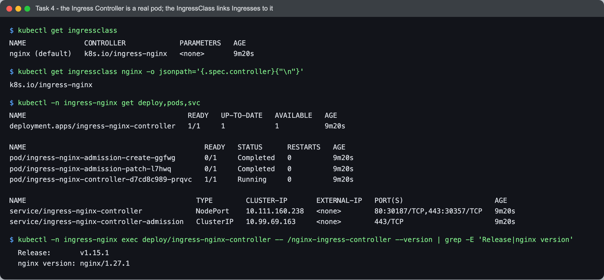
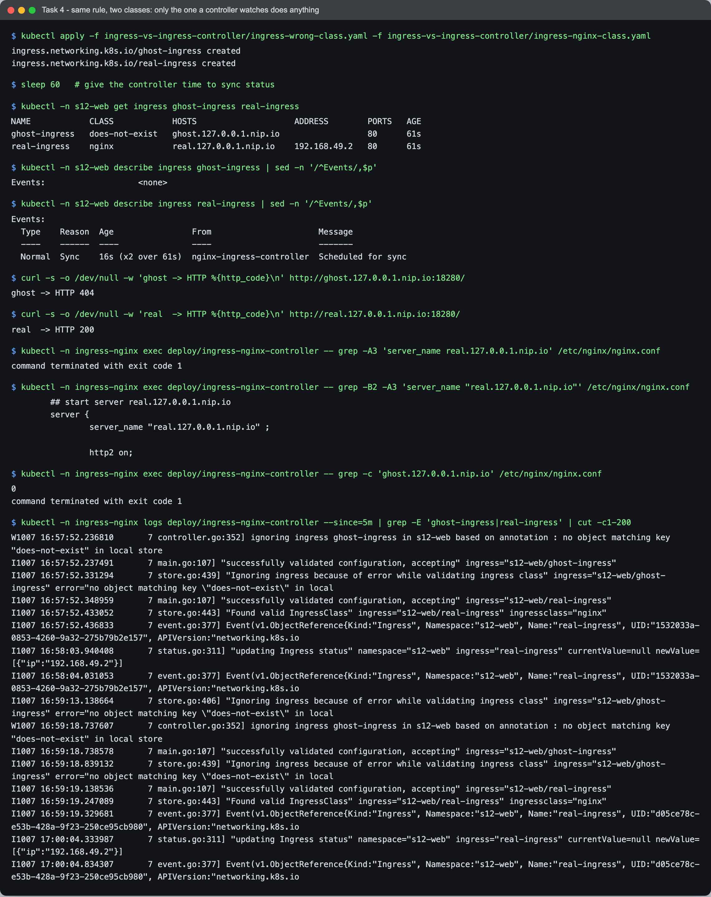

# Ingress vs Ingress Controller

- **Name:** Netram
- **Enrollment No:** 24BCS10329

Part of [Session 12](../README.md), Task 4. Manifests: [ingress-wrong-class.yaml](ingress-wrong-class.yaml), [ingress-nginx-class.yaml](ingress-nginx-class.yaml).

## What is an Ingress?

An Ingress is a Kubernetes API object (`networking.k8s.io/v1`, kind `Ingress`) that describes **how outside HTTP/HTTPS traffic should reach Services inside the cluster**. It is just data stored in the API server (etcd):

- which host names to answer (`shop.example.com`),
- which URL paths go to which Service and port (`/api` to `api-svc:80`),
- optional TLS settings (which Secret holds the certificate),
- an `ingressClassName` saying which controller should handle it.

Creating an Ingress does not open a port, start a proxy or route a single packet by itself.

## What is an Ingress Controller?

An Ingress Controller is a **real program running in the cluster**, usually a Deployment of reverse-proxy pods plus a Service that exposes them. It:

1. watches the API server for Ingress, Service, EndpointSlice and Secret objects that belong to its IngressClass,
2. turns those rules into its own proxy config (for ingress-nginx, an `nginx.conf` plus Lua-managed upstreams),
3. receives the actual traffic on ports 80/443 and forwards each request to a pod of the matching Service,
4. writes its address back into the Ingress `status`, which is the ADDRESS column.

Examples: **ingress-nginx** (what minikube's addon installs and what I used), **Traefik**, **HAProxy Ingress**, **Contour/Envoy**, **Kong**, and the cloud ones like **AWS Load Balancer Controller** (creates an ALB) and **GKE Ingress** (creates a Google HTTP(S) load balancer).

## The difference in one table

| | Ingress | Ingress Controller |
| --- | --- | --- |
| What it is | A YAML object with routing rules | A running program (pods) |
| Where it lives | In the API server / etcd | As pods in a namespace, e.g. `ingress-nginx` |
| Who writes it | App developers, one per app or team | Platform team installs it once per cluster |
| Handles traffic? | No | Yes, it is the reverse proxy |
| Comparison | Like an nginx `server {}` block written on paper | Like the nginx process that reads it and serves requests |
| Linked by | `spec.ingressClassName: nginx` | `IngressClass` with `spec.controller: k8s.io/ingress-nginx` |

## Why both are required

- **Ingress without a controller:** the rules are stored but nothing reads them. No address, no config, no traffic. Kubernetes does not ship a built-in controller (unlike Deployments, which kube-controller-manager handles).
- **Controller without Ingress objects:** the proxy runs but has no rules, so every request gets the default backend's 404.
- Splitting them lets developers describe routing in a portable way (the same Ingress works on any cluster), while each cluster picks the implementation that fits it: nginx on minikube, an ALB on AWS, and so on. The `IngressClass` lets several controllers run side by side, each owning only its own Ingresses.

## Live demo

### The controller is a real pod



```text
$ kubectl get ingressclass
NAME              CONTROLLER             PARAMETERS   AGE
nginx (default)   k8s.io/ingress-nginx   <none>       9m20s

$ kubectl get ingressclass nginx -o jsonpath='{.spec.controller}{"\n"}'
k8s.io/ingress-nginx

$ kubectl -n ingress-nginx get deploy,pods,svc
NAME                                       READY   UP-TO-DATE   AVAILABLE   AGE
deployment.apps/ingress-nginx-controller   1/1     1            1           9m20s

NAME                                           READY   STATUS      RESTARTS   AGE
pod/ingress-nginx-admission-create-ggfwg       0/1     Completed   0          9m20s
pod/ingress-nginx-admission-patch-l7hwq        0/1     Completed   0          9m20s
pod/ingress-nginx-controller-d7cd8c989-prqvc   1/1     Running     0          9m20s

NAME                                         TYPE        CLUSTER-IP       EXTERNAL-IP   PORT(S)                      AGE
service/ingress-nginx-controller             NodePort    10.111.160.238   <none>        80:30187/TCP,443:30357/TCP   9m20s
service/ingress-nginx-controller-admission   ClusterIP   10.99.69.163     <none>        443/TCP                      9m20s

$ kubectl -n ingress-nginx exec deploy/ingress-nginx-controller -- /nginx-ingress-controller --version | grep -E 'Release|nginx version'
  Release:       v1.15.1
  nginx version: nginx/1.27.1
```

The `nginx` IngressClass points at controller `k8s.io/ingress-nginx`, and that controller is the `ingress-nginx-controller` pod (nginx 1.27.1 inside, controller v1.15.1). The two `admission` pods are one-time Jobs that set up the validating webhook.

### Same rule, two classes

Both Ingresses send `/` to `frontend-svc`. The only difference is `ingressClassName`: `does-not-exist` for `ghost-ingress` and `nginx` for `real-ingress`.



```text
$ kubectl apply -f ingress-vs-ingress-controller/ingress-wrong-class.yaml -f ingress-vs-ingress-controller/ingress-nginx-class.yaml
ingress.networking.k8s.io/ghost-ingress created
ingress.networking.k8s.io/real-ingress created

$ sleep 60   # give the controller time to sync status

$ kubectl -n s12-web get ingress ghost-ingress real-ingress
NAME            CLASS            HOSTS                    ADDRESS        PORTS   AGE
ghost-ingress   does-not-exist   ghost.127.0.0.1.nip.io                  80      61s
real-ingress    nginx            real.127.0.0.1.nip.io    192.168.49.2   80      61s

$ kubectl -n s12-web describe ingress ghost-ingress | sed -n '/^Events/,$p'
Events:                   <none>

$ kubectl -n s12-web describe ingress real-ingress | sed -n '/^Events/,$p'
Events:
  Type    Reason  Age                From                      Message
  ----    ------  ----               ----                      -------
  Normal  Sync    16s (x2 over 61s)  nginx-ingress-controller  Scheduled for sync

$ curl -s -o /dev/null -w 'ghost -> HTTP %{http_code}\n' http://ghost.127.0.0.1.nip.io:18280/
ghost -> HTTP 404

$ curl -s -o /dev/null -w 'real  -> HTTP %{http_code}\n' http://real.127.0.0.1.nip.io:18280/
real  -> HTTP 200

$ kubectl -n ingress-nginx exec deploy/ingress-nginx-controller -- grep -A3 'server_name real.127.0.0.1.nip.io' /etc/nginx/nginx.conf
command terminated with exit code 1

$ kubectl -n ingress-nginx exec deploy/ingress-nginx-controller -- grep -B2 -A3 'server_name "real.127.0.0.1.nip.io"' /etc/nginx/nginx.conf
	## start server real.127.0.0.1.nip.io
	server {
		server_name "real.127.0.0.1.nip.io" ;
		
		http2 on;

$ kubectl -n ingress-nginx exec deploy/ingress-nginx-controller -- grep -c 'ghost.127.0.0.1.nip.io' /etc/nginx/nginx.conf
0
command terminated with exit code 1

$ kubectl -n ingress-nginx logs deploy/ingress-nginx-controller --since=5m | grep -E 'ghost-ingress|real-ingress' | cut -c1-200
W1007 16:57:52.236810       7 controller.go:352] ignoring ingress ghost-ingress in s12-web based on annotation : no object matching key "does-not-exist" in local store
I1007 16:57:52.237491       7 main.go:107] "successfully validated configuration, accepting" ingress="s12-web/ghost-ingress"
I1007 16:57:52.331294       7 store.go:439] "Ignoring ingress because of error while validating ingress class" ingress="s12-web/ghost-ingress" error="no object matching key \"does-not-exist\" in local
I1007 16:57:52.348959       7 main.go:107] "successfully validated configuration, accepting" ingress="s12-web/real-ingress"
I1007 16:57:52.433052       7 store.go:443] "Found valid IngressClass" ingress="s12-web/real-ingress" ingressclass="nginx"
I1007 16:57:52.436833       7 event.go:377] Event(v1.ObjectReference{Kind:"Ingress", Namespace:"s12-web", Name:"real-ingress", UID:"1532033a-0853-4260-9a32-275b79b2e157", APIVersion:"networking.k8s.io
I1007 16:58:03.940408       7 status.go:311] "updating Ingress status" namespace="s12-web" ingress="real-ingress" currentValue=null newValue=[{"ip":"192.168.49.2"}]
I1007 16:58:04.031053       7 event.go:377] Event(v1.ObjectReference{Kind:"Ingress", Namespace:"s12-web", Name:"real-ingress", UID:"1532033a-0853-4260-9a32-275b79b2e157", APIVersion:"networking.k8s.io
I1007 16:59:13.138664       7 store.go:406] "Ignoring ingress because of error while validating ingress class" ingress="s12-web/ghost-ingress" error="no object matching key \"does-not-exist\" in local
W1007 16:59:18.737607       7 controller.go:352] ignoring ingress ghost-ingress in s12-web based on annotation : no object matching key "does-not-exist" in local store
I1007 16:59:18.738578       7 main.go:107] "successfully validated configuration, accepting" ingress="s12-web/ghost-ingress"
I1007 16:59:18.839132       7 store.go:439] "Ignoring ingress because of error while validating ingress class" ingress="s12-web/ghost-ingress" error="no object matching key \"does-not-exist\" in local
I1007 16:59:19.138536       7 main.go:107] "successfully validated configuration, accepting" ingress="s12-web/real-ingress"
I1007 16:59:19.247089       7 store.go:443] "Found valid IngressClass" ingress="s12-web/real-ingress" ingressclass="nginx"
I1007 16:59:19.329681       7 event.go:377] Event(v1.ObjectReference{Kind:"Ingress", Namespace:"s12-web", Name:"real-ingress", UID:"d05ce78c-e53b-428a-9f23-250ce95cb980", APIVersion:"networking.k8s.io
I1007 17:00:04.333987       7 status.go:311] "updating Ingress status" namespace="s12-web" ingress="real-ingress" currentValue=null newValue=[{"ip":"192.168.49.2"}]
I1007 17:00:04.834307       7 event.go:377] Event(v1.ObjectReference{Kind:"Ingress", Namespace:"s12-web", Name:"real-ingress", UID:"d05ce78c-e53b-428a-9f23-250ce95cb980", APIVersion:"networking.k8s.io
```

What the output shows:

- `ghost-ingress` has **no ADDRESS** and **no events**, even after 60 seconds. Nobody claimed it.
- `real-ingress` got ADDRESS `192.168.49.2` and a `Sync` event from `nginx-ingress-controller`.
- `ghost.127.0.0.1.nip.io` returns **404** (the controller's default backend), `real.127.0.0.1.nip.io` returns **200** from the frontend pod.
- Inside the controller pod, `nginx.conf` has a generated `server { server_name "real.127.0.0.1.nip.io" ; ... }` block, and `ghost.127.0.0.1.nip.io` does not appear in the file at all (count `0`).
- The controller log says it in plain words: `Ignoring ingress because of error while validating ingress class ... no object matching key "does-not-exist"` for the ghost one, and `Found valid IngressClass` for the real one.

Note on the grep: the first grep (`server_name real.127.0.0.1.nip.io` without quotes) found nothing because this version of ingress-nginx writes the host in double quotes. The second grep with the quotes finds the block. The log has two create cycles (16:57 and 16:59) because I deleted and re-applied both Ingresses to re-run the demo with the fixed grep.

So the Ingress object only describes what I want; the controller is what makes it happen.
