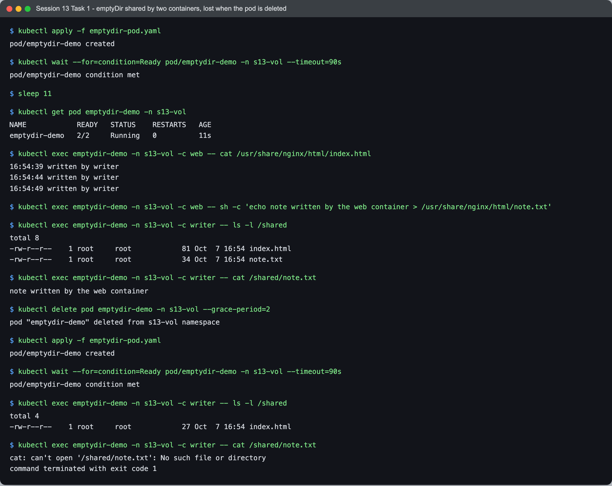
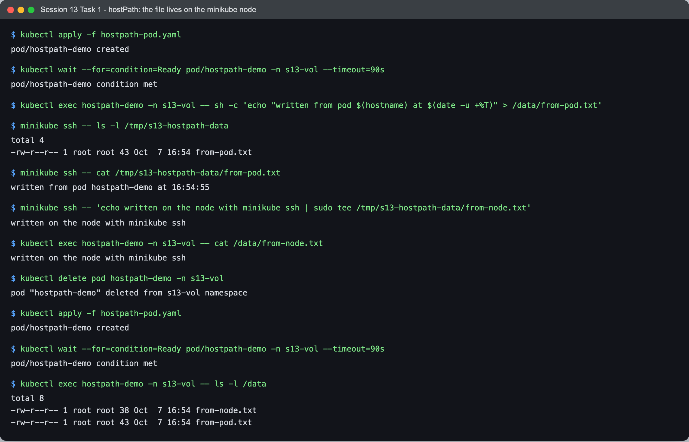
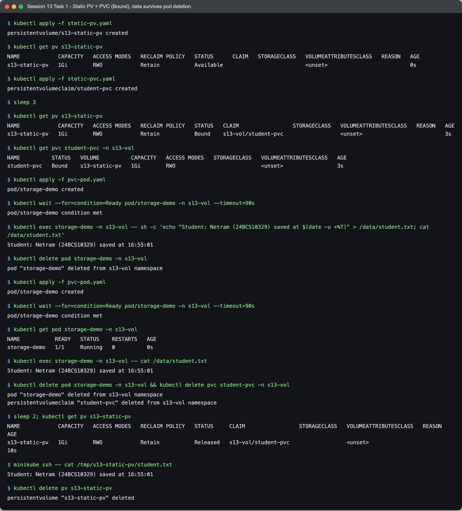
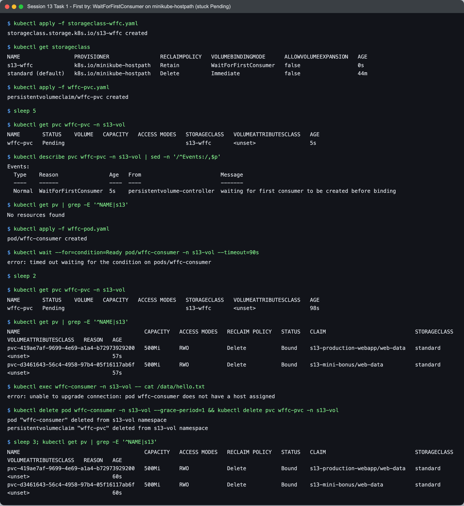
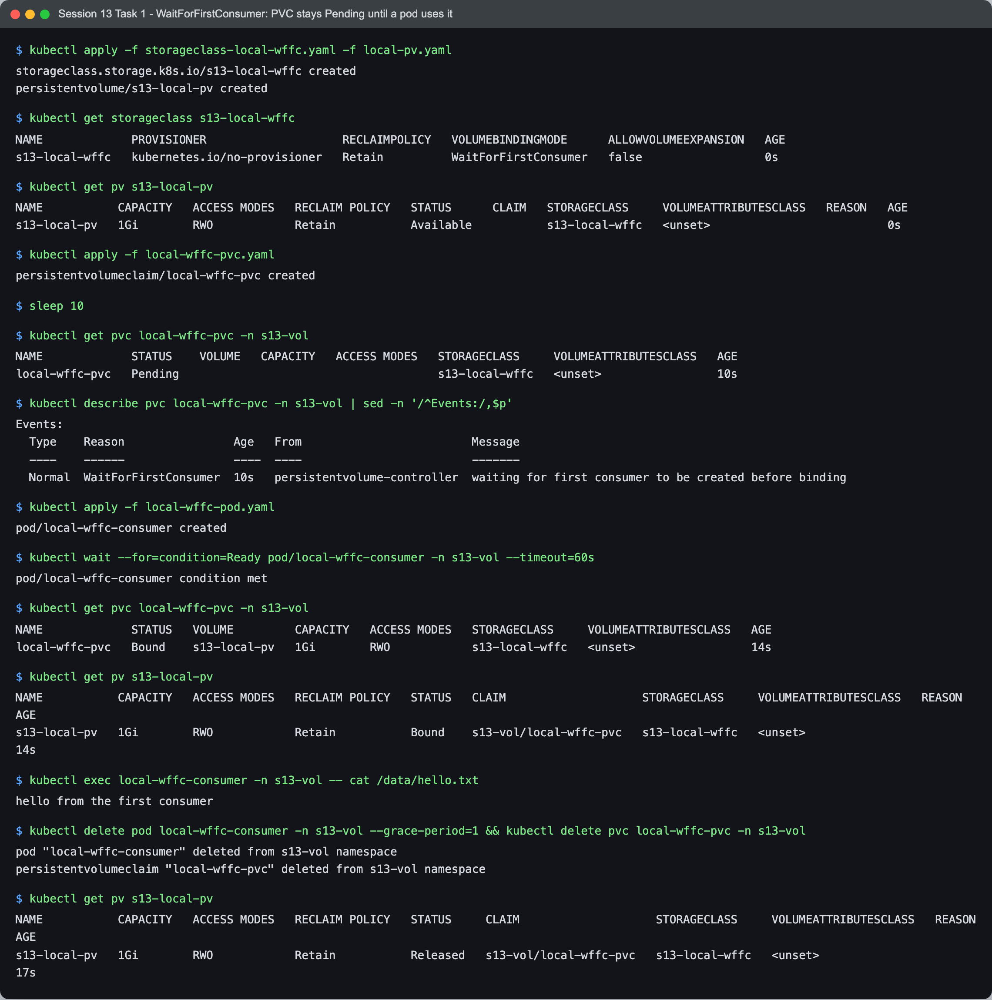
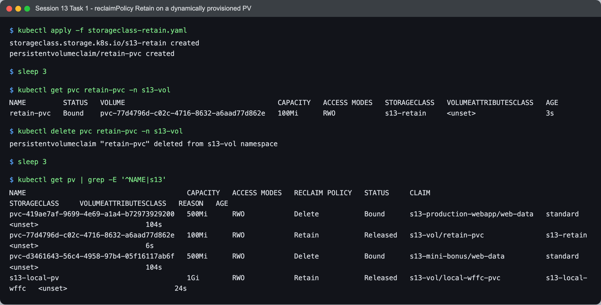
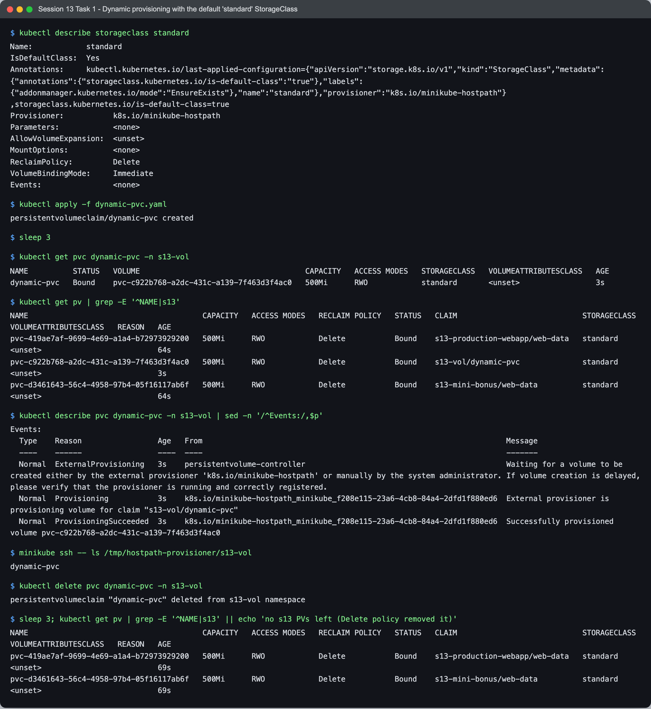

# Task 1 - Kubernetes Volumes and Storage

- **Name:** Netram
- **Enrollment No:** 24BCS10329

Everything below was run on my minikube cluster (single node, Kubernetes v1.37.0, containerd) in a namespace I called `s13-vol`. All YAML files are in this folder. The outputs are copied straight from the terminal; the screenshots are in [`../screenshots`](../screenshots).

## Quick comparison

| What | Kubernetes object? | How long the data lives | Where the data really is | When I would use it |
| --- | --- | --- | --- | --- |
| `emptyDir` | No, defined inside the pod spec | As long as the pod | A folder the kubelet makes on the node for that pod | Scratch space, cache, sharing files between containers of one pod |
| `hostPath` | No, defined inside the pod spec | As long as the node keeps the folder | A fixed folder on the node | Node agents (log collectors), local testing |
| PersistentVolume (PV) | Yes, cluster scoped | Independent of any pod | Whatever backend it points to (here a hostPath on the minikube node) | Real application data |
| PersistentVolumeClaim (PVC) | Yes, namespaced | Until the claim is deleted (then the PV's reclaim policy decides) | It is only a request, it points to a PV | This is what a pod mounts |
| StorageClass | Yes, cluster scoped | - | Describes a provisioner and its settings | Lets PVCs get PVs automatically |
| Dynamic provisioning | - | - | The provisioner creates the PV when the PVC appears | Default way on almost every cluster |

The main idea: a pod should not care where storage comes from. The pod mounts a **PVC** (a request), the PVC is bound to a **PV** (the actual storage), and the PV is either made by hand by an admin (static) or created automatically from a **StorageClass** (dynamic).

---

## 1. emptyDir (shared by two containers, gone with the pod)

File: [`emptydir-pod.yaml`](emptydir-pod.yaml). I extended the course example to two containers: a busybox `writer` appends a line to `/shared/index.html` every 5 seconds and an nginx `web` container mounts the same emptyDir as its web root.

```bash
kubectl apply -f emptydir-pod.yaml
kubectl exec emptydir-demo -n s13-vol -c web -- cat /usr/share/nginx/html/index.html
kubectl exec emptydir-demo -n s13-vol -c web -- sh -c 'echo note written by the web container > /usr/share/nginx/html/note.txt'
kubectl exec emptydir-demo -n s13-vol -c writer -- cat /shared/note.txt
kubectl delete pod emptydir-demo -n s13-vol --grace-period=2
kubectl apply -f emptydir-pod.yaml
kubectl exec emptydir-demo -n s13-vol -c writer -- cat /shared/note.txt
```



```text
$ kubectl get pod emptydir-demo -n s13-vol
NAME            READY   STATUS    RESTARTS   AGE
emptydir-demo   2/2     Running   0          11s

$ kubectl exec emptydir-demo -n s13-vol -c web -- cat /usr/share/nginx/html/index.html
16:54:39 written by writer
16:54:44 written by writer
16:54:49 written by writer

$ kubectl exec emptydir-demo -n s13-vol -c web -- sh -c 'echo note written by the web container > /usr/share/nginx/html/note.txt'

$ kubectl exec emptydir-demo -n s13-vol -c writer -- ls -l /shared
total 8
-rw-r--r--    1 root     root            81 Oct  7 16:54 index.html
-rw-r--r--    1 root     root            34 Oct  7 16:54 note.txt

$ kubectl exec emptydir-demo -n s13-vol -c writer -- cat /shared/note.txt
note written by the web container

$ kubectl delete pod emptydir-demo -n s13-vol --grace-period=2
pod "emptydir-demo" deleted from s13-vol namespace

$ kubectl exec emptydir-demo -n s13-vol -c writer -- ls -l /shared
total 4
-rw-r--r--    1 root     root            27 Oct  7 16:54 index.html

$ kubectl exec emptydir-demo -n s13-vol -c writer -- cat /shared/note.txt
cat: can't open '/shared/note.txt': No such file or directory
command terminated with exit code 1
```

What this shows:
- The file written by `writer` is served by `web`, and the note written by `web` is read by `writer`. Both containers see the same folder even though they mount it at different paths.
- After deleting and recreating the pod, `index.html` is only 27 bytes (one fresh line) and `note.txt` is gone. The emptyDir is created empty with the pod and deleted with it. (A container restart inside the same pod would NOT lose it; only pod deletion does.)

---

## 2. hostPath (the file is on the node)

File: [`hostpath-pod.yaml`](hostpath-pod.yaml). It mounts `/tmp/s13-hostpath-data` from the minikube node (`type: DirectoryOrCreate`) at `/data`.

```bash
kubectl apply -f hostpath-pod.yaml
kubectl exec hostpath-demo -n s13-vol -- sh -c 'echo "written from pod $(hostname) at $(date -u +%T)" > /data/from-pod.txt'
minikube ssh -- cat /tmp/s13-hostpath-data/from-pod.txt
minikube ssh -- 'echo written on the node with minikube ssh | sudo tee /tmp/s13-hostpath-data/from-node.txt'
kubectl exec hostpath-demo -n s13-vol -- cat /data/from-node.txt
```



```text
$ kubectl exec hostpath-demo -n s13-vol -- sh -c 'echo "written from pod $(hostname) at $(date -u +%T)" > /data/from-pod.txt'

$ minikube ssh -- ls -l /tmp/s13-hostpath-data
total 4
-rw-r--r-- 1 root root 43 Oct  7 16:54 from-pod.txt

$ minikube ssh -- cat /tmp/s13-hostpath-data/from-pod.txt
written from pod hostpath-demo at 16:54:55

$ minikube ssh -- 'echo written on the node with minikube ssh | sudo tee /tmp/s13-hostpath-data/from-node.txt'
written on the node with minikube ssh

$ kubectl exec hostpath-demo -n s13-vol -- cat /data/from-node.txt
written on the node with minikube ssh

$ kubectl delete pod hostpath-demo -n s13-vol
pod "hostpath-demo" deleted from s13-vol namespace

$ kubectl exec hostpath-demo -n s13-vol -- ls -l /data
total 8
-rw-r--r-- 1 root root 38 Oct  7 16:54 from-node.txt
-rw-r--r-- 1 root root 43 Oct  7 16:54 from-pod.txt
```

What this shows: the pod and the node look at the same folder. A file written in the pod is visible with `minikube ssh`, a file written on the node shows up in the pod, and both files are still there after the pod is deleted and recreated. The catch is that the data belongs to **one node**: on a multi node cluster a rescheduled pod could land on another node and see an empty folder. hostPath also gives the pod access to the node filesystem, which is a security risk, so it is mainly for learning and node level tools.

---

## 3. Static PersistentVolume + PersistentVolumeClaim

Files: [`static-pv.yaml`](static-pv.yaml) (1Gi, `ReadWriteOnce`, `Retain`, hostPath `/tmp/s13-static-pv`), [`static-pvc.yaml`](static-pvc.yaml) (asks for 500Mi) and [`pvc-pod.yaml`](pvc-pod.yaml) (mounts the claim at `/data`).

Note: compared to the course files I set `storageClassName: ""` on both the PV and the PVC. Without it my PVC got the default `standard` class and a brand new dynamic PV instead of my static one (see "Problems I hit" in the main README).

```bash
kubectl apply -f static-pv.yaml          # PV is Available
kubectl apply -f static-pvc.yaml         # PV and PVC become Bound
kubectl apply -f pvc-pod.yaml
kubectl exec storage-demo -n s13-vol -- sh -c 'echo "Student: Netram ..." > /data/student.txt'
kubectl delete pod storage-demo -n s13-vol && kubectl apply -f pvc-pod.yaml
kubectl exec storage-demo -n s13-vol -- cat /data/student.txt     # still there
kubectl delete pod storage-demo -n s13-vol && kubectl delete pvc student-pvc -n s13-vol
kubectl get pv s13-static-pv             # Released, data kept (Retain)
```



```text
$ kubectl apply -f static-pv.yaml
persistentvolume/s13-static-pv created

$ kubectl get pv s13-static-pv
NAME            CAPACITY   ACCESS MODES   RECLAIM POLICY   STATUS      CLAIM   STORAGECLASS   VOLUMEATTRIBUTESCLASS   REASON   AGE
s13-static-pv   1Gi        RWO            Retain           Available                          <unset>                          0s

$ kubectl apply -f static-pvc.yaml
persistentvolumeclaim/student-pvc created

$ sleep 3

$ kubectl get pv s13-static-pv
NAME            CAPACITY   ACCESS MODES   RECLAIM POLICY   STATUS   CLAIM                 STORAGECLASS   VOLUMEATTRIBUTESCLASS   REASON   AGE
s13-static-pv   1Gi        RWO            Retain           Bound    s13-vol/student-pvc                  <unset>                          3s

$ kubectl get pvc student-pvc -n s13-vol
NAME          STATUS   VOLUME          CAPACITY   ACCESS MODES   STORAGECLASS   VOLUMEATTRIBUTESCLASS   AGE
student-pvc   Bound    s13-static-pv   1Gi        RWO                           <unset>                 3s

$ kubectl apply -f pvc-pod.yaml
pod/storage-demo created

$ kubectl wait --for=condition=Ready pod/storage-demo -n s13-vol --timeout=90s
pod/storage-demo condition met

$ kubectl exec storage-demo -n s13-vol -- sh -c 'echo "Student: Netram (24BCS10329) saved at $(date -u +%T)" > /data/student.txt; cat /data/student.txt'
Student: Netram (24BCS10329) saved at 16:55:01

$ kubectl delete pod storage-demo -n s13-vol
pod "storage-demo" deleted from s13-vol namespace

$ kubectl apply -f pvc-pod.yaml
pod/storage-demo created

$ kubectl wait --for=condition=Ready pod/storage-demo -n s13-vol --timeout=90s
pod/storage-demo condition met

$ kubectl get pod storage-demo -n s13-vol
NAME           READY   STATUS    RESTARTS   AGE
storage-demo   1/1     Running   0          0s

$ kubectl exec storage-demo -n s13-vol -- cat /data/student.txt
Student: Netram (24BCS10329) saved at 16:55:01

$ kubectl delete pod storage-demo -n s13-vol && kubectl delete pvc student-pvc -n s13-vol
pod "storage-demo" deleted from s13-vol namespace
persistentvolumeclaim "student-pvc" deleted from s13-vol namespace

$ sleep 2; kubectl get pv s13-static-pv
NAME            CAPACITY   ACCESS MODES   RECLAIM POLICY   STATUS     CLAIM                 STORAGECLASS   VOLUMEATTRIBUTESCLASS   REASON   AGE
s13-static-pv   1Gi        RWO            Retain           Released   s13-vol/student-pvc                  <unset>                          10s

$ minikube ssh -- cat /tmp/s13-static-pv/student.txt
Student: Netram (24BCS10329) saved at 16:55:01

$ kubectl delete pv s13-static-pv
persistentvolume "s13-static-pv" deleted
```

What this shows:
- The PV starts as `Available`. When the PVC is created they are both `Bound`. The PVC asked for 500Mi but shows 1Gi, because a claim binds to a whole PV that is at least as big as the request.
- The file written in the first pod is read by a brand new pod (`AGE 0s`), so the data outlived the pod.
- After deleting the PVC the PV goes to `Released` (not deleted) because of `persistentVolumeReclaimPolicy: Retain`, and the file is still on the node. A Released PV is not handed to a new claim automatically; an admin has to clean it up or remove its `claimRef`.

---

## 4. StorageClass with `volumeBindingMode: WaitForFirstConsumer`

A StorageClass has three settings I cared about here:
- `provisioner`: who creates the PV (`k8s.io/minikube-hostpath` on minikube).
- `reclaimPolicy`: what happens to a dynamically created PV when its PVC is deleted (`Delete` or `Retain`).
- `volumeBindingMode`: `Immediate` binds/provisions as soon as the PVC is created; `WaitForFirstConsumer` waits until a pod that uses the PVC is scheduled, so the volume is created on (or near) the node where the pod will run.

### 4a. First try: minikube-hostpath + WaitForFirstConsumer (did not work)

File: [`storageclass-wffc.yaml`](storageclass-wffc.yaml) with [`wffc-pvc.yaml`](wffc-pvc.yaml) and [`wffc-pod.yaml`](wffc-pod.yaml).



```text
$ kubectl get storageclass
NAME                 PROVISIONER                RECLAIMPOLICY   VOLUMEBINDINGMODE      ALLOWVOLUMEEXPANSION   AGE
s13-wffc             k8s.io/minikube-hostpath   Retain          WaitForFirstConsumer   false                  0s
standard (default)   k8s.io/minikube-hostpath   Delete          Immediate              false                  44m

$ kubectl get pvc wffc-pvc -n s13-vol
NAME       STATUS    VOLUME   CAPACITY   ACCESS MODES   STORAGECLASS   VOLUMEATTRIBUTESCLASS   AGE
wffc-pvc   Pending                                      s13-wffc       <unset>                 5s

$ kubectl describe pvc wffc-pvc -n s13-vol | sed -n '/^Events:/,$p'
Events:
  Type    Reason                Age   From                         Message
  ----    ------                ----  ----                         -------
  Normal  WaitForFirstConsumer  5s    persistentvolume-controller  waiting for first consumer to be created before binding

$ kubectl apply -f wffc-pod.yaml
pod/wffc-consumer created

$ kubectl wait --for=condition=Ready pod/wffc-consumer -n s13-vol --timeout=90s
error: timed out waiting for the condition on pods/wffc-consumer

$ kubectl get pvc wffc-pvc -n s13-vol
NAME       STATUS    VOLUME   CAPACITY   ACCESS MODES   STORAGECLASS   VOLUMEATTRIBUTESCLASS   AGE
wffc-pvc   Pending                                      s13-wffc       <unset>                 98s

$ kubectl exec wffc-consumer -n s13-vol -- cat /data/hello.txt
error: unable to upgrade connection: pod wffc-consumer does not have a host assigned
```

The PVC was `Pending` with "waiting for first consumer" exactly as expected. But after I created the pod, it stayed `Pending` too. The PVC events explained why:

```text
$ kubectl get pod wffc-consumer -n s13-vol; kubectl get pvc wffc-pvc -n s13-vol
NAME            READY   STATUS    RESTARTS   AGE
wffc-consumer   0/1     Pending   0          76s
NAME       STATUS    VOLUME   CAPACITY   ACCESS MODES   STORAGECLASS   VOLUMEATTRIBUTESCLASS   AGE
wffc-pvc   Pending                                      s13-wffc       <unset>                 82s

$ kubectl describe pvc wffc-pvc -n s13-vol | sed -n '/^Events:/,$p'
Events:
  Type     Reason                Age                From                                                                    Message
  ----     ------                ----               ----                                                                    -------
  Normal   WaitForFirstConsumer  82s                persistentvolume-controller                                             waiting for first consumer to be created before binding
  Warning  ProvisioningFailed    15s (x4 over 76s)  k8s.io/minikube-hostpath_minikube_f208e115-23a6-4cb8-84a4-2dfd1f880ed6  failed to get target node: nodes "minikube" is forbidden: User "system:serviceaccount:kube-system:storage-provisioner" cannot get resource "nodes" in API group "" at the cluster scope
  Normal   ExternalProvisioning  9s (x7 over 76s)   persistentvolume-controller                                             Waiting for a volume to be created either by the external provisioner 'k8s.io/minikube-hostpath' or manually by the system administrator. If volume creation is delayed, please verify that the provisioner is running and correctly registered.
```

The scheduler did its part (it put the `volume.kubernetes.io/selected-node: minikube` annotation on the PVC), but the minikube storage-provisioner's service account is not allowed to `get` nodes, so it cannot provision in WaitForFirstConsumer mode. With `Immediate` mode (the `standard` class) it never needs to look up a node, which is why that works. I did not change cluster RBAC because the cluster is shared, so I showed the binding mode with a static PV instead.

### 4b. Working demo: no-provisioner StorageClass + a PV in that class

Files: [`storageclass-local-wffc.yaml`](storageclass-local-wffc.yaml) (`provisioner: kubernetes.io/no-provisioner`, `Retain`, `WaitForFirstConsumer`), [`local-pv.yaml`](local-pv.yaml), [`local-wffc-pvc.yaml`](local-wffc-pvc.yaml), [`local-wffc-pod.yaml`](local-wffc-pod.yaml). This is the same pattern people use for `local` volumes.



```text
$ kubectl apply -f storageclass-local-wffc.yaml -f local-pv.yaml
storageclass.storage.k8s.io/s13-local-wffc created
persistentvolume/s13-local-pv created

$ kubectl get storageclass s13-local-wffc
NAME             PROVISIONER                    RECLAIMPOLICY   VOLUMEBINDINGMODE      ALLOWVOLUMEEXPANSION   AGE
s13-local-wffc   kubernetes.io/no-provisioner   Retain          WaitForFirstConsumer   false                  0s

$ kubectl get pv s13-local-pv
NAME           CAPACITY   ACCESS MODES   RECLAIM POLICY   STATUS      CLAIM   STORAGECLASS     VOLUMEATTRIBUTESCLASS   REASON   AGE
s13-local-pv   1Gi        RWO            Retain           Available           s13-local-wffc   <unset>                          0s

$ kubectl apply -f local-wffc-pvc.yaml
persistentvolumeclaim/local-wffc-pvc created

$ sleep 10

$ kubectl get pvc local-wffc-pvc -n s13-vol
NAME             STATUS    VOLUME   CAPACITY   ACCESS MODES   STORAGECLASS     VOLUMEATTRIBUTESCLASS   AGE
local-wffc-pvc   Pending                                      s13-local-wffc   <unset>                 10s

$ kubectl describe pvc local-wffc-pvc -n s13-vol | sed -n '/^Events:/,$p'
Events:
  Type    Reason                Age   From                         Message
  ----    ------                ----  ----                         -------
  Normal  WaitForFirstConsumer  10s   persistentvolume-controller  waiting for first consumer to be created before binding

$ kubectl apply -f local-wffc-pod.yaml
pod/local-wffc-consumer created

$ kubectl wait --for=condition=Ready pod/local-wffc-consumer -n s13-vol --timeout=60s
pod/local-wffc-consumer condition met

$ kubectl get pvc local-wffc-pvc -n s13-vol
NAME             STATUS   VOLUME         CAPACITY   ACCESS MODES   STORAGECLASS     VOLUMEATTRIBUTESCLASS   AGE
local-wffc-pvc   Bound    s13-local-pv   1Gi        RWO            s13-local-wffc   <unset>                 14s

$ kubectl get pv s13-local-pv
NAME           CAPACITY   ACCESS MODES   RECLAIM POLICY   STATUS   CLAIM                    STORAGECLASS     VOLUMEATTRIBUTESCLASS   REASON   AGE
s13-local-pv   1Gi        RWO            Retain           Bound    s13-vol/local-wffc-pvc   s13-local-wffc   <unset>                          14s

$ kubectl exec local-wffc-consumer -n s13-vol -- cat /data/hello.txt
hello from the first consumer

$ kubectl delete pod local-wffc-consumer -n s13-vol --grace-period=1 && kubectl delete pvc local-wffc-pvc -n s13-vol
pod "local-wffc-consumer" deleted from s13-vol namespace
persistentvolumeclaim "local-wffc-pvc" deleted from s13-vol namespace

$ kubectl get pv s13-local-pv
NAME           CAPACITY   ACCESS MODES   RECLAIM POLICY   STATUS     CLAIM                    STORAGECLASS     VOLUMEATTRIBUTESCLASS   REASON   AGE
s13-local-pv   1Gi        RWO            Retain           Released   s13-vol/local-wffc-pvc   s13-local-wffc   <unset>                          17s
```

What this shows: a matching PV (`Available`) existed the whole time, but the PVC stayed `Pending` for 10 seconds with the event "waiting for first consumer to be created before binding". Only when the pod was created did the PVC become `Bound`, and the pod could write to it. After deleting the PVC the PV is `Released` because the reclaim policy is `Retain`.

### 4c. reclaimPolicy Retain on a dynamic PV

File: [`storageclass-retain.yaml`](storageclass-retain.yaml): a class `s13-retain` that uses the minikube provisioner with `Immediate` binding and `reclaimPolicy: Retain`, plus a PVC in that class.



```text
$ kubectl apply -f storageclass-retain.yaml
storageclass.storage.k8s.io/s13-retain created
persistentvolumeclaim/retain-pvc created

$ sleep 3

$ kubectl get pvc retain-pvc -n s13-vol
NAME         STATUS   VOLUME                                     CAPACITY   ACCESS MODES   STORAGECLASS   VOLUMEATTRIBUTESCLASS   AGE
retain-pvc   Bound    pvc-77d4796d-c02c-4716-8632-a6aad77d862e   100Mi      RWO            s13-retain     <unset>                 3s

$ kubectl delete pvc retain-pvc -n s13-vol
persistentvolumeclaim "retain-pvc" deleted from s13-vol namespace

$ sleep 3

$ kubectl get pv | grep -E '^NAME|s13'
NAME                                       CAPACITY   ACCESS MODES   RECLAIM POLICY   STATUS     CLAIM                            STORAGECLASS     VOLUMEATTRIBUTESCLASS   REASON   AGE
pvc-419ae7af-9699-4e69-a1a4-b72973929200   500Mi      RWO            Delete           Bound      s13-production-webapp/web-data   standard         <unset>                          104s
pvc-77d4796d-c02c-4716-8632-a6aad77d862e   100Mi      RWO            Retain           Released   s13-vol/retain-pvc               s13-retain       <unset>                          6s
pvc-d3461643-56c4-4958-97b4-05f16117ab6f   500Mi      RWO            Delete           Bound      s13-mini-bonus/web-data          standard         <unset>                          104s
s13-local-pv                               1Gi        RWO            Retain           Released   s13-vol/local-wffc-pvc           s13-local-wffc   <unset>                          24s
```

The PV `pvc-77d4...` was created automatically, and after the PVC was deleted it stayed as `Released` with policy `Retain` (compare with the `standard` class below, where the PV is deleted). The other `s13` PVs in that list belong to my mini project, which was running at the same time.

---

## 5. Dynamic provisioning with the default `standard` StorageClass

File: [`dynamic-pvc.yaml`](dynamic-pvc.yaml) (copied from `03-storageclass/pvc.yaml`). I did not create any PV for it.



```text
$ kubectl describe storageclass standard
Name:            standard
IsDefaultClass:  Yes
Annotations:     kubectl.kubernetes.io/last-applied-configuration={"apiVersion":"storage.k8s.io/v1","kind":"StorageClass","metadata":{"annotations":{"storageclass.kubernetes.io/is-default-class":"true"},"labels":{"addonmanager.kubernetes.io/mode":"EnsureExists"},"name":"standard"},"provisioner":"k8s.io/minikube-hostpath"}
,storageclass.kubernetes.io/is-default-class=true
Provisioner:           k8s.io/minikube-hostpath
Parameters:            <none>
AllowVolumeExpansion:  <unset>
MountOptions:          <none>
ReclaimPolicy:         Delete
VolumeBindingMode:     Immediate
Events:                <none>

$ kubectl apply -f dynamic-pvc.yaml
persistentvolumeclaim/dynamic-pvc created

$ kubectl get pvc dynamic-pvc -n s13-vol
NAME          STATUS   VOLUME                                     CAPACITY   ACCESS MODES   STORAGECLASS   VOLUMEATTRIBUTESCLASS   AGE
dynamic-pvc   Bound    pvc-c922b768-a2dc-431c-a139-7f463d3f4ac0   500Mi      RWO            standard       <unset>                 3s

$ kubectl get pv | grep -E '^NAME|s13'
NAME                                       CAPACITY   ACCESS MODES   RECLAIM POLICY   STATUS   CLAIM                            STORAGECLASS   VOLUMEATTRIBUTESCLASS   REASON   AGE
pvc-419ae7af-9699-4e69-a1a4-b72973929200   500Mi      RWO            Delete           Bound    s13-production-webapp/web-data   standard       <unset>                          64s
pvc-c922b768-a2dc-431c-a139-7f463d3f4ac0   500Mi      RWO            Delete           Bound    s13-vol/dynamic-pvc              standard       <unset>                          3s
pvc-d3461643-56c4-4958-97b4-05f16117ab6f   500Mi      RWO            Delete           Bound    s13-mini-bonus/web-data          standard       <unset>                          64s

$ kubectl describe pvc dynamic-pvc -n s13-vol | sed -n '/^Events:/,$p'
Events:
  Type    Reason                 Age   From                                                                    Message
  ----    ------                 ----  ----                                                                    -------
  Normal  ExternalProvisioning   3s    persistentvolume-controller                                             Waiting for a volume to be created either by the external provisioner 'k8s.io/minikube-hostpath' or manually by the system administrator. If volume creation is delayed, please verify that the provisioner is running and correctly registered.
  Normal  Provisioning           3s    k8s.io/minikube-hostpath_minikube_f208e115-23a6-4cb8-84a4-2dfd1f880ed6  External provisioner is provisioning volume for claim "s13-vol/dynamic-pvc"
  Normal  ProvisioningSucceeded  3s    k8s.io/minikube-hostpath_minikube_f208e115-23a6-4cb8-84a4-2dfd1f880ed6  Successfully provisioned volume pvc-c922b768-a2dc-431c-a139-7f463d3f4ac0

$ minikube ssh -- ls /tmp/hostpath-provisioner/s13-vol
dynamic-pvc

$ kubectl delete pvc dynamic-pvc -n s13-vol
persistentvolumeclaim "dynamic-pvc" deleted from s13-vol namespace

$ sleep 3; kubectl get pv | grep -E '^NAME|s13' || echo 'no s13 PVs left (Delete policy removed it)'
NAME                                       CAPACITY   ACCESS MODES   RECLAIM POLICY   STATUS   CLAIM                            STORAGECLASS   VOLUMEATTRIBUTESCLASS   REASON   AGE
pvc-419ae7af-9699-4e69-a1a4-b72973929200   500Mi      RWO            Delete           Bound    s13-production-webapp/web-data   standard       <unset>                          69s
pvc-d3461643-56c4-4958-97b4-05f16117ab6f   500Mi      RWO            Delete           Bound    s13-mini-bonus/web-data          standard       <unset>                          69s
```

What this shows:
- `standard` is the default class, provisioner `k8s.io/minikube-hostpath`, `ReclaimPolicy: Delete`, `VolumeBindingMode: Immediate`.
- 3 seconds after creating the PVC it was `Bound` to `pvc-c922b768-...`, a PV that the provisioner made by itself (events `Provisioning` then `ProvisioningSucceeded`). On the node the data lives under `/tmp/hostpath-provisioner/<namespace>/<pvc-name>`.
- After deleting the PVC, that PV disappeared from the list because the class uses `Delete`.

---

## Cleanup

```text
$ kubectl delete namespace s13-vol
namespace "s13-vol" deleted

$ kubectl delete pv s13-local-pv pvc-77d4796d-c02c-4716-8632-a6aad77d862e
persistentvolume "s13-local-pv" deleted
persistentvolume "pvc-77d4796d-c02c-4716-8632-a6aad77d862e" deleted

$ kubectl delete storageclass s13-wffc s13-local-wffc s13-retain
storageclass.storage.k8s.io "s13-wffc" deleted
storageclass.storage.k8s.io "s13-local-wffc" deleted
storageclass.storage.k8s.io "s13-retain" deleted

$ minikube ssh -- sudo rm -rf /tmp/s13-hostpath-data /tmp/s13-static-pv /tmp/s13-local-pv /tmp/hostpath-provisioner/s13-vol

$ kubectl get storageclass; kubectl get pv | grep -E 's13-vol|s13-local' || echo 'no s13-vol PVs left'
NAME                 PROVISIONER                RECLAIMPOLICY   VOLUMEBINDINGMODE   ALLOWVOLUMEEXPANSION   AGE
standard (default)   k8s.io/minikube-hostpath   Delete          Immediate           false                  47m
no s13-vol PVs left
```

## What I took away

- emptyDir = pod lifetime, hostPath = node lifetime, PV = independent of pods.
- Pods should mount PVCs, not PVs. The PVC is the portable request; the PV and StorageClass are cluster details.
- A PVC without `storageClassName` is not "no class": on a cluster with a default class it gets the default class. To bind to a hand made PV, use `storageClassName: ""` (or the same class name on both sides).
- `reclaimPolicy` only matters when the claim is deleted: `Delete` throws the data away, `Retain` keeps the PV as `Released` for an admin to handle.
- `WaitForFirstConsumer` delays binding until a pod is scheduled. It needs a provisioner that supports it, which the minikube hostpath provisioner did not on my cluster.
