# Session 13 - Kubernetes Storage, HPA & Probes - Task

- **Name:** Netram
- **Enrollment No:** 24BCS10329

> **Status:** completed

> Run on macOS (Apple Silicon) with Docker Desktop, minikube v1.39.0 (metrics-server addon), Kubernetes v1.37.0.

Every command below was run by me on a single node minikube cluster. The text blocks are the real terminal output (timestamps from `ts` are UTC), and each section has a screenshot of the same run in [`screenshots/`](screenshots). I used my own namespaces (`s13-vol`, `s13-hpa`, `s13-production-webapp`, `s13-mini-bonus`) and deleted them at the end.

## Folder layout

```text
task/
├── README.md                      # this file
├── 01-kubernetes-volumes/         # Task 1: README + YAMLs for emptyDir, hostPath, PV/PVC, StorageClass
├── 02-hpa/                        # Task 2: deployment.yaml, service.yaml, hpa.yml, load-generator.yaml
├── 03-mini-project/               # Task 3: namespace, pvc, deployment (3 probes), service, hpa
└── screenshots/                   # s13-vol-*, s13-hpa-*, s13-mini-*
```

---

## Task 1 - Kubernetes Volumes

The full write up is in **[01-kubernetes-volumes/README.md](01-kubernetes-volumes/README.md)**. It covers, each with YAML, commands, real output and a screenshot:

| Topic | What I showed on the cluster | Screenshot |
| --- | --- | --- |
| emptyDir | Two containers (busybox writer + nginx) share one emptyDir; the files are gone after the pod is deleted | [s13-vol-01](screenshots/s13-vol-01-emptydir.png) |
| hostPath | A file written in the pod is visible with `minikube ssh`, and a file written on the node shows up in the pod | [s13-vol-02](screenshots/s13-vol-02-hostpath.png) |
| PV + PVC (static) | PV `Available` then `Bound`; data survives pod deletion; after deleting the PVC the PV is `Released` (Retain) | [s13-vol-03](screenshots/s13-vol-03-static-pv.png) |
| StorageClass, WaitForFirstConsumer | PVC stays `Pending` ("waiting for first consumer") until a pod uses it, then `Bound` | [s13-vol-06](screenshots/s13-vol-06-wffc-local.png) (and the failed first try [s13-vol-04](screenshots/s13-vol-04-wffc-hostpath-failed.png)) |
| StorageClass reclaimPolicy | `Retain` class keeps the auto created PV as `Released`; `Delete` (standard) removes it | [s13-vol-07](screenshots/s13-vol-07-retain.png) |
| Dynamic provisioning | A PVC on `standard` gets a `pvc-...` PV created automatically by `k8s.io/minikube-hostpath` | [s13-vol-05](screenshots/s13-vol-05-dynamic.png) |

---

## Task 2 - HPA hands-on (hpa.yml)

### Files

| File | Source | What I changed |
| --- | --- | --- |
| [`02-hpa/deployment.yaml`](02-hpa/deployment.yaml) | `04-hpa/deployment.yaml` | namespace `s13-hpa`, added a small memory request/limit (cluster is shared and memory is tight) |
| [`02-hpa/service.yaml`](02-hpa/service.yaml) | `04-hpa/service.yaml` | namespace only |
| [`02-hpa/hpa.yml`](02-hpa/hpa.yml) | `04-hpa/hpa.yaml` | namespace, and `behavior.scaleDown.stabilizationWindowSeconds: 60` (default is 300) so I could watch the scale down |
| [`02-hpa/load-generator.yaml`](02-hpa/load-generator.yaml) | the course `kubectl run load-generator` command | run 1: busybox with 3 parallel `wget` loops instead of 1 |
| [`02-hpa/load-generator-curl.yaml`](02-hpa/load-generator-curl.yaml) | my own | run 2: `curl` with keep-alive and 4 parallel connections (much more load per CPU) |

The HPA targets 50% average CPU, between 1 and 5 replicas. The nginx container requests `cpu: 100m` and is limited to `200m`.

### How the HPA decides (the WHY)

The HPA controller runs every 15 seconds and computes:

```text
desiredReplicas = ceil( currentReplicas * currentUtilization / targetUtilization )
```

- **Utilization is relative to the CPU request, not the limit and not the node.** A pod using 50m with `requests.cpu: 100m` is at 50%. This is why the HPA shows `<unknown>` if the container has no CPU request.
- If `currentUtilization / target` is within 10% of 1.0 (the default tolerance), nothing happens.
- The result is clamped to `minReplicas`/`maxReplicas`, and scale down uses the highest recommendation of the last `stabilizationWindowSeconds`, so it does not flap.
- The CPU numbers come from metrics-server (`kubectl top` uses the same API).

### Step 1 - Deploy the app and the HPA

```bash
kubectl create namespace s13-hpa
kubectl apply -f deployment.yaml -f service.yaml -f hpa.yml
kubectl get hpa -n s13-hpa
```

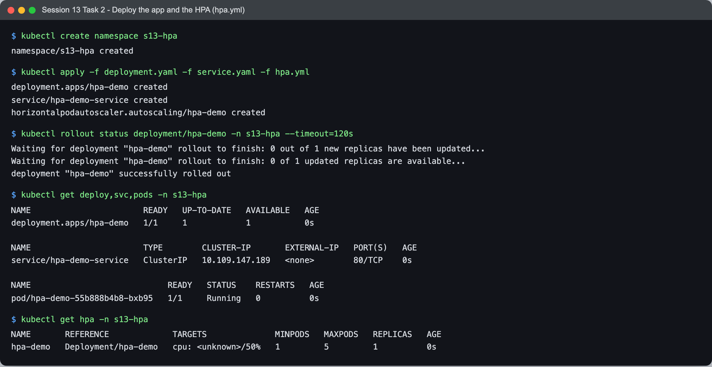

```text
$ kubectl apply -f deployment.yaml -f service.yaml -f hpa.yml
deployment.apps/hpa-demo created
service/hpa-demo-service created
horizontalpodautoscaler.autoscaling/hpa-demo created

$ kubectl get deploy,svc,pods -n s13-hpa
NAME                       READY   UP-TO-DATE   AVAILABLE   AGE
deployment.apps/hpa-demo   1/1     1            1           0s

NAME                       TYPE        CLUSTER-IP       EXTERNAL-IP   PORT(S)   AGE
service/hpa-demo-service   ClusterIP   10.109.147.189   <none>        80/TCP    0s

NAME                            READY   STATUS    RESTARTS   AGE
pod/hpa-demo-55b888b4b8-bxb95   1/1     Running   0          0s

$ kubectl get hpa -n s13-hpa
NAME       REFERENCE             TARGETS              MINPODS   MAXPODS   REPLICAS   AGE
hpa-demo   Deployment/hpa-demo   cpu: <unknown>/50%   1         5         1          0s
```

Right after creation the target is `<unknown>/50%` because metrics-server has not scraped the new pod yet.

### Step 2 - Verify the HPA (no load)

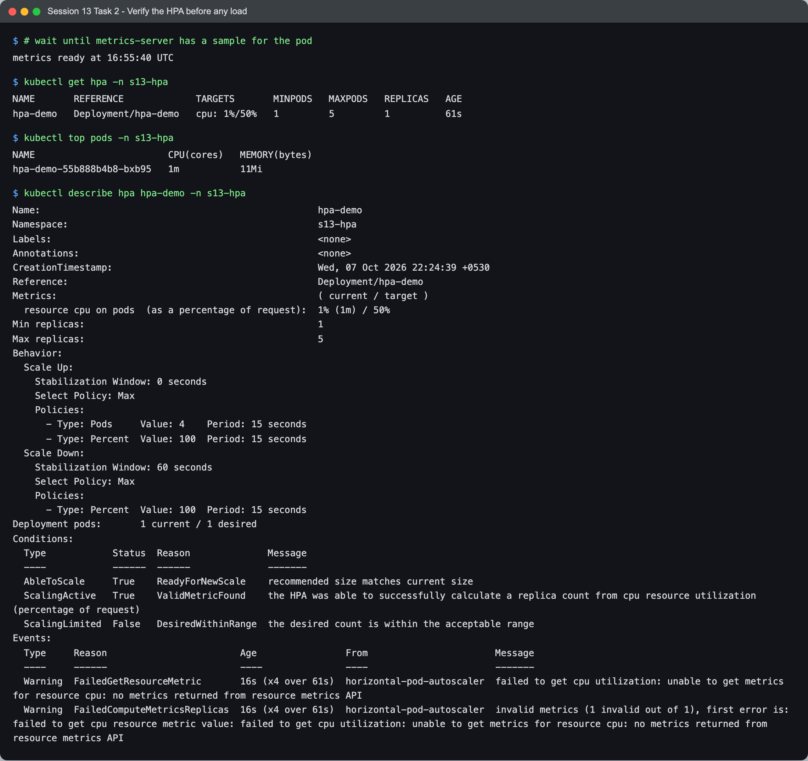

```text
$ # wait until metrics-server has a sample for the pod
metrics ready at 16:55:40 UTC

$ kubectl get hpa -n s13-hpa
NAME       REFERENCE             TARGETS       MINPODS   MAXPODS   REPLICAS   AGE
hpa-demo   Deployment/hpa-demo   cpu: 1%/50%   1         5         1          61s

$ kubectl top pods -n s13-hpa
NAME                        CPU(cores)   MEMORY(bytes)   
hpa-demo-55b888b4b8-bxb95   1m           11Mi

$ kubectl describe hpa hpa-demo -n s13-hpa
Name:                                                  hpa-demo
Namespace:                                             s13-hpa
Labels:                                                <none>
Annotations:                                           <none>
CreationTimestamp:                                     Wed, 07 Oct 2026 22:24:39 +0530
Reference:                                             Deployment/hpa-demo
Metrics:                                               ( current / target )
  resource cpu on pods  (as a percentage of request):  1% (1m) / 50%
Min replicas:                                          1
Max replicas:                                          5
Behavior:
  Scale Up:
    Stabilization Window: 0 seconds
    Select Policy: Max
    Policies:
      - Type: Pods     Value: 4    Period: 15 seconds
      - Type: Percent  Value: 100  Period: 15 seconds
  Scale Down:
    Stabilization Window: 60 seconds
    Select Policy: Max
    Policies:
      - Type: Percent  Value: 100  Period: 15 seconds
Deployment pods:       1 current / 1 desired
Conditions:
  Type            Status  Reason              Message
  ----            ------  ------              -------
  AbleToScale     True    ReadyForNewScale    recommended size matches current size
  ScalingActive   True    ValidMetricFound    the HPA was able to successfully calculate a replica count from cpu resource utilization (percentage of request)
  ScalingLimited  False   DesiredWithinRange  the desired count is within the acceptable range
Events:
  Type     Reason                        Age                From                       Message
  ----     ------                        ----               ----                       -------
  Warning  FailedGetResourceMetric       16s (x4 over 61s)  horizontal-pod-autoscaler  failed to get cpu utilization: unable to get metrics for resource cpu: no metrics returned from resource metrics API
  Warning  FailedComputeMetricsReplicas  16s (x4 over 61s)  horizontal-pod-autoscaler  invalid metrics (1 invalid out of 1), first error is: failed to get cpu resource metric value: failed to get cpu utilization: unable to get metrics for resource cpu: no metrics returned from resource metrics API
```

About a minute later the HPA has a value: 1m of a 100m request is 1%. `describe` also shows the behavior I set: scale up has no stabilization window (react fast), scale down waits 60 seconds. The two warnings in the events are from that first minute with no metrics.

### Step 3 - Load generator, CPU goes up, pods scale out

```bash
kubectl apply -f load-generator.yaml
kubectl get hpa -n s13-hpa -w --request-timeout=200s | ts
kubectl top pods -n s13-hpa
kubectl get pods -n s13-hpa -o wide
```

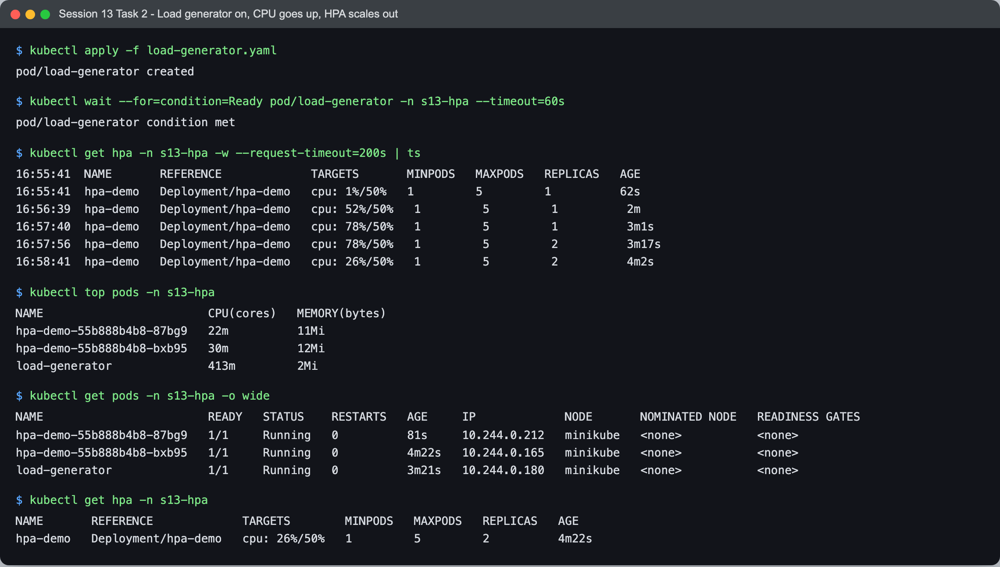

```text
$ kubectl apply -f load-generator.yaml
pod/load-generator created

$ kubectl wait --for=condition=Ready pod/load-generator -n s13-hpa --timeout=60s
pod/load-generator condition met

$ kubectl get hpa -n s13-hpa -w --request-timeout=200s | ts
16:55:41  NAME       REFERENCE             TARGETS       MINPODS   MAXPODS   REPLICAS   AGE
16:55:41  hpa-demo   Deployment/hpa-demo   cpu: 1%/50%   1         5         1          62s
16:56:39  hpa-demo   Deployment/hpa-demo   cpu: 52%/50%   1         5         1          2m
16:57:40  hpa-demo   Deployment/hpa-demo   cpu: 78%/50%   1         5         1          3m1s
16:57:56  hpa-demo   Deployment/hpa-demo   cpu: 78%/50%   1         5         2          3m17s
16:58:41  hpa-demo   Deployment/hpa-demo   cpu: 26%/50%   1         5         2          4m2s

$ kubectl top pods -n s13-hpa
NAME                        CPU(cores)   MEMORY(bytes)   
hpa-demo-55b888b4b8-87bg9   22m          11Mi            
hpa-demo-55b888b4b8-bxb95   30m          12Mi            
load-generator              413m         2Mi

$ kubectl get pods -n s13-hpa -o wide
NAME                        READY   STATUS    RESTARTS   AGE     IP             NODE       NOMINATED NODE   READINESS GATES
hpa-demo-55b888b4b8-87bg9   1/1     Running   0          81s     10.244.0.212   minikube   <none>           <none>
hpa-demo-55b888b4b8-bxb95   1/1     Running   0          4m22s   10.244.0.165   minikube   <none>           <none>
load-generator              1/1     Running   0          3m21s   10.244.0.180   minikube   <none>           <none>

$ kubectl get hpa -n s13-hpa
NAME       REFERENCE             TARGETS        MINPODS   MAXPODS   REPLICAS   AGE
hpa-demo   Deployment/hpa-demo   cpu: 26%/50%   1         5         2          4m22s
```

And `kubectl describe hpa` right after:

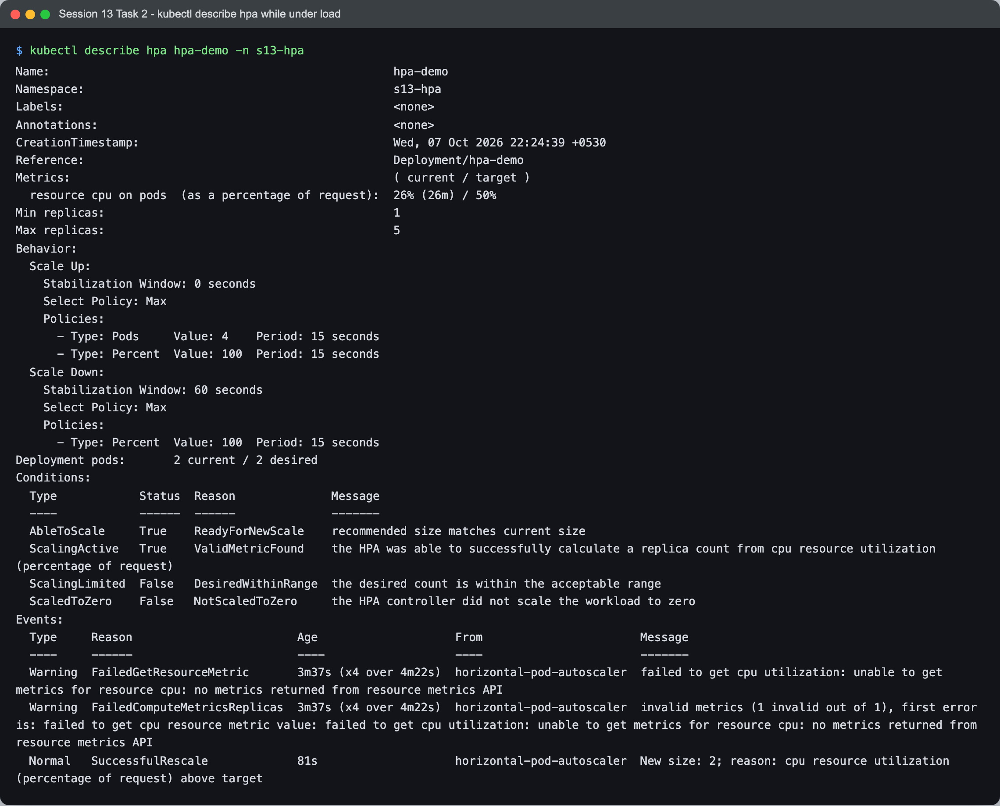

```text
$ kubectl describe hpa hpa-demo -n s13-hpa
Name:                                                  hpa-demo
Namespace:                                             s13-hpa
Labels:                                                <none>
Annotations:                                           <none>
CreationTimestamp:                                     Wed, 07 Oct 2026 22:24:39 +0530
Reference:                                             Deployment/hpa-demo
Metrics:                                               ( current / target )
  resource cpu on pods  (as a percentage of request):  26% (26m) / 50%
Min replicas:                                          1
Max replicas:                                          5
Behavior:
  Scale Up:
    Stabilization Window: 0 seconds
    Select Policy: Max
    Policies:
      - Type: Pods     Value: 4    Period: 15 seconds
      - Type: Percent  Value: 100  Period: 15 seconds
  Scale Down:
    Stabilization Window: 60 seconds
    Select Policy: Max
    Policies:
      - Type: Percent  Value: 100  Period: 15 seconds
Deployment pods:       2 current / 2 desired
Conditions:
  Type            Status  Reason              Message
  ----            ------  ------              -------
  AbleToScale     True    ReadyForNewScale    recommended size matches current size
  ScalingActive   True    ValidMetricFound    the HPA was able to successfully calculate a replica count from cpu resource utilization (percentage of request)
  ScalingLimited  False   DesiredWithinRange  the desired count is within the acceptable range
  ScaledToZero    False   NotScaledToZero     the HPA controller did not scale the workload to zero
Events:
  Type     Reason                        Age                    From                       Message
  ----     ------                        ----                   ----                       -------
  Warning  FailedGetResourceMetric       3m37s (x4 over 4m22s)  horizontal-pod-autoscaler  failed to get cpu utilization: unable to get metrics for resource cpu: no metrics returned from resource metrics API
  Warning  FailedComputeMetricsReplicas  3m37s (x4 over 4m22s)  horizontal-pod-autoscaler  invalid metrics (1 invalid out of 1), first error is: failed to get cpu resource metric value: failed to get cpu utilization: unable to get metrics for resource cpu: no metrics returned from resource metrics API
  Normal   SuccessfulRescale             81s                    horizontal-pod-autoscaler  New size: 2; reason: cpu resource utilization (percentage of request) above target
```

Reading the timeline with the formula:

| Time (UTC) | CPU | Replicas | Why |
| --- | --- | --- | --- |
| 16:55:41 | 1% | 1 | load just started, metrics not refreshed yet |
| 16:56:39 | 52% | 1 | 52/50 = 1.04 is inside the 10% tolerance, so no change |
| 16:57:40 | 78% | 1 | ceil(1 * 78/50) = ceil(1.56) = **2**, the HPA decides to scale |
| 16:57:56 | 78% | **2** | the second pod is created (event `New size: 2`) |
| 16:58:41 | 26% | 2 | same load now split over 2 pods; ceil(2 * 26/50) = ceil(1.04) = 2, stable |

The scale out stopped at 2 pods because my load generator could not push harder: `kubectl top` shows the busybox pod itself using 413m CPU to keep 3 `wget` loops going (one new process per request), while the two nginx pods only needed 22m and 30m. The bottleneck was the client, not nginx, so I did a second run with a better load generator (Step 5).

### Step 4 - Stop the load, watch it scale down

```bash
kubectl delete pod load-generator -n s13-hpa --now
kubectl get hpa -n s13-hpa -w --request-timeout=240s | ts
```

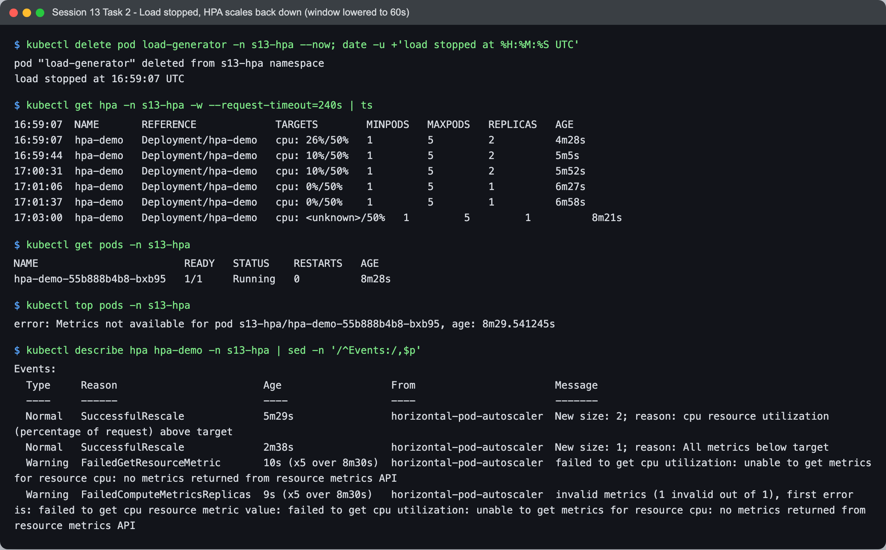

```text
$ kubectl delete pod load-generator -n s13-hpa --now; date -u +'load stopped at %H:%M:%S UTC'
pod "load-generator" deleted from s13-hpa namespace
load stopped at 16:59:07 UTC

$ kubectl get hpa -n s13-hpa -w --request-timeout=240s | ts
16:59:07  NAME       REFERENCE             TARGETS        MINPODS   MAXPODS   REPLICAS   AGE
16:59:07  hpa-demo   Deployment/hpa-demo   cpu: 26%/50%   1         5         2          4m28s
16:59:44  hpa-demo   Deployment/hpa-demo   cpu: 10%/50%   1         5         2          5m5s
17:00:31  hpa-demo   Deployment/hpa-demo   cpu: 10%/50%   1         5         2          5m52s
17:01:06  hpa-demo   Deployment/hpa-demo   cpu: 0%/50%    1         5         1          6m27s
17:01:37  hpa-demo   Deployment/hpa-demo   cpu: 0%/50%    1         5         1          6m58s
17:03:00  hpa-demo   Deployment/hpa-demo   cpu: <unknown>/50%   1         5         1          8m21s

$ kubectl get pods -n s13-hpa
NAME                        READY   STATUS    RESTARTS   AGE
hpa-demo-55b888b4b8-bxb95   1/1     Running   0          8m28s

$ kubectl top pods -n s13-hpa
error: Metrics not available for pod s13-hpa/hpa-demo-55b888b4b8-bxb95, age: 8m29.541245s

$ kubectl describe hpa hpa-demo -n s13-hpa | sed -n '/^Events:/,$p'
Events:
  Type     Reason                        Age                  From                       Message
  ----     ------                        ----                 ----                       -------
  Normal   SuccessfulRescale             5m29s                horizontal-pod-autoscaler  New size: 2; reason: cpu resource utilization (percentage of request) above target
  Normal   SuccessfulRescale             2m38s                horizontal-pod-autoscaler  New size: 1; reason: All metrics below target
  Warning  FailedGetResourceMetric       10s (x5 over 8m30s)  horizontal-pod-autoscaler  failed to get cpu utilization: unable to get metrics for resource cpu: no metrics returned from resource metrics API
  Warning  FailedComputeMetricsReplicas  9s (x5 over 8m30s)   horizontal-pod-autoscaler  invalid metrics (1 invalid out of 1), first error is: failed to get cpu resource metric value: failed to get cpu utilization: unable to get metrics for resource cpu: no metrics returned from resource metrics API
```

- Load stopped at 16:59:07. The CPU dropped to 10% at 16:59:44 and 0% shortly after.
- The replica count went from 2 to 1 at 17:01:06, about 2 minutes after the load stopped: up to ~1 minute for metrics to catch up plus my 60 second scale down window. With the default 300 second window it would have taken over 5 minutes (that is what the mini project shows).
- The `<unknown>` at 17:03:00 and the `Metrics not available` error at the end are not from my app: at that moment metrics-server on the shared minikube node had become unready (see "Problems I hit").

### Step 5 - Run 2 with a curl load generator (bigger scale out and scale down)

For the second run I recreated the namespace with the same `deployment.yaml`, `service.yaml` and `hpa.yml`, and used [`load-generator-curl.yaml`](02-hpa/load-generator-curl.yaml). It runs `curl -Z --parallel-max 4 "http://hpa-demo-service/?[1-100000]"`: one curl process sends 100000 requests over 4 reused keep-alive connections, so the CPU is spent by nginx instead of by starting processes.

```bash
kubectl apply -f load-generator-curl.yaml
kubectl get hpa -n s13-hpa -w --request-timeout=150s | ts
kubectl top pods -n s13-hpa
kubectl describe hpa hpa-demo -n s13-hpa
```

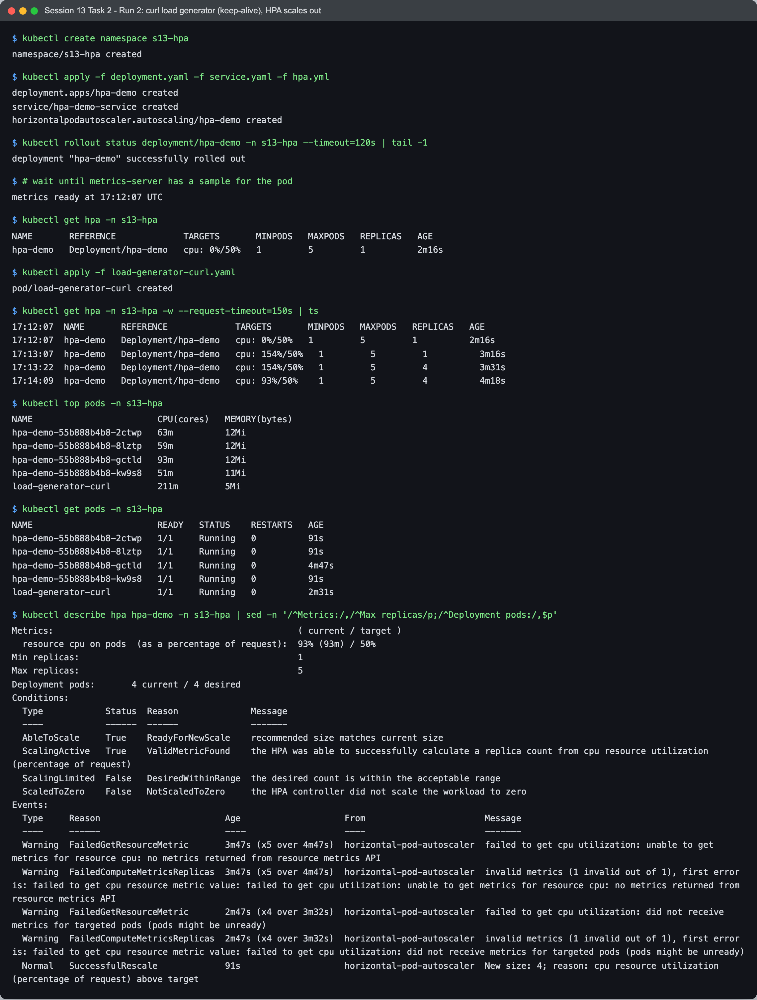

```text
$ kubectl create namespace s13-hpa
namespace/s13-hpa created

$ kubectl apply -f deployment.yaml -f service.yaml -f hpa.yml
deployment.apps/hpa-demo created
service/hpa-demo-service created
horizontalpodautoscaler.autoscaling/hpa-demo created

$ kubectl rollout status deployment/hpa-demo -n s13-hpa --timeout=120s | tail -1
deployment "hpa-demo" successfully rolled out

$ # wait until metrics-server has a sample for the pod
metrics ready at 17:12:07 UTC

$ kubectl get hpa -n s13-hpa
NAME       REFERENCE             TARGETS       MINPODS   MAXPODS   REPLICAS   AGE
hpa-demo   Deployment/hpa-demo   cpu: 0%/50%   1         5         1          2m16s

$ kubectl apply -f load-generator-curl.yaml
pod/load-generator-curl created

$ kubectl get hpa -n s13-hpa -w --request-timeout=150s | ts
17:12:07  NAME       REFERENCE             TARGETS       MINPODS   MAXPODS   REPLICAS   AGE
17:12:07  hpa-demo   Deployment/hpa-demo   cpu: 0%/50%   1         5         1          2m16s
17:13:07  hpa-demo   Deployment/hpa-demo   cpu: 154%/50%   1         5         1          3m16s
17:13:22  hpa-demo   Deployment/hpa-demo   cpu: 154%/50%   1         5         4          3m31s
17:14:09  hpa-demo   Deployment/hpa-demo   cpu: 93%/50%    1         5         4          4m18s

$ kubectl top pods -n s13-hpa
NAME                        CPU(cores)   MEMORY(bytes)   
hpa-demo-55b888b4b8-2ctwp   63m          12Mi            
hpa-demo-55b888b4b8-8lztp   59m          12Mi            
hpa-demo-55b888b4b8-gctld   93m          12Mi            
hpa-demo-55b888b4b8-kw9s8   51m          11Mi            
load-generator-curl         211m         5Mi

$ kubectl get pods -n s13-hpa
NAME                        READY   STATUS    RESTARTS   AGE
hpa-demo-55b888b4b8-2ctwp   1/1     Running   0          91s
hpa-demo-55b888b4b8-8lztp   1/1     Running   0          91s
hpa-demo-55b888b4b8-gctld   1/1     Running   0          4m47s
hpa-demo-55b888b4b8-kw9s8   1/1     Running   0          91s
load-generator-curl         1/1     Running   0          2m31s

$ kubectl describe hpa hpa-demo -n s13-hpa | sed -n '/^Metrics:/,/^Max replicas/p;/^Deployment pods:/,$p'
Metrics:                                               ( current / target )
  resource cpu on pods  (as a percentage of request):  93% (93m) / 50%
Min replicas:                                          1
Max replicas:                                          5
Deployment pods:       4 current / 4 desired
Conditions:
  Type            Status  Reason              Message
  ----            ------  ------              -------
  AbleToScale     True    ReadyForNewScale    recommended size matches current size
  ScalingActive   True    ValidMetricFound    the HPA was able to successfully calculate a replica count from cpu resource utilization (percentage of request)
  ScalingLimited  False   DesiredWithinRange  the desired count is within the acceptable range
  ScaledToZero    False   NotScaledToZero     the HPA controller did not scale the workload to zero
Events:
  Type     Reason                        Age                    From                       Message
  ----     ------                        ----                   ----                       -------
  Warning  FailedGetResourceMetric       3m47s (x5 over 4m47s)  horizontal-pod-autoscaler  failed to get cpu utilization: unable to get metrics for resource cpu: no metrics returned from resource metrics API
  Warning  FailedComputeMetricsReplicas  3m47s (x5 over 4m47s)  horizontal-pod-autoscaler  invalid metrics (1 invalid out of 1), first error is: failed to get cpu resource metric value: failed to get cpu utilization: unable to get metrics for resource cpu: no metrics returned from resource metrics API
  Warning  FailedGetResourceMetric       2m47s (x4 over 3m32s)  horizontal-pod-autoscaler  failed to get cpu utilization: did not receive metrics for targeted pods (pods might be unready)
  Warning  FailedComputeMetricsReplicas  2m47s (x4 over 3m32s)  horizontal-pod-autoscaler  invalid metrics (1 invalid out of 1), first error is: failed to get cpu resource metric value: failed to get cpu utilization: did not receive metrics for targeted pods (pods might be unready)
  Normal   SuccessfulRescale             91s                    horizontal-pod-autoscaler  New size: 4; reason: cpu resource utilization (percentage of request) above target
```

| Time (UTC) | CPU | Replicas | Why |
| --- | --- | --- | --- |
| 17:12:07 | 0% | 1 | load generator just created |
| 17:13:07 | 154% | 1 | the single pod is at 154m of its 100m request; ceil(1 * 154/50) = ceil(3.08) = **4** |
| 17:13:22 | 154% | **4** | one step from 1 to 4 (default scale up policy: +4 pods or +100% every 15s, the larger wins) |
| 17:14:09 | 93% | 4 | no change, see below |

This time the client used 211m and the nginx pods 51m to 93m each, so the load really landed on the app. The 93% at 17:14:09 is only the old pod: the three new pods were just started and had no usable CPU sample yet. In that case the HPA redoes the math assuming the missing pods use 0% for a scale up, (93 + 0 + 0 + 0) / 4 = 23%, which would point downwards, so it does nothing ("recommended size matches current size") instead of jumping straight to 5. That is a safety rule against over scaling on incomplete data.

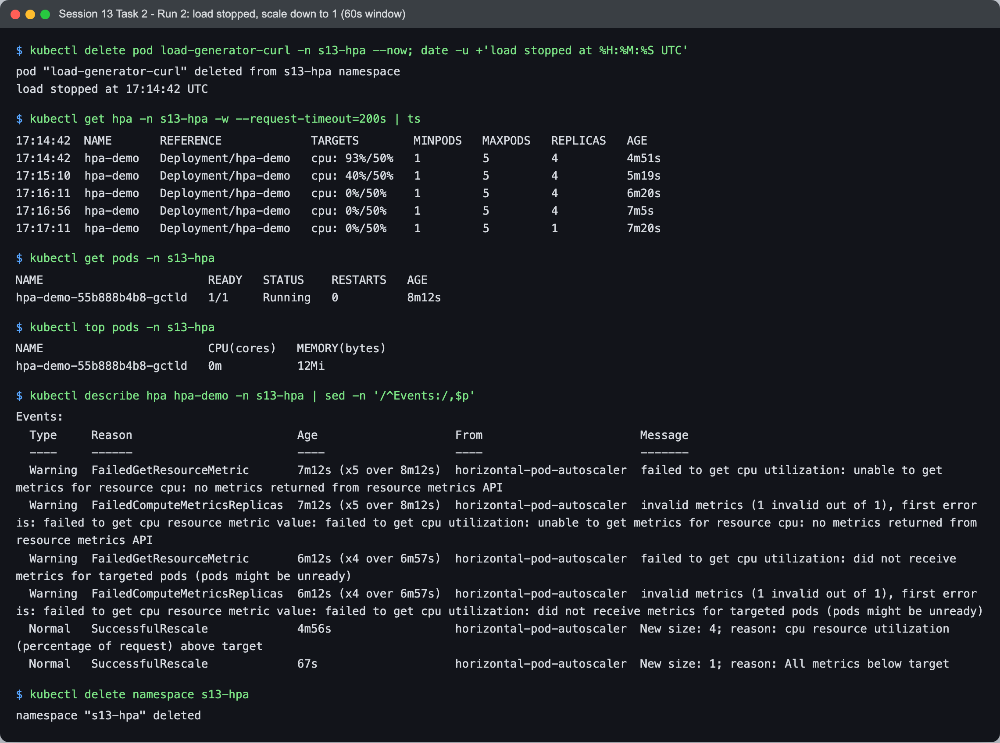

```text
$ kubectl delete pod load-generator-curl -n s13-hpa --now; date -u +'load stopped at %H:%M:%S UTC'
pod "load-generator-curl" deleted from s13-hpa namespace
load stopped at 17:14:42 UTC

$ kubectl get hpa -n s13-hpa -w --request-timeout=200s | ts
17:14:42  NAME       REFERENCE             TARGETS        MINPODS   MAXPODS   REPLICAS   AGE
17:14:42  hpa-demo   Deployment/hpa-demo   cpu: 93%/50%   1         5         4          4m51s
17:15:10  hpa-demo   Deployment/hpa-demo   cpu: 40%/50%   1         5         4          5m19s
17:16:11  hpa-demo   Deployment/hpa-demo   cpu: 0%/50%    1         5         4          6m20s
17:16:56  hpa-demo   Deployment/hpa-demo   cpu: 0%/50%    1         5         4          7m5s
17:17:11  hpa-demo   Deployment/hpa-demo   cpu: 0%/50%    1         5         1          7m20s

$ kubectl get pods -n s13-hpa
NAME                        READY   STATUS    RESTARTS   AGE
hpa-demo-55b888b4b8-gctld   1/1     Running   0          8m12s

$ kubectl top pods -n s13-hpa
NAME                        CPU(cores)   MEMORY(bytes)   
hpa-demo-55b888b4b8-gctld   0m           12Mi

$ kubectl describe hpa hpa-demo -n s13-hpa | sed -n '/^Events:/,$p'
Events:
  Type     Reason                        Age                    From                       Message
  ----     ------                        ----                   ----                       -------
  Warning  FailedGetResourceMetric       7m12s (x5 over 8m12s)  horizontal-pod-autoscaler  failed to get cpu utilization: unable to get metrics for resource cpu: no metrics returned from resource metrics API
  Warning  FailedComputeMetricsReplicas  7m12s (x5 over 8m12s)  horizontal-pod-autoscaler  invalid metrics (1 invalid out of 1), first error is: failed to get cpu resource metric value: failed to get cpu utilization: unable to get metrics for resource cpu: no metrics returned from resource metrics API
  Warning  FailedGetResourceMetric       6m12s (x4 over 6m57s)  horizontal-pod-autoscaler  failed to get cpu utilization: did not receive metrics for targeted pods (pods might be unready)
  Warning  FailedComputeMetricsReplicas  6m12s (x4 over 6m57s)  horizontal-pod-autoscaler  invalid metrics (1 invalid out of 1), first error is: failed to get cpu resource metric value: failed to get cpu utilization: did not receive metrics for targeted pods (pods might be unready)
  Normal   SuccessfulRescale             4m56s                  horizontal-pod-autoscaler  New size: 4; reason: cpu resource utilization (percentage of request) above target
  Normal   SuccessfulRescale             67s                    horizontal-pod-autoscaler  New size: 1; reason: All metrics below target

$ kubectl delete namespace s13-hpa
namespace "s13-hpa" deleted
```

Load stopped at 17:14:42. CPU fell to 40% at 17:15:10 and 0% at 17:16:11. With 0% the formula gives ceil(4 * 0/50) = 0, clamped to `minReplicas` 1, but the HPA kept 4 pods until 17:17:11 because of my 60 second scale down stabilization window (it uses the highest recommendation of the last 60 seconds). Then it went from 4 straight to 1 in one step, since the default scale down policy allows removing 100% of the extra pods every 15 seconds. Event: `New size: 1; reason: All metrics below target`.

---

## Task 3 - Mini project: Production-ready web app

I implemented the course mini project as written, only renaming the namespace from `production-webapp` to `s13-production-webapp`.

| File | Purpose |
| --- | --- |
| [`03-mini-project/namespace.yaml`](03-mini-project/namespace.yaml) | the namespace |
| [`03-mini-project/pvc.yaml`](03-mini-project/pvc.yaml) | `web-data`, 500Mi, ReadWriteOnce, default StorageClass |
| [`03-mini-project/deployment.yaml`](03-mini-project/deployment.yaml) | `web-app`, 2 replicas, nginx with startup/readiness/liveness probes, requests 100m/64Mi, limits 200m/128Mi, PVC mounted at `/data`, `strategy: Recreate` |
| [`03-mini-project/service.yaml`](03-mini-project/service.yaml) | ClusterIP `web-service` on port 80 |
| [`03-mini-project/hpa.yaml`](03-mini-project/hpa.yaml) | `web-app-hpa`, 2 to 5 replicas, 50% CPU |

### Step 1 - Deploy everything

```bash
kubectl apply -f namespace.yaml
kubectl apply -f pvc.yaml
kubectl apply -f deployment.yaml -f service.yaml
kubectl apply -f hpa.yaml
```

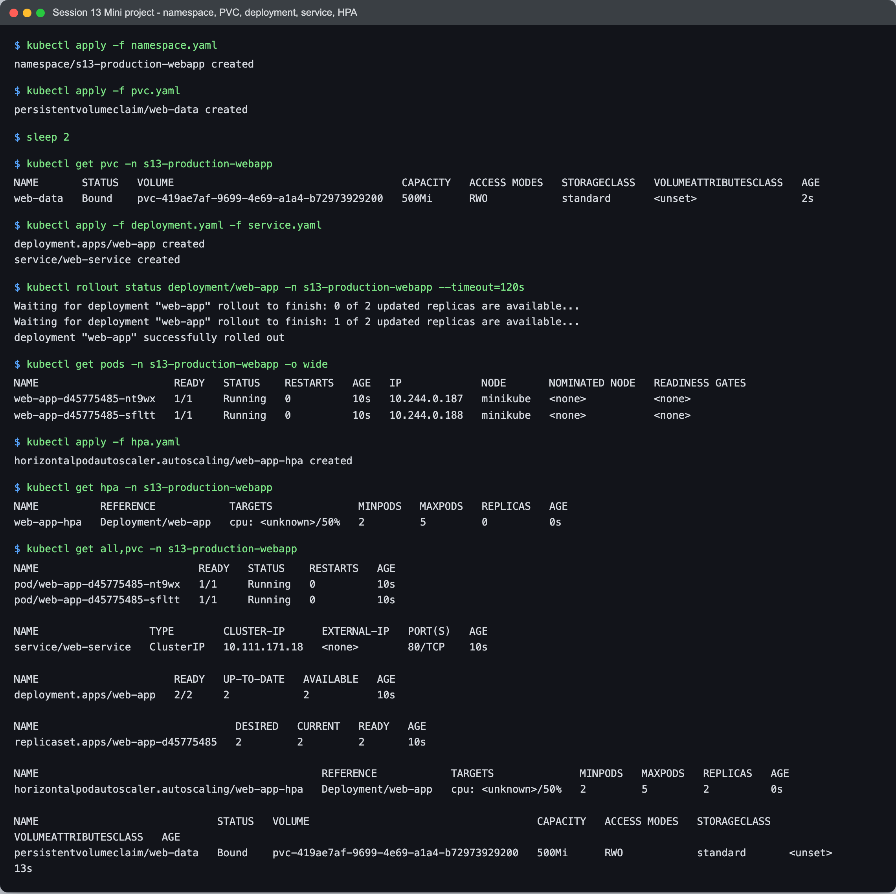

```text
$ kubectl apply -f namespace.yaml
namespace/s13-production-webapp created

$ kubectl apply -f pvc.yaml
persistentvolumeclaim/web-data created

$ sleep 2

$ kubectl get pvc -n s13-production-webapp
NAME       STATUS   VOLUME                                     CAPACITY   ACCESS MODES   STORAGECLASS   VOLUMEATTRIBUTESCLASS   AGE
web-data   Bound    pvc-419ae7af-9699-4e69-a1a4-b72973929200   500Mi      RWO            standard       <unset>                 2s

$ kubectl apply -f deployment.yaml -f service.yaml
deployment.apps/web-app created
service/web-service created

$ kubectl rollout status deployment/web-app -n s13-production-webapp --timeout=120s
Waiting for deployment "web-app" rollout to finish: 0 of 2 updated replicas are available...
Waiting for deployment "web-app" rollout to finish: 1 of 2 updated replicas are available...
deployment "web-app" successfully rolled out

$ kubectl get pods -n s13-production-webapp -o wide
NAME                      READY   STATUS    RESTARTS   AGE   IP             NODE       NOMINATED NODE   READINESS GATES
web-app-d45775485-nt9wx   1/1     Running   0          10s   10.244.0.187   minikube   <none>           <none>
web-app-d45775485-sfltt   1/1     Running   0          10s   10.244.0.188   minikube   <none>           <none>

$ kubectl apply -f hpa.yaml
horizontalpodautoscaler.autoscaling/web-app-hpa created

$ kubectl get hpa -n s13-production-webapp
NAME          REFERENCE            TARGETS              MINPODS   MAXPODS   REPLICAS   AGE
web-app-hpa   Deployment/web-app   cpu: <unknown>/50%   2         5         0          0s

$ kubectl get all,pvc -n s13-production-webapp
NAME                          READY   STATUS    RESTARTS   AGE
pod/web-app-d45775485-nt9wx   1/1     Running   0          10s
pod/web-app-d45775485-sfltt   1/1     Running   0          10s

NAME                  TYPE        CLUSTER-IP      EXTERNAL-IP   PORT(S)   AGE
service/web-service   ClusterIP   10.111.171.18   <none>        80/TCP    10s

NAME                      READY   UP-TO-DATE   AVAILABLE   AGE
deployment.apps/web-app   2/2     2            2           10s

NAME                                DESIRED   CURRENT   READY   AGE
replicaset.apps/web-app-d45775485   2         2         2       10s

NAME                                              REFERENCE            TARGETS              MINPODS   MAXPODS   REPLICAS   AGE
horizontalpodautoscaler.autoscaling/web-app-hpa   Deployment/web-app   cpu: <unknown>/50%   2         5         2          0s

NAME                             STATUS   VOLUME                                     CAPACITY   ACCESS MODES   STORAGECLASS   VOLUMEATTRIBUTESCLASS   AGE
persistentvolumeclaim/web-data   Bound    pvc-419ae7af-9699-4e69-a1a4-b72973929200   500Mi      RWO            standard       <unset>                 13s
```

The PVC was `Bound` 2 seconds after creation because `standard` uses `Immediate` binding and dynamic provisioning. Both pods are `1/1`, which means the startup and readiness probes already passed.

### Step 2 - Probes, resources and the volume on a pod

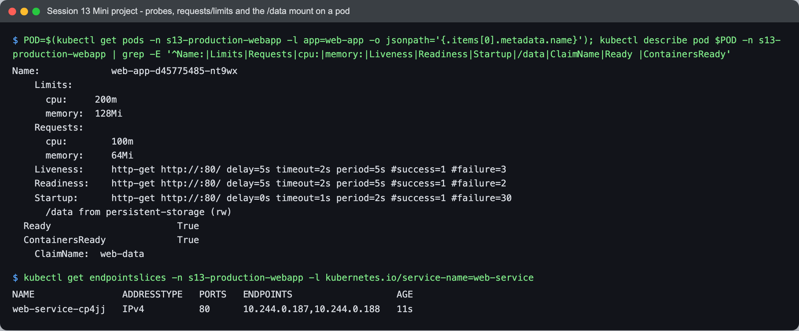

```text
$ POD=$(kubectl get pods -n s13-production-webapp -l app=web-app -o jsonpath='{.items[0].metadata.name}'); kubectl describe pod $POD -n s13-production-webapp | grep -E '^Name:|Limits|Requests|cpu:|memory:|Liveness|Readiness|Startup|/data|ClaimName|Ready |ContainersReady'
Name:             web-app-d45775485-nt9wx
    Limits:
      cpu:     200m
      memory:  128Mi
    Requests:
      cpu:        100m
      memory:     64Mi
    Liveness:     http-get http://:80/ delay=5s timeout=2s period=5s #success=1 #failure=3
    Readiness:    http-get http://:80/ delay=5s timeout=2s period=5s #success=1 #failure=2
    Startup:      http-get http://:80/ delay=0s timeout=1s period=2s #success=1 #failure=30
      /data from persistent-storage (rw)
  Ready                       True 
  ContainersReady             True 
    ClaimName:  web-data

$ kubectl get endpointslices -n s13-production-webapp -l kubernetes.io/service-name=web-service
NAME                ADDRESSTYPE   PORTS   ENDPOINTS                   AGE
web-service-cp4jj   IPv4          80      10.244.0.187,10.244.0.188   11s
```

What each probe does here:

- **Startup** (`/` every 2s, up to 30 failures = 60s budget): while it has not passed, the other two probes are not run. It protects slow starting apps from being killed by the liveness probe.
- **Readiness** (`/` every 5s, 2 failures): decides whether the pod IP is a ready endpoint of `web-service`. Failing it takes the pod out of the Service but does not restart it.
- **Liveness** (`/` every 5s, 3 failures): if it fails 3 times in a row (about 15s) the kubelet kills and restarts the container.

The requests matter for the HPA (100m is the 100% mark) and the `/data` mount comes from the `web-data` claim.

### Step 3 - Storage persistence

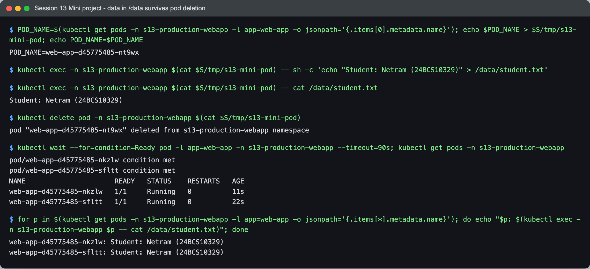

```text
$ POD_NAME=$(kubectl get pods -n s13-production-webapp -l app=web-app -o jsonpath='{.items[0].metadata.name}'); echo $POD_NAME > $S/tmp/s13-mini-pod; echo POD_NAME=$POD_NAME
POD_NAME=web-app-d45775485-nt9wx

$ kubectl exec -n s13-production-webapp $(cat $S/tmp/s13-mini-pod) -- sh -c 'echo "Student: Netram (24BCS10329)" > /data/student.txt'

$ kubectl exec -n s13-production-webapp $(cat $S/tmp/s13-mini-pod) -- cat /data/student.txt
Student: Netram (24BCS10329)

$ kubectl delete pod -n s13-production-webapp $(cat $S/tmp/s13-mini-pod)
pod "web-app-d45775485-nt9wx" deleted from s13-production-webapp namespace

$ kubectl wait --for=condition=Ready pod -l app=web-app -n s13-production-webapp --timeout=90s; kubectl get pods -n s13-production-webapp
pod/web-app-d45775485-nkzlw condition met
pod/web-app-d45775485-sfltt condition met
NAME                      READY   STATUS    RESTARTS   AGE
web-app-d45775485-nkzlw   1/1     Running   0          11s
web-app-d45775485-sfltt   1/1     Running   0          22s

$ for p in $(kubectl get pods -n s13-production-webapp -l app=web-app -o jsonpath='{.items[*].metadata.name}'); do echo "$p: $(kubectl exec -n s13-production-webapp $p -- cat /data/student.txt)"; done
web-app-d45775485-nkzlw: Student: Netram (24BCS10329)
web-app-d45775485-sfltt: Student: Netram (24BCS10329)
```

I wrote my name to `/data/student.txt`, deleted that pod, and the replacement pod (`nkzlw`) read the same file. Both replicas print the same content because they mount the **same** PVC. That works even though the claim is `ReadWriteOnce`: RWO means "mounted read write by one **node**", and on single node minikube both pods are on the same node. On a real multi node cluster a second replica on another node could not mount it (that is what `ReadWriteOncePod` or `ReadWriteMany` storage is for), which is probably why the course deployment uses `strategy: Recreate`.

### Step 4 - Service check

I used local port 18300 instead of 8080.

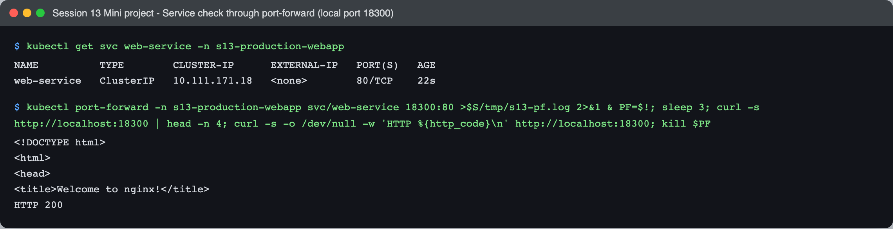

```text
$ kubectl get svc web-service -n s13-production-webapp
NAME          TYPE        CLUSTER-IP      EXTERNAL-IP   PORT(S)   AGE
web-service   ClusterIP   10.111.171.18   <none>        80/TCP    22s

$ kubectl port-forward -n s13-production-webapp svc/web-service 18300:80 >$S/tmp/s13-pf.log 2>&1 & PF=$!; sleep 3; curl -s http://localhost:18300 | head -n 4; curl -s -o /dev/null -w 'HTTP %{http_code}\n' http://localhost:18300; kill $PF
<!DOCTYPE html>
<html>
<head>
<title>Welcome to nginx!</title>
HTTP 200
```

### Step 5 - Trigger HPA scaling

The course command (`kubectl run load-generator --image=busybox:1.36 ... wget` loop) did not create enough load on my cluster (see "Problems I hit", item 4), so I used the same `kubectl run` idea with `curl` and keep-alive connections. The deployment and HPA YAMLs are unchanged.

```bash
kubectl run load-generator -n s13-production-webapp --image=nginx:1.27 --restart=Never --command -- \
  sh -c 'while true; do curl -s -Z --parallel-max 4 "http://web-service/?[1-100000]" > /dev/null; done'
kubectl get hpa -n s13-production-webapp -w
```

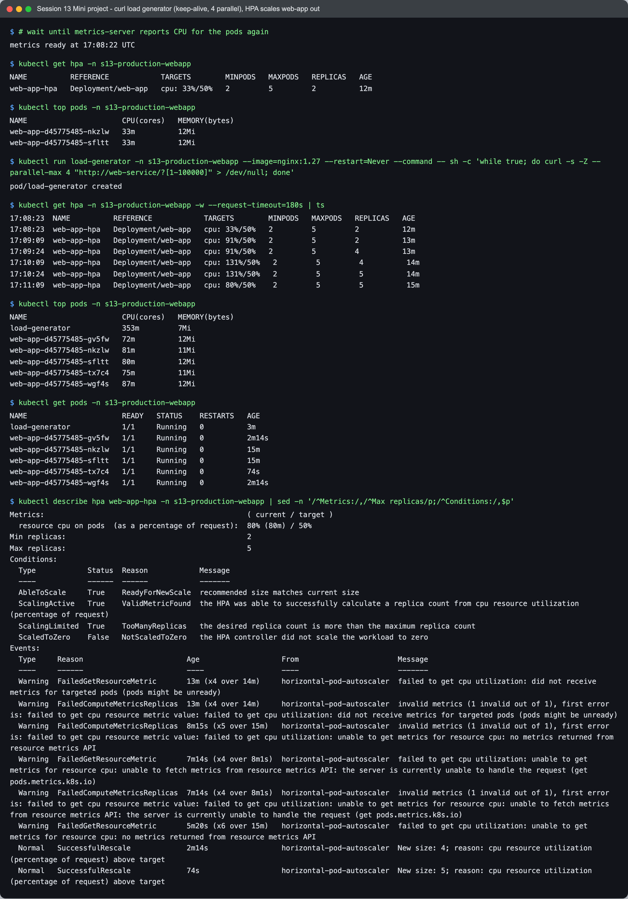

```text
$ # wait until metrics-server reports CPU for the pods again
metrics ready at 17:08:22 UTC

$ kubectl get hpa -n s13-production-webapp
NAME          REFERENCE            TARGETS        MINPODS   MAXPODS   REPLICAS   AGE
web-app-hpa   Deployment/web-app   cpu: 33%/50%   2         5         2          12m

$ kubectl top pods -n s13-production-webapp
NAME                      CPU(cores)   MEMORY(bytes)   
web-app-d45775485-nkzlw   33m          12Mi            
web-app-d45775485-sfltt   33m          12Mi

$ kubectl run load-generator -n s13-production-webapp --image=nginx:1.27 --restart=Never --command -- sh -c 'while true; do curl -s -Z --parallel-max 4 "http://web-service/?[1-100000]" > /dev/null; done'
pod/load-generator created

$ kubectl get hpa -n s13-production-webapp -w --request-timeout=180s | ts
17:08:23  NAME          REFERENCE            TARGETS        MINPODS   MAXPODS   REPLICAS   AGE
17:08:23  web-app-hpa   Deployment/web-app   cpu: 33%/50%   2         5         2          12m
17:09:09  web-app-hpa   Deployment/web-app   cpu: 91%/50%   2         5         2          13m
17:09:24  web-app-hpa   Deployment/web-app   cpu: 91%/50%   2         5         4          13m
17:10:09  web-app-hpa   Deployment/web-app   cpu: 131%/50%   2         5         4          14m
17:10:24  web-app-hpa   Deployment/web-app   cpu: 131%/50%   2         5         5          14m
17:11:09  web-app-hpa   Deployment/web-app   cpu: 80%/50%    2         5         5          15m

$ kubectl top pods -n s13-production-webapp
NAME                      CPU(cores)   MEMORY(bytes)   
load-generator            353m         7Mi             
web-app-d45775485-gv5fw   72m          12Mi            
web-app-d45775485-nkzlw   81m          11Mi            
web-app-d45775485-sfltt   80m          12Mi            
web-app-d45775485-tx7c4   75m          11Mi            
web-app-d45775485-wgf4s   87m          12Mi

$ kubectl get pods -n s13-production-webapp
NAME                      READY   STATUS    RESTARTS   AGE
load-generator            1/1     Running   0          3m
web-app-d45775485-gv5fw   1/1     Running   0          2m14s
web-app-d45775485-nkzlw   1/1     Running   0          15m
web-app-d45775485-sfltt   1/1     Running   0          15m
web-app-d45775485-tx7c4   1/1     Running   0          74s
web-app-d45775485-wgf4s   1/1     Running   0          2m14s

$ kubectl describe hpa web-app-hpa -n s13-production-webapp | sed -n '/^Metrics:/,/^Max replicas/p;/^Conditions:/,$p'
Metrics:                                               ( current / target )
  resource cpu on pods  (as a percentage of request):  80% (80m) / 50%
Min replicas:                                          2
Max replicas:                                          5
Conditions:
  Type            Status  Reason            Message
  ----            ------  ------            -------
  AbleToScale     True    ReadyForNewScale  recommended size matches current size
  ScalingActive   True    ValidMetricFound  the HPA was able to successfully calculate a replica count from cpu resource utilization (percentage of request)
  ScalingLimited  True    TooManyReplicas   the desired replica count is more than the maximum replica count
  ScaledToZero    False   NotScaledToZero   the HPA controller did not scale the workload to zero
Events:
  Type     Reason                        Age                   From                       Message
  ----     ------                        ----                  ----                       -------
  Warning  FailedGetResourceMetric       13m (x4 over 14m)     horizontal-pod-autoscaler  failed to get cpu utilization: did not receive metrics for targeted pods (pods might be unready)
  Warning  FailedComputeMetricsReplicas  13m (x4 over 14m)     horizontal-pod-autoscaler  invalid metrics (1 invalid out of 1), first error is: failed to get cpu resource metric value: failed to get cpu utilization: did not receive metrics for targeted pods (pods might be unready)
  Warning  FailedComputeMetricsReplicas  8m15s (x5 over 15m)   horizontal-pod-autoscaler  invalid metrics (1 invalid out of 1), first error is: failed to get cpu resource metric value: failed to get cpu utilization: unable to get metrics for resource cpu: no metrics returned from resource metrics API
  Warning  FailedGetResourceMetric       7m14s (x4 over 8m1s)  horizontal-pod-autoscaler  failed to get cpu utilization: unable to get metrics for resource cpu: unable to fetch metrics from resource metrics API: the server is currently unable to handle the request (get pods.metrics.k8s.io)
  Warning  FailedComputeMetricsReplicas  7m14s (x4 over 8m1s)  horizontal-pod-autoscaler  invalid metrics (1 invalid out of 1), first error is: failed to get cpu resource metric value: failed to get cpu utilization: unable to get metrics for resource cpu: unable to fetch metrics from resource metrics API: the server is currently unable to handle the request (get pods.metrics.k8s.io)
  Warning  FailedGetResourceMetric       5m20s (x6 over 15m)   horizontal-pod-autoscaler  failed to get cpu utilization: unable to get metrics for resource cpu: no metrics returned from resource metrics API
  Normal   SuccessfulRescale             2m14s                 horizontal-pod-autoscaler  New size: 4; reason: cpu resource utilization (percentage of request) above target
  Normal   SuccessfulRescale             74s                   horizontal-pod-autoscaler  New size: 5; reason: cpu resource utilization (percentage of request) above target
```

| Time (UTC) | CPU | Replicas | Why |
| --- | --- | --- | --- |
| 17:08:23 | 33% | 2 | old value from my previous (stopped) wget attempt |
| 17:09:09 | 91% | 2 | ceil(2 * 91/50) = ceil(3.64) = **4** |
| 17:09:24 | 91% | **4** | event `New size: 4` |
| 17:10:09 | 131% | 4 | ceil(4 * 131/50) = 11, but `maxReplicas` is 5 |
| 17:10:24 | 131% | **5** | event `New size: 5` |
| 17:11:09 | 80% | 5 | ceil(5 * 80/50) = 8, still capped: condition `ScalingLimited True TooManyReplicas` |

The HPA added up to 4 pods in a single step because the default scale up policy allows +100% or +4 pods every 15 seconds (whichever is bigger). It stays at 5 even though 80% is above the target, because 5 is the maximum; in a real setup that condition tells you to raise `maxReplicas` or give the pods more CPU. The new pods only receive traffic once their readiness probe passes.

Then I stopped the load (`kubectl delete pod load-generator -n s13-production-webapp --now`) and started a 450 second `kubectl get hpa -w` watch. This HPA has no `behavior` block, so the default 300 second scale down stabilization window applies. My capture process for that watch got stopped before it saved its output, so instead of the watch I show the end state and the HPA events with their exact UTC timestamps (all `Killing load-generator` lines are my load generators being deleted; the last one at 17:11:23 is the curl one):

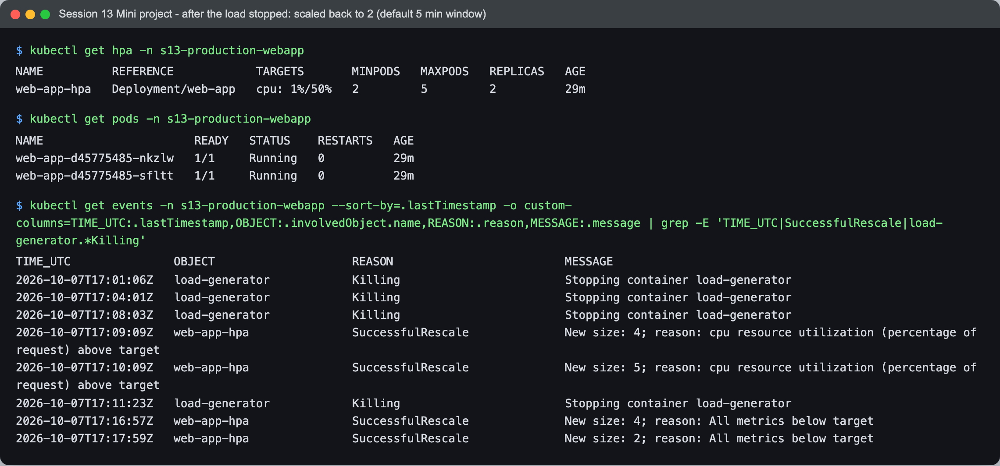

```text
$ kubectl get hpa -n s13-production-webapp
NAME          REFERENCE            TARGETS       MINPODS   MAXPODS   REPLICAS   AGE
web-app-hpa   Deployment/web-app   cpu: 1%/50%   2         5         2          29m

$ kubectl get pods -n s13-production-webapp
NAME                      READY   STATUS    RESTARTS   AGE
web-app-d45775485-nkzlw   1/1     Running   0          29m
web-app-d45775485-sfltt   1/1     Running   0          29m

$ kubectl get events -n s13-production-webapp --sort-by=.lastTimestamp -o custom-columns=TIME_UTC:.lastTimestamp,OBJECT:.involvedObject.name,REASON:.reason,MESSAGE:.message | grep -E 'TIME_UTC|SuccessfulRescale|load-generator.*Killing'
TIME_UTC               OBJECT                    REASON                         MESSAGE
2026-10-07T17:01:06Z   load-generator            Killing                        Stopping container load-generator
2026-10-07T17:04:01Z   load-generator            Killing                        Stopping container load-generator
2026-10-07T17:08:03Z   load-generator            Killing                        Stopping container load-generator
2026-10-07T17:09:09Z   web-app-hpa               SuccessfulRescale              New size: 4; reason: cpu resource utilization (percentage of request) above target
2026-10-07T17:10:09Z   web-app-hpa               SuccessfulRescale              New size: 5; reason: cpu resource utilization (percentage of request) above target
2026-10-07T17:11:23Z   load-generator            Killing                        Stopping container load-generator
2026-10-07T17:16:57Z   web-app-hpa               SuccessfulRescale              New size: 4; reason: All metrics below target
2026-10-07T17:17:59Z   web-app-hpa               SuccessfulRescale              New size: 2; reason: All metrics below target
```

- 17:11:23 load stopped.
- 17:16:57 (5.5 minutes later) `New size: 4`, and 17:17:59 `New size: 2`, which is `minReplicas`.
- Nothing happened for the first 5 minutes even though CPU dropped to about 1%: the HPA uses the highest recommendation from the last 300 seconds, and 5 minutes earlier the pods were still busy. It went 5 -> 4 -> 2 instead of 5 -> 2 because the samples right after the stop (when some traffic was still being counted) recommended 4, and those had to age out of the window too.
- This is the default on purpose: scaling down too quickly and then back up again (flapping) is worse than paying for a few idle pods for 5 minutes. In Task 2 I shortened it to 60 seconds only to save time.

### Bonus challenge 2 - Readiness gating

I did the bonus challenges on a copy of the same YAMLs in a separate namespace `s13-mini-bonus` (generated with `sed` on the fly), so they would not disturb the HPA test running at the same time.

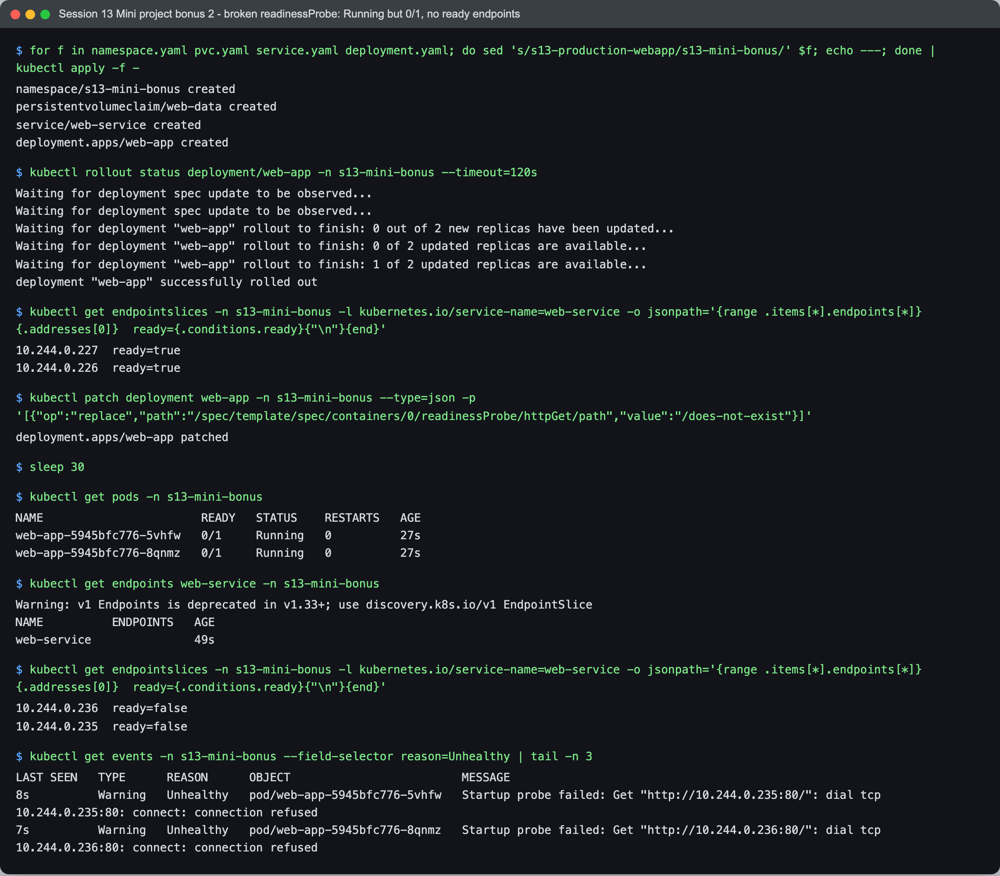

```text
$ for f in namespace.yaml pvc.yaml service.yaml deployment.yaml; do sed 's/s13-production-webapp/s13-mini-bonus/' $f; echo ---; done | kubectl apply -f -
namespace/s13-mini-bonus created
persistentvolumeclaim/web-data created
service/web-service created
deployment.apps/web-app created

$ kubectl rollout status deployment/web-app -n s13-mini-bonus --timeout=120s
Waiting for deployment spec update to be observed...
Waiting for deployment spec update to be observed...
Waiting for deployment "web-app" rollout to finish: 0 out of 2 new replicas have been updated...
Waiting for deployment "web-app" rollout to finish: 0 of 2 updated replicas are available...
Waiting for deployment "web-app" rollout to finish: 1 of 2 updated replicas are available...
deployment "web-app" successfully rolled out

$ kubectl get endpointslices -n s13-mini-bonus -l kubernetes.io/service-name=web-service -o jsonpath='{range .items[*].endpoints[*]}{.addresses[0]}  ready={.conditions.ready}{"\n"}{end}'
10.244.0.227  ready=true
10.244.0.226  ready=true

$ kubectl patch deployment web-app -n s13-mini-bonus --type=json -p '[{"op":"replace","path":"/spec/template/spec/containers/0/readinessProbe/httpGet/path","value":"/does-not-exist"}]'
deployment.apps/web-app patched

$ sleep 30

$ kubectl get pods -n s13-mini-bonus
NAME                       READY   STATUS    RESTARTS   AGE
web-app-5945bfc776-5vhfw   0/1     Running   0          27s
web-app-5945bfc776-8qnmz   0/1     Running   0          27s

$ kubectl get endpoints web-service -n s13-mini-bonus
Warning: v1 Endpoints is deprecated in v1.33+; use discovery.k8s.io/v1 EndpointSlice
NAME          ENDPOINTS   AGE
web-service               49s

$ kubectl get endpointslices -n s13-mini-bonus -l kubernetes.io/service-name=web-service -o jsonpath='{range .items[*].endpoints[*]}{.addresses[0]}  ready={.conditions.ready}{"\n"}{end}'
10.244.0.236  ready=false
10.244.0.235  ready=false

$ kubectl get events -n s13-mini-bonus --field-selector reason=Unhealthy | tail -n 3
LAST SEEN   TYPE      REASON      OBJECT                         MESSAGE
8s          Warning   Unhealthy   pod/web-app-5945bfc776-5vhfw   Startup probe failed: Get "http://10.244.0.235:80/": dial tcp 10.244.0.235:80: connect: connection refused
7s          Warning   Unhealthy   pod/web-app-5945bfc776-8qnmz   Startup probe failed: Get "http://10.244.0.236:80/": dial tcp 10.244.0.236:80: connect: connection refused
```

After changing `readinessProbe.httpGet.path` to `/does-not-exist`, both pods are `Running` but `0/1`, and the old `kubectl get endpoints` shows no endpoints, exactly as the README says. One thing I learned: `kubectl get endpointslices -o wide` still lists both IPs, because EndpointSlices keep not ready endpoints with `ready=false`; you have to look at the condition (my jsonpath query) to see that they are not used. Note that the only `Unhealthy` events I got were from the startup probe (`connection refused` while nginx was starting); I did not see any "Readiness probe failed" events on this cluster, so the pod READY column and the EndpointSlice condition were the real evidence.

### Bonus challenge 3 - Liveness restart loop

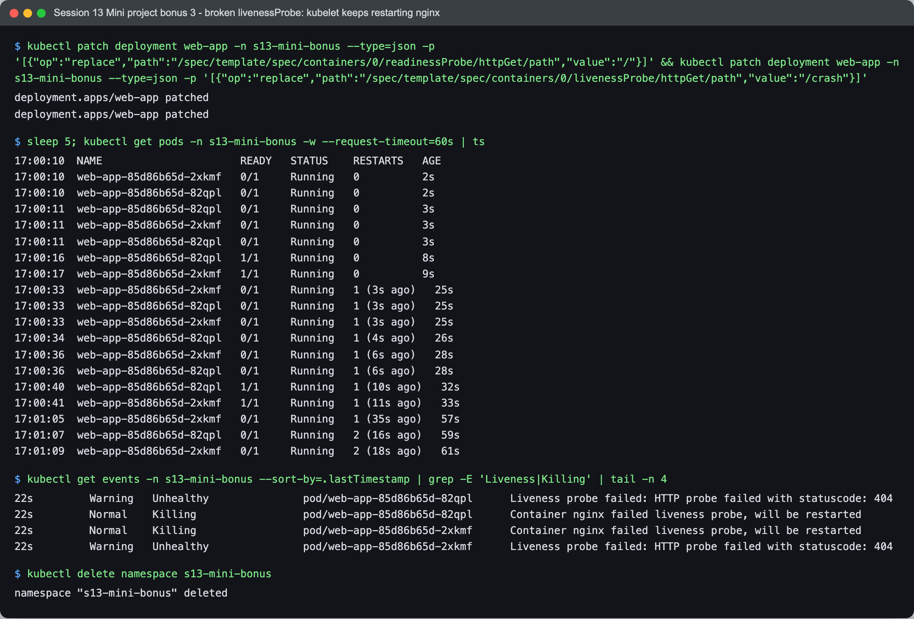

```text
$ kubectl patch deployment web-app -n s13-mini-bonus --type=json -p '[{"op":"replace","path":"/spec/template/spec/containers/0/readinessProbe/httpGet/path","value":"/"}]' && kubectl patch deployment web-app -n s13-mini-bonus --type=json -p '[{"op":"replace","path":"/spec/template/spec/containers/0/livenessProbe/httpGet/path","value":"/crash"}]'
deployment.apps/web-app patched
deployment.apps/web-app patched

$ sleep 5; kubectl get pods -n s13-mini-bonus -w --request-timeout=60s | ts
17:00:10  NAME                      READY   STATUS    RESTARTS   AGE
17:00:10  web-app-85d86b65d-2xkmf   0/1     Running   0          2s
17:00:10  web-app-85d86b65d-82qpl   0/1     Running   0          2s
17:00:11  web-app-85d86b65d-82qpl   0/1     Running   0          3s
17:00:11  web-app-85d86b65d-2xkmf   0/1     Running   0          3s
17:00:11  web-app-85d86b65d-82qpl   0/1     Running   0          3s
17:00:16  web-app-85d86b65d-82qpl   1/1     Running   0          8s
17:00:17  web-app-85d86b65d-2xkmf   1/1     Running   0          9s
17:00:33  web-app-85d86b65d-2xkmf   0/1     Running   1 (3s ago)   25s
17:00:33  web-app-85d86b65d-82qpl   0/1     Running   1 (3s ago)   25s
17:00:33  web-app-85d86b65d-2xkmf   0/1     Running   1 (3s ago)   25s
17:00:34  web-app-85d86b65d-82qpl   0/1     Running   1 (4s ago)   26s
17:00:36  web-app-85d86b65d-2xkmf   0/1     Running   1 (6s ago)   28s
17:00:36  web-app-85d86b65d-82qpl   0/1     Running   1 (6s ago)   28s
17:00:40  web-app-85d86b65d-82qpl   1/1     Running   1 (10s ago)   32s
17:00:41  web-app-85d86b65d-2xkmf   1/1     Running   1 (11s ago)   33s
17:01:05  web-app-85d86b65d-2xkmf   0/1     Running   1 (35s ago)   57s
17:01:07  web-app-85d86b65d-82qpl   0/1     Running   2 (16s ago)   59s
17:01:09  web-app-85d86b65d-2xkmf   0/1     Running   2 (18s ago)   61s

$ kubectl get events -n s13-mini-bonus --sort-by=.lastTimestamp | grep -E 'Liveness|Killing' | tail -n 4
22s         Warning   Unhealthy               pod/web-app-85d86b65d-82qpl      Liveness probe failed: HTTP probe failed with statuscode: 404
22s         Normal    Killing                 pod/web-app-85d86b65d-82qpl      Container nginx failed liveness probe, will be restarted
22s         Normal    Killing                 pod/web-app-85d86b65d-2xkmf      Container nginx failed liveness probe, will be restarted
22s         Warning   Unhealthy               pod/web-app-85d86b65d-2xkmf      Liveness probe failed: HTTP probe failed with statuscode: 404

$ kubectl delete namespace s13-mini-bonus
namespace "s13-mini-bonus" deleted
```

With `livenessProbe.httpGet.path: /crash` nginx answers 404, so after 3 failed checks the kubelet kills the container: `RESTARTS` goes 0 -> 1 -> 2 roughly every 20 to 30 seconds, and the events say `Liveness probe failed: HTTP probe failed with statuscode: 404` and `Container nginx failed liveness probe, will be restarted`. Each restart also makes the pod briefly `0/1` until readiness passes again. The pod never gets a chance to be useful, which is why a wrong liveness path is so much worse than a wrong readiness path.

---

## Cleanup

The `s13-hpa` namespace was deleted as the last command of Task 2 run 2 (see the Step 5 output). Then the mini project:

```text
$ kubectl delete namespace s13-production-webapp
namespace "s13-production-webapp" deleted

$ kubectl get ns | grep -E '^s13-' || echo 'no s13- namespaces left'
no s13- namespaces left

$ kubectl get pv | grep -E 's13' || echo 'no s13 PVs left'
pvc-419ae7af-9699-4e69-a1a4-b72973929200   500Mi      RWO            Delete           Released   s13-production-webapp/web-data   standard       <unset>                          30m
pvc-daf93396-da86-46c3-b155-2d37dddb82e8   500Mi      RWO            Delete           Released   s13-mini-bonus/web-data          standard       <unset>                          27m

$ kubectl get storageclass
NAME                 PROVISIONER                RECLAIMPOLICY   VOLUMEBINDINGMODE   ALLOWVOLUMEEXPANSION   AGE
standard (default)   k8s.io/minikube-hostpath   Delete          Immediate           false                  75m

$ minikube ssh -- 'ls /tmp | grep s13; ls /tmp/hostpath-provisioner | grep s13' || echo 'no s13 folders left on the node'
s13-mini-bonus
s13-production-webapp
```

The two dynamic PVs from the mini project (`standard` class, `Delete` policy) stayed `Released` instead of being deleted, so I removed them and their folders on the node by hand:

```text
$ kubectl delete pv pvc-419ae7af-9699-4e69-a1a4-b72973929200 pvc-daf93396-da86-46c3-b155-2d37dddb82e8
persistentvolume "pvc-419ae7af-9699-4e69-a1a4-b72973929200" deleted
persistentvolume "pvc-daf93396-da86-46c3-b155-2d37dddb82e8" deleted

$ minikube ssh -- sudo rm -rf /tmp/hostpath-provisioner/s13-mini-bonus /tmp/hostpath-provisioner/s13-production-webapp

$ kubectl get pv | grep -E 's13' || echo 'no s13 PVs left'
No resources found
no s13 PVs left

$ minikube ssh -- 'ls /tmp | grep s13; ls /tmp/hostpath-provisioner | grep s13' || echo 'no s13 folders left on the node'
ssh: Process exited with status 1
no s13 folders left on the node
```

(Task 1 cleanup, including the s13- PVs, StorageClasses and node folders, is at the end of [01-kubernetes-volumes/README.md](01-kubernetes-volumes/README.md#cleanup). The `s13-mini-bonus` namespace was deleted at the end of the bonus run above.)

---

## What I learned

- **Pick the volume by lifetime.** emptyDir lives with the pod, hostPath with the node, a PV with neither. Apps should mount a PVC and let the cluster decide where the PV comes from.
- **The default StorageClass is applied silently.** A PVC with no `storageClassName` is not "no class" on minikube, it is `standard`. To bind a hand made PV I had to use `storageClassName: ""`.
- **reclaimPolicy and volumeBindingMode are StorageClass knobs with real effects.** `Delete` removed the dynamic PV with its data, `Retain` left it `Released`. `WaitForFirstConsumer` kept the PVC `Pending` until a pod was scheduled.
- **HPA math is simple and predictable** once I remember that utilization is measured against the CPU request: `ceil(current * util / target)`, a 10% tolerance, min/max clamping, and a scale down stabilization window.
- **The load generator can be the bottleneck.** A busybox `wget` loop costs far more CPU on the client than nginx spends serving the page, so the course style command did not trigger much scaling on my cluster. A keep-alive client (`curl` with a URL range) puts the work on the server instead.
- **Readiness vs liveness.** Readiness failure removes a pod from the Service but keeps it running; liveness failure restarts it. Startup probes stop liveness from killing a slow starter.

## Problems I hit

1. **Course `pv.yaml` + `pvc.yaml` did not bind to each other.** When I applied them as written (only names changed), the PVC got the default `standard` class and a new dynamic PV, while my static PV stayed `Available`:

   ```text
$ kubectl get pv,pvc -n s13-vol   # course pv.yaml + pvc.yaml applied as written (only names changed)
NAME                                       CAPACITY   ACCESS MODES   RECLAIM POLICY   STATUS      CLAIM              STORAGECLASS   VOLUMEATTRIBUTESCLASS   REASON   AGE
s13-test-pv                                1Gi        RWO            Retain           Available                                     <unset>                          10s
pvc-e01f99bc-0cb7-499a-8049-5c44a14c3960   500Mi      RWO            Delete           Bound       s13-vol/test-pvc   standard       <unset>                          10s
NAME       STATUS   VOLUME                                     CAPACITY   ACCESS MODES   STORAGECLASS   VOLUMEATTRIBUTESCLASS   AGE
test-pvc   Bound    pvc-e01f99bc-0cb7-499a-8049-5c44a14c3960   500Mi      RWO            standard       <unset>                 10s
   ```

   Fix: `storageClassName: ""` on both the PV and the PVC (I also pinned `volumeName`), see [`static-pvc.yaml`](01-kubernetes-volumes/static-pvc.yaml).

2. **WaitForFirstConsumer did not work with the minikube hostpath provisioner.** The PVC and the pod stayed `Pending` with `ProvisioningFailed ... User "system:serviceaccount:kube-system:storage-provisioner" cannot get resource "nodes"`. I did not change RBAC on the shared cluster; I showed WaitForFirstConsumer with a `kubernetes.io/no-provisioner` class and a pre created PV instead. Details in the Task 1 README, section 4a.

3. **`timeout` does not exist on macOS.** My first HPA capture used `timeout 200 kubectl get hpa -w` and printed `/bin/bash: timeout: command not found`, so it missed the whole scale up. I deleted the namespace and redid Task 2 using `kubectl get hpa -w --request-timeout=200s`, which ends the watch by itself.

4. **The busybox `wget` load generator was too weak.** With 3 loops the HPA only went from 1 to 2 pods (Task 2 run 1). In the mini project, the course style generator with 4 loops kept the two pods at only 27%, and with 8 loops it was even lower (19%, the node was busy at that time), so the HPA never scaled:

   ```text
$ kubectl get hpa web-app-hpa -n s13-production-webapp; kubectl top pods -n s13-production-webapp    # 17:00:50 UTC, about 2.5 min after starting the 4-loop load-generator
NAME          REFERENCE            TARGETS        MINPODS   MAXPODS   REPLICAS   AGE
web-app-hpa   Deployment/web-app   cpu: 27%/50%   2         5         2          5m4s
NAME                      CPU(cores)   MEMORY(bytes)   
load-generator            495m         6Mi             
web-app-d45775485-nkzlw   28m          11Mi            
web-app-d45775485-sfltt   27m          12Mi

$ kubectl get hpa web-app-hpa -n s13-production-webapp; kubectl top pods -n s13-production-webapp    # 17:08:03 UTC, 8-loop busybox wget generator running
NAME          REFERENCE            TARGETS        MINPODS   MAXPODS   REPLICAS   AGE
web-app-hpa   Deployment/web-app   cpu: 19%/50%   2         5         2          12m
NAME                      CPU(cores)   MEMORY(bytes)   
load-generator            635m         5Mi             
web-app-d45775485-nkzlw   33m          12Mi            
web-app-d45775485-sfltt   33m          12Mi
   ```

   More loops just meant more CPU for the client. The fix was a client that does not start a process per request: `curl` with a URL range and keep-alive (`curl -Z --parallel-max 4 "http://web-service/?[1-100000]"`, curl is already in the `nginx:1.27` image). With that, the same 2 pods jumped to 91% and the HPA scaled out.

5. **metrics-server went unready on the shared node.** While a 16 loop wget generator was running, `kubectl top` returned `ServiceUnavailable`, metrics-server was `0/1` with `Failed to scrape node, timeout to access kubelet`, and the minikube node had about 90 MiB free RAM, swap almost full and a load average of 49 (other workloads were running on the same cluster too). I deleted my load generator right away; metrics came back about a minute later. This is also why my Task 2 run 1 scale down log ends with `<unknown>`.

6. **`kubectl get endpoints` is deprecated** in v1.33+ (it prints a warning), and `kubectl get endpointslices -o wide` lists not ready addresses too. I had to query `.conditions.ready` to show the readiness effect properly.

7. **Lost one watch capture.** The 450 second `kubectl get hpa -w` for the mini project scale down was interrupted before my capture script wrote it out, so for that step I used `kubectl get events` with timestamps as the evidence (Task 3, Step 5).

8. **Two `Delete` PVs were left `Released`.** In Task 1, deleting `dynamic-pvc` removed its PV within 3 seconds. But the PVs of the mini project and the bonus namespace, whose PVCs were removed by deleting the whole namespace, stayed `Released` (the bonus one for about 25 minutes) with no events, so the minikube provisioner never cleaned them up. I did not find the cause in the time I had; I deleted them and their node folders manually.

9. Because I stopped the first mini project capture run (problem 4) in the middle, its screenshots for steps 1 to 4 (and later the Step 5 scale up one, for the same reason) had not been rendered yet. I rendered them afterwards from the saved transcript of that same run, so the text and the images match.
