# Session 15 - Helm - Task

- **Name:** Netram
- **Enrollment No:** 24BCS10329

> **Status:** completed
>
> Run on macOS (Apple Silicon) with Docker Desktop, minikube v1.39.0, Kubernetes v1.37.0, Helm v3.22.0.

---

## What the task asked

1. **Task 1:** Hands-on with `helm create`, `install`, `list`, `status`, `get` (values / manifest / notes / all), `upgrade`, `history`, `rollback`, `uninstall`, `repo` (add / update / list) and `search` (repo / hub). Run every command, understand it, capture the output and document it.
2. **Task 2:** A complete rollback workflow: Install, Upgrade, Verify, Upgrade again, Verify, Rollback, Verify.
3. **Task 3:** The Helm mini project (Notes App chart): lint, template, install, upgrade with production values, a deliberately bad upgrade, rollback, uninstall.

## What is in this folder

| Path | What it is |
|------|------------|
| `hello-helm/` | Chart generated by `helm create` for Task 1. I changed only `appVersion` (so the image is `nginx:1.25-alpine`) and added small `resources`. |
| `webapp-chart/` | My own small chart for Task 2: Deployment + Service + ConfigMap (the HTML page), `_helpers.tpl`, `NOTES.txt`, plus `values-v2.yaml` and `values-v3.yaml` for the two upgrades. |
| `notes-chart/` | The course mini project chart (copied from `../mini-project/notes-chart`), with `values.yaml` (dev) and `values-prod.yaml`. |
| `screenshots/` | One terminal screenshot per step. The text under each screenshot is the same run. |

I used my own namespaces (`s15-task1`, `s15-task2`, `s15-notes`) and release names starting with `s15-`, and I deleted all of them at the end.

## Key ideas, in my own words

- **Chart:** a folder of templated Kubernetes YAML plus `Chart.yaml` (name, chart `version`, `appVersion`) and `values.yaml` (defaults).
- **Release:** one installed copy of a chart in a namespace, with a name. The same chart can be installed many times under different release names.
- **Revision:** every install, upgrade and rollback of a release gets a new number. A rollback does not go "back" to an old number; it creates a new revision whose content is copied from the old one.
- **Values precedence:** chart `values.yaml` < files passed with `-f` (later files win) < `--set` on the command line. I proved this with `helm template` in Task 2.
- **Rendering:** Helm runs the Go templates with `.Values`, `.Release`, `.Chart` and produces plain YAML. `helm template` does this locally with no cluster; `install` / `upgrade` render the same way and then send the YAML to the API server.
- **Where Helm keeps state:** Helm 3 has no server side component. Each revision is stored as a Secret named `sh.helm.release.v1.<release>.v<revision>` of type `helm.sh/release.v1` in the release's namespace. Inside is base64 + gzip JSON with the chart, the values and the rendered manifest. That is why `helm history` and `helm rollback` work, and why `helm uninstall` deletes them.

---

## Task 1 - Helm commands hands-on

### 1.1 `helm version` and `helm create`

`helm create` makes a ready-to-use chart (nginx Deployment, Service, ServiceAccount, optional Ingress / HPA / HTTPRoute and a test pod). The default image tag is empty, which means "use `appVersion` from Chart.yaml". `appVersion` was `1.16.0`, which is an old image not on my node, so I changed it to `1.25-alpine` (already cached on the node). Memory on my minikube is tight, so I also gave the container small requests and a limit.

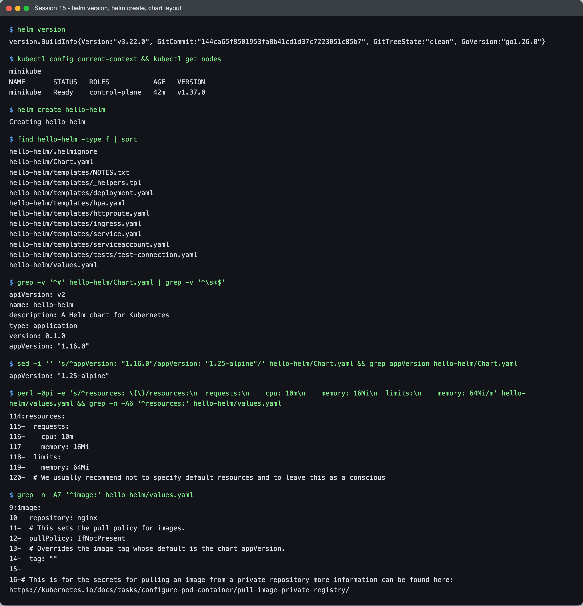

```text
$ helm version
version.BuildInfo{Version:"v3.22.0", GitCommit:"144ca65f8501953fa8b41cd1d37c7223051c85b7", GitTreeState:"clean", GoVersion:"go1.26.8"}

$ kubectl config current-context && kubectl get nodes
minikube
NAME       STATUS   ROLES           AGE   VERSION
minikube   Ready    control-plane   42m   v1.37.0

$ helm create hello-helm
Creating hello-helm

$ find hello-helm -type f | sort
hello-helm/.helmignore
hello-helm/Chart.yaml
hello-helm/templates/NOTES.txt
hello-helm/templates/_helpers.tpl
hello-helm/templates/deployment.yaml
hello-helm/templates/hpa.yaml
hello-helm/templates/httproute.yaml
hello-helm/templates/ingress.yaml
hello-helm/templates/service.yaml
hello-helm/templates/serviceaccount.yaml
hello-helm/templates/tests/test-connection.yaml
hello-helm/values.yaml

$ grep -v '^#' hello-helm/Chart.yaml | grep -v '^\s*$'
apiVersion: v2
name: hello-helm
description: A Helm chart for Kubernetes
type: application
version: 0.1.0
appVersion: "1.16.0"

$ sed -i '' 's/^appVersion: "1.16.0"/appVersion: "1.25-alpine"/' hello-helm/Chart.yaml && grep appVersion hello-helm/Chart.yaml
appVersion: "1.25-alpine"

$ perl -0pi -e 's/^resources: \{\}/resources:\n  requests:\n    cpu: 10m\n    memory: 16Mi\n  limits:\n    memory: 64Mi/m' hello-helm/values.yaml && grep -n -A6 '^resources:' hello-helm/values.yaml
114:resources:
115-  requests:
116-    cpu: 10m
117-    memory: 16Mi
118-  limits:
119-    memory: 64Mi
120-  # We usually recommend not to specify default resources and to leave this as a conscious

$ grep -n -A7 '^image:' hello-helm/values.yaml
9:image:
10-  repository: nginx
11-  # This sets the pull policy for images.
12-  pullPolicy: IfNotPresent
13-  # Overrides the image tag whose default is the chart appVersion.
14-  tag: ""
15-
16-# This is for the secrets for pulling an image from a private repository more information can be found here: https://kubernetes.io/docs/tasks/configure-pod-container/pull-image-private-registry/
```

### 1.2 `helm lint` and `helm template`

`lint` checks the chart for errors (only an INFO about a missing icon). `template` renders everything locally; I can see `{{ .Values.replicaCount }}` became `1` and the image became `nginx:1.25-alpine` because of `appVersion`. `--show-only` renders one file.

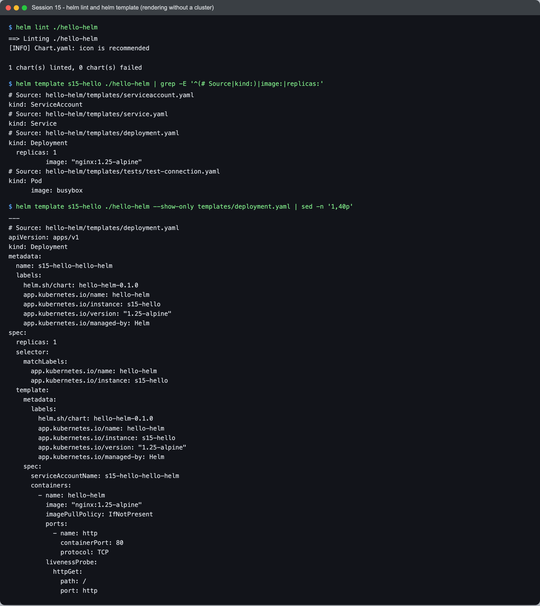

```text
$ helm lint ./hello-helm
==> Linting ./hello-helm
[INFO] Chart.yaml: icon is recommended

1 chart(s) linted, 0 chart(s) failed

$ helm template s15-hello ./hello-helm | grep -E '^(# Source|kind:)|image:|replicas:'
# Source: hello-helm/templates/serviceaccount.yaml
kind: ServiceAccount
# Source: hello-helm/templates/service.yaml
kind: Service
# Source: hello-helm/templates/deployment.yaml
kind: Deployment
  replicas: 1
          image: "nginx:1.25-alpine"
# Source: hello-helm/templates/tests/test-connection.yaml
kind: Pod
      image: busybox

$ helm template s15-hello ./hello-helm --show-only templates/deployment.yaml | sed -n '1,40p'
---
# Source: hello-helm/templates/deployment.yaml
apiVersion: apps/v1
kind: Deployment
metadata:
  name: s15-hello-hello-helm
  labels:
    helm.sh/chart: hello-helm-0.1.0
    app.kubernetes.io/name: hello-helm
    app.kubernetes.io/instance: s15-hello
    app.kubernetes.io/version: "1.25-alpine"
    app.kubernetes.io/managed-by: Helm
spec:
  replicas: 1
  selector:
    matchLabels:
      app.kubernetes.io/name: hello-helm
      app.kubernetes.io/instance: s15-hello
  template:
    metadata:
      labels:
        helm.sh/chart: hello-helm-0.1.0
        app.kubernetes.io/name: hello-helm
        app.kubernetes.io/instance: s15-hello
        app.kubernetes.io/version: "1.25-alpine"
        app.kubernetes.io/managed-by: Helm
    spec:
      serviceAccountName: s15-hello-hello-helm
      containers:
        - name: hello-helm
          image: "nginx:1.25-alpine"
          imagePullPolicy: IfNotPresent
          ports:
            - name: http
              containerPort: 80
              protocol: TCP
          livenessProbe:
            httpGet:
              path: /
              port: http
```

### 1.3 `helm install`, `helm list`, `helm status`

`--create-namespace` makes the namespace, `--wait` makes Helm wait until the Deployment is ready before it reports `deployed`. The NOTES text comes from `templates/NOTES.txt`. I checked the real objects with kubectl and called the Service through a port-forward: nginx answered with `Server: nginx/1.25.5`.

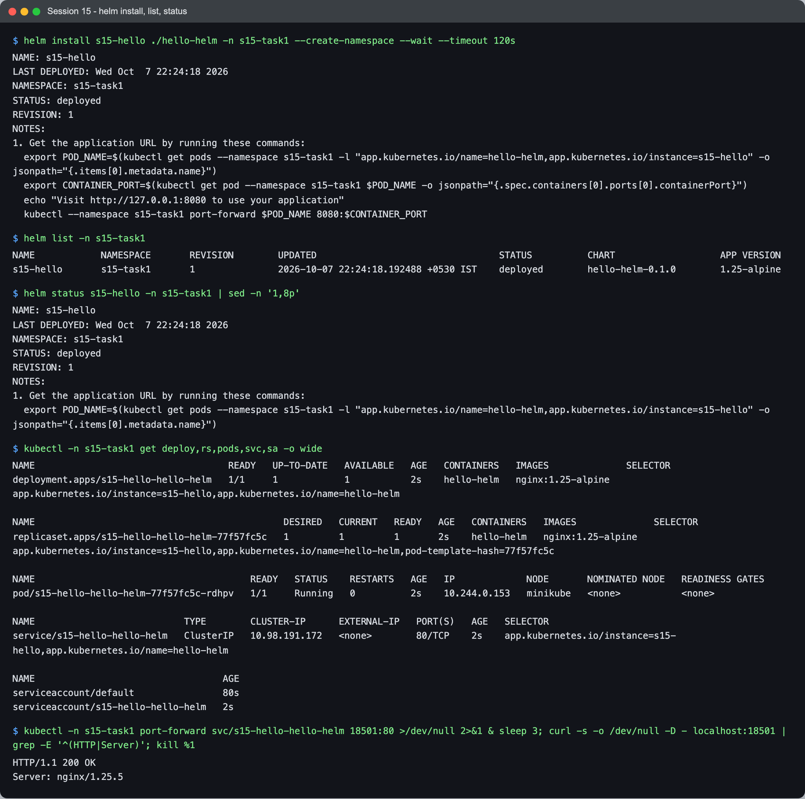

```text
$ helm install s15-hello ./hello-helm -n s15-task1 --create-namespace --wait --timeout 120s
NAME: s15-hello
LAST DEPLOYED: Wed Oct  7 22:24:18 2026
NAMESPACE: s15-task1
STATUS: deployed
REVISION: 1
NOTES:
1. Get the application URL by running these commands:
  export POD_NAME=$(kubectl get pods --namespace s15-task1 -l "app.kubernetes.io/name=hello-helm,app.kubernetes.io/instance=s15-hello" -o jsonpath="{.items[0].metadata.name}")
  export CONTAINER_PORT=$(kubectl get pod --namespace s15-task1 $POD_NAME -o jsonpath="{.spec.containers[0].ports[0].containerPort}")
  echo "Visit http://127.0.0.1:8080 to use your application"
  kubectl --namespace s15-task1 port-forward $POD_NAME 8080:$CONTAINER_PORT

$ helm list -n s15-task1
NAME     	NAMESPACE	REVISION	UPDATED                             	STATUS  	CHART           	APP VERSION
s15-hello	s15-task1	1       	2026-10-07 22:24:18.192488 +0530 IST	deployed	hello-helm-0.1.0	1.25-alpine

$ helm status s15-hello -n s15-task1 | sed -n '1,8p'
NAME: s15-hello
LAST DEPLOYED: Wed Oct  7 22:24:18 2026
NAMESPACE: s15-task1
STATUS: deployed
REVISION: 1
NOTES:
1. Get the application URL by running these commands:
  export POD_NAME=$(kubectl get pods --namespace s15-task1 -l "app.kubernetes.io/name=hello-helm,app.kubernetes.io/instance=s15-hello" -o jsonpath="{.items[0].metadata.name}")

$ kubectl -n s15-task1 get deploy,rs,pods,svc,sa -o wide
NAME                                   READY   UP-TO-DATE   AVAILABLE   AGE   CONTAINERS   IMAGES              SELECTOR
deployment.apps/s15-hello-hello-helm   1/1     1            1           2s    hello-helm   nginx:1.25-alpine   app.kubernetes.io/instance=s15-hello,app.kubernetes.io/name=hello-helm

NAME                                             DESIRED   CURRENT   READY   AGE   CONTAINERS   IMAGES              SELECTOR
replicaset.apps/s15-hello-hello-helm-77f57fc5c   1         1         1       2s    hello-helm   nginx:1.25-alpine   app.kubernetes.io/instance=s15-hello,app.kubernetes.io/name=hello-helm,pod-template-hash=77f57fc5c

NAME                                       READY   STATUS    RESTARTS   AGE   IP             NODE       NOMINATED NODE   READINESS GATES
pod/s15-hello-hello-helm-77f57fc5c-rdhpv   1/1     Running   0          2s    10.244.0.153   minikube   <none>           <none>

NAME                           TYPE        CLUSTER-IP      EXTERNAL-IP   PORT(S)   AGE   SELECTOR
service/s15-hello-hello-helm   ClusterIP   10.98.191.172   <none>        80/TCP    2s    app.kubernetes.io/instance=s15-hello,app.kubernetes.io/name=hello-helm

NAME                                  AGE
serviceaccount/default                80s
serviceaccount/s15-hello-hello-helm   2s

$ kubectl -n s15-task1 port-forward svc/s15-hello-hello-helm 18501:80 >/dev/null 2>&1 & sleep 3; curl -s -o /dev/null -D - localhost:18501 | grep -E '^(HTTP|Server)'; kill %1
HTTP/1.1 200 OK
Server: nginx/1.25.5
```

### 1.4 `helm get values / manifest / notes / all`

- `get values` shows only what *I* supplied (nothing yet, so `null`). `--all` shows the full computed values (chart defaults merged with mine).
- `get manifest` is the exact YAML Helm sent to the cluster for this revision.
- `get notes` re-prints the NOTES.
- `get all` is everything at once (I grepped only the section headers so it fits).

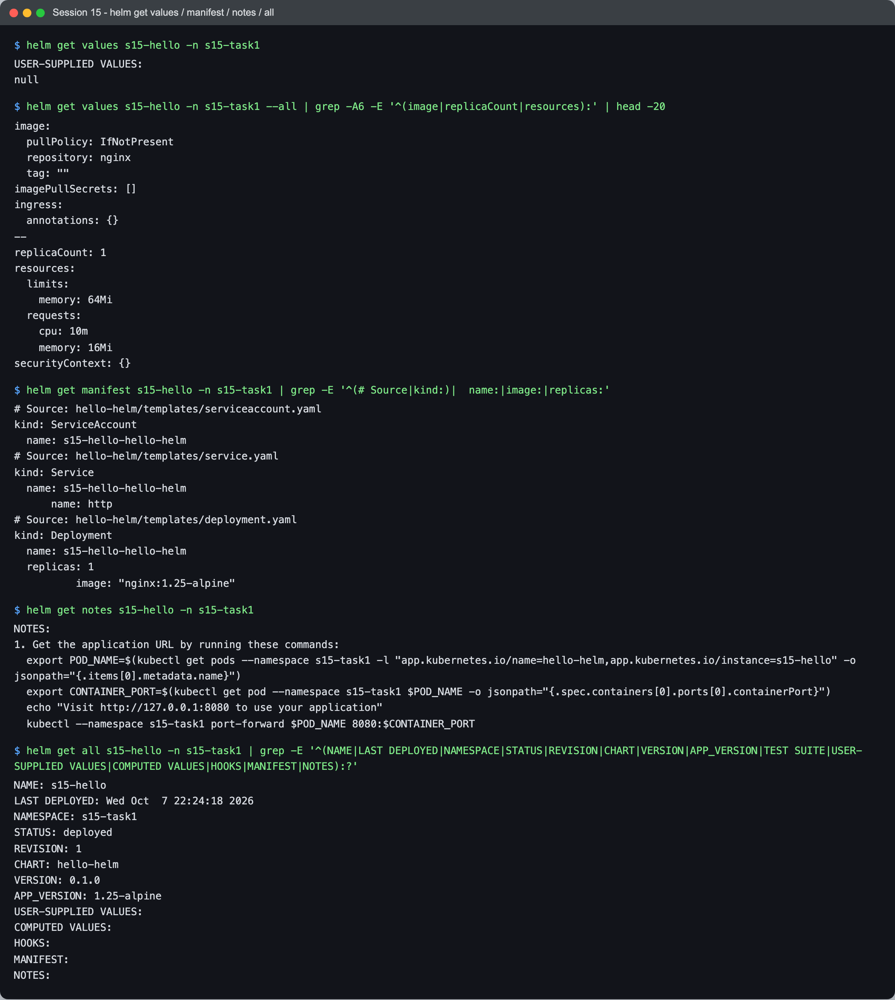

```text
$ helm get values s15-hello -n s15-task1
USER-SUPPLIED VALUES:
null

$ helm get values s15-hello -n s15-task1 --all | grep -A6 -E '^(image|replicaCount|resources):' | head -20
image:
  pullPolicy: IfNotPresent
  repository: nginx
  tag: ""
imagePullSecrets: []
ingress:
  annotations: {}
--
replicaCount: 1
resources:
  limits:
    memory: 64Mi
  requests:
    cpu: 10m
    memory: 16Mi
securityContext: {}

$ helm get manifest s15-hello -n s15-task1 | grep -E '^(# Source|kind:)|  name:|image:|replicas:'
# Source: hello-helm/templates/serviceaccount.yaml
kind: ServiceAccount
  name: s15-hello-hello-helm
# Source: hello-helm/templates/service.yaml
kind: Service
  name: s15-hello-hello-helm
      name: http
# Source: hello-helm/templates/deployment.yaml
kind: Deployment
  name: s15-hello-hello-helm
  replicas: 1
          image: "nginx:1.25-alpine"

$ helm get notes s15-hello -n s15-task1
NOTES:
1. Get the application URL by running these commands:
  export POD_NAME=$(kubectl get pods --namespace s15-task1 -l "app.kubernetes.io/name=hello-helm,app.kubernetes.io/instance=s15-hello" -o jsonpath="{.items[0].metadata.name}")
  export CONTAINER_PORT=$(kubectl get pod --namespace s15-task1 $POD_NAME -o jsonpath="{.spec.containers[0].ports[0].containerPort}")
  echo "Visit http://127.0.0.1:8080 to use your application"
  kubectl --namespace s15-task1 port-forward $POD_NAME 8080:$CONTAINER_PORT

$ helm get all s15-hello -n s15-task1 | grep -E '^(NAME|LAST DEPLOYED|NAMESPACE|STATUS|REVISION|CHART|VERSION|APP_VERSION|TEST SUITE|USER-SUPPLIED VALUES|COMPUTED VALUES|HOOKS|MANIFEST|NOTES):?'
NAME: s15-hello
LAST DEPLOYED: Wed Oct  7 22:24:18 2026
NAMESPACE: s15-task1
STATUS: deployed
REVISION: 1
CHART: hello-helm
VERSION: 0.1.0
APP_VERSION: 1.25-alpine
USER-SUPPLIED VALUES:
COMPUTED VALUES:
HOOKS:
MANIFEST:
NOTES:
```

### 1.5 `helm upgrade` and `helm history`

I upgraded with `--set replicaCount=2 --set image.tag=1.27`. Helm created **revision 2**, the old one became `superseded`. `get values` now shows my two overrides. Two new pods run `nginx:1.27` and the Service answers with `nginx/1.27.5`.

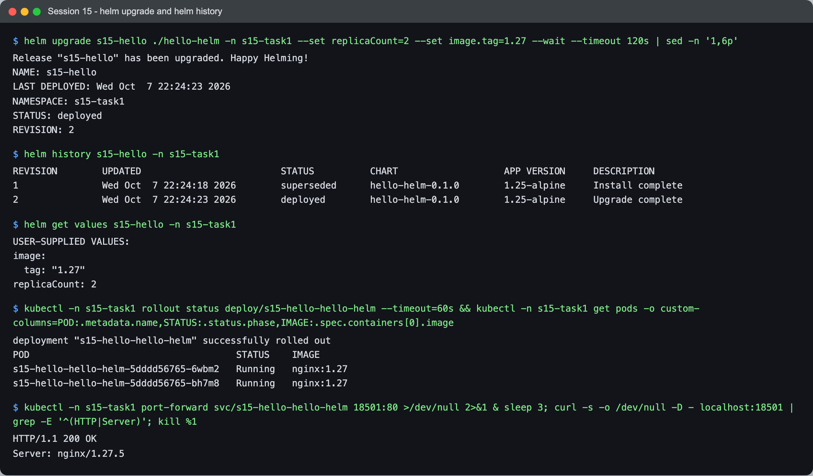

```text
$ helm upgrade s15-hello ./hello-helm -n s15-task1 --set replicaCount=2 --set image.tag=1.27 --wait --timeout 120s | sed -n '1,6p'
Release "s15-hello" has been upgraded. Happy Helming!
NAME: s15-hello
LAST DEPLOYED: Wed Oct  7 22:24:23 2026
NAMESPACE: s15-task1
STATUS: deployed
REVISION: 2

$ helm history s15-hello -n s15-task1
REVISION	UPDATED                 	STATUS    	CHART           	APP VERSION	DESCRIPTION     
1       	Wed Oct  7 22:24:18 2026	superseded	hello-helm-0.1.0	1.25-alpine	Install complete
2       	Wed Oct  7 22:24:23 2026	deployed  	hello-helm-0.1.0	1.25-alpine	Upgrade complete

$ helm get values s15-hello -n s15-task1
USER-SUPPLIED VALUES:
image:
  tag: "1.27"
replicaCount: 2

$ kubectl -n s15-task1 rollout status deploy/s15-hello-hello-helm --timeout=60s && kubectl -n s15-task1 get pods -o custom-columns=POD:.metadata.name,STATUS:.status.phase,IMAGE:.spec.containers[0].image
deployment "s15-hello-hello-helm" successfully rolled out
POD                                     STATUS    IMAGE
s15-hello-hello-helm-5dddd56765-6wbm2   Running   nginx:1.27
s15-hello-hello-helm-5dddd56765-bh7m8   Running   nginx:1.27

$ kubectl -n s15-task1 port-forward svc/s15-hello-hello-helm 18501:80 >/dev/null 2>&1 & sleep 3; curl -s -o /dev/null -D - localhost:18501 | grep -E '^(HTTP|Server)'; kill %1
HTTP/1.1 200 OK
Server: nginx/1.27.5
```

### 1.6 `helm rollback`

`helm rollback s15-hello 1` did not move back to revision 1. It created **revision 3** with description `Rollback to 1`. Revision 2's values are still stored (`--revision 2`), while the current values are back to `null`. The cluster really changed back: one pod on `nginx:1.25-alpine` and the response says `nginx/1.25.5` again.

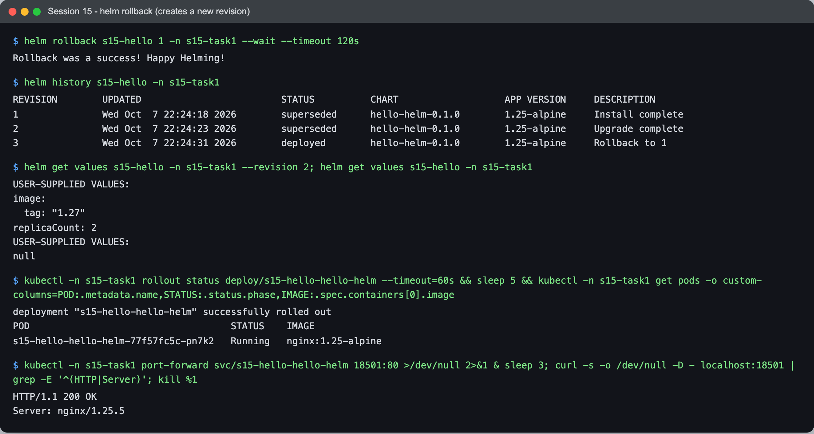

```text
$ helm rollback s15-hello 1 -n s15-task1 --wait --timeout 120s
Rollback was a success! Happy Helming!

$ helm history s15-hello -n s15-task1
REVISION	UPDATED                 	STATUS    	CHART           	APP VERSION	DESCRIPTION     
1       	Wed Oct  7 22:24:18 2026	superseded	hello-helm-0.1.0	1.25-alpine	Install complete
2       	Wed Oct  7 22:24:23 2026	superseded	hello-helm-0.1.0	1.25-alpine	Upgrade complete
3       	Wed Oct  7 22:24:31 2026	deployed  	hello-helm-0.1.0	1.25-alpine	Rollback to 1

$ helm get values s15-hello -n s15-task1 --revision 2; helm get values s15-hello -n s15-task1
USER-SUPPLIED VALUES:
image:
  tag: "1.27"
replicaCount: 2
USER-SUPPLIED VALUES:
null

$ kubectl -n s15-task1 rollout status deploy/s15-hello-hello-helm --timeout=60s && sleep 5 && kubectl -n s15-task1 get pods -o custom-columns=POD:.metadata.name,STATUS:.status.phase,IMAGE:.spec.containers[0].image
deployment "s15-hello-hello-helm" successfully rolled out
POD                                    STATUS    IMAGE
s15-hello-hello-helm-77f57fc5c-pn7k2   Running   nginx:1.25-alpine

$ kubectl -n s15-task1 port-forward svc/s15-hello-hello-helm 18501:80 >/dev/null 2>&1 & sleep 3; curl -s -o /dev/null -D - localhost:18501 | grep -E '^(HTTP|Server)'; kill %1
HTTP/1.1 200 OK
Server: nginx/1.25.5
```

### 1.7 Where Helm stores the release: Secrets of type `helm.sh/release.v1`

One Secret per revision, labelled with `owner=helm`, `name`, `version` and `status`. The data is base64 encoded twice (once by Kubernetes, once by Helm) and gzipped, so I decoded it with `base64 -d | base64 -d | gunzip | jq`. Revision 3 says `Rollback to 1` with no user values; revision 2 still holds `image.tag=1.27, replicaCount=2`.

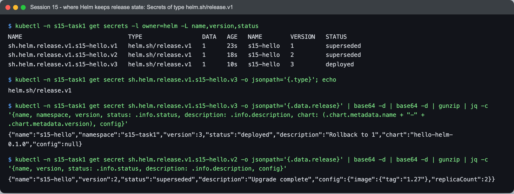

```text
$ kubectl -n s15-task1 get secrets -l owner=helm -L name,version,status
NAME                              TYPE                 DATA   AGE   NAME        VERSION   STATUS
sh.helm.release.v1.s15-hello.v1   helm.sh/release.v1   1      23s   s15-hello   1         superseded
sh.helm.release.v1.s15-hello.v2   helm.sh/release.v1   1      18s   s15-hello   2         superseded
sh.helm.release.v1.s15-hello.v3   helm.sh/release.v1   1      10s   s15-hello   3         deployed

$ kubectl -n s15-task1 get secret sh.helm.release.v1.s15-hello.v3 -o jsonpath='{.type}'; echo
helm.sh/release.v1

$ kubectl -n s15-task1 get secret sh.helm.release.v1.s15-hello.v3 -o jsonpath='{.data.release}' | base64 -d | base64 -d | gunzip | jq -c '{name, namespace, version, status: .info.status, description: .info.description, chart: (.chart.metadata.name + "-" + .chart.metadata.version), config}'
{"name":"s15-hello","namespace":"s15-task1","version":3,"status":"deployed","description":"Rollback to 1","chart":"hello-helm-0.1.0","config":null}

$ kubectl -n s15-task1 get secret sh.helm.release.v1.s15-hello.v2 -o jsonpath='{.data.release}' | base64 -d | base64 -d | gunzip | jq -c '{name, version, status: .info.status, description: .info.description, config}'
{"name":"s15-hello","version":2,"status":"superseded","description":"Upgrade complete","config":{"image":{"tag":"1.27"},"replicaCount":2}}
```

### 1.8 `helm repo add / list / update` and `helm search repo / hub`

I used a separate Helm config folder so my normal Helm repo list was not changed. `search repo` looks only in the repos I added (local cache from `repo update`). `search hub` asks Artifact Hub on the internet, so it finds charts from repos I never added. `helm show chart` reads a chart's `Chart.yaml` without installing it.

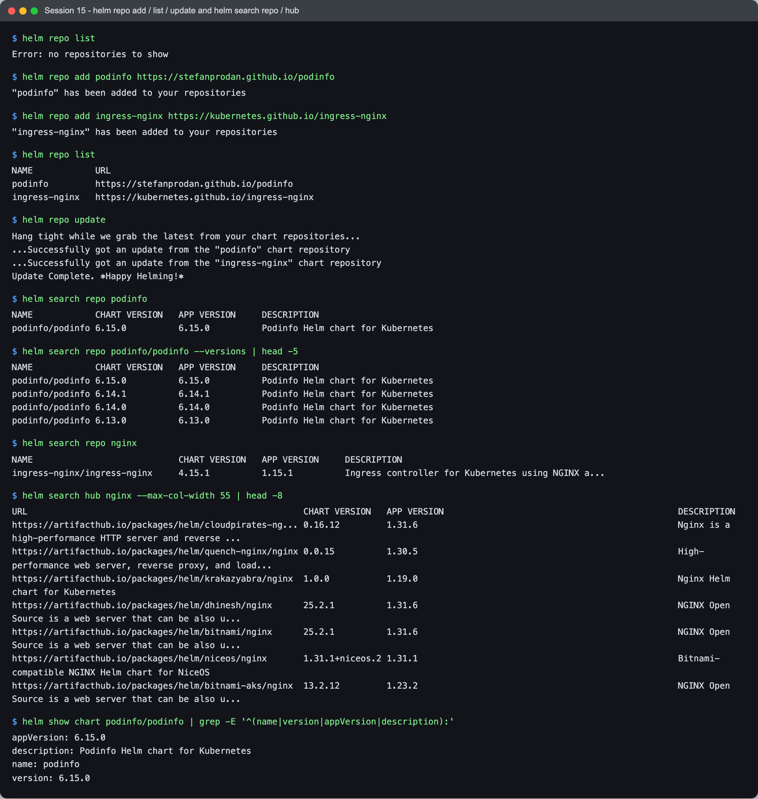

```text
$ helm repo list
Error: no repositories to show

$ helm repo add podinfo https://stefanprodan.github.io/podinfo
"podinfo" has been added to your repositories

$ helm repo add ingress-nginx https://kubernetes.github.io/ingress-nginx
"ingress-nginx" has been added to your repositories

$ helm repo list
NAME         	URL                                       
podinfo      	https://stefanprodan.github.io/podinfo    
ingress-nginx	https://kubernetes.github.io/ingress-nginx

$ helm repo update
Hang tight while we grab the latest from your chart repositories...
...Successfully got an update from the "podinfo" chart repository
...Successfully got an update from the "ingress-nginx" chart repository
Update Complete. ⎈Happy Helming!⎈

$ helm search repo podinfo
NAME           	CHART VERSION	APP VERSION	DESCRIPTION                      
podinfo/podinfo	6.15.0       	6.15.0     	Podinfo Helm chart for Kubernetes

$ helm search repo podinfo/podinfo --versions | head -5
NAME           	CHART VERSION	APP VERSION	DESCRIPTION                      
podinfo/podinfo	6.15.0       	6.15.0     	Podinfo Helm chart for Kubernetes
podinfo/podinfo	6.14.1       	6.14.1     	Podinfo Helm chart for Kubernetes
podinfo/podinfo	6.14.0       	6.14.0     	Podinfo Helm chart for Kubernetes
podinfo/podinfo	6.13.0       	6.13.0     	Podinfo Helm chart for Kubernetes

$ helm search repo nginx
NAME                       	CHART VERSION	APP VERSION	DESCRIPTION                                       
ingress-nginx/ingress-nginx	4.15.1       	1.15.1     	Ingress controller for Kubernetes using NGINX a...

$ helm search hub nginx --max-col-width 55 | head -8
URL                                                    	CHART VERSION  	APP VERSION                                     	DESCRIPTION                                            
https://artifacthub.io/packages/helm/cloudpirates-ng...	0.16.12        	1.31.6                                          	Nginx is a high-performance HTTP server and reverse ...
https://artifacthub.io/packages/helm/quench-nginx/nginx	0.0.15         	1.30.5                                          	High-performance web server, reverse proxy, and load...
https://artifacthub.io/packages/helm/krakazyabra/nginx 	1.0.0          	1.19.0                                          	Nginx Helm chart for Kubernetes                        
https://artifacthub.io/packages/helm/dhinesh/nginx     	25.2.1         	1.31.6                                          	NGINX Open Source is a web server that can be also u...
https://artifacthub.io/packages/helm/bitnami/nginx     	25.2.1         	1.31.6                                          	NGINX Open Source is a web server that can be also u...
https://artifacthub.io/packages/helm/niceos/nginx      	1.31.1+niceos.2	1.31.1                                          	Bitnami-compatible NGINX Helm chart for NiceOS         
https://artifacthub.io/packages/helm/bitnami-aks/nginx 	13.2.12        	1.23.2                                          	NGINX Open Source is a web server that can be also u...

$ helm show chart podinfo/podinfo | grep -E '^(name|version|appVersion|description):'
appVersion: 6.15.0
description: Podinfo Helm chart for Kubernetes
name: podinfo
version: 6.15.0
```

And `helm repo remove` (captured separately, see Problems):

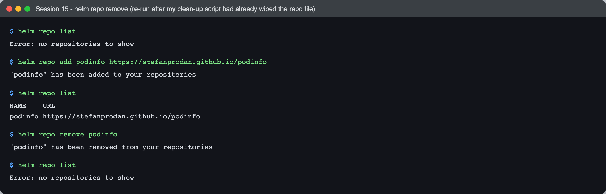

```text
$ helm repo list
Error: no repositories to show

$ helm repo add podinfo https://stefanprodan.github.io/podinfo
"podinfo" has been added to your repositories

$ helm repo list
NAME   	URL                                   
podinfo	https://stefanprodan.github.io/podinfo

$ helm repo remove podinfo
"podinfo" has been removed from your repositories

$ helm repo list
Error: no repositories to show
```

### 1.9 `helm uninstall`

Uninstall removes every object of the release and also the release Secrets, so `helm list --all` is empty and the namespace has no Secrets left.

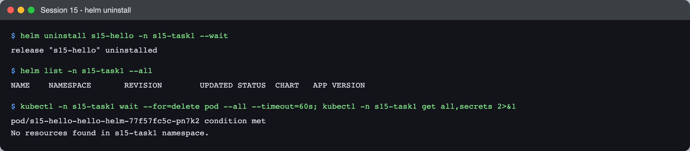

```text
$ helm uninstall s15-hello -n s15-task1 --wait
release "s15-hello" uninstalled

$ helm list -n s15-task1 --all
NAME	NAMESPACE	REVISION	UPDATED	STATUS	CHART	APP VERSION

$ kubectl -n s15-task1 wait --for=delete pod --all --timeout=60s; kubectl -n s15-task1 get all,secrets 2>&1
pod/s15-hello-hello-helm-77f57fc5c-pn7k2 condition met
No resources found in s15-task1 namespace.
```

---

## Task 2 - Full rollback workflow (Install, Upgrade, Verify, Upgrade, Verify, Rollback, Verify)

For this I wrote a small chart, `webapp-chart/`. The home page is an `index.html` in a ConfigMap built from values (`page.version`, `page.message`, `image.tag` and `.Release.Revision`), so I can **see** which version is live with curl, not only in `helm history`. The Deployment has a `checksum/page` annotation (sha256 of the rendered ConfigMap), so a page change also rolls the pods.

| Revision | How | Image | Replicas | Page |
|----------|-----|-------|----------|------|
| 1 | `helm install` (values.yaml) | nginx:1.24-alpine | 1 | v1 |
| 2 | `helm upgrade -f values-v2.yaml` | nginx:1.25-alpine | 2 | v2 |
| 3 | `helm upgrade -f values-v3.yaml` | nginx:1.27 | 2 | v3 |
| 4 | `helm rollback s15-web 2` | nginx:1.25-alpine | 2 | v2 |

Each verify step checks four things: `helm history`, the Deployment spec (replicas + image), the pods (with a `page-version` label) and the real HTTP response through a port-forward.

### 2.0 Chart and values precedence

The same chart renders differently: defaults only, then `-f values-v2.yaml` (file wins over defaults), then `-f` plus `--set` (`--set` wins over the file, while the image from the file is kept).

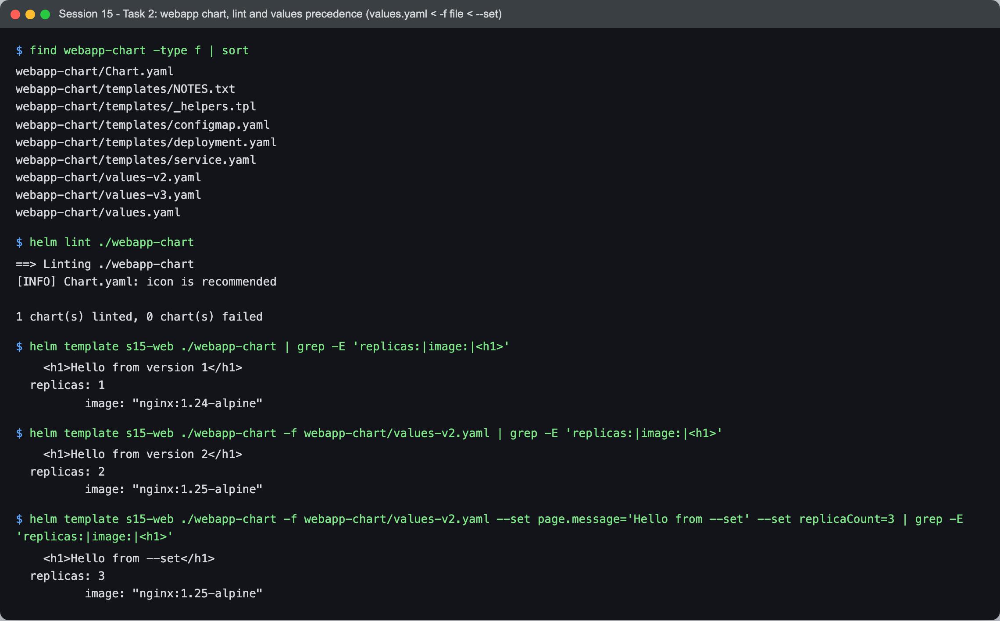

```text
$ find webapp-chart -type f | sort
webapp-chart/Chart.yaml
webapp-chart/templates/NOTES.txt
webapp-chart/templates/_helpers.tpl
webapp-chart/templates/configmap.yaml
webapp-chart/templates/deployment.yaml
webapp-chart/templates/service.yaml
webapp-chart/values-v2.yaml
webapp-chart/values-v3.yaml
webapp-chart/values.yaml

$ helm lint ./webapp-chart
==> Linting ./webapp-chart
[INFO] Chart.yaml: icon is recommended

1 chart(s) linted, 0 chart(s) failed

$ helm template s15-web ./webapp-chart | grep -E 'replicas:|image:|<h1>'
    <h1>Hello from version 1</h1>
  replicas: 1
          image: "nginx:1.24-alpine"

$ helm template s15-web ./webapp-chart -f webapp-chart/values-v2.yaml | grep -E 'replicas:|image:|<h1>'
    <h1>Hello from version 2</h1>
  replicas: 2
          image: "nginx:1.25-alpine"

$ helm template s15-web ./webapp-chart -f webapp-chart/values-v2.yaml --set page.message='Hello from --set' --set replicaCount=3 | grep -E 'replicas:|image:|<h1>'
    <h1>Hello from --set</h1>
  replicas: 3
          image: "nginx:1.25-alpine"
```

### 2.1 Install (revision 1) and verify

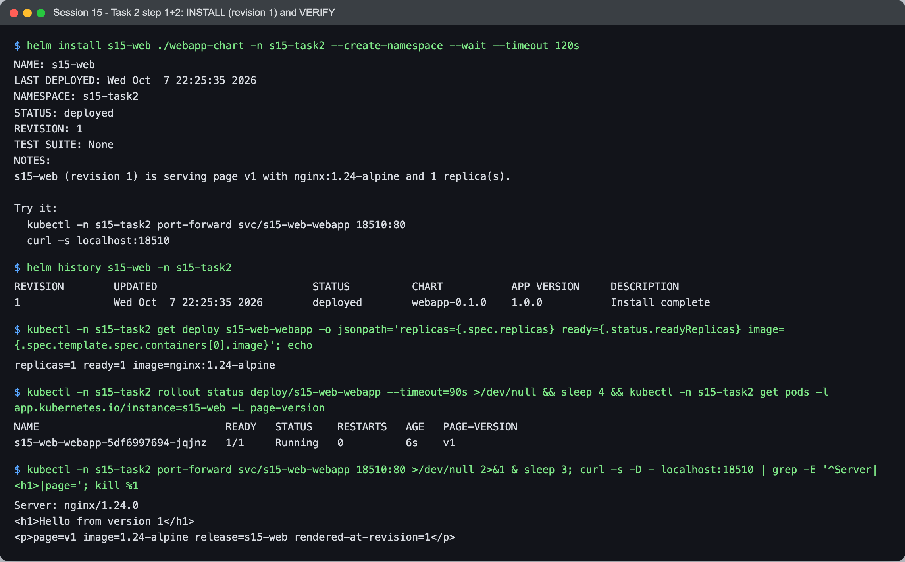

```text
$ helm install s15-web ./webapp-chart -n s15-task2 --create-namespace --wait --timeout 120s
NAME: s15-web
LAST DEPLOYED: Wed Oct  7 22:25:35 2026
NAMESPACE: s15-task2
STATUS: deployed
REVISION: 1
TEST SUITE: None
NOTES:
s15-web (revision 1) is serving page v1 with nginx:1.24-alpine and 1 replica(s).

Try it:
  kubectl -n s15-task2 port-forward svc/s15-web-webapp 18510:80
  curl -s localhost:18510

$ helm history s15-web -n s15-task2
REVISION	UPDATED                 	STATUS  	CHART       	APP VERSION	DESCRIPTION     
1       	Wed Oct  7 22:25:35 2026	deployed	webapp-0.1.0	1.0.0      	Install complete

$ kubectl -n s15-task2 get deploy s15-web-webapp -o jsonpath='replicas={.spec.replicas} ready={.status.readyReplicas} image={.spec.template.spec.containers[0].image}'; echo
replicas=1 ready=1 image=nginx:1.24-alpine

$ kubectl -n s15-task2 rollout status deploy/s15-web-webapp --timeout=90s >/dev/null && sleep 4 && kubectl -n s15-task2 get pods -l app.kubernetes.io/instance=s15-web -L page-version
NAME                              READY   STATUS    RESTARTS   AGE   PAGE-VERSION
s15-web-webapp-5df6997694-jqjnz   1/1     Running   0          6s    v1

$ kubectl -n s15-task2 port-forward svc/s15-web-webapp 18510:80 >/dev/null 2>&1 & sleep 3; curl -s -D - localhost:18510 | grep -E '^Server|<h1>|page='; kill %1
Server: nginx/1.24.0
<h1>Hello from version 1</h1>
<p>page=v1 image=1.24-alpine release=s15-web rendered-at-revision=1</p>
```

### 2.2 Upgrade to v2 (revision 2) and verify

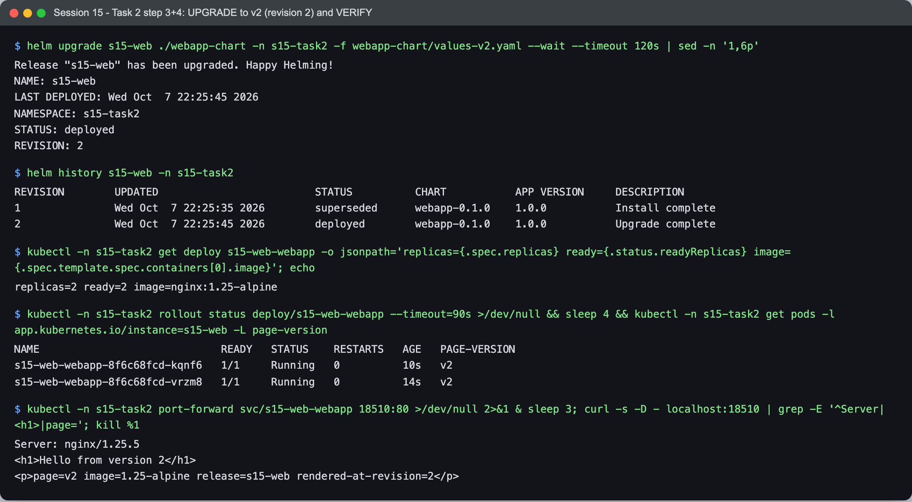

```text
$ helm upgrade s15-web ./webapp-chart -n s15-task2 -f webapp-chart/values-v2.yaml --wait --timeout 120s | sed -n '1,6p'
Release "s15-web" has been upgraded. Happy Helming!
NAME: s15-web
LAST DEPLOYED: Wed Oct  7 22:25:45 2026
NAMESPACE: s15-task2
STATUS: deployed
REVISION: 2

$ helm history s15-web -n s15-task2
REVISION	UPDATED                 	STATUS    	CHART       	APP VERSION	DESCRIPTION     
1       	Wed Oct  7 22:25:35 2026	superseded	webapp-0.1.0	1.0.0      	Install complete
2       	Wed Oct  7 22:25:45 2026	deployed  	webapp-0.1.0	1.0.0      	Upgrade complete

$ kubectl -n s15-task2 get deploy s15-web-webapp -o jsonpath='replicas={.spec.replicas} ready={.status.readyReplicas} image={.spec.template.spec.containers[0].image}'; echo
replicas=2 ready=2 image=nginx:1.25-alpine

$ kubectl -n s15-task2 rollout status deploy/s15-web-webapp --timeout=90s >/dev/null && sleep 4 && kubectl -n s15-task2 get pods -l app.kubernetes.io/instance=s15-web -L page-version
NAME                             READY   STATUS    RESTARTS   AGE   PAGE-VERSION
s15-web-webapp-8f6c68fcd-kqnf6   1/1     Running   0          10s   v2
s15-web-webapp-8f6c68fcd-vrzm8   1/1     Running   0          14s   v2

$ kubectl -n s15-task2 port-forward svc/s15-web-webapp 18510:80 >/dev/null 2>&1 & sleep 3; curl -s -D - localhost:18510 | grep -E '^Server|<h1>|page='; kill %1
Server: nginx/1.25.5
<h1>Hello from version 2</h1>
<p>page=v2 image=1.25-alpine release=s15-web rendered-at-revision=2</p>
```

### 2.3 Upgrade again to v3 (revision 3) and verify

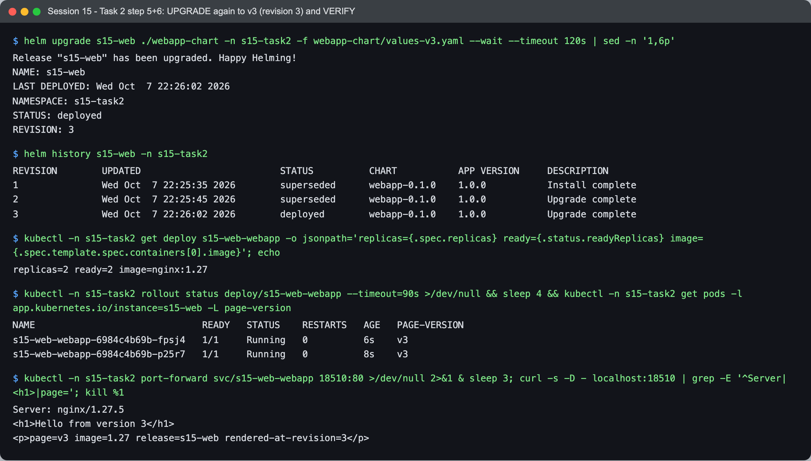

```text
$ helm upgrade s15-web ./webapp-chart -n s15-task2 -f webapp-chart/values-v3.yaml --wait --timeout 120s | sed -n '1,6p'
Release "s15-web" has been upgraded. Happy Helming!
NAME: s15-web
LAST DEPLOYED: Wed Oct  7 22:26:02 2026
NAMESPACE: s15-task2
STATUS: deployed
REVISION: 3

$ helm history s15-web -n s15-task2
REVISION	UPDATED                 	STATUS    	CHART       	APP VERSION	DESCRIPTION     
1       	Wed Oct  7 22:25:35 2026	superseded	webapp-0.1.0	1.0.0      	Install complete
2       	Wed Oct  7 22:25:45 2026	superseded	webapp-0.1.0	1.0.0      	Upgrade complete
3       	Wed Oct  7 22:26:02 2026	deployed  	webapp-0.1.0	1.0.0      	Upgrade complete

$ kubectl -n s15-task2 get deploy s15-web-webapp -o jsonpath='replicas={.spec.replicas} ready={.status.readyReplicas} image={.spec.template.spec.containers[0].image}'; echo
replicas=2 ready=2 image=nginx:1.27

$ kubectl -n s15-task2 rollout status deploy/s15-web-webapp --timeout=90s >/dev/null && sleep 4 && kubectl -n s15-task2 get pods -l app.kubernetes.io/instance=s15-web -L page-version
NAME                              READY   STATUS    RESTARTS   AGE   PAGE-VERSION
s15-web-webapp-6984c4b69b-fpsj4   1/1     Running   0          6s    v3
s15-web-webapp-6984c4b69b-p25r7   1/1     Running   0          8s    v3

$ kubectl -n s15-task2 port-forward svc/s15-web-webapp 18510:80 >/dev/null 2>&1 & sleep 3; curl -s -D - localhost:18510 | grep -E '^Server|<h1>|page='; kill %1
Server: nginx/1.27.5
<h1>Hello from version 3</h1>
<p>page=v3 image=1.27 release=s15-web rendered-at-revision=3</p>
```

### 2.4 Rollback to revision 2 (creates revision 4) and verify

After the rollback:

- `helm history` has a **new revision 4** with `Rollback to 2`; revision 3 is now `superseded`.
- The Deployment is back to 2 replicas of `nginx:1.25-alpine`, the pods have `page-version=v2`, and the response is `nginx/1.25.5` with "Hello from version 2".
- The pods belong to ReplicaSet `s15-web-webapp-8f6c68fcd`, the same hash as in revision 2. The pod template is identical, so Kubernetes scaled the old ReplicaSet back up.
- The page says `rendered-at-revision=2`, not 4. Rollback does **not** render the templates again; it re-applies the manifest stored for revision 2.
- There are now 4 release Secrets, one per revision.

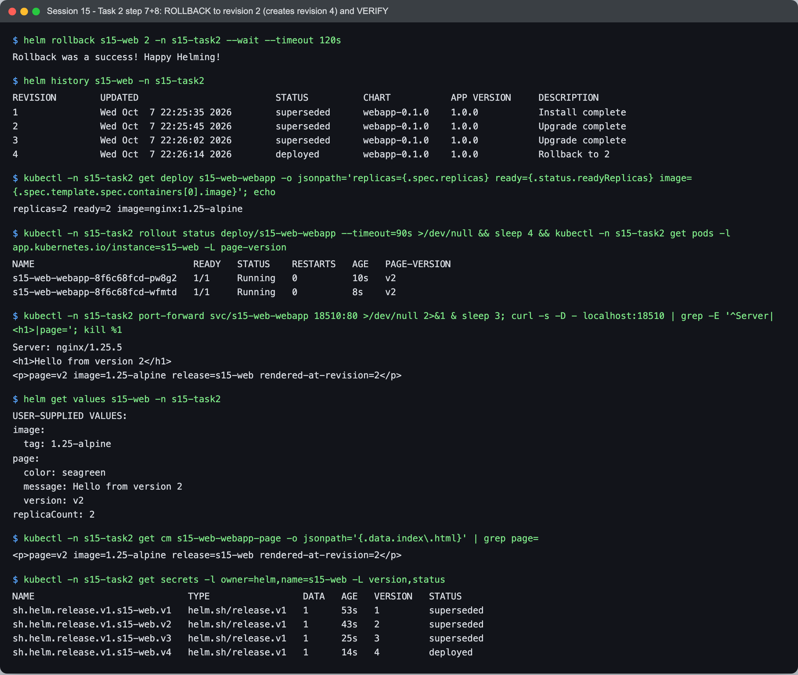

```text
$ helm rollback s15-web 2 -n s15-task2 --wait --timeout 120s
Rollback was a success! Happy Helming!

$ helm history s15-web -n s15-task2
REVISION	UPDATED                 	STATUS    	CHART       	APP VERSION	DESCRIPTION     
1       	Wed Oct  7 22:25:35 2026	superseded	webapp-0.1.0	1.0.0      	Install complete
2       	Wed Oct  7 22:25:45 2026	superseded	webapp-0.1.0	1.0.0      	Upgrade complete
3       	Wed Oct  7 22:26:02 2026	superseded	webapp-0.1.0	1.0.0      	Upgrade complete
4       	Wed Oct  7 22:26:14 2026	deployed  	webapp-0.1.0	1.0.0      	Rollback to 2

$ kubectl -n s15-task2 get deploy s15-web-webapp -o jsonpath='replicas={.spec.replicas} ready={.status.readyReplicas} image={.spec.template.spec.containers[0].image}'; echo
replicas=2 ready=2 image=nginx:1.25-alpine

$ kubectl -n s15-task2 rollout status deploy/s15-web-webapp --timeout=90s >/dev/null && sleep 4 && kubectl -n s15-task2 get pods -l app.kubernetes.io/instance=s15-web -L page-version
NAME                             READY   STATUS    RESTARTS   AGE   PAGE-VERSION
s15-web-webapp-8f6c68fcd-pw8g2   1/1     Running   0          10s   v2
s15-web-webapp-8f6c68fcd-wfmtd   1/1     Running   0          8s    v2

$ kubectl -n s15-task2 port-forward svc/s15-web-webapp 18510:80 >/dev/null 2>&1 & sleep 3; curl -s -D - localhost:18510 | grep -E '^Server|<h1>|page='; kill %1
Server: nginx/1.25.5
<h1>Hello from version 2</h1>
<p>page=v2 image=1.25-alpine release=s15-web rendered-at-revision=2</p>

$ helm get values s15-web -n s15-task2
USER-SUPPLIED VALUES:
image:
  tag: 1.25-alpine
page:
  color: seagreen
  message: Hello from version 2
  version: v2
replicaCount: 2

$ kubectl -n s15-task2 get cm s15-web-webapp-page -o jsonpath='{.data.index\.html}' | grep page=
<p>page=v2 image=1.25-alpine release=s15-web rendered-at-revision=2</p>

$ kubectl -n s15-task2 get secrets -l owner=helm,name=s15-web -L version,status
NAME                            TYPE                 DATA   AGE   VERSION   STATUS
sh.helm.release.v1.s15-web.v1   helm.sh/release.v1   1      53s   1         superseded
sh.helm.release.v1.s15-web.v2   helm.sh/release.v1   1      43s   2         superseded
sh.helm.release.v1.s15-web.v3   helm.sh/release.v1   1      25s   3         superseded
sh.helm.release.v1.s15-web.v4   helm.sh/release.v1   1      14s   4         deployed
```

---

## Task 3 - Mini project: Notes App chart

I copied the course chart to `notes-chart/` without changing it. The release is `s15-notes-dev` in namespace `s15-notes`. The chart uses a fixed NodePort `30090`; I checked it was free on the cluster first. Because minikube runs in Docker on macOS, a NodePort is not reachable from the Mac directly, so I tested the Service with `kubectl port-forward`.

### 3.1 Lint and template

Both the default values and `values-prod.yaml` pass lint. In the rendered output every `{{ }}` is replaced (release name in object names, `development`, `nginx:1.24`, `30090`).

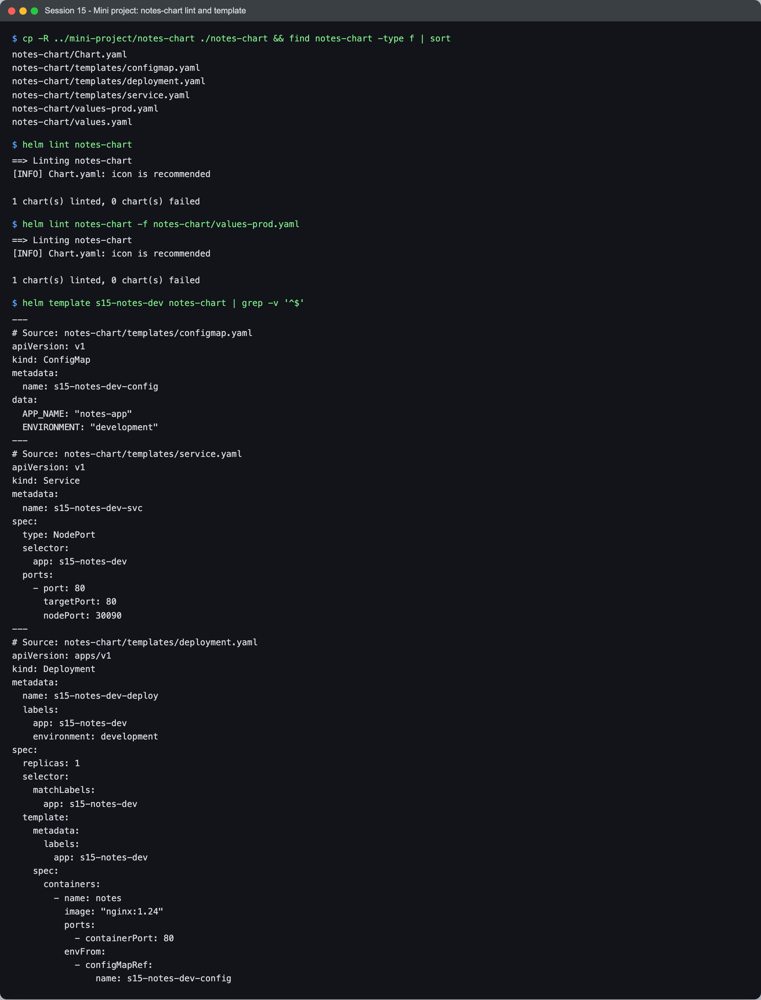

```text
$ cp -R ../mini-project/notes-chart ./notes-chart && find notes-chart -type f | sort
notes-chart/Chart.yaml
notes-chart/templates/configmap.yaml
notes-chart/templates/deployment.yaml
notes-chart/templates/service.yaml
notes-chart/values-prod.yaml
notes-chart/values.yaml

$ helm lint notes-chart
==> Linting notes-chart
[INFO] Chart.yaml: icon is recommended

1 chart(s) linted, 0 chart(s) failed

$ helm lint notes-chart -f notes-chart/values-prod.yaml
==> Linting notes-chart
[INFO] Chart.yaml: icon is recommended

1 chart(s) linted, 0 chart(s) failed

$ helm template s15-notes-dev notes-chart | grep -v '^$'
---
# Source: notes-chart/templates/configmap.yaml
apiVersion: v1
kind: ConfigMap
metadata:
  name: s15-notes-dev-config
data:
  APP_NAME: "notes-app"
  ENVIRONMENT: "development"
---
# Source: notes-chart/templates/service.yaml
apiVersion: v1
kind: Service
metadata:
  name: s15-notes-dev-svc
spec:
  type: NodePort
  selector:
    app: s15-notes-dev
  ports:
    - port: 80
      targetPort: 80
      nodePort: 30090
---
# Source: notes-chart/templates/deployment.yaml
apiVersion: apps/v1
kind: Deployment
metadata:
  name: s15-notes-dev-deploy
  labels:
    app: s15-notes-dev
    environment: development
spec:
  replicas: 1
  selector:
    matchLabels:
      app: s15-notes-dev
  template:
    metadata:
      labels:
        app: s15-notes-dev
    spec:
      containers:
        - name: notes
          image: "nginx:1.24"
          ports:
            - containerPort: 80
          envFrom:
            - configMapRef:
                name: s15-notes-dev-config
```

### 3.2 Install with development values (revision 1)

1 pod, `nginx:1.24`, and the ConfigMap is injected as env vars (`ENVIRONMENT=development`).

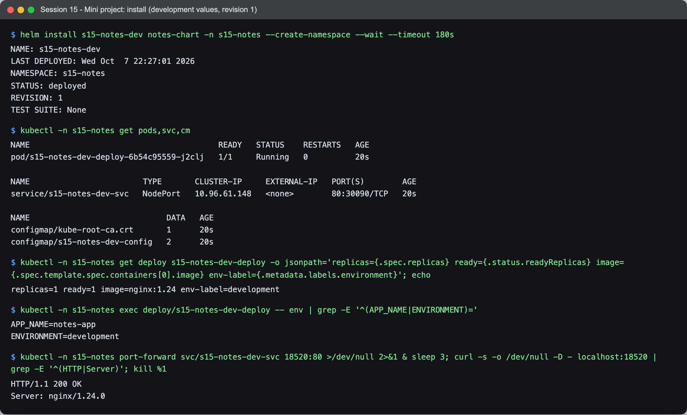

```text
$ helm install s15-notes-dev notes-chart -n s15-notes --create-namespace --wait --timeout 180s
NAME: s15-notes-dev
LAST DEPLOYED: Wed Oct  7 22:27:01 2026
NAMESPACE: s15-notes
STATUS: deployed
REVISION: 1
TEST SUITE: None

$ kubectl -n s15-notes get pods,svc,cm
NAME                                        READY   STATUS    RESTARTS   AGE
pod/s15-notes-dev-deploy-6b54c95559-j2clj   1/1     Running   0          20s

NAME                        TYPE       CLUSTER-IP     EXTERNAL-IP   PORT(S)        AGE
service/s15-notes-dev-svc   NodePort   10.96.61.148   <none>        80:30090/TCP   20s

NAME                             DATA   AGE
configmap/kube-root-ca.crt       1      20s
configmap/s15-notes-dev-config   2      20s

$ kubectl -n s15-notes get deploy s15-notes-dev-deploy -o jsonpath='replicas={.spec.replicas} ready={.status.readyReplicas} image={.spec.template.spec.containers[0].image} env-label={.metadata.labels.environment}'; echo
replicas=1 ready=1 image=nginx:1.24 env-label=development

$ kubectl -n s15-notes exec deploy/s15-notes-dev-deploy -- env | grep -E '^(APP_NAME|ENVIRONMENT)='
APP_NAME=notes-app
ENVIRONMENT=development

$ kubectl -n s15-notes port-forward svc/s15-notes-dev-svc 18520:80 >/dev/null 2>&1 & sleep 3; curl -s -o /dev/null -D - localhost:18520 | grep -E '^(HTTP|Server)'; kill %1
HTTP/1.1 200 OK
Server: nginx/1.24.0
```

### 3.3 Upgrade with `values-prod.yaml` (revision 2)

3 pods on `nginx:1.25`, Deployment label `environment=production`, and inside the pod `ENVIRONMENT=production`. The env var only changed because the image change also replaced the pods; `envFrom` is read once at container start.

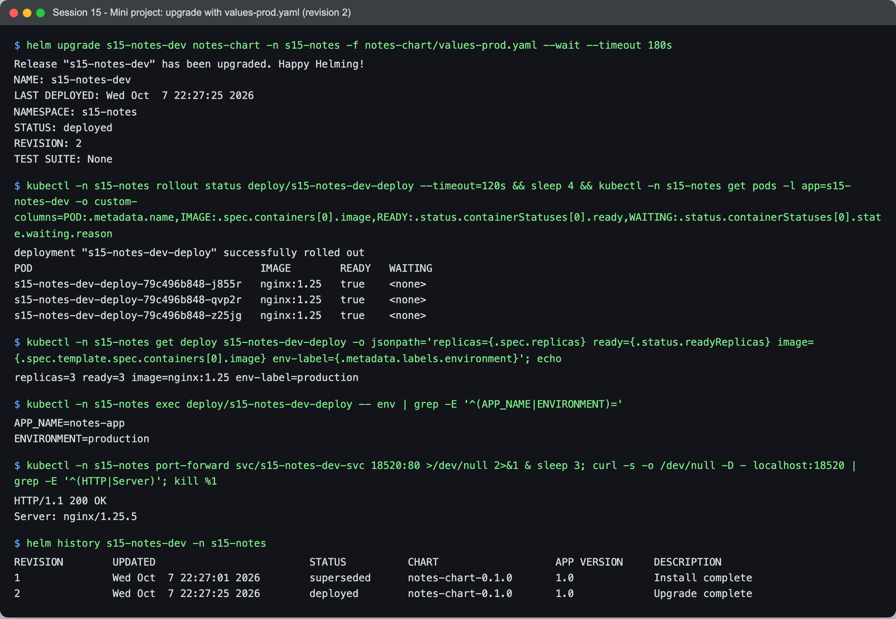

```text
$ helm upgrade s15-notes-dev notes-chart -n s15-notes -f notes-chart/values-prod.yaml --wait --timeout 180s
Release "s15-notes-dev" has been upgraded. Happy Helming!
NAME: s15-notes-dev
LAST DEPLOYED: Wed Oct  7 22:27:25 2026
NAMESPACE: s15-notes
STATUS: deployed
REVISION: 2
TEST SUITE: None

$ kubectl -n s15-notes rollout status deploy/s15-notes-dev-deploy --timeout=120s && sleep 4 && kubectl -n s15-notes get pods -l app=s15-notes-dev -o custom-columns=POD:.metadata.name,IMAGE:.spec.containers[0].image,READY:.status.containerStatuses[0].ready,WAITING:.status.containerStatuses[0].state.waiting.reason
deployment "s15-notes-dev-deploy" successfully rolled out
POD                                     IMAGE        READY   WAITING
s15-notes-dev-deploy-79c496b848-j855r   nginx:1.25   true    <none>
s15-notes-dev-deploy-79c496b848-qvp2r   nginx:1.25   true    <none>
s15-notes-dev-deploy-79c496b848-z25jg   nginx:1.25   true    <none>

$ kubectl -n s15-notes get deploy s15-notes-dev-deploy -o jsonpath='replicas={.spec.replicas} ready={.status.readyReplicas} image={.spec.template.spec.containers[0].image} env-label={.metadata.labels.environment}'; echo
replicas=3 ready=3 image=nginx:1.25 env-label=production

$ kubectl -n s15-notes exec deploy/s15-notes-dev-deploy -- env | grep -E '^(APP_NAME|ENVIRONMENT)='
APP_NAME=notes-app
ENVIRONMENT=production

$ kubectl -n s15-notes port-forward svc/s15-notes-dev-svc 18520:80 >/dev/null 2>&1 & sleep 3; curl -s -o /dev/null -D - localhost:18520 | grep -E '^(HTTP|Server)'; kill %1
HTTP/1.1 200 OK
Server: nginx/1.25.5

$ helm history s15-notes-dev -n s15-notes
REVISION	UPDATED                 	STATUS    	CHART            	APP VERSION	DESCRIPTION     
1       	Wed Oct  7 22:27:01 2026	superseded	notes-chart-0.1.0	1.0        	Install complete
2       	Wed Oct  7 22:27:25 2026	deployed  	notes-chart-0.1.0	1.0        	Upgrade complete
```

### 3.4 Deliberately bad upgrade

I used `--wait --timeout 60s` so Helm waits for the pods and reports the failure. I also passed `-f values-prod.yaml` again: `helm upgrade` starts from the chart defaults every time, so with only `--set image.tag=...` (as in the course notes) the release would also drop to 1 replica and `development`.

What happened:

- Helm waited the full 60 s and failed with `context deadline exceeded`. Revision 3 is marked `failed`.
- Helm did **not** undo anything by itself. The new pod is stuck in `ImagePullBackOff` (`NotFound` from Docker Hub).
- The app stayed up: the 3 old `nginx:1.25` pods are still running and curl still gets 200. With 3 replicas the RollingUpdate defaults (25%) round down to `maxUnavailable=0` and up to `maxSurge=1`, so Kubernetes created only one new pod and removed no old pod.

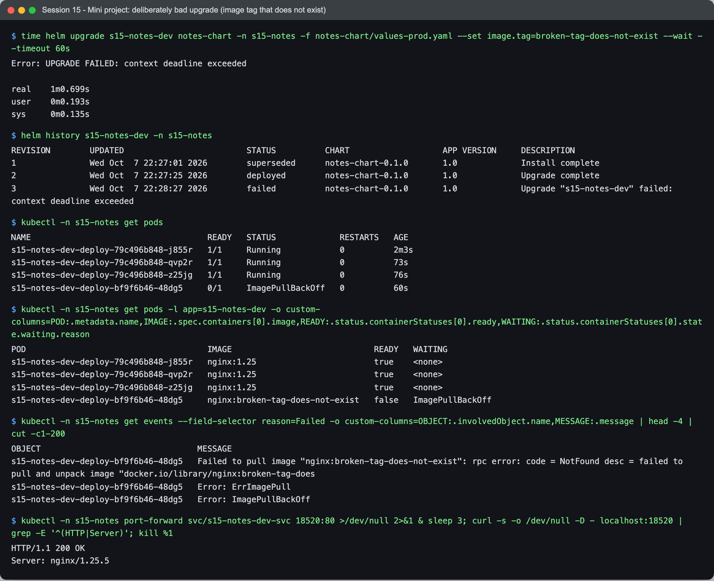

```text
$ time helm upgrade s15-notes-dev notes-chart -n s15-notes -f notes-chart/values-prod.yaml --set image.tag=broken-tag-does-not-exist --wait --timeout 60s
Error: UPGRADE FAILED: context deadline exceeded

real	1m0.699s
user	0m0.193s
sys	0m0.135s

$ helm history s15-notes-dev -n s15-notes
REVISION	UPDATED                 	STATUS    	CHART            	APP VERSION	DESCRIPTION                                              
1       	Wed Oct  7 22:27:01 2026	superseded	notes-chart-0.1.0	1.0        	Install complete                                         
2       	Wed Oct  7 22:27:25 2026	deployed  	notes-chart-0.1.0	1.0        	Upgrade complete                                         
3       	Wed Oct  7 22:28:27 2026	failed    	notes-chart-0.1.0	1.0        	Upgrade "s15-notes-dev" failed: context deadline exceeded

$ kubectl -n s15-notes get pods
NAME                                    READY   STATUS             RESTARTS   AGE
s15-notes-dev-deploy-79c496b848-j855r   1/1     Running            0          2m3s
s15-notes-dev-deploy-79c496b848-qvp2r   1/1     Running            0          73s
s15-notes-dev-deploy-79c496b848-z25jg   1/1     Running            0          76s
s15-notes-dev-deploy-bf9f6b46-48dg5     0/1     ImagePullBackOff   0          60s

$ kubectl -n s15-notes get pods -l app=s15-notes-dev -o custom-columns=POD:.metadata.name,IMAGE:.spec.containers[0].image,READY:.status.containerStatuses[0].ready,WAITING:.status.containerStatuses[0].state.waiting.reason
POD                                     IMAGE                             READY   WAITING
s15-notes-dev-deploy-79c496b848-j855r   nginx:1.25                        true    <none>
s15-notes-dev-deploy-79c496b848-qvp2r   nginx:1.25                        true    <none>
s15-notes-dev-deploy-79c496b848-z25jg   nginx:1.25                        true    <none>
s15-notes-dev-deploy-bf9f6b46-48dg5     nginx:broken-tag-does-not-exist   false   ImagePullBackOff

$ kubectl -n s15-notes get events --field-selector reason=Failed -o custom-columns=OBJECT:.involvedObject.name,MESSAGE:.message | head -4 | cut -c1-200
OBJECT                                MESSAGE
s15-notes-dev-deploy-bf9f6b46-48dg5   Failed to pull image "nginx:broken-tag-does-not-exist": rpc error: code = NotFound desc = failed to pull and unpack image "docker.io/library/nginx:broken-tag-does
s15-notes-dev-deploy-bf9f6b46-48dg5   Error: ErrImagePull
s15-notes-dev-deploy-bf9f6b46-48dg5   Error: ImagePullBackOff

$ kubectl -n s15-notes port-forward svc/s15-notes-dev-svc 18520:80 >/dev/null 2>&1 & sleep 3; curl -s -o /dev/null -D - localhost:18520 | grep -E '^(HTTP|Server)'; kill %1
HTTP/1.1 200 OK
Server: nginx/1.25.5
```

### 3.5 Rollback to revision 2 (creates revision 4)

The broken pod is gone, the same 3 healthy pods (`79c496b848` ReplicaSet) remain, and history shows revision 4 `Rollback to 2`.

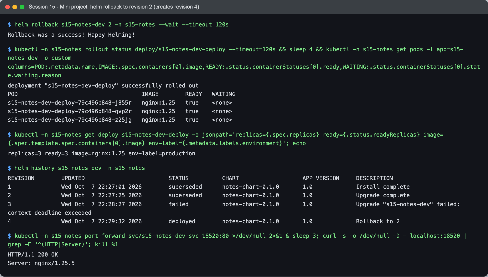

```text
$ helm rollback s15-notes-dev 2 -n s15-notes --wait --timeout 120s
Rollback was a success! Happy Helming!

$ kubectl -n s15-notes rollout status deploy/s15-notes-dev-deploy --timeout=120s && sleep 4 && kubectl -n s15-notes get pods -l app=s15-notes-dev -o custom-columns=POD:.metadata.name,IMAGE:.spec.containers[0].image,READY:.status.containerStatuses[0].ready,WAITING:.status.containerStatuses[0].state.waiting.reason
deployment "s15-notes-dev-deploy" successfully rolled out
POD                                     IMAGE        READY   WAITING
s15-notes-dev-deploy-79c496b848-j855r   nginx:1.25   true    <none>
s15-notes-dev-deploy-79c496b848-qvp2r   nginx:1.25   true    <none>
s15-notes-dev-deploy-79c496b848-z25jg   nginx:1.25   true    <none>

$ kubectl -n s15-notes get deploy s15-notes-dev-deploy -o jsonpath='replicas={.spec.replicas} ready={.status.readyReplicas} image={.spec.template.spec.containers[0].image} env-label={.metadata.labels.environment}'; echo
replicas=3 ready=3 image=nginx:1.25 env-label=production

$ helm history s15-notes-dev -n s15-notes
REVISION	UPDATED                 	STATUS    	CHART            	APP VERSION	DESCRIPTION                                              
1       	Wed Oct  7 22:27:01 2026	superseded	notes-chart-0.1.0	1.0        	Install complete                                         
2       	Wed Oct  7 22:27:25 2026	superseded	notes-chart-0.1.0	1.0        	Upgrade complete                                         
3       	Wed Oct  7 22:28:27 2026	failed    	notes-chart-0.1.0	1.0        	Upgrade "s15-notes-dev" failed: context deadline exceeded
4       	Wed Oct  7 22:29:32 2026	deployed  	notes-chart-0.1.0	1.0        	Rollback to 2

$ kubectl -n s15-notes port-forward svc/s15-notes-dev-svc 18520:80 >/dev/null 2>&1 & sleep 3; curl -s -o /dev/null -D - localhost:18520 | grep -E '^(HTTP|Server)'; kill %1
HTTP/1.1 200 OK
Server: nginx/1.25.5
```

### 3.6 Same bad upgrade with `--atomic` (automatic rollback)

In Helm 3.22 the flag is `--atomic` (I checked `helm upgrade --help`; Helm 4 renamed it `--rollback-on-failure`). `--atomic` turns on `--wait`. After the 45 s timeout Helm rolled back itself: revision 5 is `failed` and Helm created revision 6 `Rollback to 4` (the last good revision) with no manual step.

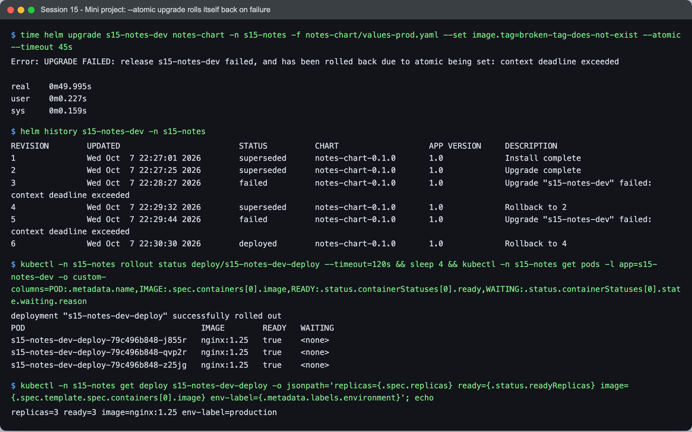

```text
$ time helm upgrade s15-notes-dev notes-chart -n s15-notes -f notes-chart/values-prod.yaml --set image.tag=broken-tag-does-not-exist --atomic --timeout 45s
Error: UPGRADE FAILED: release s15-notes-dev failed, and has been rolled back due to atomic being set: context deadline exceeded

real	0m49.995s
user	0m0.227s
sys	0m0.159s

$ helm history s15-notes-dev -n s15-notes
REVISION	UPDATED                 	STATUS    	CHART            	APP VERSION	DESCRIPTION                                              
1       	Wed Oct  7 22:27:01 2026	superseded	notes-chart-0.1.0	1.0        	Install complete                                         
2       	Wed Oct  7 22:27:25 2026	superseded	notes-chart-0.1.0	1.0        	Upgrade complete                                         
3       	Wed Oct  7 22:28:27 2026	failed    	notes-chart-0.1.0	1.0        	Upgrade "s15-notes-dev" failed: context deadline exceeded
4       	Wed Oct  7 22:29:32 2026	superseded	notes-chart-0.1.0	1.0        	Rollback to 2                                            
5       	Wed Oct  7 22:29:44 2026	failed    	notes-chart-0.1.0	1.0        	Upgrade "s15-notes-dev" failed: context deadline exceeded
6       	Wed Oct  7 22:30:30 2026	deployed  	notes-chart-0.1.0	1.0        	Rollback to 4

$ kubectl -n s15-notes rollout status deploy/s15-notes-dev-deploy --timeout=120s && sleep 4 && kubectl -n s15-notes get pods -l app=s15-notes-dev -o custom-columns=POD:.metadata.name,IMAGE:.spec.containers[0].image,READY:.status.containerStatuses[0].ready,WAITING:.status.containerStatuses[0].state.waiting.reason
deployment "s15-notes-dev-deploy" successfully rolled out
POD                                     IMAGE        READY   WAITING
s15-notes-dev-deploy-79c496b848-j855r   nginx:1.25   true    <none>
s15-notes-dev-deploy-79c496b848-qvp2r   nginx:1.25   true    <none>
s15-notes-dev-deploy-79c496b848-z25jg   nginx:1.25   true    <none>

$ kubectl -n s15-notes get deploy s15-notes-dev-deploy -o jsonpath='replicas={.spec.replicas} ready={.status.readyReplicas} image={.spec.template.spec.containers[0].image} env-label={.metadata.labels.environment}'; echo
replicas=3 ready=3 image=nginx:1.25 env-label=production
```

### 3.7 Uninstall

Deployment, Service, the release's ConfigMap and all 6 release Secrets are gone. Only `kube-root-ca.crt`, which Kubernetes adds to every namespace, is left.

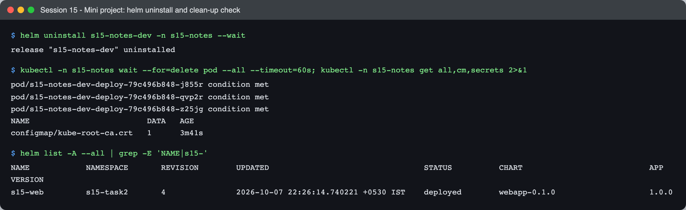

```text
$ helm uninstall s15-notes-dev -n s15-notes --wait
release "s15-notes-dev" uninstalled

$ kubectl -n s15-notes wait --for=delete pod --all --timeout=60s; kubectl -n s15-notes get all,cm,secrets 2>&1
pod/s15-notes-dev-deploy-79c496b848-j855r condition met
pod/s15-notes-dev-deploy-79c496b848-qvp2r condition met
pod/s15-notes-dev-deploy-79c496b848-z25jg condition met
NAME                         DATA   AGE
configmap/kube-root-ca.crt   1      3m41s

$ helm list -A --all | grep -E 'NAME|s15-'
NAME      	NAMESPACE 	REVISION	UPDATED                             	STATUS  	CHART                       	APP VERSION
s15-web   	s15-task2 	4       	2026-10-07 22:26:14.740221 +0530 IST	deployed	webapp-0.1.0                	1.0.0
```

### Clean-up

I uninstalled the Task 2 release and deleted the three namespaces I created. The last command shows 0 `s15-` releases and 0 `s15-` namespaces left.

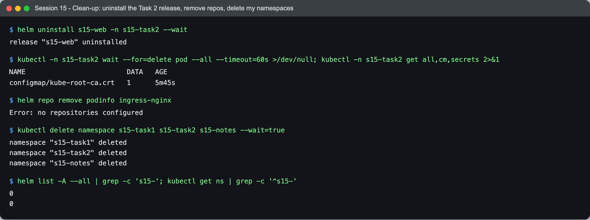

```text
$ helm uninstall s15-web -n s15-task2 --wait
release "s15-web" uninstalled

$ kubectl -n s15-task2 wait --for=delete pod --all --timeout=60s >/dev/null; kubectl -n s15-task2 get all,cm,secrets 2>&1
NAME                         DATA   AGE
configmap/kube-root-ca.crt   1      5m45s

$ helm repo remove podinfo ingress-nginx
Error: no repositories configured

$ kubectl delete namespace s15-task1 s15-task2 s15-notes --wait=true
namespace "s15-task1" deleted
namespace "s15-task2" deleted
namespace "s15-notes" deleted

$ helm list -A --all | grep -c 's15-'; kubectl get ns | grep -c '^s15-'
0
0
```

---

## What I learned

- A rollback is a new revision built from an old revision's stored manifest and values. It does not re-render templates, so `.Release.Revision` inside the page stayed `2` while the release was at revision 4.
- Without `--wait`, Helm reports success as soon as the API server accepts the YAML. With `--wait` a bad image becomes a `failed` revision, but only `--atomic` undoes it automatically.
- `helm upgrade` does not remember earlier `-f`/`--set` values unless I pass them again (or use `--reuse-values`), so every upgrade command needs the full set of values.
- All Helm state lives in `helm.sh/release.v1` Secrets in the release namespace. Reading them with `base64 -d | base64 -d | gunzip` showed exactly what `helm get values` and `helm history` read.
- A rolling update with 3 replicas kept the old pods serving during the failed upgrade, so the bad release did not cause downtime. Helm and the Deployment controller protect against different failures.

## Problems I hit

- **`helm create` default image.** The default tag comes from `appVersion: 1.16.0` (an old nginx not on the node). I set `appVersion` to `1.25-alpine`, which was already cached, and added small resource requests because the minikube node is short on memory.
- **Broken jsonpath in my first Task 1 run.** My capture spec quoted `{"\n"}` wrongly and kubectl said `unterminated quoted string`. I switched to `-o jsonpath='{.type}'; echo` and re-ran the whole install-to-uninstall flow, so all Task 1 screenshots come from one run.
- **First uninstall check was too fast.** The pod was still `Terminating` when I listed the namespace, so I added `kubectl wait --for=delete pod --all` before the final `get`.
- **My own script deleted the repo file.** In the re-run I attached "reset the repo config" to the repo job by matching the word `repo` in the screenshot path, but every path contains `repos/devops-heros`, so the reset ran before every job. The repo screenshot (1.8) is still correct, but by clean-up time the repo file was gone and `helm repo remove` said `no repositories configured`. I recorded a separate `helm repo add` / `remove` run (screenshot `s15-23`).
- **NodePort from macOS.** With the Docker driver the minikube node IP is not reachable from the Mac, so I used `kubectl port-forward` (local ports 18501, 18510, 18520) to test the Services.
