# Session 16 - CI/CD & GitHub Actions - Task

- **Name:** Netram
- **Enrollment No:** 24BCS10329

> **Status:** completed

> Built and tested locally on macOS (Apple Silicon, arm64) with Docker Desktop (Engine 29.6.2) and
> Python 3.14.6, then run for real on GitHub-hosted `ubuntu-24.04` runners (x64, 4 CPUs, 15 GiB)
> in [netram75/devops-heros](https://github.com/netram75/devops-heros/actions/workflows/session16-ci.yml).

---

## What the task asked

Build a complete CI/CD demo project with GitHub Actions, using the course folder
`10-final-cicd-pipeline` as the reference. It had to cover CI vs CD, the CI/CD pipeline,
GitHub Actions, workflows, jobs, steps, runners, secrets, artifacts, build, test and pipeline
execution.

Deliverables: application source code, Dockerfile, GitHub Actions workflow, CI pipeline,
CD pipeline, screenshots of a successful pipeline run, and this README.

## My approach

The course pipeline (`10-final-cicd-pipeline`) stops at "build artifact, ready for CD". I wanted
the CD half to be real too, so my pipeline goes all the way from `git push` to a running,
curl-able app:

```text
git push (session16-cicd or main, only if task/ or the workflow files changed)
   |
   |  .github/workflows/session16-ci.yml   (CI)
   |-- Runner info + secret check   (runs in parallel with lint)
   |-- Lint (ruff)
   |     `-- Unit tests (matrix: Python 3.13 and 3.14)  -> test report artifacts
   |           `-- Docker build + smoke test             -> docker-image artifact
   |                 |
   |  .github/workflows/session16-cd.yml   (CD, called only when every CI job passed)
   |                 `-- Publish image to GHCR (:<sha> and :latest)
   |                       `-- Deploy to kind (environment "demo")  -> deploy-report artifact
```

| File | What it is |
|------|------------|
| `app/calculator.py`, `app/main.py` | The course calculator turned into a small Flask API (`/`, `/health`, `/api/<op>?a=&b=`) |
| `tests/test_calculator.py`, `tests/test_api.py` | 16 pytest tests (unit tests for the functions, API tests through Flask's test client) |
| `requirements.txt`, `requirements-dev.txt`, `pyproject.toml` | Pinned runtime and dev dependencies, ruff and pytest settings |
| `Dockerfile`, `.dockerignore` | Two-stage image on `python:3.14-slim`, runs gunicorn as UID 10001 |
| `k8s/deployment.yaml`, `k8s/service.yaml` | What the CD job applies to the throwaway kind cluster |
| `../../.github/workflows/session16-ci.yml` | CI workflow (repo root, because GitHub only reads workflows from there) |
| `../../.github/workflows/session16-cd.yml` | CD workflow (a reusable workflow that CI calls) |

Two design decisions I made on purpose:

1. **CI and CD are separate files, but CD is triggered by CI with `workflow_call`, not
   `workflow_run`.** `workflow_run` only fires when the workflow file is on the default branch,
   and this work lives on the `session16-cicd` branch. `workflow_call` works on any branch and
   still guarantees CD cannot start unless CI passed (`needs: [runner-info, docker-build]`).
2. **Build once, deploy that exact image.** CI builds the image, smoke-tests it and uploads it
   as an artifact. CD downloads that same tar and pushes it. It does not rebuild, so what gets
   deployed is byte for byte what was tested. The deploy job then checks that the pods run the
   exact digest that was pushed.

The app's `/` endpoint reports `version` (the commit SHA, baked in as a build arg) and
`api_token_configured` (whether the secret reached the pod), so a single curl against the
deployed pod proves which commit is running and that the secret got there.

### All runs of the pipeline

| Run | Commit | Result | What it shows |
|-----|--------|--------|---------------|
| [#1 37655170102](https://github.com/netram75/devops-heros/actions/runs/37655170102) | `fc34e1b` | success, 3m 34s | first push of the workflows, green first time |
| [#2 37655761144](https://github.com/netram75/devops-heros/actions/runs/37655761144) | `c17a2a4` | success | after pinning runners to `ubuntu-24.04` |
| [#3 37656022851](https://github.com/netram75/devops-heros/actions/runs/37656022851) | `4137078` | **failure (on purpose)** | broken `add()`: tests fail, docker build and CD are skipped |
| [#4 37656344379](https://github.com/netram75/devops-heros/actions/runs/37656344379) | `d70fbdf` | success, 5m 41s | the fix; waited about 3 min for a runner, see "Problems I hit" |
| [#5 37656392714](https://github.com/netram75/devops-heros/actions/runs/37656392714) | `51d4dd0` | success | docs-only changes excluded from the trigger |
| [#6 37657218870](https://github.com/netram75/devops-heros/actions/runs/37657218870) | `2db5345` | success, 2m 47s | **final run, used for most screenshots below** |

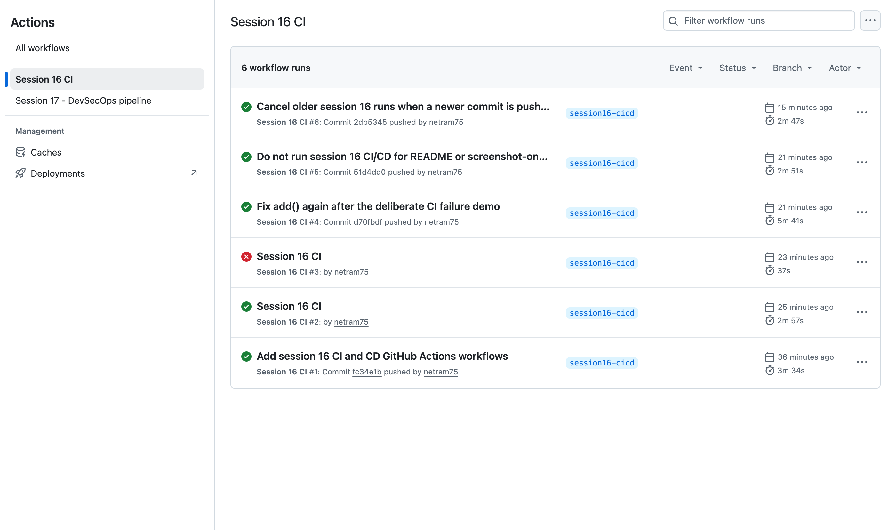

(Runs #2 and #3 show "Session 16 CI" instead of the commit message as their title. I do not
know why. Both were pushed in the minutes right after GitHub had been rejecting my pushes, see
"Problems I hit".)

---

## 1. CI vs CD

- **CI (continuous integration)** answers "is this commit good?". Every push gets linted,
  tested and built automatically, so a broken change is caught minutes after it is pushed,
  not when someone deploys it. In my repo that is `session16-ci.yml`: lint, test matrix,
  docker build + smoke test. Nothing leaves the runner.
- **CD (continuous delivery / deployment)** answers "ship the good commit". Continuous
  *delivery* means the tested artifact is always ready to release (my `publish` job pushes it
  to a registry). Continuous *deployment* goes one step further and actually deploys it with
  no human click (my `deploy` job puts it on a Kubernetes cluster). Mine does both, into a
  throwaway cluster, so it is safe to do on every push.

The clearest proof of the difference is run #3, where I broke `add()` on purpose (the course's
failure scenario). CI failed and CD never started:

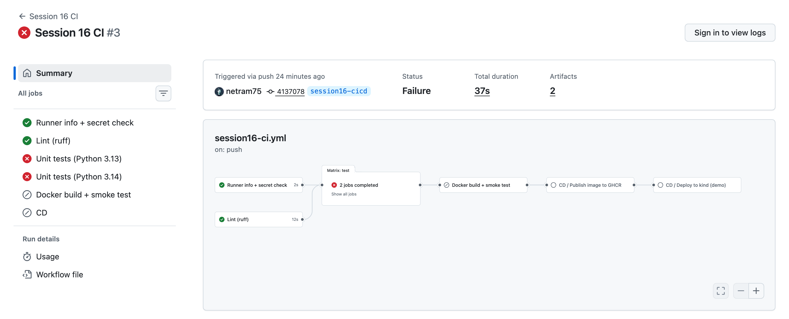

```text
$ gh run view 37656022851 --repo netram75/devops-heros | grep -vE '^  '
X session16-cicd Session 16 CI · 37656022851
JOBS
✓ Lint (ruff) in 12s (ID 112910948418)
✓ Runner info + secret check in 2s (ID 112910948949)
X Unit tests (Python 3.13) in 12s (ID 112911133649)
X Unit tests (Python 3.14) in 13s (ID 112911133860)
- Docker build + smoke test (ID 112911348655)
- CD (ID 112911355684)

$ gh run view --repo netram75/devops-heros --job 112911133649 --log | s16-step 'Run pytest with coverage' | grep -E 'FAILED|^E |passed'
tests/test_api.py::test_operations[add-2-3-5] FAILED                     [ 25%]
tests/test_calculator.py::test_add FAILED                                [ 68%]
E       assert 6.0 == 5
E       assert 16 == 15
E        +  where 16 = add(10, 5)
FAILED tests/test_api.py::test_operations[add-2-3-5] - assert 6.0 == 5
FAILED tests/test_calculator.py::test_add - assert 16 == 15
========================= 2 failed, 14 passed in 0.41s =========================
```

`-` means skipped. Lint passed (the code was valid Python, just wrong), and the tests are what
stopped a wrong calculator from being published and deployed. I reverted it in `d70fbdf`.

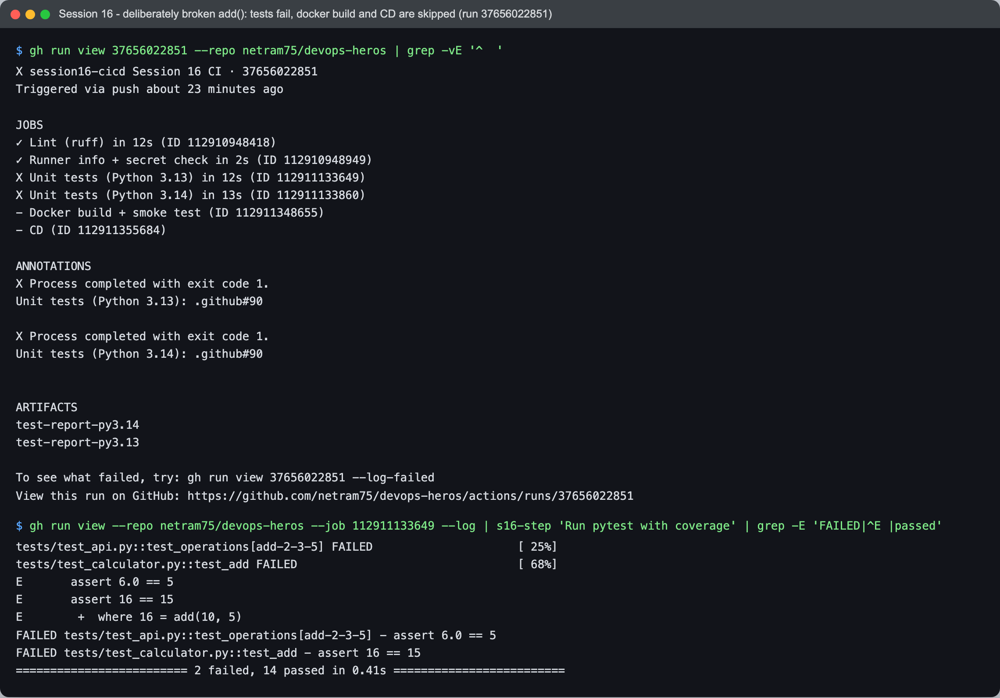

## 2. The CI/CD pipeline

A pipeline is the ordered set of stages a commit goes through. Mine is
`lint -> test -> build -> publish -> deploy`, and each arrow is a `needs:` line, so a later
stage only starts when the earlier one succeeded:

```yaml
# session16-ci.yml
  test:
    needs: lint                                   # line 88
  docker-build:
    needs: test                                   # line 140
  cd:
    needs: [runner-info, docker-build]            # line 187
    uses: ./.github/workflows/session16-cd.yml    # line 192
# session16-cd.yml
  deploy:
    needs: publish                                # line 64
```

GitHub draws exactly that graph for run #6:

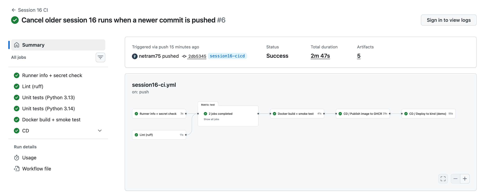

## 3. GitHub Actions

GitHub Actions is GitHub's built-in automation: it watches repo events (push, pull request,
schedule, manual click), and for each matching workflow it borrows a fresh virtual machine,
runs my YAML on it and reports the result back on the commit. Two kinds of building blocks
appear in my steps:

- `uses:` runs a published action, for example `actions/checkout@v7`,
  `actions/setup-python@v7`, `docker/build-push-action@v7`, `docker/login-action@v4`,
  `helm/kind-action@v1`, `actions/upload-artifact@v7`, `actions/download-artifact@v8`.
  I looked up each repo's latest release before choosing the major version (the course files
  use older ones such as `upload-artifact@v4`; v7 is current, and all of these now run on
  Node 24).
- `run:` is a plain shell script on the runner, for example `pytest ...` or `kubectl apply ...`.

## 4. Workflow

A workflow is one YAML file in `.github/workflows/`. The top of `session16-ci.yml` decides
*when* it runs and *with what permissions*:

```yaml
on:
  push:
    branches: [main, session16-cicd]
    paths:
      - "session-16-github-actions/task/**"
      - "!session-16-github-actions/task/**/*.md"
      - "!session-16-github-actions/task/screenshots/**"
      - ".github/workflows/session16-ci.yml"
      - ".github/workflows/session16-cd.yml"
  workflow_dispatch:

concurrency:
  group: session16-cicd-${{ github.ref }}
  cancel-in-progress: true

permissions:
  contents: read
```

- `paths:` because this repo holds 20 sessions. A commit to session 17 should not build and
  deploy my session 16 app. The two `!` lines were added later (`51d4dd0`) so that a
  README or screenshot change, like this one, does not trigger a pointless deploy.
- `workflow_dispatch` adds a "Run workflow" button for a manual run.
- `concurrency` was added after a real race (see "Problems I hit").
- `permissions: contents: read` is least privilege. Only the CD job asks for
  `packages: write`, because only it pushes to GHCR.

`session16-cd.yml` has no trigger of its own except `on: workflow_call` (line 9), which is
exactly why it can never run on an untested commit.

## 5. Jobs

A job is a group of steps that runs on one runner. Jobs run **in parallel** unless `needs:`
makes one wait. My graph has both: `Runner info + secret check` and `Lint (ruff)` start at
the same second, and the two matrix test jobs also start together:

```text
$ gh api repos/netram75/devops-heros/actions/runs/37657218870/jobs --jq '.jobs[] | [.name, .runner_name, (.labels|join(",")), .started_at[11:19], .completed_at[11:19]] | @tsv' | column -t -s $'\t'
Lint (ruff)                 GitHub Actions 1000000695  ubuntu-24.04  17:12:09  17:12:20
Runner info + secret check  GitHub Actions 1000000696  ubuntu-24.04  17:12:09  17:12:12
Unit tests (Python 3.14)    GitHub Actions 1000000697  ubuntu-24.04  17:12:22  17:12:38
Unit tests (Python 3.13)    GitHub Actions 1000000698  ubuntu-24.04  17:12:22  17:12:39
Docker build + smoke test   GitHub Actions 1000000701  ubuntu-24.04  17:12:41  17:13:22
CD / Publish image to GHCR  GitHub Actions 1000000703  ubuntu-24.04  17:13:25  17:13:54
CD / Deploy to kind (demo)  GitHub Actions 1000000705  ubuntu-24.04  17:13:57  17:14:52
```

The matrix (`session16-ci.yml` lines 93-94) turns one `test` job definition into two jobs,
one per Python version, so I know the code works on both the current and the previous
release. `fail-fast: false` lets both finish even if one fails, so I see every broken
version at once (run #3 shows both red, not one red and one cancelled).

The deploy job also uses a GitHub **environment** (`environment: demo`, cd line 67). It shows
up under the repo's Deployments, and it is where I would add a required reviewer if this were
a real production target.

## 6. Steps

Steps run in order inside a job, on the same machine, sharing the same files. That is why the
docker job can build an image in one step and run it in the next. Each step's output is in
the job log. Here is the test step of the Python 3.14 job in run #6:

```text
$ gh run view --repo netram75/devops-heros --job 112915376065 --log | s16-step 'Run pytest with coverage'
platform linux -- Python 3.14.8, pytest-9.1.1, pluggy-1.6.0 -- /opt/hostedtoolcache/Python/3.14.8/x64/bin/python
rootdir: /home/runner/work/devops-heros/devops-heros/session-16-github-actions/task
collected 16 items
tests/test_api.py::test_health PASSED                                    [  6%]
...
tests/test_calculator.py::test_operations_table_has_all_four PASSED      [100%]
Name                Stmts   Miss  Cover   Missing
-------------------------------------------------
app/__init__.py         0      0   100%
app/calculator.py      11      0   100%
app/main.py            28      0   100%
-------------------------------------------------
TOTAL                  39      0   100%
Required test coverage of 90% reached. Total coverage: 100.00%
============================== 16 passed in 0.21s ==============================
```

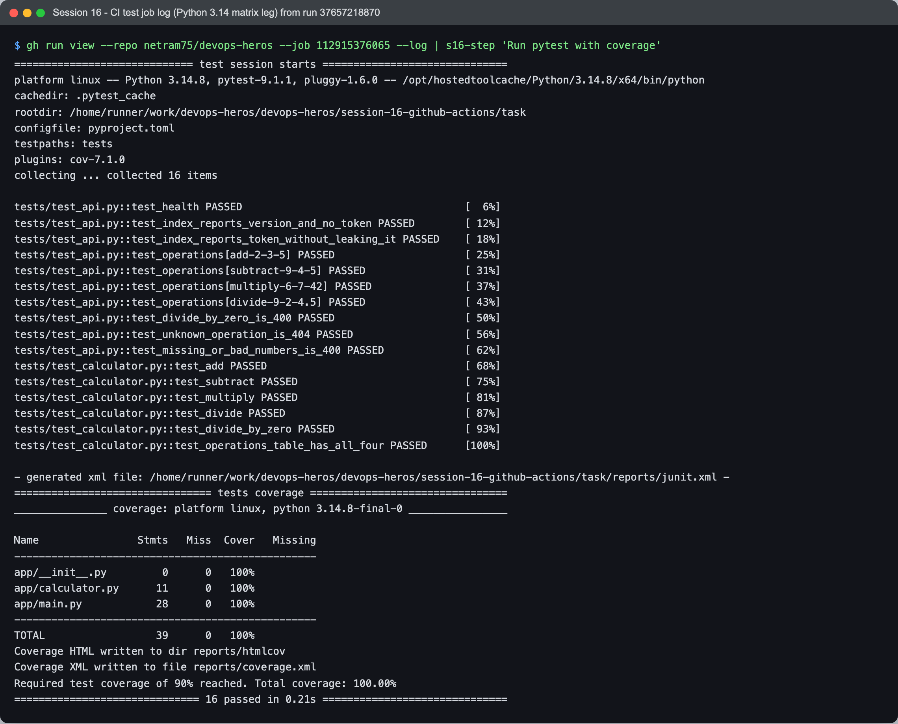

GitHub hides job logs from visitors who are not signed in ("Sign in to view logs"), so the
log screenshots are the real log text fetched with `gh run view --log` / `gh api .../logs`.
`s16-step` and `s16-section` are two tiny filters I wrote for the screenshots: they only remove
the timestamp column and the script that GitHub echoes before each `run:` step. The job page
itself (step names and ticks) is public:

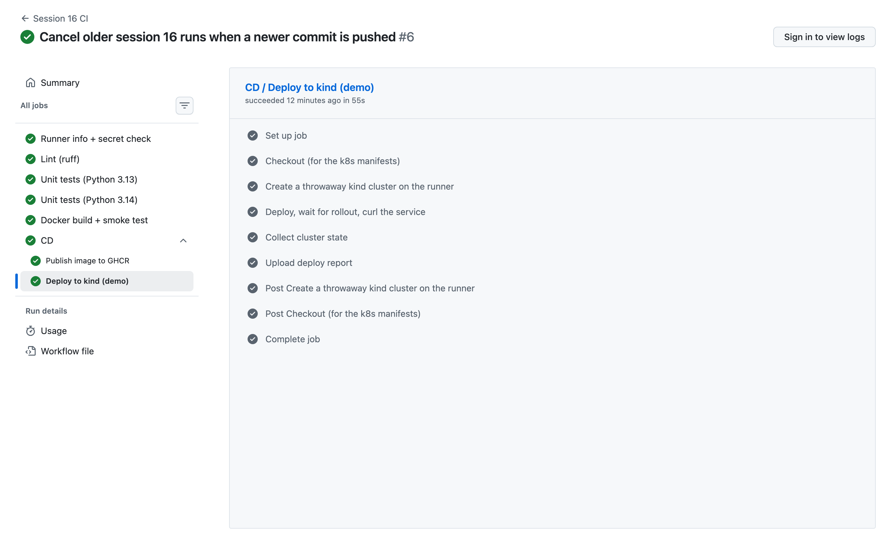

## 7. Runners

A runner is the machine that executes a job. I used GitHub-hosted runners: every job gets a
brand new VM that is thrown away afterwards, which is why every job starts with
`actions/checkout`. The first job prints what it got:

```text
runner.name  = GitHub Actions 1000000696
runner.os    = Linux / runner.arch = X64
image        = ubuntu24 20260927.320.1
cpus         = 4   memory = 15Gi
event        = push   ref = session16-cicd   sha = 2db5345e61bf4ffbf93902fb2b8d59cc7eb02a93
```

In the job table above, every job has a different `runner_name`: seven jobs, seven separate
VMs. My Mac is arm64, but the runner is x64, so the image CD publishes is `linux/amd64`
(see section 10).

I started with `runs-on: ubuntu-latest`. Run #1 printed this notice on every job:
`The ubuntu-latest label will migrate to Ubuntu 26 beginning October 19, 2026.` Since
"latest" can change under me, I pinned `ubuntu-24.04` (`c17a2a4`), so the OS only changes when
I decide it does.

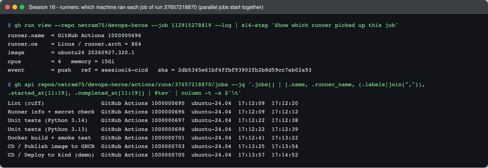

## 8. Secrets

I created a repository secret from my Mac with a random value (never written into the repo):

```bash
gh secret set DEMO_API_TOKEN --repo netram75/devops-heros --body "<32 random characters>"
```

It is used in two places:

- **CI** (`session16-ci.yml` lines 49-58): checks that the secret is available, prints its length
  and a short sha256 prefix, then tries to print it directly.
- **CD** (`session16-cd.yml` lines 86-87 and the deploy script): it becomes a Kubernetes Secret
  `s16-app-secret`, mounted into the pod as `API_TOKEN`. The app only reports
  `api_token_configured: true`, never the value.

```text
$ gh secret list --repo netram75/devops-heros
DEMO_API_TOKEN	2026-10-07T16:48:22Z

$ printf %s "$TOKEN_I_SET" | wc -c; printf %s "$TOKEN_I_SET" | shasum -a 256 | cut -c1-12   # value read from a local file, never shown
32
2a2b97aaf679

$ gh run view --repo netram75/devops-heros --job 112915278819 --log | s16-step 'Use the DEMO_API_TOKEN repository secret (value stays masked)'
DEMO_API_TOKEN is available, length = 32 characters
sha256 prefix (lets me match it to the value I set, without revealing it): 2a2b97aaf679
Trying to print the secret directly: ***
```

The length and hash prefix computed on my Mac match the ones computed on the runner, so the
runner really had my value, and when I echoed it, GitHub replaced it with `***`. Masking only
works on the exact string, though. If I had printed it base64-encoded or one character per
line, it would leak, so the real rule is still "never print secrets".

The CD job uses a second, built-in secret: `secrets.GITHUB_TOKEN`. GitHub creates it per run
and it expires when the job ends, so there is no long-lived registry password anywhere. It logs
in to GHCR in `publish` (`packages: write`) and becomes the cluster's `imagePullSecret` in
`deploy` (`packages: read`). One thing I noticed: in the echoed deploy script the runner
printed my line `--docker-password="$GHCR_TOKEN"` as `--docker-***`, so it even masks the
script text around a password flag.

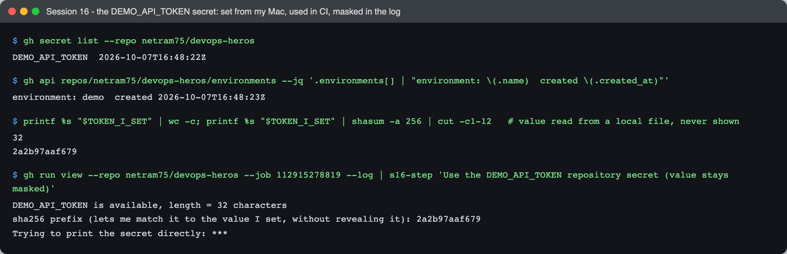

## 9. Artifacts

Artifacts are files a job keeps after its VM is destroyed. I use them for two different reasons:

- **Evidence for humans:** `test-report-py3.13` / `test-report-py3.14` (JUnit XML, coverage XML,
  HTML coverage, pytest output) and `deploy-report` (deploy output, `kubectl get all`,
  `describe`, events, pod logs). They are uploaded with `if: always()`, so I get them even when
  a test fails, which is exactly when I need them (run #3 has its 2 test reports).
- **Passing a build between jobs:** `docker-image` is the image tar that CI built and tested.
  The CD `publish` job downloads it with `actions/download-artifact@v8` instead of rebuilding.

The fifth artifact, `netram75~devops-heros~QPSD4F.dockerbuild`, I did not ask for:
`docker/build-push-action` uploads a build record by default.

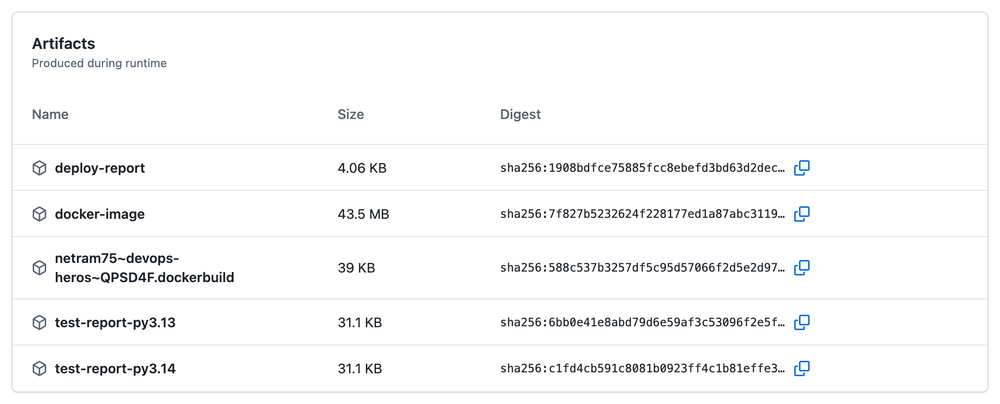

```text
$ gh run download 37657218870 --repo netram75/devops-heros -n test-report-py3.14 -D test-report && find test-report -maxdepth 1 | sort
test-report
test-report/coverage.xml
test-report/htmlcov
test-report/junit.xml
test-report/pytest-output.txt

$ grep -o '<testsuite [^>]*' test-report/junit.xml | tr ' ' '\n' | grep -E 'tests=|failures=|errors=|skipped=|time='
errors="0"
failures="0"
skipped="0"
tests="16"
time="0.212"

$ gh run download 37657218870 --repo netram75/devops-heros -n deploy-report -D deploy-report && ls deploy-report
deploy-output.txt
describe-deployment.txt
events.txt
get-all.txt
pod-logs.txt
port-forward.log
```

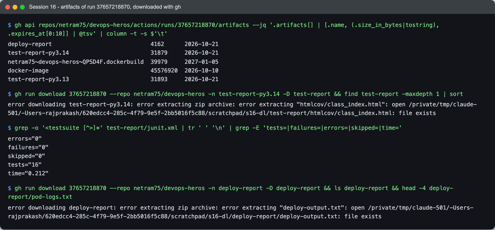

## 10. Build

The Dockerfile has two stages. Stage 1 `pip install`s the requirements into `/install`.
Stage 2 starts again from a clean `python:3.14-slim`, copies only `/install` and `app/`, and
switches to `USER 10001`. Pip, its cache and the requirements file never reach the final image,
and the container does not run as root. I used a numeric UID so Kubernetes `runAsNonRoot: true`
can check it. `.dockerignore` allows only `app/` and `requirements.txt` into the build context,
so `.venv`, tests and screenshots are never sent to Docker.

I built and ran it on my Mac first, read-only, the same way the cluster runs it:

```text
$ docker image ls netram-s16-calculator:local
IMAGE                         ID             DISK USAGE   CONTENT SIZE   EXTRA
netram-s16-calculator:local   6e12953f4f8e        215MB         46.1MB

$ docker inspect netram-s16-calculator:local --format 'User={{.Config.User}}  Cmd={{json .Config.Cmd}}'
User=10001  Cmd=["gunicorn","--bind","0.0.0.0:8000","--workers","2","--worker-tmp-dir","/dev/shm","--no-control-socket","--access-logfile","-","app.main:app"]

$ docker run -d --name netram-s16-app --read-only -e API_TOKEN=local-dummy -p 18160:8000 netram-s16-calculator:local
$ curl -s localhost:18160/health; curl -s localhost:18160/; curl -s 'localhost:18160/api/add?a=2&b=3'; curl -s -w '[HTTP %{http_code}]\n' 'localhost:18160/api/divide?a=1&b=0'
{"status":"ok"}
{"api_token_configured":true,"host":"e60f7cd37e45","operations":["add","divide","multiply","subtract"],"service":"session16-calculator","version":"local-test"}
{"a":2.0,"b":3.0,"operation":"add","result":5.0}
{"error":"Cannot divide by zero"}
[HTTP 400]

$ docker exec netram-s16-app id
uid=10001(app) gid=10001(app) groups=10001(app)

$ docker ps --filter name=netram-s16-app --format '{{.Names}}  {{.Image}}  {{.Status}}'
netram-s16-app  netram-s16-calculator:local  Up 18 seconds (healthy)
```

46.1 MB is the compressed size that gets pushed and pulled. 215 MB is the unpacked size on disk.
The runner's Docker reports the same image as 127MB because it uses a different image store.

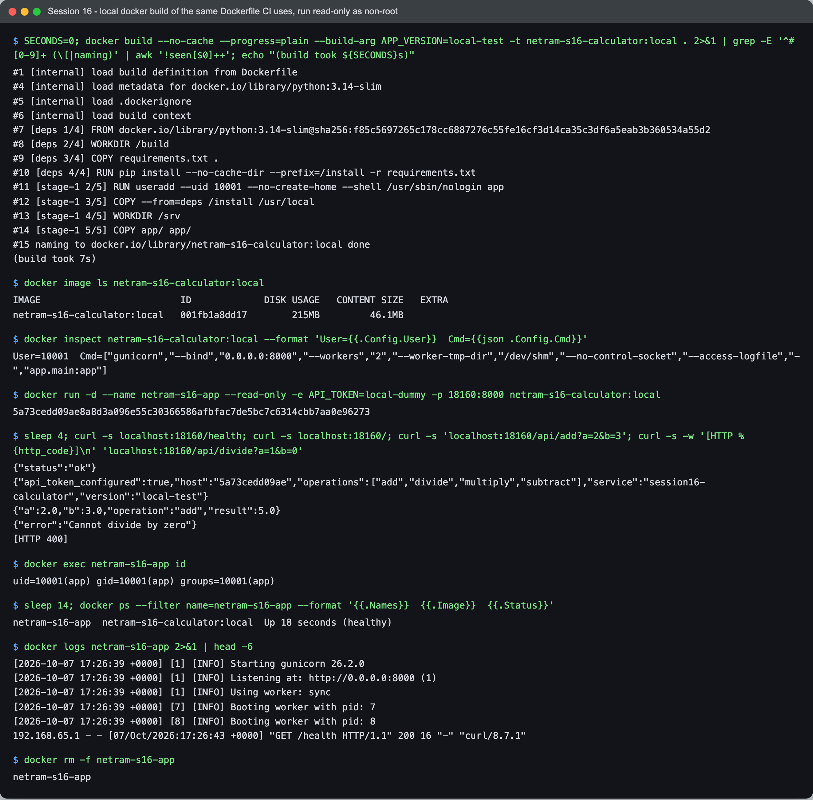

In CI, `docker/build-push-action@v7` builds the same Dockerfile with
`APP_VERSION=${{ github.sha }}`, exports it to a tar instead of pushing, and caches layers in
the GitHub Actions cache (`cache-from/cache-to: type=gha`). The next step loads it, starts it
with `--read-only` and curls it. Note the first `curl` failing while gunicorn was still starting,
and the retry loop handling it:

```text
Loaded image: s16-calculator:2db5345e61bf4ffbf93902fb2b8d59cc7eb02a93
REPOSITORY       TAG                                        IMAGE ID       CREATED         SIZE
s16-calculator   2db5345e61bf4ffbf93902fb2b8d59cc7eb02a93   e76969084ca9   6 seconds ago   127MB
curl: (56) Recv failure: Connection reset by peer
{"status":"ok"}
GET / -> {"api_token_configured":false,"host":"9429a9b4cb6b","operations":["add","divide","multiply","subtract"],"service":"session16-calculator","version":"2db5345e61bf4ffbf93902fb2b8d59cc7eb02a93"}
GET /api/add?a=2&b=3 -> {"a":2.0,"b":3.0,"operation":"add","result":5.0}
container user: uid=10001(app) gid=10001(app) groups=10001(app)
```

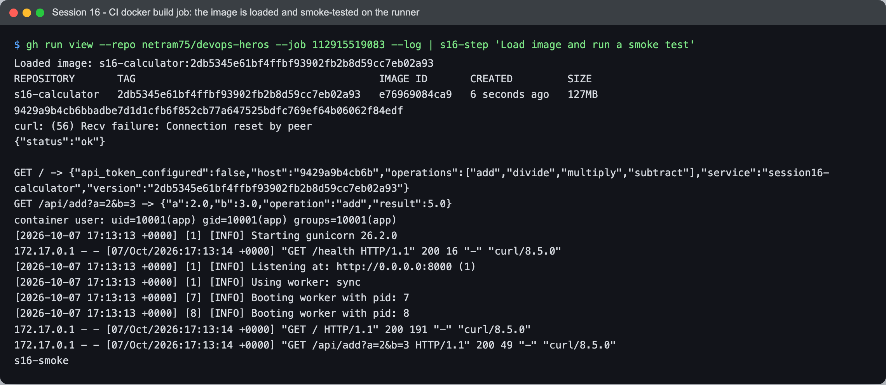

## 11. Test

Two layers of checks, both run locally before I pushed and then in CI:

- **Lint**: `ruff check` (pyflakes, pycodestyle, import order, bugbear, pyupgrade rules) and
  `ruff format --check`. It is the cheapest job, so it runs first and the tests wait for it.
- **Tests**: 16 pytest tests. `test_calculator.py` tests the pure functions, and `test_api.py`
  calls the real Flask routes through the test client (status codes, error cases, and that the
  token value never appears in a response). `--cov-fail-under=90` makes coverage a gate, not
  just a number.

```text
$ ruff check . && ruff format --check .
All checks passed!
6 files already formatted

$ pytest -v --cov --cov-report=term-missing --cov-fail-under=90
platform darwin -- Python 3.14.6, pytest-9.1.1, pluggy-1.6.0
collected 16 items
...
TOTAL                  39      0   100%
Required test coverage of 90% reached. Total coverage: 100.00%
================================================= 16 passed in 0.14s =================================================
```

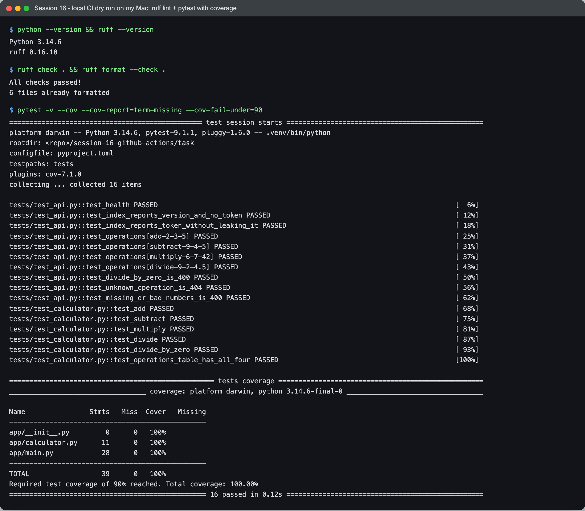

## 12. Pipeline execution (the CD half)

**Publish** downloads the tested tar, logs in to `ghcr.io` with `GITHUB_TOKEN` and pushes two tags:

```text
2db5345e61bf4ffbf93902fb2b8d59cc7eb02a93: digest: sha256:5f1f58f571df23554beb63b936fde5031d089fef015a0b5804e0610fd9688c39 size: 1992
latest: digest: sha256:5f1f58f571df23554beb63b936fde5031d089fef015a0b5804e0610fd9688c39 size: 1992
pushed ghcr.io/netram75/devops-heros-session16:2db5345e61bf4ffbf93902fb2b8d59cc7eb02a93 and :latest, digest sha256:5f1f58f571df23554beb63b936fde5031d089fef015a0b5804e0610fd9688c39
```

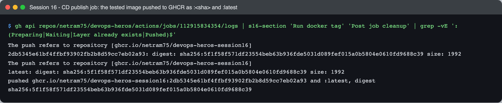

The `:<sha>` tag never moves, so I can always redeploy or roll back to an exact commit.
`:latest` is just a convenience pointer. The package is public:
[ghcr.io/netram75/devops-heros-session16](https://github.com/netram75/devops-heros/pkgs/container/devops-heros-session16).

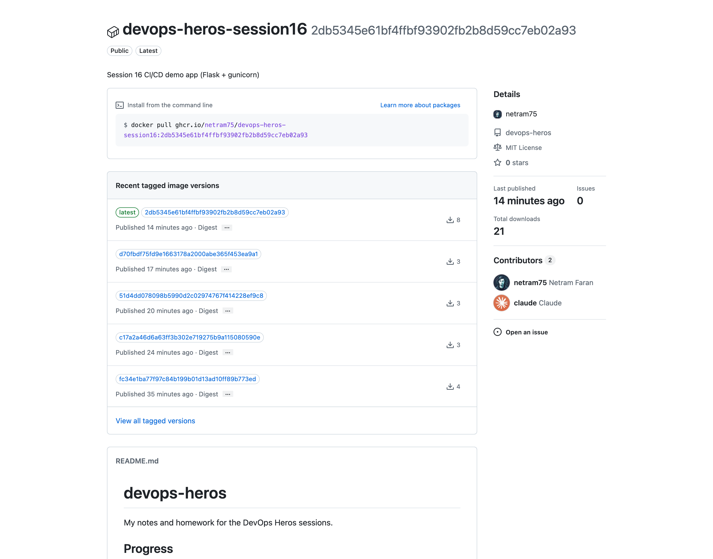

**Deploy** creates a single-node kind cluster (kind v0.31.0, Kubernetes v1.35.0) inside the
runner, creates the two secrets, applies the manifests with the image set to `:<sha>`, waits for
the rollout, checks the digest and curls the Service through `kubectl port-forward`:

```text
== cluster
NAME                     STATUS   ROLES           AGE   VERSION   INTERNAL-IP   EXTERNAL-IP   OS-IMAGE                         KERNEL-VERSION      CONTAINER-RUNTIME
s16-demo-control-plane   Ready    control-plane   22s   v1.35.0   172.18.0.2    <none>        Debian GNU/Linux 12 (bookworm)   6.17.0-1022-azure   containerd://2.2.0
== secrets (values come from GitHub, never echoed)
secret/ghcr-pull created
secret/s16-app-secret created
== apply manifests with image ghcr.io/netram75/devops-heros-session16:2db5345e61bf4ffbf93902fb2b8d59cc7eb02a93
deployment.apps/s16-calculator created
service/s16-calculator created
Waiting for deployment "s16-calculator" rollout to finish: 0 of 2 updated replicas are available...
Waiting for deployment "s16-calculator" rollout to finish: 1 of 2 updated replicas are available...
deployment "s16-calculator" successfully rolled out
== the running pods use exactly the digest that was pushed
s16-calculator-5c88f55cb7-kzfkd  ghcr.io/netram75/devops-heros-session16@sha256:5f1f58f571df23554beb63b936fde5031d089fef015a0b5804e0610fd9688c39
s16-calculator-5c88f55cb7-mlczz  ghcr.io/netram75/devops-heros-session16@sha256:5f1f58f571df23554beb63b936fde5031d089fef015a0b5804e0610fd9688c39
all pods run sha256:5f1f58f571df23554beb63b936fde5031d089fef015a0b5804e0610fd9688c39
== curl through kubectl port-forward
GET /health -> {"status":"ok"}
 [HTTP 200]
GET / -> {"api_token_configured":true,"host":"s16-calculator-5c88f55cb7-kzfkd","operations":["add","divide","multiply","subtract"],"service":"session16-calculator","version":"2db5345e61bf4ffbf93902fb2b8d59cc7eb02a93"}
 [HTTP 200]
GET /api/multiply?a=6&b=7 -> {"a":6.0,"b":7.0,"operation":"multiply","result":42.0}
 [HTTP 200]
GET /api/divide?a=1&b=0 -> {"error":"Cannot divide by zero"}
 [HTTP 400]
deployed version matches commit 2db5345e61bf4ffbf93902fb2b8d59cc7eb02a93 and the API token secret reached the pod
```

The job is not just "kubectl apply and hope". The last line is a `jq -e` check, so if the pod
answered with the wrong version or without the token, the step would fail and the run would
go red. The pods pulled the image from GHCR themselves (no `kind load`), so this also proves the
registry push and the pull secret work.

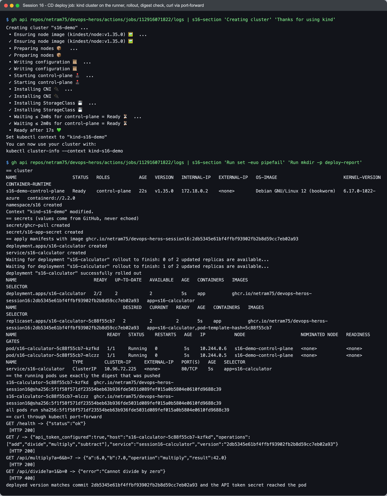

Finally I pulled the published image on my Mac. It is `linux/amd64`, so it runs under
emulation here, and it answers with the same commit SHA:

```text
$ docker pull --platform linux/amd64 ghcr.io/netram75/devops-heros-session16:2db5345e61bf4ffbf93902fb2b8d59cc7eb02a93 | tail -3
Digest: sha256:5f1f58f571df23554beb63b936fde5031d089fef015a0b5804e0610fd9688c39
Status: Downloaded newer image for ghcr.io/netram75/devops-heros-session16:2db5345e61bf4ffbf93902fb2b8d59cc7eb02a93

$ curl -s localhost:18161/; curl -s 'localhost:18161/api/subtract?a=10&b=4'
{"api_token_configured":false,"host":"71709d7f5370","operations":["add","divide","multiply","subtract"],"service":"session16-calculator","version":"2db5345e61bf4ffbf93902fb2b8d59cc7eb02a93"}
{"a":10.0,"b":4.0,"operation":"subtract","result":6.0}

$ docker image inspect ghcr.io/netram75/devops-heros-session16:2db5345e61bf4ffbf93902fb2b8d59cc7eb02a93 --format 'os/arch={{.Os}}/{{.Architecture}}  user={{.Config.User}}'; docker exec netram-s16-ghcr uname -m
os/arch=linux/amd64  user=10001
x86_64
```

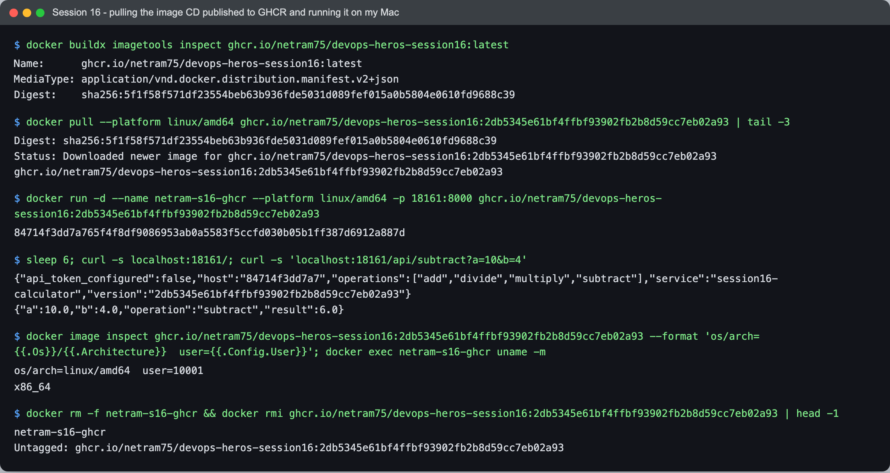

All local containers (`netram-s16-app`, `netram-s16-ghcr`) and images were removed afterwards.

---

## What I learned

- CI and CD are separate questions ("is it good?" and "ship it"), and the boundary between them
  should be enforced by the tool, not by discipline. With `needs:` plus a CD workflow that can
  only be *called*, a red test physically cannot reach the registry (run #3).
- Build once, promote the same artifact. Rebuilding in CD would deploy something that was
  never tested. Checking the running pod's digest against the pushed digest made that concrete.
- `:latest` is a moving pointer and can lie. The SHA tag and the digest are what to trust.
- Parallel jobs are free speed, but every job is a new VM, so anything shared between jobs has
  to travel as an artifact, a cache, or a job output.
- `GITHUB_TOKEN` plus `permissions:` is better than storing a registry password: it is per run,
  expires on its own, and each job only gets the scopes it declares.
- Masking is a safety net, not a design. It only hides the exact string.
- Pin things that can change under you: the runner image, action major versions, and Python
  package versions.

## Problems I hit

1. **gunicorn crashed its control server on a read-only filesystem (local, before any push).**
   I ran the container with `--read-only` to match the Kubernetes `readOnlyRootFilesystem: true`.
   It served requests but logged:

   ```text
   [2026-10-07 16:47:39 +0000] [1] [ERROR] Control server error: [Errno 30] Read-only file system: '/home/app'
   ```

   gunicorn 26 (newer than the versions most tutorials use) opens a control socket under
   `$HOME/.gunicorn/` by default, and my user has no writable home. `gunicorn --help` showed
   `--no-control-socket`. I added it to `CMD` next to `--worker-tmp-dir /dev/shm` and the error
   went away. I am glad I tested read-only locally, because in the cluster this would only have
   been a quiet error line.

2. **`git push` returned HTTP 500 for about 8 minutes.** After the first successful push (16:50 UTC),
   every push failed with `! [remote rejected] session16-cicd -> session16-cicd (Internal Server Error)`,
   even an empty commit to a scratch branch. githubstatus.com said "All Systems Operational".
   Creating a blob through the REST API also returned 500, while creating a ref to an existing
   commit worked, so it looked like GitHub could not write new git objects for this repo at
   that moment. Nothing on my side was wrong, so I wrote a loop that retried `git push` every 60
   seconds. It went through on the 2nd attempt (17:01:49 UTC). The scratch-branch pushes were
   rejected too, so they left nothing behind, and the one test ref I created through the API I
   deleted again straight away.

3. **An older run overwrote `:latest` with an older image.** I pushed `d70fbdf` (run #4) and
   `51d4dd0` (run #5) about 20 seconds apart. Run #4's Python 3.14 test job waited about 3 minutes
   for a free runner (created 17:05:47, started 17:09:00), so the newer run #5 published first
   and the older run #4 published last:

   ```text
   37656344379 CD / Publish image to GHCR 2026-10-07T17:09:45Z 2026-10-07T17:10:07Z   <- run #4 (older commit)
   37656392714 CD / Publish image to GHCR 2026-10-07T17:07:06Z 2026-10-07T17:07:26Z   <- run #5 (newer commit)

   latest                                     docker-content-digest: sha256:3a92365110ca826057f8d974e28a136b538f02b5de72a133f56b524fae11f3f3
   d70fbdf75fd9e1663178a2000abe365f453ea9a1   docker-content-digest: sha256:3a92365110ca826057f8d974e28a136b538f02b5de72a133f56b524fae11f3f3
   51d4dd078098b5990d2c02974767f414228ef9c8   docker-content-digest: sha256:824a26a9cf07e10a889de8d063508a095c6d060c667fae7b4eac3d9f28a40623
   ```

   So `:latest` pointed at the older commit even though the branch head was newer. The deploy job
   already had a concurrency group, but publishing did not, and a concurrency group only orders
   jobs by arrival time, not by commit order anyway. The fix (`2db5345`) is a workflow-level
   `concurrency` group with `cancel-in-progress: true`: when a newer push arrives, the older run
   for the same branch is cancelled, so it cannot finish last. After run #6, `:latest` and
   `:2db5345...` have the same digest (`sha256:5f1f58f5...`, see the `imagetools inspect` above).

4. **`ubuntu-latest` was about to change.** Run #1 warned that `ubuntu-latest` moves to Ubuntu 26
   on 2026-10-19. I pinned `ubuntu-24.04` so that change cannot silently break the pipeline.

5. **Job logs are not public.** Anonymous visitors only see "Sign in to view logs", so my
   browser screenshots show the run graph, the artifacts table, the job page and the GHCR page.
   The log screenshots are the same real logs fetched with `gh`.

6. A small shell mistake while testing the push problem: in zsh, `git push origin $c:refs/heads/x`
   treats `:r` as a zsh modifier ("remove extension") and mangles the refspec. Writing it as
   `"${c}:refs/heads/x"` fixed it.
