# Session 10 - Kubernetes Pods, ReplicaSets & Deployments - Task

- **Name:** Netram
- **Enrollment No:** 24BCS10329

> **Status:** completed

> Run on macOS (Apple Silicon) with Docker Desktop, minikube v1.39.0 (single node) and
> Kubernetes v1.37.0. All times in the outputs are UTC.

---

## What the task asked

**Task 1 - Deployment strategies.** Implement all four: Rolling Update (create, configure,
update, verify old and new pods), Blue-Green (blue, green, switch traffic, verify the active
version), Canary (stable, canary, send a small share of traffic to the canary, verify both) and
Recreate (deploy, update, observe old pods terminated before new ones are created).

**Task 2 - Pod lifecycle.** For each YAML in [`../pod-lifecycle/`](../pod-lifecycle/): apply it,
check pod status and details, capture the output, add a screenshot, explain what I observed.

## My approach

I used the course YAMLs as they are in [`../01-rolling-update`](../01-rolling-update),
[`../02-blue-green`](../02-blue-green), [`../03-canary`](../03-canary) and
[`../04-recreate`](../04-recreate). A strategy is only interesting when someone is using the app
while it changes, so for every strategy I ran a small traffic generator inside the cluster,
[`traffic-pod.yaml`](traffic-pod.yaml). It requests the Service five times a second and logs
which version answered, or `FAIL` if nothing answered within a second. Its log is the real
"user experience" of each strategy, and it is what turned up the most interesting result below.

Files I added in this folder:

| File | Why |
|---|---|
| [`traffic-pod.yaml`](traffic-pod.yaml) | in-cluster traffic generator, Service name filled in with `sed` |
| [`rolling-v1-prestop.yaml`](rolling-v1-prestop.yaml), [`rolling-v2-prestop.yaml`](rolling-v2-prestop.yaml) | the rolling-update YAMLs plus a `preStop` hook, to fix the dropped requests I found |

`ts` in some commands prefixes each line with the time it arrived. It is a three-line shell
script on my machine, since moreutils is not installed.

---

# Task 1 - Deployment strategies

## 1. Rolling Update

`deployment-v1.yaml` runs 4 replicas of nginx with `maxSurge: 1` and `maxUnavailable: 0`, and
a readiness probe. `deployment-v2.yaml` changes the image and the page to `VERSION: v2`.

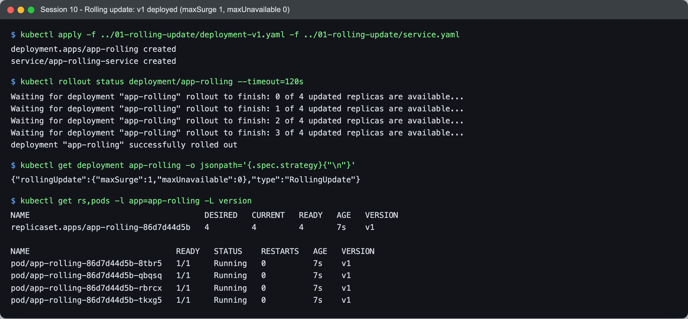

```text
$ kubectl apply -f ../01-rolling-update/deployment-v1.yaml -f ../01-rolling-update/service.yaml
deployment.apps/app-rolling created
service/app-rolling-service created

$ kubectl rollout status deployment/app-rolling --timeout=120s
Waiting for deployment "app-rolling" rollout to finish: 0 of 4 updated replicas are available...
Waiting for deployment "app-rolling" rollout to finish: 1 of 4 updated replicas are available...
Waiting for deployment "app-rolling" rollout to finish: 2 of 4 updated replicas are available...
Waiting for deployment "app-rolling" rollout to finish: 3 of 4 updated replicas are available...
deployment "app-rolling" successfully rolled out

$ kubectl get deployment app-rolling -o jsonpath='{.spec.strategy}{"\n"}'
{"rollingUpdate":{"maxSurge":1,"maxUnavailable":0},"type":"RollingUpdate"}

$ kubectl get rs,pods -l app=app-rolling -L version
NAME                                     DESIRED   CURRENT   READY   AGE   VERSION
replicaset.apps/app-rolling-86d7d44d5b   4         4         4       7s    v1

NAME                               READY   STATUS    RESTARTS   AGE   VERSION
pod/app-rolling-86d7d44d5b-8tbr5   1/1     Running   0          7s    v1
pod/app-rolling-86d7d44d5b-qbqsq   1/1     Running   0          7s    v1
pod/app-rolling-86d7d44d5b-rbrcx   1/1     Running   0          7s    v1
pod/app-rolling-86d7d44d5b-tkxg5   1/1     Running   0          7s    v1
```

Then I started the traffic generator and applied v2, with a watch on the pods running in the
background:

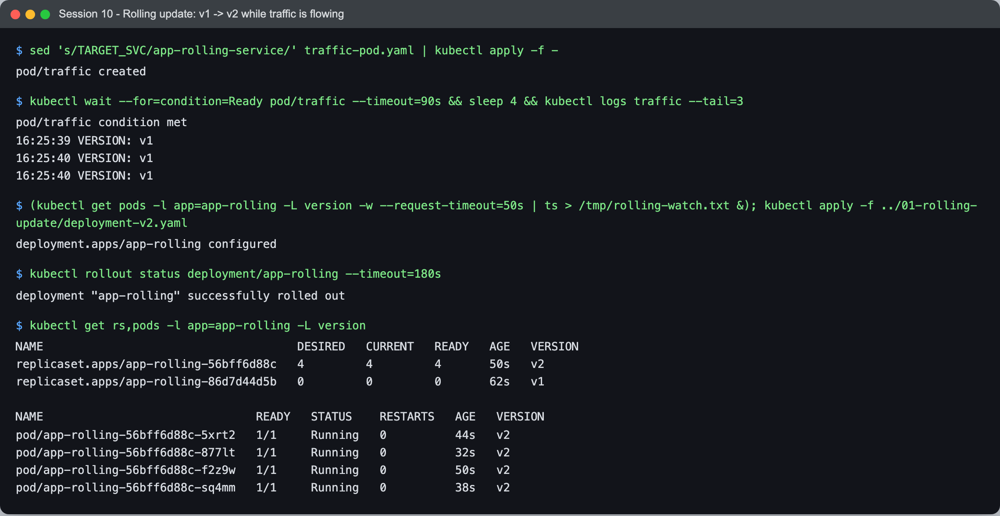

```text
$ sed 's/TARGET_SVC/app-rolling-service/' traffic-pod.yaml | kubectl apply -f -
pod/traffic created

$ kubectl wait --for=condition=Ready pod/traffic --timeout=90s && sleep 4 && kubectl logs traffic --tail=3
pod/traffic condition met
16:25:39 VERSION: v1
16:25:40 VERSION: v1
16:25:40 VERSION: v1

$ (kubectl get pods -l app=app-rolling -L version -w --request-timeout=50s | ts > /tmp/rolling-watch.txt &); kubectl apply -f ../01-rolling-update/deployment-v2.yaml
deployment.apps/app-rolling configured

$ kubectl rollout status deployment/app-rolling --timeout=180s
deployment "app-rolling" successfully rolled out

$ kubectl get rs,pods -l app=app-rolling -L version
NAME                                     DESIRED   CURRENT   READY   AGE   VERSION
replicaset.apps/app-rolling-56bff6d88c   4         4         4       50s   v2
replicaset.apps/app-rolling-86d7d44d5b   0         0         0       62s   v1

NAME                               READY   STATUS    RESTARTS   AGE   VERSION
pod/app-rolling-56bff6d88c-5xrt2   1/1     Running   0          44s   v2
pod/app-rolling-56bff6d88c-877lt   1/1     Running   0          32s   v2
pod/app-rolling-56bff6d88c-f2z9w   1/1     Running   0          50s   v2
pod/app-rolling-56bff6d88c-sq4mm   1/1     Running   0          38s   v2
```

### Old and new pods during the update

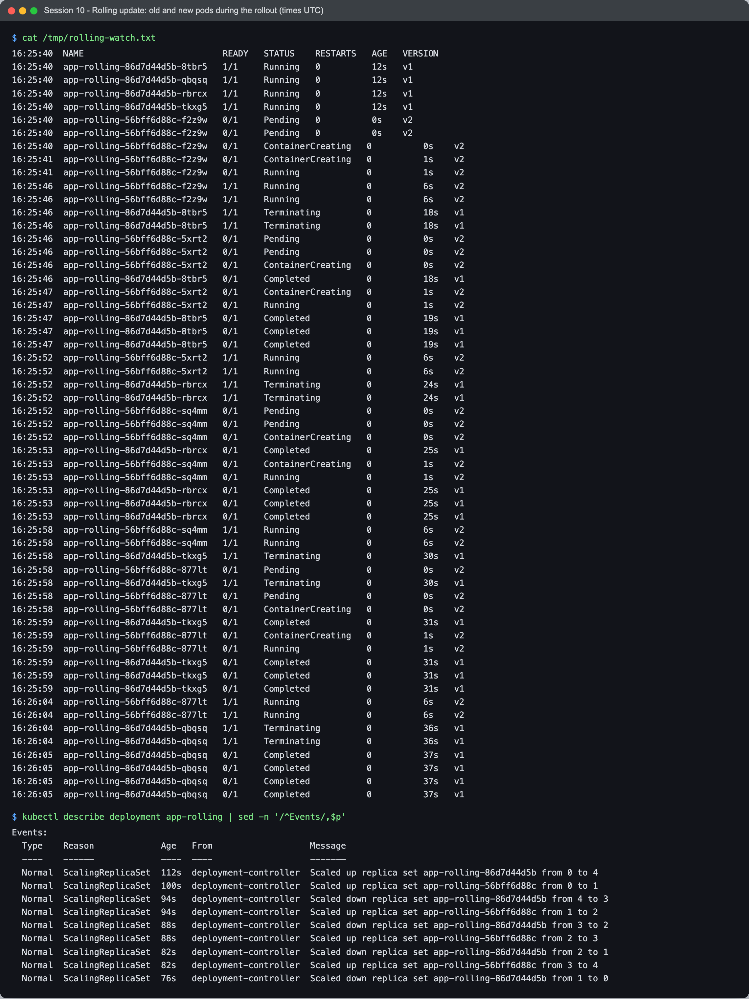

```text
$ cat /tmp/rolling-watch.txt
16:25:40  NAME                           READY   STATUS    RESTARTS   AGE   VERSION
16:25:40  app-rolling-86d7d44d5b-8tbr5   1/1     Running   0          12s   v1
16:25:40  app-rolling-86d7d44d5b-qbqsq   1/1     Running   0          12s   v1
16:25:40  app-rolling-86d7d44d5b-rbrcx   1/1     Running   0          12s   v1
16:25:40  app-rolling-86d7d44d5b-tkxg5   1/1     Running   0          12s   v1
16:25:40  app-rolling-56bff6d88c-f2z9w   0/1     Pending   0          0s    v2
16:25:40  app-rolling-56bff6d88c-f2z9w   0/1     Pending   0          0s    v2
16:25:40  app-rolling-56bff6d88c-f2z9w   0/1     ContainerCreating   0          0s    v2
16:25:41  app-rolling-56bff6d88c-f2z9w   0/1     ContainerCreating   0          1s    v2
16:25:41  app-rolling-56bff6d88c-f2z9w   0/1     Running             0          1s    v2
16:25:46  app-rolling-56bff6d88c-f2z9w   1/1     Running             0          6s    v2
16:25:46  app-rolling-56bff6d88c-f2z9w   1/1     Running             0          6s    v2
16:25:46  app-rolling-86d7d44d5b-8tbr5   1/1     Terminating         0          18s   v1
16:25:46  app-rolling-86d7d44d5b-8tbr5   1/1     Terminating         0          18s   v1
16:25:46  app-rolling-56bff6d88c-5xrt2   0/1     Pending             0          0s    v2
16:25:46  app-rolling-56bff6d88c-5xrt2   0/1     Pending             0          0s    v2
16:25:46  app-rolling-56bff6d88c-5xrt2   0/1     ContainerCreating   0          0s    v2
16:25:46  app-rolling-86d7d44d5b-8tbr5   0/1     Completed           0          18s   v1
16:25:47  app-rolling-56bff6d88c-5xrt2   0/1     ContainerCreating   0          1s    v2
16:25:47  app-rolling-56bff6d88c-5xrt2   0/1     Running             0          1s    v2
16:25:47  app-rolling-86d7d44d5b-8tbr5   0/1     Completed           0          19s   v1
16:25:47  app-rolling-86d7d44d5b-8tbr5   0/1     Completed           0          19s   v1
16:25:47  app-rolling-86d7d44d5b-8tbr5   0/1     Completed           0          19s   v1
16:25:52  app-rolling-56bff6d88c-5xrt2   1/1     Running             0          6s    v2
16:25:52  app-rolling-56bff6d88c-5xrt2   1/1     Running             0          6s    v2
16:25:52  app-rolling-86d7d44d5b-rbrcx   1/1     Terminating         0          24s   v1
16:25:52  app-rolling-86d7d44d5b-rbrcx   1/1     Terminating         0          24s   v1
16:25:52  app-rolling-56bff6d88c-sq4mm   0/1     Pending             0          0s    v2
16:25:52  app-rolling-56bff6d88c-sq4mm   0/1     Pending             0          0s    v2
16:25:52  app-rolling-56bff6d88c-sq4mm   0/1     ContainerCreating   0          0s    v2
16:25:53  app-rolling-86d7d44d5b-rbrcx   0/1     Completed           0          25s   v1
16:25:53  app-rolling-56bff6d88c-sq4mm   0/1     ContainerCreating   0          1s    v2
16:25:53  app-rolling-56bff6d88c-sq4mm   0/1     Running             0          1s    v2
16:25:53  app-rolling-86d7d44d5b-rbrcx   0/1     Completed           0          25s   v1
16:25:53  app-rolling-86d7d44d5b-rbrcx   0/1     Completed           0          25s   v1
16:25:53  app-rolling-86d7d44d5b-rbrcx   0/1     Completed           0          25s   v1
16:25:58  app-rolling-56bff6d88c-sq4mm   1/1     Running             0          6s    v2
16:25:58  app-rolling-56bff6d88c-sq4mm   1/1     Running             0          6s    v2
16:25:58  app-rolling-86d7d44d5b-tkxg5   1/1     Terminating         0          30s   v1
16:25:58  app-rolling-56bff6d88c-877lt   0/1     Pending             0          0s    v2
16:25:58  app-rolling-86d7d44d5b-tkxg5   1/1     Terminating         0          30s   v1
16:25:58  app-rolling-56bff6d88c-877lt   0/1     Pending             0          0s    v2
16:25:58  app-rolling-56bff6d88c-877lt   0/1     ContainerCreating   0          0s    v2
16:25:59  app-rolling-86d7d44d5b-tkxg5   0/1     Completed           0          31s   v1
16:25:59  app-rolling-56bff6d88c-877lt   0/1     ContainerCreating   0          1s    v2
16:25:59  app-rolling-56bff6d88c-877lt   0/1     Running             0          1s    v2
16:25:59  app-rolling-86d7d44d5b-tkxg5   0/1     Completed           0          31s   v1
16:25:59  app-rolling-86d7d44d5b-tkxg5   0/1     Completed           0          31s   v1
16:25:59  app-rolling-86d7d44d5b-tkxg5   0/1     Completed           0          31s   v1
16:26:04  app-rolling-56bff6d88c-877lt   1/1     Running             0          6s    v2
16:26:04  app-rolling-56bff6d88c-877lt   1/1     Running             0          6s    v2
16:26:04  app-rolling-86d7d44d5b-qbqsq   1/1     Terminating         0          36s   v1
16:26:04  app-rolling-86d7d44d5b-qbqsq   1/1     Terminating         0          36s   v1
16:26:05  app-rolling-86d7d44d5b-qbqsq   0/1     Completed           0          37s   v1
16:26:05  app-rolling-86d7d44d5b-qbqsq   0/1     Completed           0          37s   v1
16:26:05  app-rolling-86d7d44d5b-qbqsq   0/1     Completed           0          37s   v1
16:26:05  app-rolling-86d7d44d5b-qbqsq   0/1     Completed           0          37s   v1

$ kubectl describe deployment app-rolling | sed -n '/^Events/,$p'
Events:
  Type    Reason             Age   From                   Message
  ----    ------             ----  ----                   -------
  Normal  ScalingReplicaSet  112s  deployment-controller  Scaled up replica set app-rolling-86d7d44d5b from 0 to 4
  Normal  ScalingReplicaSet  100s  deployment-controller  Scaled up replica set app-rolling-56bff6d88c from 0 to 1
  Normal  ScalingReplicaSet  94s   deployment-controller  Scaled down replica set app-rolling-86d7d44d5b from 4 to 3
  Normal  ScalingReplicaSet  94s   deployment-controller  Scaled up replica set app-rolling-56bff6d88c from 1 to 2
  Normal  ScalingReplicaSet  88s   deployment-controller  Scaled down replica set app-rolling-86d7d44d5b from 3 to 2
  Normal  ScalingReplicaSet  88s   deployment-controller  Scaled up replica set app-rolling-56bff6d88c from 2 to 3
  Normal  ScalingReplicaSet  82s   deployment-controller  Scaled down replica set app-rolling-86d7d44d5b from 2 to 1
  Normal  ScalingReplicaSet  82s   deployment-controller  Scaled up replica set app-rolling-56bff6d88c from 3 to 4
  Normal  ScalingReplicaSet  76s   deployment-controller  Scaled down replica set app-rolling-86d7d44d5b from 1 to 0
```

This is exactly what `maxSurge: 1, maxUnavailable: 0` promises, and the events spell it out:
scale the new ReplicaSet up by one, wait until that pod is **Ready** (the readiness probe passes
about 5 to 6 seconds after start), only then scale the old ReplicaSet down by one, repeat. There
were never fewer than 4 ready pods and never more than 5 pods. The old ReplicaSet is kept at 0
replicas, which is what makes `kubectl rollout undo` possible.

### What the users saw

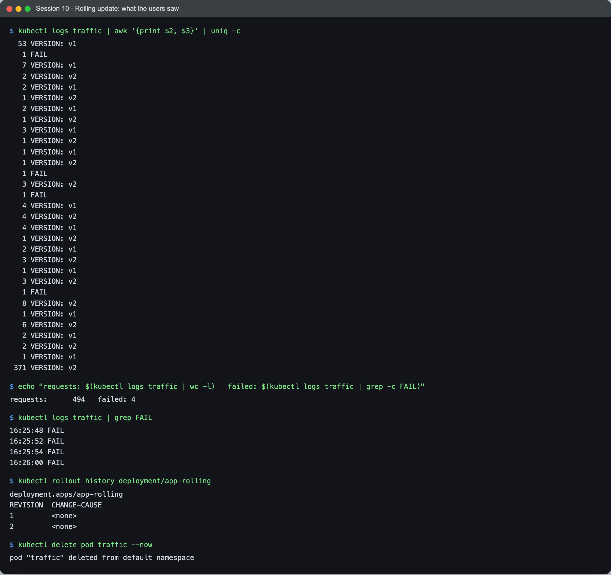

```text
$ kubectl logs traffic | awk '{print $2, $3}' | uniq -c
  53 VERSION: v1
   1 FAIL 
   7 VERSION: v1
   2 VERSION: v2
   2 VERSION: v1
   1 VERSION: v2
   2 VERSION: v1
   1 VERSION: v2
   3 VERSION: v1
   1 VERSION: v2
   1 VERSION: v1
   1 VERSION: v2
   1 FAIL 
   3 VERSION: v2
   1 FAIL 
   4 VERSION: v1
   4 VERSION: v2
   4 VERSION: v1
   1 VERSION: v2
   2 VERSION: v1
   3 VERSION: v2
   1 VERSION: v1
   3 VERSION: v2
   1 FAIL 
   8 VERSION: v2
   1 VERSION: v1
   6 VERSION: v2
   2 VERSION: v1
   2 VERSION: v2
   1 VERSION: v1
 371 VERSION: v2

$ echo "requests: $(kubectl logs traffic | wc -l)   failed: $(kubectl logs traffic | grep -c FAIL)"
requests:      494   failed: 4

$ kubectl logs traffic | grep FAIL
16:25:48 FAIL
16:25:52 FAIL
16:25:54 FAIL
16:26:00 FAIL

$ kubectl rollout history deployment/app-rolling
deployment.apps/app-rolling 
REVISION  CHANGE-CAUSE
1         <none>
2         <none>

$ kubectl delete pod traffic --now
pod "traffic" deleted from default namespace
```

During the rollout v1 and v2 answered interleaved, as expected, because the Service selects
both ReplicaSets' pods by `app: app-rolling`. But **4 requests failed**, even though at least 4
ready pods existed the whole time. The FAIL times (16:25:48, :52, :54, 16:26:00) each come
within about 2 seconds of an old pod going `Terminating` (16:25:46, :52, :58, 16:26:04).

The reason is a race that `maxUnavailable: 0` does not cover. When a pod is deleted, two
things happen in parallel: the kubelet sends SIGTERM to nginx, which exits almost immediately
(the pod is `Completed` in the same second), and the endpoints controller removes the pod from
the Service, after which kube-proxy rewrites its rules. For a moment kube-proxy still sends some
new connections to a pod that has already stopped listening.

### Fixing it with a preStop hook

The usual fix is a `preStop` hook that sleeps for a few seconds. The kubelet runs it **before**
sending SIGTERM, so the pod keeps serving while the Service stops sending it traffic. I added
only that to copies of both YAMLs:

```yaml
lifecycle:
  preStop:
    exec:
      command: ["sh", "-c", "sleep 5"]
```

and repeated the rollout, this time between two versions that both have the hook:

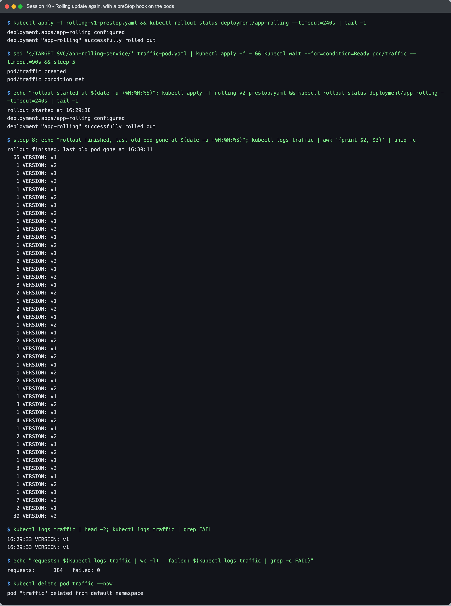

```text
$ kubectl apply -f rolling-v1-prestop.yaml && kubectl rollout status deployment/app-rolling --timeout=240s | tail -1
deployment.apps/app-rolling configured
deployment "app-rolling" successfully rolled out

$ sed 's/TARGET_SVC/app-rolling-service/' traffic-pod.yaml | kubectl apply -f - && kubectl wait --for=condition=Ready pod/traffic --timeout=90s && sleep 5
pod/traffic created
pod/traffic condition met

$ echo "rollout started at $(date -u +%H:%M:%S)"; kubectl apply -f rolling-v2-prestop.yaml && kubectl rollout status deployment/app-rolling --timeout=240s | tail -1
rollout started at 16:29:38
deployment.apps/app-rolling configured
deployment "app-rolling" successfully rolled out

$ sleep 8; echo "rollout finished, last old pod gone at $(date -u +%H:%M:%S)"; kubectl logs traffic | awk '{print $2, $3}' | uniq -c
rollout finished, last old pod gone at 16:30:11
  65 VERSION: v1
   1 VERSION: v2
   1 VERSION: v1
   1 VERSION: v2
   1 VERSION: v1
   1 VERSION: v2
   1 VERSION: v1
   1 VERSION: v2
   1 VERSION: v1
   1 VERSION: v2
   3 VERSION: v1
   1 VERSION: v2
   1 VERSION: v1
   2 VERSION: v2
   6 VERSION: v1
   1 VERSION: v2
   3 VERSION: v1
   2 VERSION: v2
   1 VERSION: v1
   2 VERSION: v2
   4 VERSION: v1
   1 VERSION: v2
   1 VERSION: v1
   2 VERSION: v2
   1 VERSION: v1
   2 VERSION: v2
   1 VERSION: v1
   1 VERSION: v2
   2 VERSION: v1
   1 VERSION: v2
   1 VERSION: v1
   3 VERSION: v2
   1 VERSION: v1
   4 VERSION: v2
   1 VERSION: v1
   2 VERSION: v2
   1 VERSION: v1
   3 VERSION: v2
   1 VERSION: v1
   3 VERSION: v2
   1 VERSION: v1
   1 VERSION: v2
   1 VERSION: v1
   7 VERSION: v2
   2 VERSION: v1
  39 VERSION: v2

$ kubectl logs traffic | head -2; kubectl logs traffic | grep FAIL
16:29:33 VERSION: v1
16:29:33 VERSION: v1

$ echo "requests: $(kubectl logs traffic | wc -l)   failed: $(kubectl logs traffic | grep -c FAIL)"
requests:      184   failed: 0

$ kubectl delete pod traffic --now
pod "traffic" deleted from default namespace
```

**184 requests, 0 failed.** Same strategy and same probes; the only difference is giving the
endpoint update time to land before the process exits. "Zero downtime" with a rolling update
needs a readiness probe **and** graceful termination. The surge settings alone are not enough.

## 2. Blue-Green

Two complete Deployments, `app-blue` (v1) and `app-green` (v2), run side by side. The single
Service `myapp-service` selects `app: myapp` plus `slot: blue` or `slot: green`. Switching
traffic means changing **one label in the Service selector**.

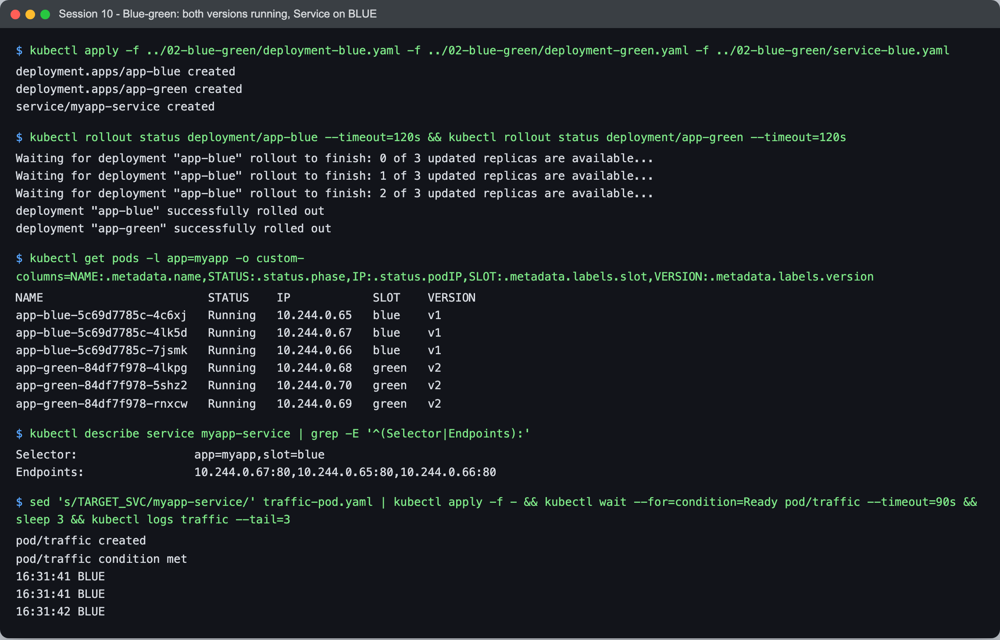

```text
$ kubectl apply -f ../02-blue-green/deployment-blue.yaml -f ../02-blue-green/deployment-green.yaml -f ../02-blue-green/service-blue.yaml
deployment.apps/app-blue created
deployment.apps/app-green created
service/myapp-service created

$ kubectl rollout status deployment/app-blue --timeout=120s && kubectl rollout status deployment/app-green --timeout=120s
Waiting for deployment "app-blue" rollout to finish: 0 of 3 updated replicas are available...
Waiting for deployment "app-blue" rollout to finish: 1 of 3 updated replicas are available...
Waiting for deployment "app-blue" rollout to finish: 2 of 3 updated replicas are available...
deployment "app-blue" successfully rolled out
deployment "app-green" successfully rolled out

$ kubectl get pods -l app=myapp -o custom-columns=NAME:.metadata.name,STATUS:.status.phase,IP:.status.podIP,SLOT:.metadata.labels.slot,VERSION:.metadata.labels.version
NAME                        STATUS    IP            SLOT    VERSION
app-blue-5c69d7785c-4c6xj   Running   10.244.0.65   blue    v1
app-blue-5c69d7785c-4lk5d   Running   10.244.0.67   blue    v1
app-blue-5c69d7785c-7jsmk   Running   10.244.0.66   blue    v1
app-green-84df7f978-4lkpg   Running   10.244.0.68   green   v2
app-green-84df7f978-5shz2   Running   10.244.0.70   green   v2
app-green-84df7f978-rnxcw   Running   10.244.0.69   green   v2

$ kubectl describe service myapp-service | grep -E '^(Selector|Endpoints):'
Selector:                 app=myapp,slot=blue
Endpoints:                10.244.0.67:80,10.244.0.65:80,10.244.0.66:80

$ sed 's/TARGET_SVC/myapp-service/' traffic-pod.yaml | kubectl apply -f - && kubectl wait --for=condition=Ready pod/traffic --timeout=90s && sleep 3 && kubectl logs traffic --tail=3
pod/traffic created
pod/traffic condition met
16:31:41 BLUE
16:31:41 BLUE
16:31:42 BLUE
```

Both sets of pods are running, but only the three blue pod IPs are in the Service's endpoints.

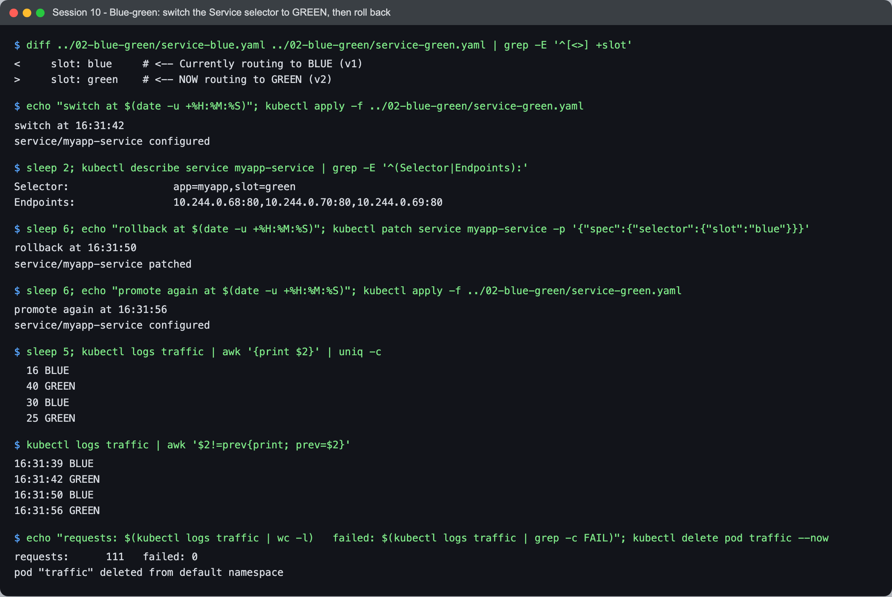

```text
$ diff ../02-blue-green/service-blue.yaml ../02-blue-green/service-green.yaml | grep -E '^[<>] +slot'
<     slot: blue     # <-- Currently routing to BLUE (v1)
>     slot: green    # <-- NOW routing to GREEN (v2)

$ echo "switch at $(date -u +%H:%M:%S)"; kubectl apply -f ../02-blue-green/service-green.yaml
switch at 16:31:42
service/myapp-service configured

$ sleep 2; kubectl describe service myapp-service | grep -E '^(Selector|Endpoints):'
Selector:                 app=myapp,slot=green
Endpoints:                10.244.0.68:80,10.244.0.70:80,10.244.0.69:80

$ sleep 6; echo "rollback at $(date -u +%H:%M:%S)"; kubectl patch service myapp-service -p '{"spec":{"selector":{"slot":"blue"}}}'
rollback at 16:31:50
service/myapp-service patched

$ sleep 6; echo "promote again at $(date -u +%H:%M:%S)"; kubectl apply -f ../02-blue-green/service-green.yaml
promote again at 16:31:56
service/myapp-service configured

$ sleep 5; kubectl logs traffic | awk '{print $2}' | uniq -c
  16 BLUE
  40 GREEN
  30 BLUE
  25 GREEN

$ kubectl logs traffic | awk '$2!=prev{print; prev=$2}'
16:31:39 BLUE
16:31:42 GREEN
16:31:50 BLUE
16:31:56 GREEN

$ echo "requests: $(kubectl logs traffic | wc -l)   failed: $(kubectl logs traffic | grep -c FAIL)"; kubectl delete pod traffic --now
requests:      111   failed: 0
pod "traffic" deleted from default namespace
```

- At 16:31:42 I applied `service-green.yaml`, and the very next request (under 0.2 s later) was
  served by GREEN. There was no mix of versions: the endpoints switched as one set.
- At 16:31:50 I rolled back with a one-line `kubectl patch` of the selector, and traffic was
  BLUE again immediately. Rollback is instant because blue never went away.
- 111 requests, 0 failed, across three switches.

The page as a browser sees it through the Service, before and after the switch:

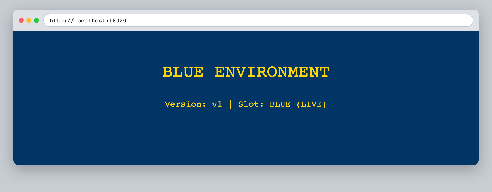
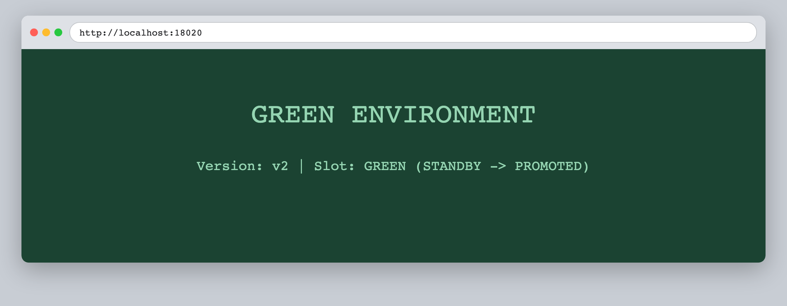

The cost is double the pods during the switch. And because the switch is instant for
everyone, a bug in green hits 100% of users at once, which is the problem canary solves.

## 3. Canary

`app-stable` (9 replicas, v1) and `app-canary` (1 replica, v2) both carry `app: myapp-canary`,
and the Service selects only that label. The traffic split is therefore the **pod ratio**:
1 of 10 endpoints means about 10% of connections.

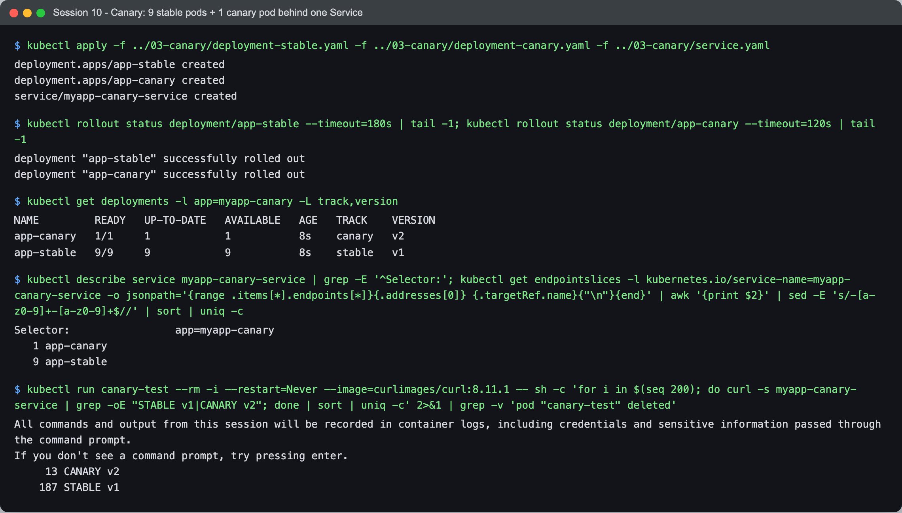

```text
$ kubectl apply -f ../03-canary/deployment-stable.yaml -f ../03-canary/deployment-canary.yaml -f ../03-canary/service.yaml
deployment.apps/app-stable created
deployment.apps/app-canary created
service/myapp-canary-service created

$ kubectl rollout status deployment/app-stable --timeout=180s | tail -1; kubectl rollout status deployment/app-canary --timeout=120s | tail -1
deployment "app-stable" successfully rolled out
deployment "app-canary" successfully rolled out

$ kubectl get deployments -l app=myapp-canary -L track,version
NAME         READY   UP-TO-DATE   AVAILABLE   AGE   TRACK    VERSION
app-canary   1/1     1            1           8s    canary   v2
app-stable   9/9     9            9           8s    stable   v1

$ kubectl describe service myapp-canary-service | grep -E '^Selector:'; kubectl get endpointslices -l kubernetes.io/service-name=myapp-canary-service -o jsonpath='{range .items[*].endpoints[*]}{.addresses[0]} {.targetRef.name}{"\n"}{end}' | awk '{print $2}' | sed -E 's/-[a-z0-9]+-[a-z0-9]+$//' | sort | uniq -c
Selector:                 app=myapp-canary
   1 app-canary
   9 app-stable

$ kubectl run canary-test --rm -i --restart=Never --image=curlimages/curl:8.11.1 -- sh -c 'for i in $(seq 200); do curl -s myapp-canary-service | grep -oE "STABLE v1|CANARY v2"; done | sort | uniq -c' 2>&1 | grep -v 'pod "canary-test" deleted'
All commands and output from this session will be recorded in container logs, including credentials and sensitive information passed through the command prompt.
If you don't see a command prompt, try pressing enter.
     13 CANARY v2
    187 STABLE v1
```

200 requests: **13 hit the canary (6.5%)**, 187 hit stable. That is not exactly 10% because
kube-proxy picks an endpoint at random for each new connection. With 200 tries at p = 0.1 the
expected count is 20, give or take about 4, so 13 is ordinary noise. With replica-based canaries
you get "roughly 10%", not a guaranteed 10%.

Then I shifted to 50/50 and finally promoted the canary to 100%:

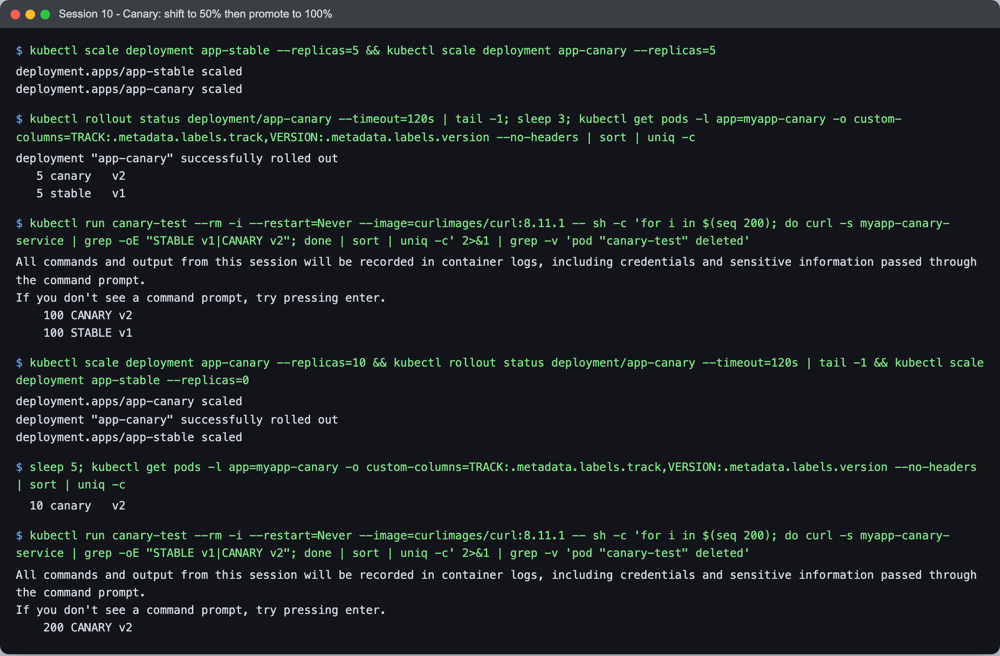

```text
$ kubectl scale deployment app-stable --replicas=5 && kubectl scale deployment app-canary --replicas=5
deployment.apps/app-stable scaled
deployment.apps/app-canary scaled

$ kubectl rollout status deployment/app-canary --timeout=120s | tail -1; sleep 3; kubectl get pods -l app=myapp-canary -o custom-columns=TRACK:.metadata.labels.track,VERSION:.metadata.labels.version --no-headers | sort | uniq -c
deployment "app-canary" successfully rolled out
   5 canary   v2
   5 stable   v1

$ kubectl run canary-test --rm -i --restart=Never --image=curlimages/curl:8.11.1 -- sh -c 'for i in $(seq 200); do curl -s myapp-canary-service | grep -oE "STABLE v1|CANARY v2"; done | sort | uniq -c' 2>&1 | grep -v 'pod "canary-test" deleted'
All commands and output from this session will be recorded in container logs, including credentials and sensitive information passed through the command prompt.
If you don't see a command prompt, try pressing enter.
    100 CANARY v2
    100 STABLE v1

$ kubectl scale deployment app-canary --replicas=10 && kubectl rollout status deployment/app-canary --timeout=120s | tail -1 && kubectl scale deployment app-stable --replicas=0
deployment.apps/app-canary scaled
deployment "app-canary" successfully rolled out
deployment.apps/app-stable scaled

$ sleep 5; kubectl get pods -l app=myapp-canary -o custom-columns=TRACK:.metadata.labels.track,VERSION:.metadata.labels.version --no-headers | sort | uniq -c
  10 canary   v2

$ kubectl run canary-test --rm -i --restart=Never --image=curlimages/curl:8.11.1 -- sh -c 'for i in $(seq 200); do curl -s myapp-canary-service | grep -oE "STABLE v1|CANARY v2"; done | sort | uniq -c' 2>&1 | grep -v 'pod "canary-test" deleted'
All commands and output from this session will be recorded in container logs, including credentials and sensitive information passed through the command prompt.
If you don't see a command prompt, try pressing enter.
    200 CANARY v2
```

- 5 + 5 pods gave exactly 100/100.
- For promotion I scaled the canary to 10 **before** scaling stable to 0, so capacity never
  dropped. Afterwards all 200 requests hit v2.
- Rolling back a canary is the reverse: scale `app-canary` to 0, and only the 10% who were on it
  ever saw the new version.

The limit of this approach is that the percentage is tied to pod counts (10% needs at least
10 pods). Weight-based splitting independent of replicas needs an ingress controller or service
mesh feature (for example nginx canary annotations, Gateway API weights, Argo Rollouts).

## 4. Recreate

`strategy: type: Recreate`, 3 replicas, no readiness probe.

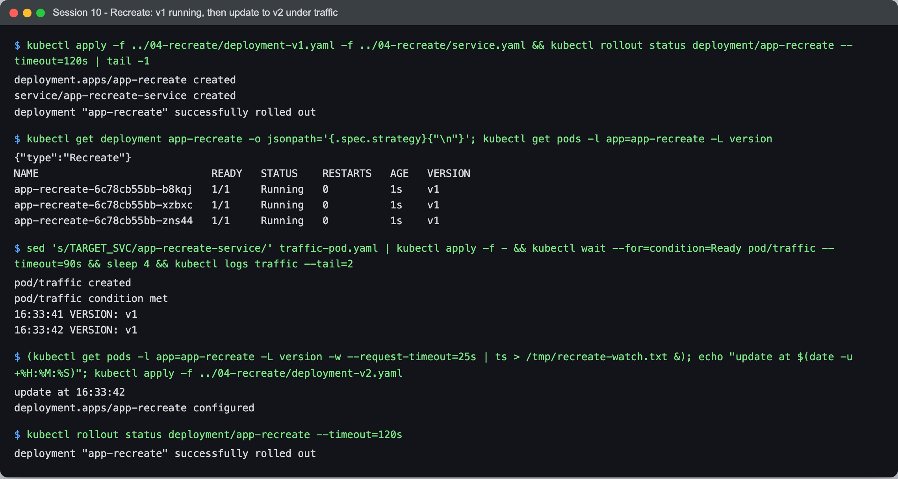

```text
$ kubectl apply -f ../04-recreate/deployment-v1.yaml -f ../04-recreate/service.yaml && kubectl rollout status deployment/app-recreate --timeout=120s | tail -1
deployment.apps/app-recreate created
service/app-recreate-service created
deployment "app-recreate" successfully rolled out

$ kubectl get deployment app-recreate -o jsonpath='{.spec.strategy}{"\n"}'; kubectl get pods -l app=app-recreate -L version
{"type":"Recreate"}
NAME                            READY   STATUS    RESTARTS   AGE   VERSION
app-recreate-6c78cb55bb-b8kqj   1/1     Running   0          1s    v1
app-recreate-6c78cb55bb-xzbxc   1/1     Running   0          1s    v1
app-recreate-6c78cb55bb-zns44   1/1     Running   0          1s    v1

$ sed 's/TARGET_SVC/app-recreate-service/' traffic-pod.yaml | kubectl apply -f - && kubectl wait --for=condition=Ready pod/traffic --timeout=90s && sleep 4 && kubectl logs traffic --tail=2
pod/traffic created
pod/traffic condition met
16:33:41 VERSION: v1
16:33:42 VERSION: v1

$ (kubectl get pods -l app=app-recreate -L version -w --request-timeout=25s | ts > /tmp/recreate-watch.txt &); echo "update at $(date -u +%H:%M:%S)"; kubectl apply -f ../04-recreate/deployment-v2.yaml
update at 16:33:42
deployment.apps/app-recreate configured

$ kubectl rollout status deployment/app-recreate --timeout=120s
deployment "app-recreate" successfully rolled out
```

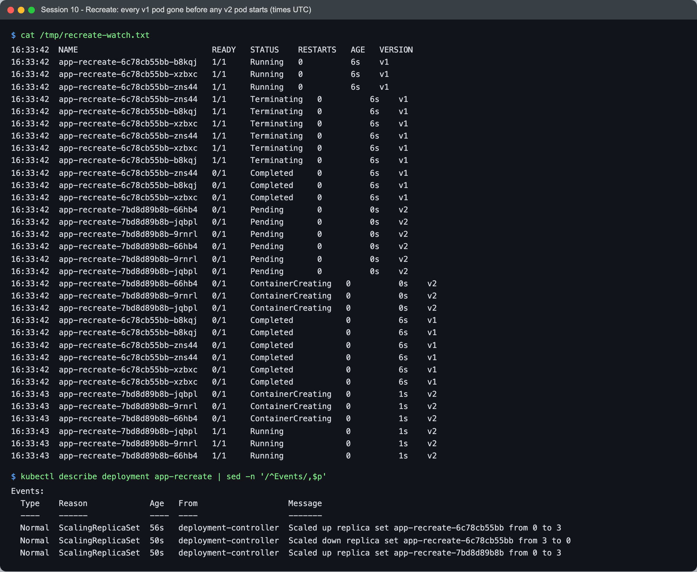

```text
$ cat /tmp/recreate-watch.txt
16:33:42  NAME                            READY   STATUS    RESTARTS   AGE   VERSION
16:33:42  app-recreate-6c78cb55bb-b8kqj   1/1     Running   0          6s    v1
16:33:42  app-recreate-6c78cb55bb-xzbxc   1/1     Running   0          6s    v1
16:33:42  app-recreate-6c78cb55bb-zns44   1/1     Running   0          6s    v1
16:33:42  app-recreate-6c78cb55bb-zns44   1/1     Terminating   0          6s    v1
16:33:42  app-recreate-6c78cb55bb-b8kqj   1/1     Terminating   0          6s    v1
16:33:42  app-recreate-6c78cb55bb-xzbxc   1/1     Terminating   0          6s    v1
16:33:42  app-recreate-6c78cb55bb-zns44   1/1     Terminating   0          6s    v1
16:33:42  app-recreate-6c78cb55bb-xzbxc   1/1     Terminating   0          6s    v1
16:33:42  app-recreate-6c78cb55bb-b8kqj   1/1     Terminating   0          6s    v1
16:33:42  app-recreate-6c78cb55bb-zns44   0/1     Completed     0          6s    v1
16:33:42  app-recreate-6c78cb55bb-b8kqj   0/1     Completed     0          6s    v1
16:33:42  app-recreate-6c78cb55bb-xzbxc   0/1     Completed     0          6s    v1
16:33:42  app-recreate-7bd8d89b8b-66hb4   0/1     Pending       0          0s    v2
16:33:42  app-recreate-7bd8d89b8b-jqbpl   0/1     Pending       0          0s    v2
16:33:42  app-recreate-7bd8d89b8b-9rnrl   0/1     Pending       0          0s    v2
16:33:42  app-recreate-7bd8d89b8b-66hb4   0/1     Pending       0          0s    v2
16:33:42  app-recreate-7bd8d89b8b-9rnrl   0/1     Pending       0          0s    v2
16:33:42  app-recreate-7bd8d89b8b-jqbpl   0/1     Pending       0          0s    v2
16:33:42  app-recreate-7bd8d89b8b-66hb4   0/1     ContainerCreating   0          0s    v2
16:33:42  app-recreate-7bd8d89b8b-9rnrl   0/1     ContainerCreating   0          0s    v2
16:33:42  app-recreate-7bd8d89b8b-jqbpl   0/1     ContainerCreating   0          0s    v2
16:33:42  app-recreate-6c78cb55bb-b8kqj   0/1     Completed           0          6s    v1
16:33:42  app-recreate-6c78cb55bb-b8kqj   0/1     Completed           0          6s    v1
16:33:42  app-recreate-6c78cb55bb-zns44   0/1     Completed           0          6s    v1
16:33:42  app-recreate-6c78cb55bb-zns44   0/1     Completed           0          6s    v1
16:33:42  app-recreate-6c78cb55bb-xzbxc   0/1     Completed           0          6s    v1
16:33:42  app-recreate-6c78cb55bb-xzbxc   0/1     Completed           0          6s    v1
16:33:43  app-recreate-7bd8d89b8b-jqbpl   0/1     ContainerCreating   0          1s    v2
16:33:43  app-recreate-7bd8d89b8b-9rnrl   0/1     ContainerCreating   0          1s    v2
16:33:43  app-recreate-7bd8d89b8b-66hb4   0/1     ContainerCreating   0          1s    v2
16:33:43  app-recreate-7bd8d89b8b-jqbpl   1/1     Running             0          1s    v2
16:33:43  app-recreate-7bd8d89b8b-9rnrl   1/1     Running             0          1s    v2
16:33:43  app-recreate-7bd8d89b8b-66hb4   1/1     Running             0          1s    v2

$ kubectl describe deployment app-recreate | sed -n '/^Events/,$p'
Events:
  Type    Reason             Age   From                   Message
  ----    ------             ----  ----                   -------
  Normal  ScalingReplicaSet  56s   deployment-controller  Scaled up replica set app-recreate-6c78cb55bb from 0 to 3
  Normal  ScalingReplicaSet  50s   deployment-controller  Scaled down replica set app-recreate-6c78cb55bb from 3 to 0
  Normal  ScalingReplicaSet  50s   deployment-controller  Scaled up replica set app-recreate-7bd8d89b8b from 0 to 3
```

This is the opposite of the rolling update: the controller scaled the old ReplicaSet **3 to 0**
first, all three v1 pods went `Terminating` and `Completed`, and only then was the new
ReplicaSet scaled **0 to 3**. Two versions never ran at the same time.

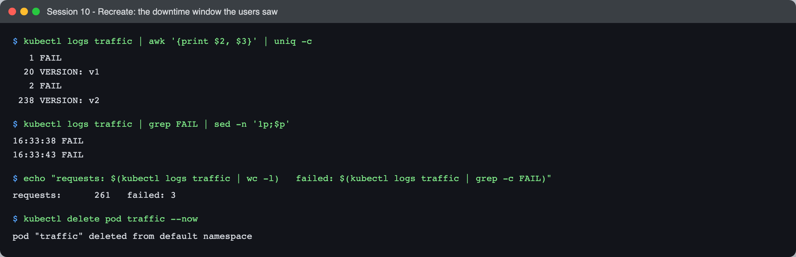

```text
$ kubectl logs traffic | awk '{print $2, $3}' | uniq -c
   1 FAIL 
  20 VERSION: v1
   2 FAIL 
 238 VERSION: v2

$ kubectl logs traffic | grep FAIL | sed -n '1p;$p'
16:33:38 FAIL
16:33:43 FAIL

$ echo "requests: $(kubectl logs traffic | wc -l)   failed: $(kubectl logs traffic | grep -c FAIL)"
requests:      261   failed: 3

$ kubectl delete pod traffic --now
pod "traffic" deleted from default namespace
```

Users saw a gap: v1 answers, then 2 consecutive FAILs at 16:33:43, then v2. The outage was only
about a second here because nginx starts instantly and the image was already cached. With an
app that takes 30 seconds to start, or an image that has to be pulled, the outage is that long.
(The FAIL at 16:33:38 is the traffic pod's own first request, before the update; see Problems
I hit.) Recreate is the right choice when two versions must never run together, for example a
schema migration the old version cannot handle, or a volume that only one pod can mount.

## Strategy comparison (from what I measured)

| Strategy | Mechanism | Versions at once | Failed requests I saw | Extra capacity | Rollback |
|---|---|---|---|---|---|
| Rolling update | Deployment replaces pods 1 by 1 | both, mixed | 4 of 494 without preStop, 0 of 184 with it | +1 pod (maxSurge) | `rollout undo`, gradual |
| Blue-green | flip Service selector | one, switched atomically | 0 of 111 | 2x pods | instant (flip back) |
| Canary | pod ratio behind one Service | both, by ratio | 0 | a few pods | scale canary to 0 |
| Recreate | kill all, then start all | never | 2 of 261 during the update (an outage window) | none | redeploy old version (another outage) |

---

# Task 2 - Pod lifecycle

Cleanup between scenarios was `kubectl delete pod <name> --now`. A pod's **phase**
(`Pending`, `Running`, `Succeeded`, `Failed`, `Unknown`) is coarse. The `STATUS` column in
`kubectl get` is usually a more specific container **reason** (`ContainerCreating`,
`CrashLoopBackOff`, `ImagePullBackOff`, `Completed`, `Error`). Keeping those two apart explained
most of what follows.

### 01 - Running

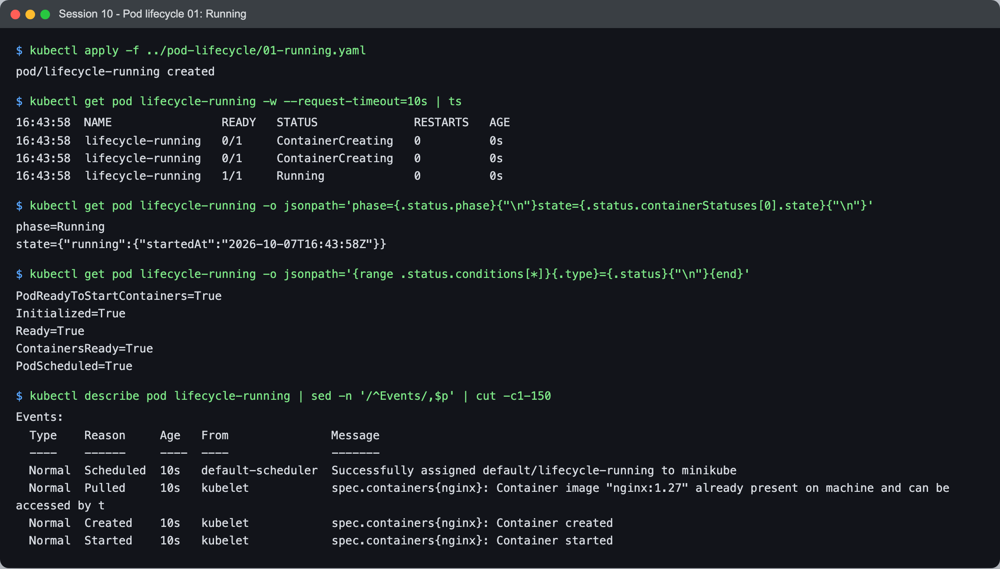

```text
$ kubectl apply -f ../pod-lifecycle/01-running.yaml
pod/lifecycle-running created

$ kubectl get pod lifecycle-running -w --request-timeout=10s | ts
16:43:58  NAME                READY   STATUS              RESTARTS   AGE
16:43:58  lifecycle-running   0/1     ContainerCreating   0          0s
16:43:58  lifecycle-running   0/1     ContainerCreating   0          0s
16:43:58  lifecycle-running   1/1     Running             0          0s

$ kubectl get pod lifecycle-running -o jsonpath='phase={.status.phase}{"\n"}state={.status.containerStatuses[0].state}{"\n"}'
phase=Running
state={"running":{"startedAt":"2026-10-07T16:43:58Z"}}

$ kubectl get pod lifecycle-running -o jsonpath='{range .status.conditions[*]}{.type}={.status}{"\n"}{end}'
PodReadyToStartContainers=True
Initialized=True
Ready=True
ContainersReady=True
PodScheduled=True

$ kubectl describe pod lifecycle-running | sed -n '/^Events/,$p' | cut -c1-150
Events:
  Type    Reason     Age   From               Message
  ----    ------     ----  ----               -------
  Normal  Scheduled  10s   default-scheduler  Successfully assigned default/lifecycle-running to minikube
  Normal  Pulled     10s   kubelet            spec.containers{nginx}: Container image "nginx:1.27" already present on machine and can be accessed by t
  Normal  Created    10s   kubelet            spec.containers{nginx}: Container created
  Normal  Started    10s   kubelet            spec.containers{nginx}: Container started
```

Scheduled, image already cached, `Running` and `1/1` within a second. The conditions show the
checkpoints a pod passes: `PodScheduled`, then `PodReadyToStartContainers` (sandbox and network
ready), `Initialized` (init containers done, none here), `ContainersReady` and `Ready`. No probe
is defined, so the container counts as ready as soon as it starts. (In my first capture of this
one, the 8 s watch ended while `nginx:1.27` was still being pulled, so it only showed
`ContainerCreating`. I re-ran it once the image was cached.)

### 02 - Pending

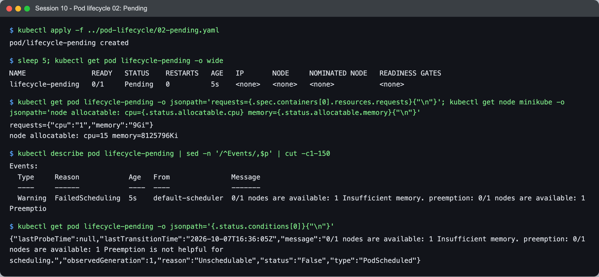

```text
$ kubectl apply -f ../pod-lifecycle/02-pending.yaml
pod/lifecycle-pending created

$ sleep 5; kubectl get pod lifecycle-pending -o wide
NAME                READY   STATUS    RESTARTS   AGE   IP       NODE     NOMINATED NODE   READINESS GATES
lifecycle-pending   0/1     Pending   0          5s    <none>   <none>   <none>           <none>

$ kubectl get pod lifecycle-pending -o jsonpath='requests={.spec.containers[0].resources.requests}{"\n"}'; kubectl get node minikube -o jsonpath='node allocatable: cpu={.status.allocatable.cpu} memory={.status.allocatable.memory}{"\n"}'
requests={"cpu":"1","memory":"9Gi"}
node allocatable: cpu=15 memory=8125796Ki

$ kubectl describe pod lifecycle-pending | sed -n '/^Events/,$p' | cut -c1-150
Events:
  Type     Reason            Age   From               Message
  ----     ------            ----  ----               -------
  Warning  FailedScheduling  5s    default-scheduler  0/1 nodes are available: 1 Insufficient memory. preemption: 0/1 nodes are available: 1 Preemptio

$ kubectl get pod lifecycle-pending -o jsonpath='{.status.conditions[0]}{"\n"}'
{"lastProbeTime":null,"lastTransitionTime":"2026-10-07T16:36:05Z","message":"0/1 nodes are available: 1 Insufficient memory. preemption: 0/1 nodes are available: 1 Preemption is not helpful for scheduling.","observedGeneration":1,"reason":"Unschedulable","status":"False","type":"PodScheduled"}
```

The pod asks for `memory: 9Gi`. The node can allocate about 7.75 GiB (`8125796Ki`), so the
scheduler finds no node: `0/1 nodes are available: 1 Insufficient memory`. `NODE` is `<none>`
and no container is ever created, so there are no logs to read; the event is the only
evidence. The scheduler compares **requests** against allocatable, not actual usage, so even
an idle 9Gi request can never fit. The fix is lowering the request or adding a bigger node.

### 03 - Succeeded

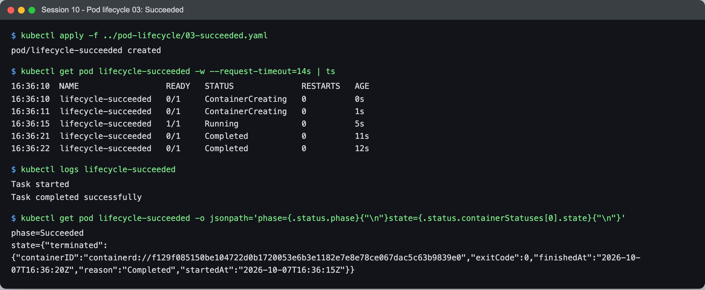

```text
$ kubectl apply -f ../pod-lifecycle/03-succeeded.yaml
pod/lifecycle-succeeded created

$ kubectl get pod lifecycle-succeeded -w --request-timeout=14s | ts
16:36:10  NAME                  READY   STATUS              RESTARTS   AGE
16:36:10  lifecycle-succeeded   0/1     ContainerCreating   0          0s
16:36:11  lifecycle-succeeded   0/1     ContainerCreating   0          1s
16:36:15  lifecycle-succeeded   1/1     Running             0          5s
16:36:21  lifecycle-succeeded   0/1     Completed           0          11s
16:36:22  lifecycle-succeeded   0/1     Completed           0          12s

$ kubectl logs lifecycle-succeeded
Task started
Task completed successfully

$ kubectl get pod lifecycle-succeeded -o jsonpath='phase={.status.phase}{"\n"}state={.status.containerStatuses[0].state}{"\n"}'
phase=Succeeded
state={"terminated":{"containerID":"containerd://f129f085150be104722d0b1720053e6b3e1182e7e8e78ce067dac5c63b9839e0","exitCode":0,"finishedAt":"2026-10-07T16:36:20Z","reason":"Completed","startedAt":"2026-10-07T16:36:15Z"}}
```

`ContainerCreating`, then `Running`, then `Completed` after the 5 s sleep. Phase `Succeeded`,
`exitCode: 0`. With `restartPolicy: Never` the kubelet leaves the pod finished instead of
restarting it. That is the shape of a Job.

### 04 - Failed

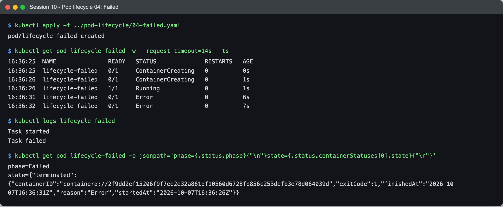

```text
$ kubectl apply -f ../pod-lifecycle/04-failed.yaml
pod/lifecycle-failed created

$ kubectl get pod lifecycle-failed -w --request-timeout=14s | ts
16:36:25  NAME               READY   STATUS              RESTARTS   AGE
16:36:25  lifecycle-failed   0/1     ContainerCreating   0          0s
16:36:26  lifecycle-failed   0/1     ContainerCreating   0          1s
16:36:26  lifecycle-failed   1/1     Running             0          1s
16:36:31  lifecycle-failed   0/1     Error               0          6s
16:36:32  lifecycle-failed   0/1     Error               0          7s

$ kubectl logs lifecycle-failed
Task started
Task failed

$ kubectl get pod lifecycle-failed -o jsonpath='phase={.status.phase}{"\n"}state={.status.containerStatuses[0].state}{"\n"}'
phase=Failed
state={"terminated":{"containerID":"containerd://2f9dd2ef15206f9f7ee2e32a861df10560d6728fb856c253defb3e78d064039d","exitCode":1,"finishedAt":"2026-10-07T16:36:31Z","reason":"Error","startedAt":"2026-10-07T16:36:26Z"}}
```

Identical except for `exit 1`: STATUS `Error`, phase `Failed`, `exitCode: 1`. Kubernetes judges
success purely by the exit code, so the logs saying "Task failed" do not matter; the exit code
does.

### 05 - CrashLoopBackOff

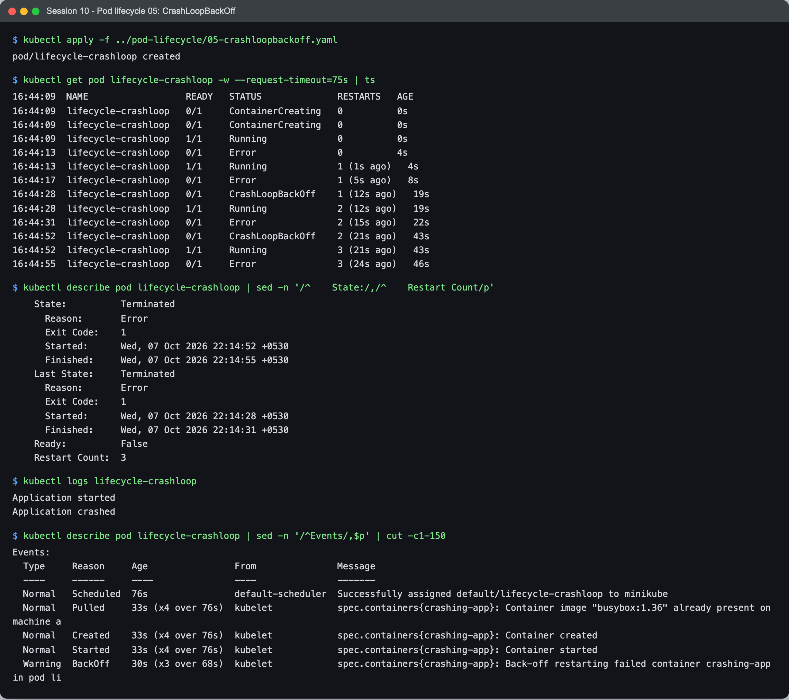

```text
$ kubectl apply -f ../pod-lifecycle/05-crashloopbackoff.yaml
pod/lifecycle-crashloop created

$ kubectl get pod lifecycle-crashloop -w --request-timeout=75s | ts
16:44:09  NAME                  READY   STATUS              RESTARTS   AGE
16:44:09  lifecycle-crashloop   0/1     ContainerCreating   0          0s
16:44:09  lifecycle-crashloop   0/1     ContainerCreating   0          0s
16:44:09  lifecycle-crashloop   1/1     Running             0          0s
16:44:13  lifecycle-crashloop   0/1     Error               0          4s
16:44:13  lifecycle-crashloop   1/1     Running             1 (1s ago)   4s
16:44:17  lifecycle-crashloop   0/1     Error               1 (5s ago)   8s
16:44:28  lifecycle-crashloop   0/1     CrashLoopBackOff    1 (12s ago)   19s
16:44:28  lifecycle-crashloop   1/1     Running             2 (12s ago)   19s
16:44:31  lifecycle-crashloop   0/1     Error               2 (15s ago)   22s
16:44:52  lifecycle-crashloop   0/1     CrashLoopBackOff    2 (21s ago)   43s
16:44:52  lifecycle-crashloop   1/1     Running             3 (21s ago)   43s
16:44:55  lifecycle-crashloop   0/1     Error               3 (24s ago)   46s

$ kubectl describe pod lifecycle-crashloop | sed -n '/^    State:/,/^    Restart Count/p'
    State:          Terminated
      Reason:       Error
      Exit Code:    1
      Started:      Wed, 07 Oct 2026 22:14:52 +0530
      Finished:     Wed, 07 Oct 2026 22:14:55 +0530
    Last State:     Terminated
      Reason:       Error
      Exit Code:    1
      Started:      Wed, 07 Oct 2026 22:14:28 +0530
      Finished:     Wed, 07 Oct 2026 22:14:31 +0530
    Ready:          False
    Restart Count:  3

$ kubectl logs lifecycle-crashloop
Application started
Application crashed

$ kubectl describe pod lifecycle-crashloop | sed -n '/^Events/,$p' | cut -c1-150
Events:
  Type     Reason     Age                From               Message
  ----     ------     ----               ----               -------
  Normal   Scheduled  76s                default-scheduler  Successfully assigned default/lifecycle-crashloop to minikube
  Normal   Pulled     33s (x4 over 76s)  kubelet            spec.containers{crashing-app}: Container image "busybox:1.36" already present on machine a
  Normal   Created    33s (x4 over 76s)  kubelet            spec.containers{crashing-app}: Container created
  Normal   Started    33s (x4 over 76s)  kubelet            spec.containers{crashing-app}: Container started
  Warning  BackOff    30s (x3 over 68s)  kubelet            spec.containers{crashing-app}: Back-off restarting failed container crashing-app in pod li
```

This pod has the default `restartPolicy: Always`, so every exit is followed by a restart, with
a growing delay in between. The timestamps show the back-off doubling: about 10 s of
`CrashLoopBackOff` before restart 2, about 25 s before restart 3, and so on up to a cap of 5
minutes. `CrashLoopBackOff` is not a phase (the phase is still `Running`); it is the kubelet
waiting before the next restart. `Last State: Terminated, Exit Code: 1` and the logs explain why
it crashes.

### 06 - ImagePullBackOff

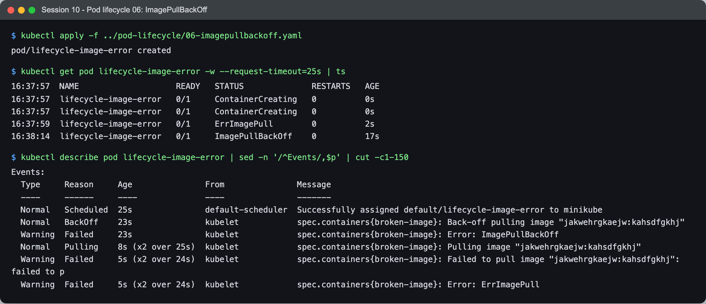

```text
$ kubectl apply -f ../pod-lifecycle/06-imagepullbackoff.yaml
pod/lifecycle-image-error created

$ kubectl get pod lifecycle-image-error -w --request-timeout=25s | ts
16:37:57  NAME                    READY   STATUS              RESTARTS   AGE
16:37:57  lifecycle-image-error   0/1     ContainerCreating   0          0s
16:37:57  lifecycle-image-error   0/1     ContainerCreating   0          0s
16:37:59  lifecycle-image-error   0/1     ErrImagePull        0          2s
16:38:14  lifecycle-image-error   0/1     ImagePullBackOff    0          17s

$ kubectl describe pod lifecycle-image-error | sed -n '/^Events/,$p' | cut -c1-150
Events:
  Type     Reason     Age               From               Message
  ----     ------     ----              ----               -------
  Normal   Scheduled  25s               default-scheduler  Successfully assigned default/lifecycle-image-error to minikube
  Normal   BackOff    23s               kubelet            spec.containers{broken-image}: Back-off pulling image "jakwehrgkaejw:kahsdfgkhj"
  Warning  Failed     23s               kubelet            spec.containers{broken-image}: Error: ImagePullBackOff
  Normal   Pulling    8s (x2 over 25s)  kubelet            spec.containers{broken-image}: Pulling image "jakwehrgkaejw:kahsdfgkhj"
  Warning  Failed     5s (x2 over 24s)  kubelet            spec.containers{broken-image}: Failed to pull image "jakwehrgkaejw:kahsdfgkhj": failed to p
  Warning  Failed     5s (x2 over 24s)  kubelet            spec.containers{broken-image}: Error: ErrImagePull
```

`ErrImagePull` is the failed attempt itself; `ImagePullBackOff` is the kubelet waiting before
the next attempt (the `x2` counters). The pod never leaves `Pending` because no container has
been created. The full event message (cut in the screenshot) says the repository does not
exist or needs authorization. A typo, a private image without `imagePullSecrets`, or a
missing tag all look the same here, so the message is what tells them apart.

### 07 - Readiness probe

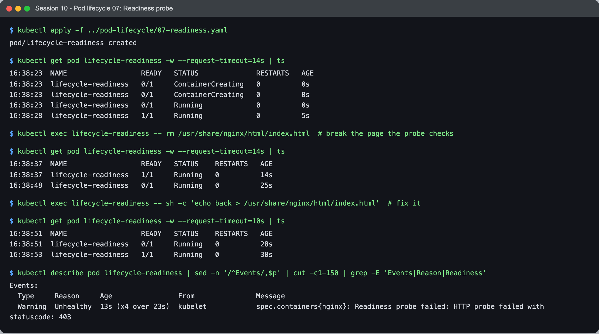

```text
$ kubectl apply -f ../pod-lifecycle/07-readiness.yaml
pod/lifecycle-readiness created

$ kubectl get pod lifecycle-readiness -w --request-timeout=14s | ts
16:38:23  NAME                  READY   STATUS              RESTARTS   AGE
16:38:23  lifecycle-readiness   0/1     ContainerCreating   0          0s
16:38:23  lifecycle-readiness   0/1     ContainerCreating   0          0s
16:38:23  lifecycle-readiness   0/1     Running             0          0s
16:38:28  lifecycle-readiness   1/1     Running             0          5s

$ kubectl exec lifecycle-readiness -- rm /usr/share/nginx/html/index.html  # break the page the probe checks

$ kubectl get pod lifecycle-readiness -w --request-timeout=14s | ts
16:38:37  NAME                  READY   STATUS    RESTARTS   AGE
16:38:37  lifecycle-readiness   1/1     Running   0          14s
16:38:48  lifecycle-readiness   0/1     Running   0          25s

$ kubectl exec lifecycle-readiness -- sh -c 'echo back > /usr/share/nginx/html/index.html'  # fix it

$ kubectl get pod lifecycle-readiness -w --request-timeout=10s | ts
16:38:51  NAME                  READY   STATUS    RESTARTS   AGE
16:38:51  lifecycle-readiness   0/1     Running   0          28s
16:38:53  lifecycle-readiness   1/1     Running   0          30s

$ kubectl describe pod lifecycle-readiness | sed -n '/^Events/,$p' | cut -c1-150 | grep -E 'Events|Reason|Readiness'
Events:
  Type     Reason     Age                From               Message
  Warning  Unhealthy  13s (x4 over 23s)  kubelet            spec.containers{nginx}: Readiness probe failed: HTTP probe failed with statuscode: 403
```

- Started `Running 0/1`, became `1/1` 5 s later when the first HTTP probe passed
  (`initialDelaySeconds: 5`).
- I deleted `index.html`, so `GET /` returned 403. After 3 failed probes (default
  `failureThreshold: 3`, every 5 s) the pod went back to `0/1`, but **RESTARTS stayed 0**. A
  failing readiness probe only takes the pod out of Service endpoints; it never restarts it.
- I put the file back and it was `1/1` again within one probe period.

### 08 - Liveness probe

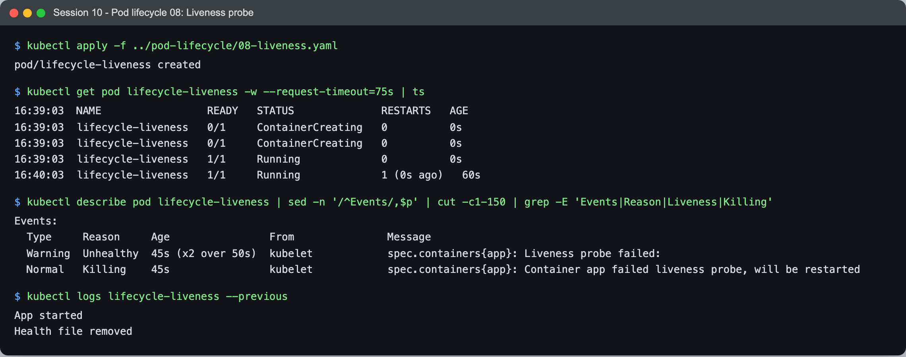

```text
$ kubectl apply -f ../pod-lifecycle/08-liveness.yaml
pod/lifecycle-liveness created

$ kubectl get pod lifecycle-liveness -w --request-timeout=75s | ts
16:39:03  NAME                 READY   STATUS              RESTARTS   AGE
16:39:03  lifecycle-liveness   0/1     ContainerCreating   0          0s
16:39:03  lifecycle-liveness   0/1     ContainerCreating   0          0s
16:39:03  lifecycle-liveness   1/1     Running             0          0s
16:40:03  lifecycle-liveness   1/1     Running             1 (0s ago)   60s

$ kubectl describe pod lifecycle-liveness | sed -n '/^Events/,$p' | cut -c1-150 | grep -E 'Events|Reason|Liveness|Killing'
Events:
  Type     Reason     Age                From               Message
  Warning  Unhealthy  45s (x2 over 50s)  kubelet            spec.containers{app}: Liveness probe failed:
  Normal   Killing    45s                kubelet            spec.containers{app}: Container app failed liveness probe, will be restarted

$ kubectl logs lifecycle-liveness --previous
App started
Health file removed
```

The app deletes `/tmp/healthy` after 20 s. The probe failed twice (`failureThreshold: 2`, every
5 s), and the kubelet logged `Container app failed liveness probe, will be restarted` about 30 s
after start. The opposite of readiness: liveness **restarts** the container. `logs --previous`
shows the old container's last words.

But the restart only appears at 16:40:03, a full **60 s** after start, not around 30 s. The
container's PID 1 is `sh`, and a shell running as PID 1 ignores SIGTERM unless it installs a
trap. So the kubelet sent SIGTERM, waited the whole default `terminationGracePeriodSeconds: 30`,
then SIGKILLed it. Compare scenario 12, where a `trap` makes shutdown fast and clean.

### 09 - Startup probe

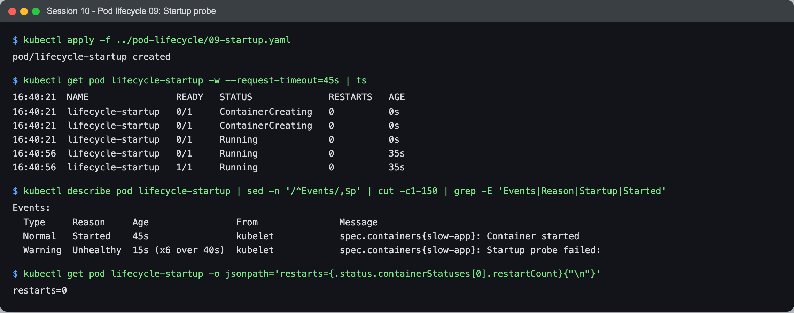

```text
$ kubectl apply -f ../pod-lifecycle/09-startup.yaml
pod/lifecycle-startup created

$ kubectl get pod lifecycle-startup -w --request-timeout=45s | ts
16:40:21  NAME                READY   STATUS              RESTARTS   AGE
16:40:21  lifecycle-startup   0/1     ContainerCreating   0          0s
16:40:21  lifecycle-startup   0/1     ContainerCreating   0          0s
16:40:21  lifecycle-startup   0/1     Running             0          0s
16:40:56  lifecycle-startup   0/1     Running             0          35s
16:40:56  lifecycle-startup   1/1     Running             0          35s

$ kubectl describe pod lifecycle-startup | sed -n '/^Events/,$p' | cut -c1-150 | grep -E 'Events|Reason|Startup|Started'
Events:
  Type     Reason     Age                From               Message
  Normal   Started    45s                kubelet            spec.containers{slow-app}: Container started
  Warning  Unhealthy  15s (x6 over 40s)  kubelet            spec.containers{slow-app}: Startup probe failed:

$ kubectl get pod lifecycle-startup -o jsonpath='restarts={.status.containerStatuses[0].restartCount}{"\n"}'
restarts=0
```

The app needs 30 s before it creates `/tmp/started`. The startup probe allows `10 x 5 s = 50 s`.
For 35 s the pod was `Running 0/1` with 6 `Startup probe failed` events, then it passed and the
pod went `1/1`, with **0 restarts**. While a startup probe is running, liveness and readiness
probes are switched off, which protects slow starters from being killed by a liveness probe
tuned for the steady state.

### 10 - Init container

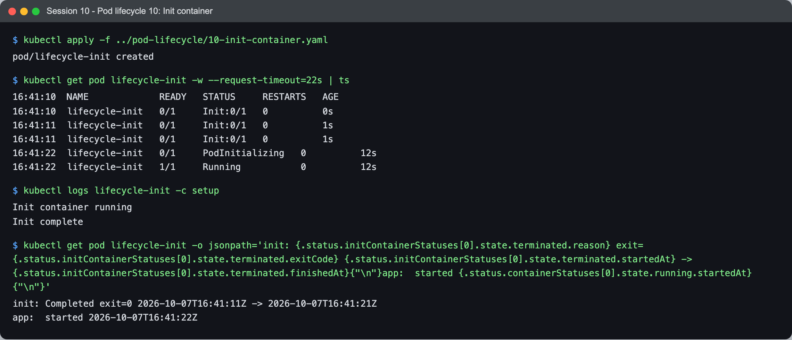

```text
$ kubectl apply -f ../pod-lifecycle/10-init-container.yaml
pod/lifecycle-init created

$ kubectl get pod lifecycle-init -w --request-timeout=22s | ts
16:41:10  NAME             READY   STATUS     RESTARTS   AGE
16:41:10  lifecycle-init   0/1     Init:0/1   0          0s
16:41:11  lifecycle-init   0/1     Init:0/1   0          1s
16:41:11  lifecycle-init   0/1     Init:0/1   0          1s
16:41:22  lifecycle-init   0/1     PodInitializing   0          12s
16:41:22  lifecycle-init   1/1     Running           0          12s

$ kubectl logs lifecycle-init -c setup
Init container running
Init complete

$ kubectl get pod lifecycle-init -o jsonpath='init: {.status.initContainerStatuses[0].state.terminated.reason} exit={.status.initContainerStatuses[0].state.terminated.exitCode} {.status.initContainerStatuses[0].state.terminated.startedAt} -> {.status.initContainerStatuses[0].state.terminated.finishedAt}{"\n"}app:  started {.status.containerStatuses[0].state.running.startedAt}{"\n"}'
init: Completed exit=0 2026-10-07T16:41:11Z -> 2026-10-07T16:41:21Z
app:  started 2026-10-07T16:41:22Z
```

`Init:0/1` for 11 s, then `PodInitializing`, then `Running`. The timestamps prove the ordering:
the init container ran from 16:41:11 to 16:41:21 and exited 0, and the main container started at
16:41:22. If the init container failed, the app container would never start. That is useful
for "wait for the database" or "download config" steps.

### 11 - Multi-container pod

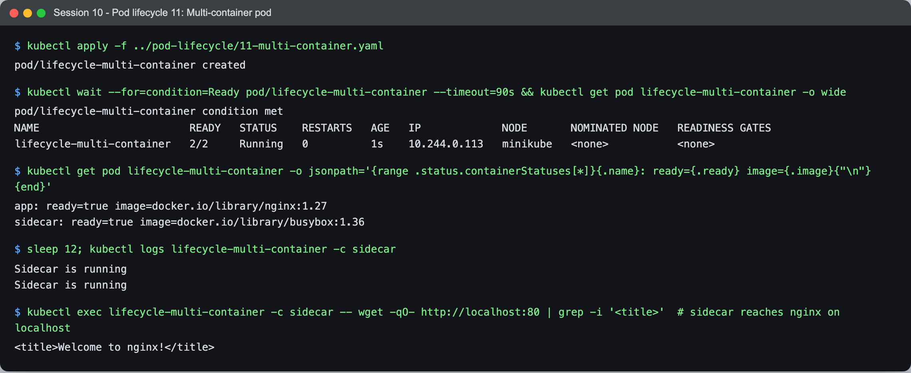

```text
$ kubectl apply -f ../pod-lifecycle/11-multi-container.yaml
pod/lifecycle-multi-container created

$ kubectl wait --for=condition=Ready pod/lifecycle-multi-container --timeout=90s && kubectl get pod lifecycle-multi-container -o wide
pod/lifecycle-multi-container condition met
NAME                        READY   STATUS    RESTARTS   AGE   IP             NODE       NOMINATED NODE   READINESS GATES
lifecycle-multi-container   2/2     Running   0          1s    10.244.0.113   minikube   <none>           <none>

$ kubectl get pod lifecycle-multi-container -o jsonpath='{range .status.containerStatuses[*]}{.name}: ready={.ready} image={.image}{"\n"}{end}'
app: ready=true image=docker.io/library/nginx:1.27
sidecar: ready=true image=docker.io/library/busybox:1.36

$ sleep 12; kubectl logs lifecycle-multi-container -c sidecar
Sidecar is running
Sidecar is running

$ kubectl exec lifecycle-multi-container -c sidecar -- wget -qO- http://localhost:80 | grep -i '<title>'  # sidecar reaches nginx on localhost
<title>Welcome to nginx!</title>
```

`2/2`: two containers, one pod, one IP (`10.244.0.113`). Running `wget localhost:80` **from the
busybox sidecar** returned nginx's page, because all containers in a pod share one network
namespace. That is why sidecars (log shippers, proxies) can talk to the app over `localhost`.
Each container still has its own logs (`-c sidecar`), image and restart counter.

### 12 - Graceful termination

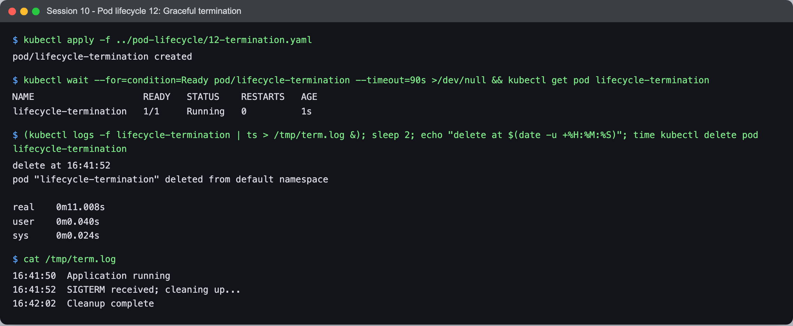

```text
$ kubectl apply -f ../pod-lifecycle/12-termination.yaml
pod/lifecycle-termination created

$ kubectl wait --for=condition=Ready pod/lifecycle-termination --timeout=90s >/dev/null && kubectl get pod lifecycle-termination
NAME                    READY   STATUS    RESTARTS   AGE
lifecycle-termination   1/1     Running   0          1s

$ (kubectl logs -f lifecycle-termination | ts > /tmp/term.log &); sleep 2; echo "delete at $(date -u +%H:%M:%S)"; time kubectl delete pod lifecycle-termination
delete at 16:41:52
pod "lifecycle-termination" deleted from default namespace

real	0m11.008s
user	0m0.040s
sys	0m0.024s

$ cat /tmp/term.log
16:41:50  Application running
16:41:52  SIGTERM received; cleaning up...
16:42:02  Cleanup complete
```

The app installs `trap ... TERM`. On `kubectl delete`, the kubelet sent SIGTERM at 16:41:52.
The trap logged `SIGTERM received; cleaning up...`, did 10 s of "cleanup", logged
`Cleanup complete` at 16:42:02 and exited 0. The delete returned after 11 s, inside the 20 s
`terminationGracePeriodSeconds`, so no SIGKILL was needed. This is the well-behaved version of
what went wrong in scenario 08 and in the Session 9 bootcamp pods.

---

## What I learned

- A Deployment strategy is only as good as the pods' probes and shutdown behaviour. I measured
  dropped requests in a "zero downtime" rolling update and removed them with a 5 s `preStop`
  hook.
- Blue-green and canary are not Kubernetes features. They are just label selectors and replica
  counts: blue-green flips the selector, canary mixes pods under one selector.
- Phase and status are different things. `CrashLoopBackOff` and `ImagePullBackOff` are kubelet
  back-off states, not phases, and events plus exit codes tell you the actual cause.
- Readiness removes a pod from traffic, liveness restarts it, and startup protects slow
  starters from both.
- PID 1 matters: a shell as PID 1 ignores SIGTERM, so every stop takes the full grace period.

## Problems I hit

- **Dropped requests during the rolling update** - covered above. The fix was a preStop hook.
- **My traffic pod's very first request sometimes failed.** In 3 of my 7 runs, the first line
  the traffic generator logged was `FAIL`, before any change had been made (for example
  16:33:38 in the Recreate run, and two lines at 16:30:39 in my first blue-green run). I tried
  to reproduce it with fresh probe pods measuring DNS time (`curl -w %{time_namelookup}`); they
  resolved in 0.4 to 3.5 ms and never failed, so I could not pin it down. It only ever affected
  the first request of a brand-new pod, so I treated the first line as warm-up and based every
  conclusion on what happened after the change started. I re-ran blue-green to get a clean log.
- **Wrong column headers.** My first blue-green capture used `awk` to pick columns out of
  `kubectl get -o wide`, and the header row ended up labelling my slot and version columns as
  `READINESS GATES`. I switched to `-o custom-columns`, which names its own columns.
- **Two time zones in one comparison.** My first rolling-update run timestamped the pod watch
  in local time (IST) while the traffic pod logged UTC, so lining them up meant adding 5:30 in
  my head. I made `ts` print UTC and re-ran it.
- **`kubectl logs --previous` failed** on the crash-looping pod (`unable to retrieve container
  logs`) when the current container had already exited. Plain `kubectl logs` shows the last
  terminated container in that state.
