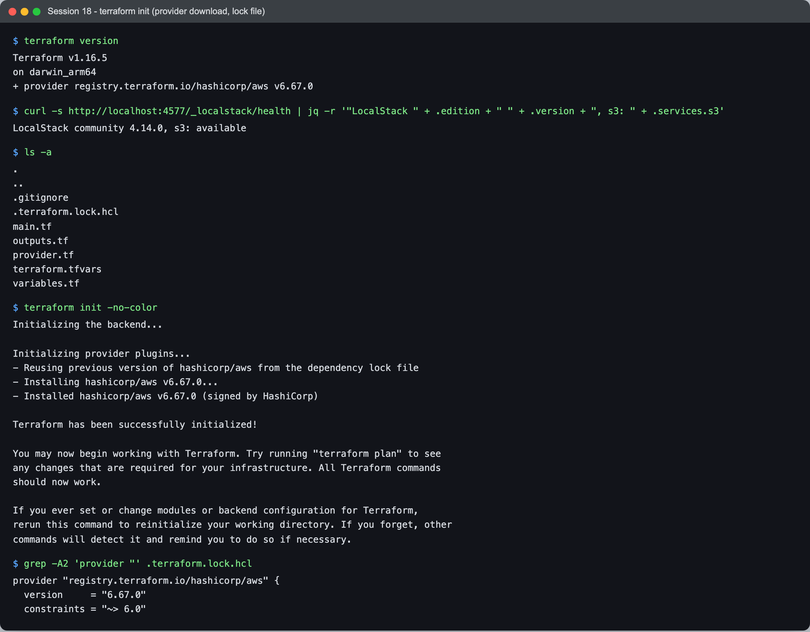
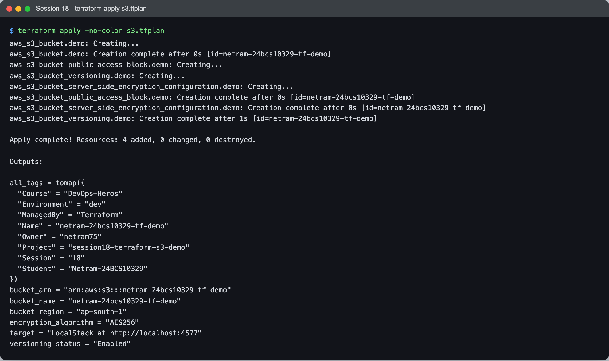
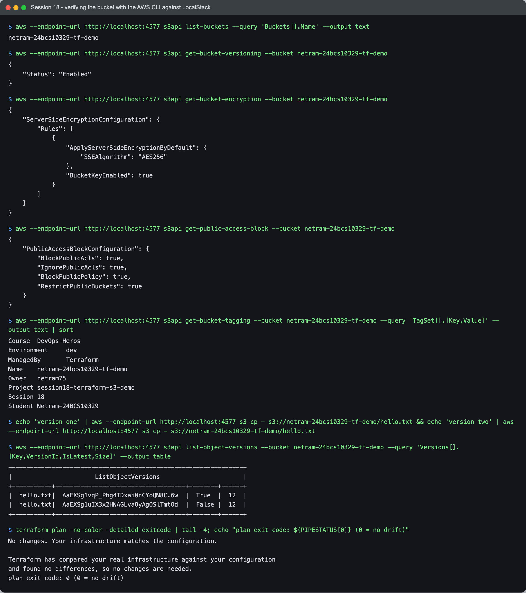
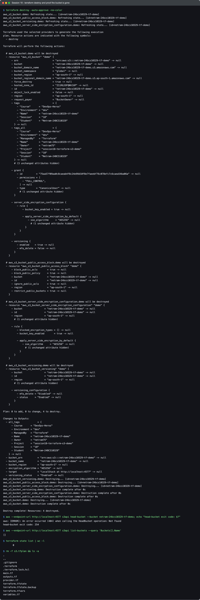

# Session 18 - Terraform & Infrastructure as Code - Task

- **Name:** Netram
- **Enrollment No:** 24BCS10329

> **Status:** completed

Everything here ran on my laptop: macOS 26.5.2 on Apple Silicon (arm64), Terraform v1.16.5 with hashicorp/aws v6.67.0, AWS CLI 2.36.44, and **LocalStack 4.14.0** (community edition, Docker 29.6.2) standing in for AWS. No real AWS account was used, so nothing here cost money, but the Terraform code can target real AWS by flipping one variable.

## What is in this folder

```text
task/
|-- README.md                  <- this file
|-- terraform-s3-demo/         <- Task 1: Terraform S3 bucket, full workflow
|   |-- provider.tf            terraform{} pins + provider "aws" (LocalStack switch)
|   |-- variables.tf           8 variables, 3 with validation rules
|   |-- terraform.tfvars       values for this run
|   |-- main.tf                bucket + versioning + encryption + public access block
|   |-- outputs.tf             7 outputs
|   |-- .terraform.lock.hcl    provider version + checksums (committed on purpose)
|   |-- .gitignore             keeps .terraform/, state and plans out of git
|   `-- README.md              the complete workflow with real output
|-- aws-services/              <- Task 2: research notes
|   |-- 01-iam/README.md
|   |-- 02-ec2/README.md
|   |-- 03-s3/README.md
|   |-- 04-vpc/README.md
|   `-- 05-dynamodb-rds/README.md
`-- screenshots/               terminal captures of the Task 1 run (s18-01 ... s18-07)
```

## Task 1: Terraform S3 demo

Full write-up with every command's real output: [terraform-s3-demo/README.md](terraform-s3-demo/README.md).

In short, I wrote a small Terraform project that creates a private S3 bucket with versioning, SSE-S3 encryption, all four public-access blocks and 8 tags (5 on the resource, 3 from the provider's `default_tags`). The provider has a `use_localstack` variable: when true, a `dynamic "endpoints"` block sends S3/STS calls to `http://localhost:4577`; when false, that block disappears and the same code talks to real AWS.

| Step | Command | Result on my machine |
|---|---|---|
| Init | `terraform init` | hashicorp/aws v6.67.0 installed, pinned by `.terraform.lock.hcl` |
| Format | `terraform fmt -check -diff` | nothing to change |
| Validate | `terraform validate` | `Success! The configuration is valid.` |
| Bad input | `terraform plan -var bucket_name=Netram_Demo_Bucket` | rejected by my validation rule before any API call |
| Plan | `terraform plan -out=s3.tfplan` | `Plan: 4 to add, 0 to change, 0 to destroy.` |
| Apply | `terraform apply s3.tfplan` | `Apply complete! Resources: 4 added` |
| Inspect | `terraform state list`, `show`, `output` | 4 resources in state, 7 outputs |
| Verify | `aws --endpoint-url http://localhost:4577 s3api ...` | versioning Enabled, AES256, all 4 blocks true, 8 tags, 2 versions of `hello.txt` |
| Drift check | `terraform plan -detailed-exitcode` | exit code 0, no drift |
| Destroy | `terraform destroy -auto-approve` | `Destroy complete! Resources: 4 destroyed.`, `head-bucket` returns 404 |

| | |
|---|---|
|  |  |
|  |  |

The remaining screenshots (`s18-02` fmt/validate, `s18-03` plan, `s18-05` show/output) are in [screenshots/](screenshots/) and embedded in the demo README.

## Task 2: AWS services research

| Doc | Covers |
|---|---|
| [01-iam](aws-services/01-iam/README.md) | Users, groups, roles, policies and how they are evaluated, least privilege, a scoped S3 policy, GitHub Actions OIDC trust policy for this repo |
| [02-ec2](aws-services/02-ec2/README.md) | AMIs (AL2023 via SSM parameter), instance types, key pairs vs SSM, security groups, EBS (gp3), public vs private IP, lifecycle |
| [03-s3](aws-services/03-s3/README.md) | Buckets and naming, objects, storage classes, versioning, lifecycle rules, encryption options, bucket policies |
| [04-vpc](aws-services/04-vpc/README.md) | CIDR, subnets, route tables, internet gateway, NAT gateway, security groups vs NACLs, public vs private subnets |
| [05-dynamodb-rds](aws-services/05-dynamodb-rds/README.md) | DynamoDB keys and access patterns, RDS engines, backups, Multi-AZ, read replicas, and when to pick which |

Each doc ends with a "How this shows up in Terraform" section, so the research connects back to Task 1 and to Session 19.

### How I checked the recent facts

A few statements in these notes are about very recent AWS changes, which are easy to get wrong, so I checked each one against an official AWS source before keeping it:

| Claim (doc) | Verdict | Source |
|---|---|---|
| S3 max object size is 50 TB, up from 5 TB, since December 2025; a single PUT is still capped at 5 GB (03-s3) | confirmed (announced 2 Dec 2025) | [What's New](https://aws.amazon.com/about-aws/whats-new/2025/12/amazon-s3-maximum-object-size-50-tb/), [upload docs](https://docs.aws.amazon.com/AmazonS3/latest/userguide/upload-objects.html) |
| SSE-C is disabled by default on new buckets since April 2026 (03-s3) | confirmed (rollout started 6 April 2026) | [S3 FAQ page](https://docs.aws.amazon.com/AmazonS3/latest/userguide/default-s3-c-encryption-setting-faq.html), [AWS Storage blog](https://aws.amazon.com/blogs/storage/advanced-notice-amazon-s3-to-disable-the-use-of-sse-c-encryption-by-default-for-all-new-buckets-and-select-existing-buckets-in-april-2026) |
| S3 account-regional namespace, names ending `-<account-id>-<region>-an`, `--bucket-namespace account-regional` (03-s3) | confirmed (12 March 2026) | [What's New](https://aws.amazon.com/about-aws/whats-new/2026/03/amazon-s3-account-regional-namespaces), [AWS News Blog](https://aws.amazon.com/blogs/aws/introducing-account-regional-namespaces-for-amazon-s3-general-purpose-buckets) |
| Regional NAT gateway mode since November 2025, spans AZs, no public subnet needed (04-vpc) | confirmed (19 Nov 2025) | [What's New](https://aws.amazon.com/about-aws/whats-new/2025/11/aws-nat-gateway-regional-availability) |
| Amazon Linux 2 end of support 30 June 2026; AL2023 supported to June 2029 (02-ec2) | confirmed | [AL2 FAQ](https://aws.amazon.com/amazon-linux-2/faqs/), [AL2023 release cadence](https://docs.aws.amazon.com/linux/al2023/ug/release-cadence.html) |
| Root user MFA enforced for all account types, rolled out 2024-2025 (01-iam) | confirmed (member accounts from 17 June 2025) | [What's New](https://aws.amazon.com/about-aws/whats-new/2025/06/aws-iam-mfa-root-users-across-all-account-types) |

All six held up, so their wording stayed. The review did change two things in `01-iam`:

- The least-privilege example said a compromised app "cannot wipe data". That overstated it, because the policy still allows `s3:PutObject`, which can overwrite objects. It now says the app cannot *delete* objects, and that overwrites are what versioning protects against.
- The GitHub OIDC trust policy had a placeholder instead of a repository; it now names this repo, `repo:netram75/devops-heros`.

## What I learned

- **Declarative means "describe the end state".** I never wrote "create bucket, then enable versioning". I described four resources, and Terraform worked out the order from references like `bucket = aws_s3_bucket.demo.id`. The apply log shows it: the bucket first, then the other three in parallel.
- **The plan is the review step.** Saving it with `-out` and applying that file guarantees that what I reviewed is what runs.
- **State is Terraform's memory.** `terraform state list` showed exactly the four addresses that `destroy` later removed. Without the state, Terraform would not know that bucket belongs to this code. That is also why state never goes into git.
- **Validation rules move errors to the left.** A bad bucket name fails in under a second at plan time, with my own error message, instead of halfway through an apply.
- **Verify outside Terraform.** The AWS CLI checks and a second `plan -detailed-exitcode` are what caught the LocalStack tagging problem below.

## Problems I hit

1. **Tags silently missing on LocalStack 4.9.2.** The first run said "Apply complete" with 8 tags in the outputs, but `get-bucket-tagging` returned `NoSuchTagSet` and the next plan wanted changes (exit code 2). `TF_LOG=DEBUG` showed provider 6.67.0 sends tags inside the `CreateBucket` call, which LocalStack 4.9.2 (October 2025) ignored. LocalStack 4.14.0 handles it, so I switched and re-ran everything from scratch. Details and the real output from the broken run are in the [demo README](terraform-s3-demo/README.md#problem-i-hit-tags-silently-missing-on-localstack-492).
2. **The session folder's `.gitignore` ignores `terraform.tfvars`.** My tfvars has no secrets and is part of the deliverable, so the demo folder's own `.gitignore` re-includes it with `!terraform.tfvars`. I confirmed with `git check-ignore -v` that the negation wins.
3. **Not touching a real account by accident.** This laptop has an `~/.aws` config that is not mine. Every shell that ran `terraform` or `aws` had `AWS_CONFIG_FILE=/dev/null`, `AWS_SHARED_CREDENTIALS_FILE=/dev/null` and dummy `test` keys, so even a wrong endpoint could only ever fail, never change real resources.
