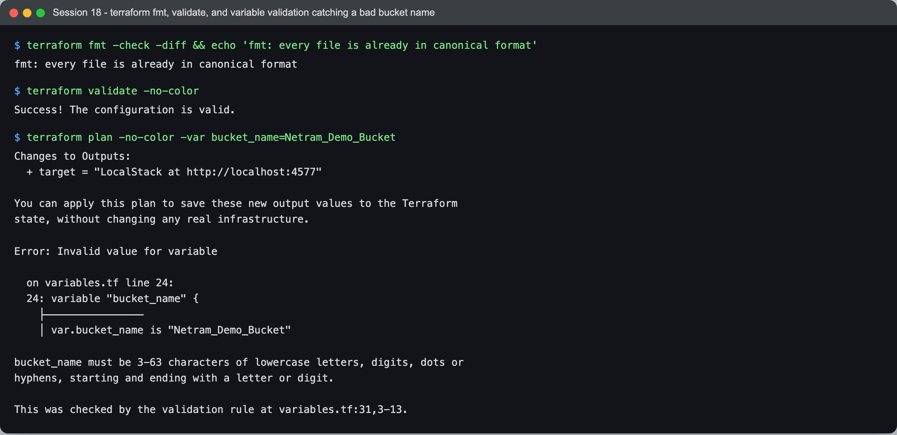
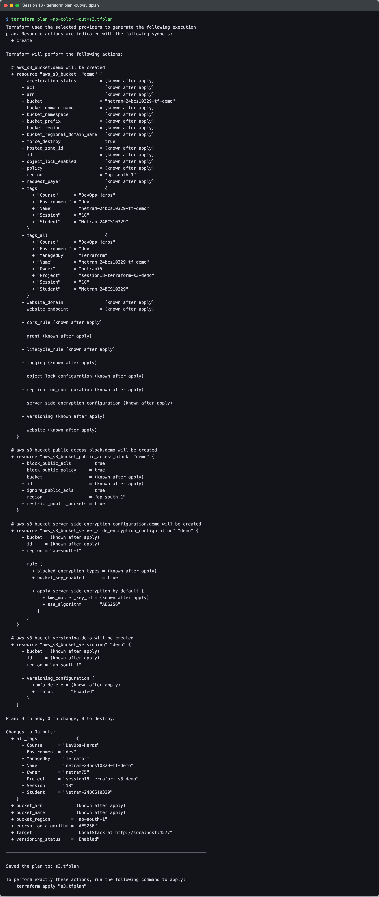
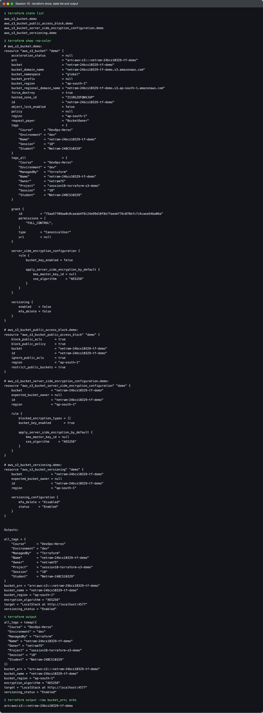

# Terraform S3 demo (Session 18, Task 1)

This folder creates one private, versioned, encrypted, tagged S3 bucket with Terraform and then takes it through the whole lifecycle: `init`, `fmt`, `validate`, `plan`, `apply`, `show`, `output`, a check from the AWS CLI, and `destroy`.

I ran it against **LocalStack** (an AWS API emulator in Docker) instead of a real AWS account. The code has a `use_localstack` switch, so the exact same files work on real AWS when the switch is `false`. Everything below is real output from my machine (macOS 26.5.2 on Apple Silicon, Terraform v1.16.5, hashicorp/aws v6.67.0, LocalStack 4.14.0 community).

## Files

| File | What it holds | Why it is separate |
|---|---|---|
| `provider.tf` | `terraform {}` block (version pins) and the `provider "aws"` block | Everything about *where* to deploy lives in one place |
| `variables.tf` | 8 input variables, 3 of them with `validation` rules | The code never hard-codes a name or region |
| `terraform.tfvars` | The values for this run | Changing environment means changing this file, not the code |
| `main.tf` | The 4 resources | The *what* |
| `outputs.tf` | 7 outputs | What I (or another module/pipeline) need to know after apply |
| `.terraform.lock.hcl` | Exact provider version and checksums, written by `init` | Committed, so every machine installs the same provider build |
| `.gitignore` | Keeps `.terraform/`, state and plan files out of git | State can contain secrets and is machine-specific |

## What gets created and why

| Resource | Purpose |
|---|---|
| `aws_s3_bucket.demo` | The bucket itself, with my tags. `force_destroy` comes from a variable (true only for this demo). |
| `aws_s3_bucket_versioning.demo` | Keeps old versions when an object is overwritten or deleted, so mistakes can be undone. |
| `aws_s3_bucket_server_side_encryption_configuration.demo` | Default encryption with SSE-S3 (AES256). AWS already encrypts new buckets this way, but writing it down makes the intent visible. `bucket_key_enabled` only saves money with SSE-KMS; it is harmless here and already in place if I switch to KMS. |
| `aws_s3_bucket_public_access_block.demo` | All four public-access blocks on. This bucket has no reason to ever be public. |

Since AWS provider v4 these settings are separate resources instead of nested blocks inside `aws_s3_bucket`. I like that: each setting shows up as its own line in the plan, and changing encryption cannot accidentally touch versioning.

Tags come from two places: `local.bucket_tags` in `main.tf` (Name, Environment, Student, plus `extra_tags`) and `default_tags` in the provider (ManagedBy, Project, Owner). The provider merges them into `tags_all`, which is what actually lands on the bucket.

## How the LocalStack switch works

```hcl
provider "aws" {
  region = var.aws_region

  access_key = var.use_localstack ? "test" : null
  secret_key = var.use_localstack ? "test" : null

  skip_credentials_validation = var.use_localstack
  skip_metadata_api_check     = var.use_localstack
  skip_requesting_account_id  = var.use_localstack
  s3_use_path_style           = var.use_localstack

  dynamic "endpoints" {
    for_each = var.use_localstack ? [var.localstack_endpoint] : []
    content {
      s3  = endpoints.value
      sts = endpoints.value
    }
  }
  ...
}
```

- When `use_localstack = true`, the `dynamic "endpoints"` block produces one `endpoints {}` block that points S3 and STS at `http://localhost:4577` (my LocalStack container). The `skip_*` flags stop the provider from calling STS and the EC2 metadata service, which do not exist in a fake account.
- When it is `false`, `for_each` is empty, so no `endpoints` block exists at all, the keys are `null`, and the provider uses the normal credential chain against real AWS. No other file changes.
- `s3_use_path_style` makes the provider call `http://localhost:4577/bucket-name` instead of `http://bucket-name.localhost:4577`, which would need wildcard DNS.

## Prerequisites

```bash
# LocalStack community edition, published on port 4577 (4566 is the default; I used 4577 to avoid clashing with other projects)
docker run -d --name netram-localstack -p 4577:4566 localstack/localstack:4.14

# Dummy credentials, and make sure the AWS CLI / provider never read a real profile on this machine
export AWS_CONFIG_FILE=/dev/null AWS_SHARED_CREDENTIALS_FILE=/dev/null
export AWS_ACCESS_KEY_ID=test AWS_SECRET_ACCESS_KEY=test AWS_DEFAULT_REGION=ap-south-1
```

Pointing `AWS_CONFIG_FILE` and `AWS_SHARED_CREDENTIALS_FILE` at `/dev/null` is a safety net: if I had a typo in the endpoint, the worst case is an "invalid credentials" error from AWS, never an accidental change in a real account.

## The workflow, step by step (real output)

### 1. `terraform init`

`init` reads the `required_providers` block, downloads the AWS provider into `.terraform/` and writes (or, here, reuses) `.terraform.lock.hcl`.

```text
$ terraform version
Terraform v1.16.5
on darwin_arm64
+ provider registry.terraform.io/hashicorp/aws v6.67.0

$ curl -s http://localhost:4577/_localstack/health | jq -r '"LocalStack " + .edition + " " + .version + ", s3: " + .services.s3'
LocalStack community 4.14.0, s3: available

$ ls -a
.
..
.gitignore
.terraform.lock.hcl
main.tf
outputs.tf
provider.tf
terraform.tfvars
variables.tf

$ terraform init -no-color
Initializing the backend...

Initializing provider plugins...
- Reusing previous version of hashicorp/aws from the dependency lock file
- Installing hashicorp/aws v6.67.0...
- Installed hashicorp/aws v6.67.0 (signed by HashiCorp)

Terraform has been successfully initialized!

You may now begin working with Terraform. Try running "terraform plan" to see
any changes that are required for your infrastructure. All Terraform commands
should now work.

If you ever set or change modules or backend configuration for Terraform,
rerun this command to reinitialize your working directory. If you forget, other
commands will detect it and remind you to do so if necessary.

$ grep -A2 'provider "' .terraform.lock.hcl
provider "registry.terraform.io/hashicorp/aws" {
  version     = "6.67.0"
  constraints = "~> 6.0"
```

"Reusing previous version ... from the dependency lock file" is the lock file doing its job: `~> 6.0` would allow any 6.x, but the lock pins 6.67.0 until I deliberately run `terraform init -upgrade`.


### 2. `terraform fmt` and `terraform validate`

`fmt` rewrites files into the canonical style (`-check -diff` only reports). `validate` checks syntax, types and references without calling any API. The third command shows my `bucket_name` validation rule rejecting an invalid S3 name before anything is sent to AWS:

```text
$ terraform fmt -check -diff && echo 'fmt: every file is already in canonical format'
fmt: every file is already in canonical format

$ terraform validate -no-color
Success! The configuration is valid.

$ terraform plan -no-color -var bucket_name=Netram_Demo_Bucket
Changes to Outputs:
  + target = "LocalStack at http://localhost:4577"

You can apply this plan to save these new output values to the Terraform
state, without changing any real infrastructure.

Error: Invalid value for variable

  on variables.tf line 24:
  24: variable "bucket_name" {
    ├────────────────
    │ var.bucket_name is "Netram_Demo_Bucket"

bucket_name must be 3-63 characters of lowercase letters, digits, dots or
hyphens, starting and ending with a letter or digit.

This was checked by the validation rule at variables.tf:31,3-13.
```

One thing I did not expect: Terraform 1.16 still printed the output change for `target` (which does not depend on `bucket_name`) before reporting the error. Nothing is saved or applied though; the plan fails as a whole.



### 3. `terraform plan -out=s3.tfplan`

`plan` compares the code with the state (empty here) and with what really exists, then prints what it would do. Saving it with `-out` means `apply` will do exactly this and nothing else, even if someone changes the code in between.

<details>
<summary>Full plan output (4 to add)</summary>

```text
$ terraform plan -no-color -out=s3.tfplan
Terraform used the selected providers to generate the following execution
plan. Resource actions are indicated with the following symbols:
  + create

Terraform will perform the following actions:

  # aws_s3_bucket.demo will be created
  + resource "aws_s3_bucket" "demo" {
      + acceleration_status         = (known after apply)
      + acl                         = (known after apply)
      + arn                         = (known after apply)
      + bucket                      = "netram-24bcs10329-tf-demo"
      + bucket_domain_name          = (known after apply)
      + bucket_namespace            = (known after apply)
      + bucket_prefix               = (known after apply)
      + bucket_region               = (known after apply)
      + bucket_regional_domain_name = (known after apply)
      + force_destroy               = true
      + hosted_zone_id              = (known after apply)
      + id                          = (known after apply)
      + object_lock_enabled         = (known after apply)
      + policy                      = (known after apply)
      + region                      = "ap-south-1"
      + request_payer               = (known after apply)
      + tags                        = {
          + "Course"      = "DevOps-Heros"
          + "Environment" = "dev"
          + "Name"        = "netram-24bcs10329-tf-demo"
          + "Session"     = "18"
          + "Student"     = "Netram-24BCS10329"
        }
      + tags_all                    = {
          + "Course"      = "DevOps-Heros"
          + "Environment" = "dev"
          + "ManagedBy"   = "Terraform"
          + "Name"        = "netram-24bcs10329-tf-demo"
          + "Owner"       = "netram75"
          + "Project"     = "session18-terraform-s3-demo"
          + "Session"     = "18"
          + "Student"     = "Netram-24BCS10329"
        }
      + website_domain              = (known after apply)
      + website_endpoint            = (known after apply)

      + cors_rule (known after apply)

      + grant (known after apply)

      + lifecycle_rule (known after apply)

      + logging (known after apply)

      + object_lock_configuration (known after apply)

      + replication_configuration (known after apply)

      + server_side_encryption_configuration (known after apply)

      + versioning (known after apply)

      + website (known after apply)
    }

  # aws_s3_bucket_public_access_block.demo will be created
  + resource "aws_s3_bucket_public_access_block" "demo" {
      + block_public_acls       = true
      + block_public_policy     = true
      + bucket                  = (known after apply)
      + id                      = (known after apply)
      + ignore_public_acls      = true
      + region                  = "ap-south-1"
      + restrict_public_buckets = true
    }

  # aws_s3_bucket_server_side_encryption_configuration.demo will be created
  + resource "aws_s3_bucket_server_side_encryption_configuration" "demo" {
      + bucket = (known after apply)
      + id     = (known after apply)
      + region = "ap-south-1"

      + rule {
          + blocked_encryption_types = (known after apply)
          + bucket_key_enabled       = true

          + apply_server_side_encryption_by_default {
              + kms_master_key_id = (known after apply)
              + sse_algorithm     = "AES256"
            }
        }
    }

  # aws_s3_bucket_versioning.demo will be created
  + resource "aws_s3_bucket_versioning" "demo" {
      + bucket = (known after apply)
      + id     = (known after apply)
      + region = "ap-south-1"

      + versioning_configuration {
          + mfa_delete = (known after apply)
          + status     = "Enabled"
        }
    }

Plan: 4 to add, 0 to change, 0 to destroy.

Changes to Outputs:
  + all_tags             = {
      + Course      = "DevOps-Heros"
      + Environment = "dev"
      + ManagedBy   = "Terraform"
      + Name        = "netram-24bcs10329-tf-demo"
      + Owner       = "netram75"
      + Project     = "session18-terraform-s3-demo"
      + Session     = "18"
      + Student     = "Netram-24BCS10329"
    }
  + bucket_arn           = (known after apply)
  + bucket_name          = (known after apply)
  + bucket_region        = "ap-south-1"
  + encryption_algorithm = "AES256"
  + target               = "LocalStack at http://localhost:4577"
  + versioning_status    = "Enabled"

─────────────────────────────────────────────────────────────────────────────

Saved the plan to: s3.tfplan

To perform exactly these actions, run the following command to apply:
    terraform apply "s3.tfplan"
```

</details>

Things worth noticing in the plan:
- `+` means create. `(known after apply)` values (ARN, IDs) only exist once AWS creates the bucket.
- `tags` has my 5 tags, `tags_all` has 8 because the provider's `default_tags` are merged in.
- `bucket_namespace` is a new attribute in recent provider versions (S3 account-regional namespaces); I leave it at the default global namespace.



### 4. `terraform apply s3.tfplan`

```text
$ terraform apply -no-color s3.tfplan
aws_s3_bucket.demo: Creating...
aws_s3_bucket.demo: Creation complete after 0s [id=netram-24bcs10329-tf-demo]
aws_s3_bucket_public_access_block.demo: Creating...
aws_s3_bucket_versioning.demo: Creating...
aws_s3_bucket_server_side_encryption_configuration.demo: Creating...
aws_s3_bucket_public_access_block.demo: Creation complete after 0s [id=netram-24bcs10329-tf-demo]
aws_s3_bucket_server_side_encryption_configuration.demo: Creation complete after 0s [id=netram-24bcs10329-tf-demo]
aws_s3_bucket_versioning.demo: Creation complete after 1s [id=netram-24bcs10329-tf-demo]

Apply complete! Resources: 4 added, 0 changed, 0 destroyed.

Outputs:

all_tags = tomap({
  "Course" = "DevOps-Heros"
  "Environment" = "dev"
  "ManagedBy" = "Terraform"
  "Name" = "netram-24bcs10329-tf-demo"
  "Owner" = "netram75"
  "Project" = "session18-terraform-s3-demo"
  "Session" = "18"
  "Student" = "Netram-24BCS10329"
})
bucket_arn = "arn:aws:s3:::netram-24bcs10329-tf-demo"
bucket_name = "netram-24bcs10329-tf-demo"
bucket_region = "ap-south-1"
encryption_algorithm = "AES256"
target = "LocalStack at http://localhost:4577"
versioning_status = "Enabled"
```

The bucket is created first; the three settings resources start only after it exists, and in parallel with each other. Terraform worked that order out by itself from `bucket = aws_s3_bucket.demo.id` (an implicit dependency). Applying a saved plan does not ask for confirmation, because the plan file is the confirmation.


### 5. `terraform state list`, `terraform show`, `terraform output`

```text
$ terraform state list
aws_s3_bucket.demo
aws_s3_bucket_public_access_block.demo
aws_s3_bucket_server_side_encryption_configuration.demo
aws_s3_bucket_versioning.demo
```

<details>
<summary>terraform show (full state, human readable)</summary>

```text
$ terraform show -no-color
# aws_s3_bucket.demo:
resource "aws_s3_bucket" "demo" {
    acceleration_status         = null
    arn                         = "arn:aws:s3:::netram-24bcs10329-tf-demo"
    bucket                      = "netram-24bcs10329-tf-demo"
    bucket_domain_name          = "netram-24bcs10329-tf-demo.s3.amazonaws.com"
    bucket_namespace            = "global"
    bucket_prefix               = null
    bucket_region               = "ap-south-1"
    bucket_regional_domain_name = "netram-24bcs10329-tf-demo.s3.ap-south-1.amazonaws.com"
    force_destroy               = true
    hosted_zone_id              = "Z11RGJOFQNVJUP"
    id                          = "netram-24bcs10329-tf-demo"
    object_lock_enabled         = false
    policy                      = null
    region                      = "ap-south-1"
    request_payer               = "BucketOwner"
    tags                        = {
        "Course"      = "DevOps-Heros"
        "Environment" = "dev"
        "Name"        = "netram-24bcs10329-tf-demo"
        "Session"     = "18"
        "Student"     = "Netram-24BCS10329"
    }
    tags_all                    = {
        "Course"      = "DevOps-Heros"
        "Environment" = "dev"
        "ManagedBy"   = "Terraform"
        "Name"        = "netram-24bcs10329-tf-demo"
        "Owner"       = "netram75"
        "Project"     = "session18-terraform-s3-demo"
        "Session"     = "18"
        "Student"     = "Netram-24BCS10329"
    }

    grant {
        id          = "75aa57f09aa0c8caeab4f8c24e99d10f8e7faeebf76c078efc7c6caea54ba06a"
        permissions = [
            "FULL_CONTROL",
        ]
        type        = "CanonicalUser"
        uri         = null
    }

    server_side_encryption_configuration {
        rule {
            bucket_key_enabled = false

            apply_server_side_encryption_by_default {
                kms_master_key_id = null
                sse_algorithm     = "AES256"
            }
        }
    }

    versioning {
        enabled    = false
        mfa_delete = false
    }
}

# aws_s3_bucket_public_access_block.demo:
resource "aws_s3_bucket_public_access_block" "demo" {
    block_public_acls       = true
    block_public_policy     = true
    bucket                  = "netram-24bcs10329-tf-demo"
    id                      = "netram-24bcs10329-tf-demo"
    ignore_public_acls      = true
    region                  = "ap-south-1"
    restrict_public_buckets = true
}

# aws_s3_bucket_server_side_encryption_configuration.demo:
resource "aws_s3_bucket_server_side_encryption_configuration" "demo" {
    bucket                = "netram-24bcs10329-tf-demo"
    expected_bucket_owner = null
    id                    = "netram-24bcs10329-tf-demo"
    region                = "ap-south-1"

    rule {
        blocked_encryption_types = []
        bucket_key_enabled       = true

        apply_server_side_encryption_by_default {
            kms_master_key_id = null
            sse_algorithm     = "AES256"
        }
    }
}

# aws_s3_bucket_versioning.demo:
resource "aws_s3_bucket_versioning" "demo" {
    bucket                = "netram-24bcs10329-tf-demo"
    expected_bucket_owner = null
    id                    = "netram-24bcs10329-tf-demo"
    region                = "ap-south-1"

    versioning_configuration {
        mfa_delete = "Disabled"
        status     = "Enabled"
    }
}


Outputs:

all_tags = {
    "Course"      = "DevOps-Heros"
    "Environment" = "dev"
    "ManagedBy"   = "Terraform"
    "Name"        = "netram-24bcs10329-tf-demo"
    "Owner"       = "netram75"
    "Project"     = "session18-terraform-s3-demo"
    "Session"     = "18"
    "Student"     = "Netram-24BCS10329"
}
bucket_arn = "arn:aws:s3:::netram-24bcs10329-tf-demo"
bucket_name = "netram-24bcs10329-tf-demo"
bucket_region = "ap-south-1"
encryption_algorithm = "AES256"
target = "LocalStack at http://localhost:4577"
versioning_status = "Enabled"
```

</details>

```text
$ terraform output
all_tags = tomap({
  "Course" = "DevOps-Heros"
  "Environment" = "dev"
  "ManagedBy" = "Terraform"
  "Name" = "netram-24bcs10329-tf-demo"
  "Owner" = "netram75"
  "Project" = "session18-terraform-s3-demo"
  "Session" = "18"
  "Student" = "Netram-24BCS10329"
})
bucket_arn = "arn:aws:s3:::netram-24bcs10329-tf-demo"
bucket_name = "netram-24bcs10329-tf-demo"
bucket_region = "ap-south-1"
encryption_algorithm = "AES256"
target = "LocalStack at http://localhost:4577"
versioning_status = "Enabled"

$ terraform output -raw bucket_arn; echo
arn:aws:s3:::netram-24bcs10329-tf-demo
```

`terraform output -raw` prints the bare value with no quotes, which is what a script needs (`BUCKET=$(terraform output -raw bucket_name)`).



### 6. Verifying with the AWS CLI

Terraform saying "Apply complete" is not proof by itself, so I asked the API directly. I also uploaded the same key twice to see versioning working, then ran `plan` once more: exit code 0 from `-detailed-exitcode` means the real bucket matches the code exactly (no drift).

```text
$ aws --endpoint-url http://localhost:4577 s3api list-buckets --query 'Buckets[].Name' --output text
netram-24bcs10329-tf-demo

$ aws --endpoint-url http://localhost:4577 s3api get-bucket-versioning --bucket netram-24bcs10329-tf-demo
{
    "Status": "Enabled"
}

$ aws --endpoint-url http://localhost:4577 s3api get-bucket-encryption --bucket netram-24bcs10329-tf-demo
{
    "ServerSideEncryptionConfiguration": {
        "Rules": [
            {
                "ApplyServerSideEncryptionByDefault": {
                    "SSEAlgorithm": "AES256"
                },
                "BucketKeyEnabled": true
            }
        ]
    }
}

$ aws --endpoint-url http://localhost:4577 s3api get-public-access-block --bucket netram-24bcs10329-tf-demo
{
    "PublicAccessBlockConfiguration": {
        "BlockPublicAcls": true,
        "IgnorePublicAcls": true,
        "BlockPublicPolicy": true,
        "RestrictPublicBuckets": true
    }
}

$ aws --endpoint-url http://localhost:4577 s3api get-bucket-tagging --bucket netram-24bcs10329-tf-demo --query 'TagSet[].[Key,Value]' --output text | sort
Course	DevOps-Heros
Environment	dev
ManagedBy	Terraform
Name	netram-24bcs10329-tf-demo
Owner	netram75
Project	session18-terraform-s3-demo
Session	18
Student	Netram-24BCS10329

$ echo 'version one' | aws --endpoint-url http://localhost:4577 s3 cp - s3://netram-24bcs10329-tf-demo/hello.txt && echo 'version two' | aws --endpoint-url http://localhost:4577 s3 cp - s3://netram-24bcs10329-tf-demo/hello.txt

$ aws --endpoint-url http://localhost:4577 s3api list-object-versions --bucket netram-24bcs10329-tf-demo --query 'Versions[].[Key,VersionId,IsLatest,Size]' --output table
------------------------------------------------------------------
|                       ListObjectVersions                       |
+-----------+------------------------------------+--------+------+
|  hello.txt|  AaEXSg1vqP_Phg4IDxai0nCYoQN8C.6w  |  True  |  12  |
|  hello.txt|  AaEXSg1uIX3x2HNAGLvaOyAgOSlTmtOd  |  False |  12  |
+-----------+------------------------------------+--------+------+

$ terraform plan -no-color -detailed-exitcode | tail -4; echo "plan exit code: ${PIPESTATUS[0]} (0 = no drift)"
No changes. Your infrastructure matches the configuration.

Terraform has compared your real infrastructure against your configuration
and found no differences, so no changes are needed.
plan exit code: 0 (0 = no drift)
```


### 7. `terraform destroy`

`destroy` plans the removal of everything in the state and then deletes it in reverse dependency order: the three settings resources first, the bucket last. Because `force_destroy = true`, the provider also deleted the two `hello.txt` versions I uploaded; without it, deleting a non-empty bucket fails (a good default for real data).

<details>
<summary>Full destroy output</summary>

```text
$ terraform destroy -auto-approve -no-color
aws_s3_bucket.demo: Refreshing state... [id=netram-24bcs10329-tf-demo]
aws_s3_bucket_public_access_block.demo: Refreshing state... [id=netram-24bcs10329-tf-demo]
aws_s3_bucket_versioning.demo: Refreshing state... [id=netram-24bcs10329-tf-demo]
aws_s3_bucket_server_side_encryption_configuration.demo: Refreshing state... [id=netram-24bcs10329-tf-demo]

Terraform used the selected providers to generate the following execution
plan. Resource actions are indicated with the following symbols:
  - destroy

Terraform will perform the following actions:

  # aws_s3_bucket.demo will be destroyed
  - resource "aws_s3_bucket" "demo" {
      - arn                         = "arn:aws:s3:::netram-24bcs10329-tf-demo" -> null
      - bucket                      = "netram-24bcs10329-tf-demo" -> null
      - bucket_domain_name          = "netram-24bcs10329-tf-demo.s3.amazonaws.com" -> null
      - bucket_namespace            = "global" -> null
      - bucket_region               = "ap-south-1" -> null
      - bucket_regional_domain_name = "netram-24bcs10329-tf-demo.s3.ap-south-1.amazonaws.com" -> null
      - force_destroy               = true -> null
      - hosted_zone_id              = "Z11RGJOFQNVJUP" -> null
      - id                          = "netram-24bcs10329-tf-demo" -> null
      - object_lock_enabled         = false -> null
      - region                      = "ap-south-1" -> null
      - request_payer               = "BucketOwner" -> null
      - tags                        = {
          - "Course"      = "DevOps-Heros"
          - "Environment" = "dev"
          - "Name"        = "netram-24bcs10329-tf-demo"
          - "Session"     = "18"
          - "Student"     = "Netram-24BCS10329"
        } -> null
      - tags_all                    = {
          - "Course"      = "DevOps-Heros"
          - "Environment" = "dev"
          - "ManagedBy"   = "Terraform"
          - "Name"        = "netram-24bcs10329-tf-demo"
          - "Owner"       = "netram75"
          - "Project"     = "session18-terraform-s3-demo"
          - "Session"     = "18"
          - "Student"     = "Netram-24BCS10329"
        } -> null
        # (3 unchanged attributes hidden)

      - grant {
          - id          = "75aa57f09aa0c8caeab4f8c24e99d10f8e7faeebf76c078efc7c6caea54ba06a" -> null
          - permissions = [
              - "FULL_CONTROL",
            ] -> null
          - type        = "CanonicalUser" -> null
            # (1 unchanged attribute hidden)
        }

      - server_side_encryption_configuration {
          - rule {
              - bucket_key_enabled = true -> null

              - apply_server_side_encryption_by_default {
                  - sse_algorithm     = "AES256" -> null
                    # (1 unchanged attribute hidden)
                }
            }
        }

      - versioning {
          - enabled    = true -> null
          - mfa_delete = false -> null
        }
    }

  # aws_s3_bucket_public_access_block.demo will be destroyed
  - resource "aws_s3_bucket_public_access_block" "demo" {
      - block_public_acls       = true -> null
      - block_public_policy     = true -> null
      - bucket                  = "netram-24bcs10329-tf-demo" -> null
      - id                      = "netram-24bcs10329-tf-demo" -> null
      - ignore_public_acls      = true -> null
      - region                  = "ap-south-1" -> null
      - restrict_public_buckets = true -> null
    }

  # aws_s3_bucket_server_side_encryption_configuration.demo will be destroyed
  - resource "aws_s3_bucket_server_side_encryption_configuration" "demo" {
      - bucket                = "netram-24bcs10329-tf-demo" -> null
      - id                    = "netram-24bcs10329-tf-demo" -> null
      - region                = "ap-south-1" -> null
        # (1 unchanged attribute hidden)

      - rule {
          - blocked_encryption_types = [] -> null
          - bucket_key_enabled       = true -> null

          - apply_server_side_encryption_by_default {
              - sse_algorithm     = "AES256" -> null
                # (1 unchanged attribute hidden)
            }
        }
    }

  # aws_s3_bucket_versioning.demo will be destroyed
  - resource "aws_s3_bucket_versioning" "demo" {
      - bucket                = "netram-24bcs10329-tf-demo" -> null
      - id                    = "netram-24bcs10329-tf-demo" -> null
      - region                = "ap-south-1" -> null
        # (1 unchanged attribute hidden)

      - versioning_configuration {
          - mfa_delete = "Disabled" -> null
          - status     = "Enabled" -> null
        }
    }

Plan: 0 to add, 0 to change, 4 to destroy.

Changes to Outputs:
  - all_tags             = {
      - Course      = "DevOps-Heros"
      - Environment = "dev"
      - ManagedBy   = "Terraform"
      - Name        = "netram-24bcs10329-tf-demo"
      - Owner       = "netram75"
      - Project     = "session18-terraform-s3-demo"
      - Session     = "18"
      - Student     = "Netram-24BCS10329"
    } -> null
  - bucket_arn           = "arn:aws:s3:::netram-24bcs10329-tf-demo" -> null
  - bucket_name          = "netram-24bcs10329-tf-demo" -> null
  - bucket_region        = "ap-south-1" -> null
  - encryption_algorithm = "AES256" -> null
  - target               = "LocalStack at http://localhost:4577" -> null
  - versioning_status    = "Enabled" -> null
aws_s3_bucket_versioning.demo: Destroying... [id=netram-24bcs10329-tf-demo]
aws_s3_bucket_public_access_block.demo: Destroying... [id=netram-24bcs10329-tf-demo]
aws_s3_bucket_server_side_encryption_configuration.demo: Destroying... [id=netram-24bcs10329-tf-demo]
aws_s3_bucket_versioning.demo: Destruction complete after 0s
aws_s3_bucket_server_side_encryption_configuration.demo: Destruction complete after 0s
aws_s3_bucket_public_access_block.demo: Destruction complete after 0s
aws_s3_bucket.demo: Destroying... [id=netram-24bcs10329-tf-demo]
aws_s3_bucket.demo: Destruction complete after 0s

Destroy complete! Resources: 4 destroyed.
```

</details>

Proof it is gone: `head-bucket` returns 404 (CLI exit code 254), the bucket list is empty, and the state has zero resources. The `.tfstate` files left behind are now empty shells and are git-ignored.

```text
$ aws --endpoint-url http://localhost:4577 s3api head-bucket --bucket netram-24bcs10329-tf-demo; echo "head-bucket exit code: $?"
aws: [ERROR]: An error occurred (404) when calling the HeadBucket operation: Not Found
head-bucket exit code: 254

$ aws --endpoint-url http://localhost:4577 s3api list-buckets --query 'Buckets[].Name'
[]

$ terraform state list | wc -l
       0

$ rm -f s3.tfplan && ls -a
.
..
.gitignore
.terraform
.terraform.lock.hcl
main.tf
outputs.tf
provider.tf
terraform.tfstate
terraform.tfstate.backup
terraform.tfvars
variables.tf
```


## Running the same code on real AWS

1. In `terraform.tfvars` set `use_localstack = false` (and delete `localstack_endpoint`, it is ignored anyway).
2. Pick a bucket name nobody in the world has used (S3 names are global), or use the newer account-regional namespace.
3. Log in normally (`aws sso login` or `aws configure`) and drop the `/dev/null` and `test` exports.
4. `terraform init && terraform plan -out=s3.tfplan && terraform apply s3.tfplan`, then `terraform destroy` when done. An empty bucket costs nothing; stored objects cost per GB-month.

I did not do this step, on purpose: this homework is LocalStack only.

## Problem I hit: tags silently missing on LocalStack 4.9.2

My first full run used `localstack/localstack:4.9` (4.9.2, built October 2025). `apply` reported success with all 8 tags in the outputs, but the AWS CLI disagreed and the follow-up plan was not clean (exit code 2 = changes pending):

```text
$ aws --endpoint-url http://localhost:4577 s3api get-bucket-tagging --bucket netram-24bcs10329-tf-demo --query 'TagSet[].[Key,Value]' --output text | sort
aws: [ERROR]: An error occurred (NoSuchTagSet) when calling the GetBucketTagging operation: The TagSet does not exist

$ terraform plan -no-color -detailed-exitcode | tail -4; echo "plan exit code: ${PIPESTATUS[0]} (0 = no drift)"
─────────────────────────────────────────────────────────────────────────────

Note: You didn't use the -out option to save this plan, so Terraform can't
guarantee to take exactly these actions if you run "terraform apply" now.
plan exit code: 2 (0 = no drift)
```

The destroy plan of that run also showed `tags = {} -> null`, so the tags really never reached the bucket. I re-ran a create with `TF_LOG=DEBUG` and looked at the HTTP calls. There was **no** `PutBucketTagging` call at all; instead, provider 6.67.0 sends the tags inside the `CreateBucket` request body:

```text
<CreateBucketConfiguration xmlns="http://s3.amazonaws.com/doc/2006-03-01/"><LocationConstraint>ap-south-1</LocationConstraint><Tags><Tag><Key>Environment</Key><Value>dev</Value></Tag>...
```

The S3 API now accepts tags at bucket creation and the provider uses that, but LocalStack 4.9.2 predates it and ignored the `<Tags>` element without any error. I tested `localstack/localstack:4.14` (4.14.0, February 2026, still usable without an auth token) on a spare port: tags were stored and the post-apply plan returned exit code 0. I switched to 4.14.0 and re-ran the whole workflow from scratch; that run is what this README shows.

Lessons: an emulator always lags the real API, and "Apply complete" is not verification. A second `terraform plan -detailed-exitcode` after every apply catches this class of bug for free.

## What is not committed and why

- `.terraform/`: the provider binary (hundreds of MB), re-downloaded by `init`.
- `terraform.tfstate*`: maps code to real resource IDs and can contain secrets. In a team it belongs in a remote backend (S3 with locking), never in git.
- `*.tfplan`: binary, and contains every value in the plan.
- `terraform.tfvars` *is* committed here: it holds no secrets. The session folder's `.gitignore` ignores `terraform.tfvars`, so this folder's `.gitignore` re-includes it with `!terraform.tfvars`.
