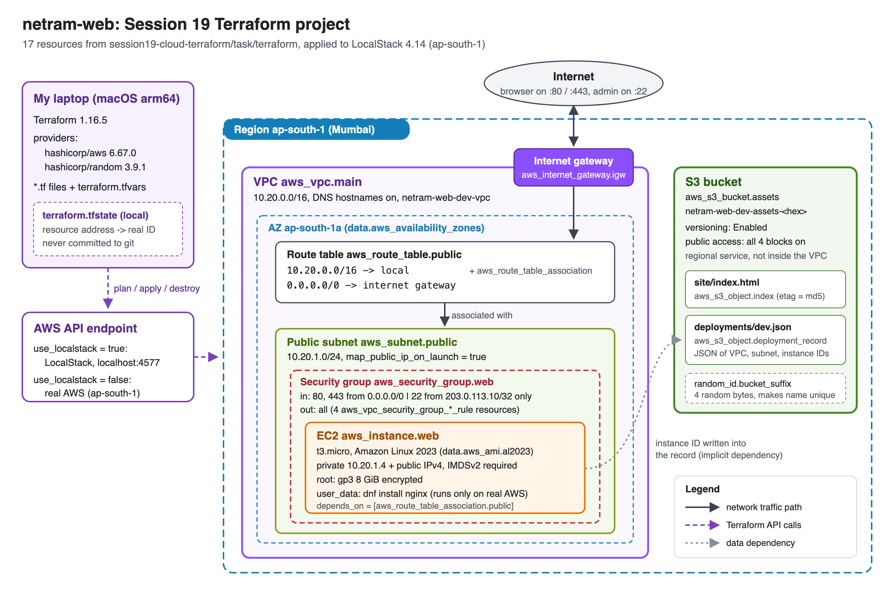
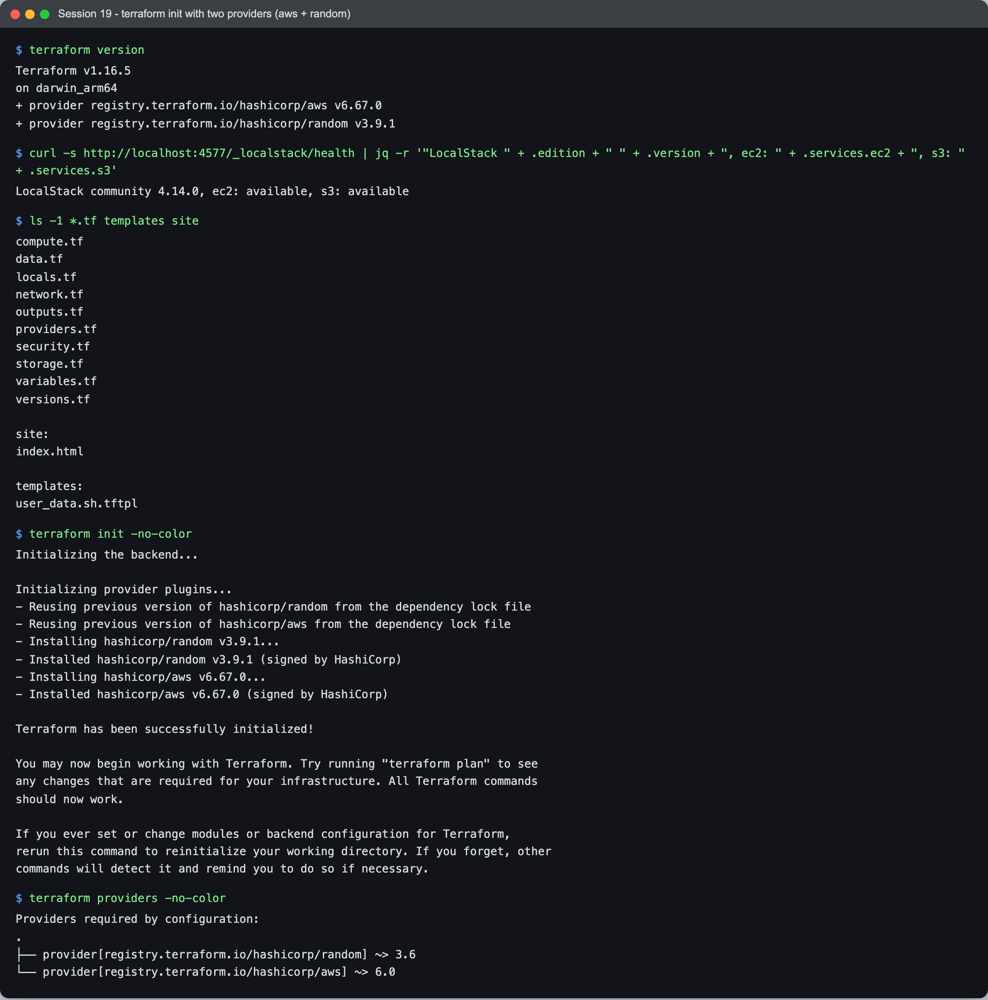
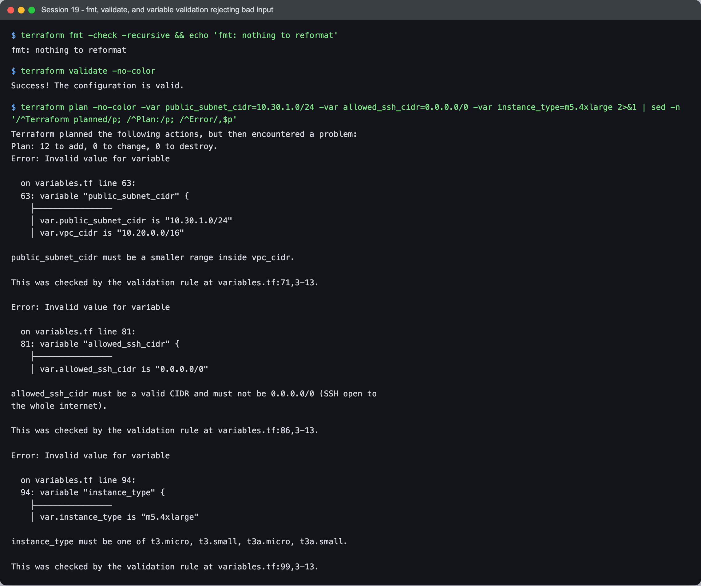
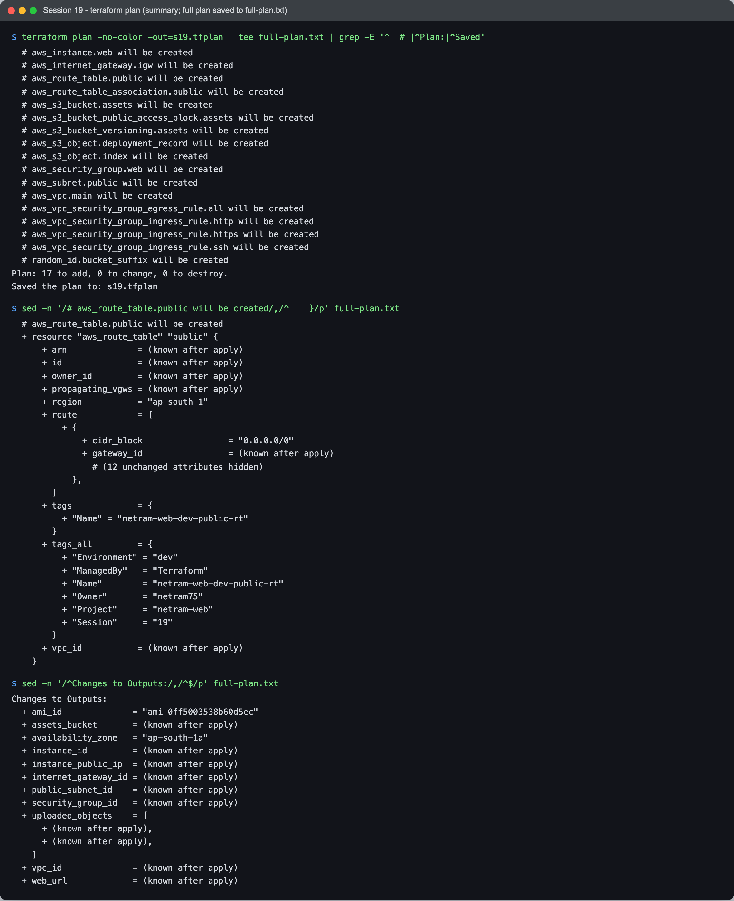
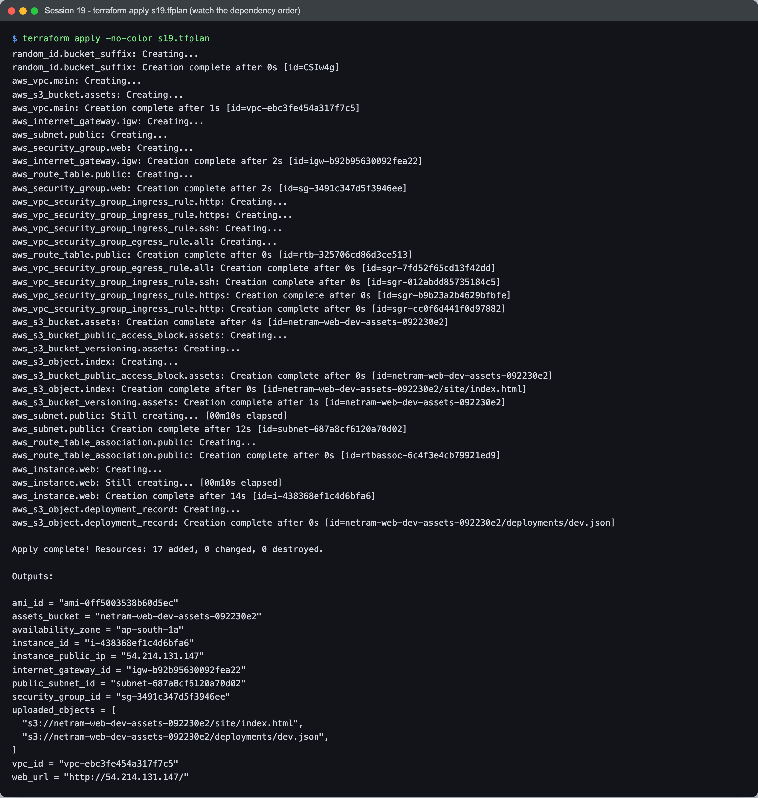
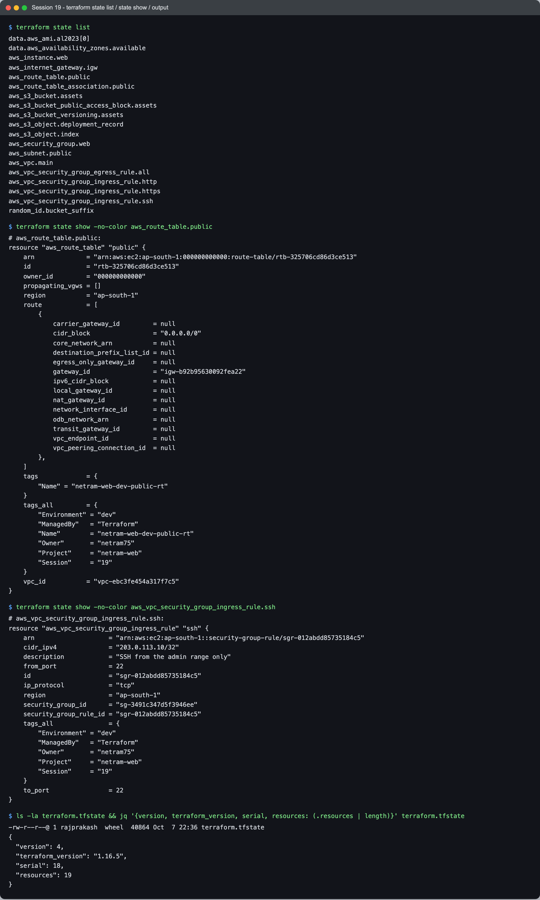
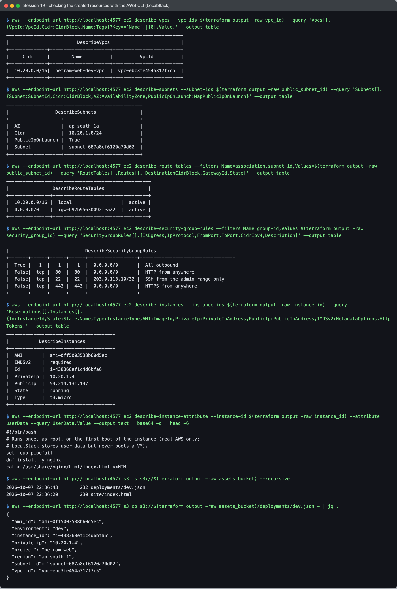
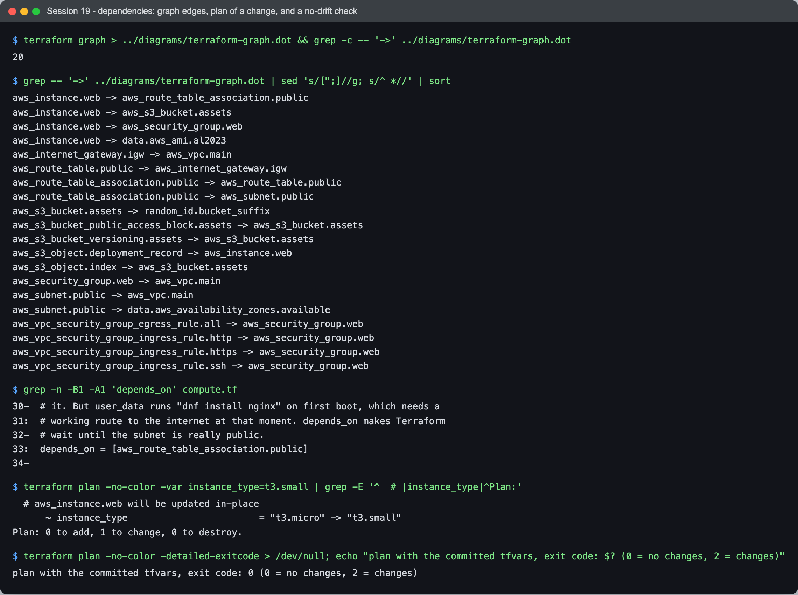
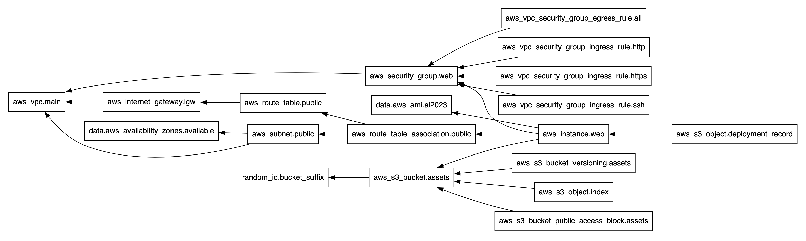
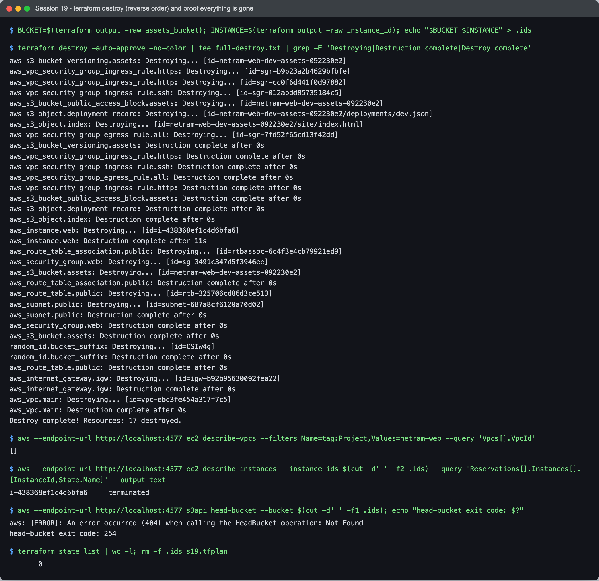

# Session 19 - Cloud & Terraform in Action - Task

- **Name:** Netram
- **Enrollment No:** 24BCS10329

> **Status:** completed

I built one end-to-end Terraform project that puts a web server in its own network on AWS: a VPC, a public subnet, an internet gateway with a route table, a security group, an EC2 instance, and an S3 bucket with two objects. It covers every concept from the session: providers, variables with validation, resources, data sources, outputs, implicit and explicit dependencies, state, plan, apply and destroy.

It ran on macOS 26.5.2 (Apple Silicon), Terraform v1.16.5, hashicorp/aws v6.67.0, hashicorp/random v3.9.1, AWS CLI 2.36.44, against **LocalStack 4.14.0** (community edition in Docker) instead of a real AWS account. Read [What LocalStack does not do](#what-localstack-does-not-do) before trusting anything about the EC2 instance.

## Architecture



I drew this by hand as SVG ([diagrams/architecture.svg](diagrams/architecture.svg)) and rendered it to PNG with Playwright. Every box is labelled with the Terraform address that creates it.

Traffic path on real AWS: a browser hits the instance's public IP on port 80. The internet gateway lets it into the VPC, the route table association makes the subnet public (its route table has `0.0.0.0/0 -> igw`), and the security group allows port 80 from anywhere. SSH (22) is only allowed from a single `/32`. S3 is a regional service, so it sits outside the VPC.

## What it creates (17 resources, 2 data sources)

| File | Terraform address | What it is |
|---|---|---|
| `data.tf` | `data.aws_availability_zones.available` | Reads the AZ list so I do not hard-code `ap-south-1a` |
| `data.tf` | `data.aws_ami.al2023[0]` | Finds the newest Amazon Linux 2023 x86_64 AMI (skipped when `ami_id` is set) |
| `network.tf` | `aws_vpc.main` | VPC `10.20.0.0/16` with DNS hostnames on |
| `network.tf` | `aws_subnet.public` | `10.20.1.0/24` in the first AZ, public IPs on launch |
| `network.tf` | `aws_internet_gateway.igw` | The VPC's door to the internet |
| `network.tf` | `aws_route_table.public` | `0.0.0.0/0 -> igw` |
| `network.tf` | `aws_route_table_association.public` | Attaches that route table to the subnet; this is what makes it "public" |
| `security.tf` | `aws_security_group.web` | Firewall for the instance |
| `security.tf` | `aws_vpc_security_group_ingress_rule.http` / `.https` / `.ssh` | 80 and 443 from anywhere, 22 from `allowed_ssh_cidr` only |
| `security.tf` | `aws_vpc_security_group_egress_rule.all` | All outbound |
| `compute.tf` | `aws_instance.web` | t3.micro, AL2023, IMDSv2 required, encrypted gp3 root, nginx via `user_data` |
| `storage.tf` | `random_id.bucket_suffix` | 4 random bytes so the bucket name is globally unique |
| `storage.tf` | `aws_s3_bucket.assets` | `netram-web-dev-assets-<hex>` |
| `storage.tf` | `aws_s3_bucket_public_access_block.assets`, `aws_s3_bucket_versioning.assets` | Private and versioned |
| `storage.tf` | `aws_s3_object.index` | `site/index.html`, uploaded from the repo |
| `storage.tf` | `aws_s3_object.deployment_record` | `deployments/dev.json`, built from the VPC, subnet and instance IDs |

## Layout

```text
task/
|-- README.md
|-- terraform/
|   |-- versions.tf          terraform {} block: Terraform >= 1.9, aws ~> 6.0, random ~> 3.6
|   |-- providers.tf         provider "aws" (LocalStack switch + default_tags), provider "random"
|   |-- variables.tf         10 input variables, 8 with validation rules
|   |-- locals.tf            name prefix, common tags, AMI choice, AZ choice
|   |-- data.tf              data sources: availability zones, AL2023 AMI
|   |-- network.tf           VPC, subnet, IGW, route table, association
|   |-- security.tf          security group + 4 rule resources
|   |-- compute.tf           EC2 instance (with the one depends_on)
|   |-- storage.tf           random_id, bucket, public access block, versioning, 2 objects
|   |-- outputs.tf           11 outputs
|   |-- terraform.tfvars     values for the LocalStack run (no secrets)
|   |-- templates/user_data.sh.tftpl   boot script, rendered with templatefile()
|   |-- site/index.html      static file uploaded to S3
|   |-- .terraform.lock.hcl  exact provider builds + checksums
|   `-- .gitignore
|-- diagrams/
|   |-- architecture.svg / .png        hand-drawn architecture
|   `-- terraform-graph.dot / .svg / .png   output of `terraform graph`, rendered
`-- screenshots/             s19-01 ... s19-08 terminal captures
```

I split by *kind of thing* (network, security, compute, storage) rather than one big `main.tf`. Terraform loads every `.tf` file in the folder as one configuration, so the split is only for humans: when I want to change a firewall rule I open `security.tf` and nothing else.

## Each concept, tied to the code

### Providers (`versions.tf`, `providers.tf`)

```hcl
required_providers {
  aws    = { source = "hashicorp/aws",    version = "~> 6.0" }
  random = { source = "hashicorp/random", version = "~> 3.6" }
}
```

A provider is the plugin that turns HCL into API calls. This project uses two: `aws` for the cloud resources and `random` for the bucket suffix, which shows that a provider does not have to talk to a cloud at all. `~> 6.0` allows any 6.x; the exact build (6.67.0 / 3.9.1) is pinned in `.terraform.lock.hcl`.

The `aws` provider has the same LocalStack switch as my Session 18 demo: when `use_localstack = true`, a `dynamic "endpoints"` block points `ec2`, `s3` and `sts` at `http://localhost:4577`; when `false`, the block vanishes and the provider talks to real AWS. `default_tags` stamps Project, Environment, ManagedBy, Owner and Session on every taggable resource, so I never repeat them.

### Variables and validation (`variables.tf`, `terraform.tfvars`)

Every value that could differ between environments is a variable with a type, a description and a default. Eight of the ten have `validation` blocks, because a mistake caught at plan time costs one second, while a mistake caught by AWS costs a half-applied stack. The interesting ones:

```hcl
variable "public_subnet_cidr" {
  ...
  validation {
    condition = (
      can(cidrnetmask(var.public_subnet_cidr)) &&
      tonumber(split("/", var.public_subnet_cidr)[1]) > tonumber(split("/", var.vpc_cidr)[1]) &&
      cidrsubnet("${cidrhost(var.public_subnet_cidr, 0)}/${split("/", var.vpc_cidr)[1]}", 0, 0) == cidrsubnet(var.vpc_cidr, 0, 0)
    )
    error_message = "public_subnet_cidr must be a smaller range inside vpc_cidr."
  }
}
```

This one looks at *another* variable (`var.vpc_cidr`), which Terraform only allows since 1.9; that is why `versions.tf` requires `>= 1.9.0`. It takes the subnet's network address, re-masks it with the VPC's prefix length, and checks that the result is the VPC. I tested the expressions in `terraform console` first (`cidrsubnet("10.20.1.0/16", 0, 0)` gives `"10.20.0.0/16"`).

Other rules: `allowed_ssh_cidr` must not be `0.0.0.0/0`, `instance_type` must be one of four small types, `environment` must be dev/staging/prod, `ami_id` must look like `ami-...` or be null.

### Resources and data sources (`network.tf`, `security.tf`, `compute.tf`, `storage.tf`, `data.tf`)

A `resource` block is something Terraform creates and owns; a `data` block only reads. The AMI lookup is a good example of why data sources matter: AMI IDs differ per region and change every few weeks, so hard-coding one breaks quickly.

```hcl
data "aws_ami" "al2023" {
  count       = var.ami_id == null ? 1 : 0
  most_recent = true
  owners      = ["amazon"]
  filter {
    name   = "name"
    values = ["al2023-ami-2023.*-kernel-6.1-x86_64"]
  }
  ...
}

locals {
  ami_id = coalesce(var.ami_id, one(data.aws_ami.al2023[*].id))
}
```

`count = 0` skips the lookup when I pin an AMI, and `coalesce` picks whichever value is set. The security group rules use the separate `aws_vpc_security_group_ingress_rule` resources (recommended since provider v5) instead of inline `ingress {}` blocks, so each rule is its own object in state and in the plan.

### Outputs (`outputs.tf`)

Eleven outputs: IDs of the VPC, subnet, IGW, security group and instance, the AMI and AZ that were picked, the public IP, a `web_url`, the bucket name and the two object URIs. I used them in the verification step (`$(terraform output -raw vpc_id)`), which is the main point of outputs: other tools and scripts should never have to parse state.

### Dependencies (implicit everywhere, explicit once)

**Implicit:** any reference creates an edge. `aws_subnet.public` uses `aws_vpc.main.id`, so the VPC is created first and destroyed last. The neatest one is the deployment record:

```hcl
resource "aws_s3_object" "deployment_record" {
  ...
  content = jsonencode({
    vpc_id      = aws_vpc.main.id
    subnet_id   = aws_subnet.public.id
    instance_id = aws_instance.web.id
    ...
  })
}
```

Because it reads `aws_instance.web.id`, Terraform knows it must wait for the instance. I never wrote `depends_on` for it.

**Explicit (`depends_on`):** the instance does not reference the route table association anywhere, so Terraform would start both at the same time. But the boot script runs `dnf install -y nginx`, which needs a route to the internet *at boot time*. That is a dependency Terraform cannot see, so I spell it out:

```hcl
resource "aws_instance" "web" {
  ...
  depends_on = [aws_route_table_association.public]
}
```

The apply log below proves it worked: the subnet took 12 s on LocalStack, and `aws_instance.web: Creating...` only starts after `aws_route_table_association.public: Creation complete`.

### State, plan, apply, destroy

All four are shown with real output in the next section. In short: `plan` diffs code against state and reality, `apply` executes a saved plan, `terraform.tfstate` records which real ID belongs to which address (19 entries here: 17 resources plus 2 data sources), and `destroy` walks the dependency graph backwards.

## Commands and real output

All commands were run with `AWS_CONFIG_FILE=/dev/null AWS_SHARED_CREDENTIALS_FILE=/dev/null AWS_ACCESS_KEY_ID=test AWS_SECRET_ACCESS_KEY=test AWS_DEFAULT_REGION=ap-south-1` exported, and LocalStack started with:

```bash
docker run -d --name netram-localstack -p 4577:4566 localstack/localstack:4.14
```

### 1. `terraform init`

```text
$ terraform version
Terraform v1.16.5
on darwin_arm64
+ provider registry.terraform.io/hashicorp/aws v6.67.0
+ provider registry.terraform.io/hashicorp/random v3.9.1

$ curl -s http://localhost:4577/_localstack/health | jq -r '"LocalStack " + .edition + " " + .version + ", ec2: " + .services.ec2 + ", s3: " + .services.s3'
LocalStack community 4.14.0, ec2: available, s3: available

$ ls -1 *.tf templates site
compute.tf
data.tf
locals.tf
network.tf
outputs.tf
providers.tf
security.tf
storage.tf
variables.tf
versions.tf

site:
index.html

templates:
user_data.sh.tftpl

$ terraform init -no-color
Initializing the backend...

Initializing provider plugins...
- Reusing previous version of hashicorp/random from the dependency lock file
- Reusing previous version of hashicorp/aws from the dependency lock file
- Installing hashicorp/random v3.9.1...
- Installed hashicorp/random v3.9.1 (signed by HashiCorp)
- Installing hashicorp/aws v6.67.0...
- Installed hashicorp/aws v6.67.0 (signed by HashiCorp)

Terraform has been successfully initialized!

You may now begin working with Terraform. Try running "terraform plan" to see
any changes that are required for your infrastructure. All Terraform commands
should now work.

If you ever set or change modules or backend configuration for Terraform,
rerun this command to reinitialize your working directory. If you forget, other
commands will detect it and remind you to do so if necessary.

$ terraform providers -no-color
Providers required by configuration:
.
├── provider[registry.terraform.io/hashicorp/random] ~> 3.6
└── provider[registry.terraform.io/hashicorp/aws] ~> 6.0
```



### 2. `terraform fmt`, `terraform validate`, and validation rules rejecting bad input

The third command passes three bad values at once: a subnet outside the VPC, SSH open to the world, and an expensive instance type. All three are rejected with my own messages. (Terraform 1.16 first plans the 12 resources that do not depend on those variables, then stops; nothing is saved or applied. I filtered the output with `sed` to keep the screenshot readable.)

```text
$ terraform fmt -check -recursive && echo 'fmt: nothing to reformat'
fmt: nothing to reformat

$ terraform validate -no-color
Success! The configuration is valid.

$ terraform plan -no-color -var public_subnet_cidr=10.30.1.0/24 -var allowed_ssh_cidr=0.0.0.0/0 -var instance_type=m5.4xlarge 2>&1 | sed -n '/^Terraform planned/p; /^Plan:/p; /^Error/,$p'
Terraform planned the following actions, but then encountered a problem:
Plan: 12 to add, 0 to change, 0 to destroy.
Error: Invalid value for variable

  on variables.tf line 63:
  63: variable "public_subnet_cidr" {
    ├────────────────
    │ var.public_subnet_cidr is "10.30.1.0/24"
    │ var.vpc_cidr is "10.20.0.0/16"

public_subnet_cidr must be a smaller range inside vpc_cidr.

This was checked by the validation rule at variables.tf:71,3-13.

Error: Invalid value for variable

  on variables.tf line 81:
  81: variable "allowed_ssh_cidr" {
    ├────────────────
    │ var.allowed_ssh_cidr is "0.0.0.0/0"

allowed_ssh_cidr must be a valid CIDR and must not be 0.0.0.0/0 (SSH open to
the whole internet).

This was checked by the validation rule at variables.tf:86,3-13.

Error: Invalid value for variable

  on variables.tf line 94:
  94: variable "instance_type" {
    ├────────────────
    │ var.instance_type is "m5.4xlarge"

instance_type must be one of t3.micro, t3.small, t3a.micro, t3a.small.

This was checked by the validation rule at variables.tf:99,3-13.
```



### 3. `terraform plan -out=s19.tfplan`

The full plan is about 500 lines, so the screenshot shows the summary, one resource (the route table) and the output preview. The complete plan text is in the collapsed block.

```text
$ terraform plan -no-color -out=s19.tfplan | tee full-plan.txt | grep -E '^  # |^Plan:|^Saved'
  # aws_instance.web will be created
  # aws_internet_gateway.igw will be created
  # aws_route_table.public will be created
  # aws_route_table_association.public will be created
  # aws_s3_bucket.assets will be created
  # aws_s3_bucket_public_access_block.assets will be created
  # aws_s3_bucket_versioning.assets will be created
  # aws_s3_object.deployment_record will be created
  # aws_s3_object.index will be created
  # aws_security_group.web will be created
  # aws_subnet.public will be created
  # aws_vpc.main will be created
  # aws_vpc_security_group_egress_rule.all will be created
  # aws_vpc_security_group_ingress_rule.http will be created
  # aws_vpc_security_group_ingress_rule.https will be created
  # aws_vpc_security_group_ingress_rule.ssh will be created
  # random_id.bucket_suffix will be created
Plan: 17 to add, 0 to change, 0 to destroy.
Saved the plan to: s19.tfplan

$ sed -n '/# aws_route_table.public will be created/,/^    }/p' full-plan.txt
  # aws_route_table.public will be created
  + resource "aws_route_table" "public" {
      + arn              = (known after apply)
      + id               = (known after apply)
      + owner_id         = (known after apply)
      + propagating_vgws = (known after apply)
      + region           = "ap-south-1"
      + route            = [
          + {
              + cidr_block                 = "0.0.0.0/0"
              + gateway_id                 = (known after apply)
                # (12 unchanged attributes hidden)
            },
        ]
      + tags             = {
          + "Name" = "netram-web-dev-public-rt"
        }
      + tags_all         = {
          + "Environment" = "dev"
          + "ManagedBy"   = "Terraform"
          + "Name"        = "netram-web-dev-public-rt"
          + "Owner"       = "netram75"
          + "Project"     = "netram-web"
          + "Session"     = "19"
        }
      + vpc_id           = (known after apply)
    }

$ sed -n '/^Changes to Outputs:/,/^$/p' full-plan.txt
Changes to Outputs:
  + ami_id              = "ami-0ff5003538b60d5ec"
  + assets_bucket       = (known after apply)
  + availability_zone   = "ap-south-1a"
  + instance_id         = (known after apply)
  + instance_public_ip  = (known after apply)
  + internet_gateway_id = (known after apply)
  + public_subnet_id    = (known after apply)
  + security_group_id   = (known after apply)
  + uploaded_objects    = [
      + (known after apply),
      + (known after apply),
    ]
  + vpc_id              = (known after apply)
  + web_url             = (known after apply)
```

<details>
<summary>Full plan output (17 to add)</summary>

```text
data.aws_availability_zones.available: Reading...
data.aws_ami.al2023[0]: Reading...
data.aws_availability_zones.available: Read complete after 0s [id=ap-south-1]
data.aws_ami.al2023[0]: Read complete after 0s [id=ami-0ff5003538b60d5ec]

Terraform used the selected providers to generate the following execution
plan. Resource actions are indicated with the following symbols:
  + create

Terraform will perform the following actions:

  # aws_instance.web will be created
  + resource "aws_instance" "web" {
      + ami                                  = "ami-0ff5003538b60d5ec"
      + arn                                  = (known after apply)
      + associate_public_ip_address          = (known after apply)
      + availability_zone                    = (known after apply)
      + disable_api_stop                     = (known after apply)
      + disable_api_termination              = (known after apply)
      + ebs_optimized                        = (known after apply)
      + enable_primary_ipv6                  = (known after apply)
      + force_destroy                        = false
      + get_password_data                    = false
      + host_id                              = (known after apply)
      + host_resource_group_arn              = (known after apply)
      + iam_instance_profile                 = (known after apply)
      + id                                   = (known after apply)
      + instance_initiated_shutdown_behavior = (known after apply)
      + instance_lifecycle                   = (known after apply)
      + instance_state                       = (known after apply)
      + instance_type                        = "t3.micro"
      + ipv6_address_count                   = (known after apply)
      + ipv6_addresses                       = (known after apply)
      + key_name                             = (known after apply)
      + monitoring                           = (known after apply)
      + outpost_arn                          = (known after apply)
      + password_data                        = (known after apply)
      + placement_group                      = (known after apply)
      + placement_group_id                   = (known after apply)
      + placement_partition_number           = (known after apply)
      + primary_network_interface_id         = (known after apply)
      + private_dns                          = (known after apply)
      + private_ip                           = (known after apply)
      + public_dns                           = (known after apply)
      + public_ip                            = (known after apply)
      + region                               = "ap-south-1"
      + secondary_private_ips                = (known after apply)
      + security_groups                      = (known after apply)
      + source_dest_check                    = true
      + spot_instance_request_id             = (known after apply)
      + subnet_id                            = (known after apply)
      + tags                                 = {
          + "Name" = "netram-web-dev-web"
        }
      + tags_all                             = {
          + "Environment" = "dev"
          + "ManagedBy"   = "Terraform"
          + "Name"        = "netram-web-dev-web"
          + "Owner"       = "netram75"
          + "Project"     = "netram-web"
          + "Session"     = "19"
        }
      + tenancy                              = (known after apply)
      + user_data                            = (known after apply)
      + user_data_base64                     = (known after apply)
      + user_data_replace_on_change          = true
      + vpc_security_group_ids               = (known after apply)

      + capacity_reservation_specification (known after apply)

      + cpu_options (known after apply)

      + ebs_block_device (known after apply)

      + enclave_options (known after apply)

      + ephemeral_block_device (known after apply)

      + instance_market_options (known after apply)

      + maintenance_options (known after apply)

      + metadata_options {
          + http_endpoint               = "enabled"
          + http_protocol_ipv6          = "disabled"
          + http_put_response_hop_limit = (known after apply)
          + http_tokens                 = "required"
          + instance_metadata_tags      = (known after apply)
        }

      + network_interface (known after apply)

      + primary_network_interface (known after apply)

      + private_dns_name_options (known after apply)

      + root_block_device {
          + delete_on_termination = true
          + device_name           = (known after apply)
          + encrypted             = true
          + iops                  = (known after apply)
          + kms_key_id            = (known after apply)
          + tags_all              = (known after apply)
          + throughput            = (known after apply)
          + volume_id             = (known after apply)
          + volume_size           = 8
          + volume_type           = "gp3"
        }

      + secondary_network_interface (known after apply)
    }

  # aws_internet_gateway.igw will be created
  + resource "aws_internet_gateway" "igw" {
      + arn      = (known after apply)
      + id       = (known after apply)
      + owner_id = (known after apply)
      + region   = "ap-south-1"
      + tags     = {
          + "Name" = "netram-web-dev-igw"
        }
      + tags_all = {
          + "Environment" = "dev"
          + "ManagedBy"   = "Terraform"
          + "Name"        = "netram-web-dev-igw"
          + "Owner"       = "netram75"
          + "Project"     = "netram-web"
          + "Session"     = "19"
        }
      + vpc_id   = (known after apply)
    }

  # aws_route_table.public will be created
  + resource "aws_route_table" "public" {
      + arn              = (known after apply)
      + id               = (known after apply)
      + owner_id         = (known after apply)
      + propagating_vgws = (known after apply)
      + region           = "ap-south-1"
      + route            = [
          + {
              + cidr_block                 = "0.0.0.0/0"
              + gateway_id                 = (known after apply)
                # (12 unchanged attributes hidden)
            },
        ]
      + tags             = {
          + "Name" = "netram-web-dev-public-rt"
        }
      + tags_all         = {
          + "Environment" = "dev"
          + "ManagedBy"   = "Terraform"
          + "Name"        = "netram-web-dev-public-rt"
          + "Owner"       = "netram75"
          + "Project"     = "netram-web"
          + "Session"     = "19"
        }
      + vpc_id           = (known after apply)
    }

  # aws_route_table_association.public will be created
  + resource "aws_route_table_association" "public" {
      + id             = (known after apply)
      + region         = "ap-south-1"
      + route_table_id = (known after apply)
      + subnet_id      = (known after apply)
    }

  # aws_s3_bucket.assets will be created
  + resource "aws_s3_bucket" "assets" {
      + acceleration_status         = (known after apply)
      + acl                         = (known after apply)
      + arn                         = (known after apply)
      + bucket                      = (known after apply)
      + bucket_domain_name          = (known after apply)
      + bucket_namespace            = (known after apply)
      + bucket_prefix               = (known after apply)
      + bucket_region               = (known after apply)
      + bucket_regional_domain_name = (known after apply)
      + force_destroy               = true
      + hosted_zone_id              = (known after apply)
      + id                          = (known after apply)
      + object_lock_enabled         = (known after apply)
      + policy                      = (known after apply)
      + region                      = "ap-south-1"
      + request_payer               = (known after apply)
      + tags                        = {
          + "Name" = "netram-web-dev-assets"
        }
      + tags_all                    = {
          + "Environment" = "dev"
          + "ManagedBy"   = "Terraform"
          + "Name"        = "netram-web-dev-assets"
          + "Owner"       = "netram75"
          + "Project"     = "netram-web"
          + "Session"     = "19"
        }
      + website_domain              = (known after apply)
      + website_endpoint            = (known after apply)

      + cors_rule (known after apply)

      + grant (known after apply)

      + lifecycle_rule (known after apply)

      + logging (known after apply)

      + object_lock_configuration (known after apply)

      + replication_configuration (known after apply)

      + server_side_encryption_configuration (known after apply)

      + versioning (known after apply)

      + website (known after apply)
    }

  # aws_s3_bucket_public_access_block.assets will be created
  + resource "aws_s3_bucket_public_access_block" "assets" {
      + block_public_acls       = true
      + block_public_policy     = true
      + bucket                  = (known after apply)
      + id                      = (known after apply)
      + ignore_public_acls      = true
      + region                  = "ap-south-1"
      + restrict_public_buckets = true
    }

  # aws_s3_bucket_versioning.assets will be created
  + resource "aws_s3_bucket_versioning" "assets" {
      + bucket = (known after apply)
      + id     = (known after apply)
      + region = "ap-south-1"

      + versioning_configuration {
          + mfa_delete = (known after apply)
          + status     = "Enabled"
        }
    }

  # aws_s3_object.deployment_record will be created
  + resource "aws_s3_object" "deployment_record" {
      + acl                    = (known after apply)
      + arn                    = (known after apply)
      + bucket                 = (known after apply)
      + bucket_key_enabled     = (known after apply)
      + checksum_crc32         = (known after apply)
      + checksum_crc32c        = (known after apply)
      + checksum_crc64nvme     = (known after apply)
      + checksum_sha1          = (known after apply)
      + checksum_sha256        = (known after apply)
      + content                = (known after apply)
      + content_type           = "application/json"
      + etag                   = (known after apply)
      + force_destroy          = false
      + id                     = (known after apply)
      + key                    = "deployments/dev.json"
      + kms_key_id             = (known after apply)
      + region                 = "ap-south-1"
      + server_side_encryption = (known after apply)
      + storage_class          = (known after apply)
      + tags_all               = {
          + "Environment" = "dev"
          + "ManagedBy"   = "Terraform"
          + "Owner"       = "netram75"
          + "Project"     = "netram-web"
          + "Session"     = "19"
        }
      + version_id             = (known after apply)
    }

  # aws_s3_object.index will be created
  + resource "aws_s3_object" "index" {
      + acl                    = (known after apply)
      + arn                    = (known after apply)
      + bucket                 = (known after apply)
      + bucket_key_enabled     = (known after apply)
      + checksum_crc32         = (known after apply)
      + checksum_crc32c        = (known after apply)
      + checksum_crc64nvme     = (known after apply)
      + checksum_sha1          = (known after apply)
      + checksum_sha256        = (known after apply)
      + content_type           = "text/html"
      + etag                   = "6469c2a0addbb6984ee82f89a99d571c"
      + force_destroy          = false
      + id                     = (known after apply)
      + key                    = "site/index.html"
      + kms_key_id             = (known after apply)
      + region                 = "ap-south-1"
      + server_side_encryption = (known after apply)
      + source                 = "./site/index.html"
      + storage_class          = (known after apply)
      + tags_all               = {
          + "Environment" = "dev"
          + "ManagedBy"   = "Terraform"
          + "Owner"       = "netram75"
          + "Project"     = "netram-web"
          + "Session"     = "19"
        }
      + version_id             = (known after apply)
    }

  # aws_security_group.web will be created
  + resource "aws_security_group" "web" {
      + arn                    = (known after apply)
      + description            = "HTTP and HTTPS from anywhere, SSH only from one admin range"
      + egress                 = (known after apply)
      + id                     = (known after apply)
      + ingress                = (known after apply)
      + name                   = "netram-web-dev-web-sg"
      + name_prefix            = (known after apply)
      + owner_id               = (known after apply)
      + region                 = "ap-south-1"
      + revoke_rules_on_delete = false
      + tags                   = {
          + "Name" = "netram-web-dev-web-sg"
        }
      + tags_all               = {
          + "Environment" = "dev"
          + "ManagedBy"   = "Terraform"
          + "Name"        = "netram-web-dev-web-sg"
          + "Owner"       = "netram75"
          + "Project"     = "netram-web"
          + "Session"     = "19"
        }
      + vpc_id                 = (known after apply)
    }

  # aws_subnet.public will be created
  + resource "aws_subnet" "public" {
      + arn                                            = (known after apply)
      + assign_ipv6_address_on_creation                = false
      + availability_zone                              = "ap-south-1a"
      + availability_zone_id                           = (known after apply)
      + cidr_block                                     = "10.20.1.0/24"
      + enable_dns64                                   = false
      + enable_resource_name_dns_a_record_on_launch    = false
      + enable_resource_name_dns_aaaa_record_on_launch = false
      + id                                             = (known after apply)
      + ipv6_cidr_block                                = (known after apply)
      + ipv6_cidr_block_association_id                 = (known after apply)
      + ipv6_native                                    = false
      + map_public_ip_on_launch                        = true
      + owner_id                                       = (known after apply)
      + private_dns_hostname_type_on_launch            = (known after apply)
      + region                                         = "ap-south-1"
      + tags                                           = {
          + "Name" = "netram-web-dev-public-ap-south-1a"
          + "Tier" = "public"
        }
      + tags_all                                       = {
          + "Environment" = "dev"
          + "ManagedBy"   = "Terraform"
          + "Name"        = "netram-web-dev-public-ap-south-1a"
          + "Owner"       = "netram75"
          + "Project"     = "netram-web"
          + "Session"     = "19"
          + "Tier"        = "public"
        }
      + vpc_id                                         = (known after apply)
    }

  # aws_vpc.main will be created
  + resource "aws_vpc" "main" {
      + arn                                  = (known after apply)
      + cidr_block                           = "10.20.0.0/16"
      + default_network_acl_id               = (known after apply)
      + default_route_table_id               = (known after apply)
      + default_security_group_id            = (known after apply)
      + dhcp_options_id                      = (known after apply)
      + enable_dns_hostnames                 = true
      + enable_dns_support                   = true
      + enable_network_address_usage_metrics = (known after apply)
      + id                                   = (known after apply)
      + instance_tenancy                     = "default"
      + ipv6_association_id                  = (known after apply)
      + ipv6_cidr_block                      = (known after apply)
      + ipv6_cidr_block_network_border_group = (known after apply)
      + main_route_table_id                  = (known after apply)
      + owner_id                             = (known after apply)
      + region                               = "ap-south-1"
      + tags                                 = {
          + "Name" = "netram-web-dev-vpc"
        }
      + tags_all                             = {
          + "Environment" = "dev"
          + "ManagedBy"   = "Terraform"
          + "Name"        = "netram-web-dev-vpc"
          + "Owner"       = "netram75"
          + "Project"     = "netram-web"
          + "Session"     = "19"
        }
    }

  # aws_vpc_security_group_egress_rule.all will be created
  + resource "aws_vpc_security_group_egress_rule" "all" {
      + arn                    = (known after apply)
      + cidr_ipv4              = "0.0.0.0/0"
      + description            = "All outbound"
      + id                     = (known after apply)
      + ip_protocol            = "-1"
      + region                 = "ap-south-1"
      + security_group_id      = (known after apply)
      + security_group_rule_id = (known after apply)
      + tags_all               = {
          + "Environment" = "dev"
          + "ManagedBy"   = "Terraform"
          + "Owner"       = "netram75"
          + "Project"     = "netram-web"
          + "Session"     = "19"
        }
    }

  # aws_vpc_security_group_ingress_rule.http will be created
  + resource "aws_vpc_security_group_ingress_rule" "http" {
      + arn                    = (known after apply)
      + cidr_ipv4              = "0.0.0.0/0"
      + description            = "HTTP from anywhere"
      + from_port              = 80
      + id                     = (known after apply)
      + ip_protocol            = "tcp"
      + region                 = "ap-south-1"
      + security_group_id      = (known after apply)
      + security_group_rule_id = (known after apply)
      + tags_all               = {
          + "Environment" = "dev"
          + "ManagedBy"   = "Terraform"
          + "Owner"       = "netram75"
          + "Project"     = "netram-web"
          + "Session"     = "19"
        }
      + to_port                = 80
    }

  # aws_vpc_security_group_ingress_rule.https will be created
  + resource "aws_vpc_security_group_ingress_rule" "https" {
      + arn                    = (known after apply)
      + cidr_ipv4              = "0.0.0.0/0"
      + description            = "HTTPS from anywhere"
      + from_port              = 443
      + id                     = (known after apply)
      + ip_protocol            = "tcp"
      + region                 = "ap-south-1"
      + security_group_id      = (known after apply)
      + security_group_rule_id = (known after apply)
      + tags_all               = {
          + "Environment" = "dev"
          + "ManagedBy"   = "Terraform"
          + "Owner"       = "netram75"
          + "Project"     = "netram-web"
          + "Session"     = "19"
        }
      + to_port                = 443
    }

  # aws_vpc_security_group_ingress_rule.ssh will be created
  + resource "aws_vpc_security_group_ingress_rule" "ssh" {
      + arn                    = (known after apply)
      + cidr_ipv4              = "203.0.113.10/32"
      + description            = "SSH from the admin range only"
      + from_port              = 22
      + id                     = (known after apply)
      + ip_protocol            = "tcp"
      + region                 = "ap-south-1"
      + security_group_id      = (known after apply)
      + security_group_rule_id = (known after apply)
      + tags_all               = {
          + "Environment" = "dev"
          + "ManagedBy"   = "Terraform"
          + "Owner"       = "netram75"
          + "Project"     = "netram-web"
          + "Session"     = "19"
        }
      + to_port                = 22
    }

  # random_id.bucket_suffix will be created
  + resource "random_id" "bucket_suffix" {
      + b64_std     = (known after apply)
      + b64_url     = (known after apply)
      + byte_length = 4
      + dec         = (known after apply)
      + hex         = (known after apply)
      + id          = (known after apply)
    }

Plan: 17 to add, 0 to change, 0 to destroy.

Changes to Outputs:
  + ami_id              = "ami-0ff5003538b60d5ec"
  + assets_bucket       = (known after apply)
  + availability_zone   = "ap-south-1a"
  + instance_id         = (known after apply)
  + instance_public_ip  = (known after apply)
  + internet_gateway_id = (known after apply)
  + public_subnet_id    = (known after apply)
  + security_group_id   = (known after apply)
  + uploaded_objects    = [
      + (known after apply),
      + (known after apply),
    ]
  + vpc_id              = (known after apply)
  + web_url             = (known after apply)

─────────────────────────────────────────────────────────────────────────────

Saved the plan to: s19.tfplan

To perform exactly these actions, run the following command to apply:
    terraform apply "s19.tfplan"
```

</details>



### 4. `terraform apply s19.tfplan`

```text
$ terraform apply -no-color s19.tfplan
random_id.bucket_suffix: Creating...
random_id.bucket_suffix: Creation complete after 0s [id=CSIw4g]
aws_vpc.main: Creating...
aws_s3_bucket.assets: Creating...
aws_vpc.main: Creation complete after 1s [id=vpc-ebc3fe454a317f7c5]
aws_internet_gateway.igw: Creating...
aws_subnet.public: Creating...
aws_security_group.web: Creating...
aws_internet_gateway.igw: Creation complete after 2s [id=igw-b92b95630092fea22]
aws_route_table.public: Creating...
aws_security_group.web: Creation complete after 2s [id=sg-3491c347d5f3946ee]
aws_vpc_security_group_ingress_rule.http: Creating...
aws_vpc_security_group_ingress_rule.https: Creating...
aws_vpc_security_group_ingress_rule.ssh: Creating...
aws_vpc_security_group_egress_rule.all: Creating...
aws_route_table.public: Creation complete after 0s [id=rtb-325706cd86d3ce513]
aws_vpc_security_group_egress_rule.all: Creation complete after 0s [id=sgr-7fd52f65cd13f42dd]
aws_vpc_security_group_ingress_rule.ssh: Creation complete after 0s [id=sgr-012abdd85735184c5]
aws_vpc_security_group_ingress_rule.https: Creation complete after 0s [id=sgr-b9b23a2b4629bfbfe]
aws_vpc_security_group_ingress_rule.http: Creation complete after 0s [id=sgr-cc0f6d441f0d97882]
aws_s3_bucket.assets: Creation complete after 4s [id=netram-web-dev-assets-092230e2]
aws_s3_bucket_public_access_block.assets: Creating...
aws_s3_bucket_versioning.assets: Creating...
aws_s3_object.index: Creating...
aws_s3_bucket_public_access_block.assets: Creation complete after 0s [id=netram-web-dev-assets-092230e2]
aws_s3_object.index: Creation complete after 0s [id=netram-web-dev-assets-092230e2/site/index.html]
aws_s3_bucket_versioning.assets: Creation complete after 1s [id=netram-web-dev-assets-092230e2]
aws_subnet.public: Still creating... [00m10s elapsed]
aws_subnet.public: Creation complete after 12s [id=subnet-687a8cf6120a70d02]
aws_route_table_association.public: Creating...
aws_route_table_association.public: Creation complete after 0s [id=rtbassoc-6c4f3e4cb79921ed9]
aws_instance.web: Creating...
aws_instance.web: Still creating... [00m10s elapsed]
aws_instance.web: Creation complete after 14s [id=i-438368ef1c4d6bfa6]
aws_s3_object.deployment_record: Creating...
aws_s3_object.deployment_record: Creation complete after 0s [id=netram-web-dev-assets-092230e2/deployments/dev.json]

Apply complete! Resources: 17 added, 0 changed, 0 destroyed.

Outputs:

ami_id = "ami-0ff5003538b60d5ec"
assets_bucket = "netram-web-dev-assets-092230e2"
availability_zone = "ap-south-1a"
instance_id = "i-438368ef1c4d6bfa6"
instance_public_ip = "54.214.131.147"
internet_gateway_id = "igw-b92b95630092fea22"
public_subnet_id = "subnet-687a8cf6120a70d02"
security_group_id = "sg-3491c347d5f3946ee"
uploaded_objects = [
  "s3://netram-web-dev-assets-092230e2/site/index.html",
  "s3://netram-web-dev-assets-092230e2/deployments/dev.json",
]
vpc_id = "vpc-ebc3fe454a317f7c5"
web_url = "http://54.214.131.147/"
```

Reading the order is the best lesson in this whole task:
1. `random_id` goes first. Right after it, `aws_vpc.main` (depends on nothing) and `aws_s3_bucket.assets` (needs only the random suffix) start in parallel.
2. IGW, subnet and security group start as soon as the VPC exists, in parallel.
3. The route table waits for the IGW; the four rules wait for the security group.
4. The route table association waits for **both** the route table and the subnet (12 s).
5. The instance waits for the association (my `depends_on`), the security group and the bucket name used in `user_data`. The AMI was already looked up during plan.
6. `deployment_record` is last, because it contains the instance ID.



### 5. State: `terraform state list` and `terraform state show`

```text
$ terraform state list
data.aws_ami.al2023[0]
data.aws_availability_zones.available
aws_instance.web
aws_internet_gateway.igw
aws_route_table.public
aws_route_table_association.public
aws_s3_bucket.assets
aws_s3_bucket_public_access_block.assets
aws_s3_bucket_versioning.assets
aws_s3_object.deployment_record
aws_s3_object.index
aws_security_group.web
aws_subnet.public
aws_vpc.main
aws_vpc_security_group_egress_rule.all
aws_vpc_security_group_ingress_rule.http
aws_vpc_security_group_ingress_rule.https
aws_vpc_security_group_ingress_rule.ssh
random_id.bucket_suffix

$ terraform state show -no-color aws_route_table.public
# aws_route_table.public:
resource "aws_route_table" "public" {
    arn              = "arn:aws:ec2:ap-south-1:000000000000:route-table/rtb-325706cd86d3ce513"
    id               = "rtb-325706cd86d3ce513"
    owner_id         = "000000000000"
    propagating_vgws = []
    region           = "ap-south-1"
    route            = [
        {
            carrier_gateway_id         = null
            cidr_block                 = "0.0.0.0/0"
            core_network_arn           = null
            destination_prefix_list_id = null
            egress_only_gateway_id     = null
            gateway_id                 = "igw-b92b95630092fea22"
            ipv6_cidr_block            = null
            local_gateway_id           = null
            nat_gateway_id             = null
            network_interface_id       = null
            odb_network_arn            = null
            transit_gateway_id         = null
            vpc_endpoint_id            = null
            vpc_peering_connection_id  = null
        },
    ]
    tags             = {
        "Name" = "netram-web-dev-public-rt"
    }
    tags_all         = {
        "Environment" = "dev"
        "ManagedBy"   = "Terraform"
        "Name"        = "netram-web-dev-public-rt"
        "Owner"       = "netram75"
        "Project"     = "netram-web"
        "Session"     = "19"
    }
    vpc_id           = "vpc-ebc3fe454a317f7c5"
}

$ terraform state show -no-color aws_vpc_security_group_ingress_rule.ssh
# aws_vpc_security_group_ingress_rule.ssh:
resource "aws_vpc_security_group_ingress_rule" "ssh" {
    arn                    = "arn:aws:ec2:ap-south-1::security-group-rule/sgr-012abdd85735184c5"
    cidr_ipv4              = "203.0.113.10/32"
    description            = "SSH from the admin range only"
    from_port              = 22
    id                     = "sgr-012abdd85735184c5"
    ip_protocol            = "tcp"
    region                 = "ap-south-1"
    security_group_id      = "sg-3491c347d5f3946ee"
    security_group_rule_id = "sgr-012abdd85735184c5"
    tags_all               = {
        "Environment" = "dev"
        "ManagedBy"   = "Terraform"
        "Owner"       = "netram75"
        "Project"     = "netram-web"
        "Session"     = "19"
    }
    to_port                = 22
}

$ ls -la terraform.tfstate && jq '{version, terraform_version, serial, resources: (.resources | length)}' terraform.tfstate
-rw-r--r--@ 1 rajprakash  wheel  40864 Oct  7 22:36 terraform.tfstate
{
  "version": 4,
  "terraform_version": "1.16.5",
  "serial": 18,
  "resources": 19
}
```

`state list` shows all 19 addresses, including the two data sources. `state show` prints what Terraform *remembers* about one resource; note the IGW ID inside the route and the SSH rule's `/32`. The state file itself is 40 KB of JSON; its `serial` goes up every time Terraform saves it and reached 18 during this apply, roughly one save per resource. It is git-ignored.



### 6. Checking the resources from the AWS CLI

Terraform's view and the API's view should match. Every command takes its ID from `terraform output -raw`:

```text
$ aws --endpoint-url http://localhost:4577 ec2 describe-vpcs --vpc-ids $(terraform output -raw vpc_id) --query 'Vpcs[].{VpcId:VpcId,Cidr:CidrBlock,Name:Tags[?Key==`Name`]|[0].Value}' --output table
-----------------------------------------------------------------
|                         DescribeVpcs                          |
+--------------+----------------------+-------------------------+
|     Cidr     |        Name          |          VpcId          |
+--------------+----------------------+-------------------------+
|  10.20.0.0/16|  netram-web-dev-vpc  |  vpc-ebc3fe454a317f7c5  |
+--------------+----------------------+-------------------------+

$ aws --endpoint-url http://localhost:4577 ec2 describe-subnets --subnet-ids $(terraform output -raw public_subnet_id) --query 'Subnets[].{Subnet:SubnetId,Cidr:CidrBlock,AZ:AvailabilityZone,PublicIpOnLaunch:MapPublicIpOnLaunch}' --output table
--------------------------------------------------
|                 DescribeSubnets                |
+-------------------+----------------------------+
|  AZ               |  ap-south-1a               |
|  Cidr             |  10.20.1.0/24              |
|  PublicIpOnLaunch |  True                      |
|  Subnet           |  subnet-687a8cf6120a70d02  |
+-------------------+----------------------------+

$ aws --endpoint-url http://localhost:4577 ec2 describe-route-tables --filters Name=association.subnet-id,Values=$(terraform output -raw public_subnet_id) --query 'RouteTables[].Routes[].[DestinationCidrBlock,GatewayId,State]' --output table
-----------------------------------------------------
|                DescribeRouteTables                |
+---------------+-------------------------+---------+
|  10.20.0.0/16 |  local                  |  active |
|  0.0.0.0/0    |  igw-b92b95630092fea22  |  active |
+---------------+-------------------------+---------+

$ aws --endpoint-url http://localhost:4577 ec2 describe-security-group-rules --filters Name=group-id,Values=$(terraform output -raw security_group_id) --query 'SecurityGroupRules[].[IsEgress,IpProtocol,FromPort,ToPort,CidrIpv4,Description]' --output table
------------------------------------------------------------------------------------
|                            DescribeSecurityGroupRules                            |
+-------+------+------+------+------------------+----------------------------------+
|  True |  -1  |  -1  |  -1  |  0.0.0.0/0       |  All outbound                    |
|  False|  tcp |  80  |  80  |  0.0.0.0/0       |  HTTP from anywhere              |
|  False|  tcp |  22  |  22  |  203.0.113.10/32 |  SSH from the admin range only   |
|  False|  tcp |  443 |  443 |  0.0.0.0/0       |  HTTPS from anywhere             |
+-------+------+------+------+------------------+----------------------------------+

$ aws --endpoint-url http://localhost:4577 ec2 describe-instances --instance-ids $(terraform output -raw instance_id) --query 'Reservations[].Instances[].{Id:InstanceId,State:State.Name,Type:InstanceType,AMI:ImageId,PrivateIp:PrivateIpAddress,PublicIp:PublicIpAddress,IMDSv2:MetadataOptions.HttpTokens}' --output table
----------------------------------------
|           DescribeInstances          |
+------------+-------------------------+
|  AMI       |  ami-0ff5003538b60d5ec  |
|  IMDSv2    |  required               |
|  Id        |  i-438368ef1c4d6bfa6    |
|  PrivateIp |  10.20.1.4              |
|  PublicIp  |  54.214.131.147         |
|  State     |  running                |
|  Type      |  t3.micro               |
+------------+-------------------------+

$ aws --endpoint-url http://localhost:4577 ec2 describe-instance-attribute --instance-id $(terraform output -raw instance_id) --attribute userData --query UserData.Value --output text | base64 -d | head -6
#!/bin/bash
# Runs once, as root, on the first boot of the instance (real AWS only;
# LocalStack stores user_data but never boots a VM).
set -euo pipefail
dnf install -y nginx
cat > /usr/share/nginx/html/index.html <<HTML

$ aws --endpoint-url http://localhost:4577 s3 ls s3://$(terraform output -raw assets_bucket) --recursive
2026-10-07 22:36:43        232 deployments/dev.json
2026-10-07 22:36:20        230 site/index.html

$ aws --endpoint-url http://localhost:4577 s3 cp s3://$(terraform output -raw assets_bucket)/deployments/dev.json - | jq .
{
  "ami_id": "ami-0ff5003538b60d5ec",
  "environment": "dev",
  "instance_id": "i-438368ef1c4d6bfa6",
  "private_ip": "10.20.1.4",
  "project": "netram-web",
  "region": "ap-south-1",
  "subnet_id": "subnet-687a8cf6120a70d02",
  "vpc_id": "vpc-ebc3fe454a317f7c5"
}
```

The route table has the automatic `local` route plus my `0.0.0.0/0 -> igw`, the security group has exactly my four rules, the instance has IMDSv2 `required`, and the deployment record in S3 contains the real IDs. The `user_data` is stored exactly as rendered by `templatefile()`.



### 7. Dependencies: the graph, a change plan, and a drift check

```text
$ terraform graph > ../diagrams/terraform-graph.dot && grep -c -- '->' ../diagrams/terraform-graph.dot
20

$ grep -- '->' ../diagrams/terraform-graph.dot | sed 's/[";]//g; s/^ *//' | sort
aws_instance.web -> aws_route_table_association.public
aws_instance.web -> aws_s3_bucket.assets
aws_instance.web -> aws_security_group.web
aws_instance.web -> data.aws_ami.al2023
aws_internet_gateway.igw -> aws_vpc.main
aws_route_table.public -> aws_internet_gateway.igw
aws_route_table_association.public -> aws_route_table.public
aws_route_table_association.public -> aws_subnet.public
aws_s3_bucket.assets -> random_id.bucket_suffix
aws_s3_bucket_public_access_block.assets -> aws_s3_bucket.assets
aws_s3_bucket_versioning.assets -> aws_s3_bucket.assets
aws_s3_object.deployment_record -> aws_instance.web
aws_s3_object.index -> aws_s3_bucket.assets
aws_security_group.web -> aws_vpc.main
aws_subnet.public -> aws_vpc.main
aws_subnet.public -> data.aws_availability_zones.available
aws_vpc_security_group_egress_rule.all -> aws_security_group.web
aws_vpc_security_group_ingress_rule.http -> aws_security_group.web
aws_vpc_security_group_ingress_rule.https -> aws_security_group.web
aws_vpc_security_group_ingress_rule.ssh -> aws_security_group.web

$ grep -n -B1 -A1 'depends_on' compute.tf
30-  # it. But user_data runs "dnf install nginx" on first boot, which needs a
31:  # working route to the internet at that moment. depends_on makes Terraform
32-  # wait until the subnet is really public.
33:  depends_on = [aws_route_table_association.public]
34-

$ terraform plan -no-color -var instance_type=t3.small | grep -E '^  # |instance_type|^Plan:'
  # aws_instance.web will be updated in-place
      ~ instance_type                        = "t3.micro" -> "t3.small"
Plan: 0 to add, 1 to change, 0 to destroy.

$ terraform plan -no-color -detailed-exitcode > /dev/null; echo "plan with the committed tfvars, exit code: $? (0 = no changes, 2 = changes)"
plan with the committed tfvars, exit code: 0 (0 = no changes, 2 = changes)
```

- `terraform graph` printed 20 edges. Every one comes from a reference in my code, plus the one `depends_on` (`aws_instance.web -> aws_route_table_association.public`).
- Changing `instance_type` is an **update in-place** (`~`): AWS can resize a stopped instance, so Terraform does not need to replace it. Changing `user_data` would be a replace, because I set `user_data_replace_on_change = true`.
- The last plan, with the committed tfvars, exits 0: what exists matches the code exactly.



Rendered graph (`terraform graph` output, arrows point from a resource to what it depends on):



Graphviz `dot` is not installed on my machine, so I rendered [terraform-graph.dot](diagrams/terraform-graph.dot) with Graphviz compiled to WebAssembly (`@viz-js/viz` 3.11.0 from jsDelivr) inside a Playwright page. The DOT file is exactly what `terraform graph` wrote; for rendering only, I swapped its `fontname = "sans-serif"` to `Helvetica`, because Graphviz-WASM measured the generic font narrower than Chromium drew it and the labels overflowed their boxes.

### 8. `terraform destroy` and proof that everything is gone

```text
$ BUCKET=$(terraform output -raw assets_bucket); INSTANCE=$(terraform output -raw instance_id); echo "$BUCKET $INSTANCE" > .ids

$ terraform destroy -auto-approve -no-color | tee full-destroy.txt | grep -E 'Destroying|Destruction complete|Destroy complete'
aws_s3_bucket_versioning.assets: Destroying... [id=netram-web-dev-assets-092230e2]
aws_vpc_security_group_ingress_rule.https: Destroying... [id=sgr-b9b23a2b4629bfbfe]
aws_vpc_security_group_ingress_rule.http: Destroying... [id=sgr-cc0f6d441f0d97882]
aws_vpc_security_group_ingress_rule.ssh: Destroying... [id=sgr-012abdd85735184c5]
aws_s3_bucket_public_access_block.assets: Destroying... [id=netram-web-dev-assets-092230e2]
aws_s3_object.deployment_record: Destroying... [id=netram-web-dev-assets-092230e2/deployments/dev.json]
aws_s3_object.index: Destroying... [id=netram-web-dev-assets-092230e2/site/index.html]
aws_vpc_security_group_egress_rule.all: Destroying... [id=sgr-7fd52f65cd13f42dd]
aws_s3_bucket_versioning.assets: Destruction complete after 0s
aws_vpc_security_group_ingress_rule.https: Destruction complete after 0s
aws_vpc_security_group_ingress_rule.ssh: Destruction complete after 0s
aws_vpc_security_group_egress_rule.all: Destruction complete after 0s
aws_vpc_security_group_ingress_rule.http: Destruction complete after 0s
aws_s3_bucket_public_access_block.assets: Destruction complete after 0s
aws_s3_object.deployment_record: Destruction complete after 0s
aws_s3_object.index: Destruction complete after 0s
aws_instance.web: Destroying... [id=i-438368ef1c4d6bfa6]
aws_instance.web: Destruction complete after 11s
aws_route_table_association.public: Destroying... [id=rtbassoc-6c4f3e4cb79921ed9]
aws_security_group.web: Destroying... [id=sg-3491c347d5f3946ee]
aws_s3_bucket.assets: Destroying... [id=netram-web-dev-assets-092230e2]
aws_route_table_association.public: Destruction complete after 0s
aws_route_table.public: Destroying... [id=rtb-325706cd86d3ce513]
aws_subnet.public: Destroying... [id=subnet-687a8cf6120a70d02]
aws_subnet.public: Destruction complete after 0s
aws_security_group.web: Destruction complete after 0s
aws_s3_bucket.assets: Destruction complete after 0s
random_id.bucket_suffix: Destroying... [id=CSIw4g]
random_id.bucket_suffix: Destruction complete after 0s
aws_route_table.public: Destruction complete after 0s
aws_internet_gateway.igw: Destroying... [id=igw-b92b95630092fea22]
aws_internet_gateway.igw: Destruction complete after 0s
aws_vpc.main: Destroying... [id=vpc-ebc3fe454a317f7c5]
aws_vpc.main: Destruction complete after 0s
Destroy complete! Resources: 17 destroyed.

$ aws --endpoint-url http://localhost:4577 ec2 describe-vpcs --filters Name=tag:Project,Values=netram-web --query 'Vpcs[].VpcId'
[]

$ aws --endpoint-url http://localhost:4577 ec2 describe-instances --instance-ids $(cut -d' ' -f2 .ids) --query 'Reservations[].Instances[].[InstanceId,State.Name]' --output text
i-438368ef1c4d6bfa6	terminated

$ aws --endpoint-url http://localhost:4577 s3api head-bucket --bucket $(cut -d' ' -f1 .ids); echo "head-bucket exit code: $?"
aws: [ERROR]: An error occurred (404) when calling the HeadBucket operation: Not Found
head-bucket exit code: 254

$ terraform state list | wc -l; rm -f .ids s19.tfplan
       0
```

<details>
<summary>Full destroy output</summary>

```text
random_id.bucket_suffix: Refreshing state... [id=CSIw4g]
data.aws_availability_zones.available: Reading...
data.aws_ami.al2023[0]: Reading...
aws_vpc.main: Refreshing state... [id=vpc-ebc3fe454a317f7c5]
aws_s3_bucket.assets: Refreshing state... [id=netram-web-dev-assets-092230e2]
data.aws_availability_zones.available: Read complete after 1s [id=ap-south-1]
data.aws_ami.al2023[0]: Read complete after 1s [id=ami-0ff5003538b60d5ec]
aws_internet_gateway.igw: Refreshing state... [id=igw-b92b95630092fea22]
aws_security_group.web: Refreshing state... [id=sg-3491c347d5f3946ee]
aws_subnet.public: Refreshing state... [id=subnet-687a8cf6120a70d02]
aws_s3_bucket_versioning.assets: Refreshing state... [id=netram-web-dev-assets-092230e2]
aws_s3_bucket_public_access_block.assets: Refreshing state... [id=netram-web-dev-assets-092230e2]
aws_s3_object.index: Refreshing state... [id=netram-web-dev-assets-092230e2/site/index.html]
aws_vpc_security_group_ingress_rule.ssh: Refreshing state... [id=sgr-012abdd85735184c5]
aws_vpc_security_group_ingress_rule.https: Refreshing state... [id=sgr-b9b23a2b4629bfbfe]
aws_vpc_security_group_ingress_rule.http: Refreshing state... [id=sgr-cc0f6d441f0d97882]
aws_vpc_security_group_egress_rule.all: Refreshing state... [id=sgr-7fd52f65cd13f42dd]
aws_route_table.public: Refreshing state... [id=rtb-325706cd86d3ce513]
aws_route_table_association.public: Refreshing state... [id=rtbassoc-6c4f3e4cb79921ed9]
aws_instance.web: Refreshing state... [id=i-438368ef1c4d6bfa6]
aws_s3_object.deployment_record: Refreshing state... [id=netram-web-dev-assets-092230e2/deployments/dev.json]

Terraform used the selected providers to generate the following execution
plan. Resource actions are indicated with the following symbols:
  - destroy

Terraform will perform the following actions:

  # aws_instance.web will be destroyed
  - resource "aws_instance" "web" {
      - ami                                  = "ami-0ff5003538b60d5ec" -> null
      - arn                                  = "arn:aws:ec2:ap-south-1::instance/i-438368ef1c4d6bfa6" -> null
      - associate_public_ip_address          = true -> null
      - availability_zone                    = "ap-south-1a" -> null
      - disable_api_stop                     = false -> null
      - disable_api_termination              = false -> null
      - ebs_optimized                        = false -> null
      - force_destroy                        = false -> null
      - get_password_data                    = false -> null
      - hibernation                          = false -> null
      - id                                   = "i-438368ef1c4d6bfa6" -> null
      - instance_initiated_shutdown_behavior = "stop" -> null
      - instance_state                       = "running" -> null
      - instance_type                        = "t3.micro" -> null
      - ipv6_address_count                   = 0 -> null
      - ipv6_addresses                       = [] -> null
      - monitoring                           = false -> null
      - placement_partition_number           = 0 -> null
      - primary_network_interface_id         = "eni-e3ad3e69b1c01b9d0" -> null
      - private_dns                          = "ip-10-20-1-4.ap-south-1.compute.internal" -> null
      - private_ip                           = "10.20.1.4" -> null
      - public_dns                           = "ec2-54-214-131-147.ap-south-1.compute.amazonaws.com" -> null
      - public_ip                            = "54.214.131.147" -> null
      - region                               = "ap-south-1" -> null
      - secondary_private_ips                = [] -> null
      - security_groups                      = [] -> null
      - source_dest_check                    = true -> null
      - subnet_id                            = "subnet-687a8cf6120a70d02" -> null
      - tags                                 = {
          - "Name" = "netram-web-dev-web"
        } -> null
      - tags_all                             = {
          - "Environment" = "dev"
          - "ManagedBy"   = "Terraform"
          - "Name"        = "netram-web-dev-web"
          - "Owner"       = "netram75"
          - "Project"     = "netram-web"
          - "Session"     = "19"
        } -> null
      - tenancy                              = "default" -> null
      - user_data                            = <<-EOT
            #!/bin/bash
            # Runs once, as root, on the first boot of the instance (real AWS only;
            # LocalStack stores user_data but never boots a VM).
            set -euo pipefail
            dnf install -y nginx
            cat > /usr/share/nginx/html/index.html <<HTML
            <h1>netram-web (dev)</h1>
            <p>Served by nginx on $(hostname -f), built by Terraform.</p>
            <p>Assets bucket: netram-web-dev-assets-092230e2</p>
            HTML
            systemctl enable --now nginx
        EOT -> null
      - user_data_replace_on_change          = true -> null
      - vpc_security_group_ids               = [
          - "sg-3491c347d5f3946ee",
        ] -> null
        # (9 unchanged attributes hidden)

      - credit_specification {
          - cpu_credits = "standard" -> null
        }

      - metadata_options {
          - http_endpoint               = "enabled" -> null
          - http_protocol_ipv6          = "disabled" -> null
          - http_put_response_hop_limit = 1 -> null
          - http_tokens                 = "required" -> null
          - instance_metadata_tags      = "disabled" -> null
        }

      - primary_network_interface {
          - delete_on_termination = false -> null
          - network_interface_id  = "eni-e3ad3e69b1c01b9d0" -> null
        }

      - root_block_device {
          - delete_on_termination = true -> null
          - device_name           = "/dev/xvda" -> null
          - encrypted             = true -> null
          - iops                  = 3000 -> null
          - kms_key_id            = "arn:aws:kms:ap-south-1:000000000000:key/dfd73d8e-0800-452e-bf35-65694acdcb90" -> null
          - tags                  = {} -> null
          - tags_all              = {
              - "Environment" = "dev"
              - "ManagedBy"   = "Terraform"
              - "Owner"       = "netram75"
              - "Project"     = "netram-web"
              - "Session"     = "19"
            } -> null
          - throughput            = 0 -> null
          - volume_id             = "vol-40777f95991ef3483" -> null
          - volume_size           = 8 -> null
          - volume_type           = "gp3" -> null
        }
    }

  # aws_internet_gateway.igw will be destroyed
  - resource "aws_internet_gateway" "igw" {
      - arn      = "arn:aws:ec2:ap-south-1:000000000000:internet-gateway/igw-b92b95630092fea22" -> null
      - id       = "igw-b92b95630092fea22" -> null
      - owner_id = "000000000000" -> null
      - region   = "ap-south-1" -> null
      - tags     = {
          - "Name" = "netram-web-dev-igw"
        } -> null
      - tags_all = {
          - "Environment" = "dev"
          - "ManagedBy"   = "Terraform"
          - "Name"        = "netram-web-dev-igw"
          - "Owner"       = "netram75"
          - "Project"     = "netram-web"
          - "Session"     = "19"
        } -> null
      - vpc_id   = "vpc-ebc3fe454a317f7c5" -> null
    }

  # aws_route_table.public will be destroyed
  - resource "aws_route_table" "public" {
      - arn              = "arn:aws:ec2:ap-south-1:000000000000:route-table/rtb-325706cd86d3ce513" -> null
      - id               = "rtb-325706cd86d3ce513" -> null
      - owner_id         = "000000000000" -> null
      - propagating_vgws = [] -> null
      - region           = "ap-south-1" -> null
      - route            = [
          - {
              - cidr_block                 = "0.0.0.0/0"
              - gateway_id                 = "igw-b92b95630092fea22"
                # (12 unchanged attributes hidden)
            },
        ] -> null
      - tags             = {
          - "Name" = "netram-web-dev-public-rt"
        } -> null
      - tags_all         = {
          - "Environment" = "dev"
          - "ManagedBy"   = "Terraform"
          - "Name"        = "netram-web-dev-public-rt"
          - "Owner"       = "netram75"
          - "Project"     = "netram-web"
          - "Session"     = "19"
        } -> null
      - vpc_id           = "vpc-ebc3fe454a317f7c5" -> null
    }

  # aws_route_table_association.public will be destroyed
  - resource "aws_route_table_association" "public" {
      - id             = "rtbassoc-6c4f3e4cb79921ed9" -> null
      - region         = "ap-south-1" -> null
      - route_table_id = "rtb-325706cd86d3ce513" -> null
      - subnet_id      = "subnet-687a8cf6120a70d02" -> null
        # (1 unchanged attribute hidden)
    }

  # aws_s3_bucket.assets will be destroyed
  - resource "aws_s3_bucket" "assets" {
      - arn                         = "arn:aws:s3:::netram-web-dev-assets-092230e2" -> null
      - bucket                      = "netram-web-dev-assets-092230e2" -> null
      - bucket_domain_name          = "netram-web-dev-assets-092230e2.s3.amazonaws.com" -> null
      - bucket_namespace            = "global" -> null
      - bucket_region               = "ap-south-1" -> null
      - bucket_regional_domain_name = "netram-web-dev-assets-092230e2.s3.ap-south-1.amazonaws.com" -> null
      - force_destroy               = true -> null
      - hosted_zone_id              = "Z11RGJOFQNVJUP" -> null
      - id                          = "netram-web-dev-assets-092230e2" -> null
      - object_lock_enabled         = false -> null
      - region                      = "ap-south-1" -> null
      - request_payer               = "BucketOwner" -> null
      - tags                        = {
          - "Name" = "netram-web-dev-assets"
        } -> null
      - tags_all                    = {
          - "Environment" = "dev"
          - "ManagedBy"   = "Terraform"
          - "Name"        = "netram-web-dev-assets"
          - "Owner"       = "netram75"
          - "Project"     = "netram-web"
          - "Session"     = "19"
        } -> null
        # (3 unchanged attributes hidden)

      - grant {
          - id          = "75aa57f09aa0c8caeab4f8c24e99d10f8e7faeebf76c078efc7c6caea54ba06a" -> null
          - permissions = [
              - "FULL_CONTROL",
            ] -> null
          - type        = "CanonicalUser" -> null
            # (1 unchanged attribute hidden)
        }

      - server_side_encryption_configuration {
          - rule {
              - bucket_key_enabled = false -> null

              - apply_server_side_encryption_by_default {
                  - sse_algorithm     = "AES256" -> null
                    # (1 unchanged attribute hidden)
                }
            }
        }

      - versioning {
          - enabled    = true -> null
          - mfa_delete = false -> null
        }
    }

  # aws_s3_bucket_public_access_block.assets will be destroyed
  - resource "aws_s3_bucket_public_access_block" "assets" {
      - block_public_acls       = true -> null
      - block_public_policy     = true -> null
      - bucket                  = "netram-web-dev-assets-092230e2" -> null
      - id                      = "netram-web-dev-assets-092230e2" -> null
      - ignore_public_acls      = true -> null
      - region                  = "ap-south-1" -> null
      - restrict_public_buckets = true -> null
    }

  # aws_s3_bucket_versioning.assets will be destroyed
  - resource "aws_s3_bucket_versioning" "assets" {
      - bucket                = "netram-web-dev-assets-092230e2" -> null
      - id                    = "netram-web-dev-assets-092230e2" -> null
      - region                = "ap-south-1" -> null
        # (1 unchanged attribute hidden)

      - versioning_configuration {
          - mfa_delete = "Disabled" -> null
          - status     = "Enabled" -> null
        }
    }

  # aws_s3_object.deployment_record will be destroyed
  - resource "aws_s3_object" "deployment_record" {
      - arn                           = "arn:aws:s3:::netram-web-dev-assets-092230e2/deployments/dev.json" -> null
      - bucket                        = "netram-web-dev-assets-092230e2" -> null
      - bucket_key_enabled            = false -> null
      - content                       = jsonencode(
            {
              - ami_id      = "ami-0ff5003538b60d5ec"
              - environment = "dev"
              - instance_id = "i-438368ef1c4d6bfa6"
              - private_ip  = "10.20.1.4"
              - project     = "netram-web"
              - region      = "ap-south-1"
              - subnet_id   = "subnet-687a8cf6120a70d02"
              - vpc_id      = "vpc-ebc3fe454a317f7c5"
            }
        ) -> null
      - content_type                  = "application/json" -> null
      - etag                          = "0a580e9cd4befe60fbe24d8d4d145dfc" -> null
      - force_destroy                 = false -> null
      - id                            = "netram-web-dev-assets-092230e2/deployments/dev.json" -> null
      - key                           = "deployments/dev.json" -> null
      - metadata                      = {} -> null
      - region                        = "ap-south-1" -> null
      - server_side_encryption        = "AES256" -> null
      - storage_class                 = "STANDARD" -> null
      - tags                          = {} -> null
      - tags_all                      = {
          - "Environment" = "dev"
          - "ManagedBy"   = "Terraform"
          - "Owner"       = "netram75"
          - "Project"     = "netram-web"
          - "Session"     = "19"
        } -> null
      - version_id                    = "AaEXVJDfGTlCwylcv3C5OupljWQ72yeb" -> null
        # (13 unchanged attributes hidden)
    }

  # aws_s3_object.index will be destroyed
  - resource "aws_s3_object" "index" {
      - arn                           = "arn:aws:s3:::netram-web-dev-assets-092230e2/site/index.html" -> null
      - bucket                        = "netram-web-dev-assets-092230e2" -> null
      - bucket_key_enabled            = false -> null
      - content_type                  = "text/html" -> null
      - etag                          = "6469c2a0addbb6984ee82f89a99d571c" -> null
      - force_destroy                 = false -> null
      - id                            = "netram-web-dev-assets-092230e2/site/index.html" -> null
      - key                           = "site/index.html" -> null
      - metadata                      = {} -> null
      - region                        = "ap-south-1" -> null
      - server_side_encryption        = "AES256" -> null
      - source                        = "./site/index.html" -> null
      - storage_class                 = "STANDARD" -> null
      - tags                          = {} -> null
      - tags_all                      = {
          - "Environment" = "dev"
          - "ManagedBy"   = "Terraform"
          - "Owner"       = "netram75"
          - "Project"     = "netram-web"
          - "Session"     = "19"
        } -> null
      - version_id                    = "AaEXVJDeh8BIUguDChlbUjk9LbFCyGjd" -> null
        # (13 unchanged attributes hidden)
    }

  # aws_security_group.web will be destroyed
  - resource "aws_security_group" "web" {
      - arn                    = "arn:aws:ec2:ap-south-1:000000000000:security-group/sg-3491c347d5f3946ee" -> null
      - description            = "HTTP and HTTPS from anywhere, SSH only from one admin range" -> null
      - egress                 = [
          - {
              - cidr_blocks      = [
                  - "0.0.0.0/0",
                ]
              - description      = "All outbound"
              - from_port        = 0
              - ipv6_cidr_blocks = []
              - prefix_list_ids  = []
              - protocol         = "-1"
              - security_groups  = []
              - self             = false
              - to_port          = 0
            },
        ] -> null
      - id                     = "sg-3491c347d5f3946ee" -> null
      - ingress                = [
          - {
              - cidr_blocks      = [
                  - "0.0.0.0/0",
                ]
              - description      = "HTTP from anywhere"
              - from_port        = 80
              - ipv6_cidr_blocks = []
              - prefix_list_ids  = []
              - protocol         = "tcp"
              - security_groups  = []
              - self             = false
              - to_port          = 80
            },
          - {
              - cidr_blocks      = [
                  - "0.0.0.0/0",
                ]
              - description      = "HTTPS from anywhere"
              - from_port        = 443
              - ipv6_cidr_blocks = []
              - prefix_list_ids  = []
              - protocol         = "tcp"
              - security_groups  = []
              - self             = false
              - to_port          = 443
            },
          - {
              - cidr_blocks      = [
                  - "203.0.113.10/32",
                ]
              - description      = "SSH from the admin range only"
              - from_port        = 22
              - ipv6_cidr_blocks = []
              - prefix_list_ids  = []
              - protocol         = "tcp"
              - security_groups  = []
              - self             = false
              - to_port          = 22
            },
        ] -> null
      - name                   = "netram-web-dev-web-sg" -> null
      - owner_id               = "000000000000" -> null
      - region                 = "ap-south-1" -> null
      - revoke_rules_on_delete = false -> null
      - tags                   = {
          - "Name" = "netram-web-dev-web-sg"
        } -> null
      - tags_all               = {
          - "Environment" = "dev"
          - "ManagedBy"   = "Terraform"
          - "Name"        = "netram-web-dev-web-sg"
          - "Owner"       = "netram75"
          - "Project"     = "netram-web"
          - "Session"     = "19"
        } -> null
      - vpc_id                 = "vpc-ebc3fe454a317f7c5" -> null
        # (1 unchanged attribute hidden)
    }

  # aws_subnet.public will be destroyed
  - resource "aws_subnet" "public" {
      - arn                                            = "arn:aws:ec2:ap-south-1:000000000000:subnet/subnet-687a8cf6120a70d02" -> null
      - assign_ipv6_address_on_creation                = false -> null
      - availability_zone                              = "ap-south-1a" -> null
      - availability_zone_id                           = "aps1-az1" -> null
      - cidr_block                                     = "10.20.1.0/24" -> null
      - enable_dns64                                   = false -> null
      - enable_lni_at_device_index                     = 0 -> null
      - enable_resource_name_dns_a_record_on_launch    = false -> null
      - enable_resource_name_dns_aaaa_record_on_launch = false -> null
      - id                                             = "subnet-687a8cf6120a70d02" -> null
      - ipv6_native                                    = false -> null
      - map_customer_owned_ip_on_launch                = false -> null
      - map_public_ip_on_launch                        = true -> null
      - owner_id                                       = "000000000000" -> null
      - private_dns_hostname_type_on_launch            = "ip-name" -> null
      - region                                         = "ap-south-1" -> null
      - tags                                           = {
          - "Name" = "netram-web-dev-public-ap-south-1a"
          - "Tier" = "public"
        } -> null
      - tags_all                                       = {
          - "Environment" = "dev"
          - "ManagedBy"   = "Terraform"
          - "Name"        = "netram-web-dev-public-ap-south-1a"
          - "Owner"       = "netram75"
          - "Project"     = "netram-web"
          - "Session"     = "19"
          - "Tier"        = "public"
        } -> null
      - vpc_id                                         = "vpc-ebc3fe454a317f7c5" -> null
        # (4 unchanged attributes hidden)
    }

  # aws_vpc.main will be destroyed
  - resource "aws_vpc" "main" {
      - arn                                  = "arn:aws:ec2:ap-south-1:000000000000:vpc/vpc-ebc3fe454a317f7c5" -> null
      - assign_generated_ipv6_cidr_block     = false -> null
      - cidr_block                           = "10.20.0.0/16" -> null
      - default_network_acl_id               = "acl-53c7e4de0f262ae96" -> null
      - default_route_table_id               = "rtb-4bed09c631811dc10" -> null
      - default_security_group_id            = "sg-42584a849847dd0b6" -> null
      - dhcp_options_id                      = "default" -> null
      - enable_dns_hostnames                 = true -> null
      - enable_dns_support                   = true -> null
      - enable_network_address_usage_metrics = false -> null
      - id                                   = "vpc-ebc3fe454a317f7c5" -> null
      - instance_tenancy                     = "default" -> null
      - ipv6_netmask_length                  = 0 -> null
      - main_route_table_id                  = "rtb-4bed09c631811dc10" -> null
      - owner_id                             = "000000000000" -> null
      - region                               = "ap-south-1" -> null
      - tags                                 = {
          - "Name" = "netram-web-dev-vpc"
        } -> null
      - tags_all                             = {
          - "Environment" = "dev"
          - "ManagedBy"   = "Terraform"
          - "Name"        = "netram-web-dev-vpc"
          - "Owner"       = "netram75"
          - "Project"     = "netram-web"
          - "Session"     = "19"
        } -> null
        # (4 unchanged attributes hidden)
    }

  # aws_vpc_security_group_egress_rule.all will be destroyed
  - resource "aws_vpc_security_group_egress_rule" "all" {
      - arn                    = "arn:aws:ec2:ap-south-1::security-group-rule/sgr-7fd52f65cd13f42dd" -> null
      - cidr_ipv4              = "0.0.0.0/0" -> null
      - description            = "All outbound" -> null
      - id                     = "sgr-7fd52f65cd13f42dd" -> null
      - ip_protocol            = "-1" -> null
      - region                 = "ap-south-1" -> null
      - security_group_id      = "sg-3491c347d5f3946ee" -> null
      - security_group_rule_id = "sgr-7fd52f65cd13f42dd" -> null
      - tags_all               = {
          - "Environment" = "dev"
          - "ManagedBy"   = "Terraform"
          - "Owner"       = "netram75"
          - "Project"     = "netram-web"
          - "Session"     = "19"
        } -> null
    }

  # aws_vpc_security_group_ingress_rule.http will be destroyed
  - resource "aws_vpc_security_group_ingress_rule" "http" {
      - arn                    = "arn:aws:ec2:ap-south-1::security-group-rule/sgr-cc0f6d441f0d97882" -> null
      - cidr_ipv4              = "0.0.0.0/0" -> null
      - description            = "HTTP from anywhere" -> null
      - from_port              = 80 -> null
      - id                     = "sgr-cc0f6d441f0d97882" -> null
      - ip_protocol            = "tcp" -> null
      - region                 = "ap-south-1" -> null
      - security_group_id      = "sg-3491c347d5f3946ee" -> null
      - security_group_rule_id = "sgr-cc0f6d441f0d97882" -> null
      - tags_all               = {
          - "Environment" = "dev"
          - "ManagedBy"   = "Terraform"
          - "Owner"       = "netram75"
          - "Project"     = "netram-web"
          - "Session"     = "19"
        } -> null
      - to_port                = 80 -> null
    }

  # aws_vpc_security_group_ingress_rule.https will be destroyed
  - resource "aws_vpc_security_group_ingress_rule" "https" {
      - arn                    = "arn:aws:ec2:ap-south-1::security-group-rule/sgr-b9b23a2b4629bfbfe" -> null
      - cidr_ipv4              = "0.0.0.0/0" -> null
      - description            = "HTTPS from anywhere" -> null
      - from_port              = 443 -> null
      - id                     = "sgr-b9b23a2b4629bfbfe" -> null
      - ip_protocol            = "tcp" -> null
      - region                 = "ap-south-1" -> null
      - security_group_id      = "sg-3491c347d5f3946ee" -> null
      - security_group_rule_id = "sgr-b9b23a2b4629bfbfe" -> null
      - tags_all               = {
          - "Environment" = "dev"
          - "ManagedBy"   = "Terraform"
          - "Owner"       = "netram75"
          - "Project"     = "netram-web"
          - "Session"     = "19"
        } -> null
      - to_port                = 443 -> null
    }

  # aws_vpc_security_group_ingress_rule.ssh will be destroyed
  - resource "aws_vpc_security_group_ingress_rule" "ssh" {
      - arn                    = "arn:aws:ec2:ap-south-1::security-group-rule/sgr-012abdd85735184c5" -> null
      - cidr_ipv4              = "203.0.113.10/32" -> null
      - description            = "SSH from the admin range only" -> null
      - from_port              = 22 -> null
      - id                     = "sgr-012abdd85735184c5" -> null
      - ip_protocol            = "tcp" -> null
      - region                 = "ap-south-1" -> null
      - security_group_id      = "sg-3491c347d5f3946ee" -> null
      - security_group_rule_id = "sgr-012abdd85735184c5" -> null
      - tags_all               = {
          - "Environment" = "dev"
          - "ManagedBy"   = "Terraform"
          - "Owner"       = "netram75"
          - "Project"     = "netram-web"
          - "Session"     = "19"
        } -> null
      - to_port                = 22 -> null
    }

  # random_id.bucket_suffix will be destroyed
  - resource "random_id" "bucket_suffix" {
      - b64_std     = "CSIw4g==" -> null
      - b64_url     = "CSIw4g" -> null
      - byte_length = 4 -> null
      - dec         = "153235682" -> null
      - hex         = "092230e2" -> null
      - id          = "CSIw4g" -> null
    }

Plan: 0 to add, 0 to change, 17 to destroy.

Changes to Outputs:
  - ami_id              = "ami-0ff5003538b60d5ec" -> null
  - assets_bucket       = "netram-web-dev-assets-092230e2" -> null
  - availability_zone   = "ap-south-1a" -> null
  - instance_id         = "i-438368ef1c4d6bfa6" -> null
  - instance_public_ip  = "54.214.131.147" -> null
  - internet_gateway_id = "igw-b92b95630092fea22" -> null
  - public_subnet_id    = "subnet-687a8cf6120a70d02" -> null
  - security_group_id   = "sg-3491c347d5f3946ee" -> null
  - uploaded_objects    = [
      - "s3://netram-web-dev-assets-092230e2/site/index.html",
      - "s3://netram-web-dev-assets-092230e2/deployments/dev.json",
    ] -> null
  - vpc_id              = "vpc-ebc3fe454a317f7c5" -> null
  - web_url             = "http://54.214.131.147/" -> null
aws_s3_bucket_versioning.assets: Destroying... [id=netram-web-dev-assets-092230e2]
aws_vpc_security_group_ingress_rule.https: Destroying... [id=sgr-b9b23a2b4629bfbfe]
aws_vpc_security_group_ingress_rule.http: Destroying... [id=sgr-cc0f6d441f0d97882]
aws_vpc_security_group_ingress_rule.ssh: Destroying... [id=sgr-012abdd85735184c5]
aws_s3_bucket_public_access_block.assets: Destroying... [id=netram-web-dev-assets-092230e2]
aws_s3_object.deployment_record: Destroying... [id=netram-web-dev-assets-092230e2/deployments/dev.json]
aws_s3_object.index: Destroying... [id=netram-web-dev-assets-092230e2/site/index.html]
aws_vpc_security_group_egress_rule.all: Destroying... [id=sgr-7fd52f65cd13f42dd]
aws_s3_bucket_versioning.assets: Destruction complete after 0s
aws_vpc_security_group_ingress_rule.https: Destruction complete after 0s
aws_vpc_security_group_ingress_rule.ssh: Destruction complete after 0s
aws_vpc_security_group_egress_rule.all: Destruction complete after 0s
aws_vpc_security_group_ingress_rule.http: Destruction complete after 0s
aws_s3_bucket_public_access_block.assets: Destruction complete after 0s
aws_s3_object.deployment_record: Destruction complete after 0s
aws_s3_object.index: Destruction complete after 0s
aws_instance.web: Destroying... [id=i-438368ef1c4d6bfa6]
aws_instance.web: Still destroying... [id=i-438368ef1c4d6bfa6, 00m10s elapsed]
aws_instance.web: Destruction complete after 11s
aws_route_table_association.public: Destroying... [id=rtbassoc-6c4f3e4cb79921ed9]
aws_security_group.web: Destroying... [id=sg-3491c347d5f3946ee]
aws_s3_bucket.assets: Destroying... [id=netram-web-dev-assets-092230e2]
aws_route_table_association.public: Destruction complete after 0s
aws_route_table.public: Destroying... [id=rtb-325706cd86d3ce513]
aws_subnet.public: Destroying... [id=subnet-687a8cf6120a70d02]
aws_subnet.public: Destruction complete after 0s
aws_security_group.web: Destruction complete after 0s
aws_s3_bucket.assets: Destruction complete after 0s
random_id.bucket_suffix: Destroying... [id=CSIw4g]
random_id.bucket_suffix: Destruction complete after 0s
aws_route_table.public: Destruction complete after 0s
aws_internet_gateway.igw: Destroying... [id=igw-b92b95630092fea22]
aws_internet_gateway.igw: Destruction complete after 0s
aws_vpc.main: Destroying... [id=vpc-ebc3fe454a317f7c5]
aws_vpc.main: Destruction complete after 0s

Destroy complete! Resources: 17 destroyed.
```

</details>

Destroy is the apply order reversed: the leaves (rules, objects, bucket settings) go first, then the instance (11 s), then the association, security group and bucket, then subnet and route table, then the IGW, and the VPC last. AWS would refuse to delete a VPC that still had a subnet in it, and the graph is what lets Terraform get this right without me thinking about it.

After destroy: no VPC with my `Project` tag, the instance is `terminated`, the bucket returns 404, and the state is empty.



## What LocalStack does not do

LocalStack is an API emulator. It made this task free and repeatable, but it is not AWS, and I do not want this README to suggest more than what actually happened:

- **No virtual machine ever booted.** With the community image and default settings that I used, EC2 is a mock: `RunInstances` creates a record that says `running`, with an ID, a private IP from my subnet and a made-up public IP (`54.214.131.147`). There is no kernel, no nginx, no SSH, and nothing behind `web_url`.
- **`user_data` is stored, not executed.** `describe-instance-attribute` returns my script, but `dnf install nginx` never ran. So my `depends_on` reason (internet access at boot) is real on AWS but has nothing to protect on LocalStack; what I could verify here is that Terraform *ordered* the calls correctly.
- **No packets flow.** The route table, internet gateway and security group rules are stored and returned correctly, but nothing enforces them. I verified the configuration, not the network behaviour.
- **The AMI is a catalogue entry.** `ami-0ff5003538b60d5ec` came from LocalStack's built-in list of fake Amazon images whose names follow the real AL2023 pattern, which is why my `data "aws_ami"` filter worked unchanged. On real AWS the ID would be different.
- **No IAM enforcement, no account.** Any access key is accepted and the account ID is `000000000000`.
- **State is in memory.** Restarting the container wipes every resource, and the Terraform state on disk would then be stale (a `plan` would want to recreate everything).
- **It lags the real API.** In Session 18, LocalStack 4.9.2 silently dropped S3 tags that provider 6.67.0 sends in a newer way. That is why I used 4.14.0 here.

What I *could* verify honestly: the Terraform code is valid, the provider produces correct API calls in the correct order, every resource exists with the right attributes when read back through the AWS API, the plan is idempotent (exit 0 after apply), and destroy removes everything.

## Running it on real AWS

1. In `terraform.tfvars`: `use_localstack = false` and `allowed_ssh_cidr = "<my public IP>/32"`.
2. Log in with my own credentials (`aws sso login`), drop the `/dev/null` and `test` exports.
3. `terraform init && terraform plan -out=s19.tfplan && terraform apply s19.tfplan`, wait about a minute, open `terraform output -raw web_url`.
4. `terraform destroy` afterwards. A t3.micro is about USD 0.01 per hour, and since February 2024 every public IPv4 address is billed (about USD 0.005 per hour), so leaving it running is not free.

## What I learned

- **The dependency graph is the core of Terraform.** I wrote resources in four files in no particular order, and Terraform still created 17 of them in a correct, partly parallel order and deleted them in exactly the reverse. Reading the apply and destroy logs next to `terraform graph` made that concrete.
- **`depends_on` is for dependencies that are not in the data.** Nearly everything was implicit. The one explicit case is a runtime need (internet at boot) that no attribute expresses. If I find myself adding many `depends_on`, I am probably missing a reference.
- **A subnet is not public because of its name.** It is public because its route table sends `0.0.0.0/0` to an internet gateway. The association resource is the thing that flips it, which is also why it was the right target for `depends_on`.
- **Security groups answer a different question than route tables.** The route table says *where* traffic can go; the security group says *whether* it is allowed. Both have to say yes.
- **Validation and data sources make code portable.** Because the AZ and AMI are looked up, and bad CIDRs are rejected at plan time, the same files work in another region or account without edits.
- **Plans tell you the blast radius.** `~ update in-place` for an instance type versus `-/+ replace` for user data is the difference between a reboot and a new server with a new IP.

## Problems I hit

1. **My capture script ate its own commands.** I generated the command list with a shell heredoc that was not quoted, so the shell expanded `$(terraform output -raw vpc_id)` and the JMESPath backticks *when writing the file*, not when running it. The first verification run had empty IDs and failed with `ParamValidation` and `InvalidGroupId.Malformed`. Fix: quoted heredoc (`<<'EOF'`). Because LocalStack keeps state in memory, I restarted the container and re-ran the whole sequence from `init` so the recorded run starts from an empty account; that clean run is what is shown above.
2. **The session folder's `.gitignore` ignores `*.tfvars` and `.terraform.lock.hcl`.** For this project both are deliverables (no secrets in the tfvars, and the lock file pins provider builds), so `task/terraform/.gitignore` re-includes them with `!terraform.tfvars` and `!.terraform.lock.hcl`. I checked with `git check-ignore -v` that the negations win and that state and plan files stay ignored.
3. **Leftovers from a test run.** My first trial apply/destroy left a `terminated` instance record in LocalStack's memory, which would have shown up in the "proof it is gone" step. Restarting the container (see 1) gave a clean account for the recorded run.
4. **No Graphviz.** `dot` is not installed, so I rendered the graph with Graphviz-WASM in a headless browser. The first render had labels spilling out of their boxes because the generic `sans-serif` font was measured narrower than Chromium drew it; switching the render copy to `Helvetica` fixed it.
