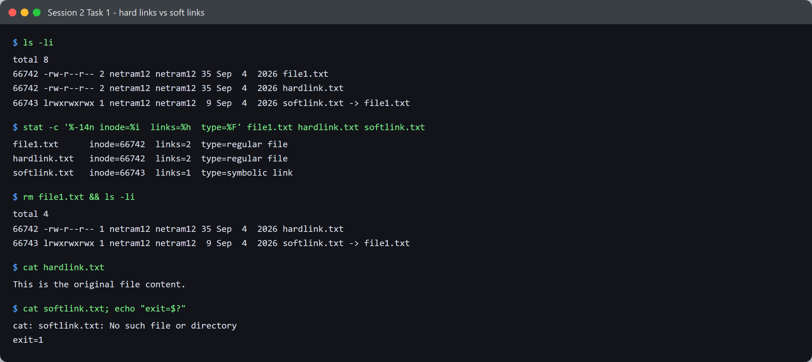

# Session 2 - Linux - Task

- **Name:** Netram
- **Enrollment No:** 24BCS10329

> **Status:** completed

> Run on Ubuntu 24.04.4 LTS under WSL2 (kernel 6.6.87.2-microsoft-standard-WSL2).

---

## Task 1: Hard links vs soft links

### What the task asked

Explain hard links and symbolic links, create both, compare their inode numbers, then
delete the original file and observe what happens to each link.

### My approach

Rather than just describing the difference, I wanted the inode numbers to prove it. `ls -li`
shows the inode in the first column, so if a hard link really is "another name for the same
file" the two lines must show the *same* number. Then deleting the original is the test that
separates the two: one should survive, one should break.

### Commands I ran

```bash
mkdir -p ~/s2-links-task && cd ~/s2-links-task
echo 'This is the original file content.' > file1.txt
ln    file1.txt hardlink.txt      # hard link
ln -s file1.txt softlink.txt      # soft link (symbolic)

ls -li
stat -c '%-14n inode=%i  links=%h  type=%F' file1.txt hardlink.txt softlink.txt

rm file1.txt                      # delete the original
ls -li
cat hardlink.txt
cat softlink.txt
```

### Output



```text
$ ls -li
total 8
66742 -rw-r--r-- 2 netram12 netram12 35 Sep  4  2026 file1.txt
66742 -rw-r--r-- 2 netram12 netram12 35 Sep  4  2026 hardlink.txt
66743 lrwxrwxrwx 1 netram12 netram12  9 Sep  4  2026 softlink.txt -> file1.txt

$ stat -c '%-14n inode=%i  links=%h  type=%F' file1.txt hardlink.txt softlink.txt
file1.txt      inode=66742  links=2  type=regular file
hardlink.txt   inode=66742  links=2  type=regular file
softlink.txt   inode=66743  links=1  type=symbolic link
```

Three things I can read straight off this:

- `file1.txt` and `hardlink.txt` both show **inode 66742** and a link count of **2**. They are
  not an original and a copy - they are two directory entries pointing at one inode.
- `softlink.txt` has its **own inode, 66743**, and a link count of 1. It is a separate file.
- The symlink's size is **9 bytes**, which is exactly the length of the string `file1.txt`.
  That is all a symlink stores: a path, as text.

### Now delete the original

```text
$ rm file1.txt && ls -li
total 4
66742 -rw-r--r-- 1 netram12 netram12 35 Sep  4  2026 hardlink.txt
66743 lrwxrwxrwx 1 netram12 netram12  9 Sep  4  2026 softlink.txt -> file1.txt

$ cat hardlink.txt
This is the original file content.

$ cat softlink.txt; echo "exit=$?"
cat: softlink.txt: No such file or directory
exit=1
```

The hard link's count went from **2 → 1** and the content is still readable. The symlink still
exists as a file (`ls` lists it) but resolving it fails, because the name it stores no longer
exists - a dangling symlink.

This is what `rm` actually does: it removes a *directory entry* and decrements the inode's link
count. The data is only freed when that count hits 0. Deleting `file1.txt` never touched the
data, because `hardlink.txt` was still holding a reference to it.

### Comparison

| | Hard link | Soft (symbolic) link |
|---|---|---|
| Inode | Same as target (66742) | Its own (66743) |
| Stores | Nothing - it *is* the file | A path string, 9 bytes here |
| Original deleted | Still works, count 2 → 1 | Breaks - dangling |
| Across filesystems | No | Yes |
| Can point to a directory | No (not for normal users) | Yes |
| Shows in `ls -l` as | `-rw-r--r--` | `lrwxrwxrwx ... -> target` |

---

## Task 2: `adduser` vs `useradd`

### What the task asked

Compare the two commands for creating users.

### My approach

Run both, then diff the *result* rather than trusting the man pages - check `/etc/passwd`,
check whether a home directory actually appeared, and check what shell each user got.

`adduser` normally prompts for a password and full name. I passed `--disabled-password
--gecos ''` so the run was non-interactive and reproducible.

### Commands I ran

```bash
useradd tu-useradd
adduser --disabled-password --gecos '' tu-adduser

grep -E '^tu-' /etc/passwd
ls -ld /home/tu-useradd /home/tu-adduser
ls -A /home/tu-adduser
```

### Output


`useradd` printed **absolutely nothing** and exited 0. `adduser` narrated every step:

```text
$ adduser --disabled-password --gecos '' tu-adduser
info: Adding user `tu-adduser' ...
info: Selecting UID/GID from range 1000 to 59999 ...
info: Adding new group `tu-adduser' (1003) ...
info: Adding new user `tu-adduser' (1003) with group `tu-adduser (1003)' ...
info: Creating home directory `/home/tu-adduser' ...
info: Copying files from `/etc/skel' ...
info: Adding new user `tu-adduser' to supplemental / extra groups `users' ...
info: Adding user `tu-adduser' to group `users' ...
```

The `/etc/passwd` entries show the real difference:

```text
$ grep -E '^tu-' /etc/passwd
tu-useradd:x:1001:1002::/home/tu-useradd:/bin/sh
tu-adduser:x:1003:1003:,,,:/home/tu-adduser:/bin/bash
```

Both records *name* a home directory - but only one of them exists:

```text
$ ls -ld /home/tu-useradd /home/tu-adduser
ls: cannot access '/home/tu-useradd': No such file or directory
drwxr-x--- 2 tu-adduser tu-adduser 4096 Sep  4 19:54 /home/tu-adduser

$ ls -A /home/tu-adduser
.bash_logout
.bashrc
.profile
```

That is the trap. `useradd` wrote `/home/tu-useradd` into `/etc/passwd` and then **did not
create it**. A user like that can log in and land in a directory that isn't there.

| | `useradd` | `adduser` |
|---|---|---|
| Type | Low-level binary | Perl wrapper around `useradd` |
| Output | Silent | Narrates each step |
| Home directory | Named in passwd but **not created** | Created, mode `drwxr-x---` |
| `/etc/skel` copied | No | Yes - `.bashrc`, `.profile`, `.bash_logout` |
| Default shell | `/bin/sh` | `/bin/bash` |
| Group | Reused GID 1002 | Own group `tu-adduser` (1003), plus `users` |
| Interactive | Never | Prompts unless you pass flags |

Practical read: `adduser` is what you want by hand on Debian/Ubuntu; `useradd` is what you want
in a script or Dockerfile, where you would add `-m -s /bin/bash` yourself. `useradd` is also the
portable one - `adduser` is Debian-family, and on RHEL it is a different program entirely.

### Cleanup

```bash
userdel -r tu-adduser
userdel    tu-useradd     # no -r: there is no home directory to remove
```

---

## What I learned

- A hard link is not a pointer to a file, it *is* the file - same inode, and the link count in
  `ls -li` is literally a reference count. Watching it go 2 → 1 on `rm` made "unlink" finally
  make sense as the name of the syscall.
- A symlink is just a tiny file containing a path. Its 9-byte size being exactly the length of
  `file1.txt` was the detail that made it click, and it explains why symlinks break when the
  target moves while hard links do not care.
- `useradd` recording a home directory it never creates is a genuinely surprising default, and
  it explains the "cannot find home directory" errors people hit after scripting user creation.

## Problems I hit

- **`sudo` wanted a password** in my WSL install, which broke the unattended capture. WSL exposes
  root directly without one, so I ran the user-creation task as `wsl -d Ubuntu -u root` instead
  of going through `sudo`.
- **`adduser` hung the first time** - it prompts for a password and a full name. Adding
  `--disabled-password --gecos ''` made it run start to finish without input.
- I first tried to `cd` in one command and run the next one separately, and the second command
  ran in the wrong directory. Each capture runs its own shell, so only on-disk state carries
  over - I set the working directory per task rather than relying on `cd` persisting.
