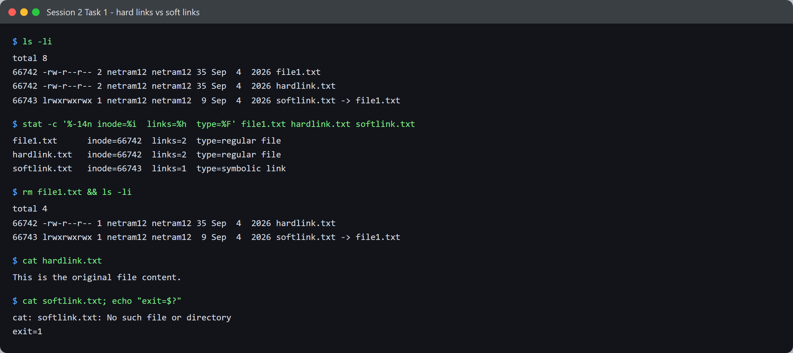
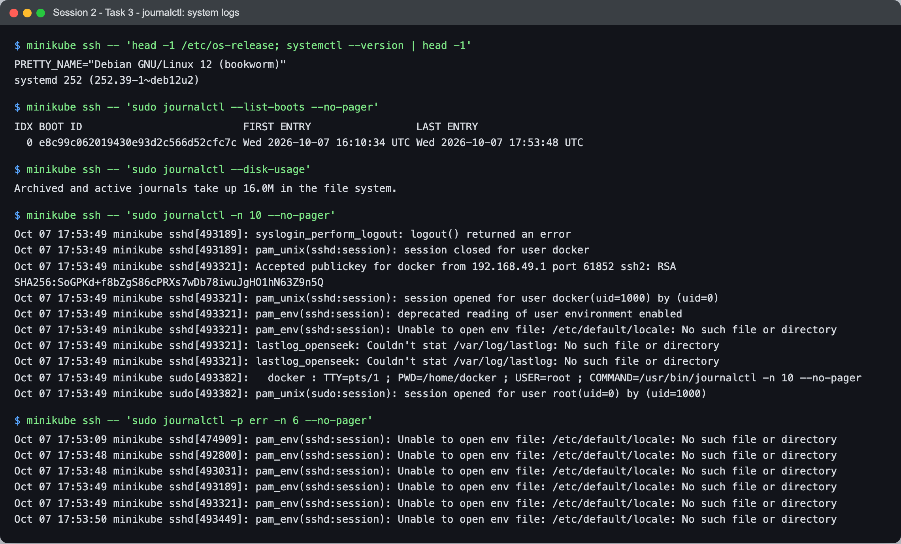
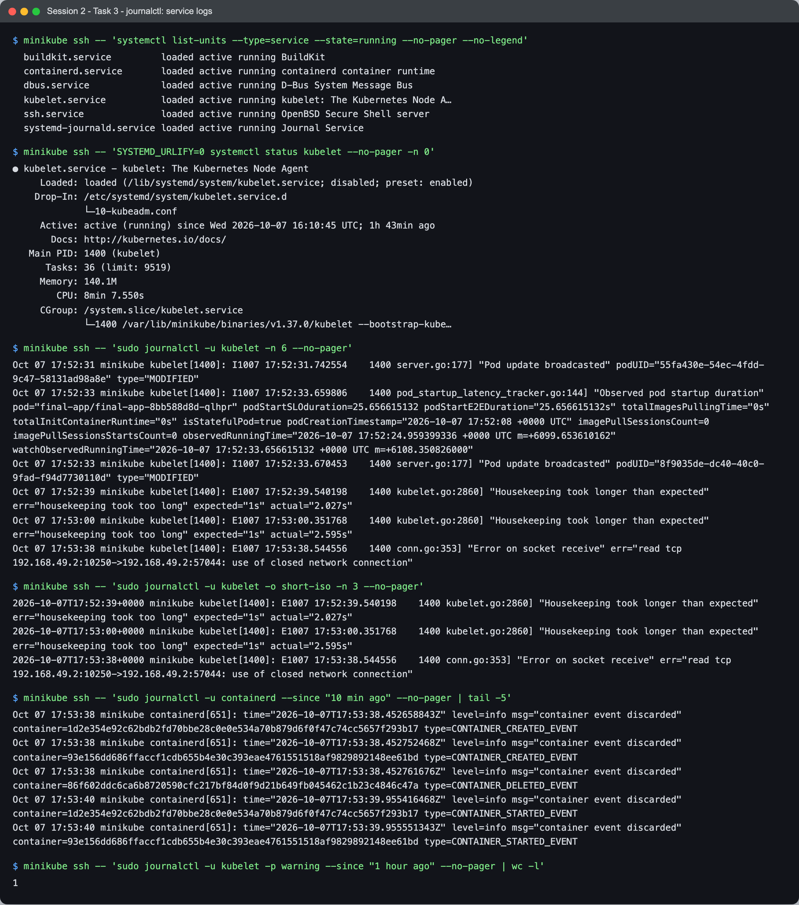
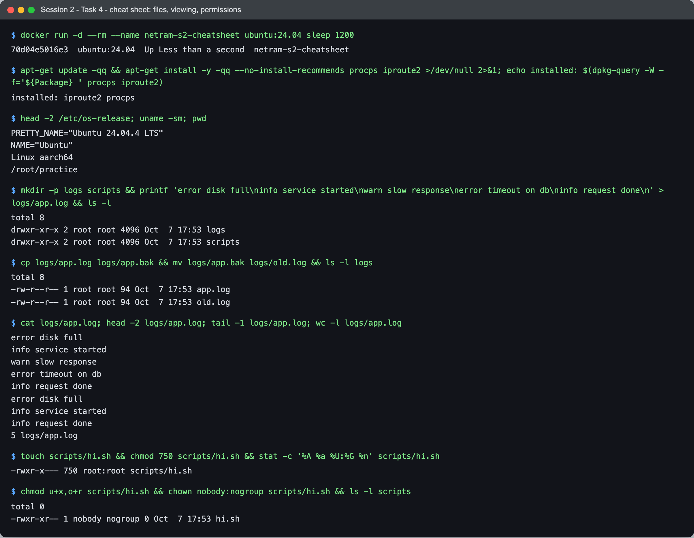
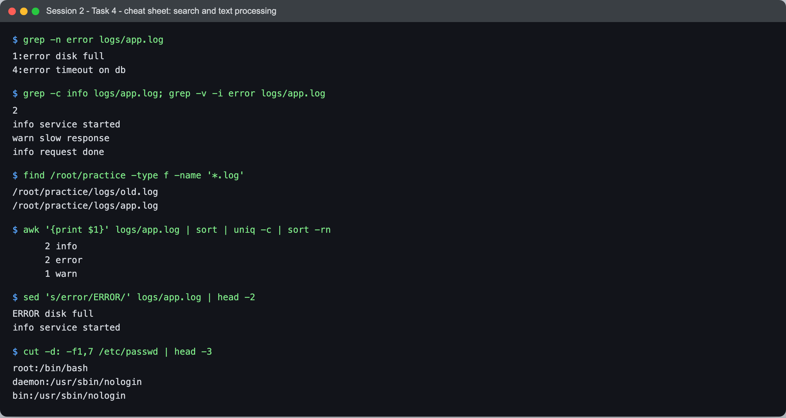
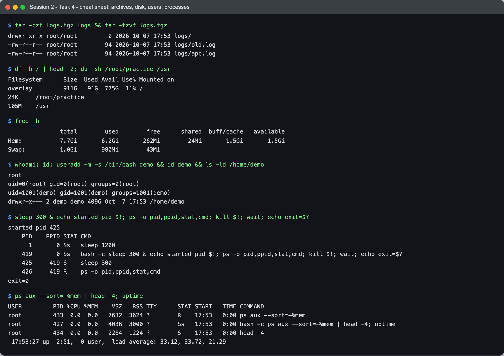
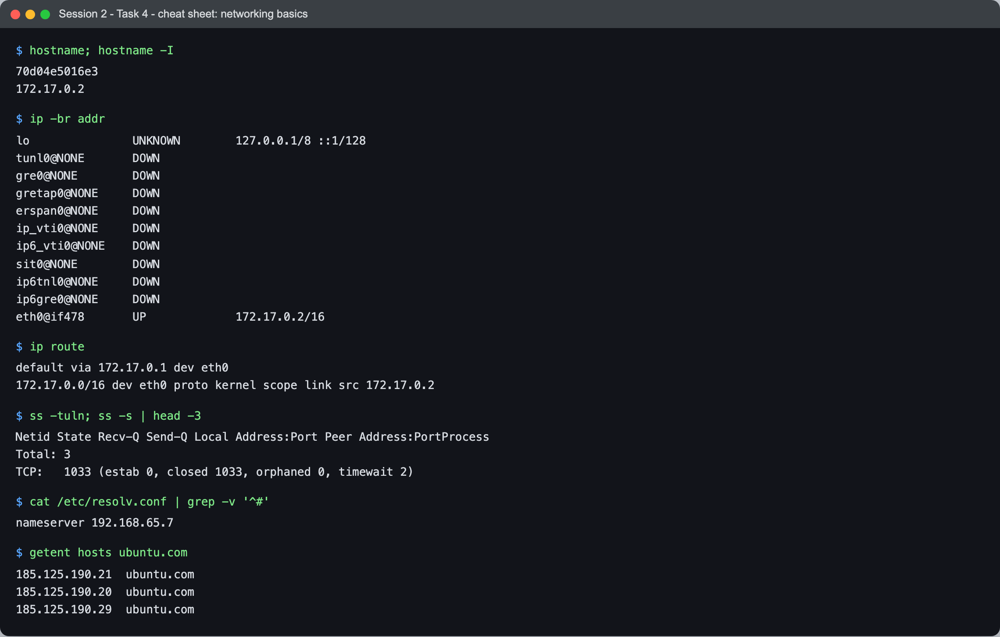

# Session 2 - Linux - Task

- **Name:** Netram
- **Enrollment No:** 24BCS10329

> **Status:** completed

> Run on Ubuntu 24.04.4 LTS under WSL2 (kernel 6.6.87.2-microsoft-standard-WSL2).

---

## Task 1: Hard links vs soft links

### What the task asked

Explain hard links and symbolic links, create both, compare their inode numbers, then
delete the original file and observe what happens to each link.

### My approach

Rather than just describing the difference, I wanted the inode numbers to prove it. `ls -li`
shows the inode in the first column, so if a hard link really is "another name for the same
file" the two lines must show the *same* number. Then deleting the original is the test that
separates the two: one should survive, one should break.

### Commands I ran

```bash
mkdir -p ~/s2-links-task && cd ~/s2-links-task
echo 'This is the original file content.' > file1.txt
ln    file1.txt hardlink.txt      # hard link
ln -s file1.txt softlink.txt      # soft link (symbolic)

ls -li
stat -c '%-14n inode=%i  links=%h  type=%F' file1.txt hardlink.txt softlink.txt

rm file1.txt                      # delete the original
ls -li
cat hardlink.txt
cat softlink.txt
```

### Output



```text
$ ls -li
total 8
66742 -rw-r--r-- 2 netram12 netram12 35 Sep  4  2026 file1.txt
66742 -rw-r--r-- 2 netram12 netram12 35 Sep  4  2026 hardlink.txt
66743 lrwxrwxrwx 1 netram12 netram12  9 Sep  4  2026 softlink.txt -> file1.txt

$ stat -c '%-14n inode=%i  links=%h  type=%F' file1.txt hardlink.txt softlink.txt
file1.txt      inode=66742  links=2  type=regular file
hardlink.txt   inode=66742  links=2  type=regular file
softlink.txt   inode=66743  links=1  type=symbolic link
```

Three things I can read straight off this:

- `file1.txt` and `hardlink.txt` both show **inode 66742** and a link count of **2**. They are
  not an original and a copy - they are two directory entries pointing at one inode.
- `softlink.txt` has its **own inode, 66743**, and a link count of 1. It is a separate file.
- The symlink's size is **9 bytes**, which is exactly the length of the string `file1.txt`.
  That is all a symlink stores: a path, as text.

### Now delete the original

```text
$ rm file1.txt && ls -li
total 4
66742 -rw-r--r-- 1 netram12 netram12 35 Sep  4  2026 hardlink.txt
66743 lrwxrwxrwx 1 netram12 netram12  9 Sep  4  2026 softlink.txt -> file1.txt

$ cat hardlink.txt
This is the original file content.

$ cat softlink.txt; echo "exit=$?"
cat: softlink.txt: No such file or directory
exit=1
```

The hard link's count went from **2 → 1** and the content is still readable. The symlink still
exists as a file (`ls` lists it) but resolving it fails, because the name it stores no longer
exists - a dangling symlink.

This is what `rm` actually does: it removes a *directory entry* and decrements the inode's link
count. The data is only freed when that count hits 0. Deleting `file1.txt` never touched the
data, because `hardlink.txt` was still holding a reference to it.

### Comparison

| | Hard link | Soft (symbolic) link |
|---|---|---|
| Inode | Same as target (66742) | Its own (66743) |
| Stores | Nothing - it *is* the file | A path string, 9 bytes here |
| Original deleted | Still works, count 2 → 1 | Breaks - dangling |
| Across filesystems | No | Yes |
| Can point to a directory | No (not for normal users) | Yes |
| Shows in `ls -l` as | `-rw-r--r--` | `lrwxrwxrwx ... -> target` |

---

## Task 2: `adduser` vs `useradd`

### What the task asked

Compare the two commands for creating users.

### My approach

Run both, then diff the *result* rather than trusting the man pages - check `/etc/passwd`,
check whether a home directory actually appeared, and check what shell each user got.

`adduser` normally prompts for a password and full name. I passed `--disabled-password
--gecos ''` so the run was non-interactive and reproducible.

### Commands I ran

```bash
useradd tu-useradd
adduser --disabled-password --gecos '' tu-adduser

grep -E '^tu-' /etc/passwd
ls -ld /home/tu-useradd /home/tu-adduser
ls -A /home/tu-adduser
```

### Output


`useradd` printed **absolutely nothing** and exited 0. `adduser` narrated every step:

```text
$ adduser --disabled-password --gecos '' tu-adduser
info: Adding user `tu-adduser' ...
info: Selecting UID/GID from range 1000 to 59999 ...
info: Adding new group `tu-adduser' (1003) ...
info: Adding new user `tu-adduser' (1003) with group `tu-adduser (1003)' ...
info: Creating home directory `/home/tu-adduser' ...
info: Copying files from `/etc/skel' ...
info: Adding new user `tu-adduser' to supplemental / extra groups `users' ...
info: Adding user `tu-adduser' to group `users' ...
```

The `/etc/passwd` entries show the real difference:

```text
$ grep -E '^tu-' /etc/passwd
tu-useradd:x:1001:1002::/home/tu-useradd:/bin/sh
tu-adduser:x:1003:1003:,,,:/home/tu-adduser:/bin/bash
```

Both records *name* a home directory - but only one of them exists:

```text
$ ls -ld /home/tu-useradd /home/tu-adduser
ls: cannot access '/home/tu-useradd': No such file or directory
drwxr-x--- 2 tu-adduser tu-adduser 4096 Sep  4 19:54 /home/tu-adduser

$ ls -A /home/tu-adduser
.bash_logout
.bashrc
.profile
```

That is the trap. `useradd` wrote `/home/tu-useradd` into `/etc/passwd` and then **did not
create it**. A user like that can log in and land in a directory that isn't there.

| | `useradd` | `adduser` |
|---|---|---|
| Type | Low-level binary | Perl wrapper around `useradd` |
| Output | Silent | Narrates each step |
| Home directory | Named in passwd but **not created** | Created, mode `drwxr-x---` |
| `/etc/skel` copied | No | Yes - `.bashrc`, `.profile`, `.bash_logout` |
| Default shell | `/bin/sh` | `/bin/bash` |
| Group | Reused GID 1002 | Own group `tu-adduser` (1003), plus `users` |
| Interactive | Never | Prompts unless you pass flags |

Practical read: `adduser` is what you want by hand on Debian/Ubuntu; `useradd` is what you want
in a script or Dockerfile, where you would add `-m -s /bin/bash` yourself. `useradd` is also the
portable one - `adduser` is Debian-family, and on RHEL it is a different program entirely.

### Cleanup

```bash
userdel -r tu-adduser
userdel    tu-useradd     # no -r: there is no home directory to remove
```

---

## Task 3: journalctl

> These two tasks (3 and 4) were run later on macOS (Apple Silicon) via Docker Desktop, because the
> original WSL machine wasn't available. The systemd host for Task 3 is the minikube node (Debian 12,
> systemd 252), reached with `minikube ssh`. Every command here is read-only.

### What the task asked

Explain what `journalctl` is for, view system and service logs, and check the logs of one
specific service.

### What journalctl is

On a systemd machine, every service's stdout/stderr plus kernel and auth messages go to one
place: the journal, kept by `systemd-journald`. `journalctl` is the reader for it. Instead of
hunting through `/var/log/*.log` files, I can filter one indexed store by unit, time, boot and
priority.

### System logs



```text
$ minikube ssh -- 'head -1 /etc/os-release; systemctl --version | head -1'
PRETTY_NAME="Debian GNU/Linux 12 (bookworm)"
systemd 252 (252.39-1~deb12u2)

$ minikube ssh -- 'sudo journalctl --list-boots --no-pager'
IDX BOOT ID                          FIRST ENTRY                 LAST ENTRY                 
  0 e8c99c062019430e93d2c566d52cfc7c Wed 2026-10-07 16:10:34 UTC Wed 2026-10-07 17:53:48 UTC

$ minikube ssh -- 'sudo journalctl --disk-usage'
Archived and active journals take up 16.0M in the file system.

$ minikube ssh -- 'sudo journalctl -n 10 --no-pager'
Oct 07 17:53:49 minikube sshd[493189]: syslogin_perform_logout: logout() returned an error
Oct 07 17:53:49 minikube sshd[493189]: pam_unix(sshd:session): session closed for user docker
Oct 07 17:53:49 minikube sshd[493321]: Accepted publickey for docker from 192.168.49.1 port 61852 ssh2: RSA SHA256:SoGPKd+f8bZgS86cPRXs7wDb78iwuJgHO1hN63Z9n5Q
Oct 07 17:53:49 minikube sshd[493321]: pam_unix(sshd:session): session opened for user docker(uid=1000) by (uid=0)
Oct 07 17:53:49 minikube sshd[493321]: pam_env(sshd:session): deprecated reading of user environment enabled
Oct 07 17:53:49 minikube sshd[493321]: pam_env(sshd:session): Unable to open env file: /etc/default/locale: No such file or directory
Oct 07 17:53:49 minikube sshd[493321]: lastlog_openseek: Couldn't stat /var/log/lastlog: No such file or directory
Oct 07 17:53:49 minikube sshd[493321]: lastlog_openseek: Couldn't stat /var/log/lastlog: No such file or directory
Oct 07 17:53:49 minikube sudo[493382]:   docker : TTY=pts/1 ; PWD=/home/docker ; USER=root ; COMMAND=/usr/bin/journalctl -n 10 --no-pager
Oct 07 17:53:49 minikube sudo[493382]: pam_unix(sudo:session): session opened for user root(uid=0) by (uid=1000)

$ minikube ssh -- 'sudo journalctl -p err -n 6 --no-pager'
Oct 07 17:53:09 minikube sshd[474909]: pam_env(sshd:session): Unable to open env file: /etc/default/locale: No such file or directory
Oct 07 17:53:48 minikube sshd[492800]: pam_env(sshd:session): Unable to open env file: /etc/default/locale: No such file or directory
Oct 07 17:53:48 minikube sshd[493031]: pam_env(sshd:session): Unable to open env file: /etc/default/locale: No such file or directory
Oct 07 17:53:49 minikube sshd[493189]: pam_env(sshd:session): Unable to open env file: /etc/default/locale: No such file or directory
Oct 07 17:53:49 minikube sshd[493321]: pam_env(sshd:session): Unable to open env file: /etc/default/locale: No such file or directory
Oct 07 17:53:50 minikube sshd[493449]: pam_env(sshd:session): Unable to open env file: /etc/default/locale: No such file or directory
```

- `--list-boots` lists each boot the journal knows about. Only boot `0` exists, because the node
  container started at 16:10 and has not rebooted since.
- `--disk-usage` shows how much space the journal takes, 16.0M here.
- `-n 10` shows the last 10 entries, `--no-pager` prints straight out instead of opening `less`
  (needed for a non-interactive run). The newest lines are my own `minikube ssh` login and the
  `sudo journalctl` call itself, so the journal recorded me reading it.
- `-p err` keeps only priority `err` and worse. On this node that is just a harmless sshd
  complaint about a missing `/etc/default/locale`, repeated once per ssh session.

### Logs for a specific service



```text
$ minikube ssh -- 'systemctl list-units --type=service --state=running --no-pager --no-legend'
  buildkit.service         loaded active running BuildKit
  containerd.service       loaded active running containerd container runtime
  dbus.service             loaded active running D-Bus System Message Bus
  kubelet.service          loaded active running kubelet: The Kubernetes Node A…
  ssh.service              loaded active running OpenBSD Secure Shell server
  systemd-journald.service loaded active running Journal Service

$ minikube ssh -- 'SYSTEMD_URLIFY=0 systemctl status kubelet --no-pager -n 0'
● kubelet.service - kubelet: The Kubernetes Node Agent
     Loaded: loaded (/lib/systemd/system/kubelet.service; disabled; preset: enabled)
    Drop-In: /etc/systemd/system/kubelet.service.d
             └─10-kubeadm.conf
     Active: active (running) since Wed 2026-10-07 16:10:45 UTC; 1h 43min ago
       Docs: http://kubernetes.io/docs/
   Main PID: 1400 (kubelet)
      Tasks: 36 (limit: 9519)
     Memory: 140.1M
        CPU: 8min 7.550s
     CGroup: /system.slice/kubelet.service
             └─1400 /var/lib/minikube/binaries/v1.37.0/kubelet --bootstrap-kube…

$ minikube ssh -- 'sudo journalctl -u kubelet -n 6 --no-pager'
Oct 07 17:52:31 minikube kubelet[1400]: I1007 17:52:31.742554    1400 server.go:177] "Pod update broadcasted" podUID="55fa430e-54ec-4fdd-9c47-58131ad98a8e" type="MODIFIED"
Oct 07 17:52:33 minikube kubelet[1400]: I1007 17:52:33.659806    1400 pod_startup_latency_tracker.go:144] "Observed pod startup duration" pod="final-app/final-app-8bb588d8d-qlhpr" podStartSLOduration=25.656615132 podStartE2EDuration="25.656615132s" totalImagesPullingTime="0s" totalInitContainerRuntime="0s" isStatefulPod=true podCreationTimestamp="2026-10-07 17:52:08 +0000 UTC" imagePullSessionsCount=0 imagePullSessionsStartsCount=0 observedRunningTime="2026-10-07 17:52:24.959399336 +0000 UTC m=+6099.653610162" watchObservedRunningTime="2026-10-07 17:52:33.656615132 +0000 UTC m=+6108.350826000"
Oct 07 17:52:33 minikube kubelet[1400]: I1007 17:52:33.670453    1400 server.go:177] "Pod update broadcasted" podUID="8f9035de-dc40-40c0-9fad-f94d7730110d" type="MODIFIED"
Oct 07 17:52:39 minikube kubelet[1400]: E1007 17:52:39.540198    1400 kubelet.go:2860] "Housekeeping took longer than expected" err="housekeeping took too long" expected="1s" actual="2.027s"
Oct 07 17:53:00 minikube kubelet[1400]: E1007 17:53:00.351768    1400 kubelet.go:2860] "Housekeeping took longer than expected" err="housekeeping took too long" expected="1s" actual="2.595s"
Oct 07 17:53:38 minikube kubelet[1400]: E1007 17:53:38.544556    1400 conn.go:353] "Error on socket receive" err="read tcp 192.168.49.2:10250->192.168.49.2:57044: use of closed network connection"

$ minikube ssh -- 'sudo journalctl -u kubelet -o short-iso -n 3 --no-pager'
2026-10-07T17:52:39+0000 minikube kubelet[1400]: E1007 17:52:39.540198    1400 kubelet.go:2860] "Housekeeping took longer than expected" err="housekeeping took too long" expected="1s" actual="2.027s"
2026-10-07T17:53:00+0000 minikube kubelet[1400]: E1007 17:53:00.351768    1400 kubelet.go:2860] "Housekeeping took longer than expected" err="housekeeping took too long" expected="1s" actual="2.595s"
2026-10-07T17:53:38+0000 minikube kubelet[1400]: E1007 17:53:38.544556    1400 conn.go:353] "Error on socket receive" err="read tcp 192.168.49.2:10250->192.168.49.2:57044: use of closed network connection"

$ minikube ssh -- 'sudo journalctl -u containerd --since "10 min ago" --no-pager | tail -5'
Oct 07 17:53:38 minikube containerd[651]: time="2026-10-07T17:53:38.452658843Z" level=info msg="container event discarded" container=1d2e354e92c62bdb2fd70bbe28c0e0e534a70b879d6f0f47c74cc5657f293b17 type=CONTAINER_CREATED_EVENT
Oct 07 17:53:38 minikube containerd[651]: time="2026-10-07T17:53:38.452752468Z" level=info msg="container event discarded" container=93e156dd686ffaccf1cdb655b4e30c393eae4761551518af9829892148ee61bd type=CONTAINER_CREATED_EVENT
Oct 07 17:53:38 minikube containerd[651]: time="2026-10-07T17:53:38.452761676Z" level=info msg="container event discarded" container=86f602ddc6ca6b8720590cfc217bf84d0f9d21b649fb045462c1b23c4846c47a type=CONTAINER_DELETED_EVENT
Oct 07 17:53:40 minikube containerd[651]: time="2026-10-07T17:53:39.955416468Z" level=info msg="container event discarded" container=1d2e354e92c62bdb2fd70bbe28c0e0e534a70b879d6f0f47c74cc5657f293b17 type=CONTAINER_STARTED_EVENT
Oct 07 17:53:40 minikube containerd[651]: time="2026-10-07T17:53:39.955551343Z" level=info msg="container event discarded" container=93e156dd686ffaccf1cdb655b4e30c393eae4761551518af9829892148ee61bd type=CONTAINER_STARTED_EVENT

$ minikube ssh -- 'sudo journalctl -u kubelet -p warning --since "1 hour ago" --no-pager | wc -l'
1
```

- `systemctl list-units --type=service --state=running` first, to see which units exist to ask
  about: `kubelet`, `containerd`, `ssh`, `systemd-journald` and a few more.
- `systemctl status kubelet` gives the summary: active (running) for 1h 43min, PID 1400, 140M
  memory. `-n 0` hides the log tail so it is just the status.
- `-u kubelet` filters to one unit. This is the "logs for a specific service" part.
- `-o short-iso` changes the output format to an ISO 8601 timestamp, which is easier to sort and
  compare across machines than `Oct 07 17:52:39`.
- `--since "10 min ago"` limits by time. Combined with `-u containerd` it shows only the
  container runtime's recent events.
- `-p warning` with `-u kubelet` returned a single line. The kubelet lines starting with `E1007`
  are its own error level, but journald stores whatever a service writes to stderr at its
  default priority, so filtering by `-p` does not catch them. To find kubelet errors I would
  `grep ' E1'` on the `-u kubelet` output instead.
- `-f` (follow, like `tail -f`) is the one I would use live while restarting a service. I left it
  out here because it never exits, so it can't be captured in a one-shot run.

| Option | What it does |
|---|---|
| `-u <unit>` | Only that service's logs |
| `-n <N>` | Last N lines |
| `-f` | Follow new lines live |
| `--since` / `--until` | Time window, e.g. `"10 min ago"`, `today` |
| `-p <prio>` | Priority filter: `emerg`..`debug`, e.g. `err` |
| `-b` / `--list-boots` | Current boot / list of boots |
| `-o short-iso` | Output format (also `json`, `cat`, `verbose`) |
| `--disk-usage` | Size of the journal on disk |
| `--no-pager` | Print instead of opening `less` |

---

## Task 4: Linux command cheat sheet

> Run later on macOS (Apple Silicon) via Docker Desktop, because the original WSL machine wasn't
> available. Practice was done in a fresh `ubuntu:24.04` container
> (`docker run -d --rm --name netram-s2-cheatsheet ubuntu:24.04 sleep 1200`), working in
> `/root/practice`, and the container was removed afterwards.

### What the task asked

Review the course cheat sheets (`basic-linux.pdf`, `ad-linux.pdf`, `Linux Networking Cheat
Sheet.pdf` in `session2-linux/`) and practise the important commands.

### My approach

I used the three PDFs as a list of areas to cover and picked the commands I would actually
reach for in each: files, viewing, permissions, search, text processing, archives, disk, users,
processes and networking.
The base Ubuntu image ships without `ps`, `free`, `ip` or `ss`, so the first thing I did was
`apt-get install procps iproute2` inside the container. I made a small `app.log` with mixed
error/info/warn lines so the search and text commands had something real to work on.

### Files, viewing and permissions



```text
$ docker run -d --rm --name netram-s2-cheatsheet ubuntu:24.04 sleep 1200
70d04e5016e3  ubuntu:24.04  Up Less than a second  netram-s2-cheatsheet

$ apt-get update -qq && apt-get install -y -qq --no-install-recommends procps iproute2 >/dev/null 2>&1; echo installed: $(dpkg-query -W -f='${Package} ' procps iproute2)
installed: iproute2 procps

$ head -2 /etc/os-release; uname -sm; pwd
PRETTY_NAME="Ubuntu 24.04.4 LTS"
NAME="Ubuntu"
Linux aarch64
/root/practice

$ mkdir -p logs scripts && printf 'error disk full\ninfo service started\nwarn slow response\nerror timeout on db\ninfo request done\n' > logs/app.log && ls -l
total 8
drwxr-xr-x 2 root root 4096 Oct  7 17:53 logs
drwxr-xr-x 2 root root 4096 Oct  7 17:53 scripts

$ cp logs/app.log logs/app.bak && mv logs/app.bak logs/old.log && ls -l logs
total 8
-rw-r--r-- 1 root root 94 Oct  7 17:53 app.log
-rw-r--r-- 1 root root 94 Oct  7 17:53 old.log

$ cat logs/app.log; head -2 logs/app.log; tail -1 logs/app.log; wc -l logs/app.log
error disk full
info service started
warn slow response
error timeout on db
info request done
error disk full
info service started
info request done
5 logs/app.log

$ touch scripts/hi.sh && chmod 750 scripts/hi.sh && stat -c '%A %a %U:%G %n' scripts/hi.sh
-rwxr-x--- 750 root:root scripts/hi.sh

$ chmod u+x,o+r scripts/hi.sh && chown nobody:nogroup scripts/hi.sh && ls -l scripts
total 0
-rwxr-xr-- 1 nobody nogroup 0 Oct  7 17:53 hi.sh
```

### Search and text processing



```text
$ grep -n error logs/app.log
1:error disk full
4:error timeout on db

$ grep -c info logs/app.log; grep -v -i error logs/app.log
2
info service started
warn slow response
info request done

$ find /root/practice -type f -name '*.log'
/root/practice/logs/old.log
/root/practice/logs/app.log

$ awk '{print $1}' logs/app.log | sort | uniq -c | sort -rn
      2 info
      2 error
      1 warn

$ sed 's/error/ERROR/' logs/app.log | head -2
ERROR disk full
info service started

$ cut -d: -f1,7 /etc/passwd | head -3
root:/bin/bash
daemon:/usr/sbin/nologin
bin:/usr/sbin/nologin
```

### Archives, disk, users and processes



```text
$ tar -czf logs.tgz logs && tar -tzvf logs.tgz
drwxr-xr-x root/root         0 2026-10-07 17:53 logs/
-rw-r--r-- root/root        94 2026-10-07 17:53 logs/old.log
-rw-r--r-- root/root        94 2026-10-07 17:53 logs/app.log

$ df -h / | head -2; du -sh /root/practice /usr
Filesystem      Size  Used Avail Use% Mounted on
overlay         911G   91G  775G  11% /
24K	/root/practice
105M	/usr

$ free -h
               total        used        free      shared  buff/cache   available
Mem:           7.7Gi       6.2Gi       262Mi        24Mi       1.5Gi       1.5Gi
Swap:          1.0Gi       980Mi        43Mi

$ whoami; id; useradd -m -s /bin/bash demo && id demo && ls -ld /home/demo
root
uid=0(root) gid=0(root) groups=0(root)
uid=1001(demo) gid=1001(demo) groups=1001(demo)
drwxr-x--- 2 demo demo 4096 Oct  7 17:53 /home/demo

$ sleep 300 & echo started pid $!; ps -o pid,ppid,stat,cmd; kill $!; wait; echo exit=$?
started pid 425
    PID    PPID STAT CMD
      1       0 Ss   sleep 1200
    419       0 Ss   bash -c sleep 300 & echo started pid $!; ps -o pid,ppid,stat,cmd; kill $!; wait; echo exit=$?
    425     419 S    sleep 300
    426     419 R    ps -o pid,ppid,stat,cmd
exit=0

$ ps aux --sort=-%mem | head -4; uptime
USER         PID %CPU %MEM    VSZ   RSS TTY      STAT START   TIME COMMAND
root         433  0.0  0.0   7632  3624 ?        R    17:53   0:00 ps aux --sort=-%mem
root         427  0.0  0.0   4036  3000 ?        Ss   17:53   0:00 bash -c ps aux --sort=-%mem | head -4; uptime
root         434  0.0  0.0   2284  1224 ?        S    17:53   0:00 head -4
 17:53:27 up  2:51,  0 user,  load average: 33.12, 33.72, 21.29
```

### Networking basics



```text
$ hostname; hostname -I
70d04e5016e3
172.17.0.2

$ ip -br addr
lo               UNKNOWN        127.0.0.1/8 ::1/128 
tunl0@NONE       DOWN           
gre0@NONE        DOWN           
gretap0@NONE     DOWN           
erspan0@NONE     DOWN           
ip_vti0@NONE     DOWN           
ip6_vti0@NONE    DOWN           
sit0@NONE        DOWN           
ip6tnl0@NONE     DOWN           
ip6gre0@NONE     DOWN           
eth0@if478       UP             172.17.0.2/16

$ ip route
default via 172.17.0.1 dev eth0 
172.17.0.0/16 dev eth0 proto kernel scope link src 172.17.0.2

$ ss -tuln; ss -s | head -3
Netid State Recv-Q Send-Q Local Address:Port Peer Address:PortProcess
Total: 3
TCP:   1033 (estab 0, closed 1033, orphaned 0, timewait 2)

$ cat /etc/resolv.conf | grep -v '^#'

nameserver 192.168.65.7

$ getent hosts ubuntu.com
185.125.190.21  ubuntu.com
185.125.190.20  ubuntu.com
185.125.190.29  ubuntu.com
```

### Summary table

| Command | Purpose | What I saw |
|---|---|---|
| `uname -sm`, `/etc/os-release` | Which OS and CPU | `Linux aarch64`, Ubuntu 24.04.4 LTS |
| `pwd`, `mkdir -p`, `ls -l` | Where am I, make dirs, list | `/root/practice`, `logs/` and `scripts/` |
| `cp`, `mv` | Copy, rename | `app.bak` renamed to `old.log`, both 94 bytes |
| `cat`, `head`, `tail`, `wc -l` | View files, count lines | `head -2` first two lines, `tail -1` last, 5 lines |
| `chmod 750`, `stat -c` | Set and read permissions | `-rwxr-x--- 750 root:root` |
| `chmod u+x,o+r`, `chown` | Symbolic mode, change owner | `-rwxr-xr-- nobody nogroup` |
| `grep -n`, `grep -c`, `grep -v -i` | Search, count, invert | Lines 1 and 4 are errors, 2 info lines |
| `find -type f -name` | Find files by name | Both `.log` files under `logs/` |
| `awk`, `sort`, `uniq -c` | Count by first column | 2 info, 2 error, 1 warn |
| `sed 's/a/b/'` | Stream replace | `ERROR disk full` (file itself unchanged) |
| `cut -d: -f1,7` | Pick fields | `root:/bin/bash`, system users get `nologin` |
| `tar -czf` / `tar -tzvf` | Create / list a gzip archive | `logs/`, `old.log`, `app.log` |
| `df -h`, `du -sh` | Free disk, size of a dir | Overlay root 911G, practice dir 24K, `/usr` 105M |
| `free -h` | Memory and swap | 7.7Gi total (Docker Desktop VM, not the Mac) |
| `whoami`, `id`, `useradd -m` | Who am I, create a user | root, `demo` got uid 1001 and a home dir |
| `&`, `$!`, `ps -o`, `kill`, `wait` | Background job, find and stop it | `sleep 300` as PID 425, killed |
| `ps aux --sort=-%mem`, `uptime` | Top processes, load | Load average 33 (the shared Docker VM was busy) |
| `hostname`, `hostname -I` | Name and IP | Container ID as hostname, `172.17.0.2` |
| `ip -br addr` | Interfaces, brief | `eth0` UP with `172.17.0.2/16`, `lo` |
| `ip route` | Routing table | Default via `172.17.0.1` (the docker bridge) |
| `ss -tuln`, `ss -s` | Listening sockets, summary | Nothing listening, which is right for a bare container |
| `/etc/resolv.conf` | DNS server in use | `192.168.65.7`, Docker Desktop's resolver |
| `getent hosts` | Resolve a name | `ubuntu.com` to three `185.125.190.x` addresses |

---

## What I learned

- A hard link is not a pointer to a file, it *is* the file - same inode, and the link count in
  `ls -li` is literally a reference count. Watching it go 2 → 1 on `rm` made "unlink" finally
  make sense as the name of the syscall.
- A symlink is just a tiny file containing a path. Its 9-byte size being exactly the length of
  `file1.txt` was the detail that made it click, and it explains why symlinks break when the
  target moves while hard links do not care.
- `useradd` recording a home directory it never creates is a genuinely surprising default, and
  it explains the "cannot find home directory" errors people hit after scripting user creation.
- `journalctl -u <service>` is the first place to look when a service misbehaves, and `-p` is not
  a reliable error filter: kubelet writes its `E` lines at the default priority, so `-p warning`
  missed them.
- Even a stripped-down Ubuntu container doesn't have `ps` or `ip`. Knowing which package provides
  a command (`procps`, `iproute2`) matters as much as knowing the command.

## Problems I hit

- **`sudo` wanted a password** in my WSL install, which broke the unattended capture. WSL exposes
  root directly without one, so I ran the user-creation task as `wsl -d Ubuntu -u root` instead
  of going through `sudo`.
- **`adduser` hung the first time** - it prompts for a password and a full name. Adding
  `--disabled-password --gecos ''` made it run start to finish without input.
- I first tried to `cd` in one command and run the next one separately, and the second command
  ran in the wrong directory. Each capture runs its own shell, so only on-disk state carries
  over - I set the working directory per task rather than relying on `cd` persisting.
- **WSL machine not available for Tasks 3 and 4.** WSL also doesn't run systemd by default, so I
  used the minikube node (Debian 12 with systemd) for `journalctl` and an `ubuntu:24.04` container
  for the cheat sheet practice.
- **Pipes ran on the wrong side.** My first `minikube ssh -- sudo journalctl ... | tail` ran `tail`
  on my Mac, and `--since '10 min ago'` failed with `Failed to parse timestamp: 10` because the
  quotes were lost. Wrapping the whole remote command in one set of quotes fixed both.
- **`systemctl status` printed hyperlink escape codes** in the captured output. Setting
  `SYSTEMD_URLIFY=0` turned them off.
