# Session 20 - Monitoring, Observability & GitOps - Task

- **Name:** Netram
- **Enrollment No:** 24BCS10329

> **Status:** completed

> Run on macOS (Apple Silicon) with Docker Desktop, minikube v1.39.0, Kubernetes v1.37.0, kube-prometheus-stack 92.1.0 (Prometheus 3.15.0, Alertmanager 0.34.1, Grafana 13.2.3), Argo CD v3.5.4 (argo-cd Helm chart 10.10.0).

Every command output below was copied from a real run on my cluster, and every screenshot is from that same run.

## Contents

| Task | What I did | Where |
|---|---|---|
| 1. Monitoring | kube-prometheus-stack, a demo app with `/metrics`, a ServiceMonitor, three alert rules that I made fire on purpose, CPU and memory dashboards, app health from probes and `up`, logs with `kubectl logs` | [Task 1](#task-1---monitoring), `monitoring/` |
| 2. Observability | Pillars, why, tools, Kubernetes observability | [observability/README.md](observability/README.md) |
| 3. GitOps | Concepts, then a real Argo CD demo against this repo and branch: initial sync, a Git change, self-heal, prune | [Task 3](#task-3---gitops-with-argo-cd), `gitops/` |

```text
task/
|-- README.md                         this file
|-- observability/README.md           Task 2 documentation
|-- monitoring/
|   |-- helm/kube-prometheus-stack-values.yaml   lean values (release name "monitoring")
|   |-- demo-app/                     namespace, podinfo + Service, ServiceMonitor, load generator,
|   |                                 PrometheusRule, cpu-burner pod
|   `-- grafana/s20-demo-dashboard-configmap.yaml  my dashboard, loaded by the Grafana sidecar
|-- gitops/
|   |-- argocd/argocd-values.yaml     minimal Argo CD values
|   |-- argocd/application.yaml       the Argo CD Application (applied once by hand)
|   `-- apps/podinfo/                 what Argo CD syncs: kustomize base + overlays/dev
`-- screenshots/
```

## Architecture

```text
                        my laptop (macOS, Docker Desktop)
   kubectl / helm / git push        browser via kubectl port-forward (18601-18604)
          |                                   |
          |              GitHub: netram75/devops-heros, branch session20-gitops
          |              path task/gitops/apps/podinfo/overlays/dev
          |                                   ^
          v                                   | polls every ~30s
 +--------------------------- minikube (1 node, k8s v1.37) ---------------------------+
 |                                            |                                       |
 |  ns argocd                                 |                                       |
 |   argocd-repo-server --- renders kustomize-+                                       |
 |   argocd-application-controller --- compares Git vs live, syncs, self-heals,       |
 |   argocd-server (UI :18604)          prunes ---------------------+                 |
 |                                                                  v                 |
 |                                                   ns s20-gitops: podinfo Deployment|
 |                                                   + Service (managed by Argo CD)   |
 |                                                                                    |
 |  ns s20-monitoring-demo                        ns monitoring                       |
 |   podinfo x2 (/metrics, /healthz, /readyz) <--- Prometheus (:18601) scrapes via    |
 |   loadgen (curl loop)                      ServiceMonitor; also kubelet/cAdvisor,  |
 |   cpu-burner (only to fire an alert)       node-exporter, kube-state-metrics      |
 |   ServiceMonitor, PrometheusRule ------->  rules evaluated --firing--> Alertmanager|
 |                                            (:18603)                                |
 |                                            Grafana (:18602) queries Prometheus     |
 +------------------------------------------------------------------------------------+
```

## Setup

The minikube VM is shared with other work and the whole Docker VM only has about 7.7 GB, so I kept
both installs small. For kube-prometheus-stack ([values](monitoring/helm/kube-prometheus-stack-values.yaml)):
retention 2h, no persistent volumes, small requests and limits, and I turned off scraping of etcd,
kube-controller-manager, kube-scheduler and kube-proxy because minikube binds them to 127.0.0.1 and they
would only show as permanently down targets. `serviceMonitorSelectorNilUsesHelmValues: false` (and the
same for rules) lets Prometheus pick up my ServiceMonitor and PrometheusRule from any namespace.
For Argo CD ([values](gitops/argocd/argocd-values.yaml)): one replica of everything, Dex, notifications
and the ApplicationSet controller off, plain HTTP behind port-forward, and Git polling every 30s
instead of the default 120s so the demo does not take forever.

```bash
helm repo add prometheus-community https://prometheus-community.github.io/helm-charts
helm repo add argo https://argoproj.github.io/argo-helm
helm upgrade --install monitoring prometheus-community/kube-prometheus-stack --version 92.1.0 \
  -n monitoring --create-namespace -f monitoring/helm/kube-prometheus-stack-values.yaml --wait
helm upgrade --install argocd argo/argo-cd --version 10.10.0 \
  -n argocd --create-namespace -f gitops/argocd/argocd-values.yaml --wait

kubectl apply -f monitoring/demo-app/          # minus 50-cpu-burner.yaml, which comes later
kubectl apply -f monitoring/grafana/s20-demo-dashboard-configmap.yaml

kubectl -n monitoring port-forward svc/monitoring-prometheus 18601:9090 &
kubectl -n monitoring port-forward svc/monitoring-grafana 18602:80 &
kubectl -n monitoring port-forward svc/monitoring-alertmanager 18603:9093 &
kubectl -n argocd port-forward svc/argocd-server 18604:80 &
```

Logins: Grafana is `admin` with the password from secret `monitoring-grafana` (key `admin-password`),
Argo CD is `admin` with the password from secret `argocd-initial-admin-secret`.

---

## Task 1 - Monitoring

The demo app is [podinfo](https://github.com/stefanprodan/podinfo), a small Go web server that already
exposes Prometheus metrics on `/metrics`, liveness on `/healthz`, readiness on `/readyz`, and has a
`/panic` endpoint that crashes the process, which is handy for testing restarts. Two replicas run in
`s20-monitoring-demo` behind a Service with a port named `http`. A `loadgen` pod curls `/` and
`/status/500` in a loop so there is real traffic with both good and bad status codes.

The [ServiceMonitor](monitoring/demo-app/20-servicemonitor.yaml) selects the Service by `app: podinfo`,
points at the port **name** `http`, and carries `release: monitoring` (the same label the Task 2 doc
uses, matching my Helm release name).

### 1.1 Metrics: the stack and the scrape targets

```text
$ helm list -n monitoring
NAME      	NAMESPACE 	REVISION	UPDATED                             	STATUS  	CHART                       	APP VERSION
monitoring	monitoring	3       	2026-10-07 22:47:01.994126 +0530 IST	deployed	kube-prometheus-stack-92.1.0	v0.94.1

$ kubectl get pods -n monitoring
NAME                                             READY   STATUS    RESTARTS      AGE
alertmanager-monitoring-alertmanager-0           2/2     Running   0             31m
monitoring-grafana-67d668f676-42ckd              3/3     Running   0             8m45s
monitoring-kube-state-metrics-7458845f88-jf8h8   1/1     Running   0             31m
monitoring-operator-6b9d5fcc7f-rklp7             1/1     Running   1 (23m ago)   31m
monitoring-prometheus-node-exporter-ngbs7        1/1     Running   0             31m
prometheus-monitoring-prometheus-0               2/2     Running   0             31m

$ kubectl top nodes; kubectl top pods -n monitoring --sort-by=memory
NAME       CPU(cores)   CPU(%)   MEMORY(bytes)   MEMORY(%)   
minikube   737m         4%       3563Mi          44%         
NAME                                             CPU(cores)   MEMORY(bytes)   
prometheus-monitoring-prometheus-0               61m          586Mi           
monitoring-grafana-67d668f676-42ckd              24m          464Mi           
alertmanager-monitoring-alertmanager-0           4m           49Mi            
monitoring-operator-6b9d5fcc7f-rklp7             8m           34Mi            
monitoring-kube-state-metrics-7458845f88-jf8h8   4m           30Mi            
monitoring-prometheus-node-exporter-ngbs7        4m           17Mi

$ kubectl get deploy,svc,servicemonitor,prometheusrule -n s20-monitoring-demo
NAME                      READY   UP-TO-DATE   AVAILABLE   AGE
deployment.apps/loadgen   1/1     1            1           25m
deployment.apps/podinfo   2/2     2            2           25m

NAME              TYPE        CLUSTER-IP      EXTERNAL-IP   PORT(S)    AGE
service/podinfo   ClusterIP   10.106.240.37   <none>        9898/TCP   25m

NAME                                           AGE
servicemonitor.monitoring.coreos.com/podinfo   25m

NAME                                                   AGE
prometheusrule.monitoring.coreos.com/s20-demo-alerts   25m

$ curl -s localhost:18601/api/v1/targets?state=active | jq -r '.data.activeTargets[] | select(.labels.namespace=="s20-monitoring-demo") | "\(.scrapePool)  \(.scrapeUrl)  health=\(.health)"'
serviceMonitor/s20-monitoring-demo/podinfo/0  http://10.244.0.243:9898/metrics  health=up
serviceMonitor/s20-monitoring-demo/podinfo/0  http://10.244.0.242:9898/metrics  health=up

$ curl -s localhost:18601/api/v1/query --data-urlencode 'query=up{namespace="s20-monitoring-demo"}' | jq -r '.data.result[] | "up{pod=\(.metric.pod)} = \(.value[1])"'
up{pod=podinfo-7657c78576-m5wlw} = 1
up{pod=podinfo-7657c78576-rhvn6} = 1

$ kubectl exec -n s20-monitoring-demo deploy/loadgen -- curl -s podinfo:9898/metrics | grep -E '^http_requests_total|^process_resident_memory_bytes|^go_goroutines'
go_goroutines 10
http_requests_total{status="200"} 1118
http_requests_total{status="500"} 712
process_resident_memory_bytes 2.4936448e+07
```

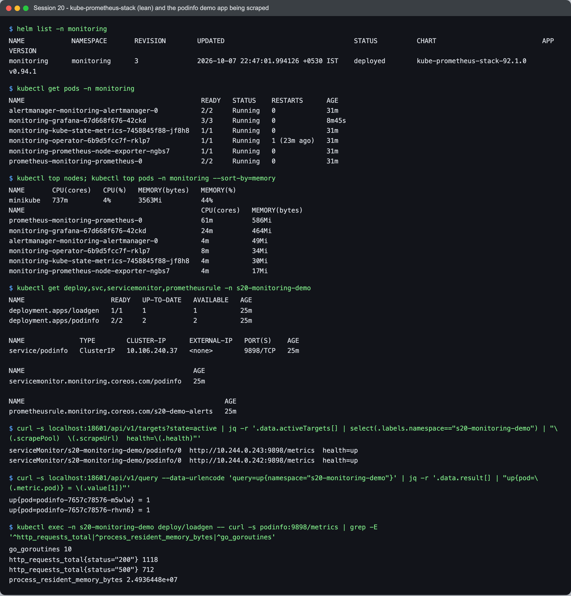

Both podinfo pods show up as `serviceMonitor/s20-monitoring-demo/podinfo/0` targets with `health=up`.
The last command reads `/metrics` directly: `http_requests_total` is the app's own counter, split by
status code, which is what the request-rate panel in Grafana graphs.

### 1.2 Application health and logs

Health comes from three places, and I used all of them:

- **Probes**: liveness on `/healthz` (restart the container if it fails) and readiness on `/readyz`
  (take it out of the Service if it fails).
- **`up`**: Prometheus sets `up=1` for every target it scraped successfully, and `up=0` or no series at
  all when the app is gone. My `DemoAppDown` alert is built on this.
- **kube-state-metrics**: `kube_pod_status_ready` and `kube_pod_container_status_restarts_total` say
  what Kubernetes thinks of the pods.

Logs: podinfo writes JSON lines to stdout, so `kubectl logs` shows them, and `--previous` shows the log
of the container that crashed (see 1.3). I did not install Loki: after kube-prometheus-stack and Argo CD
the minikube container was at about 3.4 GiB of its 4 GiB, so adding a log store would have risked
OOM kills for everyone on the node. The Task 2 doc explains how Loki and Alloy would fit in.

```text
$ kubectl get deploy podinfo -n s20-monitoring-demo -o jsonpath='{.spec.template.spec.containers[0].livenessProbe}{"\n"}{.spec.template.spec.containers[0].readinessProbe}{"\n"}'
{"failureThreshold":3,"httpGet":{"path":"/healthz","port":"http","scheme":"HTTP"},"periodSeconds":5,"successThreshold":1,"timeoutSeconds":1}
{"failureThreshold":3,"httpGet":{"path":"/readyz","port":"http","scheme":"HTTP"},"periodSeconds":5,"successThreshold":1,"timeoutSeconds":1}

$ kubectl exec -n s20-monitoring-demo deploy/loadgen -- sh -c 'curl -s -w " HTTP %{http_code}\n" podinfo:9898/healthz; curl -s -w " HTTP %{http_code}\n" podinfo:9898/readyz'
{
  "status": "OK"
} HTTP 200
{
  "status": "OK"
} HTTP 200

$ curl -s localhost:18601/api/v1/query --data-urlencode 'query=kube_pod_status_ready{namespace="s20-monitoring-demo",condition="true"}' | jq -r '.data.result[] | "ready{pod=\(.metric.pod)} = \(.value[1])"'
ready{pod=loadgen-66f79869f7-fqp6q} = 1
ready{pod=podinfo-7657c78576-m5wlw} = 1
ready{pod=podinfo-7657c78576-rhvn6} = 1
ready{pod=cpu-burner} = 1

$ kubectl logs -n s20-monitoring-demo deploy/podinfo --tail=4 | cut -c1-170
Found 2 pods, using pod/podinfo-7657c78576-rhvn6
{"level":"info","ts":"2026-10-07T17:00:59.649Z","caller":"podinfo/main.go:153","msg":"Starting podinfo","version":"6.9.2","revision":"e86405a8674ecab990d0a389824c7ebbd829
{"level":"info","ts":"2026-10-07T17:00:59.736Z","caller":"http/server.go:224","msg":"Starting HTTP Server.","addr":":9898"}

$ kubectl logs -n s20-monitoring-demo cpu-burner
burning CPU

$ kubectl get events -n s20-monitoring-demo --field-selector type=Warning --sort-by=.lastTimestamp -o custom-columns=TIME:.lastTimestamp,OBJECT:.involvedObject.name,REASON:.reason | tail -5
2026-10-07T17:00:59Z   podinfo-7657c78576-rhvn6   Unhealthy
2026-10-07T17:02:36Z   podinfo-7657c78576-rhvn6   Unhealthy
2026-10-07T17:05:52Z   podinfo-7657c78576-m5wlw   Unhealthy
2026-10-07T17:10:09Z   podinfo-7657c78576-m5wlw   BackOff
2026-10-07T17:10:16Z   podinfo-7657c78576-m5wlw   Unhealthy
```

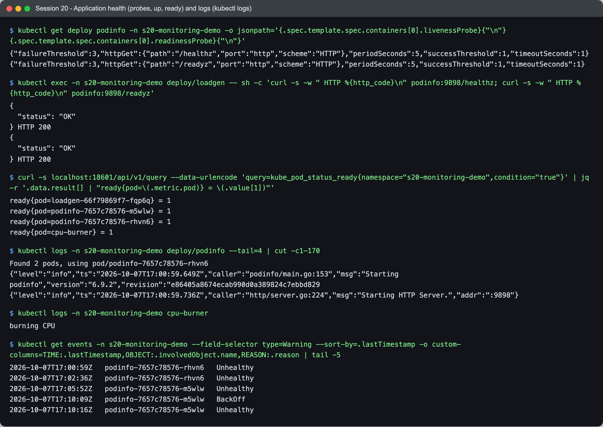

The `Unhealthy` warning events are real. Some are probes that hit a container which was still starting
or had just crashed (`connection refused`), and two are readiness probes that timed out after their
1 second `timeoutSeconds` while the node CPU was busy. The `BackOff` is from the crash test below.

### 1.3 Alerts that actually fire

[`40-prometheusrule.yaml`](monitoring/demo-app/40-prometheusrule.yaml) has three rules:

| Alert | Expression (short) | for | Covers |
|---|---|---|---|
| `DemoPodHighCPU` | `sum by (pod) (rate(container_cpu_usage_seconds_total{namespace="s20-monitoring-demo"}[1m])) > 0.15` | 1m | CPU utilisation |
| `DemoPodRestarting` | `increase(kube_pod_container_status_restarts_total{namespace="s20-monitoring-demo"}[5m]) > 0` | 0 | crash loops |
| `DemoAppDown` | `sum(up{service="podinfo"}) == 0 or absent(up{service="podinfo"})` | 30s | app health |

To make the first two fire I started a `cpu-burner` pod (a busybox shell loop with a 250m CPU limit so
it cannot hurt the shared node), and crashed one podinfo pod twice through its `/panic` endpoint.
`curl` exits with 52 (empty reply) because the server dies mid-request, and `kubectl logs --previous`
shows the last thing the crashed container logged: `Panic command received`.

```text
$ kubectl apply -f monitoring/demo-app/50-cpu-burner.yaml
pod/cpu-burner created

$ POD=$(kubectl get pod -n s20-monitoring-demo -l app=podinfo -o jsonpath='{.items[0].metadata.name}'); echo "crashing $POD via its /panic endpoint"; kubectl exec -n s20-monitoring-demo deploy/loadgen -- curl -s -m 3 http://$(kubectl get pod $POD -n s20-monitoring-demo -o jsonpath='{.status.podIP}'):9898/panic; echo "curl exit=$?"
crashing podinfo-7657c78576-m5wlw via its /panic endpoint
command terminated with exit code 52
curl exit=52

$ # wait for the kubelet to restart it, then crash it a second time
command terminated with exit code 52
second /panic sent to podinfo-7657c78576-m5wlw (curl exit=52)

$ kubectl get pods -n s20-monitoring-demo -o wide | cut -c1-110
NAME                       READY   STATUS    RESTARTS      AGE   IP             NODE       NOMINATED NODE   RE
cpu-burner                 1/1     Running   0             37s   10.244.0.17    minikube   <none>           <n
loadgen-66f79869f7-fqp6q   1/1     Running   0             10m   10.244.0.244   minikube   <none>           <n
podinfo-7657c78576-m5wlw   1/1     Running   2 (15s ago)   10m   10.244.0.243   minikube   <none>           <n
podinfo-7657c78576-rhvn6   1/1     Running   0             10m   10.244.0.242   minikube   <none>           <n

$ kubectl top pods -n s20-monitoring-demo
NAME                       CPU(cores)   MEMORY(bytes)   
cpu-burner                 219m         1Mi             
loadgen-66f79869f7-fqp6q   17m          2Mi             
podinfo-7657c78576-m5wlw   12m          15Mi            
podinfo-7657c78576-rhvn6   3m           22Mi

$ kubectl logs -n s20-monitoring-demo $(kubectl get pod -n s20-monitoring-demo -l app=podinfo -o jsonpath='{.items[0].metadata.name}') --previous --tail=6 | cut -c1-200
{"level":"info","ts":"2026-10-07T17:09:46.338Z","caller":"podinfo/main.go:153","msg":"Starting podinfo","version":"6.9.2","revision":"e86405a8674ecab990d0a389824c7ebbd82973b5","port":"9898"}
{"level":"info","ts":"2026-10-07T17:09:46.339Z","caller":"http/server.go:224","msg":"Starting HTTP Server.","addr":":9898"}
{"level":"info","ts":"2026-10-07T17:10:05.042Z","caller":"http/panic.go:14","msg":"Panic command received"}

$ kubectl get events -n s20-monitoring-demo --field-selector reason=BackOff,reason!=x -o custom-columns=TIME:.lastTimestamp,OBJ:.involvedObject.name,REASON:.reason,MSG:.message 2>/dev/null | tail -3; kubectl get events -n s20-monitoring-demo --sort-by=.lastTimestamp -o custom-columns=TIME:.lastTimestamp,OBJ:.involvedObject.name,REASON:.reason,MSG:.message | grep -v loadgen | tail -6 | cut -c1-150
TIME                   OBJ                        REASON    MSG
2026-10-07T17:10:09Z   podinfo-7657c78576-m5wlw   BackOff   Back-off restarting failed container podinfo in pod podinfo-7657c78576-m5wlw_s20-monitoring-demo(d72f4559-9da7-4f16-b7a8-1c73a5fb3d44)
2026-10-07T17:09:50Z   cpu-burner                 Started             Container started
2026-10-07T17:10:09Z   podinfo-7657c78576-m5wlw   BackOff             Back-off restarting failed container podinfo in pod podinfo-7657c78576-m5wlw_s20
2026-10-07T17:10:16Z   podinfo-7657c78576-m5wlw   Unhealthy           Readiness probe failed: Get "http://10.244.0.243:9898/readyz": dial tcp 10.244.0
2026-10-07T17:10:16Z   podinfo-7657c78576-m5wlw   Started             Container started
2026-10-07T17:10:16Z   podinfo-7657c78576-m5wlw   Created             Container created
2026-10-07T17:10:16Z   podinfo-7657c78576-m5wlw   Pulled              Container image "ghcr.io/stefanprodan/podinfo:6.9.2" already present on machine
```

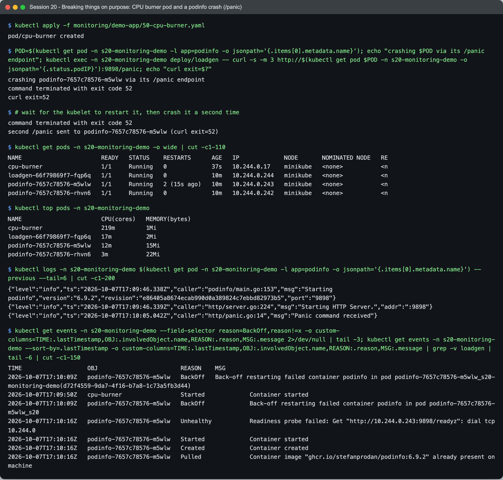

About two minutes later both alerts were firing in Prometheus. The CPU one sat in `pending` for its
`for: 1m` first; the restart one has no `for`, so it fired on the next evaluation.

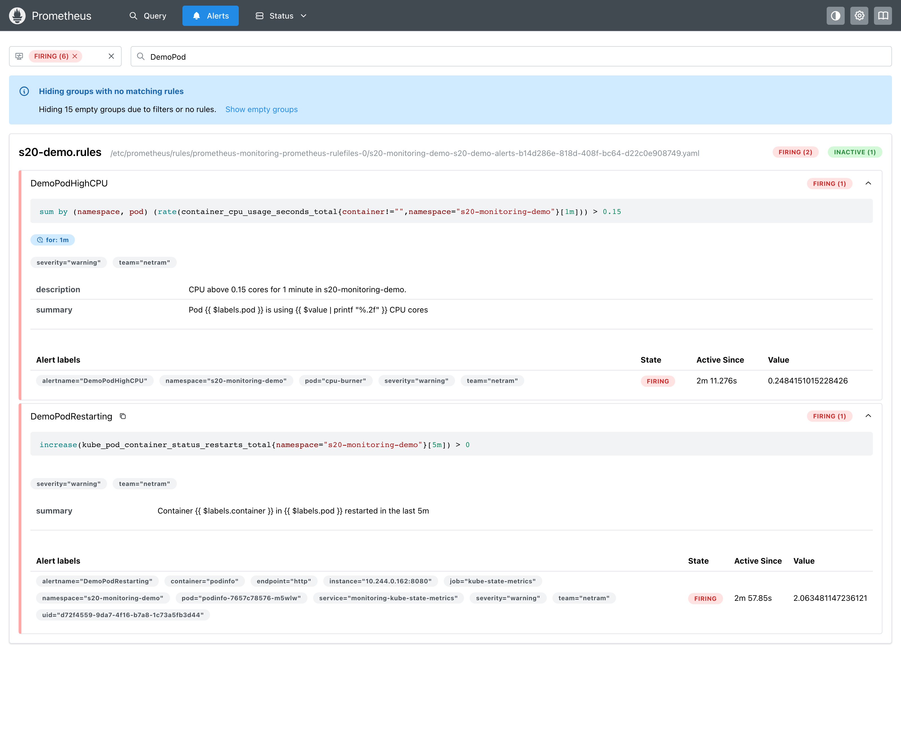

Prometheus pushed them to Alertmanager, which grouped them by namespace. (No receiver is configured,
so they stop here; in a real setup the route would send them to Slack or email.)

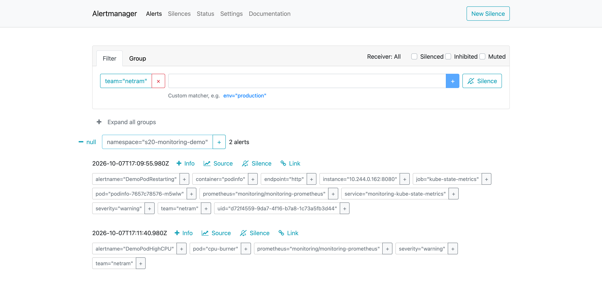

Then the app-down case: I scaled podinfo to 0, `up` disappeared, the rule went `pending` for 30s and
then `firing`, and it cleared about 15 seconds after I scaled back to 2.

```text
$ date +%T; kubectl scale deploy podinfo -n s20-monitoring-demo --replicas=0
22:55:56
deployment.apps/podinfo scaled

$ # poll the Prometheus alerts API until DemoAppDown is firing
22:55:56  DemoAppDown=inactive
22:56:01  DemoAppDown=inactive
22:56:06  DemoAppDown=inactive
22:56:11  DemoAppDown=inactive
22:56:16  DemoAppDown=inactive
22:56:21  DemoAppDown=inactive
22:56:26  DemoAppDown=pending
22:56:31  DemoAppDown=pending
22:56:36  DemoAppDown=pending
22:56:41  DemoAppDown=pending
22:56:46  DemoAppDown=pending
22:56:51  DemoAppDown=pending
22:56:56  DemoAppDown=firing

$ curl -s localhost:18603/api/v2/alerts?filter=team=%22netram%22 | jq -r '.[] | "\(.labels.alertname)  severity=\(.labels.severity)  state=\(.status.state)  summary=\(.annotations.summary)"'
DemoAppDown  severity=critical  state=active  summary=No podinfo target is up: the app is down
DemoPodHighCPU  severity=warning  state=active  summary=Pod cpu-burner is using 0.25 CPU cores

$ date +%T; kubectl scale deploy podinfo -n s20-monitoring-demo --replicas=2 && kubectl rollout status deploy/podinfo -n s20-monitoring-demo --timeout=90s
22:56:56
deployment.apps/podinfo scaled
Waiting for deployment "podinfo" rollout to finish: 0 out of 2 new replicas have been updated...
Waiting for deployment "podinfo" rollout to finish: 0 of 2 updated replicas are available...
Waiting for deployment "podinfo" rollout to finish: 1 of 2 updated replicas are available...
deployment "podinfo" successfully rolled out

$ # poll until the alert clears
22:57:02  DemoAppDown=firing
22:57:07  DemoAppDown=firing
22:57:12  DemoAppDown=inactive
```

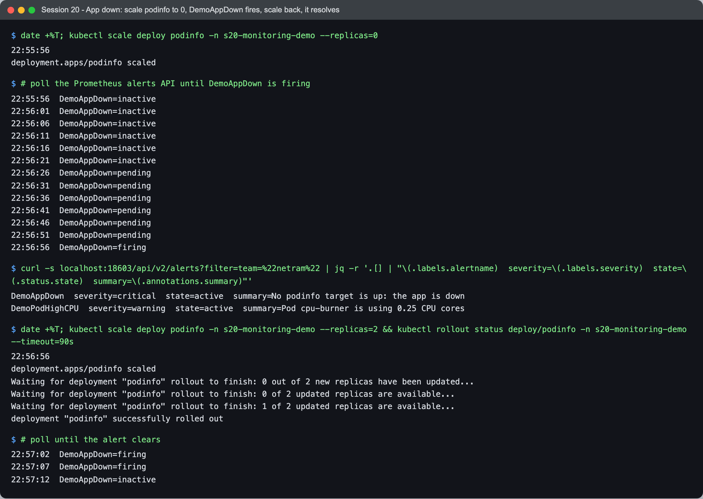

### 1.4 Dashboards: CPU and memory

I wrote one dashboard for the demo ([ConfigMap](monitoring/grafana/s20-demo-dashboard-configmap.yaml),
label `grafana_dashboard: "1"`, so the Grafana sidecar loads it without any clicking). Top row is health
(targets up, ready pods, restarts, firing alerts), then CPU in cores and as a share of the limit,
memory working set in bytes and as a share of the limit, and finally the app's own request rate and
p95 latency.

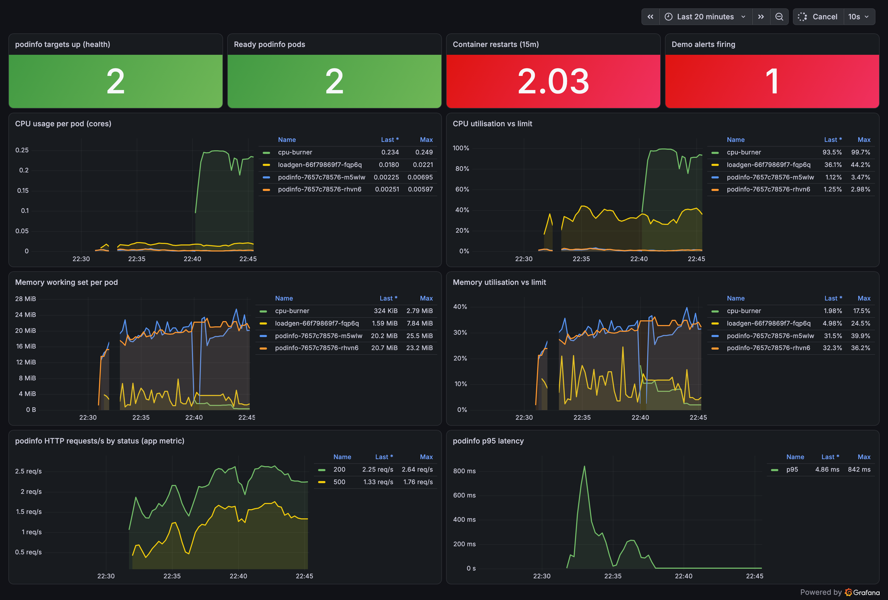

What it shows from this run: `cpu-burner` jumps to about 0.25 cores, which is 93 to 100% of its 250m
limit (the kernel throttles it there); podinfo sits at about 20 MiB, roughly 30% of its 64 MiB limit;
the dip in one podinfo memory line around 22:40 is the container restarting after `/panic`; and the
traffic panel shows the 200 and 500 responses from `loadgen` separately. The "Demo alerts firing" tile
said 1 at that moment because the restart alert had already aged out of its 5 minute window.

The chart also ships ready-made dashboards. This is **Kubernetes / Compute Resources / Namespace (Pods)**
for my namespace, with CPU and memory per pod against requests and limits:

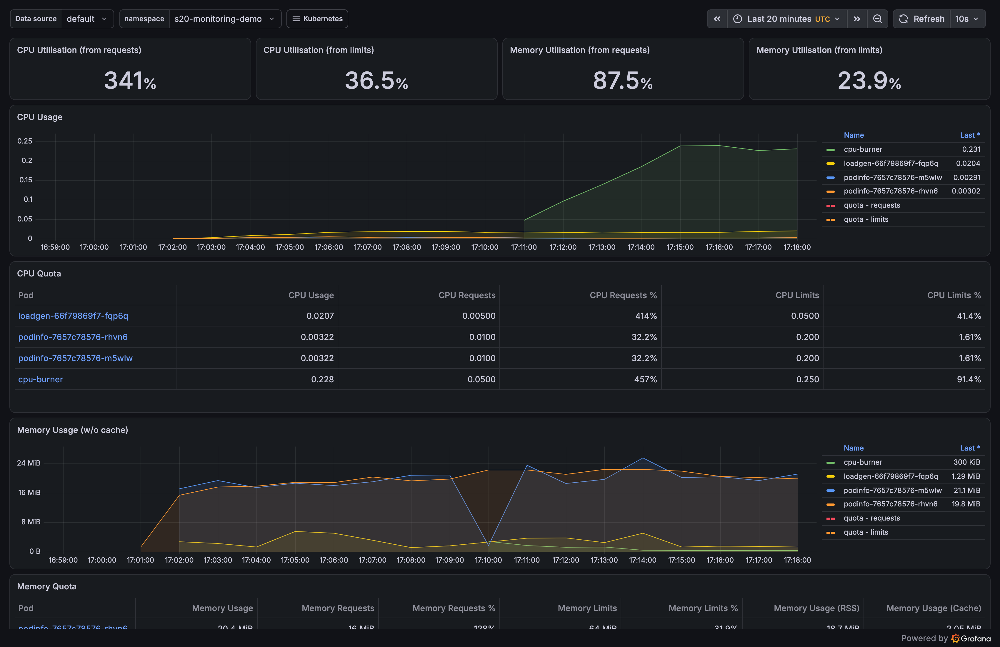

---

## Task 2 - Observability

Documented separately: [observability/README.md](observability/README.md) (why observability is needed,
metrics / logs / traces, the common tools, and Kubernetes observability including ServiceMonitor and
probes). Task 1 above is the hands-on version of its metrics and alerting parts.

---

## Task 3 - GitOps with Argo CD

### The ideas, using my demo as the example

- **What GitOps is.** Operating a system by changing files in Git and letting an agent inside the
  cluster make the cluster match. Nobody runs `kubectl apply` for the app. In my demo the only
  `kubectl apply` I ran was for the Argo CD `Application` itself; every change to podinfo after that
  was a `git push`.
- **Git as the source of truth.** The desired state of the app is exactly what is in
  `gitops/apps/podinfo/overlays/dev` on branch `session20-gitops`. If the cluster disagrees, the
  cluster is wrong. Git also gives me history, review and rollback for free: the Argo CD history
  screen below is literally my commit list.
- **Declarative configuration.** The files say *what* should exist (a Deployment with 3 replicas of
  podinfo 6.9.2, a Service), not the steps to get there. I used kustomize: a `base` with the
  Deployment and Service, and an `overlays/dev` that sets the namespace, the replica count and the
  image tag. Changing an environment is a two line diff in the overlay.
- **Continuous reconciliation.** Argo CD keeps comparing Git with the live objects. With
  `automated` sync it applies new commits by itself; with `selfHeal` it also undoes changes made
  directly in the cluster; with `prune` it deletes objects that were removed from Git.
- **The workflow.** Edit YAML, commit, push (in a team: open a PR, review, merge). Argo CD notices the
  new commit, renders kustomize, shows OutOfSync, syncs, and reports Healthy once the rollout is done.
- **Kubernetes + GitOps.** Kubernetes already works by reconciling desired state (controllers
  compare spec with status). GitOps moves the desired state one level up, from etcd to Git, and Argo
  CD is the controller for that level. This is pull based: the cluster pulls from Git, so CI never
  needs cluster credentials.

```text
 me: edit overlay -> git commit -> git push
                                     |
                         GitHub (session20-gitops)
                                     |  repo-server polls every ~30s, renders kustomize
                                     v
 Argo CD application-controller: desired (Git) vs live (cluster)
        |  differ? sync.          live changed by hand? selfHeal puts it back.
        |                         object deleted from Git? prune removes it.
        v
 Kubernetes (ns s20-gitops): Deployment podinfo, Service podinfo
```

### 3.1 Manifests in Git

- [`apps/podinfo/base/`](gitops/apps/podinfo/base/): `deployment.yaml`, `service.yaml`, `kustomization.yaml`.
- [`apps/podinfo/overlays/dev/kustomization.yaml`](gitops/apps/podinfo/overlays/dev/kustomization.yaml):
  namespace `s20-gitops`, `replicas` and `images` overrides. At the start it also listed
  `legacy-config.yaml`, a throwaway ConfigMap that I later deleted to test pruning.
- [`argocd/application.yaml`](gitops/argocd/application.yaml): the Application, kept outside the synced
  path so Argo CD does not try to manage itself (the course notes warn about this too).

### 3.2 Initial sync

```text
$ helm list -n argocd
NAME  	NAMESPACE	REVISION	UPDATED                             	STATUS  	CHART          	APP VERSION
argocd	argocd   	1       	2026-10-07 22:27:38.953818 +0530 IST	deployed	argo-cd-10.10.0	v3.5.4

$ kubectl get pods -n argocd
NAME                                  READY   STATUS    RESTARTS   AGE
argocd-application-controller-0       1/1     Running   0          3m35s
argocd-redis-5887f96b6f-z7d7g         1/1     Running   0          3m35s
argocd-repo-server-79d7ff8c7c-ssx44   0/1     Running   0          3m35s
argocd-server-694cd5ffd9-pl6z2        1/1     Running   0          3m35s

$ cat gitops/argocd/application.yaml | grep -v '^#'
apiVersion: argoproj.io/v1alpha1
kind: Application
metadata:
  name: s20-podinfo
  namespace: argocd
spec:
  project: default
  source:
    repoURL: https://github.com/netram75/devops-heros
    targetRevision: session20-gitops
    path: session20-monitoring-observability-gitops/task/gitops/apps/podinfo/overlays/dev
  destination:
    server: https://kubernetes.default.svc
    namespace: s20-gitops
  syncPolicy:
    automated:
      prune: true      # delete live objects that were removed from Git
      selfHeal: true   # undo manual changes made with kubectl
    syncOptions:
      - CreateNamespace=true

$ kubectl apply -f gitops/argocd/application.yaml
application.argoproj.io/s20-podinfo created

$ # wait until Argo CD reports Synced + Healthy
after ~106s: Synced/Healthy

$ kubectl get application s20-podinfo -n argocd -o wide
NAME          SYNC STATUS   HEALTH STATUS   REVISION                                   PROJECT
s20-podinfo   Synced        Healthy         05df617440d43e9f679c422bad4e19b898fb0bdf   default

$ kubectl get deploy,rs,pods,svc,configmap -n s20-gitops -o wide | cut -c1-150
NAME                      READY   UP-TO-DATE   AVAILABLE   AGE   CONTAINERS   IMAGES                               SELECTOR
deployment.apps/podinfo   2/2     2            2           26s   podinfo      ghcr.io/stefanprodan/podinfo:6.9.1   app=podinfo

NAME                                 DESIRED   CURRENT   READY   AGE   CONTAINERS   IMAGES                               SELECTOR
replicaset.apps/podinfo-6ff87588b8   2         2         2       26s   podinfo      ghcr.io/stefanprodan/podinfo:6.9.1   app=podinfo,pod-template-hash

NAME                           READY   STATUS    RESTARTS   AGE   IP             NODE       NOMINATED NODE   READINESS GATES
pod/podinfo-6ff87588b8-ggjqz   1/1     Running   0          26s   10.244.0.254   minikube   <none>           <none>
pod/podinfo-6ff87588b8-mf9lz   1/1     Running   0          26s   10.244.0.3     minikube   <none>           <none>

NAME              TYPE        CLUSTER-IP     EXTERNAL-IP   PORT(S)    AGE   SELECTOR
service/podinfo   ClusterIP   10.108.123.3   <none>        9898/TCP   26s   app=podinfo

NAME                         DATA   AGE
configmap/kube-root-ca.crt   1      26s
configmap/legacy-config      1      26s

$ kubectl get application s20-podinfo -n argocd -o jsonpath='{range .status.resources[*]}{.kind}{"/"}{.name}{"  "}{.status}{"  "}{.health.status}{"\n"}{end}'
ConfigMap/legacy-config  Synced  
Service/podinfo  Synced  
Deployment/podinfo  Synced
```

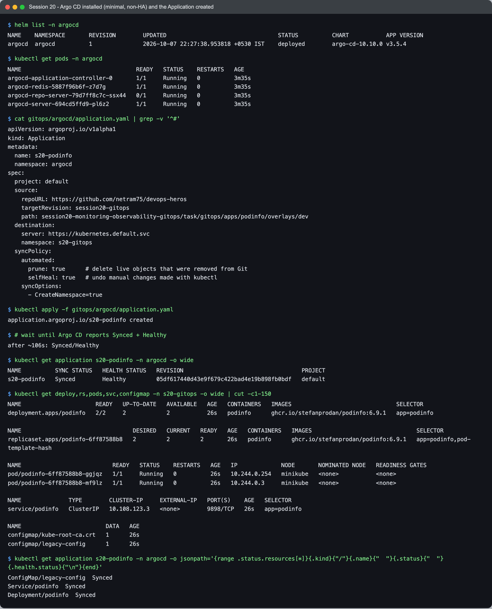

The first sync took about 106 seconds, mostly because `argocd-repo-server` was still not Ready
(`0/1` in the pod list) when I applied the Application. Once it was up, Argo CD cloned the repo,
rendered the overlay and created the three objects at commit `05df617`.

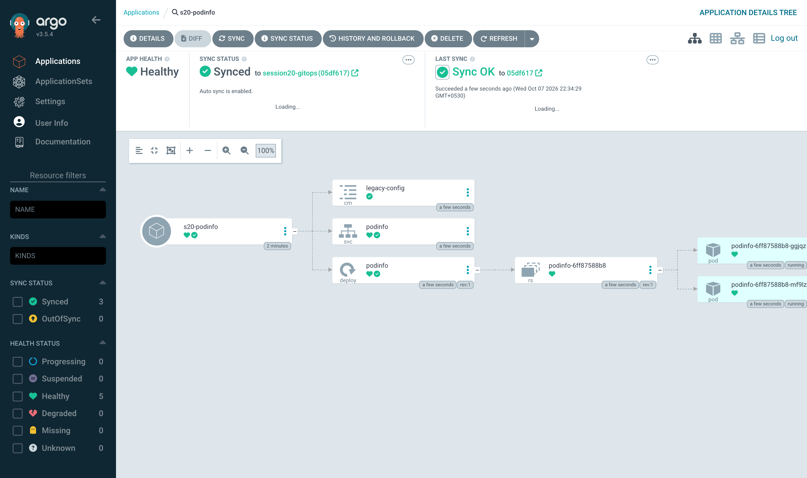

### 3.3 Change in Git, Argo CD syncs it

I changed the overlay from 2 to 3 replicas and from podinfo 6.9.1 to 6.9.2, committed and pushed.
No `kubectl` command touched the Deployment.

```text
$ kubectl get deploy podinfo -n s20-gitops -o custom-columns=READY:.status.readyReplicas,WANT:.spec.replicas,IMAGE:.spec.template.spec.containers[0].image
READY   WANT   IMAGE
2       2      ghcr.io/stefanprodan/podinfo:6.9.1

$ cd session20-monitoring-observability-gitops/task/gitops/apps/podinfo/overlays/dev && sed -i '' 's/count: 2/count: 3/; s/newTag: 6.9.1/newTag: 6.9.2/' kustomization.yaml && git diff --stat && git diff kustomization.yaml
 session20-monitoring-observability-gitops/task/gitops/apps/podinfo/overlays/dev/kustomization.yaml | 4 ++--
 1 file changed, 2 insertions(+), 2 deletions(-)
diff --git a/session20-monitoring-observability-gitops/task/gitops/apps/podinfo/overlays/dev/kustomization.yaml b/session20-monitoring-observability-gitops/task/gitops/apps/podinfo/overlays/dev/kustomization.yaml
index dab36c3..9993b39 100644
--- a/session20-monitoring-observability-gitops/task/gitops/apps/podinfo/overlays/dev/kustomization.yaml
+++ b/session20-monitoring-observability-gitops/task/gitops/apps/podinfo/overlays/dev/kustomization.yaml
@@ -6,7 +6,7 @@ resources:
   - legacy-config.yaml
 replicas:
   - name: podinfo
-    count: 2
+    count: 3
 images:
   - name: ghcr.io/stefanprodan/podinfo
-    newTag: 6.9.1
+    newTag: 6.9.2

$ git commit -q -am 'gitops: scale podinfo to 3 replicas and bump image to 6.9.2' && git log --oneline -1
8830eaf gitops: scale podinfo to 3 replicas and bump image to 6.9.2

$ git push origin session20-gitops 2>&1 | tail -1; date +%T
   05df617..8830eaf  session20-gitops -> session20-gitops
22:35:39

$ # no kubectl apply: poll every 5s and watch Argo CD pick up the new commit
22:35:54  app=Synced/Healthy rev=05df617  deploy=2/2 ghcr.io/stefanprodan/podinfo:6.9.1
22:36:02  app=Synced/Healthy rev=05df617  deploy=2/2 ghcr.io/stefanprodan/podinfo:6.9.1
22:36:07  app=Synced/Healthy rev=05df617  deploy=2/2 ghcr.io/stefanprodan/podinfo:6.9.1
22:36:13  app=Synced/Healthy rev=05df617  deploy=2/2 ghcr.io/stefanprodan/podinfo:6.9.1
22:36:19  app=Synced/Healthy rev=05df617  deploy=2/2 ghcr.io/stefanprodan/podinfo:6.9.1
22:36:24  app=Synced/Healthy rev=05df617  deploy=2/2 ghcr.io/stefanprodan/podinfo:6.9.1
22:36:30  app=Synced/Healthy rev=05df617  deploy=2/2 ghcr.io/stefanprodan/podinfo:6.9.1
22:36:35  app=Synced/Healthy rev=05df617  deploy=2/2 ghcr.io/stefanprodan/podinfo:6.9.1
22:36:41  app=OutOfSync/Healthy rev=8830eaf  deploy=2/2 ghcr.io/stefanprodan/podinfo:6.9.1
22:36:47  app=OutOfSync/Healthy rev=8830eaf  deploy=2/2 ghcr.io/stefanprodan/podinfo:6.9.1
22:36:52  app=Synced/Progressing rev=8830eaf  deploy=2/3 ghcr.io/stefanprodan/podinfo:6.9.2
22:36:58  app=Synced/Progressing rev=8830eaf  deploy=2/3 ghcr.io/stefanprodan/podinfo:6.9.2
22:37:03  app=Synced/Progressing rev=8830eaf  deploy=2/3 ghcr.io/stefanprodan/podinfo:6.9.2
22:37:09  app=Synced/Progressing rev=8830eaf  deploy=3/3 ghcr.io/stefanprodan/podinfo:6.9.2
22:37:15  app=Synced/Progressing rev=8830eaf  deploy=3/3 ghcr.io/stefanprodan/podinfo:6.9.2
22:37:20  app=Synced/Progressing rev=8830eaf  deploy=3/3 ghcr.io/stefanprodan/podinfo:6.9.2
22:37:26  app=Synced/Progressing rev=8830eaf  deploy=3/3 ghcr.io/stefanprodan/podinfo:6.9.2
22:37:31  app=Synced/Healthy rev=8830eaf  deploy=3/3 ghcr.io/stefanprodan/podinfo:6.9.2

$ kubectl get pods -n s20-gitops -o custom-columns=POD:.metadata.name,IMAGE:.spec.containers[0].image,READY:.status.containerStatuses[0].ready
POD                        IMAGE                                READY
podinfo-65c594557f-5ncws   ghcr.io/stefanprodan/podinfo:6.9.2   true
podinfo-65c594557f-q2dkp   ghcr.io/stefanprodan/podinfo:6.9.2   true
podinfo-65c594557f-qswlk   ghcr.io/stefanprodan/podinfo:6.9.2   true
podinfo-6ff87588b8-ggjqz   ghcr.io/stefanprodan/podinfo:6.9.1   true

$ kubectl get application s20-podinfo -n argocd -o jsonpath='{range .status.history[*]}{.id}  {.revision}  {.deployedAt}{"\n"}{end}'
0  05df617440d43e9f679c422bad4e19b898fb0bdf  2026-10-07T17:04:29Z
1  8830eafecd6931ed30fccd707524aa887394a4aa  2026-10-07T17:06:49Z
```

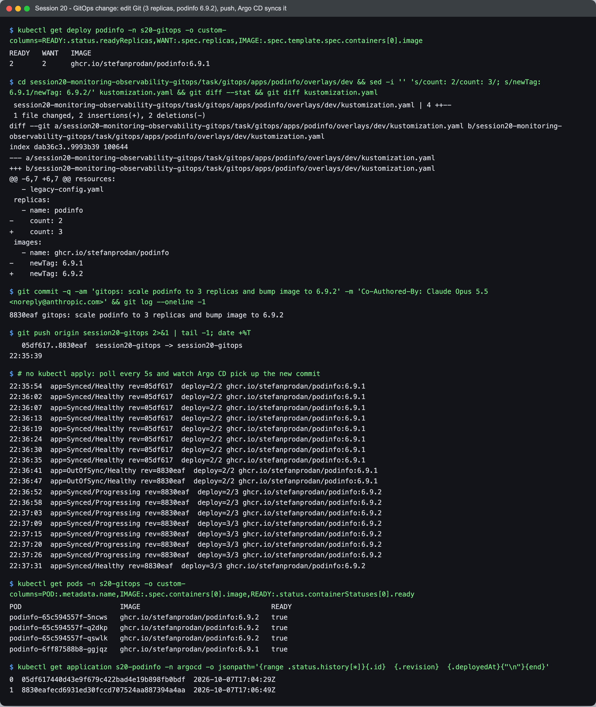

It took about 60 seconds from push to Argo CD noticing (polling every 30s plus jitter, plus the
repo-server's own cache), then about 40 seconds for the rolling update to finish. The last listing
caught one old 6.9.1 pod still terminating.

### 3.4 Self-heal

Git says 3 replicas. I scaled the Deployment to 1 by hand:

```text
$ grep -A2 'replicas:' session20-monitoring-observability-gitops/task/gitops/apps/podinfo/overlays/dev/kustomization.yaml
replicas:
  - name: podinfo
    count: 3

$ kubectl get deploy podinfo -n s20-gitops
NAME      READY   UP-TO-DATE   AVAILABLE   AGE
podinfo   3/3     3            3           3m27s

$ date +%T; kubectl scale deployment podinfo -n s20-gitops --replicas=1
22:37:56
deployment.apps/podinfo scaled

$ # poll every 2s: spec.replicas set by me vs what Argo CD puts back
22:37:56  spec.replicas=1  ready=3  app=Synced/Healthy
22:37:59  spec.replicas=3  ready=1  app=Synced/Progressing
22:38:01  spec.replicas=3  ready=2  app=Synced/Progressing
22:38:04  spec.replicas=3  ready=2  app=Synced/Progressing
22:38:06  spec.replicas=3  ready=2  app=Synced/Progressing
22:38:08  spec.replicas=3  ready=2  app=Synced/Progressing
22:38:10  spec.replicas=3  ready=3  app=Synced/Healthy

$ kubectl get deploy podinfo -n s20-gitops
NAME      READY   UP-TO-DATE   AVAILABLE   AGE
podinfo   3/3     3            3           3m42s

$ kubectl get events -n argocd --field-selector involvedObject.name=s20-podinfo --sort-by=.lastTimestamp -o custom-columns=TIME:.lastTimestamp,REASON:.reason,MESSAGE:.message | tail -7 | cut -c1-160
2026-10-07T17:07:48Z   ResourceUpdated      Updated health status: Progressing -> Healthy
2026-10-07T17:07:57Z   OperationStarted     Initiated automated sync to '8830eafecd6931ed30fccd707524aa887394a4aa'
2026-10-07T17:07:57Z   ResourceUpdated      Updated sync status: Synced -> OutOfSync
2026-10-07T17:07:58Z   OperationCompleted   Partial sync operation to 8830eafecd6931ed30fccd707524aa887394a4aa succeeded
2026-10-07T17:07:59Z   ResourceUpdated      Updated sync status: OutOfSync -> Synced
2026-10-07T17:07:59Z   ResourceUpdated      Updated health status: Healthy -> Progressing
2026-10-07T17:08:10Z   ResourceUpdated      Updated health status: Progressing -> Healthy
```

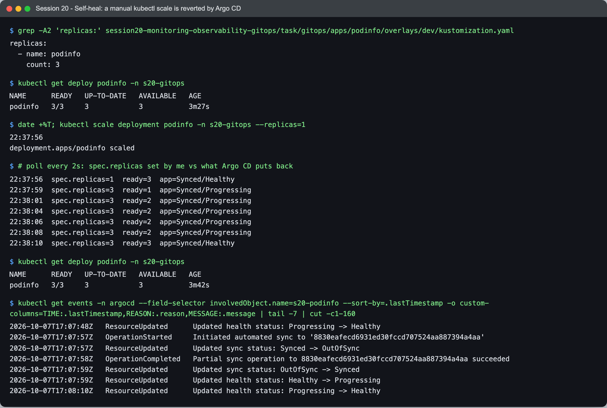

Within about 3 seconds `spec.replicas` was back at 3. Self-heal does not wait for the Git poll: the
controller watches the live objects, so the moment my `kubectl scale` changed the Deployment it saw a
diff against Git and re-applied. The events show `Initiated automated sync` right after my change.

### 3.5 Prune

I deleted `legacy-config.yaml` from Git and removed it from the overlay's `resources:`:

```text
$ kubectl get configmap legacy-config -n s20-gitops
NAME            DATA   AGE
legacy-config   1      3m54s

$ git rm -q legacy-config.yaml && sed -i '' '/legacy-config.yaml/d' kustomization.yaml && git diff --cached --stat && git diff kustomization.yaml
 session20-monitoring-observability-gitops/task/gitops/apps/podinfo/overlays/dev/legacy-config.yaml | 7 -------
 1 file changed, 7 deletions(-)
diff --git a/session20-monitoring-observability-gitops/task/gitops/apps/podinfo/overlays/dev/kustomization.yaml b/session20-monitoring-observability-gitops/task/gitops/apps/podinfo/overlays/dev/kustomization.yaml
index 9993b39..38c1131 100644
--- a/session20-monitoring-observability-gitops/task/gitops/apps/podinfo/overlays/dev/kustomization.yaml
+++ b/session20-monitoring-observability-gitops/task/gitops/apps/podinfo/overlays/dev/kustomization.yaml
@@ -3,7 +3,6 @@ kind: Kustomization
 namespace: s20-gitops
 resources:
   - ../../base
-  - legacy-config.yaml
 replicas:
   - name: podinfo
     count: 3

$ git commit -q -am 'gitops: remove legacy-config (Argo CD should prune it)' && git log --oneline -1 && git push origin session20-gitops 2>&1 | tail -1; date +%T
09a0005 gitops: remove legacy-config (Argo CD should prune it)
   8830eaf..09a0005  session20-gitops -> session20-gitops
22:38:25

$ # poll every 5s until Argo CD has synced the new commit and the ConfigMap is gone
22:38:25  rev=8830eaf  app=Synced/Healthy  legacy-config: configmap/legacy-config
22:38:30  rev=8830eaf  app=Synced/Healthy  legacy-config: configmap/legacy-config
22:38:36  rev=8830eaf  app=Synced/Healthy  legacy-config: configmap/legacy-config
22:38:41  rev=09a0005  app=Synced/Healthy  legacy-config: (gone)

$ kubectl get configmap -n s20-gitops
NAME               DATA   AGE
kube-root-ca.crt   1      4m12s

$ kubectl get events -n argocd --field-selector involvedObject.name=s20-podinfo --sort-by=.lastTimestamp -o custom-columns=TIME:.lastTimestamp,REASON:.reason,MESSAGE:.message | tail -5 | cut -c1-160
2026-10-07T17:08:37Z   ResourceUpdated      Updated sync status: Synced -> OutOfSync
2026-10-07T17:08:38Z   ResourceUpdated      Updated health status: Healthy -> Progressing
2026-10-07T17:08:38Z   ResourceUpdated      Updated sync status: OutOfSync -> Synced
2026-10-07T17:08:38Z   ResourceUpdated      Updated health status: Progressing -> Healthy
2026-10-07T17:08:39Z   OperationCompleted   Sync operation to 09a000556a1cca584b650709699e1ee040e72f47 succeeded

$ kubectl get application s20-podinfo -n argocd -o jsonpath='{.status.operationState.syncResult.resources[?(@.kind=="ConfigMap")]}' | jq -c '{kind,name,status,message}'
{"kind":"ConfigMap","name":"legacy-config","status":"Pruned","message":"pruned"}
```

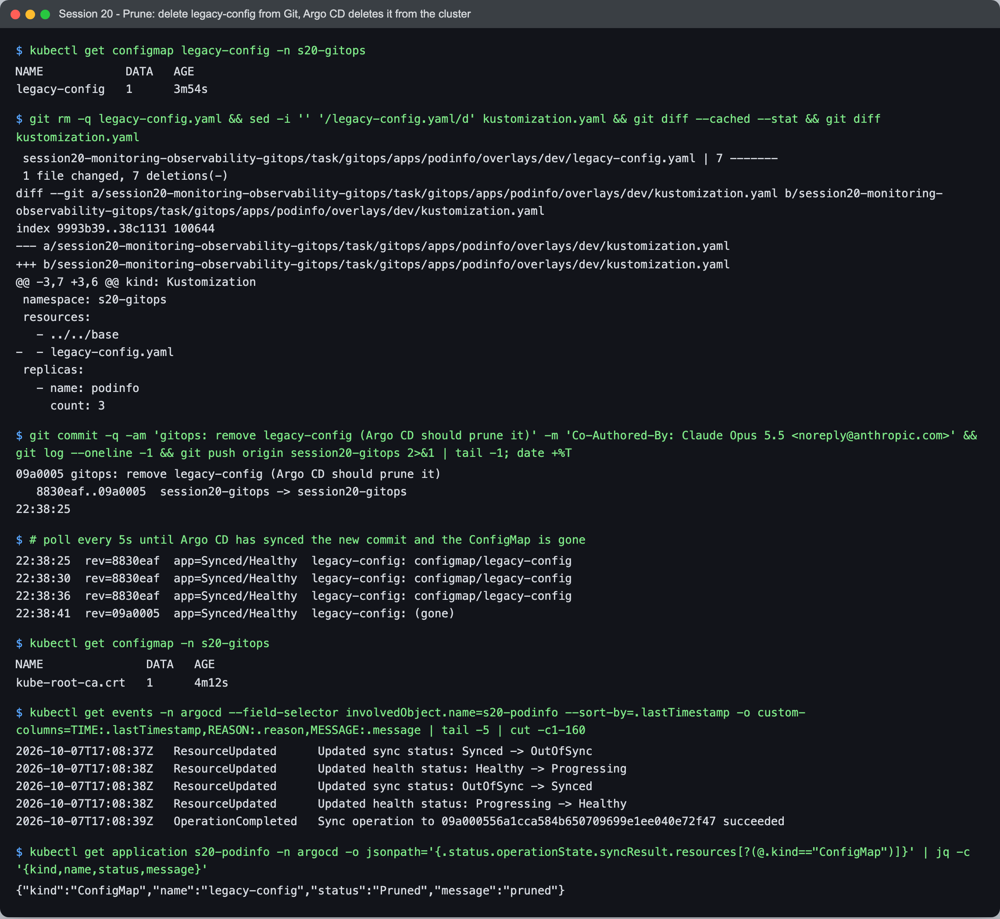

The sync result records the ConfigMap as `Pruned`. Without `prune: true` Argo CD would only have
marked it as OutOfSync and left it running.

Final state in the UI (3 pods on 6.9.2, no ConfigMap, synced to `09a0005`), and the history, where each
entry is one of my commits, deployed by the automated sync policy:

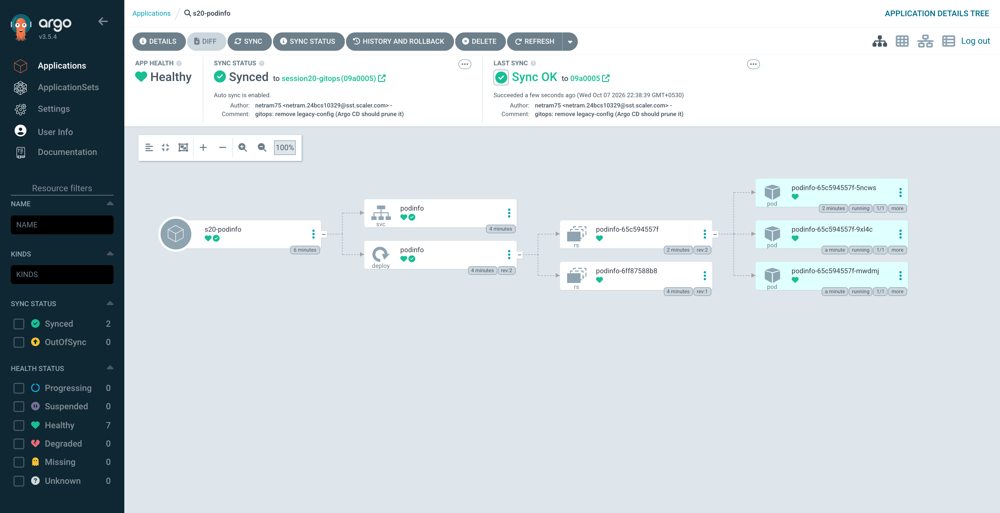

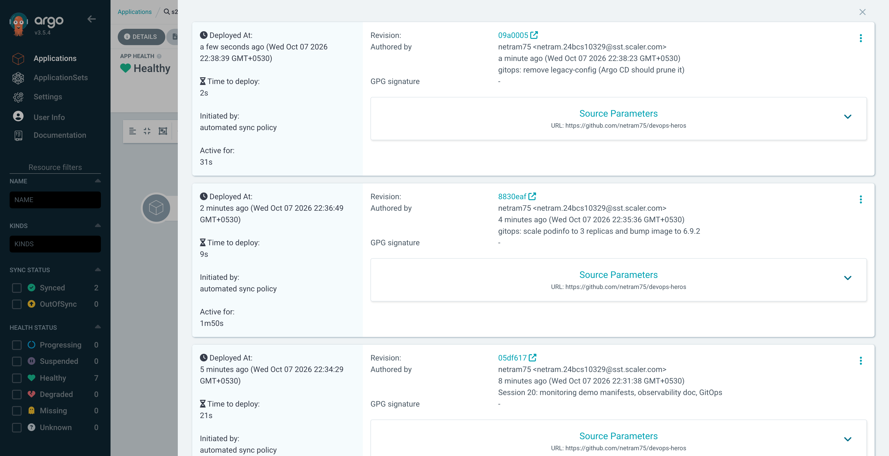

---

## What I learned

- A ServiceMonitor is matched in two steps: the operator has to select the ServiceMonitor (labels, or
  the `NilUsesHelmValues: false` switch), and the ServiceMonitor has to select the Service and name its
  port. Either one wrong and the target simply never appears, with no error.
- `rate()` over a 1m window plus `for: 1m` means a CPU alert needs about two minutes before it fires.
  The `for` is what stops one spike from paging someone.
- An "app down" alert needs `absent()` too: when every pod is gone there is no `up` series to equal 0.
- `kubectl top` and Prometheus are separate pipelines (metrics-server vs cAdvisor scraped by
  Prometheus), and they gave roughly the same numbers for my pods, which was a nice sanity check.
- In GitOps the Git poll is slow (about a minute here) but self-heal is near instant, because one is
  polling and the other is a watch on live objects.
- Kustomize overlays make the GitOps diffs tiny and readable: two changed lines for "3 replicas, new image".

## Problems I hit

- **Grafana was OOMKilled, twice.** With a 300Mi limit it died the first time I opened my dashboard.
  I raised it to 512Mi and it died again while loading the built-in dashboard. The real fix was setting
  `GOMEMLIMIT: 360MiB` so the Go garbage collector knows about the limit; after that it stayed around
  300 MiB with no more restarts. Both changes are in the values file with a comment.
- **Not enough memory for Loki.** The minikube container sat around 3.4 of 4 GiB with Prometheus,
  Grafana and Argo CD running (the API server alone used close to 900 MiB), so I skipped Loki and
  used `kubectl logs` for the logs part instead.
- **Slow first Argo CD sync.** The repo-server was still starting when I created the Application, so
  the first sync took about 106 seconds instead of a few.
- **Per-resource health was empty** in my `jsonpath` query of `.status.resources[*].health`: Argo CD 3
  no longer stores resource health in the Application status by default. The UI and the app-level
  `status.health` still have it.
- **The Prometheus 3 alerts search is fuzzy.** Searching for `Demo` also matched every `DaemonSet`
  rule; filtering by state `firing` plus `DemoPod` gave a clean page.
- **The restart alert resolves on its own** once the restart is older than the 5 minute window, and it
  also disappears when the pod is deleted, which is why I could not get all three alerts firing at the
  same moment.

## Cleanup

```bash
kubectl delete -f gitops/argocd/application.yaml     # Application only
kubectl delete namespace s20-gitops s20-monitoring-demo
helm uninstall argocd -n argocd
helm uninstall monitoring -n monitoring
```
