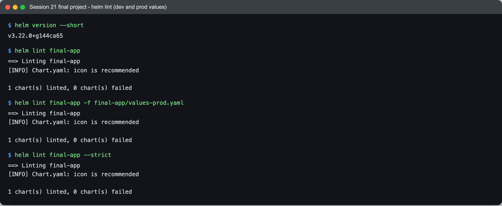
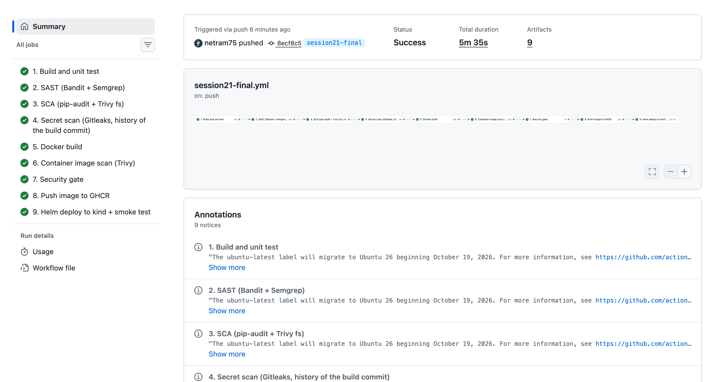
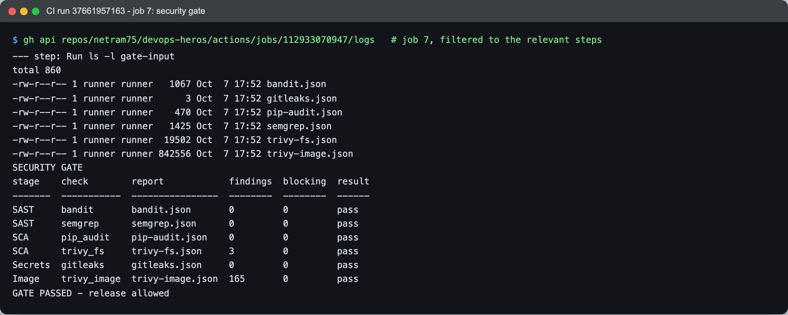

# Session 21 - Final DevOps Project

- **Name:** Netram
- **Enrollment No:** 24BCS10329

> **Status:** completed

> Built on macOS (Apple Silicon) with Docker Desktop. The CI/CD pipeline runs on GitHub-hosted
> Ubuntu runners; the Kubernetes, monitoring and GitOps parts ran on minikube v1.39.0
> (Kubernetes v1.37.0); Terraform ran against LocalStack (no real AWS account).

---

## Project overview

One small Python web app taken all the way from source code to a monitored, GitOps-managed
Kubernetes deployment, using what each session of the course taught. The application itself
is deliberately simple (it is the Flask app I built and secured in Session 17) so that the
project is about the delivery path, not the app.

Everything in this folder follows the layout the task asked for:

```text
final-devops-project/
├── application/        Flask app + unit tests
├── docker/             Dockerfile (non-root, pinned base image, healthcheck)
├── kubernetes/         Deployment, Service, ConfigMap, Secret, Ingress, HPA, probes, PVC
├── helm/               Helm chart for the same app (used by the CI deploy job)
├── terraform/          AWS infrastructure (VPC, subnets, security groups, EC2, IAM, S3)
├── .github/workflows/  the CI/CD + DevSecOps pipeline (copy; GitHub runs the one at repo root)
├── security/           SAST / SCA / secret-scan / image-scan configs and the security gate
├── monitoring/         Prometheus + Grafana + alert rules for the app
├── gitops/             Argo CD Application + kustomize overlay
├── troubleshooting/    broken and fixed manifests for the final troubleshooting challenge
├── docs/               the detailed write-up for each area, with real output
└── screenshots/
```

## Architecture

```text
 Developer ──git push──> GitHub (netram75/devops-heros)
                              │
                              ▼
                 GitHub Actions: session21-final.yml
   build + unit test ─> SAST ─> SCA ─> secret scan ─> docker build ─> image scan
                                                                          │
                                                                   security gate
                                                                          │
                                       push image ─> ghcr.io/netram75/devops-heros-final
                                                                          │
                                         helm upgrade --install into a kind cluster (CI)

 Git (gitops/ overlay) ──watched by──> Argo CD ──sync / self-heal / prune──> Kubernetes
                                                                              │
     ┌───────────────────────── namespace final-app ─────────────────────────┤
     │ Ingress (nginx) ─> Service ─> Deployment (probes, limits) <─ HPA       │
     │                               ConfigMap, Secret, PVC                   │
     └────────────────────────────────────────────────────────────────────────┘
                                                                              │
             Prometheus (scrapes kubelet/cAdvisor + kube-state-metrics) ─> Grafana
                          └─> alert rules ─> Alertmanager

 Terraform ──> AWS: VPC, public + private subnets, IGW, route tables, security groups,
               EC2 node (k3s), IAM role, S3 artifacts bucket   (applied on LocalStack)
```

## Technologies used

| Area | Tools |
|---|---|
| Application | Python, Flask, pytest |
| Containers | Docker, GitHub Container Registry (GHCR) |
| Orchestration | Kubernetes (minikube locally, kind inside CI), kustomize |
| Packaging | Helm |
| CI/CD | GitHub Actions |
| DevSecOps | Bandit and Semgrep (SAST), pip-audit (SCA), Gitleaks (secrets), Trivy (image), a policy-driven security gate |
| Infrastructure as Code | Terraform, AWS provider, LocalStack |
| Monitoring | Prometheus, Grafana, Alertmanager (kube-prometheus-stack) |
| GitOps | Argo CD |

## Application setup

[application/](application/) is the Flask app from Session 17 with its pytest suite (17 tests,
100% coverage). For this project it also reports `environment` (from a ConfigMap value) and
`secret_configured` (whether the API token Secret was injected, without ever printing it), so a
smoke test can prove configuration really reached the pod.

```bash
cd application
python3 -m venv .venv && . .venv/bin/activate
pip install -r requirements.txt -r requirements-dev.txt
pytest --cov=app
```

## Docker setup

[docker/Dockerfile](docker/Dockerfile) builds from this folder as context
(`docker build -f docker/Dockerfile .`). It uses a base image pinned by digest, runs as a
non-root user (UID 10001), works with a read-only root filesystem and has a `HEALTHCHECK`. The
same image is what CI scans, pushes to `ghcr.io/netram75/devops-heros-final` and deploys.

## Kubernetes deployment

[kubernetes/](kubernetes/) holds plain manifests applied with kustomize to namespace
`final-app` on minikube: Deployment (startup, readiness and liveness probes, requests and
limits, non-root and read-only securityContext), Service, ConfigMap, Secret (fake demo value),
Ingress (nginx, `final.127.0.0.1.nip.io`), HPA and a PVC. The PVC holds per-pod access logs
that a native sidecar streams to stdout; they survived a pod delete. Under load the HPA scaled
the app from 2 to 5 replicas at 270% of the CPU request.

Details and real output: [docs/kubernetes.md](docs/kubernetes.md)


## Helm deployment

[helm/final-app/](helm/final-app/) packages the same app: Deployment, Service, ConfigMap,
Secret, optional Ingress, HPA, optional PVC and a ServiceAccount, with `values.yaml` (dev) and
`values-prod.yaml`. `helm lint --strict` passes for both. The CI pipeline deploys with
`helm upgrade --install --wait` into a throwaway kind cluster and smoke-tests the result.

Details: the Helm section of [docs/cicd-devsecops.md](docs/cicd-devsecops.md)



## Terraform infrastructure

[terraform/](terraform/) describes the AWS side: a VPC with 2 public and 2 private subnets in
2 AZs, an internet gateway, a NAT gateway, route tables, `web` and `node` security groups, an
IAM role scoped to the artifacts bucket, an EC2 host whose user_data installs k3s, and a
versioned, encrypted, private S3 bucket. EKS is written but switched off (`enable_eks`), because
it is not available in LocalStack community edition. I ran init, fmt, validate, plan, apply
(32 resources), output, state list, AWS CLI checks and destroy against LocalStack; no real AWS
account was used.

Details and real output: [docs/terraform.md](docs/terraform.md)


## CI/CD pipeline

The workflow is [.github/workflows/session21-final.yml](../../.github/workflows/session21-final.yml)
at the repo root (a copy sits in [.github/workflows/](.github/workflows/) here to match the
required layout). Nine jobs, each gated on the previous one:

```text
build + unit test -> SAST -> SCA -> secret scan -> docker build -> image scan
   -> security gate -> push to GHCR -> helm deploy to kind + smoke test
```

Green run on `main`: https://github.com/netram75/devops-heros/actions/runs/37662996798



## DevSecOps implementation

| Stage | Tool | Result in the green run |
|---|---|---|
| SAST | Bandit, Semgrep | no findings |
| SCA | pip-audit, Trivy fs | no vulnerable packages; 3 low/medium chart hints |
| Secret scanning | Gitleaks (history of the build commit) | no leaks |
| Image scanning | Trivy image | 44 HIGH in Debian base packages, none with a fix yet |
| Security gate | [security/security_gate.py](security/security_gate.py) + [gate-policy.json](security/gate-policy.json) | PASSED (blocks HIGH/CRITICAL only when a fix exists, and any secret) |

The gate failing on a real finding was demonstrated in Session 17; this pipeline reuses that
policy. Details: [docs/cicd-devsecops.md](docs/cicd-devsecops.md)



## Monitoring

kube-prometheus-stack (release `monitoring`) scraped the cluster; the app's CPU and memory per
pod were queried through PromQL, and [monitoring/final-app-rules.yaml](monitoring/final-app-rules.yaml)
defines three alerts (pod not ready, restarting, high CPU). `FinalAppHighCPU` really fired and
showed as active in Alertmanager. The app has no `/metrics` endpoint of its own, so its
metrics come from cAdvisor and kube-state-metrics.

Details: [docs/monitoring.md](docs/monitoring.md)


## GitOps

Argo CD watches [gitops/overlays/prod](gitops/overlays/prod) in this repo with automated sync,
self-heal and prune ([gitops/argocd/application.yaml](gitops/argocd/application.yaml)):

- initial sync adopted the running objects within 27 s;
- a Git change (HPA `minReplicas` 2 to 3, commit `ccf7db6`) was applied about 42 s after the push;
- manual drift (edited ConfigMap, deleted Service) was reverted within 8 s.

Details: [docs/gitops.md](docs/gitops.md)


## Troubleshooting

The final troubleshooting challenge: I deployed a deliberately broken copy of the project
([troubleshooting/broken/app.yaml](troubleshooting/broken/app.yaml)) into `final-troubleshoot`
with five planted faults, then found and fixed each one
([troubleshooting/fixed/app.yaml](troubleshooting/fixed/app.yaml)):

| # | Symptom | Root cause | Fix |
|---|---|---|---|
| 1 | `ErrImagePull` / `ImagePullBackOff` | image tag `final-app:1.0.1`, never built | point at `1.0.0` |
| 2 | `CreateContainerConfigError` | Secret key `api_token` vs `api-token` | match the key |
| 3 | pod `Running` but `0/1`, never Ready | readiness probe on `/ready`, the app serves `/readyz` | correct probe path |
| 4 | Service has no endpoints, Ingress 503 | selector `ts-api` instead of `ts-app` | fix the selector |
| 5 | HPA shows `<unknown>` | container has no CPU request | add requests |

After the fixes, `kubectl diff` against the fixed manifest was empty and the Ingress returned 200.
Details with before/after output: [docs/troubleshooting.md](docs/troubleshooting.md)


## Screenshots

All 43 screenshots are in [screenshots/](screenshots/): `cicd-*` (pipeline and Helm), `k8s-*`,
`mon-*`, `gitops-*`, `tf-*` and `ts-*` (troubleshooting).


## Lessons learned

- The delivery path matters more than the app. The same image digest went from the pipeline's
  scan to GHCR to the cluster, so what was scanned is exactly what runs.
- Security gates need a policy, not just scanners. Blocking every HIGH would block forever on
  base-image CVEs that have no fix; blocking fixable HIGH/CRITICAL and every secret is enforceable.
- Let one controller own each field. Replicas live in the HPA (`minReplicas`), not the
  Deployment, otherwise Argo CD and the HPA fight over the same number.
- Most "it is broken" moments were found from `kubectl describe` events and `get endpoints`,
  not from logs: four of the five planted faults never produced an application log line.
- Emulators have limits. LocalStack gave real API state for Terraform but never booted the EC2
  host, so the infrastructure part proves configuration, not runtime behaviour.

