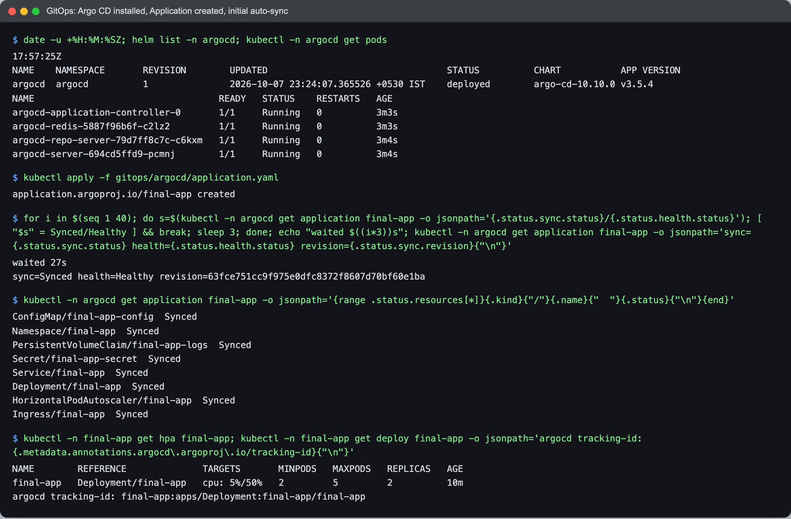
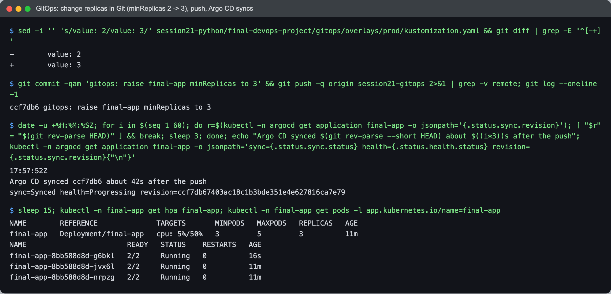
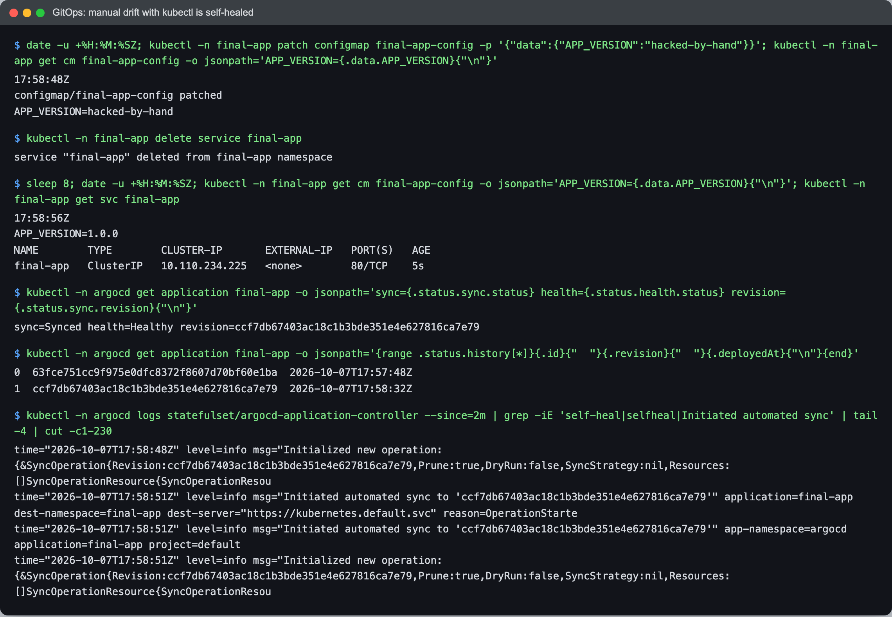

# GitOps with Argo CD

Netram, Enrollment No 24BCS10329

With GitOps the Git branch is the source of truth and a controller inside the cluster keeps the cluster equal to it. I used Argo CD for that. Nobody (including the CI pipeline) runs `kubectl apply` against `final-app` any more; changes go through a commit.

## Install

Argo CD is installed with Helm from [`../gitops/argocd/argocd-values.yaml`](../gitops/argocd/argocd-values.yaml), the minimal values from Session 20: no Dex, no notifications controller, ApplicationSet scaled to 0, small requests and limits, and `timeout.reconciliation: 30s` so it polls Git every ~30s instead of the default 120s (only for the demo).

```bash
helm install argocd argo/argo-cd -n argocd --create-namespace -f gitops/argocd/argocd-values.yaml --wait
kubectl apply -f gitops/argocd/application.yaml
```

## Layout

```text
gitops/
  argocd/argocd-values.yaml      Helm values for Argo CD
  argocd/application.yaml        the Application
  overlays/prod/kustomization.yaml
kubernetes/                      base: the same manifests from kubernetes.md
```

`overlays/prod` uses `../../../kubernetes` as its base, so I do not keep a second copy of the manifests that could drift from the first. The overlay only patches the HPA `minReplicas`.

**Why I change replicas on the HPA and not on the Deployment:** the Deployment has an HPA, so its `spec.replicas` is owned by the HPA. If Git also set `spec.replicas`, Argo CD self-heal and the HPA would keep overwriting each other. Raising `minReplicas` in Git is the GitOps-friendly way to say "run at least N copies".

The [Application](../gitops/argocd/application.yaml) points at `https://github.com/netram75/devops-heros`, `targetRevision: session21-gitops`, path `session21-python/final-devops-project/gitops/overlays/prod`, with:
- `automated` sync: a new commit is applied without anyone clicking Sync.
- `prune: true`: an object deleted from Git is deleted from the cluster.
- `selfHeal: true`: a manual change in the cluster is reverted to what Git says.
- `CreateNamespace=true`.

## 1. Initial sync

The app was already running from my earlier `kubectl apply -k`, so Argo CD adopted the existing objects (it adds its tracking annotation) instead of recreating them.



```text
$ date -u +%H:%M:%SZ; helm list -n argocd; kubectl -n argocd get pods
17:57:25Z
NAME  	NAMESPACE	REVISION	UPDATED                             	STATUS  	CHART          	APP VERSION
argocd	argocd   	1       	2026-10-07 23:24:07.365526 +0530 IST	deployed	argo-cd-10.10.0	v3.5.4     
NAME                                  READY   STATUS    RESTARTS   AGE
argocd-application-controller-0       1/1     Running   0          3m3s
argocd-redis-5887f96b6f-c2lz2         1/1     Running   0          3m3s
argocd-repo-server-79d7ff8c7c-c6kxm   1/1     Running   0          3m4s
argocd-server-694cd5ffd9-pcmnj        1/1     Running   0          3m4s

$ kubectl apply -f gitops/argocd/application.yaml
application.argoproj.io/final-app created

$ for i in $(seq 1 40); do s=$(kubectl -n argocd get application final-app -o jsonpath='{.status.sync.status}/{.status.health.status}'); [ "$s" = Synced/Healthy ] && break; sleep 3; done; echo "waited $((i*3))s"; kubectl -n argocd get application final-app -o jsonpath='sync={.status.sync.status} health={.status.health.status} revision={.status.sync.revision}{"\n"}'
waited 27s
sync=Synced health=Healthy revision=63fce751cc9f975e0dfc8372f8607d70bf60e1ba

$ kubectl -n argocd get application final-app -o jsonpath='{range .status.resources[*]}{.kind}{"/"}{.name}{"  "}{.status}{"\n"}{end}'
ConfigMap/final-app-config  Synced
Namespace/final-app  Synced
PersistentVolumeClaim/final-app-logs  Synced
Secret/final-app-secret  Synced
Service/final-app  Synced
Deployment/final-app  Synced
HorizontalPodAutoscaler/final-app  Synced
Ingress/final-app  Synced

$ kubectl -n final-app get hpa final-app; kubectl -n final-app get deploy final-app -o jsonpath='argocd tracking-id: {.metadata.annotations.argocd\.argoproj\.io/tracking-id}{"\n"}'
NAME        REFERENCE              TARGETS       MINPODS   MAXPODS   REPLICAS   AGE
final-app   Deployment/final-app   cpu: 5%/50%   2         5         2          10m
argocd tracking-id: final-app:apps/Deployment:final-app/final-app
```

## 2. Change in Git, push, Argo CD syncs

I changed `minReplicas` from 2 to 3 in the overlay, committed and pushed to `session21-gitops`, and did nothing else.



```text
$ sed -i '' 's/value: 2/value: 3/' session21-python/final-devops-project/gitops/overlays/prod/kustomization.yaml && git diff | grep -E '^[-+] '
-        value: 2
+        value: 3

$ git commit -qam 'gitops: raise final-app minReplicas to 3' && git push -q origin session21-gitops 2>&1 | grep -v remote; git log --oneline -1
ccf7db6 gitops: raise final-app minReplicas to 3

$ date -u +%H:%M:%SZ; for i in $(seq 1 60); do r=$(kubectl -n argocd get application final-app -o jsonpath='{.status.sync.revision}'); [ "$r" = "$(git rev-parse HEAD)" ] && break; sleep 3; done; echo "Argo CD synced $(git rev-parse --short HEAD) about $((i*3))s after the push"; kubectl -n argocd get application final-app -o jsonpath='sync={.status.sync.status} health={.status.health.status} revision={.status.sync.revision}{"\n"}'
17:57:52Z
Argo CD synced ccf7db6 about 42s after the push
sync=Synced health=Progressing revision=ccf7db67403ac18c1b3bde351e4e627816ca7e79

$ sleep 15; kubectl -n final-app get hpa final-app; kubectl -n final-app get pods -l app.kubernetes.io/name=final-app
NAME        REFERENCE              TARGETS       MINPODS   MAXPODS   REPLICAS   AGE
final-app   Deployment/final-app   cpu: 5%/50%   3         5         3          11m
NAME                        READY   STATUS    RESTARTS   AGE
final-app-8bb588d8d-g6bkl   2/2     Running   0          16s
final-app-8bb588d8d-jvx6l   2/2     Running   0          11m
final-app-8bb588d8d-nrpzg   2/2     Running   0          11m
```

Argo CD noticed the new commit about 42 seconds after the push (the 30s poll plus jitter), applied it, and the HPA started a third pod. On a real setup a GitHub webhook would make this almost instant.

## 3. Drift is self-healed

I made two changes by hand that are not in Git: I edited the ConfigMap and deleted the Service.



```text
$ date -u +%H:%M:%SZ; kubectl -n final-app patch configmap final-app-config -p '{"data":{"APP_VERSION":"hacked-by-hand"}}'; kubectl -n final-app get cm final-app-config -o jsonpath='APP_VERSION={.data.APP_VERSION}{"\n"}'
17:58:48Z
configmap/final-app-config patched
APP_VERSION=hacked-by-hand

$ kubectl -n final-app delete service final-app
service "final-app" deleted from final-app namespace

$ sleep 8; date -u +%H:%M:%SZ; kubectl -n final-app get cm final-app-config -o jsonpath='APP_VERSION={.data.APP_VERSION}{"\n"}'; kubectl -n final-app get svc final-app
17:58:56Z
APP_VERSION=1.0.0
NAME        TYPE        CLUSTER-IP       EXTERNAL-IP   PORT(S)   AGE
final-app   ClusterIP   10.110.234.225   <none>        80/TCP    5s

$ kubectl -n argocd get application final-app -o jsonpath='sync={.status.sync.status} health={.status.health.status} revision={.status.sync.revision}{"\n"}'
sync=Synced health=Healthy revision=ccf7db67403ac18c1b3bde351e4e627816ca7e79

$ kubectl -n argocd get application final-app -o jsonpath='{range .status.history[*]}{.id}{"  "}{.revision}{"  "}{.deployedAt}{"\n"}{end}'
0  63fce751cc9f975e0dfc8372f8607d70bf60e1ba  2026-10-07T17:57:48Z
1  ccf7db67403ac18c1b3bde351e4e627816ca7e79  2026-10-07T17:58:32Z

$ kubectl -n argocd logs statefulset/argocd-application-controller --since=2m | grep -iE 'self-heal|selfheal|Initiated automated sync' | tail -4 | cut -c1-230
time="2026-10-07T17:58:48Z" level=info msg="Initialized new operation: {&SyncOperation{Revision:ccf7db67403ac18c1b3bde351e4e627816ca7e79,Prune:true,DryRun:false,SyncStrategy:nil,Resources:[]SyncOperationResource{SyncOperationResou
time="2026-10-07T17:58:51Z" level=info msg="Initiated automated sync to 'ccf7db67403ac18c1b3bde351e4e627816ca7e79'" application=final-app dest-namespace=final-app dest-server="https://kubernetes.default.svc" reason=OperationStarte
time="2026-10-07T17:58:51Z" level=info msg="Initiated automated sync to 'ccf7db67403ac18c1b3bde351e4e627816ca7e79'" app-namespace=argocd application=final-app project=default
time="2026-10-07T17:58:51Z" level=info msg="Initialized new operation: {&SyncOperation{Revision:ccf7db67403ac18c1b3bde351e4e627816ca7e79,Prune:true,DryRun:false,SyncStrategy:nil,Resources:[]SyncOperationResource{SyncOperationResou
```

Within 8 seconds the ConfigMap was back to `APP_VERSION=1.0.0` and the Service was recreated (note its new ClusterIP and 5s age). The controller log shows the automated sync it ran for that. The sync history only has the two Git revisions, because self-heal re-applies the same revision instead of creating a new deployment entry.

One thing to note: the ConfigMap change is reverted in the object, but already-running pods keep the environment they started with, because env vars from a ConfigMap are read only at container start. That is fine here since the value went back to the original one.
