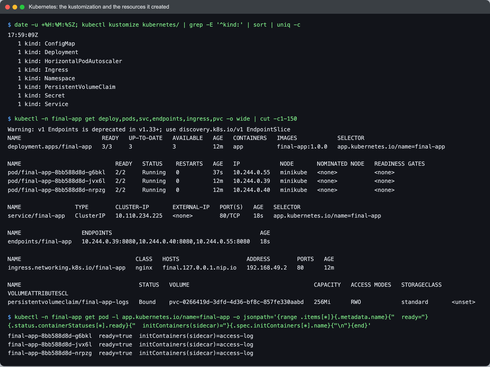
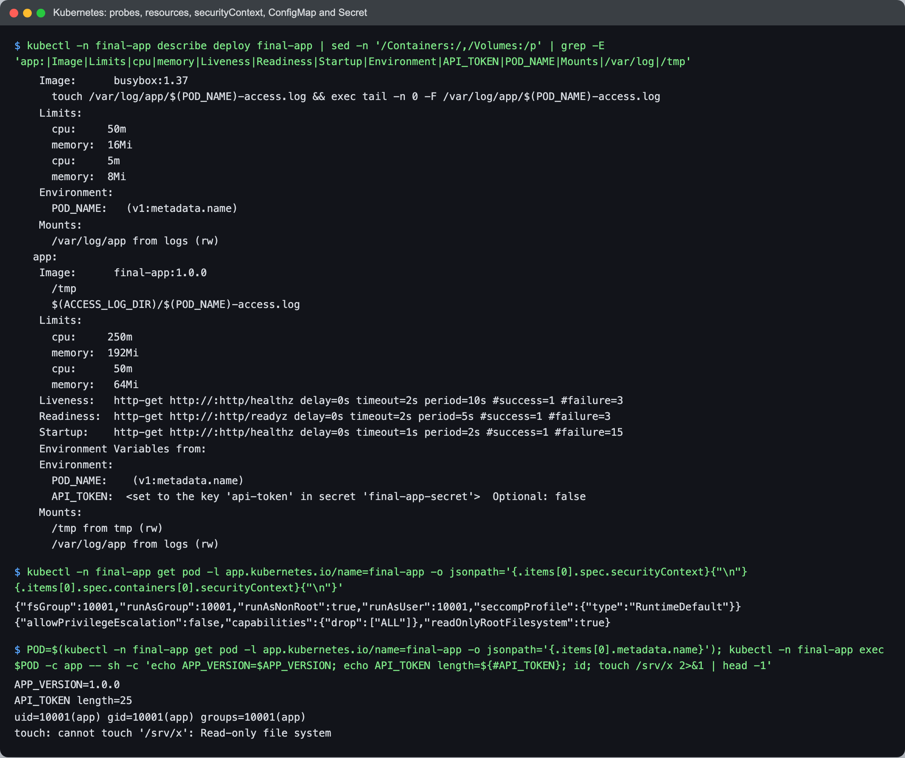
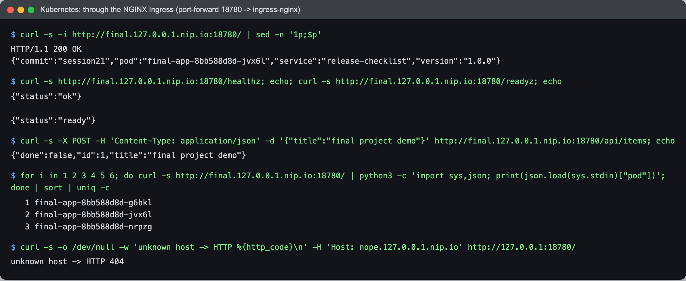
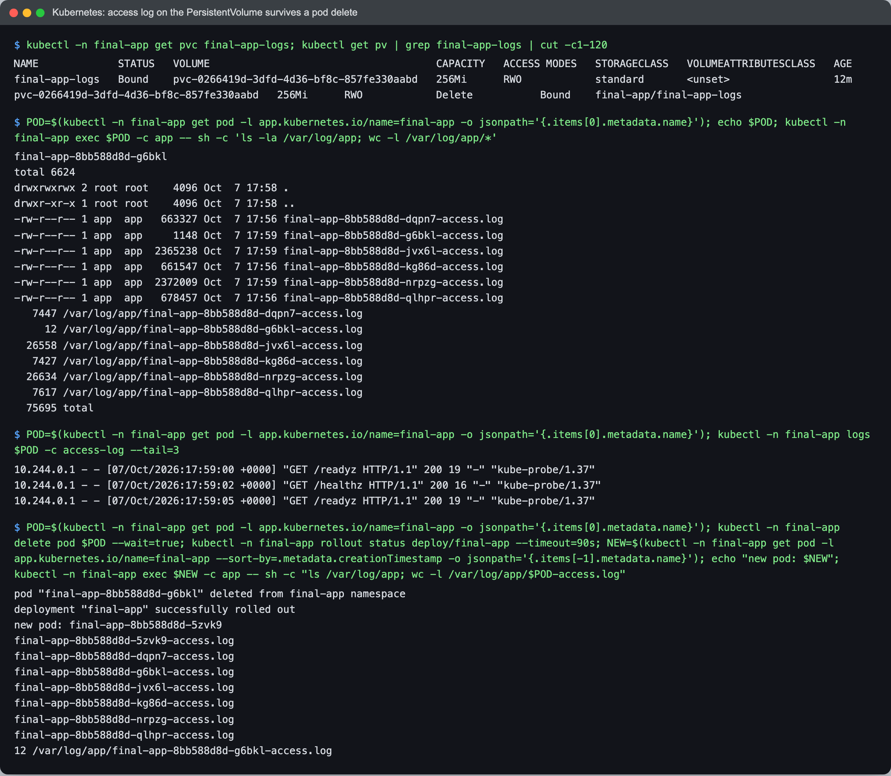
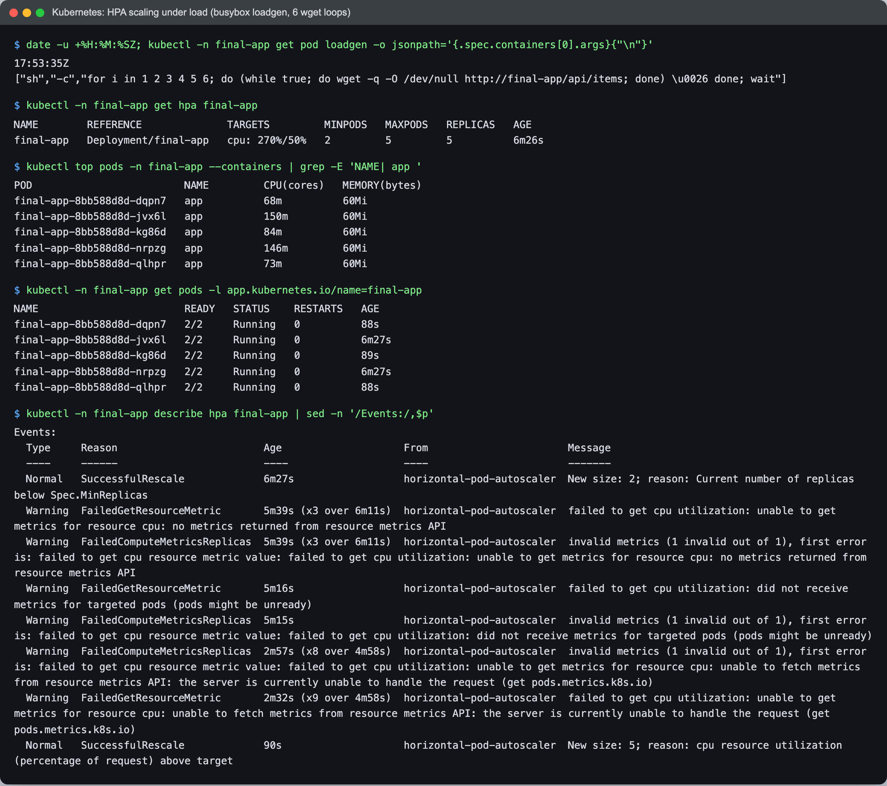

# Kubernetes deployment of the final project

Netram, Enrollment No 24BCS10329

I deployed my Session 17 Flask app (the "release-checklist" API, port 8080, `/healthz` and `/readyz` endpoints) to minikube (Kubernetes v1.37, docker driver) in the namespace `final-app`. All manifests are in [`../kubernetes/`](../kubernetes/) and are tied together by `kustomization.yaml`, so `kubectl apply -k kubernetes/` creates everything, and the Argo CD overlay in `../gitops/overlays/prod` reuses the same folder as its base.

The image is built from `session-17-devsecops/task/Dockerfile`. `minikube image build` could not read the Dockerfile from my temp checkout path ("open Dockerfile: no such file or directory"), so I built it with the host Docker (`docker build -t final-app:1.0.0 .`) and copied it into the node with `minikube image load final-app:1.0.0`. The Deployment uses `imagePullPolicy: IfNotPresent` so the kubelet uses that local copy instead of trying Docker Hub.

## What each file does and why

| File | Why it is there |
|---|---|
| `namespace.yaml` | Keeps the app apart from the monitoring, argocd and troubleshooting namespaces. |
| `configmap.yaml` | `APP_VERSION`, `GIT_SHA` (the app prints them on `/`) and `ACCESS_LOG_DIR`. Loaded with `envFrom`. |
| `secret.yaml` | A fake demo token, exposed as `API_TOKEN` through `secretKeyRef`. The app does not use it for anything; it shows the wiring. A real token would come from Sealed Secrets or External Secrets, not from Git. |
| `pvc.yaml` | 256Mi volume for the gunicorn access logs (explained below). |
| `deployment.yaml` | Startup, liveness and readiness probes, requests/limits, a non-root read-only securityContext, and a native sidecar. It has no `replicas` field because the HPA owns the replica count. |
| `service.yaml` | ClusterIP on port 80, forwarding to the named port `http` (8080). |
| `ingress.yaml` | Class `nginx`, host `final.127.0.0.1.nip.io`. nip.io resolves that name to 127.0.0.1, so it works with a port-forward. |
| `hpa.yaml` | autoscaling/v2 on CPU, 50% of the request, min 2 / max 5, with a 60s scale-down window so the demo scales back quickly. |

### Probes
- **startupProbe** `/healthz` every 2s, up to 15 failures (30s). Liveness only starts after this passes, so a slow first boot cannot get the container killed.
- **livenessProbe** `/healthz` every 10s. If gunicorn hangs, the kubelet restarts the container.
- **readinessProbe** `/readyz` every 5s. While it fails the pod is taken out of the Service endpoints, so the Ingress stops sending it traffic without restarting it.

### Security context
The pod runs as UID/GID 10001 (the user created in the Dockerfile) with `runAsNonRoot`, `seccompProfile: RuntimeDefault`, no Linux capabilities, no privilege escalation and a read-only root filesystem. The service account token is not mounted because the app never calls the Kubernetes API. The only writable paths are `/tmp` (a small in-memory emptyDir for gunicorn worker heartbeat files) and `/var/log/app` (the PVC).

### Why the PVC holds logs
The app keeps its checklist items in memory, so there is no application data to persist. The useful thing to keep across restarts is the access log. I changed the container args so gunicorn writes `--access-logfile /var/log/app/<pod-name>-access.log` (Kubernetes expands `$(ACCESS_LOG_DIR)` and `$(POD_NAME)` in args). Because that takes the access log off stdout, a native sidecar (an init container with `restartPolicy: Always`, busybox `tail -F`) streams the file back to stdout, so `kubectl logs -c access-log` still works. RWO is fine because minikube has a single node and all replicas land on it; on a multi-node cluster I would use RWX storage or ship logs to Loki instead.

## Applied resources



```text
$ date -u +%H:%M:%SZ; kubectl kustomize kubernetes/ | grep -E '^kind:' | sort | uniq -c
17:59:09Z
   1 kind: ConfigMap
   1 kind: Deployment
   1 kind: HorizontalPodAutoscaler
   1 kind: Ingress
   1 kind: Namespace
   1 kind: PersistentVolumeClaim
   1 kind: Secret
   1 kind: Service

$ kubectl -n final-app get deploy,pods,svc,endpoints,ingress,pvc -o wide | cut -c1-150
Warning: v1 Endpoints is deprecated in v1.33+; use discovery.k8s.io/v1 EndpointSlice
NAME                        READY   UP-TO-DATE   AVAILABLE   AGE   CONTAINERS   IMAGES            SELECTOR
deployment.apps/final-app   3/3     3            3           12m   app          final-app:1.0.0   app.kubernetes.io/name=final-app

NAME                            READY   STATUS    RESTARTS   AGE   IP            NODE       NOMINATED NODE   READINESS GATES
pod/final-app-8bb588d8d-g6bkl   2/2     Running   0          37s   10.244.0.55   minikube   <none>           <none>
pod/final-app-8bb588d8d-jvx6l   2/2     Running   0          12m   10.244.0.39   minikube   <none>           <none>
pod/final-app-8bb588d8d-nrpzg   2/2     Running   0          12m   10.244.0.40   minikube   <none>           <none>

NAME                TYPE        CLUSTER-IP       EXTERNAL-IP   PORT(S)   AGE   SELECTOR
service/final-app   ClusterIP   10.110.234.225   <none>        80/TCP    18s   app.kubernetes.io/name=final-app

NAME                  ENDPOINTS                                            AGE
endpoints/final-app   10.244.0.39:8080,10.244.0.40:8080,10.244.0.55:8080   18s

NAME                                  CLASS   HOSTS                    ADDRESS        PORTS   AGE
ingress.networking.k8s.io/final-app   nginx   final.127.0.0.1.nip.io   192.168.49.2   80      12m

NAME                                   STATUS   VOLUME                                     CAPACITY   ACCESS MODES   STORAGECLASS   VOLUMEATTRIBUTESCL
persistentvolumeclaim/final-app-logs   Bound    pvc-0266419d-3dfd-4d36-bf8c-857fe330aabd   256Mi      RWO            standard       <unset>

$ kubectl -n final-app get pod -l app.kubernetes.io/name=final-app -o jsonpath='{range .items[*]}{.metadata.name}{"  ready="}{.status.containerStatuses[*].ready}{"  initContainers(sidecar)="}{.spec.initContainers[*].name}{"\n"}{end}'
final-app-8bb588d8d-g6bkl  ready=true  initContainers(sidecar)=access-log
final-app-8bb588d8d-jvx6l  ready=true  initContainers(sidecar)=access-log
final-app-8bb588d8d-nrpzg  ready=true  initContainers(sidecar)=access-log
```

Every pod shows `2/2`: the app container plus the `access-log` sidecar.

## Probes, resources, securityContext, ConfigMap and Secret



```text
$ kubectl -n final-app describe deploy final-app | sed -n '/Containers:/,/Volumes:/p' | grep -E 'app:|Image|Limits|cpu|memory|Liveness|Readiness|Startup|Environment|API_TOKEN|POD_NAME|Mounts|/var/log|/tmp' 
    Image:      busybox:1.37
      touch /var/log/app/$(POD_NAME)-access.log && exec tail -n 0 -F /var/log/app/$(POD_NAME)-access.log
    Limits:
      cpu:     50m
      memory:  16Mi
      cpu:     5m
      memory:  8Mi
    Environment:
      POD_NAME:   (v1:metadata.name)
    Mounts:
      /var/log/app from logs (rw)
   app:
    Image:      final-app:1.0.0
      /tmp
      $(ACCESS_LOG_DIR)/$(POD_NAME)-access.log
    Limits:
      cpu:     250m
      memory:  192Mi
      cpu:      50m
      memory:   64Mi
    Liveness:   http-get http://:http/healthz delay=0s timeout=2s period=10s #success=1 #failure=3
    Readiness:  http-get http://:http/readyz delay=0s timeout=2s period=5s #success=1 #failure=3
    Startup:    http-get http://:http/healthz delay=0s timeout=1s period=2s #success=1 #failure=15
    Environment Variables from:
    Environment:
      POD_NAME:    (v1:metadata.name)
      API_TOKEN:  <set to the key 'api-token' in secret 'final-app-secret'>  Optional: false
    Mounts:
      /tmp from tmp (rw)
      /var/log/app from logs (rw)

$ kubectl -n final-app get pod -l app.kubernetes.io/name=final-app -o jsonpath='{.items[0].spec.securityContext}{"\n"}{.items[0].spec.containers[0].securityContext}{"\n"}'
{"fsGroup":10001,"runAsGroup":10001,"runAsNonRoot":true,"runAsUser":10001,"seccompProfile":{"type":"RuntimeDefault"}}
{"allowPrivilegeEscalation":false,"capabilities":{"drop":["ALL"]},"readOnlyRootFilesystem":true}

$ POD=$(kubectl -n final-app get pod -l app.kubernetes.io/name=final-app -o jsonpath='{.items[0].metadata.name}'); kubectl -n final-app exec $POD -c app -- sh -c 'echo APP_VERSION=$APP_VERSION; echo API_TOKEN length=${#API_TOKEN}; id; touch /srv/x 2>&1 | head -1'
APP_VERSION=1.0.0
API_TOKEN length=25
uid=10001(app) gid=10001(app) groups=10001(app)
touch: cannot touch '/srv/x': Read-only file system
```

The last command proves three things inside the running container: the ConfigMap value arrived, the Secret arrived (I print only its length, not the value), the process is UID 10001, and the root filesystem really is read-only.

## Through the Ingress

I reached the NGINX ingress controller with `kubectl -n ingress-nginx port-forward svc/ingress-nginx-controller 18780:80`.



```text
$ curl -s -i http://final.127.0.0.1.nip.io:18780/ | sed -n '1p;$p'
HTTP/1.1 200 OK
{"commit":"session21","pod":"final-app-8bb588d8d-jvx6l","service":"release-checklist","version":"1.0.0"}

$ curl -s http://final.127.0.0.1.nip.io:18780/healthz; echo; curl -s http://final.127.0.0.1.nip.io:18780/readyz; echo
{"status":"ok"}

{"status":"ready"}

$ curl -s -X POST -H 'Content-Type: application/json' -d '{"title":"final project demo"}' http://final.127.0.0.1.nip.io:18780/api/items; echo
{"done":false,"id":1,"title":"final project demo"}

$ for i in 1 2 3 4 5 6; do curl -s http://final.127.0.0.1.nip.io:18780/ | python3 -c 'import sys,json; print(json.load(sys.stdin)["pod"])'; done | sort | uniq -c
   1 final-app-8bb588d8d-g6bkl
   2 final-app-8bb588d8d-jvx6l
   3 final-app-8bb588d8d-nrpzg

$ curl -s -o /dev/null -w 'unknown host -> HTTP %{http_code}\n' -H 'Host: nope.127.0.0.1.nip.io' http://127.0.0.1:18780/
unknown host -> HTTP 404
```

Requests are spread over all replicas. Because each pod has its own in-memory store, a POST on one pod is not visible on another; that is a known limit of this demo app, not of Kubernetes.

## The PVC keeps logs across a pod delete



```text
$ kubectl -n final-app get pvc final-app-logs; kubectl get pv | grep final-app-logs | cut -c1-120
NAME             STATUS   VOLUME                                     CAPACITY   ACCESS MODES   STORAGECLASS   VOLUMEATTRIBUTESCLASS   AGE
final-app-logs   Bound    pvc-0266419d-3dfd-4d36-bf8c-857fe330aabd   256Mi      RWO            standard       <unset>                 12m
pvc-0266419d-3dfd-4d36-bf8c-857fe330aabd   256Mi      RWO            Delete           Bound    final-app/final-app-logs

$ POD=$(kubectl -n final-app get pod -l app.kubernetes.io/name=final-app -o jsonpath='{.items[0].metadata.name}'); echo $POD; kubectl -n final-app exec $POD -c app -- sh -c 'ls -la /var/log/app; wc -l /var/log/app/*'
final-app-8bb588d8d-g6bkl
total 6624
drwxrwxrwx 2 root root    4096 Oct  7 17:58 .
drwxr-xr-x 1 root root    4096 Oct  7 17:58 ..
-rw-r--r-- 1 app  app   663327 Oct  7 17:56 final-app-8bb588d8d-dqpn7-access.log
-rw-r--r-- 1 app  app     1148 Oct  7 17:59 final-app-8bb588d8d-g6bkl-access.log
-rw-r--r-- 1 app  app  2365238 Oct  7 17:59 final-app-8bb588d8d-jvx6l-access.log
-rw-r--r-- 1 app  app   661547 Oct  7 17:56 final-app-8bb588d8d-kg86d-access.log
-rw-r--r-- 1 app  app  2372009 Oct  7 17:59 final-app-8bb588d8d-nrpzg-access.log
-rw-r--r-- 1 app  app   678457 Oct  7 17:56 final-app-8bb588d8d-qlhpr-access.log
   7447 /var/log/app/final-app-8bb588d8d-dqpn7-access.log
     12 /var/log/app/final-app-8bb588d8d-g6bkl-access.log
  26558 /var/log/app/final-app-8bb588d8d-jvx6l-access.log
   7427 /var/log/app/final-app-8bb588d8d-kg86d-access.log
  26634 /var/log/app/final-app-8bb588d8d-nrpzg-access.log
   7617 /var/log/app/final-app-8bb588d8d-qlhpr-access.log
  75695 total

$ POD=$(kubectl -n final-app get pod -l app.kubernetes.io/name=final-app -o jsonpath='{.items[0].metadata.name}'); kubectl -n final-app logs $POD -c access-log --tail=3
10.244.0.1 - - [07/Oct/2026:17:59:00 +0000] "GET /readyz HTTP/1.1" 200 19 "-" "kube-probe/1.37"
10.244.0.1 - - [07/Oct/2026:17:59:02 +0000] "GET /healthz HTTP/1.1" 200 16 "-" "kube-probe/1.37"
10.244.0.1 - - [07/Oct/2026:17:59:05 +0000] "GET /readyz HTTP/1.1" 200 19 "-" "kube-probe/1.37"

$ POD=$(kubectl -n final-app get pod -l app.kubernetes.io/name=final-app -o jsonpath='{.items[0].metadata.name}'); kubectl -n final-app delete pod $POD --wait=true; kubectl -n final-app rollout status deploy/final-app --timeout=90s; NEW=$(kubectl -n final-app get pod -l app.kubernetes.io/name=final-app --sort-by=.metadata.creationTimestamp -o jsonpath='{.items[-1].metadata.name}'); echo "new pod: $NEW"; kubectl -n final-app exec $NEW -c app -- sh -c "ls /var/log/app; wc -l /var/log/app/$POD-access.log"
pod "final-app-8bb588d8d-g6bkl" deleted from final-app namespace
deployment "final-app" successfully rolled out
new pod: final-app-8bb588d8d-5zvk9
final-app-8bb588d8d-5zvk9-access.log
final-app-8bb588d8d-dqpn7-access.log
final-app-8bb588d8d-g6bkl-access.log
final-app-8bb588d8d-jvx6l-access.log
final-app-8bb588d8d-kg86d-access.log
final-app-8bb588d8d-nrpzg-access.log
final-app-8bb588d8d-qlhpr-access.log
12 /var/log/app/final-app-8bb588d8d-g6bkl-access.log
```

After I deleted pod `g6bkl`, its replacement `5zvk9` still sees `final-app-8bb588d8d-g6bkl-access.log` with the same 12 lines, plus the logs of the pods the HPA created and removed during the load test.

## HPA under load

I started a busybox pod running six parallel `wget` loops against the Service, then waited about five minutes.



```text
$ date -u +%H:%M:%SZ; kubectl -n final-app get pod loadgen -o jsonpath='{.spec.containers[0].args}{"\n"}'
17:53:35Z
["sh","-c","for i in 1 2 3 4 5 6; do (while true; do wget -q -O /dev/null http://final-app/api/items; done) \u0026 done; wait"]

$ kubectl -n final-app get hpa final-app
NAME        REFERENCE              TARGETS         MINPODS   MAXPODS   REPLICAS   AGE
final-app   Deployment/final-app   cpu: 270%/50%   2         5         5          6m26s

$ kubectl top pods -n final-app --containers | grep -E 'NAME| app '
POD                         NAME         CPU(cores)   MEMORY(bytes)   
final-app-8bb588d8d-dqpn7   app          68m          60Mi            
final-app-8bb588d8d-jvx6l   app          150m         60Mi            
final-app-8bb588d8d-kg86d   app          84m          60Mi            
final-app-8bb588d8d-nrpzg   app          146m         60Mi            
final-app-8bb588d8d-qlhpr   app          73m          60Mi

$ kubectl -n final-app get pods -l app.kubernetes.io/name=final-app
NAME                        READY   STATUS    RESTARTS   AGE
final-app-8bb588d8d-dqpn7   2/2     Running   0          88s
final-app-8bb588d8d-jvx6l   2/2     Running   0          6m27s
final-app-8bb588d8d-kg86d   2/2     Running   0          89s
final-app-8bb588d8d-nrpzg   2/2     Running   0          6m27s
final-app-8bb588d8d-qlhpr   2/2     Running   0          88s

$ kubectl -n final-app describe hpa final-app | sed -n '/Events:/,$p'
Events:
  Type     Reason                        Age                    From                       Message
  ----     ------                        ----                   ----                       -------
  Normal   SuccessfulRescale             6m27s                  horizontal-pod-autoscaler  New size: 2; reason: Current number of replicas below Spec.MinReplicas
  Warning  FailedGetResourceMetric       5m39s (x3 over 6m11s)  horizontal-pod-autoscaler  failed to get cpu utilization: unable to get metrics for resource cpu: no metrics returned from resource metrics API
  Warning  FailedComputeMetricsReplicas  5m39s (x3 over 6m11s)  horizontal-pod-autoscaler  invalid metrics (1 invalid out of 1), first error is: failed to get cpu resource metric value: failed to get cpu utilization: unable to get metrics for resource cpu: no metrics returned from resource metrics API
  Warning  FailedGetResourceMetric       5m16s                  horizontal-pod-autoscaler  failed to get cpu utilization: did not receive metrics for targeted pods (pods might be unready)
  Warning  FailedComputeMetricsReplicas  5m15s                  horizontal-pod-autoscaler  invalid metrics (1 invalid out of 1), first error is: failed to get cpu resource metric value: failed to get cpu utilization: did not receive metrics for targeted pods (pods might be unready)
  Warning  FailedComputeMetricsReplicas  2m57s (x8 over 4m58s)  horizontal-pod-autoscaler  invalid metrics (1 invalid out of 1), first error is: failed to get cpu resource metric value: failed to get cpu utilization: unable to get metrics for resource cpu: unable to fetch metrics from resource metrics API: the server is currently unable to handle the request (get pods.metrics.k8s.io)
  Warning  FailedGetResourceMetric       2m32s (x9 over 4m58s)  horizontal-pod-autoscaler  failed to get cpu utilization: unable to get metrics for resource cpu: unable to fetch metrics from resource metrics API: the server is currently unable to handle the request (get pods.metrics.k8s.io)
  Normal   SuccessfulRescale             90s                    horizontal-pod-autoscaler  New size: 5; reason: cpu resource utilization (percentage of request) above target
```

The HPA went from 2 to 5 replicas (its maximum) at 270% of the 50m CPU request. The `FailedGetResourceMetric` warnings in the events are from the first minute after the Deployment was created: metrics-server only has a CPU sample for a pod after it has been running for a scrape interval or two, so the HPA reports `<unknown>` until then. After I deleted the load generator the HPA scaled back to 2 (and later to 3, once Argo CD raised `minReplicas`, see [gitops.md](gitops.md)).
