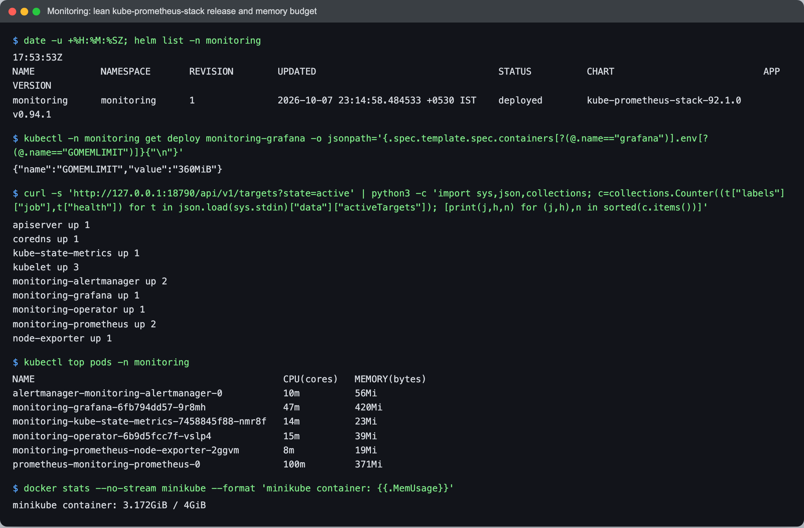
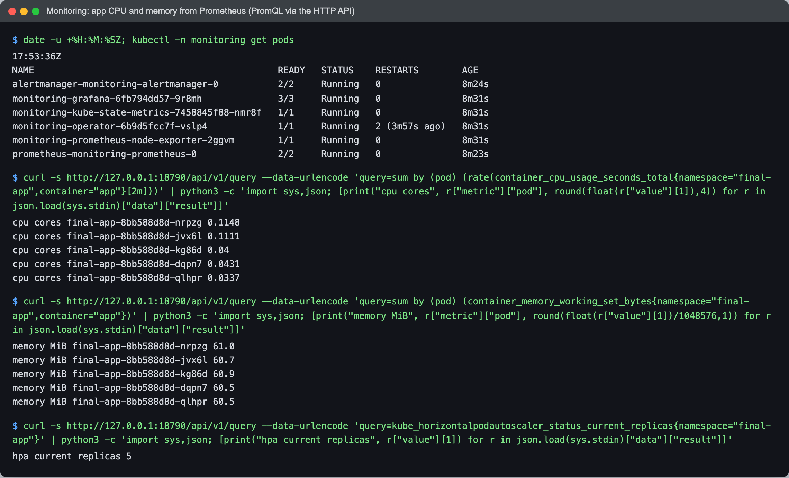
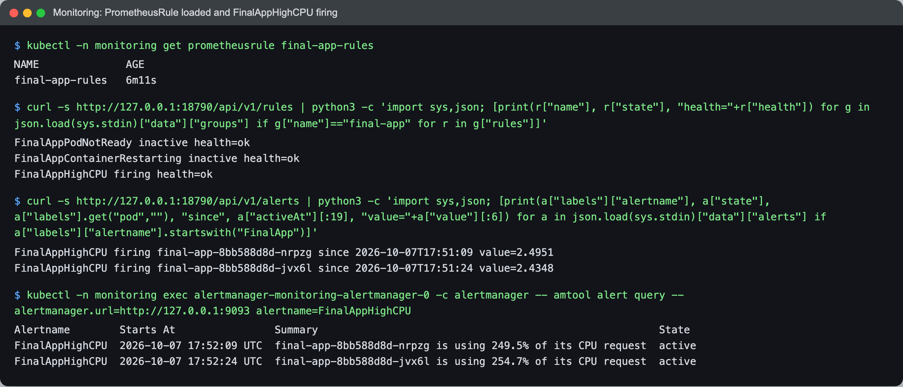

# Monitoring with Prometheus, Alertmanager and Grafana

Netram, Enrollment No 24BCS10329

I installed kube-prometheus-stack as Helm release `monitoring` in the namespace `monitoring`, using [`../monitoring/kube-prometheus-stack-values.yaml`](../monitoring/kube-prometheus-stack-values.yaml). It is the same lean values file I wrote for Session 20, because the constraint is the same: one minikube node with a 4 GiB memory limit that also runs the app, the ingress controller and later Argo CD.

```bash
helm install monitoring prometheus-community/kube-prometheus-stack -n monitoring --create-namespace \
  -f monitoring/kube-prometheus-stack-values.yaml --wait
kubectl apply -f monitoring/final-app-rules.yaml
```

What the values file changes and why:
- etcd, controller-manager, scheduler and kube-proxy scraping are off. minikube does not expose them on reachable addresses, so they would only be permanently DOWN targets and noisy alerts.
- Prometheus keeps 2h of data in an emptyDir and has an 800Mi limit. Nothing here needs long retention.
- `ruleSelectorNilUsesHelmValues: false` (and the same for ServiceMonitors) so Prometheus picks up my PrometheusRule without a `release: monitoring` label.
- Grafana has a 512Mi limit and `GOMEMLIMIT=360MiB`. In Session 20 Grafana was OOMKilled twice: Go does not read the cgroup limit by itself, so the heap grew past the limit. GOMEMLIMIT makes the Go garbage collector work harder before reaching it.

## The stack and the memory budget



```text
$ date -u +%H:%M:%SZ; helm list -n monitoring
17:53:53Z
NAME      	NAMESPACE 	REVISION	UPDATED                             	STATUS  	CHART                       	APP VERSION
monitoring	monitoring	1       	2026-10-07 23:14:58.484533 +0530 IST	deployed	kube-prometheus-stack-92.1.0	v0.94.1

$ kubectl -n monitoring get deploy monitoring-grafana -o jsonpath='{.spec.template.spec.containers[?(@.name=="grafana")].env[?(@.name=="GOMEMLIMIT")]}{"\n"}'
{"name":"GOMEMLIMIT","value":"360MiB"}

$ curl -s 'http://127.0.0.1:18790/api/v1/targets?state=active' | python3 -c 'import sys,json,collections; c=collections.Counter((t["labels"]["job"],t["health"]) for t in json.load(sys.stdin)["data"]["activeTargets"]); [print(j,h,n) for (j,h),n in sorted(c.items())]'
apiserver up 1
coredns up 1
kube-state-metrics up 1
kubelet up 3
monitoring-alertmanager up 2
monitoring-grafana up 1
monitoring-operator up 1
monitoring-prometheus up 2
node-exporter up 1

$ kubectl top pods -n monitoring
NAME                                             CPU(cores)   MEMORY(bytes)   
alertmanager-monitoring-alertmanager-0           10m          56Mi            
monitoring-grafana-6fb794dd57-9r8mh              47m          420Mi           
monitoring-kube-state-metrics-7458845f88-nmr8f   14m          23Mi            
monitoring-operator-6b9d5fcc7f-vslp4             15m          39Mi            
monitoring-prometheus-node-exporter-2ggvm        8m           19Mi            
prometheus-monitoring-prometheus-0               100m         371Mi

$ docker stats --no-stream minikube --format 'minikube container: {{.MemUsage}}'
minikube container: 3.172GiB / 4GiB
```

All scrape targets are UP and the whole minikube container used 3.17 GiB of 4 GiB with the app scaled to 5 replicas, the monitoring stack and ingress running. That is under my 3.5 GiB budget, but close enough that I uninstalled the monitoring release before installing Argo CD.

The app itself has no `/metrics` endpoint (it is the Session 17 app and I did not change its code here), so I monitor it through the metrics Kubernetes already exposes: cAdvisor in the kubelet for CPU and memory, and kube-state-metrics for readiness, restarts, requests and HPA state.

## App CPU and memory (PromQL)

I queried Prometheus through its HTTP API over `kubectl -n monitoring port-forward svc/monitoring-prometheus 18790:9090`, while the load generator from the HPA test was running.



```text
$ date -u +%H:%M:%SZ; kubectl -n monitoring get pods
17:53:36Z
NAME                                             READY   STATUS    RESTARTS        AGE
alertmanager-monitoring-alertmanager-0           2/2     Running   0               8m24s
monitoring-grafana-6fb794dd57-9r8mh              3/3     Running   0               8m31s
monitoring-kube-state-metrics-7458845f88-nmr8f   1/1     Running   0               8m31s
monitoring-operator-6b9d5fcc7f-vslp4             1/1     Running   2 (3m57s ago)   8m31s
monitoring-prometheus-node-exporter-2ggvm        1/1     Running   0               8m31s
prometheus-monitoring-prometheus-0               2/2     Running   0               8m23s

$ curl -s http://127.0.0.1:18790/api/v1/query --data-urlencode 'query=sum by (pod) (rate(container_cpu_usage_seconds_total{namespace="final-app",container="app"}[2m]))' | python3 -c 'import sys,json; [print("cpu cores", r["metric"]["pod"], round(float(r["value"][1]),4)) for r in json.load(sys.stdin)["data"]["result"]]'
cpu cores final-app-8bb588d8d-nrpzg 0.1148
cpu cores final-app-8bb588d8d-jvx6l 0.1111
cpu cores final-app-8bb588d8d-kg86d 0.04
cpu cores final-app-8bb588d8d-dqpn7 0.0431
cpu cores final-app-8bb588d8d-qlhpr 0.0337

$ curl -s http://127.0.0.1:18790/api/v1/query --data-urlencode 'query=sum by (pod) (container_memory_working_set_bytes{namespace="final-app",container="app"})' | python3 -c 'import sys,json; [print("memory MiB", r["metric"]["pod"], round(float(r["value"][1])/1048576,1)) for r in json.load(sys.stdin)["data"]["result"]]'
memory MiB final-app-8bb588d8d-nrpzg 61.0
memory MiB final-app-8bb588d8d-jvx6l 60.7
memory MiB final-app-8bb588d8d-kg86d 60.9
memory MiB final-app-8bb588d8d-dqpn7 60.5
memory MiB final-app-8bb588d8d-qlhpr 60.5

$ curl -s http://127.0.0.1:18790/api/v1/query --data-urlencode 'query=kube_horizontalpodautoscaler_status_current_replicas{namespace="final-app"}' | python3 -c 'import sys,json; [print("hpa current replicas", r["value"][1]) for r in json.load(sys.stdin)["data"]["result"]]'
hpa current replicas 5
```

The two older pods were using about 0.11 cores each (more than double their 50m request) and the three pods the HPA had just added were still warming up. Memory stayed flat at about 61 MiB per pod, well inside the 192Mi limit.

## Alert rules

[`../monitoring/final-app-rules.yaml`](../monitoring/final-app-rules.yaml) defines three alerts:

| Alert | Expression (short) | Why |
|---|---|---|
| `FinalAppPodNotReady` | `kube_pod_status_ready{condition="false"} > 0` for 1m, in `final-app` and `final-troubleshoot` | A pod that never becomes Ready gets no traffic; this is what bugs 1 to 3 of the troubleshooting challenge look like. |
| `FinalAppContainerRestarting` | `increase(kube_pod_container_status_restarts_total[10m]) > 2` | Catches crash loops and liveness probe kills. |
| `FinalAppHighCPU` | pod CPU rate / pod CPU request `> 0.8` for 1m | Same base as the HPA. If it fires while the HPA is already at max replicas, the app needs a higher `maxReplicas` or more CPU. |

## An alert firing



```text
$ kubectl -n monitoring get prometheusrule final-app-rules
NAME              AGE
final-app-rules   6m11s

$ curl -s http://127.0.0.1:18790/api/v1/rules | python3 -c 'import sys,json; [print(r["name"], r["state"], "health="+r["health"]) for g in json.load(sys.stdin)["data"]["groups"] if g["name"]=="final-app" for r in g["rules"]]'
FinalAppPodNotReady inactive health=ok
FinalAppContainerRestarting inactive health=ok
FinalAppHighCPU firing health=ok

$ curl -s http://127.0.0.1:18790/api/v1/alerts | python3 -c 'import sys,json; [print(a["labels"]["alertname"], a["state"], a["labels"].get("pod",""), "since", a["activeAt"][:19], "value="+a["value"][:6]) for a in json.load(sys.stdin)["data"]["alerts"] if a["labels"]["alertname"].startswith("FinalApp")]'
FinalAppHighCPU firing final-app-8bb588d8d-nrpzg since 2026-10-07T17:51:09 value=2.4951
FinalAppHighCPU firing final-app-8bb588d8d-jvx6l since 2026-10-07T17:51:24 value=2.4348

$ kubectl -n monitoring exec alertmanager-monitoring-alertmanager-0 -c alertmanager -- amtool alert query --alertmanager.url=http://127.0.0.1:9093 alertname=FinalAppHighCPU
Alertname        Starts At                Summary                                                       State   
FinalAppHighCPU  2026-10-07 17:52:09 UTC  final-app-8bb588d8d-nrpzg is using 249.5% of its CPU request  active  
FinalAppHighCPU  2026-10-07 17:52:24 UTC  final-app-8bb588d8d-jvx6l is using 254.7% of its CPU request  active
```

`FinalAppHighCPU` fired for the two pods that carried the load before the HPA scaled out (about 250% of their request). Prometheus sent it to Alertmanager, which shows it as active. I did not configure a receiver (email or Slack), so the alert stops at Alertmanager; that would be the next step for a real team.

I did not take a Grafana screenshot this time; the PromQL output above is the same data a Grafana panel would plot.
