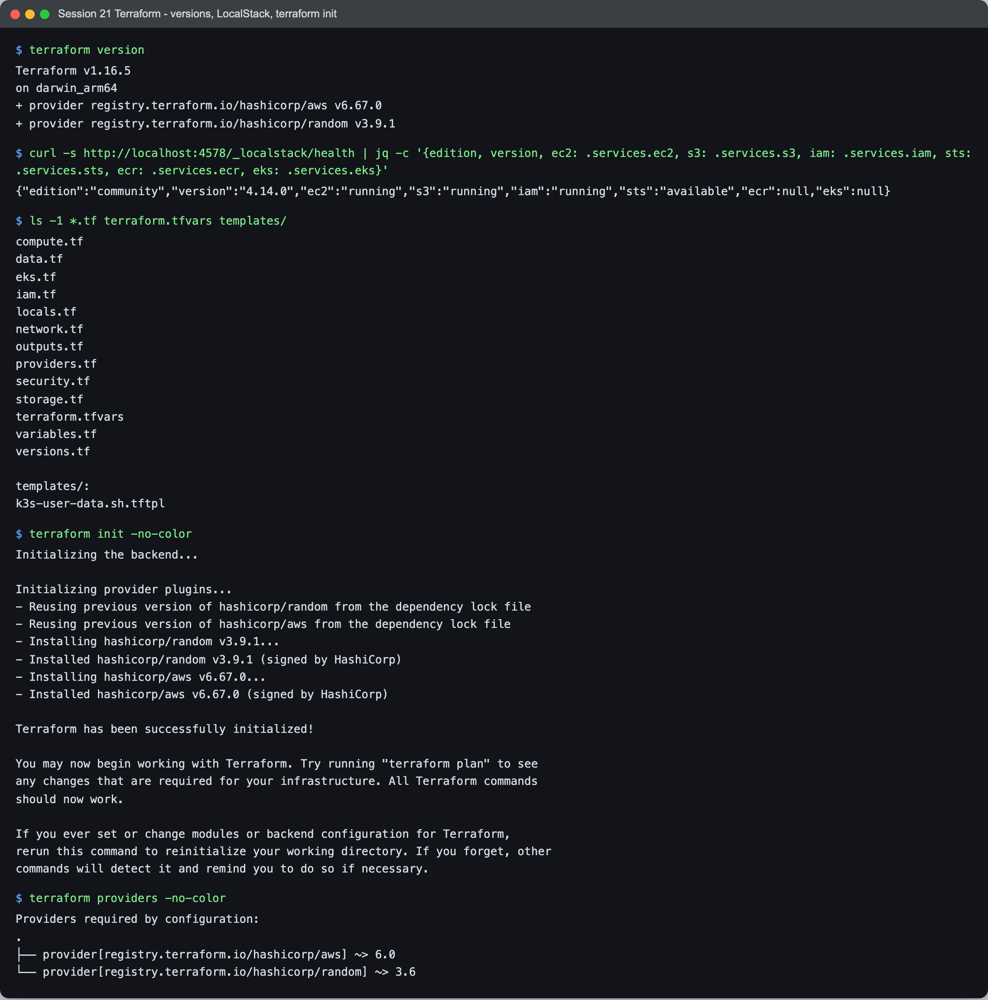
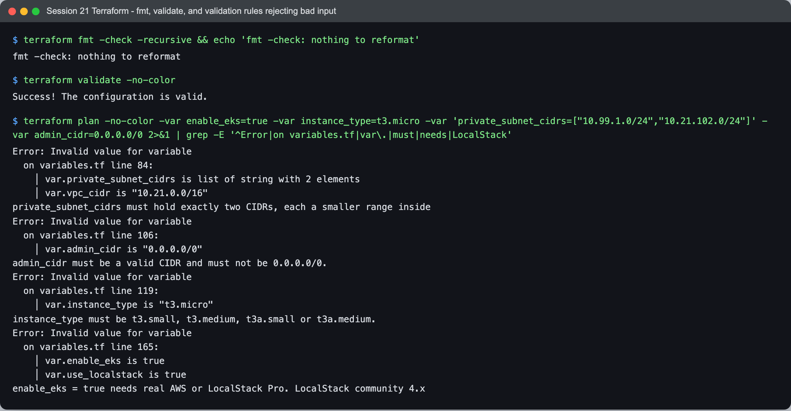
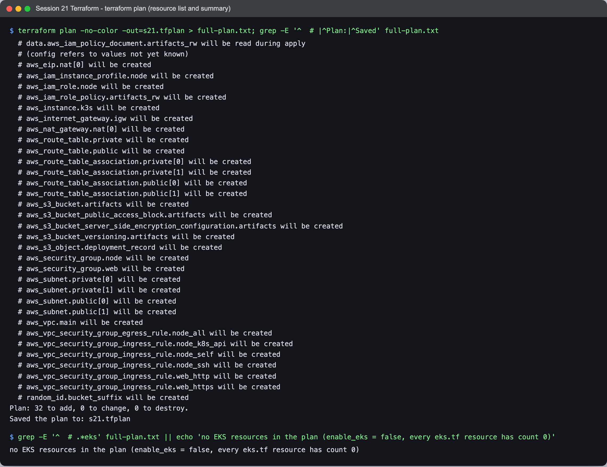
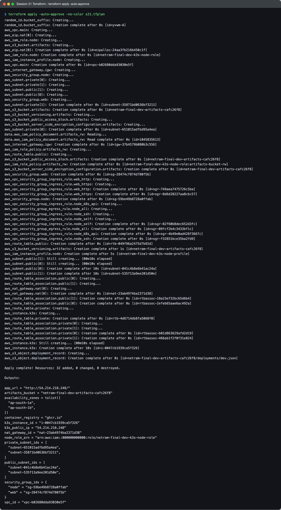
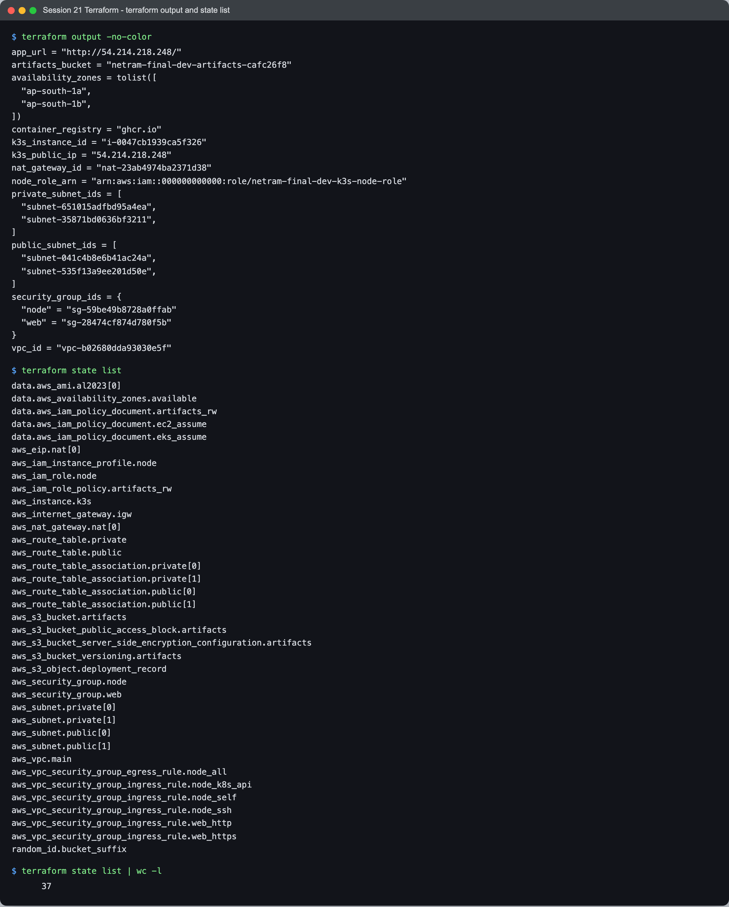
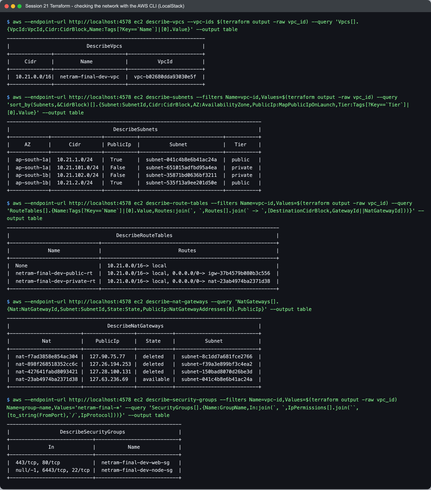
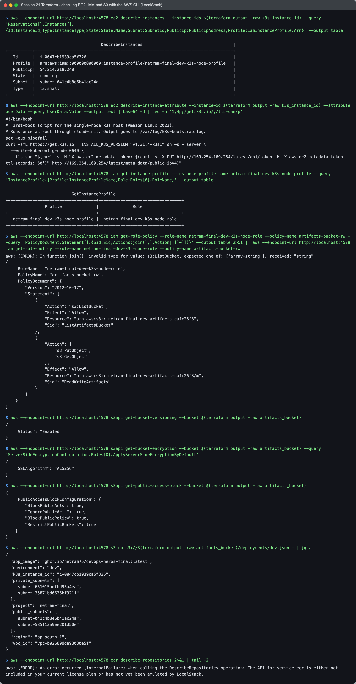
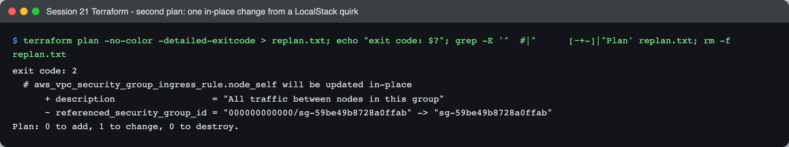
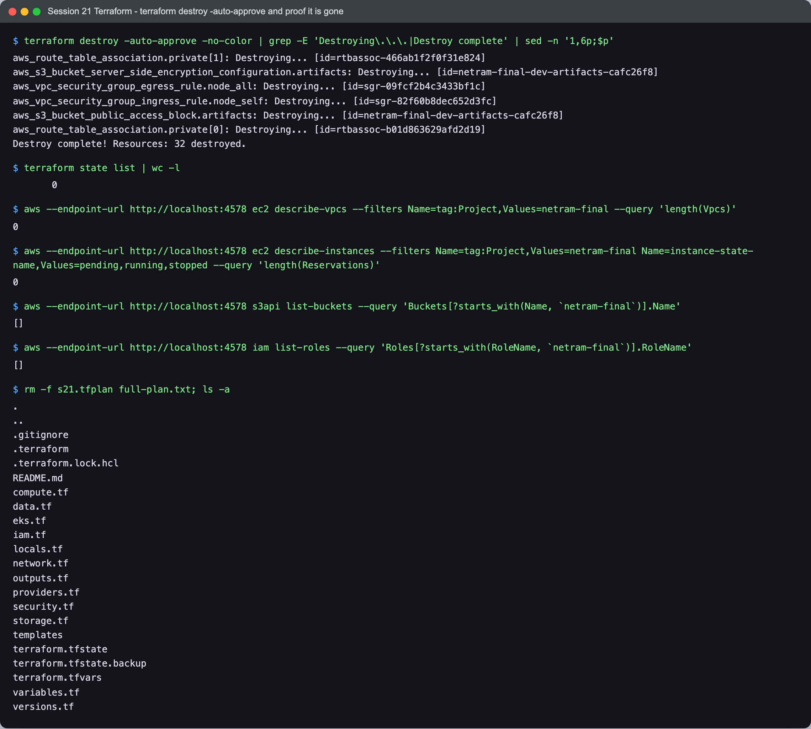

# Terraform: the AWS infrastructure for the final project

- **Name:** Netram
- **Enrollment No:** 24BCS10329

The code is in [`../terraform/`](../terraform/). I ran every command on this page myself, on
macOS (Apple Silicon), against LocalStack community 4.14.0 in Docker. I do not have an AWS
account for this course, so nothing here touched real AWS. The text blocks below are the
real output of those runs, and the screenshots in `../screenshots/tf-*.png` were rendered
from the same runs.

## What it builds

```text
                                   Internet
                                       |
                              +------------------+
                              | Internet gateway |
                              +------------------+
                                       |
 VPC 10.21.0.0/16 (ap-south-1)         |   public route table: 0.0.0.0/0 -> IGW
 +-------------------------------------+---------------------------------------+
 |                                                                             |
 |   ap-south-1a                              ap-south-1b                      |
 |   +-----------------------------+          +-----------------------------+  |
 |   | public  10.21.1.0/24        |          | public  10.21.2.0/24        |  |
 |   |                             |          |                             |  |
 |   |  EC2 t3.small (k3s server)  |          |  (spare, for a second node  |  |
 |   |   SG web : 80, 443 open     |          |   or a load balancer)       |  |
 |   |   SG node: 22, 6443 admin   |          |                             |  |
 |   |   IAM instance profile      |          |                             |  |
 |   |                             |          |                             |  |
 |   |  NAT gateway + Elastic IP   |          |                             |  |
 |   +--------------|--------------+          +-----------------------------+  |
 |                  |   private route table: 0.0.0.0/0 -> NAT                   |
 |   +--------------v--------------+          +-----------------------------+  |
 |   | private 10.21.101.0/24      |          | private 10.21.102.0/24      |  |
 |   |  (EKS nodes when            |          |  (EKS nodes when            |  |
 |   |   enable_eks = true)        |          |   enable_eks = true)        |  |
 |   +-----------------------------+          +-----------------------------+  |
 +-----------------------------------------------------------------------------+

 Outside the VPC:
   S3  netram-final-dev-artifacts-<random>  versioned, AES256, public access blocked
   IAM netram-final-dev-k3s-node-role       may only list/get/put in that bucket
   Images: ghcr.io/netram75/devops-heros-final (GHCR, pushed by the CI pipeline)
```

With the committed `terraform.tfvars` that is 32 resources. The files are split by concern:
`network.tf`, `security.tf`, `iam.tf`, `compute.tf`, `storage.tf`, `eks.tf`, plus
`variables.tf`, `outputs.tf`, `providers.tf`, `versions.tf`, `data.tf` and `locals.tf`.

## Why each piece is there

**VPC with 2 public and 2 private subnets in 2 AZs.** This is the standard shape for anything
that runs Kubernetes on AWS. EKS refuses to create a cluster unless its subnets span at least
two AZs, and an AWS load balancer also needs two. Public subnets are for things the internet
must reach (the k3s host, a load balancer, the NAT gateway). Private subnets have no route
from the internet at all, which is where EKS worker nodes would go. I tagged the subnets with
`kubernetes.io/role/elb` and `kubernetes.io/role/internal-elb` because that is how the AWS
load balancer controller picks subnets for public and internal load balancers.

**Internet gateway and the public route table.** The IGW alone does nothing. A subnet is
"public" only because its route table sends `0.0.0.0/0` to the IGW, so the route table and the
two associations are the part that really matters.

**One NAT gateway.** Private subnets still need outbound internet (to pull images from GHCR,
for example). I made one NAT gateway, not one per AZ, because each NAT gateway is billed per
hour and per GB. For a dev environment, losing outbound traffic from the private subnets if
ap-south-1a goes down is acceptable. It is behind `enable_nat_gateway`; with it set to false
the private route table only has the local route. LocalStack community does create the NAT
gateway as an API object, so I kept it on for the run below.

**Two security groups.** `web` only opens 80 and 443 to the world, which is what the k3s
Traefik ingress listens on. `node` opens SSH (22) and the Kubernetes API (6443) only to
`admin_cidr`, allows all traffic between members of the same group (node to node, for when a
second node or EKS workers join), and allows all outbound. The k3s host carries both. Keeping
them separate means I can later put the `web` group on a load balancer and take it off the
node without touching the admin rules. Every rule is its own `aws_vpc_security_group_*_rule`
resource, so adding one rule never rewrites the others.

**EC2 as a single-node k3s host.** EKS costs money for the control plane alone, plus nodes,
plus the NAT gateway. k3s is a certified Kubernetes in one binary, so the same manifests and
Helm chart that I ran on minikube run on it unchanged. The `user_data` template
(`templates/k3s-user-data.sh.tftpl`) installs a pinned k3s version, adds the public IP to the
API server certificate, waits for the node to be Ready and creates a first deployment from the
GHCR image. The instance uses IMDSv2 only (so an SSRF bug cannot read the role's keys with a
plain GET), an encrypted 20 GB gp3 root disk, and `depends_on` the public route table
association, because the k3s download on first boot needs the route to the IGW to exist
already. `instance_type` is limited to small and medium sizes because k3s wants about 2 GB of
memory.

**IAM role and instance profile.** The host should never have access keys on disk. An EC2
instance gets a role through an instance profile, so both exist. The inline policy allows
`s3:ListBucket` on the artifacts bucket and `s3:GetObject`/`s3:PutObject` on its objects, and
nothing else.

**S3 artifacts bucket.** For build artifacts and backups of the k3s state. Versioning means an
overwritten or deleted object can be recovered, AES256 default encryption means nothing is
stored in plain text, and all four public access block settings are on. The bucket name gets a
random suffix because S3 names are global. Terraform also writes a small
`deployments/dev.json` record into it built from the other resources' IDs, which is a nice way
to see the dependency graph: it is created last and destroyed first.

**ECR: not used.** I checked LocalStack's health endpoint (first screenshot): `ecr` is `null`
in the community edition, so there is no ECR API to create a repository against. The project's
registry is GHCR anyway, where the CI pipeline already pushes the image, so the only registry
setting here is the `app_image` variable, and the `container_registry` output shows `ghcr.io`.

**EKS: written but switched off.** `eks.tf` has the EKS cluster, a managed node group in the
private subnets, and the two IAM roles with the AWS managed policies they need. Every one of
them has `count = 0` (or an empty `for_each`) unless `enable_eks = true`. I kept it off for two
reasons: LocalStack community has no EKS API (EKS is LocalStack Pro only, `eks` is also `null`
in the health output), and on real AWS it would cost money for something one k3s VM does fine
for this project. `terraform validate` still checks the whole file, and a validation rule
refuses `enable_eks = true` together with `use_localstack = true`, so nobody wastes an apply
finding that out.

**The `use_localstack` switch.** Same idea as my Session 19 project. One provider block; when
`use_localstack` is true it uses fake keys, skips the credential and account checks, uses
path-style S3 URLs and points the ec2, iam, s3, sts and eks endpoints at
`localstack_endpoint`. When it is false, all of that disappears and the normal AWS credential
chain is used. None of the resource files know the difference.

## Running it

### Versions and init

I started LocalStack on port 4578 instead of the default 4566, so it cannot collide with the
LocalStack containers from earlier sessions (Session 19 used 4577), and pointed the AWS CLI away from any real profile with
`AWS_CONFIG_FILE=/dev/null AWS_SHARED_CREDENTIALS_FILE=/dev/null` and test keys.



```text
$ terraform version
Terraform v1.16.5
on darwin_arm64
+ provider registry.terraform.io/hashicorp/aws v6.67.0
+ provider registry.terraform.io/hashicorp/random v3.9.1

$ curl -s http://localhost:4578/_localstack/health | jq -c '{edition, version, ec2: .services.ec2, s3: .services.s3, iam: .services.iam, sts: .services.sts, ecr: .services.ecr, eks: .services.eks}'
{"edition":"community","version":"4.14.0","ec2":"running","s3":"running","iam":"running","sts":"available","ecr":null,"eks":null}

$ ls -1 *.tf terraform.tfvars templates/
compute.tf
data.tf
eks.tf
iam.tf
locals.tf
network.tf
outputs.tf
providers.tf
security.tf
storage.tf
terraform.tfvars
variables.tf
versions.tf

templates/:
k3s-user-data.sh.tftpl

$ terraform init -no-color
Initializing the backend...

Initializing provider plugins...
- Reusing previous version of hashicorp/random from the dependency lock file
- Reusing previous version of hashicorp/aws from the dependency lock file
- Installing hashicorp/random v3.9.1...
- Installed hashicorp/random v3.9.1 (signed by HashiCorp)
- Installing hashicorp/aws v6.67.0...
- Installed hashicorp/aws v6.67.0 (signed by HashiCorp)

Terraform has been successfully initialized!

You may now begin working with Terraform. Try running "terraform plan" to see
any changes that are required for your infrastructure. All Terraform commands
should now work.

If you ever set or change modules or backend configuration for Terraform,
rerun this command to reinitialize your working directory. If you forget, other
commands will detect it and remind you to do so if necessary.

$ terraform providers -no-color

Providers required by configuration:
.
├── provider[registry.terraform.io/hashicorp/aws] ~> 6.0
└── provider[registry.terraform.io/hashicorp/random] ~> 3.6
```

### fmt, validate, and the validation rules

`fmt -check` and `validate` pass. Then I fed four bad values on purpose: a private subnet
outside the VPC, SSH open to `0.0.0.0/0`, an instance too small for k3s, and EKS switched on
while using LocalStack. All four are rejected before Terraform calls any API.



```text
$ terraform fmt -check -recursive && echo 'fmt -check: nothing to reformat'
fmt -check: nothing to reformat

$ terraform validate -no-color
Success! The configuration is valid.

$ terraform plan -no-color -var enable_eks=true -var instance_type=t3.micro -var 'private_subnet_cidrs=["10.99.1.0/24","10.21.102.0/24"]' -var admin_cidr=0.0.0.0/0 2>&1 | grep -E '^Error|on variables.tf|var\.|must|needs|LocalStack' 
Error: Invalid value for variable
  on variables.tf line 84:
    │ var.private_subnet_cidrs is list of string with 2 elements
    │ var.vpc_cidr is "10.21.0.0/16"
private_subnet_cidrs must hold exactly two CIDRs, each a smaller range inside
Error: Invalid value for variable
  on variables.tf line 106:
    │ var.admin_cidr is "0.0.0.0/0"
admin_cidr must be a valid CIDR and must not be 0.0.0.0/0.
Error: Invalid value for variable
  on variables.tf line 119:
    │ var.instance_type is "t3.micro"
instance_type must be t3.small, t3.medium, t3a.small or t3a.medium.
Error: Invalid value for variable
  on variables.tf line 165:
    │ var.enable_eks is true
    │ var.use_localstack is true
enable_eks = true needs real AWS or LocalStack Pro. LocalStack community 4.x
```

### Plan

32 resources to add. No EKS resource shows up because of `count = 0`.



```text
$ terraform plan -no-color -out=s21.tfplan > full-plan.txt; grep -E '^  # |^Plan:|^Saved' full-plan.txt
  # data.aws_iam_policy_document.artifacts_rw will be read during apply
  # (config refers to values not yet known)
  # aws_eip.nat[0] will be created
  # aws_iam_instance_profile.node will be created
  # aws_iam_role.node will be created
  # aws_iam_role_policy.artifacts_rw will be created
  # aws_instance.k3s will be created
  # aws_internet_gateway.igw will be created
  # aws_nat_gateway.nat[0] will be created
  # aws_route_table.private will be created
  # aws_route_table.public will be created
  # aws_route_table_association.private[0] will be created
  # aws_route_table_association.private[1] will be created
  # aws_route_table_association.public[0] will be created
  # aws_route_table_association.public[1] will be created
  # aws_s3_bucket.artifacts will be created
  # aws_s3_bucket_public_access_block.artifacts will be created
  # aws_s3_bucket_server_side_encryption_configuration.artifacts will be created
  # aws_s3_bucket_versioning.artifacts will be created
  # aws_s3_object.deployment_record will be created
  # aws_security_group.node will be created
  # aws_security_group.web will be created
  # aws_subnet.private[0] will be created
  # aws_subnet.private[1] will be created
  # aws_subnet.public[0] will be created
  # aws_subnet.public[1] will be created
  # aws_vpc.main will be created
  # aws_vpc_security_group_egress_rule.node_all will be created
  # aws_vpc_security_group_ingress_rule.node_k8s_api will be created
  # aws_vpc_security_group_ingress_rule.node_self will be created
  # aws_vpc_security_group_ingress_rule.node_ssh will be created
  # aws_vpc_security_group_ingress_rule.web_http will be created
  # aws_vpc_security_group_ingress_rule.web_https will be created
  # random_id.bucket_suffix will be created
Plan: 32 to add, 0 to change, 0 to destroy.
Saved the plan to: s21.tfplan

$ grep -E '^  # .*eks' full-plan.txt || echo 'no EKS resources in the plan (enable_eks = false, every eks.tf resource has count 0)'
no EKS resources in the plan (enable_eks = false, every eks.tf resource has count 0)
```

### Apply

You can see the dependency order: the VPC and the random suffix first, then subnets, IGW and
security groups, then the NAT gateway and route tables, the IAM role before the instance
profile, the instance after the route table association, and the S3 object last.



```text
$ terraform apply -auto-approve -no-color s21.tfplan
random_id.bucket_suffix: Creating...
random_id.bucket_suffix: Creation complete after 0s [id=yvwm-A]
aws_vpc.main: Creating...
aws_eip.nat[0]: Creating...
aws_iam_role.node: Creating...
aws_s3_bucket.artifacts: Creating...
aws_eip.nat[0]: Creation complete after 0s [id=eipalloc-24aa3fb216b450c1f]
aws_iam_role.node: Creation complete after 0s [id=netram-final-dev-k3s-node-role]
aws_iam_instance_profile.node: Creating...
aws_vpc.main: Creation complete after 0s [id=vpc-b02680dda93030e5f]
aws_internet_gateway.igw: Creating...
aws_security_group.node: Creating...
aws_subnet.private[0]: Creating...
aws_subnet.private[1]: Creating...
aws_subnet.public[1]: Creating...
aws_subnet.public[0]: Creating...
aws_security_group.web: Creating...
aws_subnet.private[1]: Creation complete after 0s [id=subnet-35871bd0636bf3211]
aws_s3_bucket.artifacts: Creation complete after 0s [id=netram-final-dev-artifacts-cafc26f8]
aws_s3_bucket_versioning.artifacts: Creating...
aws_s3_bucket_public_access_block.artifacts: Creating...
aws_s3_bucket_server_side_encryption_configuration.artifacts: Creating...
aws_subnet.private[0]: Creation complete after 0s [id=subnet-651015adfbd95a4ea]
data.aws_iam_policy_document.artifacts_rw: Reading...
data.aws_iam_policy_document.artifacts_rw: Read complete after 0s [id=1045835613]
aws_internet_gateway.igw: Creation complete after 0s [id=igw-37b4579b080b3c556]
aws_iam_role_policy.artifacts_rw: Creating...
aws_route_table.public: Creating...
aws_s3_bucket_public_access_block.artifacts: Creation complete after 0s [id=netram-final-dev-artifacts-cafc26f8]
aws_iam_role_policy.artifacts_rw: Creation complete after 0s [id=netram-final-dev-k3s-node-role:artifacts-bucket-rw]
aws_s3_bucket_server_side_encryption_configuration.artifacts: Creation complete after 0s [id=netram-final-dev-artifacts-cafc26f8]
aws_security_group.web: Creation complete after 0s [id=sg-28474cf874d780f5b]
aws_vpc_security_group_ingress_rule.web_http: Creating...
aws_vpc_security_group_ingress_rule.web_https: Creating...
aws_vpc_security_group_ingress_rule.web_http: Creation complete after 0s [id=sgr-749aea7475726c5ba]
aws_vpc_security_group_ingress_rule.web_https: Creation complete after 0s [id=sgr-8d6d28227aa8cbc57]
aws_security_group.node: Creation complete after 0s [id=sg-59be49b8728a0ffab]
aws_vpc_security_group_ingress_rule.node_k8s_api: Creating...
aws_vpc_security_group_egress_rule.node_all: Creating...
aws_vpc_security_group_ingress_rule.node_ssh: Creating...
aws_vpc_security_group_ingress_rule.node_self: Creating...
aws_vpc_security_group_ingress_rule.node_self: Creation complete after 0s [id=sgr-82f60b8dec652d3fc]
aws_vpc_security_group_egress_rule.node_all: Creation complete after 0s [id=sgr-09fcf2b4c3433bf1c]
aws_vpc_security_group_ingress_rule.node_k8s_api: Creation complete after 0s [id=sgr-4b49e0ad428f3667c]
aws_vpc_security_group_ingress_rule.node_ssh: Creation complete after 0s [id=sgr-f32851bce35ba2fd9]
aws_route_table.public: Creation complete after 0s [id=rtb-049f96a2475d7b92d]
aws_s3_bucket_versioning.artifacts: Creation complete after 1s [id=netram-final-dev-artifacts-cafc26f8]
aws_iam_instance_profile.node: Creation complete after 5s [id=netram-final-dev-k3s-node-profile]
aws_subnet.public[1]: Still creating... [00m10s elapsed]
aws_subnet.public[0]: Still creating... [00m10s elapsed]
aws_subnet.public[0]: Creation complete after 10s [id=subnet-041c4b8e6b41ac24a]
aws_subnet.public[1]: Creation complete after 10s [id=subnet-535f13a9ee201d50e]
aws_route_table_association.public[0]: Creating...
aws_route_table_association.public[1]: Creating...
aws_nat_gateway.nat[0]: Creating...
aws_nat_gateway.nat[0]: Creation complete after 0s [id=nat-23ab4974ba2371d38]
aws_route_table_association.public[1]: Creation complete after 0s [id=rtbassoc-18a23ef32bc65d6b4]
aws_route_table_association.public[0]: Creation complete after 0s [id=rtbassoc-2efeb65aae6ac492a]
aws_route_table.private: Creating...
aws_instance.k3s: Creating...
aws_route_table.private: Creation complete after 0s [id=rtb-4d6714db8fa5068f0]
aws_route_table_association.private[0]: Creating...
aws_route_table_association.private[1]: Creating...
aws_route_table_association.private[0]: Creation complete after 0s [id=rtbassoc-b01d863629afd2d19]
aws_route_table_association.private[1]: Creation complete after 0s [id=rtbassoc-466ab1f2f0f31e824]
aws_instance.k3s: Still creating... [00m10s elapsed]
aws_instance.k3s: Creation complete after 10s [id=i-0047cb1939ca5f326]
aws_s3_object.deployment_record: Creating...
aws_s3_object.deployment_record: Creation complete after 0s [id=netram-final-dev-artifacts-cafc26f8/deployments/dev.json]

Apply complete! Resources: 32 added, 0 changed, 0 destroyed.

Outputs:

app_url = "http://54.214.218.248/"
artifacts_bucket = "netram-final-dev-artifacts-cafc26f8"
availability_zones = tolist([
  "ap-south-1a",
  "ap-south-1b",
])
container_registry = "ghcr.io"
k3s_instance_id = "i-0047cb1939ca5f326"
k3s_public_ip = "54.214.218.248"
nat_gateway_id = "nat-23ab4974ba2371d38"
node_role_arn = "arn:aws:iam::000000000000:role/netram-final-dev-k3s-node-role"
private_subnet_ids = [
  "subnet-651015adfbd95a4ea",
  "subnet-35871bd0636bf3211",
]
public_subnet_ids = [
  "subnet-041c4b8e6b41ac24a",
  "subnet-535f13a9ee201d50e",
]
security_group_ids = {
  "node" = "sg-59be49b8728a0ffab"
  "web" = "sg-28474cf874d780f5b"
}
vpc_id = "vpc-b02680dda93030e5f"
```

### Outputs and state



```text
$ terraform output -no-color
app_url = "http://54.214.218.248/"
artifacts_bucket = "netram-final-dev-artifacts-cafc26f8"
availability_zones = tolist([
  "ap-south-1a",
  "ap-south-1b",
])
container_registry = "ghcr.io"
k3s_instance_id = "i-0047cb1939ca5f326"
k3s_public_ip = "54.214.218.248"
nat_gateway_id = "nat-23ab4974ba2371d38"
node_role_arn = "arn:aws:iam::000000000000:role/netram-final-dev-k3s-node-role"
private_subnet_ids = [
  "subnet-651015adfbd95a4ea",
  "subnet-35871bd0636bf3211",
]
public_subnet_ids = [
  "subnet-041c4b8e6b41ac24a",
  "subnet-535f13a9ee201d50e",
]
security_group_ids = {
  "node" = "sg-59be49b8728a0ffab"
  "web" = "sg-28474cf874d780f5b"
}
vpc_id = "vpc-b02680dda93030e5f"

$ terraform state list
data.aws_ami.al2023[0]
data.aws_availability_zones.available
data.aws_iam_policy_document.artifacts_rw
data.aws_iam_policy_document.ec2_assume
data.aws_iam_policy_document.eks_assume
aws_eip.nat[0]
aws_iam_instance_profile.node
aws_iam_role.node
aws_iam_role_policy.artifacts_rw
aws_instance.k3s
aws_internet_gateway.igw
aws_nat_gateway.nat[0]
aws_route_table.private
aws_route_table.public
aws_route_table_association.private[0]
aws_route_table_association.private[1]
aws_route_table_association.public[0]
aws_route_table_association.public[1]
aws_s3_bucket.artifacts
aws_s3_bucket_public_access_block.artifacts
aws_s3_bucket_server_side_encryption_configuration.artifacts
aws_s3_bucket_versioning.artifacts
aws_s3_object.deployment_record
aws_security_group.node
aws_security_group.web
aws_subnet.private[0]
aws_subnet.private[1]
aws_subnet.public[0]
aws_subnet.public[1]
aws_vpc.main
aws_vpc_security_group_egress_rule.node_all
aws_vpc_security_group_ingress_rule.node_k8s_api
aws_vpc_security_group_ingress_rule.node_self
aws_vpc_security_group_ingress_rule.node_ssh
aws_vpc_security_group_ingress_rule.web_http
aws_vpc_security_group_ingress_rule.web_https
random_id.bucket_suffix

$ terraform state list | wc -l
      37
```

### Checking it with the AWS CLI

I did not want to trust Terraform's own word, so I asked the (LocalStack) EC2, IAM and S3 APIs
directly.



```text
$ aws --endpoint-url http://localhost:4578 ec2 describe-vpcs --vpc-ids $(terraform output -raw vpc_id) --query 'Vpcs[].{VpcId:VpcId,Cidr:CidrBlock,Name:Tags[?Key==`Name`]|[0].Value}' --output table
-------------------------------------------------------------------
|                          DescribeVpcs                           |
+--------------+------------------------+-------------------------+
|     Cidr     |         Name           |          VpcId          |
+--------------+------------------------+-------------------------+
|  10.21.0.0/16|  netram-final-dev-vpc  |  vpc-b02680dda93030e5f  |
+--------------+------------------------+-------------------------+

$ aws --endpoint-url http://localhost:4578 ec2 describe-subnets --filters Name=vpc-id,Values=$(terraform output -raw vpc_id) --query 'sort_by(Subnets,&CidrBlock)[].{Subnet:SubnetId,Cidr:CidrBlock,AZ:AvailabilityZone,PublicIp:MapPublicIpOnLaunch,Tier:Tags[?Key==`Tier`]|[0].Value}' --output table
--------------------------------------------------------------------------------------
|                                   DescribeSubnets                                  |
+-------------+-----------------+-----------+----------------------------+-----------+
|     AZ      |      Cidr       | PublicIp  |          Subnet            |   Tier    |
+-------------+-----------------+-----------+----------------------------+-----------+
|  ap-south-1a|  10.21.1.0/24   |  True     |  subnet-041c4b8e6b41ac24a  |  public   |
|  ap-south-1a|  10.21.101.0/24 |  False    |  subnet-651015adfbd95a4ea  |  private  |
|  ap-south-1b|  10.21.102.0/24 |  False    |  subnet-35871bd0636bf3211  |  private  |
|  ap-south-1b|  10.21.2.0/24   |  True     |  subnet-535f13a9ee201d50e  |  public   |
+-------------+-----------------+-----------+----------------------------+-----------+

$ aws --endpoint-url http://localhost:4578 ec2 describe-route-tables --filters Name=vpc-id,Values=$(terraform output -raw vpc_id) --query 'RouteTables[].{Name:Tags[?Key==`Name`]|[0].Value,Routes:join(`, `,Routes[].join(` -> `,[DestinationCidrBlock,GatewayId||NatGatewayId]))}' --output table
--------------------------------------------------------------------------------------------
|                                    DescribeRouteTables                                   |
+------------------------------+-----------------------------------------------------------+
|             Name             |                          Routes                           |
+------------------------------+-----------------------------------------------------------+
|  None                        |  10.21.0.0/16-> local                                     |
|  netram-final-dev-public-rt  |  10.21.0.0/16-> local, 0.0.0.0/0-> igw-37b4579b080b3c556  |
|  netram-final-dev-private-rt |  10.21.0.0/16-> local, 0.0.0.0/0-> nat-23ab4974ba2371d38  |
+------------------------------+-----------------------------------------------------------+

$ aws --endpoint-url http://localhost:4578 ec2 describe-nat-gateways --query 'NatGateways[].{Nat:NatGatewayId,Subnet:SubnetId,State:State,PublicIp:NatGatewayAddresses[0].PublicIp}' --output table
--------------------------------------------------------------------------------------
|                                 DescribeNatGateways                                |
+------------------------+-----------------+------------+----------------------------+
|           Nat          |    PublicIp     |   State    |          Subnet            |
+------------------------+-----------------+------------+----------------------------+
|  nat-f7ad3858e854ac304 |  127.90.75.77   |  deleted   |  subnet-8c1dd7a681fce2766  |
|  nat-898f268518352cc6c |  127.26.194.253 |  deleted   |  subnet-f39a3e899bf3c4ea2  |
|  nat-427641fabd8093421 |  127.28.100.131 |  deleted   |  subnet-150bad8070d26be3d  |
|  nat-23ab4974ba2371d38 |  127.63.236.69  |  available |  subnet-041c4b8e6b41ac24a  |
+------------------------+-----------------+------------+----------------------------+

$ aws --endpoint-url http://localhost:4578 ec2 describe-security-groups --filters Name=vpc-id,Values=$(terraform output -raw vpc_id) Name=group-name,Values='netram-final-*' --query 'SecurityGroups[].{Name:GroupName,In:join(`, `,IpPermissions[].join(``,[to_string(FromPort),`/`,IpProtocol]))}' --output table
-----------------------------------------------------------
|                 DescribeSecurityGroups                  |
+----------------------------+----------------------------+
|             In             |           Name             |
+----------------------------+----------------------------+
|  443/tcp, 80/tcp           |  netram-final-dev-web-sg   |
|  null/-1, 6443/tcp, 22/tcp |  netram-final-dev-node-sg  |
+----------------------------+----------------------------+
```



```text
$ aws --endpoint-url http://localhost:4578 ec2 describe-instances --instance-ids $(terraform output -raw k3s_instance_id) --query 'Reservations[].Instances[].{Id:InstanceId,Type:InstanceType,State:State.Name,Subnet:SubnetId,PublicIp:PublicIpAddress,Profile:IamInstanceProfile.Arn}' --output table
----------------------------------------------------------------------------------------------
|                                      DescribeInstances                                     |
+----------+---------------------------------------------------------------------------------+
|  Id      |  i-0047cb1939ca5f326                                                            |
|  Profile |  arn:aws:iam::000000000000:instance-profile/netram-final-dev-k3s-node-profile   |
|  PublicIp|  54.214.218.248                                                                 |
|  State   |  running                                                                        |
|  Subnet  |  subnet-041c4b8e6b41ac24a                                                       |
|  Type    |  t3.small                                                                       |
+----------+---------------------------------------------------------------------------------+

$ aws --endpoint-url http://localhost:4578 ec2 describe-instance-attribute --instance-id $(terraform output -raw k3s_instance_id) --attribute userData --query UserData.Value --output text | base64 -d | sed -n '1,4p;/get.k3s.io/,/tls-san/p'
#!/bin/bash
# First-boot script for the single-node k3s host (Amazon Linux 2023).
# Runs once as root through cloud-init. Output goes to /var/log/k3s-bootstrap.log.
set -euo pipefail
curl -sfL https://get.k3s.io | INSTALL_K3S_VERSION="v1.31.4+k3s1" sh -s - server \
  --write-kubeconfig-mode 0640 \
  --tls-san "$(curl -s -H "X-aws-ec2-metadata-token: $(curl -s -X PUT http://169.254.169.254/latest/api/token -H 'X-aws-ec2-metadata-token-ttl-seconds: 60')" http://169.254.169.254/latest/meta-data/public-ipv4)"

$ aws --endpoint-url http://localhost:4578 iam get-instance-profile --instance-profile-name netram-final-dev-k3s-node-profile --query 'InstanceProfile.{Profile:InstanceProfileName,Role:Roles[0].RoleName}' --output table
-------------------------------------------------------------------------
|                          GetInstanceProfile                           |
+------------------------------------+----------------------------------+
|               Profile              |              Role                |
+------------------------------------+----------------------------------+
|  netram-final-dev-k3s-node-profile |  netram-final-dev-k3s-node-role  |
+------------------------------------+----------------------------------+

$ aws --endpoint-url http://localhost:4578 iam get-role-policy --role-name netram-final-dev-k3s-node-role --policy-name artifacts-bucket-rw --query 'PolicyDocument.Statement[].{Sid:Sid,Actions:join(`,`,Action||[`-`])}' --output table 2>&1 || aws --endpoint-url http://localhost:4578 iam get-role-policy --role-name netram-final-dev-k3s-node-role --policy-name artifacts-bucket-rw

aws: [ERROR]: In function join(), invalid type for value: s3:ListBucket, expected one of: ['array-string'], received: "string"
{
    "RoleName": "netram-final-dev-k3s-node-role",
    "PolicyName": "artifacts-bucket-rw",
    "PolicyDocument": {
        "Version": "2012-10-17",
        "Statement": [
            {
                "Action": "s3:ListBucket",
                "Effect": "Allow",
                "Resource": "arn:aws:s3:::netram-final-dev-artifacts-cafc26f8",
                "Sid": "ListArtifactsBucket"
            },
            {
                "Action": [
                    "s3:PutObject",
                    "s3:GetObject"
                ],
                "Effect": "Allow",
                "Resource": "arn:aws:s3:::netram-final-dev-artifacts-cafc26f8/*",
                "Sid": "ReadWriteArtifacts"
            }
        ]
    }
}

$ aws --endpoint-url http://localhost:4578 s3api get-bucket-versioning --bucket $(terraform output -raw artifacts_bucket)
{
    "Status": "Enabled"
}

$ aws --endpoint-url http://localhost:4578 s3api get-bucket-encryption --bucket $(terraform output -raw artifacts_bucket) --query 'ServerSideEncryptionConfiguration.Rules[0].ApplyServerSideEncryptionByDefault'
{
    "SSEAlgorithm": "AES256"
}

$ aws --endpoint-url http://localhost:4578 s3api get-public-access-block --bucket $(terraform output -raw artifacts_bucket)
{
    "PublicAccessBlockConfiguration": {
        "BlockPublicAcls": true,
        "IgnorePublicAcls": true,
        "BlockPublicPolicy": true,
        "RestrictPublicBuckets": true
    }
}

$ aws --endpoint-url http://localhost:4578 s3 cp s3://$(terraform output -raw artifacts_bucket)/deployments/dev.json - | jq .
{
  "app_image": "ghcr.io/netram75/devops-heros-final:latest",
  "environment": "dev",
  "k3s_instance_id": "i-0047cb1939ca5f326",
  "private_subnets": [
    "subnet-651015adfbd95a4ea",
    "subnet-35871bd0636bf3211"
  ],
  "project": "netram-final",
  "public_subnets": [
    "subnet-041c4b8e6b41ac24a",
    "subnet-535f13a9ee201d50e"
  ],
  "region": "ap-south-1",
  "vpc_id": "vpc-b02680dda93030e5f"
}

$ aws --endpoint-url http://localhost:4578 ecr describe-repositories 2>&1 | tail -2

aws: [ERROR]: An error occurred (InternalFailure) when calling the DescribeRepositories operation: The API for service ecr is either not included in your current license plan or has not yet been emulated by LocalStack.
```

A few things to read correctly here. In the route table check, the row named `None` is the
VPC's main route table that AWS creates automatically; my subnets are all explicitly associated
with the public or private one. The NAT gateway list also shows three `deleted` NAT gateways:
those are left over from my own trial apply and destroy runs earlier on the same LocalStack
container (LocalStack, like AWS, keeps deleted NAT gateways visible for a while). The one that
belongs to this run is the `available` one in the first public subnet, matching the
`nat_gateway_id` output. In the IAM check, my first JMESPath query failed because a statement
with a single action stores `Action` as a string, not a list, so the command fell back to
printing the whole policy, which shows the three allowed actions and the bucket ARNs. And
`aws ecr describe-repositories` fails with the LocalStack "not included in your current
license" error, which confirms ECR is not available in the community edition.

The instance shows as `running` and the user_data that installs k3s is stored on it, but
LocalStack community only records the instance in its API. No virtual machine boots, so k3s is
never actually installed and nothing answers on `app_url`. Proving the k3s bootstrap end to end
needs a real AWS account.

### A second plan

Right after apply I ran `plan` again expecting "No changes". It found one:



```text
$ terraform plan -no-color -detailed-exitcode > replan.txt; echo "exit code: $?"; grep -E '^  #|^      [~+-]|^Plan' replan.txt; rm -f replan.txt
exit code: 2
  # aws_vpc_security_group_ingress_rule.node_self will be updated in-place
      + description                  = "All traffic between nodes in this group"
      ~ referenced_security_group_id = "000000000000/sg-59be49b8728a0ffab" -> "sg-59be49b8728a0ffab"
Plan: 0 to add, 1 to change, 0 to destroy.
```

### Destroy, and proof it is gone



```text
$ terraform destroy -auto-approve -no-color | grep -E 'Destroying\.\.\.|Destroy complete' | sed -n '1,6p;$p'
aws_route_table_association.private[1]: Destroying... [id=rtbassoc-466ab1f2f0f31e824]
aws_s3_bucket_server_side_encryption_configuration.artifacts: Destroying... [id=netram-final-dev-artifacts-cafc26f8]
aws_vpc_security_group_egress_rule.node_all: Destroying... [id=sgr-09fcf2b4c3433bf1c]
aws_vpc_security_group_ingress_rule.node_self: Destroying... [id=sgr-82f60b8dec652d3fc]
aws_s3_bucket_public_access_block.artifacts: Destroying... [id=netram-final-dev-artifacts-cafc26f8]
aws_route_table_association.private[0]: Destroying... [id=rtbassoc-b01d863629afd2d19]
Destroy complete! Resources: 32 destroyed.

$ terraform state list | wc -l
       0

$ aws --endpoint-url http://localhost:4578 ec2 describe-vpcs --filters Name=tag:Project,Values=netram-final --query 'length(Vpcs)'
0

$ aws --endpoint-url http://localhost:4578 ec2 describe-instances --filters Name=tag:Project,Values=netram-final Name=instance-state-name,Values=pending,running,stopped --query 'length(Reservations)'
0

$ aws --endpoint-url http://localhost:4578 s3api list-buckets --query 'Buckets[?starts_with(Name, `netram-final`)].Name'
[]

$ aws --endpoint-url http://localhost:4578 iam list-roles --query 'Roles[?starts_with(RoleName, `netram-final`)].RoleName'
[]

$ rm -f s21.tfplan full-plan.txt; ls -a
.
..
.gitignore
.terraform
.terraform.lock.hcl
README.md
compute.tf
data.tf
eks.tf
iam.tf
locals.tf
network.tf
outputs.tf
providers.tf
security.tf
storage.tf
templates
terraform.tfstate
terraform.tfstate.backup
terraform.tfvars
variables.tf
versions.tf
```

After destroy the state is empty and the VPC, instance, bucket and IAM role are all gone from
the API. Then I removed the LocalStack container with `docker rm -f netram-s21-localstack`.

## What LocalStack does not do

- **No real instances.** The EC2 instance is an API record with a made-up public IP. user_data
  is stored but never executed, so k3s is not installed and `app_url` does not respond.
- **No real networking.** Route tables, the IGW and the NAT gateway exist as objects and the
  routes look right, but no packet ever flows through them, so I cannot prove that the private
  subnets really reach the internet through the NAT.
- **Security groups are not enforced.** The rules are stored and returned correctly, but
  nothing is filtered.
- **IAM is not enforced.** The role and the inline policy are created, but LocalStack community
  does not check them, so this run does not prove the policy is tight enough or loose enough.
- **No ECR and no EKS** in the community edition. That is why GHCR is the registry and why
  `enable_eks` defaults to false.
- **The AMI** comes from LocalStack's built-in list of fake images that match the Amazon Linux
  2023 name filter, not from Amazon.

What the LocalStack run does prove: the code is valid, the variables and validations work, the
provider switch works, Terraform builds the dependency graph in the right order, every
resource can be created, read back by a separate client, and destroyed cleanly.

## Problems I hit

1. **Port choice.** I kept this run off LocalStack's default port 4566 and off 4577 (my
   Session 19 run) so it could not collide with other LocalStack containers, mapped it to 4578,
   and set `localstack_endpoint = "http://localhost:4578"` in
   `terraform.tfvars`. The AWS CLI checks use `--endpoint-url http://localhost:4578`.
2. **Keeping real AWS out of it.** This laptop has an `~/.aws` profile that is not mine. Every
   shell I used exported `AWS_CONFIG_FILE=/dev/null`, `AWS_SHARED_CREDENTIALS_FILE=/dev/null`
   and test keys, and the provider uses fixed `test` keys when `use_localstack` is true, so
   neither Terraform nor the CLI could pick up that profile.
3. **ECR and EKS are not in LocalStack community.** I checked the health endpoint before
   writing them. ECR I dropped (GHCR is the registry); EKS I wrote anyway behind
   `enable_eks`, with a validation rule that blocks it on LocalStack.
4. **The self-referencing security group rule drifts on LocalStack.** The second plan wants to
   change `node_self`: LocalStack stores the referenced group as
   `000000000000/sg-...` (account ID plus group ID) and drops the description, while Terraform
   sent just `sg-...`. Real AWS returns the plain group ID, so this is a LocalStack emulation
   quirk, not a bug in my code. I left the rule as it is, because hiding it with
   `ignore_changes` would also hide real drift on AWS. Every other resource came back exactly
   as planned.
5. **The parent `.gitignore`.** `session21-python/terraform/.gitignore` ignores
   `.terraform.lock.hcl`, and older folders in the repo ignore `*.tfvars`. My
   `terraform/.gitignore` re-includes both with `!.terraform.lock.hcl` and `!terraform.tfvars`
   (I checked with `git check-ignore -v`), and ignores `.terraform/`, `*.tfstate*` and
   `*.tfplan`.
