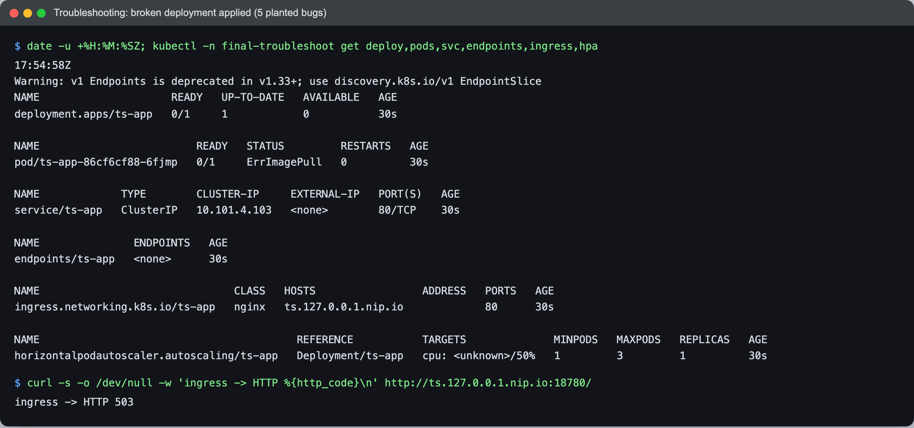
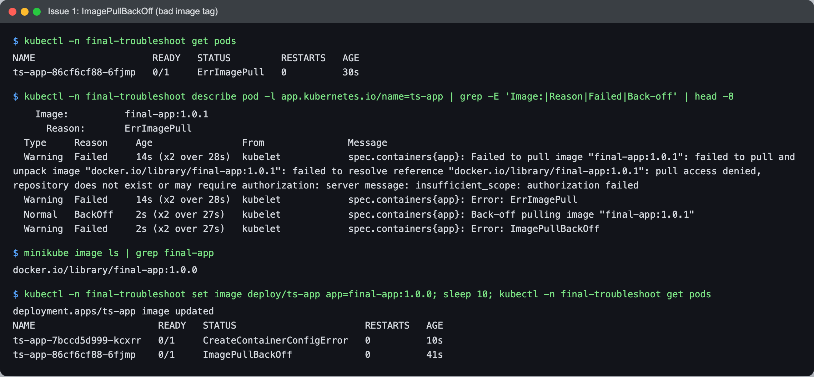
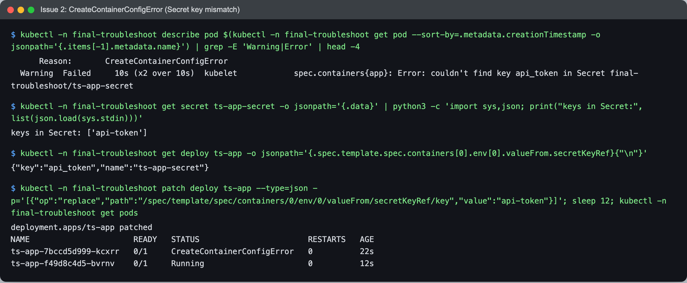
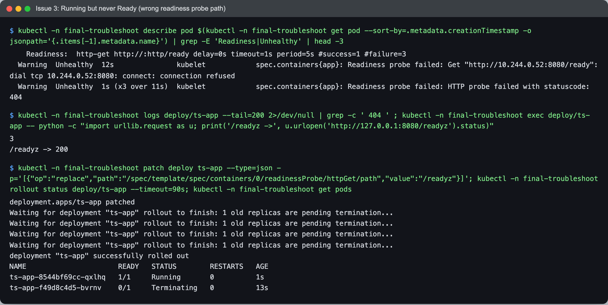
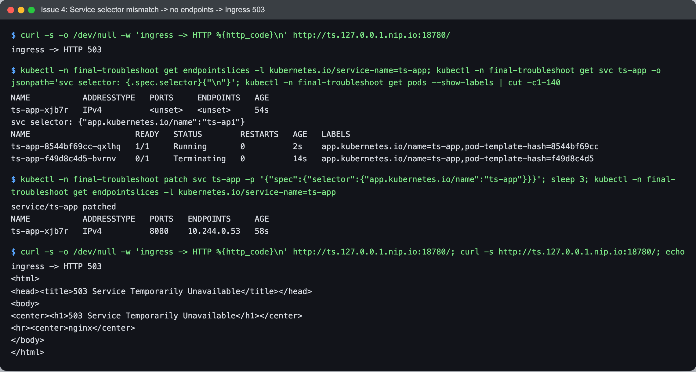
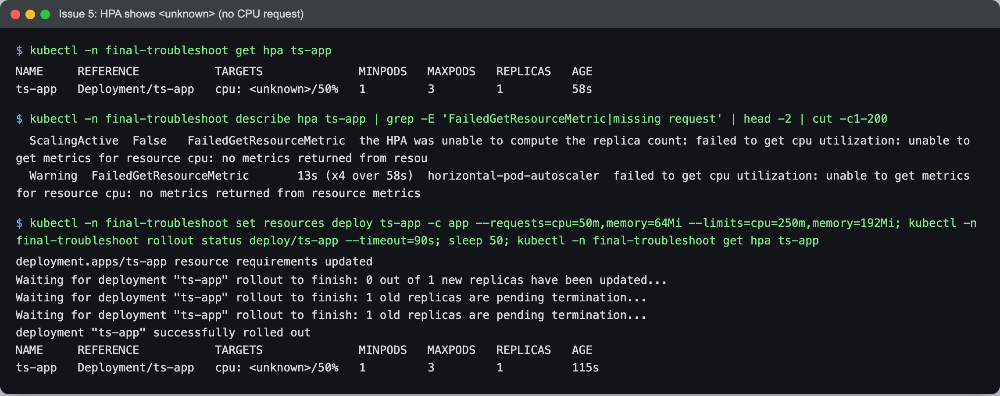
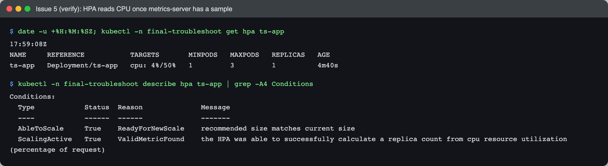
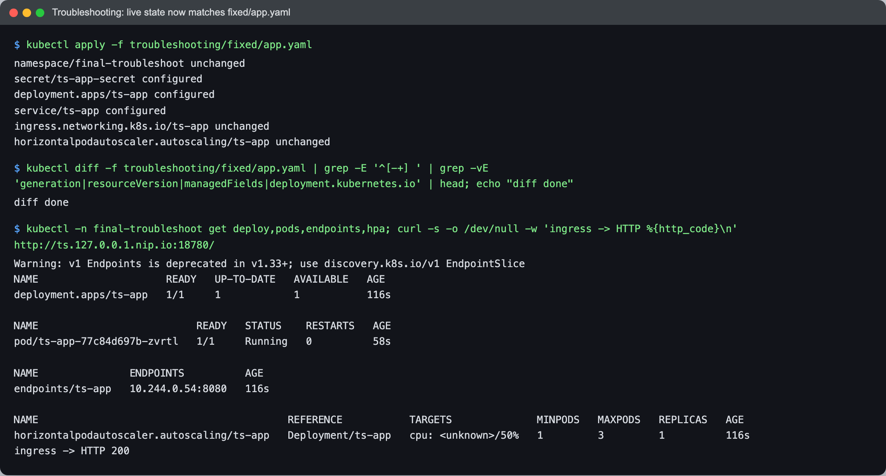

# Final Troubleshooting Challenge

Netram, Enrollment No 24BCS10329

I deployed a copy of the app into its own namespace, `final-troubleshoot`, with five bugs planted on purpose, then found and fixed them one at a time the way I would on a real incident: look at the symptom, read events and logs, compare the spec with what actually exists, fix the smallest thing, verify.

- Broken manifests: [`../troubleshooting/broken/app.yaml`](../troubleshooting/broken/app.yaml)
- Fixed manifests: [`../troubleshooting/fixed/app.yaml`](../troubleshooting/fixed/app.yaml)

The five planted bugs (`diff fixed/app.yaml broken/app.yaml`):

| # | Bug | Symptom |
|---|---|---|
| 1 | image tag `final-app:1.0.1`, which was never built | `ErrImagePull` / `ImagePullBackOff` |
| 2 | `secretKeyRef.key: api_token`, but the Secret key is `api-token` | `CreateContainerConfigError` |
| 3 | readiness probe on `/ready`, the app serves `/readyz` | `Running` but `0/1`, never Ready |
| 4 | Service selector `ts-api` instead of `ts-app` | no endpoints, Ingress returns 503 |
| 5 | no CPU request on the container | HPA shows `cpu: <unknown>/50%` |

Bugs 1 to 3 hide each other: the kubelet must pull the image before it can build the container's environment, and it must start the container before a probe can run. So each fix revealed the next one, which is very normal in real life.

## Starting state



```text
$ date -u +%H:%M:%SZ; kubectl -n final-troubleshoot get deploy,pods,svc,endpoints,ingress,hpa
17:54:58Z
Warning: v1 Endpoints is deprecated in v1.33+; use discovery.k8s.io/v1 EndpointSlice
NAME                     READY   UP-TO-DATE   AVAILABLE   AGE
deployment.apps/ts-app   0/1     1            0           30s

NAME                         READY   STATUS         RESTARTS   AGE
pod/ts-app-86cf6cf88-6fjmp   0/1     ErrImagePull   0          30s

NAME             TYPE        CLUSTER-IP     EXTERNAL-IP   PORT(S)   AGE
service/ts-app   ClusterIP   10.101.4.103   <none>        80/TCP    30s

NAME               ENDPOINTS   AGE
endpoints/ts-app   <none>      30s

NAME                               CLASS   HOSTS                 ADDRESS   PORTS   AGE
ingress.networking.k8s.io/ts-app   nginx   ts.127.0.0.1.nip.io             80      30s

NAME                                         REFERENCE           TARGETS              MINPODS   MAXPODS   REPLICAS   AGE
horizontalpodautoscaler.autoscaling/ts-app   Deployment/ts-app   cpu: <unknown>/50%   1         3         1          30s

$ curl -s -o /dev/null -w 'ingress -> HTTP %{http_code}\n' http://ts.127.0.0.1.nip.io:18780/
ingress -> HTTP 503
```

## Issue 1: ImagePullBackOff

- **Identify:** the pod is `ErrImagePull`, the Deployment is `0/1`.
- **Investigate:** `describe pod` shows the kubelet tried to pull `final-app:1.0.1` and failed. `minikube image ls` shows only `1.0.0` exists on the node.
- **Root cause:** wrong tag in the Deployment.
- **Fix:** `kubectl set image deploy/ts-app app=final-app:1.0.0`.
- **Verify:** the new pod gets past the pull (and immediately shows issue 2).



```text
$ kubectl -n final-troubleshoot get pods
NAME                     READY   STATUS         RESTARTS   AGE
ts-app-86cf6cf88-6fjmp   0/1     ErrImagePull   0          30s

$ kubectl -n final-troubleshoot describe pod -l app.kubernetes.io/name=ts-app | grep -E 'Image:|Reason|Failed|Back-off' | head -8
    Image:          final-app:1.0.1
      Reason:       ErrImagePull
  Type     Reason     Age                From               Message
  Warning  Failed     14s (x2 over 28s)  kubelet            spec.containers{app}: Failed to pull image "final-app:1.0.1": failed to pull and unpack image "docker.io/library/final-app:1.0.1": failed to resolve reference "docker.io/library/final-app:1.0.1": pull access denied, repository does not exist or may require authorization: server message: insufficient_scope: authorization failed
  Warning  Failed     14s (x2 over 28s)  kubelet            spec.containers{app}: Error: ErrImagePull
  Normal   BackOff    2s (x2 over 27s)   kubelet            spec.containers{app}: Back-off pulling image "final-app:1.0.1"
  Warning  Failed     2s (x2 over 27s)   kubelet            spec.containers{app}: Error: ImagePullBackOff

$ minikube image ls | grep final-app
docker.io/library/final-app:1.0.0

$ kubectl -n final-troubleshoot set image deploy/ts-app app=final-app:1.0.0; sleep 10; kubectl -n final-troubleshoot get pods
deployment.apps/ts-app image updated
NAME                      READY   STATUS                       RESTARTS   AGE
ts-app-7bccd5d999-kcxrr   0/1     CreateContainerConfigError   0          10s
ts-app-86cf6cf88-6fjmp    0/1     ImagePullBackOff             0          41s
```

## Issue 2: CreateContainerConfigError

- **Identify:** the new pod is stuck in `CreateContainerConfigError`.
- **Investigate:** the event says `couldn't find key api_token in Secret`. Listing the Secret's keys shows `api-token`, and the Deployment asks for `api_token`.
- **Root cause:** underscore vs dash in the key name.
- **Fix:** JSON patch on the Deployment to use `api-token`. I fixed the reference, not the Secret, because other consumers may already use the Secret's key.
- **Verify:** the newest pod is now `Running`, but `0/1` (issue 3).



```text
$ kubectl -n final-troubleshoot describe pod $(kubectl -n final-troubleshoot get pod --sort-by=.metadata.creationTimestamp -o jsonpath='{.items[-1].metadata.name}') | grep -E 'Warning|Error' | head -4
      Reason:       CreateContainerConfigError
  Warning  Failed     10s (x2 over 10s)  kubelet            spec.containers{app}: Error: couldn't find key api_token in Secret final-troubleshoot/ts-app-secret

$ kubectl -n final-troubleshoot get secret ts-app-secret -o jsonpath='{.data}' | python3 -c 'import sys,json; print("keys in Secret:", list(json.load(sys.stdin)))'
keys in Secret: ['api-token']

$ kubectl -n final-troubleshoot get deploy ts-app -o jsonpath='{.spec.template.spec.containers[0].env[0].valueFrom.secretKeyRef}{"\n"}'
{"key":"api_token","name":"ts-app-secret"}

$ kubectl -n final-troubleshoot patch deploy ts-app --type=json -p='[{"op":"replace","path":"/spec/template/spec/containers/0/env/0/valueFrom/secretKeyRef/key","value":"api-token"}]'; sleep 12; kubectl -n final-troubleshoot get pods
deployment.apps/ts-app patched
NAME                      READY   STATUS                       RESTARTS   AGE
ts-app-7bccd5d999-kcxrr   0/1     CreateContainerConfigError   0          22s
ts-app-f49d8c4d5-bvrnv    0/1     Running                      0          12s
```

## Issue 3: Running but never Ready

- **Identify:** `Running` with `READY 0/1`, no restarts. Liveness is fine, so the kubelet does not kill it, but readiness keeps failing.
- **Investigate:** events show `Readiness probe failed: HTTP probe failed with statuscode: 404` on `/ready`. The gunicorn log has 404 lines for it, and calling `/readyz` from inside the container returns 200.
- **Root cause:** wrong probe path.
- **Fix:** patch `readinessProbe.httpGet.path` to `/readyz`.
- **Verify:** `rollout status` completes and the pod is `1/1`. The old broken pods are cleaned up by the rollout.



```text
$ kubectl -n final-troubleshoot describe pod $(kubectl -n final-troubleshoot get pod --sort-by=.metadata.creationTimestamp -o jsonpath='{.items[-1].metadata.name}') | grep -E 'Readiness|Unhealthy' | head -3
    Readiness:  http-get http://:http/ready delay=0s timeout=1s period=5s #success=1 #failure=3
  Warning  Unhealthy  12s               kubelet            spec.containers{app}: Readiness probe failed: Get "http://10.244.0.52:8080/ready": dial tcp 10.244.0.52:8080: connect: connection refused
  Warning  Unhealthy  1s (x3 over 11s)  kubelet            spec.containers{app}: Readiness probe failed: HTTP probe failed with statuscode: 404

$ kubectl -n final-troubleshoot logs deploy/ts-app --tail=200 2>/dev/null | grep -c ' 404 ' ; kubectl -n final-troubleshoot exec deploy/ts-app -- python -c "import urllib.request as u; print('/readyz ->', u.urlopen('http://127.0.0.1:8080/readyz').status)"
3
/readyz -> 200

$ kubectl -n final-troubleshoot patch deploy ts-app --type=json -p='[{"op":"replace","path":"/spec/template/spec/containers/0/readinessProbe/httpGet/path","value":"/readyz"}]'; kubectl -n final-troubleshoot rollout status deploy/ts-app --timeout=90s; kubectl -n final-troubleshoot get pods
deployment.apps/ts-app patched
Waiting for deployment "ts-app" rollout to finish: 1 old replicas are pending termination...
Waiting for deployment "ts-app" rollout to finish: 1 old replicas are pending termination...
Waiting for deployment "ts-app" rollout to finish: 1 old replicas are pending termination...
Waiting for deployment "ts-app" rollout to finish: 1 old replicas are pending termination...
deployment "ts-app" successfully rolled out
NAME                      READY   STATUS        RESTARTS   AGE
ts-app-8544bf69cc-qxlhq   1/1     Running       0          1s
ts-app-f49d8c4d5-bvrnv    0/1     Terminating   0          13s
```

## Issue 4: Service selector mismatch, Ingress 503

- **Identify:** the pod is Ready, but the Ingress still answers 503.
- **Investigate:** the EndpointSlice for `ts-app` has no endpoints. The Service selects `app.kubernetes.io/name=ts-api` while the pod label is `ts-app`.
- **Root cause:** typo in the Service selector. NGINX has no backend to send to, so it returns 503.
- **Fix:** patch the selector to `ts-app`.
- **Verify:** the EndpointSlice immediately lists `10.244.0.53:8080`. The very next curl was still 503 because the ingress controller had not reloaded its backend list yet; a few seconds later it returned 200 (see the final check below).



```text
$ curl -s -o /dev/null -w 'ingress -> HTTP %{http_code}\n' http://ts.127.0.0.1.nip.io:18780/
ingress -> HTTP 503

$ kubectl -n final-troubleshoot get endpointslices -l kubernetes.io/service-name=ts-app; kubectl -n final-troubleshoot get svc ts-app -o jsonpath='svc selector: {.spec.selector}{"\n"}'; kubectl -n final-troubleshoot get pods --show-labels | cut -c1-140
NAME           ADDRESSTYPE   PORTS     ENDPOINTS   AGE
ts-app-xjb7r   IPv4          <unset>   <unset>     54s
svc selector: {"app.kubernetes.io/name":"ts-api"}
NAME                      READY   STATUS        RESTARTS   AGE   LABELS
ts-app-8544bf69cc-qxlhq   1/1     Running       0          2s    app.kubernetes.io/name=ts-app,pod-template-hash=8544bf69cc
ts-app-f49d8c4d5-bvrnv    0/1     Terminating   0          14s   app.kubernetes.io/name=ts-app,pod-template-hash=f49d8c4d5

$ kubectl -n final-troubleshoot patch svc ts-app -p '{"spec":{"selector":{"app.kubernetes.io/name":"ts-app"}}}'; sleep 3; kubectl -n final-troubleshoot get endpointslices -l kubernetes.io/service-name=ts-app
service/ts-app patched
NAME           ADDRESSTYPE   PORTS   ENDPOINTS     AGE
ts-app-xjb7r   IPv4          8080    10.244.0.53   58s

$ curl -s -o /dev/null -w 'ingress -> HTTP %{http_code}\n' http://ts.127.0.0.1.nip.io:18780/; curl -s http://ts.127.0.0.1.nip.io:18780/; echo
ingress -> HTTP 503
<html>
<head><title>503 Service Temporarily Unavailable</title></head>
<body>
<center><h1>503 Service Temporarily Unavailable</h1></center>
<hr><center>nginx</center>
</body>
</html>
```

## Issue 5: HPA shows `<unknown>`

- **Identify:** `cpu: <unknown>/50%`.
- **Investigate:** `describe hpa` shows `ScalingActive False, FailedGetResourceMetric`. A utilisation target is a percentage of the CPU request, and the container has no CPU request, so there is nothing to divide by.
- **Root cause:** missing `resources.requests.cpu`.
- **Fix:** `kubectl set resources ... --requests=cpu=50m,memory=64Mi --limits=cpu=250m,memory=192Mi`.
- **Verify:** right after the rollout it was still `<unknown>`, because metrics-server did not have a sample for the brand new pod yet. About a minute later the HPA reported `cpu: 4%/50%` and `ScalingActive True, ValidMetricFound`.



```text
$ kubectl -n final-troubleshoot get hpa ts-app
NAME     REFERENCE           TARGETS              MINPODS   MAXPODS   REPLICAS   AGE
ts-app   Deployment/ts-app   cpu: <unknown>/50%   1         3         1          58s

$ kubectl -n final-troubleshoot describe hpa ts-app | grep -E 'FailedGetResourceMetric|missing request' | head -2 | cut -c1-200
  ScalingActive  False   FailedGetResourceMetric  the HPA was unable to compute the replica count: failed to get cpu utilization: unable to get metrics for resource cpu: no metrics returned from resou
  Warning  FailedGetResourceMetric       13s (x4 over 58s)  horizontal-pod-autoscaler  failed to get cpu utilization: unable to get metrics for resource cpu: no metrics returned from resource metrics

$ kubectl -n final-troubleshoot set resources deploy ts-app -c app --requests=cpu=50m,memory=64Mi --limits=cpu=250m,memory=192Mi; kubectl -n final-troubleshoot rollout status deploy/ts-app --timeout=90s; sleep 50; kubectl -n final-troubleshoot get hpa ts-app
deployment.apps/ts-app resource requirements updated
Waiting for deployment "ts-app" rollout to finish: 0 out of 1 new replicas have been updated...
Waiting for deployment "ts-app" rollout to finish: 1 old replicas are pending termination...
Waiting for deployment "ts-app" rollout to finish: 1 old replicas are pending termination...
deployment "ts-app" successfully rolled out
NAME     REFERENCE           TARGETS              MINPODS   MAXPODS   REPLICAS   AGE
ts-app   Deployment/ts-app   cpu: <unknown>/50%   1         3         1          115s
```



```text
$ date -u +%H:%M:%SZ; kubectl -n final-troubleshoot get hpa ts-app
17:59:08Z
NAME     REFERENCE           TARGETS       MINPODS   MAXPODS   REPLICAS   AGE
ts-app   Deployment/ts-app   cpu: 4%/50%   1         3         1          4m40s

$ kubectl -n final-troubleshoot describe hpa ts-app | grep -A4 Conditions
Conditions:
  Type            Status  Reason              Message
  ----            ------  ------              -------
  AbleToScale     True    ReadyForNewScale    recommended size matches current size
  ScalingActive   True    ValidMetricFound    the HPA was able to successfully calculate a replica count from cpu resource utilization (percentage of request)
```

## Final state equals the fixed manifest

I fixed things live with `kubectl` first (that is what you do during an incident), and then applied `fixed/app.yaml` so the file in Git and the cluster agree. `kubectl diff` afterwards shows no differences, and the Ingress returns 200.



```text
$ kubectl apply -f troubleshooting/fixed/app.yaml
namespace/final-troubleshoot unchanged
secret/ts-app-secret configured
deployment.apps/ts-app configured
service/ts-app configured
ingress.networking.k8s.io/ts-app unchanged
horizontalpodautoscaler.autoscaling/ts-app unchanged

$ kubectl diff -f troubleshooting/fixed/app.yaml | grep -E '^[-+] ' | grep -vE 'generation|resourceVersion|managedFields|deployment.kubernetes.io' | head; echo "diff done"
diff done

$ kubectl -n final-troubleshoot get deploy,pods,endpoints,hpa; curl -s -o /dev/null -w 'ingress -> HTTP %{http_code}\n' http://ts.127.0.0.1.nip.io:18780/
Warning: v1 Endpoints is deprecated in v1.33+; use discovery.k8s.io/v1 EndpointSlice
NAME                     READY   UP-TO-DATE   AVAILABLE   AGE
deployment.apps/ts-app   1/1     1            1           116s

NAME                          READY   STATUS    RESTARTS   AGE
pod/ts-app-77c84d697b-zvrtl   1/1     Running   0          58s

NAME               ENDPOINTS          AGE
endpoints/ts-app   10.244.0.54:8080   116s

NAME                                         REFERENCE           TARGETS              MINPODS   MAXPODS   REPLICAS   AGE
horizontalpodautoscaler.autoscaling/ts-app   Deployment/ts-app   cpu: <unknown>/50%   1         3         1          116s
ingress -> HTTP 200
```

## What I would take away

- Read the pod `STATUS` first: it already tells you which stage failed (pull, config, start, ready).
- `kubectl describe` events answer most of these; logs only help once the container has started.
- "Pod is Ready but traffic fails" almost always means Service selector, port name or Ingress backend. Check endpoints first.
- An HPA on CPU needs a CPU request. `<unknown>` for more than a couple of minutes means a missing request or a broken metrics-server.
