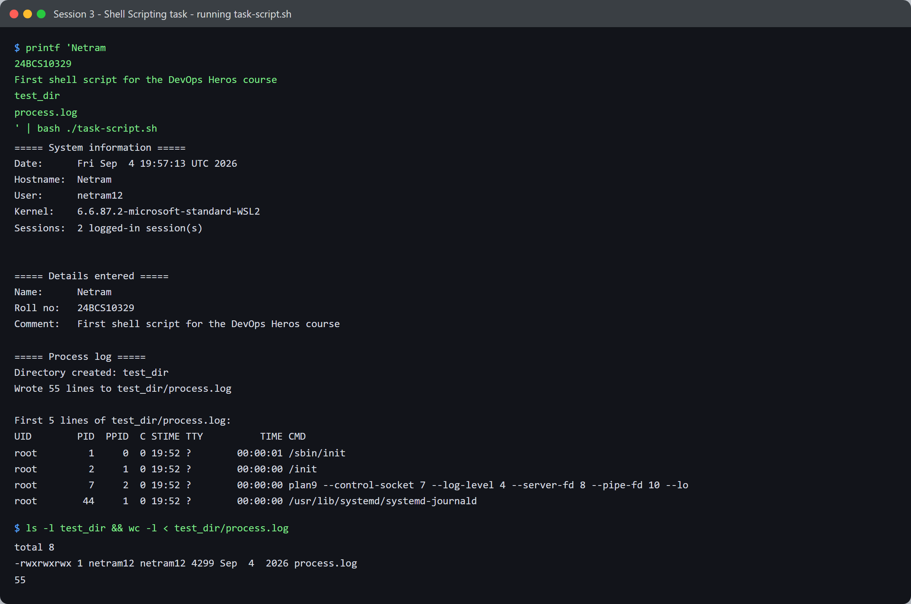

# Session 3 - Shell Scripting - Task

- **Name:** Netram
- **Enrollment No:** 24BCS10329

> **Status:** completed

> Run on Ubuntu 24.04.4 LTS under WSL2.

---

## What the task asked

From [`../task.md`](../task.md), write a script that:

- prints the current date
- prints the hostname and username
- writes process information into a file called `process.log`
- prints a name, roll number and comment
- uses **variables**, **takes input**, and **creates a file and a directory**

## My approach

The starter snippet in `task.md` is a sketch rather than a working script - it has a bug I had
to fix before anything useful came out of it (see *Problems I hit*). I rewrote it as a single
script, [`task-script.sh`](task-script.sh), grouped into four clear stages: gather system facts
into variables, read the user's input, create the directory and log file, then report back.

## The script

[`task-script.sh`](task-script.sh) - the parts that matter:

```bash
# variables, filled by command substitution
current_date=$(date)
host_name=$(hostname)
user_name=$(whoami)
kernel_ver=$(uname -r)
session_count=$(who | wc -l)

# take input
read -rp "Enter your name: " name
read -rp "Enter your roll number: " roll_no
read -rp "Enter a comment: " comment
read -rp "Enter a directory name to create: " dir_name
read -rp "Enter a file name for the process log: " file_name

# create the directory, then a file inside it
mkdir -p "$dir_name"
log_path="$dir_name/$file_name"
ps -ef > "$log_path"
```

Every variable expansion is double-quoted. That is not decoration - without the quotes, a
directory name containing a space would split into two arguments and `mkdir` would silently
create two directories.

## How I ran it

The script is interactive. To make the run reproducible for the screenshot I piped the five
answers in rather than typing them:

```bash
printf 'Netram\n24BCS10329\nFirst shell script for the DevOps Heros course\ntest_dir\nprocess.log\n' \
  | bash ./task-script.sh
```

It works normally too - `bash ./task-script.sh` and answer the five prompts by hand.

## Output



```text
===== System information =====
Date:      Fri Sep  4 19:57:13 UTC 2026
Hostname:  Netram
User:      netram12
Kernel:    6.6.87.2-microsoft-standard-WSL2
Sessions:  2 logged-in session(s)

===== Details entered =====
Name:      Netram
Roll no:   24BCS10329
Comment:   First shell script for the DevOps Heros course

===== Process log =====
Directory created: test_dir
Wrote 55 lines to test_dir/process.log

First 5 lines of test_dir/process.log:
UID        PID  PPID  C STIME TTY          TIME CMD
root         1     0  0 19:52 ?        00:00:01 /sbin/init
root         2     1  0 19:52 ?        00:00:00 /init
root         7     2  0 19:52 ?        00:00:00 plan9 --control-socket 7 --log-level 4 --server-fd 8 --pipe-fd 10 --lo
root        44     1  0 19:52 ?        00:00:00 /usr/lib/systemd/systemd-journald
```

And the artefacts it created really exist on disk:

```text
$ ls -l test_dir && wc -l < test_dir/process.log
total 8
-rwxrwxrwx 1 netram12 netram12 4299 Sep  4  2026 process.log
55
```

[`test_dir/process.log`](test_dir/process.log) is committed alongside this write-up as the
evidence - 55 lines, 4299 bytes, the real process table from the run above.

A couple of details worth pointing at:

- `Hostname: Netram` is the Windows machine name. WSL2 inherits it by default, which is why the
  Linux hostname and the Windows one match.
- `Sessions: 2` comes from `who | wc -l` - `who` lists login sessions, so piping it to `wc -l`
  counts them without any parsing.
- `plan9` and `/init` in the process list are WSL-specific: `/init` is the WSL shim standing in
  for a normal boot, and `plan9` is the 9P server that makes `/mnt/c` work.

## What I learned

- `$(command)` and `$variable` are completely different things, and mixing them up fails
  *silently* - bash prints an empty string for an unset variable rather than erroring. That one
  bug cost me the most time on this task.
- `read -p` writes its prompt to stderr and only when stdin is a terminal, so a piped run shows
  the output but none of the prompts. That is why the screenshot has no visible prompts even
  though the script is genuinely interactive.
- `mkdir -p` is idempotent - re-running the script does not fail on an existing directory,
  which makes the whole thing safe to run repeatedly while testing.

## Problems I hit

- **The starter snippet printed two blank lines.** `task.md` has `echo $hostname` and
  `echo $whoami`. Those are *variables*, and nothing ever sets them, so bash expanded both to
  the empty string and exited 0 - no error to tell me anything was wrong. The fix is command
  substitution: `host_name=$(hostname)` and `user_name=$(whoami)`.
- **No prompts appeared in my captured run**, which made me think `read` had failed. It had not:
  bash suppresses the `-p` prompt when stdin is a pipe instead of a terminal. Running the script
  by hand in a real terminal shows all five prompts as expected.
- **`ps` vs `ps -ef`.** Plain `ps` only lists processes attached to the current terminal - piped
  into the script that was just two lines. I switched to `ps -ef` to capture the full system
  process table, which is what "process information" actually means here.
