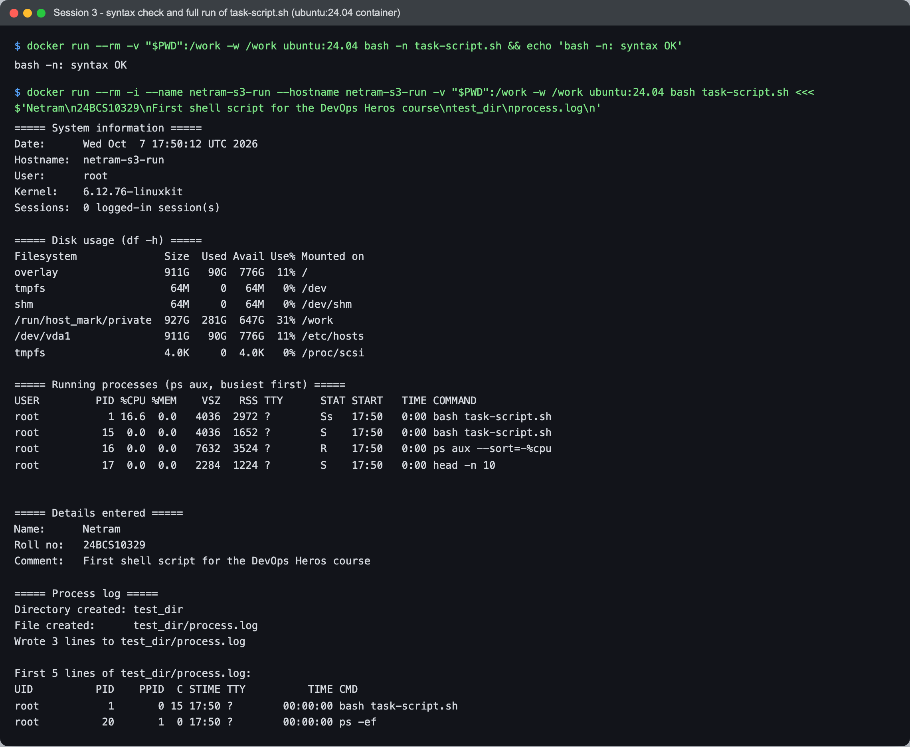
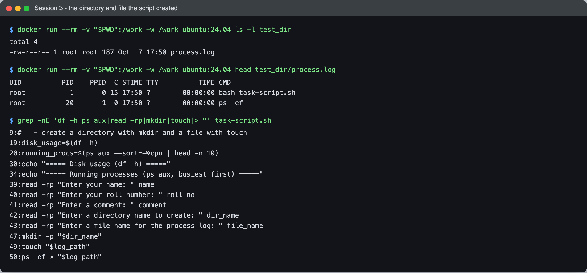

# Session 3 - Shell Scripting - Task

- **Name:** Netram
- **Enrollment No:** 24BCS10329

> **Status:** completed

> The current version of the script was run on macOS inside an `ubuntu:24.04` Docker container
> (output below). The first version was run on Ubuntu 24.04.4 LTS under WSL2.

---

## What the task asked

The assignment asks for a shell script that:

- prints the current date
- prints the hostname
- prints the username
- prints the disk usage
- prints the running processes
- uses variables
- takes user input with `read -p`
- creates a directory with `mkdir`
- creates a file with `touch`
- stores the running processes in the file using `>` output redirection

Commands to use: `mkdir`, `touch`, `echo`, `df`, `ps`, `read -p`, variables, `>`.

Submission: a public GitHub repo with a `README.md` that shows the output of all the commands.

## Checklist

Every bullet from the assignment, and the line in [`task-script.sh`](task-script.sh) that does it:

| Requirement from the assignment | Where it happens in `task-script.sh` |
|---|---|
| prints the current date | line 14 `current_date=$(date)`, printed on line 23 |
| prints the hostname | line 15 `host_name=$(hostname)`, printed on line 24 |
| prints the username | line 16 `user_name=$(whoami)`, printed on line 25 |
| prints the disk usage (`df`) | line 19 `disk_usage=$(df -h)`, printed on lines 30-31 |
| prints the running processes (`ps`) | line 20 `running_procs=$(ps aux --sort=-%cpu \| head -n 10)`, printed on lines 34-35 |
| uses variables | lines 14-20 (system facts), 39-43 (input), 48 (`log_path`) |
| takes user input with `read -p` | lines 39-43 `read -rp "..."` (five prompts) |
| creates a directory with `mkdir` | line 47 `mkdir -p "$dir_name"` |
| creates a file with `touch` | line 49 `touch "$log_path"` |
| stores the running processes in the file with `>` | line 50 `ps -ef > "$log_path"` |
| uses `echo` | every printed line, for example lines 22-27 |

I use `read -rp` rather than plain `read -p`. It is the same `-p` prompt; `-r` just stops bash
from treating a backslash in the answer as an escape character.

## My approach

The starter snippet in `task.md` is a sketch rather than a working script - it has a bug I had
to fix before anything useful came out of it (see *Problems I hit*). I rewrote it as a single
script, [`task-script.sh`](task-script.sh), grouped into four clear stages: gather system facts
into variables, read the user's input, create the directory and the log file, then report back.

My first version missed two things the assignment names explicitly: it never ran `df`, and it
created the log file only through the `>` redirection instead of with `touch`. It also wrote the
process list to the file without printing it on screen. The current version adds a disk usage
section, prints the running processes, and calls `touch` before the redirection.

## The script

[`task-script.sh`](task-script.sh) - the parts that matter:

```bash
# variables, filled by command substitution
current_date=$(date)
host_name=$(hostname)
user_name=$(whoami)
kernel_ver=$(uname -r)
session_count=$(who | wc -l)
disk_usage=$(df -h)
running_procs=$(ps aux --sort=-%cpu | head -n 10)

echo "===== Disk usage (df -h) ====="
echo "$disk_usage"

echo "===== Running processes (ps aux, busiest first) ====="
echo "$running_procs"

# take input
read -rp "Enter your name: " name
read -rp "Enter your roll number: " roll_no
read -rp "Enter a comment: " comment
read -rp "Enter a directory name to create: " dir_name
read -rp "Enter a file name for the process log: " file_name

# create a directory, a file inside it, then fill it with >
mkdir -p "$dir_name"
log_path="$dir_name/$file_name"
touch "$log_path"
ps -ef > "$log_path"
```

Every variable expansion is double-quoted. That is not decoration - without the quotes, a
directory name containing a space would split into two arguments and `mkdir` would silently
create two directories. `echo "$disk_usage"` needs the quotes too: unquoted, bash would join the
whole `df` table onto one line.

## How I ran it

The script is interactive. To make the run reproducible for the screenshot I fed the five
answers in rather than typing them. I ran it on my Mac inside a throwaway Ubuntu 24.04
container, with the task folder mounted at `/work` so the directory and file it creates land in
this repo:

```bash
bash -n task-script.sh      # syntax check first (run inside the same container)

docker run --rm -i --name netram-s3-run --hostname netram-s3-run \
  -v "$PWD":/work -w /work ubuntu:24.04 bash task-script.sh \
  <<< $'Netram\n24BCS10329\nFirst shell script for the DevOps Heros course\ntest_dir\nprocess.log\n'
```

It works normally too - `bash ./task-script.sh` on any Linux box and answer the five prompts by
hand.

## Output



```text
$ docker run --rm -v "$PWD":/work -w /work ubuntu:24.04 bash -n task-script.sh && echo 'bash -n: syntax OK'
bash -n: syntax OK

$ docker run --rm -i --name netram-s3-run --hostname netram-s3-run -v "$PWD":/work -w /work ubuntu:24.04 bash task-script.sh <<< $'Netram\n24BCS10329\nFirst shell script for the DevOps Heros course\ntest_dir\nprocess.log\n'
===== System information =====
Date:      Wed Oct  7 17:50:12 UTC 2026
Hostname:  netram-s3-run
User:      root
Kernel:    6.12.76-linuxkit
Sessions:  0 logged-in session(s)

===== Disk usage (df -h) =====
Filesystem              Size  Used Avail Use% Mounted on
overlay                 911G   90G  776G  11% /
tmpfs                    64M     0   64M   0% /dev
shm                      64M     0   64M   0% /dev/shm
/run/host_mark/private  927G  281G  647G  31% /work
/dev/vda1               911G   90G  776G  11% /etc/hosts
tmpfs                   4.0K     0  4.0K   0% /proc/scsi

===== Running processes (ps aux, busiest first) =====
USER         PID %CPU %MEM    VSZ   RSS TTY      STAT START   TIME COMMAND
root           1 16.6  0.0   4036  2972 ?        Ss   17:50   0:00 bash task-script.sh
root          15  0.0  0.0   4036  1652 ?        S    17:50   0:00 bash task-script.sh
root          16  0.0  0.0   7632  3524 ?        R    17:50   0:00 ps aux --sort=-%cpu
root          17  0.0  0.0   2284  1224 ?        S    17:50   0:00 head -n 10


===== Details entered =====
Name:      Netram
Roll no:   24BCS10329
Comment:   First shell script for the DevOps Heros course

===== Process log =====
Directory created: test_dir
File created:      test_dir/process.log
Wrote 3 lines to test_dir/process.log

First 5 lines of test_dir/process.log:
UID          PID    PPID  C STIME TTY          TIME CMD
root           1       0 15 17:50 ?        00:00:00 bash task-script.sh
root          20       1  0 17:50 ?        00:00:00 ps -ef
```

And the directory and file it created really exist on disk:



```text
$ docker run --rm -v "$PWD":/work -w /work ubuntu:24.04 ls -l test_dir
total 4
-rw-r--r-- 1 root root 187 Oct  7 17:50 process.log

$ docker run --rm -v "$PWD":/work -w /work ubuntu:24.04 head test_dir/process.log
UID          PID    PPID  C STIME TTY          TIME CMD
root           1       0 15 17:50 ?        00:00:00 bash task-script.sh
root          20       1  0 17:50 ?        00:00:00 ps -ef

$ grep -nE 'df -h|ps aux|read -rp|mkdir|touch|> "' task-script.sh
9:#   - create a directory with mkdir and a file with touch
19:disk_usage=$(df -h)
20:running_procs=$(ps aux --sort=-%cpu | head -n 10)
30:echo "===== Disk usage (df -h) ====="
34:echo "===== Running processes (ps aux, busiest first) ====="
39:read -rp "Enter your name: " name
40:read -rp "Enter your roll number: " roll_no
41:read -rp "Enter a comment: " comment
42:read -rp "Enter a directory name to create: " dir_name
43:read -rp "Enter a file name for the process log: " file_name
47:mkdir -p "$dir_name"
49:touch "$log_path"
50:ps -ef > "$log_path"
```

[`test_dir/process.log`](test_dir/process.log) is committed alongside this write-up as the
evidence - 3 lines, 187 bytes, the real process table from the run above.

A few details worth pointing at:

- The process list is short because a container only runs what you start in it. PID 1 is the
  script itself, and the rest are the subshell, `ps` and `head` it spawned. On a full machine
  the same `ps -ef > "$log_path"` line wrote 55 lines (see the earlier run below).
- `User: root` and `Sessions: 0` are both container facts: Docker runs as root by default, and
  nobody "logs in" to a container, so `who` has nothing to list.
- `Hostname: netram-s3-run` is the name I gave the container with `--hostname`. Without it,
  `hostname` prints the container ID.
- In the `df -h` table, `overlay` is the container's own root filesystem and `/work` is the task
  folder mounted from my Mac.

### Earlier run (first version, WSL2)

[`screenshots/script-run.png`](screenshots/script-run.png) is the run of my first version on
Ubuntu 24.04.4 LTS under WSL2. That version did not yet have the `df` section, the on-screen
process list or the `touch`, so it no longer matches the current script. I kept the screenshot
for the history only; the `test_dir/process.log` in this repo is from the current run above.

## What I learned

- `$(command)` and `$variable` are completely different things, and mixing them up fails
  *silently* - bash prints an empty string for an unset variable rather than erroring. That one
  bug cost me the most time on this task.
- `read -p` writes its prompt to stderr and only when stdin is a terminal, so a piped run shows
  the output but none of the prompts. That is why the screenshot has no visible prompts even
  though the script is genuinely interactive.
- `mkdir -p` is idempotent - re-running the script does not fail on an existing directory,
  which makes the whole thing safe to run repeatedly while testing. `touch` is the same: on an
  existing file it only updates the timestamp, and the `>` that follows truncates and rewrites it.

## Problems I hit

- **The starter snippet printed two blank lines.** `task.md` has `echo $hostname` and
  `echo $whoami`. Those are *variables*, and nothing ever sets them, so bash expanded both to
  the empty string and exited 0 - no error to tell me anything was wrong. The fix is command
  substitution: `host_name=$(hostname)` and `user_name=$(whoami)`.
- **No prompts appeared in my captured run**, which made me think `read` had failed. It had not:
  bash suppresses the `-p` prompt when stdin is a pipe instead of a terminal. Running the script
  by hand in a real terminal shows all five prompts as expected.
- **`ps` vs `ps -ef`.** Plain `ps` only lists processes attached to the current terminal - piped
  into the script that was just two lines. I switched to `ps -ef` to capture the full system
  process table, which is what "process information" actually means here.
- **My first version skipped `df` and `touch`.** When I checked it against the assignment line
  by line, disk usage was missing completely and the file was only ever created by `>`. Both
  are in now, and the checklist above is how I made sure nothing else was missed.
