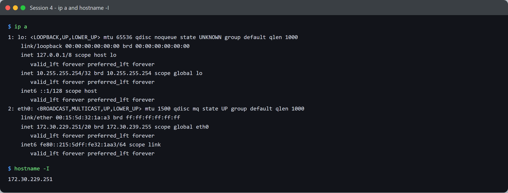
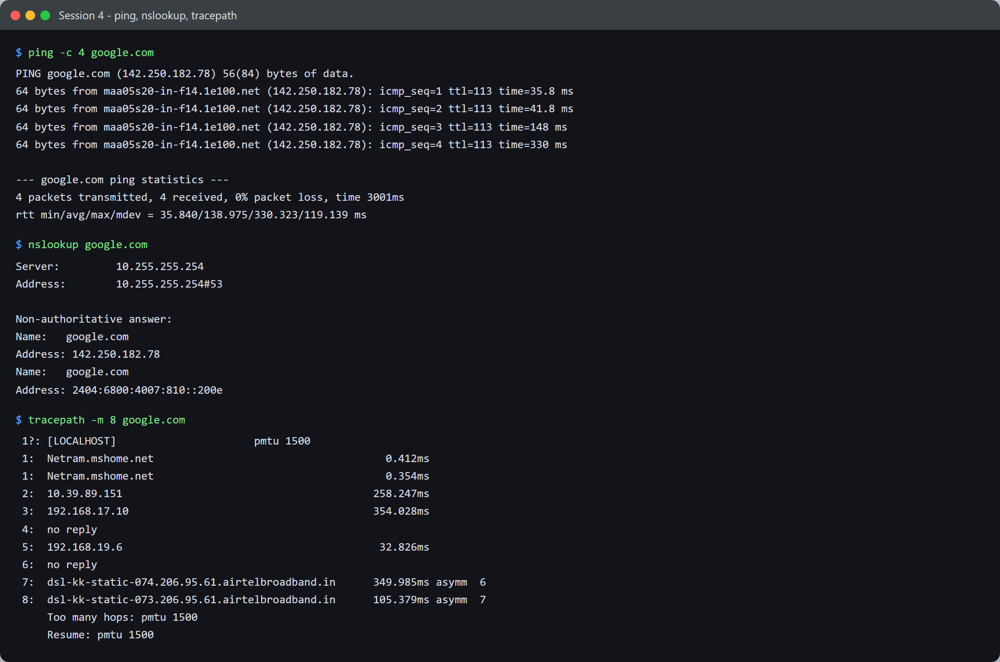
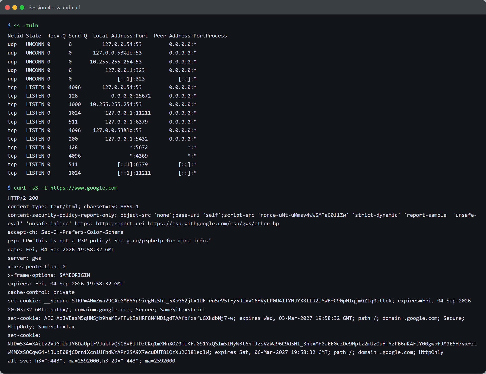

# Session 4 - Networking - Task: Commands & Analysis

- **Name:** Netram
- **Enrollment No:** 24BCS10329

> **Status:** completed

> Run on Ubuntu 24.04.4 LTS under WSL2. `nslookup`, `dig` and `tracepath` were not installed
> by default; I added them with `apt-get install dnsutils iputils-tracepath traceroute`.

---

## What the task asked

Run a set of networking commands, capture the output, and explain what each one tells you.

## My approach

I grouped the commands into three runs so each screenshot answers one question: *what is my
machine's address*, *can I reach the outside world and how*, and *what is listening here*.
Reading them in that order builds up from the local interface to a full HTTPS request.

---



## 1. `ip a`

```text
1: lo: <LOOPBACK,UP,LOWER_UP> mtu 65536 qdisc noqueue state UNKNOWN group default qlen 1000
    link/loopback 00:00:00:00:00:00 brd 00:00:00:00:00:00
    inet 127.0.0.1/8 scope host lo
    inet 10.255.255.254/32 brd 10.255.255.254 scope global lo
    inet6 ::1/128 scope host
2: eth0: <BROADCAST,MULTICAST,UP,LOWER_UP> mtu 1500 qdisc mq state UP group default qlen 1000
    link/ether 00:15:5d:32:1a:a3 brd ff:ff:ff:ff:ff:ff
    inet 172.30.229.251/20 brd 172.30.239.255 scope global eth0
    inet6 fe80::215:5dff:fe32:1aa3/64 scope link
```

**What it tells you.** Every network interface, its addresses, and its state.

- `lo` is the loopback. Traffic to it never leaves the machine, which is why its MTU is 65536:
  there is no physical link to constrain the frame size.
- `eth0` is up with `172.30.229.251/20`. The `/20` gives a 4094-host subnet spanning
  172.30.224.0 to 172.30.239.255, which matches the `brd 172.30.239.255` broadcast address on
  the same line.
- The MAC starts `00:15:5d`, which is Microsoft's OUI for Hyper-V virtual NICs. That is the
  giveaway that this is WSL2 running in a lightweight VM rather than on bare metal.
- `fe80::` is a link-local IPv6 address. It is generated automatically and is not routable off
  the local link.
- The odd one is `10.255.255.254/32` sitting on **loopback**. That is WSL specific: it is the
  DNS stub the resolver points at, and it shows up again in both the `nslookup` and `ss` output
  further down. Seeing the same address in three places is what made the WSL networking model
  click for me.

## 2. `hostname -I`

```text
172.30.229.251
```

**What it tells you.** Just the host's IP addresses, with no interface detail to parse. Useful
in scripts. Note the capital `-I`: lowercase `-i` resolves via the hosts file and is unreliable.

---



## 3. `ping -c 4 google.com`

```text
PING google.com (142.250.182.78) 56(84) bytes of data.
64 bytes from maa05s20-in-f14.1e100.net (142.250.182.78): icmp_seq=1 ttl=113 time=35.8 ms
64 bytes from maa05s20-in-f14.1e100.net (142.250.182.78): icmp_seq=2 ttl=113 time=41.8 ms
64 bytes from maa05s20-in-f14.1e100.net (142.250.182.78): icmp_seq=3 ttl=113 time=148 ms
64 bytes from maa05s20-in-f14.1e100.net (142.250.182.78): icmp_seq=4 ttl=113 time=330 ms

--- google.com ping statistics ---
4 packets transmitted, 4 received, 0% packet loss, time 3001ms
rtt min/avg/max/mdev = 35.840/138.975/330.323/119.139 ms
```

**What it tells you.** It sends 4 ICMP echo requests, and it actually proves two separate things
at once: DNS resolved the name **and** the host is reachable. If ping fails you still do not know
which of the two broke, which is why `nslookup` below is a separate check.

Reading the numbers:

- `0% packet loss` is the headline. Nothing was dropped.
- `ttl=113` is the TTL left when the reply arrived. Replies start at 128 on this path, so roughly
  15 hops were consumed getting back.
- The round trip times are wildly uneven: 35.8, 41.8, 148, then 330 ms, with `mdev` (mean
  deviation) at **119 ms**. Low loss but high jitter like this is typical of a congested or
  wireless last mile. A stable wired link would show all four times within a few ms of each other.
- `1e100.net` is Google's own domain for its serving infrastructure. `1e100` is 10^100, a googol.
  The `maa05s20` prefix is a Chennai edge node, so the request is being served from within India
  rather than crossing an ocean.

## 4. `nslookup google.com`

```text
Server:		10.255.255.254
Address:	10.255.255.254#53

Non-authoritative answer:
Name:	google.com
Address: 142.250.182.78
Name:	google.com
Address: 2404:6800:4007:810::200e
```

**What it tells you.** Which resolver answered, and what it returned.

- The server is `10.255.255.254#53`, the same WSL loopback stub from `ip a`. Queries go to that
  stub, which forwards them out through the Windows host's real DNS.
- **Non-authoritative** means this came from the resolver's cache, not from Google's own
  nameservers. That is normal and it is why the answer came back instantly.
- Two records: an **A** record (IPv4, `142.250.182.78`, the same address ping used) and an
  **AAAA** record (IPv6). The IPv4 address matching what ping resolved confirms both tools are
  going through the same resolver.

## 5. `tracepath -m 8 google.com`

```text
 1?: [LOCALHOST]                      pmtu 1500
 1:  Netram.mshome.net                                     0.412ms
 1:  Netram.mshome.net                                     0.354ms
 2:  10.39.89.151                                        258.247ms
 3:  192.168.17.10                                       354.028ms
 4:  no reply
 5:  192.168.19.6                                         32.826ms
 6:  no reply
 7:  dsl-kk-static-074.206.95.61.airtelbroadband.in      349.985ms asymm  6
 8:  dsl-kk-static-073.206.95.61.airtelbroadband.in      105.379ms asymm  7
     Too many hops: pmtu 1500
```

**What it tells you.** The path packets take, hop by hop, by sending packets with increasing TTL
and recording who sends back the "time exceeded" error. I capped it at 8 hops with `-m 8` to keep
the output readable.

- Hop 1 is `Netram.mshome.net`, the Windows host itself acting as the gateway for the WSL VM. It
  answers in 0.4 ms because it is the same physical machine.
- Hops 2, 3 and 5 are private addresses (10.x and 192.168.x), so those are inside the ISP's own
  network before traffic reaches public routing.
- **`no reply` at hops 4 and 6 does not mean the packet was dropped.** Traffic clearly got
  through, because hops 7 and 8 answered. Plenty of routers are configured not to emit ICMP time
  exceeded messages, so they stay invisible while still forwarding normally. This confused me at
  first (see *Problems I hit*).
- `asymm 6` on hop 7 means the return path took a different number of hops than the outbound
  path. Routing on the internet is not required to be symmetric.
- `pmtu 1500` is the path MTU: the largest packet that can cross without fragmentation.

---



## 6. `ss -tuln`

```text
Netid State  Recv-Q Send-Q  Local Address:Port  Peer Address:Port
udp   UNCONN 0      0          127.0.0.54:53         0.0.0.0:*
udp   UNCONN 0      0       127.0.0.53%lo:53         0.0.0.0:*
udp   UNCONN 0      0      10.255.255.254:53         0.0.0.0:*
udp   UNCONN 0      0           127.0.0.1:323        0.0.0.0:*
tcp   LISTEN 0      4096       127.0.0.54:53         0.0.0.0:*
tcp   LISTEN 0      128           0.0.0.0:25672      0.0.0.0:*
tcp   LISTEN 0      1000   10.255.255.254:53         0.0.0.0:*
tcp   LISTEN 0      1024        127.0.0.1:11211      0.0.0.0:*
tcp   LISTEN 0      511         127.0.0.1:6379       0.0.0.0:*
tcp   LISTEN 0      4096    127.0.0.53%lo:53         0.0.0.0:*
tcp   LISTEN 0      200         127.0.0.1:5432       0.0.0.0:*
tcp   LISTEN 0      128                 *:5672             *:*
tcp   LISTEN 0      4096                *:4369             *:*
```

**What it tells you.** Every socket that is listening. The flags: `-t` TCP, `-u` UDP, `-l` only
listening sockets, `-n` numeric ports rather than resolving them to service names.

The important column is **Local Address**, not the port, because that is what decides who can
reach the service:

- `127.0.0.1:6379` (Redis), `127.0.0.1:5432` (Postgres) and `127.0.0.1:11211` (memcached) are
  bound to loopback only. Nothing outside this machine can connect to them, no matter what the
  firewall says.
- `*:5672` and `*:4369` (RabbitMQ and its EPMD port) are bound to **all** interfaces, so they are
  reachable from anywhere that can route to `172.30.229.251`. Same machine, same firewall,
  completely different exposure, purely because of the bind address. That contrast is the single
  most useful thing in this output.
- Port 53 appears bound three times: `127.0.0.53` (systemd-resolved), `127.0.0.54`, and
  `10.255.255.254`, the WSL stub from `ip a` again.
- `Recv-Q` on a listening socket is the count of connections waiting to be accepted, and `Send-Q`
  is the backlog limit, so `Send-Q 511` on Redis means it will queue up to 511 pending connections.

## 7. `curl -sS -I https://www.google.com`

```text
HTTP/2 200
content-type: text/html; charset=ISO-8859-1
date: Fri, 04 Sep 2026 19:58:32 GMT
server: gws
x-xss-protection: 0
x-frame-options: SAMEORIGIN
expires: Fri, 04 Sep 2026 19:58:32 GMT
cache-control: private
alt-svc: h3=":443"; ma=2592000,h3-29=":443"; ma=2592000
```

**What it tells you.** `-I` sends a HEAD request, so you get the response headers with no body.
This is the only command here that exercises the whole stack: DNS, TCP, the TLS handshake, and
then HTTP on top.

- `HTTP/2 200` means the connection negotiated HTTP/2 during the TLS handshake (via ALPN) and the
  request succeeded.
- `server: gws` is Google Web Server.
- `cache-control: private` plus an `expires` equal to `date` means do not cache this at all. The
  homepage is personalised, so a shared cache must never reuse it.
- `x-frame-options: SAMEORIGIN` blocks other sites from loading this page in an iframe, which is
  the clickjacking defence.
- `alt-svc: h3=":443"` advertises HTTP/3 over QUIC on the same port for future requests, valid
  for `ma=2592000` seconds (30 days).

---

## What I learned

- `ping` succeeding proves DNS *and* reachability together, so when it fails you have to split
  the two apart with `nslookup` before you know what is broken. Running them side by side made
  the layering obvious in a way reading about it did not.
- In `ss` output the bind address matters more than the port. Redis on `127.0.0.1:6379` and
  RabbitMQ on `*:5672` are the same kind of service with completely different attack surfaces,
  and the only visible difference is one column.
- Averages hide things. My ping showed 0% loss, which looks perfect, but `mdev = 119 ms` across a
  35 ms to 330 ms spread says the link is unstable. A real time application would feel that even
  though nothing was technically dropped.
- WSL routes DNS through a stub on `10.255.255.254`. Once I noticed the same address in `ip a`,
  `nslookup` and `ss`, the whole WSL network model made sense.

## Problems I hit

- **`nslookup` and `tracepath` were not installed.** Ubuntu 24.04 ships a minimal image, and both
  commands failed with `command not found`. Fixed with
  `apt-get install dnsutils iputils-tracepath traceroute`. `nslookup` living in a package called
  `dnsutils` rather than anything named after the command is not guessable.
- **`no reply` in tracepath made me think the trace had failed.** It had not. Later hops answered
  fine, which proves packets were being forwarded the whole time; those routers simply do not send
  ICMP time exceeded replies. A gap in the middle of a trace is normal and is not the same as a
  broken path.
- **My first `tracepath` run hung for a long time** because it walks all the way to the default
  30 hop limit, waiting on every silent router. Capping it with `-m 8` made the run finish quickly
  and kept the output readable.
- **`curl https://www.google.com` dumped the entire minified homepage** into my terminal and
  buried everything. `-I` for headers only, plus `-sS` to drop the progress meter while keeping
  real errors visible, gave output worth reading.
