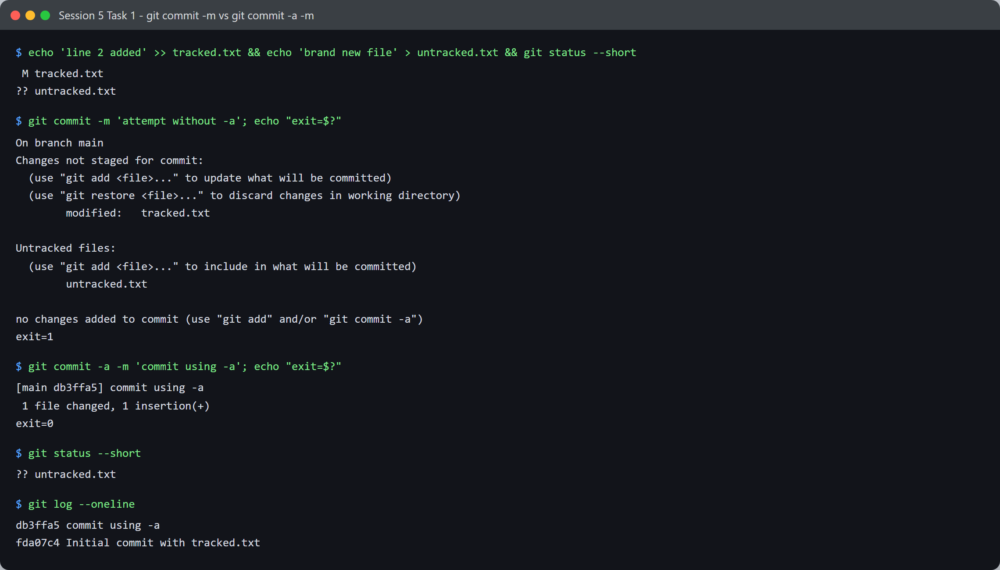
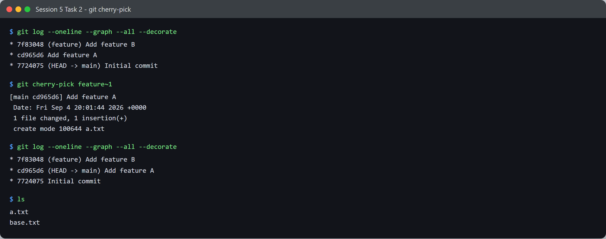
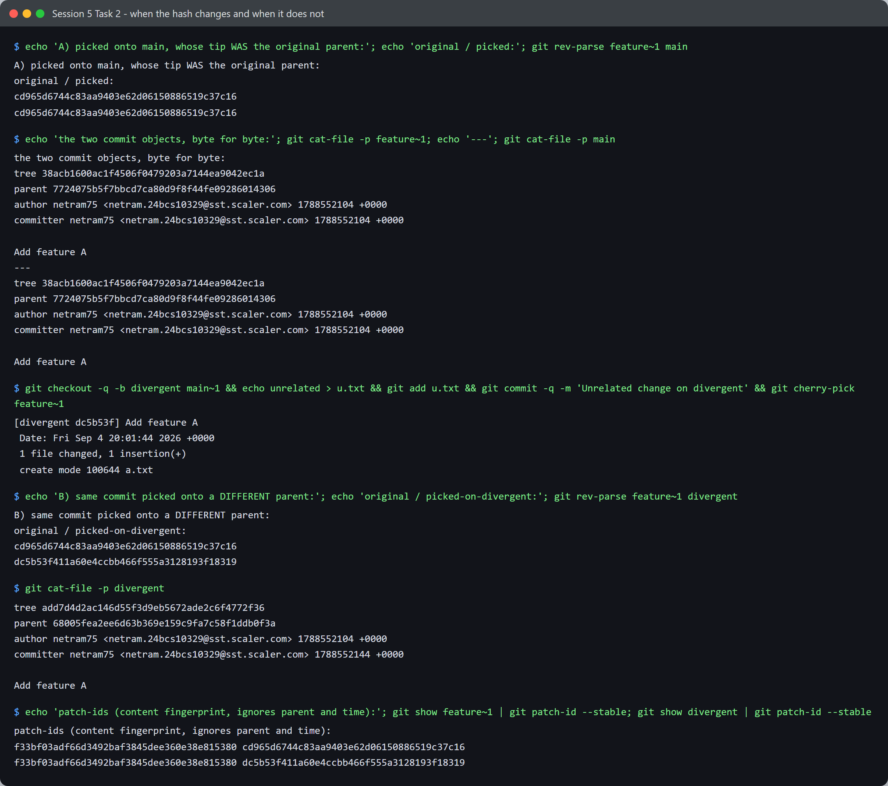

# Session 5 - Git & GitHub - Tasks

- **Name:** Netram
- **Enrollment No:** 24BCS10329

> **Status:** completed

> Demonstrated in throwaway repos under `/tmp` so nothing here touches this repository's own
> history.

---

## Task 1: `git commit -m` vs `git commit -a -m`

### Objective

Show the difference between committing with and without the `-a` flag, and work out exactly
which files each one picks up.

### The theory

`git commit -m` commits **only what is already staged** in the index. `git commit -a -m` stages
every **tracked** file that has been modified or deleted, then commits. The word doing the work
in that sentence is *tracked*, and the experiment below is designed to prove it.

### Setup

```bash
mkdir -p /tmp/git-sandbox && cd /tmp/git-sandbox
git init -b main
git config user.name  netram75
git config user.email netram.24bcs10329@sst.scaler.com
echo 'line 1' > tracked.txt
git add tracked.txt
git commit -m 'Initial commit with tracked.txt'
```

Then create one change of each kind: a modification to a file git already knows about, and a
brand new file it has never seen.

```bash
echo 'line 2 added' >> tracked.txt     # modified, tracked
echo 'brand new file' > untracked.txt  # new, untracked
```

### Execution and output



```text
$ git status --short
 M tracked.txt
?? untracked.txt
```

`M` means modified and tracked. `??` means git has never seen this file. Now try to commit
without staging anything:

```text
$ git commit -m 'attempt without -a'; echo "exit=$?"
On branch main
Changes not staged for commit:
	modified:   tracked.txt

Untracked files:
	untracked.txt

no changes added to commit (use "git add" and/or "git commit -a")
exit=1
```

It **failed, exit code 1**, and created nothing. The index was empty, and a commit with no
staged changes is not a commit. Now the same thing with `-a`:

```text
$ git commit -a -m 'commit using -a'; echo "exit=$?"
[main db3ffa5] commit using -a
 1 file changed, 1 insertion(+)
exit=0
```

Note it says **1 file changed**, not 2. Check what is left behind:

```text
$ git status --short
?? untracked.txt

$ git log --oneline
db3ffa5 commit using -a
fda07c4 Initial commit with tracked.txt
```

`untracked.txt` is still sitting there uncommitted. `-a` never touched it.

| | `git commit -m` | `git commit -a -m` |
|---|---|---|
| Modified tracked files | Only if staged with `git add` | Staged automatically |
| Deleted tracked files | Only if staged | Staged automatically |
| **Untracked (new) files** | **Never** | **Never** |
| Nothing staged | Fails, exit 1 | Commits the tracked changes |

The practical trap: `-a` feels like "commit everything", so it is easy to believe a new file went
in when it did not. Only `git add` can promote an untracked file into the index. I now read the
`N file(s) changed` line as a check rather than skipping past it.

---

## Task 2: Git cherry-pick

### Objective

Take a single commit from one branch and apply it to another, then work out what happens to its
hash.

### Setup

```bash
mkdir -p /tmp/git-cherry && cd /tmp/git-cherry
git init -b main
echo base > base.txt && git add . && git commit -m 'Initial commit'

git checkout -b feature
echo 'feature A' > a.txt && git add . && git commit -m 'Add feature A'
echo 'feature B' > b.txt && git add . && git commit -m 'Add feature B'

git checkout main
```

That gives two commits on `feature`, with `main` still back at the initial commit. The goal is to
bring across **only** "Add feature A" and leave "Add feature B" behind.

### Execution and output



```text
$ git log --oneline --graph --all --decorate
* 7f83048 (feature) Add feature B
* cd965d6 Add feature A
* 7724075 (HEAD -> main) Initial commit

$ git cherry-pick feature~1
[main cd965d6] Add feature A
 Date: Fri Sep 4 20:01:44 2026 +0000
 1 file changed, 1 insertion(+)
 create mode 100644 a.txt

$ git log --oneline --graph --all --decorate
* 7f83048 (feature) Add feature B
* cd965d6 (HEAD -> main) Add feature A
* 7724075 Initial commit

$ ls
a.txt
base.txt
```

It worked exactly as intended: `a.txt` is now on `main`, and `b.txt` is not. Only the one commit
came across.

Two details in that output are worth stopping on. The `Date:` line means cherry-pick **preserved
the original author date** rather than stamping the commit as new. And `main` landed on hash
`cd965d6`, which is the *same hash as the original commit*. That was not what I expected, so I
went digging.

### Why the hash changed, and when it does not



A commit's SHA-1 is the hash of the commit **object**, and that object contains exactly six
things: the tree, the parent(s), the author with a timestamp, the committer with a timestamp, and
the message. Change one byte of any of them and you get a different hash. Nothing else goes in.

**Case A: picked onto the original commit's own parent.**

```text
$ git rev-parse feature~1 main
cd965d6744c83aa9403e62d06150886519c37c16
cd965d6744c83aa9403e62d06150886519c37c16
```

Identical. The two commit objects are the same byte for byte:

```text
tree 38acb1600ac1f4506f0479203a7144ea9042ec1a
parent 7724075b5f7bbcd7ca80d9f8f44fe09286014306
author netram75 <netram.24bcs10329@sst.scaler.com> 1788552104 +0000
committer netram75 <netram.24bcs10329@sst.scaler.com> 1788552104 +0000

Add feature A
```

`main` was sitting on `7724075`, which is precisely the parent the original commit already had.
Same tree, same parent, same author, same message. Git's object store is content addressed, so
writing an identical object is a no-op: it just reused the one already there. No new commit was
created at all.

One honest caveat: the committer timestamps matched too (`1788552104` on both), and that part was
luck. Cherry-pick sets a **new** committer date even though it keeps the author date. My whole
setup ran inside the same second, so they collided. Had I waited a second before picking, the
committer line would have differed and the hash would have changed even with an identical parent.

**Case B: picked onto a genuinely different parent.**

```bash
git checkout -b divergent main~1
echo unrelated > u.txt && git add u.txt && git commit -m 'Unrelated change on divergent'
git cherry-pick feature~1
```

```text
$ git rev-parse feature~1 divergent
cd965d6744c83aa9403e62d06150886519c37c16
dc5b53f411a60e4ccbb466f555a3128193f18319
```

Different, as expected. The object shows why:

```text
tree add7d4d2ac146d55f3d9eb5672ade2c6f4772f36     <- differs (u.txt is in this tree too)
parent 68005fea2ee6d63b369e159c9fa7c58f1ddb0f3a   <- differs (the divergent commit)
author    netram75 <...> 1788552104 +0000         <- same, author date preserved
committer netram75 <...> 1788552144 +0000         <- differs, 40s later
```

Three of the six inputs changed at once, so the hash had to change.

**But it is still the same change.** `git patch-id` hashes the diff alone and ignores parents and
timestamps:

```text
$ git show feature~1  | git patch-id --stable
f33bf03adf66d3492baf3845dee360e38e815380 cd965d6744c83aa9403e62d06150886519c37c16
$ git show divergent  | git patch-id --stable
f33bf03adf66d3492baf3845dee360e38e815380 dc5b53f411a60e4ccbb466f555a3128193f18319
```

Same patch-id `f33bf03`, two different commit hashes. That is the whole idea in one line: a commit
identifies *a change in a specific place in history*, not just the change. It is also how
`git rebase` and `git cherry` detect that a commit has already been applied upstream even though
its hash is different.

So the usual claim "cherry-pick always creates a new hash" is not quite right. It creates a new
commit **object**, and that object gets a new hash whenever any of its six inputs differ, which in
real use is essentially always, because the parent is different and the committer date has moved on.

### When to use it

- Backporting a single bug fix from `main` onto a release branch, without dragging along every
  other commit that landed after it.
- Recovering one useful commit from a branch you are otherwise abandoning.
- Pulling a commit made on the wrong branch onto the right one.

It is the wrong tool for moving a whole series of commits. That is what `rebase` or a merge is
for, and cherry-picking a long run one at a time invites conflicts at every step.

---

## What I learned

- `-a` means "stage tracked modifications", not "stage everything". The `1 file changed` line was
  the only clue that my untracked file had been silently left out, and it is easy to miss.
- A commit with nothing staged is not an empty commit, it is an **error**, exit code 1. Git refuses
  rather than recording nothing.
- A commit hash covers the tree, the parents, both identity lines with their timestamps, and the
  message. Once I could recite that list, "why did my hash change" stopped being mysterious. Any
  rebase, amend or cherry-pick that alters one of the six produces a new object.
- Content addressing means an identical commit object is not duplicated, it is reused. Watching
  cherry-pick produce the *same* hash proved that better than reading about it would have.
- `git patch-id` is the tool for asking "is this the same change", as opposed to "is this the same
  commit". They are genuinely different questions.

## Problems I hit

- **I expected the cherry-pick to produce a new hash and it did not.** My first instinct was that
  the command had silently failed. It had not, and chasing the reason with `git cat-file -p` is
  what actually taught me what a commit object contains. I kept the surprise in this write-up
  because the wrong expectation was the useful part.
- **My first experiment could not tell the two explanations apart.** Picking onto the original
  parent changes nothing at all, so I could not see which input mattered. Adding the `divergent`
  branch, where the parent genuinely differs, was what separated cause from coincidence.
- **`git commit -a` looked like it had worked completely.** Only `git status` afterwards revealed
  `untracked.txt` still sitting uncommitted. If I had not checked, I would have pushed a branch
  missing a file and not known until someone else cloned it.
