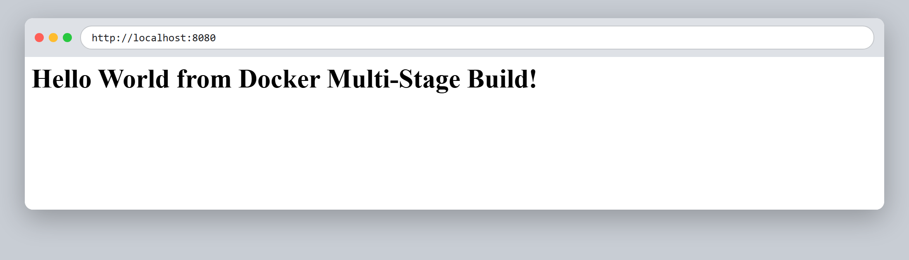
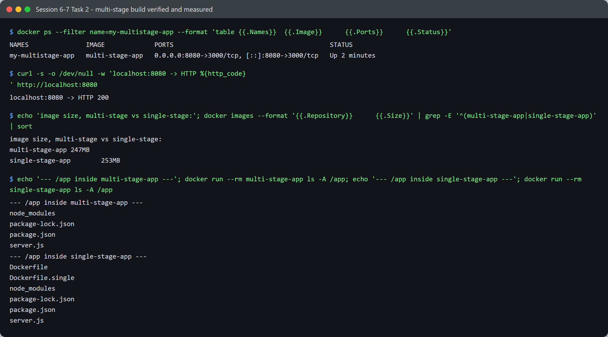

# Session 6-7 - Docker - Task 2: Multi-Stage Docker Build

- **Name:** Netram
- **Enrollment No:** 24BCS10329

> **Status:** completed

> Built and run on Docker Engine 29.2.1 (Docker Desktop, WSL2 backend) on Windows 11.

---

## What the task asked

Build the Express app in [`../multi-stage-dockerfile/`](../multi-stage-dockerfile/) using a
multi-stage Dockerfile, run it with host port `8080` mapped to container port `3000`, and verify
the output in the browser and with `docker ps`.

## My approach

Building and running it is three commands. What I actually wanted to know was whether the
multi-stage build *earned its keep*, so I also wrote a single-stage equivalent
([`../multi-stage-dockerfile/Dockerfile.single`](../multi-stage-dockerfile/Dockerfile.single))
and compared the two images. The answer turned out to be more interesting than I expected.

## Steps

1. Moved into the app directory:

   ```bash
   cd session6-7-docker/multi-stage-dockerfile
   ```

2. Built the image from the two-stage Dockerfile (`builder` then `production`):

   ```bash
   docker build -t multi-stage-app .
   ```

3. Ran it with the required port mapping:

   ```bash
   docker run -d --name my-multistage-app -p 8080:3000 multi-stage-app
   ```

## Outputs and verification

### 1. Web output



The page is served by Express running inside the container, reached through the `8080:3000`
mapping.

### 2. `docker ps` and terminal checks



```text
$ docker ps --filter name=my-multistage-app --format 'table {{.Names}}\t{{.Image}}\t{{.Ports}}\t{{.Status}}'
NAMES               IMAGE             PORTS                                         STATUS
my-multistage-app   multi-stage-app   0.0.0.0:8080->3000/tcp, [::]:8080->3000/tcp   Up 2 minutes

$ curl -s -o /dev/null -w 'localhost:8080 -> HTTP %{http_code}\n' http://localhost:8080
localhost:8080 -> HTTP 200
```

`0.0.0.0:8080->3000/tcp` is the mapping the task asked for, and `HTTP 200` confirms it is not
just running but actually answering.

## Did the multi-stage build actually save anything? Measured

I built the same app both ways and weighed them:

```bash
docker build                      -t multi-stage-app  .
docker build -f Dockerfile.single -t single-stage-app .
```

```text
multi-stage-app     247MB
single-stage-app    253MB
```

**6 MB, about 2.4%.** That is a genuinely disappointing result, and it is worth being honest
about rather than claiming a win that is not there.

The reason is in `package.json`: this app has exactly one dependency, `express`, and **no dev
dependencies at all**. The multi-stage Dockerfile's saving comes from running
`npm install --omit=dev` in the production stage, so when there is nothing dev-only to omit,
there is almost nothing to save. The `node:24-alpine` base image is ~245 MB of the total either
way, and neither approach touches that.

Where the difference *does* show up is in what ends up inside the image:

```text
$ docker run --rm multi-stage-app ls -A /app
node_modules
package-lock.json
package.json
server.js

$ docker run --rm single-stage-app ls -A /app
Dockerfile
Dockerfile.single
node_modules
package-lock.json
package.json
server.js
```

The single-stage image is shipping **both Dockerfiles** inside `/app`, because `COPY . .` copies
the entire build context. The multi-stage version copies named files across from the builder
(`COPY --from=builder /app/server.js ./`), so only what was asked for makes it in.

Two Dockerfiles are harmless. The same mechanism is what leaks `.env` files, private keys, test
fixtures and `.git` directories into production images, and that is not harmless. Multi-stage
gives you an allow-list instead of a deny-list, which is the safer default even when the byte
count barely moves.

For a case where the size saving *is* dramatic, see the React and Java apps in
[Task 1](../task/README.md#proving-the-multi-stage-builds-actually-dropped-the-build-tooling):
455 MB down to 102 MB, and 721 MB down to 454 MB. Same technique, but those builds have real
tooling to leave behind.

## What I learned

- Multi-stage builds save space in proportion to how much **build-only tooling** exists. With one
  runtime dependency and no dev dependencies there is nothing to strip, and the honest measured
  result was 2.4%.
- The size number is not the only benefit. Multi-stage forces you to name what crosses into the
  final image, which turns "everything unless excluded" into "nothing unless included".
- `COPY . .` copies the whole build context including the Dockerfile itself. I would not have
  believed that without running `ls -A /app` inside the finished image.
- Measuring beat assuming. I expected a large saving here and got 6 MB, and finding out why
  taught me more than a confirming result would have.

## Problems I hit

- **I assumed the saving would be large and nearly wrote that up without checking.** Building the
  single-stage baseline took two minutes and turned a wrong claim into the most interesting part
  of this task. I now treat "multi-stage makes images smaller" as something that depends on the
  app rather than something that is always true.
- **`docker run --rm multi-stage-app ls -A /app` failed** with
  `ls: C:/Program Files/Git/app: No such file or directory`. Git Bash rewrites `/app` into a
  Windows path before Docker sees it. `export MSYS_NO_PATHCONV=1` fixed it.
- **A stale container held the name** on my second run: `docker run` failed with a name conflict
  on `my-multistage-app`. `docker rm -f my-multistage-app` before re-running solved it, and it is
  why my commands now start with a cleanup step.
