# Session 6-7 - Docker - Task 2: Multi-Stage Docker Build

- **Name:** Netram
- **Enrollment No:** 24BCS10329

> **Status:** completed

> **Where this ran.** My first run was on Windows 11 (Docker Desktop 29.2.1, WSL2 backend). That
> run built from the copy already in my repo and did not clone anything, never printed the page
> text, and had no Task 3. I redid Tasks 1 and 3 on macOS (Apple Silicon, arm64) with Docker
> Desktop, server 29.6.2 `linux/arm64`, so every Task 1 and Task 3 output below comes from that
> macOS run. The size comparison at the end is from the original Windows run and I have left it
> as it was.

---

## What the task asked

1. **Task 1:** clone the repository with the multi-stage Dockerfile, build the image, run a
   container, open the app, check it says "Hello World from Docker multi-stage build", check the
   container with `docker ps`, and confirm it is on port `8080`.
2. **Task 2:** write this file with my name, enrollment number, output of the running app, and
   `docker ps` output showing the container on port `8080`.
3. **Task 3:** deploy at least three different types of application with Docker (Node.js, Python,
   Java).

---

## Task 1: Clone, build, run and verify on port 8080

### 1. Clone the repository and look at the Dockerfile

I cloned the course repo fresh into a temporary folder instead of using my own copy, so this is
exactly what the assignment points at:

```bash
git clone https://github.com/Nency-Ravaliya/devops-heros
cd devops-heros/session6-7-docker/multi-stage-dockerfile
```

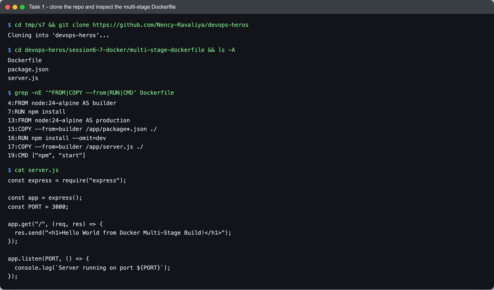

```text
$ cd tmp/s7 && git clone https://github.com/Nency-Ravaliya/devops-heros
Cloning into 'devops-heros'...

$ cd devops-heros/session6-7-docker/multi-stage-dockerfile && ls -A
Dockerfile
package.json
server.js

$ grep -nE '^FROM|COPY --from|RUN|CMD' Dockerfile
4:FROM node:24-alpine AS builder
7:RUN npm install
13:FROM node:24-alpine AS production
15:COPY --from=builder /app/package*.json ./
16:RUN npm install --omit=dev
17:COPY --from=builder /app/server.js ./
19:CMD ["npm", "start"]

$ cat server.js
const express = require("express");

const app = express();
const PORT = 3000;

app.get("/", (req, res) => {
  res.send("<h1>Hello World from Docker Multi-Stage Build!</h1>");
});

app.listen(PORT, () => {
  console.log(`Server running on port ${PORT}`);
});
```

There are two stages. `builder` installs everything and copies the whole build context.
`production` starts from a clean `node:24-alpine`, installs only runtime dependencies, and pulls
just `package*.json` and `server.js` across with `COPY --from=builder`. The app listens on `3000`
inside the container, so `8080` has to come from the `-p` mapping.

The fresh clone has only `Dockerfile`, `package.json` and `server.js`. The `Dockerfile.single` in
my repo copy is something I added myself for the size comparison further down.

### 2. Build the image

```bash
docker build -t netram-s7-multistage .
```

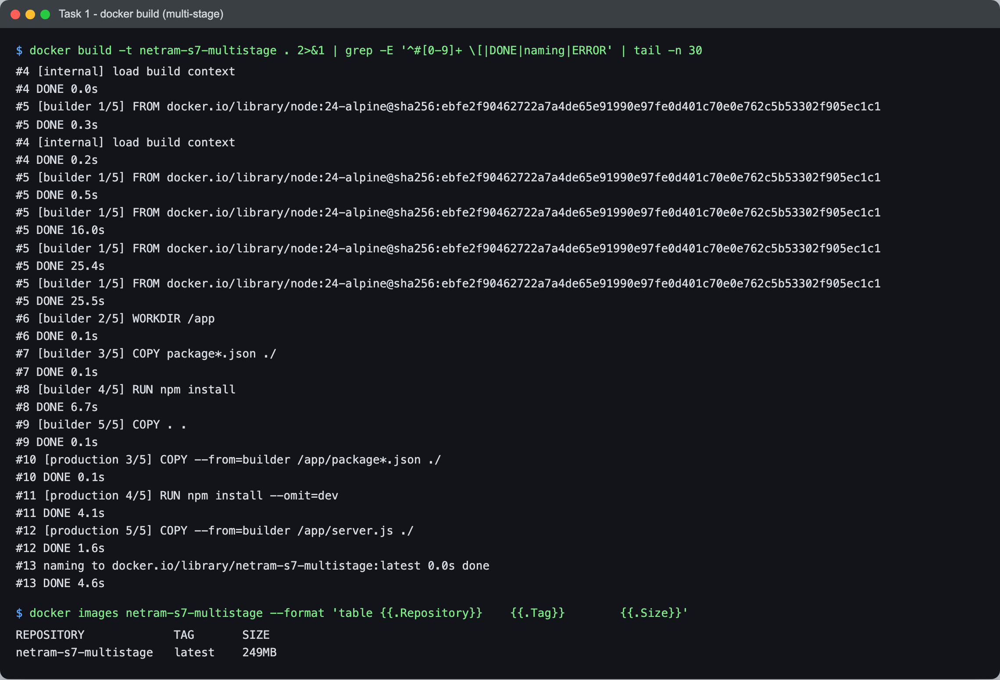

The full BuildKit log is long, so I filtered it down to the step lines:

```text
$ docker build -t netram-s7-multistage . 2>&1 | grep -E '^#[0-9]+ \[|DONE|naming|ERROR' | tail -n 30
#4 [internal] load build context
#4 DONE 0.0s
#5 [builder 1/5] FROM docker.io/library/node:24-alpine@sha256:ebfe2f90462722a7a4de65e91990e97fe0d401c70e0e762c5b53302f905ec1c1
#5 DONE 0.3s
#4 [internal] load build context
#4 DONE 0.2s
#5 [builder 1/5] FROM docker.io/library/node:24-alpine@sha256:ebfe2f90462722a7a4de65e91990e97fe0d401c70e0e762c5b53302f905ec1c1
#5 DONE 0.5s
#5 [builder 1/5] FROM docker.io/library/node:24-alpine@sha256:ebfe2f90462722a7a4de65e91990e97fe0d401c70e0e762c5b53302f905ec1c1
#5 DONE 16.0s
#5 [builder 1/5] FROM docker.io/library/node:24-alpine@sha256:ebfe2f90462722a7a4de65e91990e97fe0d401c70e0e762c5b53302f905ec1c1
#5 DONE 25.4s
#5 [builder 1/5] FROM docker.io/library/node:24-alpine@sha256:ebfe2f90462722a7a4de65e91990e97fe0d401c70e0e762c5b53302f905ec1c1
#5 DONE 25.5s
#6 [builder 2/5] WORKDIR /app
#6 DONE 0.1s
#7 [builder 3/5] COPY package*.json ./
#7 DONE 0.1s
#8 [builder 4/5] RUN npm install
#8 DONE 6.7s
#9 [builder 5/5] COPY . .
#9 DONE 0.1s
#10 [production 3/5] COPY --from=builder /app/package*.json ./
#10 DONE 0.1s
#11 [production 4/5] RUN npm install --omit=dev
#11 DONE 4.1s
#12 [production 5/5] COPY --from=builder /app/server.js ./
#12 DONE 1.6s
#13 naming to docker.io/library/netram-s7-multistage:latest 0.0s done
#13 DONE 4.6s

$ docker images netram-s7-multistage --format 'table {{.Repository}}\t{{.Tag}}\t{{.Size}}'
REPOSITORY             TAG       SIZE
netram-s7-multistage   latest    249MB
```

Two things in that log confused me at first. The repeated `#4` and `#5` lines are BuildKit's plain
progress output printing a step again while it is still running. `node:24-alpine` was not on this
Mac yet, so the `FROM` step was a real pull and took 25.5s.
And there is no `production 1/5` or `production 2/5`: both stages start with the same
`FROM node:24-alpine` and `WORKDIR /app`, so BuildKit runs those steps once and both stages
share them. The `production` stage visibly starts at step 3, the first line that differs.

### 3. Run the container on port 8080

Before running I checked `docker ps` for anything already using `8080`. Nothing was, so I used the
exact port the task asks for.

```bash
docker run -d --name netram-s7-multistage -p 8080:3000 netram-s7-multistage
```

### 4. Access the app and verify the text

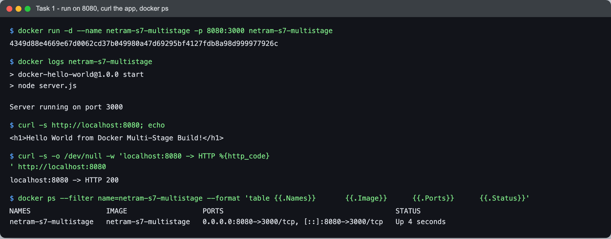

```text
$ docker run -d --name netram-s7-multistage -p 8080:3000 netram-s7-multistage
4349d88e4669e67d0062cd37b049980a47d69295bf4127fdb8a98d999977926c

$ docker logs netram-s7-multistage

> docker-hello-world@1.0.0 start
> node server.js

Server running on port 3000

$ curl -s http://localhost:8080; echo
<h1>Hello World from Docker Multi-Stage Build!</h1>

$ curl -s -o /dev/null -w 'localhost:8080 -> HTTP %{http_code}\n' http://localhost:8080
localhost:8080 -> HTTP 200
```

And in the browser at `http://localhost:8080`:

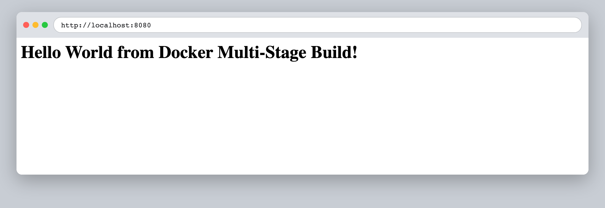

**About the exact text.** The task says the app should display "Hello World from Docker
multi-stage build". What the app really returns is
`<h1>Hello World from Docker Multi-Stage Build!</h1>`, so the browser shows
**Hello World from Docker Multi-Stage Build!**. The words match, but "Multi-Stage Build" is title
case and there is a `!` at the end. That string comes straight from `server.js` in the cloned
repo (shown above). I did not edit it to match the wording in the task, because then I would be
checking my own change instead of the app the task gave me.

### 5. Verify with `docker ps` and confirm port 8080

```text
$ docker ps --filter name=netram-s7-multistage --format 'table {{.Names}}\t{{.Image}}\t{{.Ports}}\t{{.Status}}'
NAMES                  IMAGE                  PORTS                                         STATUS
netram-s7-multistage   netram-s7-multistage   0.0.0.0:8080->3000/tcp, [::]:8080->3000/tcp   Up 4 seconds
```

`0.0.0.0:8080->3000/tcp` is the mapping the task asked for: host port `8080` forwards to Express
on `3000` inside the container. `HTTP 200` plus the page text shows it is not only running but
answering.

---

## Task 2: Documentation

This file is the Task 2 deliverable. Where each required item is:

| Required item | Where it is |
| --- | --- |
| Name and enrollment number | Top of this file |
| Output of the app running | Task 1, step 4: `curl` output and [`task1-04-browser-8080.png`](screenshots/task1-04-browser-8080.png) |
| `docker ps` showing the container on port 8080 | Task 1, step 5 and [`task1-03-run-curl-docker-ps.png`](screenshots/task1-03-run-curl-docker-ps.png) |

---

## Task 3: Deploy three different types of application

For this I reused the three apps I had already written for the Session 6-7 task in
[`../task/`](../task/README.md): Node.js, Python and Java. Each has its own Dockerfile:

| App | Folder | Base image | Container port | Host port I used |
| --- | --- | --- | --- | --- |
| Node.js + Express | [`../task/nodejs-app`](../task/nodejs-app/) | `node:22-alpine` | 3000 | 18781 |
| Python + Flask | [`../task/python-app`](../task/python-app/) | `python:3.12-slim` | 5000 | 18782 |
| Java (`com.sun.net.httpserver`) | [`../task/java-app`](../task/java-app/) | `eclipse-temurin:21-jdk` to build, `21-jre` to run (multi-stage) | 8000 | 18783 |

I gave each one its own host port so all three could run side by side with the Task 1 container
still on `8080`.

### 1. Build all three images

```bash
docker build -t netram-s7-node   ./nodejs-app
docker build -t netram-s7-python ./python-app
docker build -t netram-s7-java   ./java-app
```

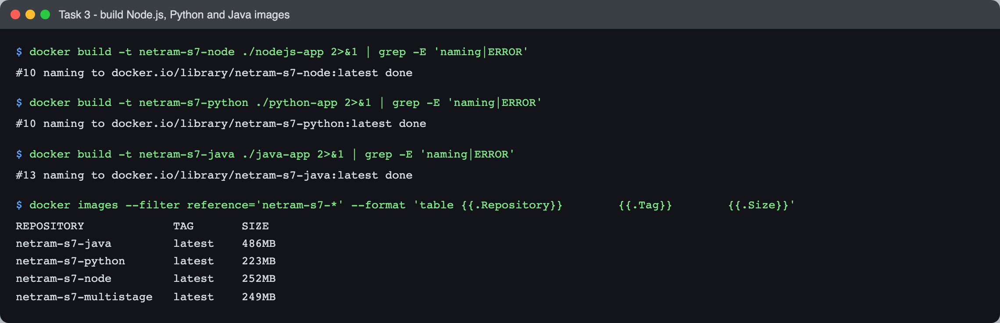

```text
$ docker build -t netram-s7-node ./nodejs-app 2>&1 | grep -E 'naming|ERROR'
#10 naming to docker.io/library/netram-s7-node:latest done

$ docker build -t netram-s7-python ./python-app 2>&1 | grep -E 'naming|ERROR'
#10 naming to docker.io/library/netram-s7-python:latest done

$ docker build -t netram-s7-java ./java-app 2>&1 | grep -E 'naming|ERROR'
#13 naming to docker.io/library/netram-s7-java:latest done

$ docker images --filter reference='netram-s7-*' --format 'table {{.Repository}}\t{{.Tag}}\t{{.Size}}'
REPOSITORY             TAG       SIZE
netram-s7-java         latest    486MB
netram-s7-python       latest    223MB
netram-s7-node         latest    252MB
netram-s7-multistage   latest    249MB
```

Each build ended in a `naming to` line and no `ERROR`, so all three built.

### 2. Run all three, check each one answers, and `docker ps`

```bash
docker run -d --name netram-s7-node   -p 18781:3000 netram-s7-node
docker run -d --name netram-s7-python -p 18782:5000 netram-s7-python
docker run -d --name netram-s7-java   -p 18783:8000 netram-s7-java
```

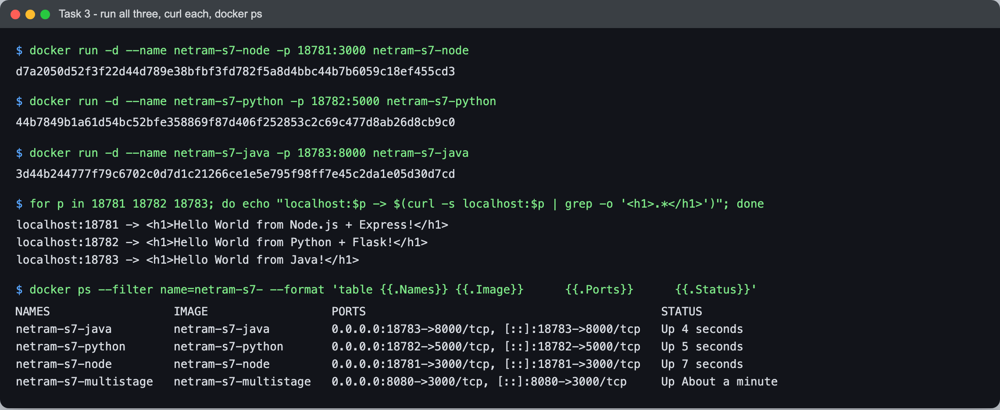

```text
$ docker run -d --name netram-s7-node -p 18781:3000 netram-s7-node
d7a2050d52f3f22d44d789e38bfbf3fd782f5a8d4bbc44b7b6059c18ef455cd3

$ docker run -d --name netram-s7-python -p 18782:5000 netram-s7-python
44b7849b1a61d54bc52bfe358869f87d406f252853c2c69c477d8ab26d8cb9c0

$ docker run -d --name netram-s7-java -p 18783:8000 netram-s7-java
3d44b244777f79c6702c0d7d1c21266ce1e5e795f98ff7e45c2da1e05d30d7cd

$ for p in 18781 18782 18783; do echo "localhost:$p -> $(curl -s localhost:$p | grep -o '<h1>.*</h1>')"; done
localhost:18781 -> <h1>Hello World from Node.js + Express!</h1>
localhost:18782 -> <h1>Hello World from Python + Flask!</h1>
localhost:18783 -> <h1>Hello World from Java!</h1>

$ docker ps --filter name=netram-s7- --format 'table {{.Names}}\t{{.Image}}\t{{.Ports}}\t{{.Status}}'
NAMES                  IMAGE                  PORTS                                           STATUS
netram-s7-java         netram-s7-java         0.0.0.0:18783->8000/tcp, [::]:18783->8000/tcp   Up 4 seconds
netram-s7-python       netram-s7-python       0.0.0.0:18782->5000/tcp, [::]:18782->5000/tcp   Up 5 seconds
netram-s7-node         netram-s7-node         0.0.0.0:18781->3000/tcp, [::]:18781->3000/tcp   Up 7 seconds
netram-s7-multistage   netram-s7-multistage   0.0.0.0:8080->3000/tcp, [::]:8080->3000/tcp     Up About a minute
```

Four containers on four different host ports, all up at the same time: the three Task 3 apps
plus the Task 1 app still on `8080`.

### 3. The three apps in the browser

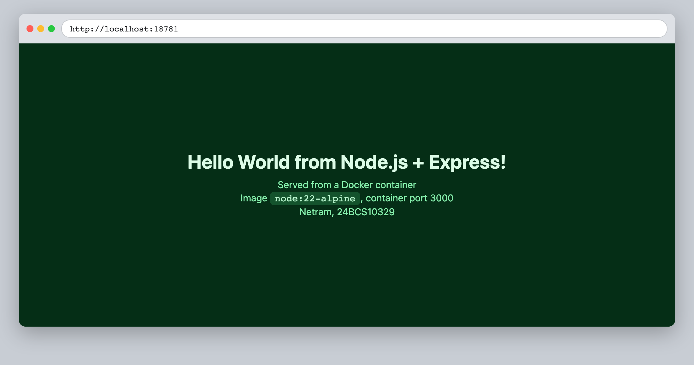

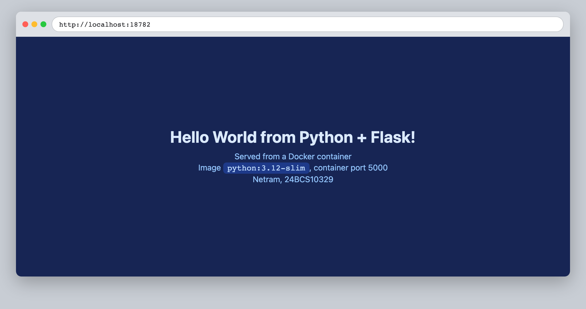

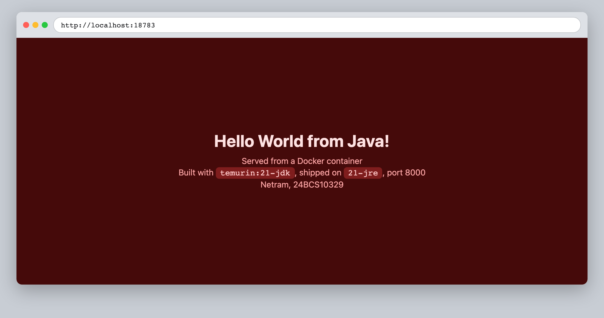

When I was done I removed all four containers and images with `docker rm -f` and `docker rmi`.

---

## Original Windows run (first attempt)

This is what I captured the first time, on Windows, building from my repo copy rather than a
fresh clone. I am keeping it because the size comparison below came out of it.

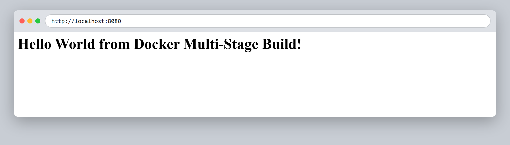

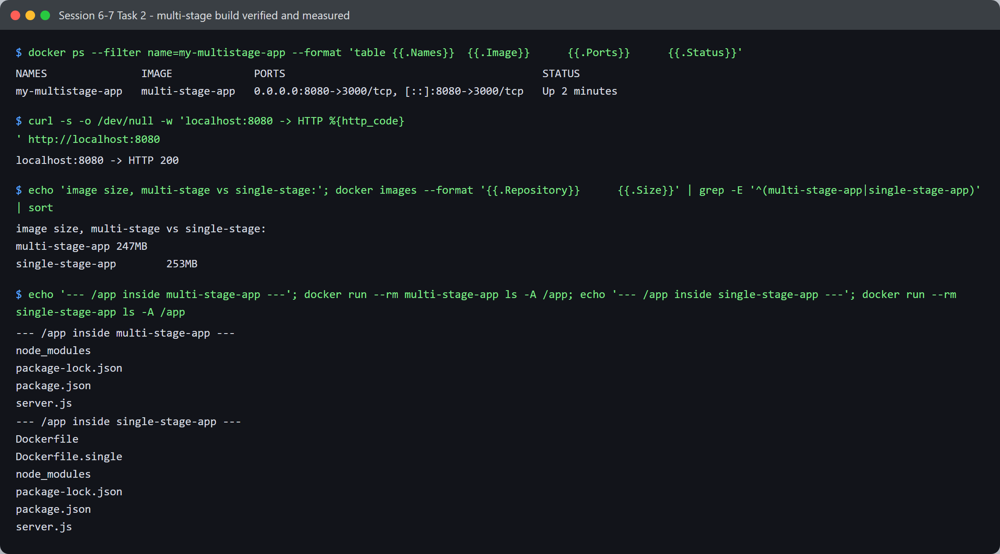

```text
$ docker ps --filter name=my-multistage-app --format 'table {{.Names}}\t{{.Image}}\t{{.Ports}}\t{{.Status}}'
NAMES               IMAGE             PORTS                                         STATUS
my-multistage-app   multi-stage-app   0.0.0.0:8080->3000/tcp, [::]:8080->3000/tcp   Up 2 minutes

$ curl -s -o /dev/null -w 'localhost:8080 -> HTTP %{http_code}\n' http://localhost:8080
localhost:8080 -> HTTP 200
```

## Did the multi-stage build actually save anything? Measured

Building and running it is three commands. What I actually wanted to know was whether the
multi-stage build *earned its keep*, so I also wrote a single-stage equivalent
([`../multi-stage-dockerfile/Dockerfile.single`](../multi-stage-dockerfile/Dockerfile.single))
and compared the two images on the Windows machine:

```bash
docker build                      -t multi-stage-app  .
docker build -f Dockerfile.single -t single-stage-app .
```

```text
multi-stage-app     247MB
single-stage-app    253MB
```

**6 MB, about 2.4%.** That is a genuinely disappointing result, and it is worth being honest
about rather than claiming a win that is not there. (On the Mac re-run the multi-stage image came
out at 249MB, a slightly different `node:24-alpine` build for arm64, so the same ballpark.)

The reason is in `package.json`: this app has exactly one dependency, `express`, and **no dev
dependencies at all**. The multi-stage Dockerfile's saving comes from running
`npm install --omit=dev` in the production stage, so when there is nothing dev-only to omit,
there is almost nothing to save. The `node:24-alpine` base image is ~245 MB of the total either
way, and neither approach touches that.

Where the difference *does* show up is in what ends up inside the image:

```text
$ docker run --rm multi-stage-app ls -A /app
node_modules
package-lock.json
package.json
server.js

$ docker run --rm single-stage-app ls -A /app
Dockerfile
Dockerfile.single
node_modules
package-lock.json
package.json
server.js
```

The single-stage image is shipping **both Dockerfiles** inside `/app`, because `COPY . .` copies
the entire build context. The multi-stage version copies named files across from the builder
(`COPY --from=builder /app/server.js ./`), so only what was asked for makes it in.

Two Dockerfiles are harmless. The same mechanism is what leaks `.env` files, private keys, test
fixtures and `.git` directories into production images, and that is not harmless. Multi-stage
gives you an allow-list instead of a deny-list, which is the safer default even when the byte
count barely moves.

For a case where the size saving *is* dramatic, see the React and Java apps in
[Task 1](../task/README.md#proving-the-multi-stage-builds-actually-dropped-the-build-tooling):
455 MB down to 102 MB, and 721 MB down to 454 MB. Same technique, but those builds have real
tooling to leave behind.

## What I learned

- Multi-stage builds save space in proportion to how much **build-only tooling** exists. With one
  runtime dependency and no dev dependencies there is nothing to strip, and the honest measured
  result was 2.4%.
- The size number is not the only benefit. Multi-stage forces you to name what crosses into the
  final image, which turns "everything unless excluded" into "nothing unless included".
- `COPY . .` copies the whole build context including the Dockerfile itself. I would not have
  believed that without running `ls -A /app` inside the finished image.
- BuildKit shares identical steps between stages. Both stages here begin with the same `FROM` and
  `WORKDIR`, so the build log only shows `production` from step 3 onwards.
- Checking the real output beats trusting the task wording. The app prints
  "Hello World from Docker Multi-Stage Build!", not the exact lowercase phrase in the task, and I
  only noticed because I curled it instead of just checking for `HTTP 200`.
- Measuring beat assuming. I expected a large saving here and got 6 MB, and finding out why
  taught me more than a confirming result would have.

## Problems I hit

- **My first write-up skipped the clone and never showed the page text.** It built from my own
  copy and only checked the status code. On the re-run I cloned the repo fresh and printed the
  response body, which is how I found the capitalisation difference above.
- **I assumed the saving would be large and nearly wrote that up without checking.** Building the
  single-stage baseline took two minutes and turned a wrong claim into the most interesting part
  of this task. I now treat "multi-stage makes images smaller" as something that depends on the
  app rather than something that is always true.
- **`docker run --rm multi-stage-app ls -A /app` failed** on Windows with
  `ls: C:/Program Files/Git/app: No such file or directory`. Git Bash rewrites `/app` into a
  Windows path before Docker sees it. `export MSYS_NO_PATHCONV=1` fixed it. This did not happen
  on macOS, where the shell leaves `/app` alone.
- **A stale container held the name** on my second Windows run: `docker run` failed with a name
  conflict on `my-multistage-app`. `docker rm -f my-multistage-app` before re-running solved it,
  and it is why my commands now start with a cleanup step.
