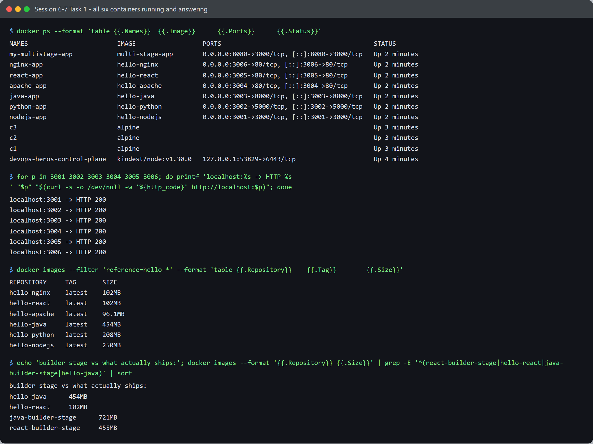
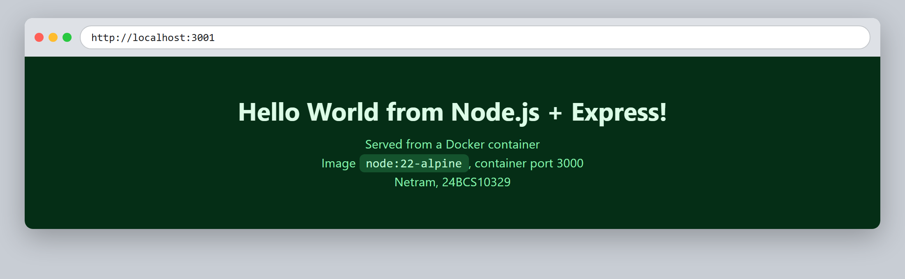
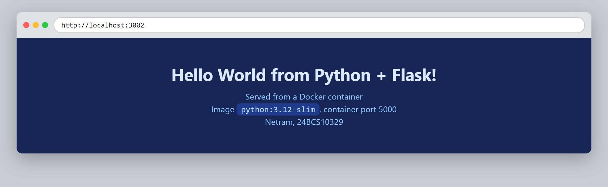
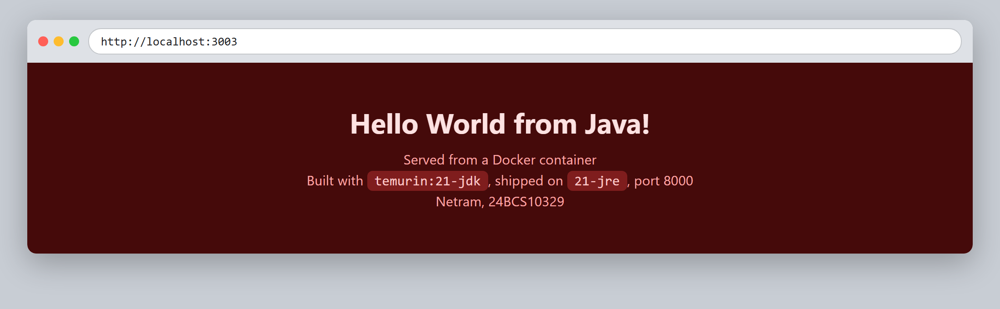
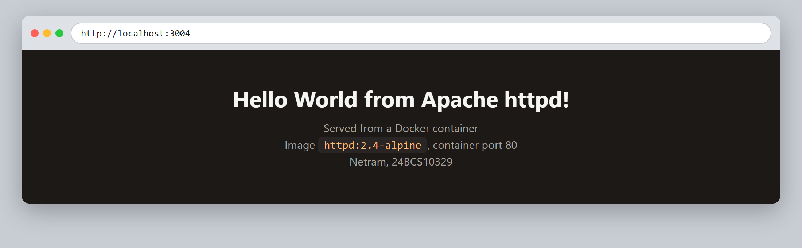
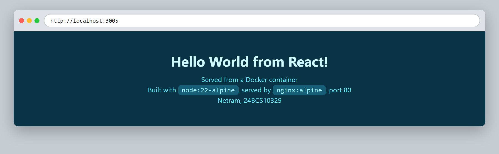
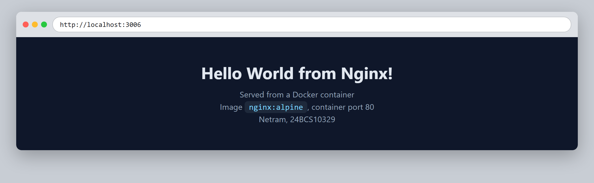

# Session 6-7 - Docker - Task 1: Hello World Applications

- **Name:** Netram
- **Enrollment No:** 24BCS10329

> **Status:** completed

> Built and run on Docker Engine 29.2.1 (Docker Desktop, WSL2 backend) on Windows 11.

---

## What the task asked

Containerise a set of simple "Hello World" web applications, one per runtime, and verify each
one really serves over HTTP from its container.

## My approach

Six runtimes, one folder each, all under [`.`](.). Every app serves a small HTML page naming
the runtime and the base image it came from, so a screenshot of the browser is self evidently
the right container and not a cached page from a different one. Each gets its own host port so
all six can run at once and be checked in a single pass.

Two of the six use a **multi-stage build** on purpose, because they genuinely need one:
`java-app` compiles with the JDK and ships only the JRE, and `React-app` builds a bundle with
the whole Node toolchain and ships only static files on Nginx. The other four have nothing to
compile, so a second stage would add complexity for no gain.

## Applications built

| Folder | Runtime | Base image(s) | Container port | Host port | Image size |
|--------|---------|---------------|----------------|-----------|------------|
| [`nodejs-app/`](nodejs-app/) | Node.js + Express | `node:22-alpine` | 3000 | 3001 | 250 MB |
| [`python-app/`](python-app/) | Python + Flask | `python:3.12-slim` | 5000 | 3002 | 208 MB |
| [`java-app/`](java-app/) | Java `HttpServer` | `temurin:21-jdk` to `21-jre` | 8000 | 3003 | 454 MB |
| [`Apache-app/`](Apache-app/) | Apache httpd | `httpd:2.4-alpine` | 80 | 3004 | 96.1 MB |
| [`React-app/`](React-app/) | React (Vite) | `node:22-alpine` to `nginx:alpine` | 80 | 3005 | 102 MB |
| [`nginx-app/`](nginx-app/) | Nginx | `nginx:alpine` | 80 | 3006 | 102 MB |

## How to build and run

```bash
cd session6-7-docker/task

docker build -t hello-nodejs nodejs-app  && docker run -d --name nodejs-app -p 3001:3000 hello-nodejs
docker build -t hello-python python-app  && docker run -d --name python-app -p 3002:5000 hello-python
docker build -t hello-java   java-app    && docker run -d --name java-app   -p 3003:8000 hello-java
docker build -t hello-apache Apache-app  && docker run -d --name apache-app -p 3004:80   hello-apache
docker build -t hello-react  React-app   && docker run -d --name react-app  -p 3005:80   hello-react
docker build -t hello-nginx  nginx-app   && docker run -d --name nginx-app  -p 3006:80   hello-nginx
```

## Verification

All six containers up, and every port answering `HTTP 200`:



```text
$ docker ps --format 'table {{.Names}}\t{{.Image}}\t{{.Ports}}\t{{.Status}}'
NAMES               IMAGE             PORTS                                         STATUS
nginx-app           hello-nginx       0.0.0.0:3006->80/tcp, [::]:3006->80/tcp       Up 2 minutes
react-app           hello-react       0.0.0.0:3005->80/tcp, [::]:3005->80/tcp       Up 2 minutes
apache-app          hello-apache      0.0.0.0:3004->80/tcp, [::]:3004->80/tcp       Up 2 minutes
java-app            hello-java        0.0.0.0:3003->8000/tcp, [::]:3003->8000/tcp   Up 2 minutes
python-app          hello-python      0.0.0.0:3002->5000/tcp, [::]:3002->5000/tcp   Up 2 minutes
nodejs-app          hello-nodejs      0.0.0.0:3001->3000/tcp, [::]:3001->3000/tcp   Up 2 minutes

$ for p in 3001 3002 3003 3004 3005 3006; do ... curl ... done
localhost:3001 -> HTTP 200
localhost:3002 -> HTTP 200
localhost:3003 -> HTTP 200
localhost:3004 -> HTTP 200
localhost:3005 -> HTTP 200
localhost:3006 -> HTTP 200
```

The full screenshot also shows `c1`, `c2`, `c3` and a `kindest/node` container. Those are from
[session 8](../../session8-docker-networking-volume/task/) and session 9 running on the same
daemon at the same time, not part of this task.

Notice the `PORTS` column: the left number is the **host** port and the right one is the
**container** port, and they only match by coincidence. `nodejs-app` is `3001->3000` because
Express listens on 3000 inside, while `python-app` is `3002->5000` because Flask defaults to
5000. The container port is a property of the app; the host port is a choice I made.

### Each app in the browser

| | |
|---|---|
|  |  |
|  |  |
|  |  |

Each page states its own runtime and base image, so the screenshot proves which container
answered rather than just proving *something* answered.

## Proving the multi-stage builds actually dropped the build tooling

It is easy to claim a multi-stage build saves space. I measured it by building the intermediate
`builder` stage as its own image and weighing it against what actually ships:

```bash
docker build --target builder -t react-builder-stage React-app
docker build --target builder -t java-builder-stage  java-app
```

```text
react-builder-stage   455MB      hello-react   102MB
java-builder-stage    721MB      hello-java    454MB
```

| App | Builder stage | Shipped image | Dropped |
|---|---|---|---|
| React | 455 MB | 102 MB | **353 MB, 78%** |
| Java | 721 MB | 454 MB | **267 MB, 37%** |

For React that is `node_modules`, Vite and the whole toolchain being left behind; only the
compiled `dist/` folder crosses into the Nginx stage. For Java it is the compiler and the JDK's
development tooling being left behind; only `HelloWorldServer.class` and a JRE ship.

The React saving is the bigger one, and that makes sense: the JRE is still a substantial runtime,
whereas static files need no runtime at all.

## What I learned

- The container port belongs to the application and the host port is arbitrary. Reading
  `3002->5000` correctly, host on the left, is the thing that makes port mapping stop being
  confusing.
- Binding to `127.0.0.1` inside a container makes it unreachable no matter how the ports are
  mapped, because loopback inside the container's network namespace is not the host's loopback.
  Every app here binds `0.0.0.0` for that reason.
- Multi-stage builds are worth it exactly when the build needs tooling the runtime does not.
  Adding a second stage to the Nginx app would have saved nothing, because there is no build step
  to separate out.
- Alpine based images are dramatically smaller: `httpd:2.4-alpine` gives a 96 MB image while the
  Java one is 454 MB, for pages that are functionally identical.
- Copying `package*.json` and running the install **before** copying source code means editing
  source does not invalidate the dependency layer. Rebuilds after a code change took seconds
  instead of re-downloading everything.

## Problems I hit

- **The React build failed the first time** because `npm run build` needs the dev dependencies,
  and my first Dockerfile had `npm install --omit=dev` in the builder stage. Vite was simply not
  there. The builder stage needs a full install; only the runtime stage gets to be lean, and in
  the React case the runtime stage has no Node at all.
- **`docker run --rm multi-stage-app ls -A /app` failed with**
  `ls: C:/Program Files/Git/app: No such file or directory`. Git Bash on Windows rewrites
  arguments that look like Unix paths into Windows paths before the program sees them, so `/app`
  became a Windows directory. Setting `MSYS_NO_PATHCONV=1` fixed it. This bit me repeatedly with
  Docker on Windows.
- **Java needed the class file name to match the class name exactly.** `COPY --from=builder
  /build/*.class` worked, but `CMD ["java", "HelloWorldServer"]` takes the class name with no
  `.class` extension, and getting that wrong gives a `ClassNotFoundException` that does not
  obviously point at the Dockerfile.
- **Port 3000 was already taken** by another service on my machine, which is why the host ports
  start at 3001 rather than mirroring the container ports one to one.
