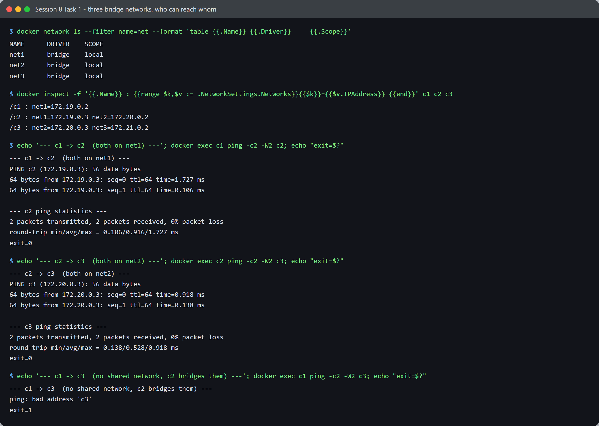
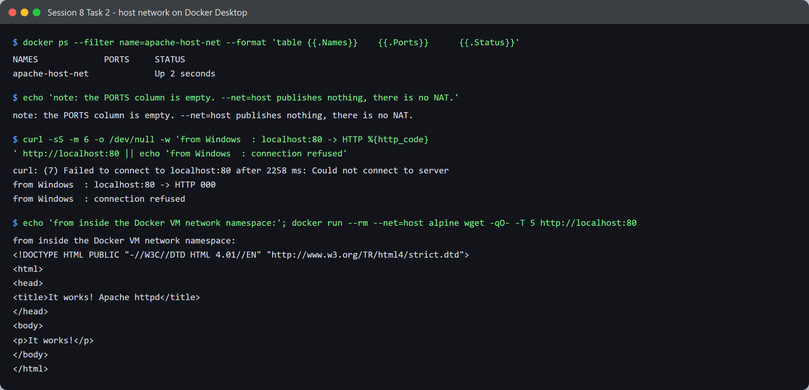
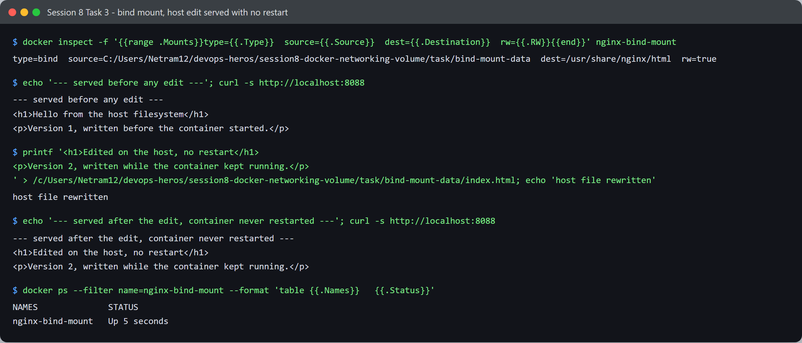

# Session 8 - Docker Networking & Volumes - Tasks

- **Name:** Netram
- **Enrollment No:** 24BCS10329

> **Status:** completed

> Run on Docker Engine 29.2.1 (Docker Desktop, WSL2 backend) on Windows 11.

---

## Task 1: Container networking and isolation

### What the task asked

Create three bridge networks, place three containers so that one of them bridges two networks,
and prove which containers can reach each other.

### My approach

The interesting question is not "can two containers on the same network talk", it is what happens
to a container that is *two hops away* through a container attached to both networks. So I set up
a deliberate chain: `c1` and `c2` share one network, `c2` and `c3` share another, and `c1` and
`c3` share nothing. If Docker routed between bridge networks, `c1` would reach `c3` through `c2`.

### Setup

```bash
docker network create net1
docker network create net2
docker network create net3

docker run -d --name c1 --network net1 alpine sleep 3600
docker run -d --name c2 --network net1 alpine sleep 3600
docker network connect net2 c2          # c2 now sits on both net1 and net2
docker run -d --name c3 --network net2 alpine sleep 3600
docker network connect net3 c3
```

### Connectivity results



```text
$ docker network ls --filter name=net --format 'table {{.Name}}\t{{.Driver}}\t{{.Scope}}'
NAME      DRIVER    SCOPE
net1      bridge    local
net2      bridge    local
net3      bridge    local

$ docker inspect -f '{{.Name}} : {{range $k,$v := .NetworkSettings.Networks}}{{$k}}={{$v.IPAddress}} {{end}}' c1 c2 c3
/c1 : net1=172.19.0.2
/c2 : net1=172.19.0.3 net2=172.20.0.2
/c3 : net2=172.20.0.3 net3=172.21.0.2
```

Each network got its own subnet: `172.19.0.0/16`, `172.20.0.0/16`, `172.21.0.0/16`. `c2` has two
addresses because it is attached to two networks, and `c3` has two for the same reason.

```text
--- c1 -> c2  (both on net1) ---
PING c2 (172.19.0.3): 56 data bytes
64 bytes from 172.19.0.3: seq=0 ttl=64 time=1.727 ms
64 bytes from 172.19.0.3: seq=1 ttl=64 time=0.106 ms
2 packets transmitted, 2 packets received, 0% packet loss
exit=0

--- c2 -> c3  (both on net2) ---
PING c3 (172.20.0.3): 56 data bytes
64 bytes from 172.20.0.3: seq=0 ttl=64 time=0.918 ms
64 bytes from 172.20.0.3: seq=1 ttl=64 time=0.138 ms
2 packets transmitted, 2 packets received, 0% packet loss
exit=0

--- c1 -> c3  (no shared network, c2 bridges them) ---
ping: bad address 'c3'
exit=1
```

| From | To | Shared network | Result |
|---|---|---|---|
| `c1` | `c2` | net1 | reachable, 0% loss |
| `c2` | `c3` | net2 | reachable, 0% loss |
| `c1` | `c3` | none | **fails** |

The failure mode is the part worth reading closely. It is not "request timed out" or
"destination unreachable", it is **`bad address 'c3'`**. That is a **DNS** failure, not a routing
failure. `c1` never got as far as sending a packet, because it could not turn the name `c3` into
an address at all.

That is Docker's embedded DNS server at work. Each user-defined bridge network has its own
resolver scope, and a container can only resolve the names of containers that share a network
with it. From `c1`'s point of view, `c3` does not exist as a name. `c2` being attached to both
networks does not help: it is a member of each, not a router between them. Docker does not
forward traffic between bridge networks by default, and each network is a separate Linux bridge
with its own subnet and iptables rules.

This is the mechanism behind the standard way of isolating a database: put the app on both a
`frontend` and a `backend` network, put the database on `backend` only, and the outside world
physically cannot address the database even by name.

---

## Task 2: Host network

### What the task asked

Run Apache with `--net=host` and access it on port 80.

### Commands

```bash
docker run -d --name apache-host-net --net=host httpd:alpine
curl http://localhost:80
```

### Result, and a platform difference worth documenting



```text
$ docker ps --filter name=apache-host-net --format 'table {{.Names}}\t{{.Ports}}\t{{.Status}}'
NAMES             PORTS     STATUS
apache-host-net             Up 2 seconds
```

The `PORTS` column is **empty**, and that is the whole point of host networking. There is no
mapping because there is no NAT: the container shares the host's network namespace directly and
binds port 80 there. `-p` would be meaningless and Docker warns if you pass it.

Then the curl from Windows:

```text
$ curl -sS -m 6 http://localhost:80
curl: (7) Failed to connect to localhost:80 after 2258 ms: Could not connect to server
from Windows  : localhost:80 -> HTTP 000
```

**It failed.** Not because the task is wrong, but because of what "host" means on this platform.

On Docker Desktop for Windows, containers do not run on Windows. They run inside a Linux VM
managed by WSL2. `--net=host` joins the container to **that Linux VM's** network namespace, which
is not the Windows machine I typed the curl on. Docker Desktop's usual port forwarding, the thing
that makes `-p 8080:80` work seamlessly from Windows, is exactly what `--net=host` opts out of.
So Apache is genuinely listening on port 80, just not on a host that my Windows `curl` can see.

Proving it really is up, from inside the same namespace:

```text
$ docker run --rm --net=host alpine wget -qO- http://localhost:80
<!DOCTYPE HTML PUBLIC "-//W3C//DTD HTML 4.01//EN" "http://www.w3.org/TR/html4/strict.dtd">
<html>
<head>
<title>It works! Apache httpd</title>
</head>
<body>
<p>It works!</p>
</body>
</html>
```

A second throwaway container, also on `--net=host`, reaches Apache on `localhost:80` immediately.
Same command, same address, different network namespace, opposite result. On a native Linux
Docker host the original `curl http://localhost:80` from the shell would have worked directly,
because there the host and the Docker host are the same machine.

| | Bridge (default) | Host (`--net=host`) |
|---|---|---|
| Network namespace | Container's own | Shared with the host |
| Port mapping | Required (`-p`) | Not used, ports bind directly |
| Port conflicts | Isolated per container | Two containers cannot both take :80 |
| Reachable from Windows | Yes, via Docker Desktop forwarding | No, the "host" is the WSL2 VM |
| Performance | NAT overhead | No NAT hop |

---

## Task 3: Bind mount

### What the task asked

Mount a local folder into an Nginx container, then change a file on the host and confirm the
change is served without restarting the container.

### Commands

```bash
mkdir -p bind-mount-data
echo '<h1>Hello from the host filesystem</h1>' > bind-mount-data/index.html

docker run -d --name nginx-bind-mount -p 8088:80 \
  -v C:/Users/Netram12/devops-heros/session8-docker-networking-volume/task/bind-mount-data:/usr/share/nginx/html \
  nginx:alpine
```

### Verification



```text
$ docker inspect -f '{{range .Mounts}}type={{.Type}}  source={{.Source}}  dest={{.Destination}}  rw={{.RW}}{{end}}' nginx-bind-mount
type=bind  source=C:/Users/Netram12/devops-heros/session8-docker-networking-volume/task/bind-mount-data  dest=/usr/share/nginx/html  rw=true
```

`type=bind` confirms this is a bind mount and not a named volume, and `rw=true` means the
container could write back to my real folder if it wanted to.

```text
--- served before any edit ---
<h1>Hello from the host filesystem</h1>
<p>Version 1, written before the container started.</p>
```

Now rewrite the file **on the host**, touching nothing in Docker:

```text
$ printf '<h1>Edited on the host, no restart</h1>\n...' > bind-mount-data/index.html
host file rewritten

--- served after the edit, container never restarted ---
<h1>Edited on the host, no restart</h1>
<p>Version 2, written while the container kept running.</p>

$ docker ps --filter name=nginx-bind-mount --format 'table {{.Names}}\t{{.Status}}'
NAMES              STATUS
nginx-bind-mount   Up 5 seconds
```

New content, and `STATUS` still shows the original `Up`. The container was never restarted and
the image was never rebuilt.

This works because a bind mount is not a copy. The kernel mounts the host directory into the
container's mount namespace, so both sides are looking at the same inodes on the same filesystem.
Nginx opens `/usr/share/nginx/html/index.html` fresh on each request, so the next request simply
reads the new bytes.

The committed [`bind-mount-data/index.html`](bind-mount-data/index.html) is the version 2 file
from that run.

| | Bind mount | Named volume |
|---|---|---|
| Lives at | A path you choose on the host | Docker's own storage area |
| Host can edit it | Yes, trivially | Awkwardly |
| Portable across machines | No, the path must exist | Yes |
| Good for | Local development, live editing | Databases, production data |

---

## Task 4: Overlay network research

### What an overlay network is

A bridge network only spans a single Docker host. An **overlay** network spans *several* Docker
hosts, giving containers on different physical machines one flat virtual layer 2 network on which
they can talk by container name as though they were on the same box.

### How it works

The hosts form a cluster first, via Docker Swarm or Kubernetes. Docker then encapsulates
container traffic using **VXLAN**: an Ethernet frame from a container is wrapped inside a UDP
packet (port 4789), sent across the real physical network to the other host, unwrapped, and
delivered to the destination container. The containers never see any of this and behave as if
they share a LAN.

Supporting the illusion are a distributed key-value store holding which container lives on which
host and with which address, a cluster-wide DNS entry per service so names resolve across hosts,
and optional IPsec encryption of the VXLAN tunnel for traffic crossing untrusted links.

### Main use cases

- **Multi-host container clusters.** Swarm and Kubernetes both need pods or containers on
  different nodes to address each other directly.
- **Service discovery at scale.** A container can reach `payments` by name without caring which
  physical node it landed on, or that it moved after a restart.
- **Segmenting a distributed application.** The same isolation idea from Task 1, extended across
  machines: attach only the services that should talk to a given overlay network.
- **Encrypted traffic between hosts** when the underlying network is not trusted.

### How it relates to Task 1

Task 1 showed that two bridge networks on one host are completely isolated, and that a container
on both does not become a router between them. An overlay network solves the opposite problem:
containers on *different hosts* that ought to be able to talk. Both are the same idea, that
network membership is what grants reachability, applied at different scopes.

---

## What I learned overall

- `bad address 'c3'` taught me more than a timeout would have. Docker isolates networks at the
  **DNS** layer as well as the routing layer, so an unreachable container is not just filtered,
  it is unnameable.
- A container attached to two networks is a member of both, not a router between them. I expected
  `c1` to reach `c3` through `c2` and it does not, which is exactly why the app-plus-database
  isolation pattern is safe.
- `--net=host` means the *Docker* host. On Docker Desktop that is the WSL2 VM, not Windows, and
  the command that "should" work fails while the same command from inside another host-networked
  container succeeds. Understanding where the boundary sits mattered more than the flag itself.
- A bind mount shares inodes rather than copying files, which is why a host edit appears
  instantly with no restart and no rebuild.

## Problems I hit

- **`curl http://localhost:80` failed on Task 2 and I first assumed Apache had crashed.**
  `docker ps` said it was `Up`, and `docker logs` was clean. The container was fine; my mental
  model of "host" was wrong. Running a second container with `--net=host` and reaching Apache
  from there is what proved it, and turned a dead end into the most useful finding in this
  session.
- **The bind mount silently served an Nginx welcome page** on my first attempt. I had passed a
  Git Bash style path (`/c/Users/...`), Docker Desktop did not recognise it as an existing host
  directory, and rather than erroring it mounted something empty. Switching to a Windows style
  path (`C:/Users/...`) fixed it. `docker inspect` on `.Mounts` is the way to confirm what was
  actually mounted rather than trusting the command line.
- **The empty `PORTS` column on the host-networked container looked like a bug.** It is correct
  and expected: with no NAT there is nothing to report. Passing `-p` alongside `--net=host` just
  gets ignored with a warning.
- **Container name collisions** across repeated runs. Every setup step now starts with
  `docker rm -f <name> 2>/dev/null` so a re-run is not blocked by the previous attempt.
