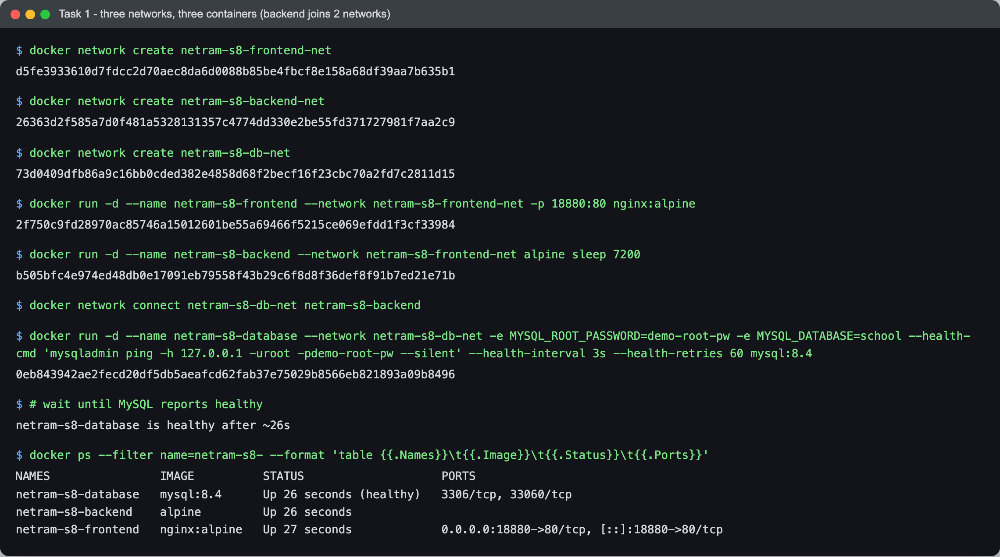
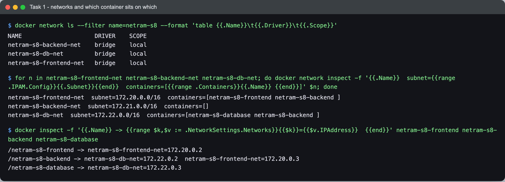
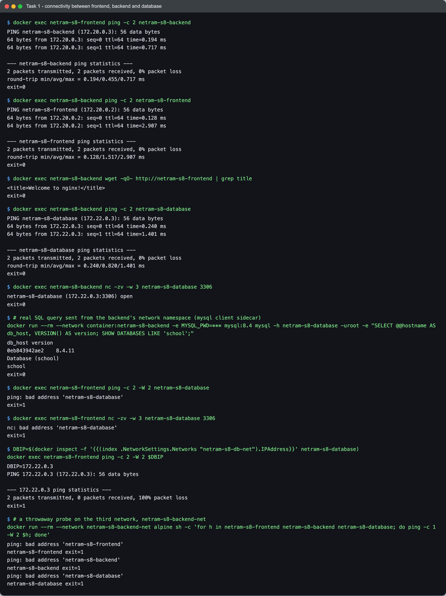
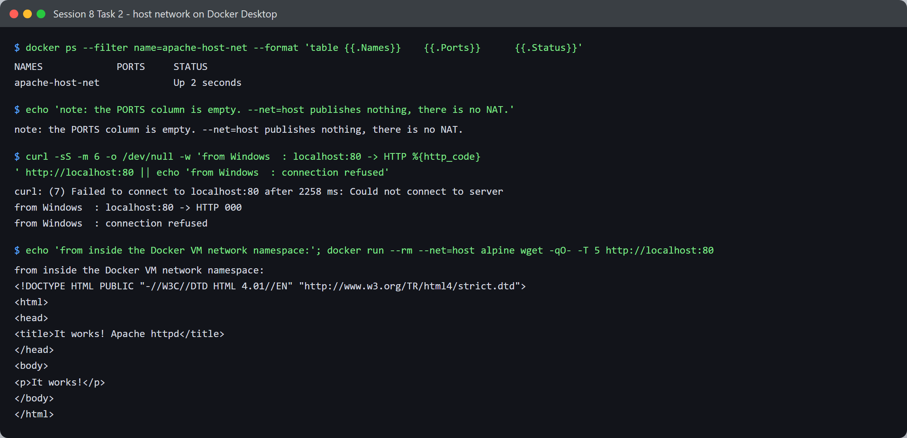
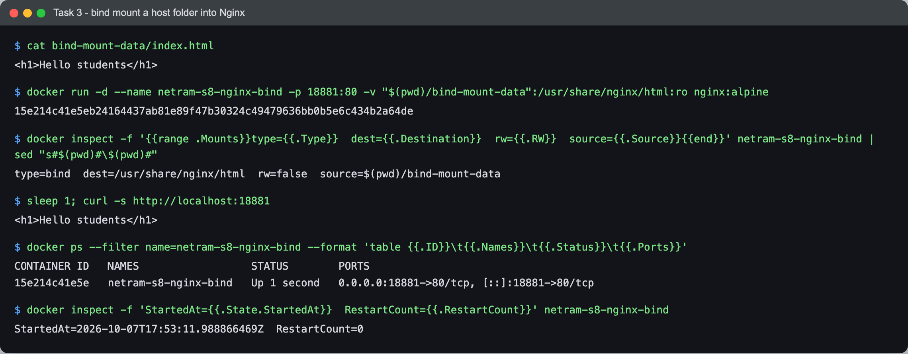
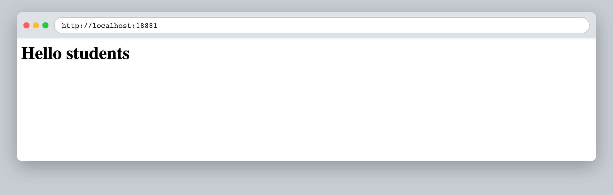
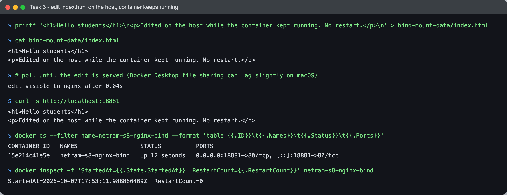
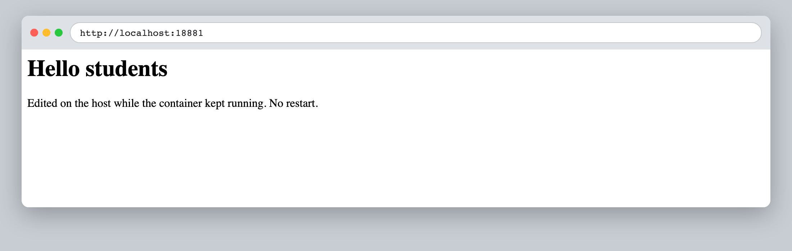

# Session 8 - Docker Networking & Volumes - Tasks

- **Name:** Netram
- **Enrollment No:** 24BCS10329

> **Status:** completed

> Tasks 2 and 4 are from my original run on Docker Engine 29.2.1 (Docker Desktop, WSL2 backend)
> on Windows 11. Tasks 1 and 3 were re-done on macOS 26.5.2 (Apple Silicon, arm64) with Docker
> Desktop, Docker Engine 29.6.2, so that they match the assignment exactly: a frontend, backend
> and MySQL database for Task 1, and a "Hello students" page for Task 3. All container and
> network names in those two tasks are prefixed `netram-s8-`.

---

## Task 1: Container networking and isolation

### What the task asked

Create three containers, Frontend, Backend and Database. Use Nginx or Alpine for the frontend and
backend and the MySQL image for the database. Create three different Docker networks, add the
backend container to two of them, and check connectivity between the containers.

### My approach

I built it the way a real three tier app is isolated. The backend is the only container allowed to
talk to both sides, so it is the one that joins two networks:

| Network | Members | Purpose |
|---|---|---|
| `netram-s8-frontend-net` | frontend, backend | web tier talks to the API tier |
| `netram-s8-db-net` | backend, database | only the API tier can reach MySQL |
| `netram-s8-backend-net` | none of the three | spare network for backend side helpers (workers, cache), used here as an isolation control |

With three containers, three networks and only the backend on two networks, the third network
cannot share a member with the other two without breaking the isolation, so I kept
`netram-s8-backend-net` as a separate segment and used it to prove that a container sitting on it
cannot see any of the three.

### Setup

```bash
docker network create netram-s8-frontend-net
docker network create netram-s8-backend-net
docker network create netram-s8-db-net

docker run -d --name netram-s8-frontend --network netram-s8-frontend-net -p 18880:80 nginx:alpine
docker run -d --name netram-s8-backend  --network netram-s8-frontend-net alpine sleep 7200
docker network connect netram-s8-db-net netram-s8-backend     # backend now on 2 networks
docker run -d --name netram-s8-database --network netram-s8-db-net \
  -e MYSQL_ROOT_PASSWORD=demo-root-pw -e MYSQL_DATABASE=school \
  --health-cmd 'mysqladmin ping -h 127.0.0.1 -uroot -pdemo-root-pw --silent' \
  --health-interval 3s --health-retries 60 mysql:8.4
```

`demo-root-pw` is a throwaway demo password for a local container that was deleted afterwards.



```text
$ # wait until MySQL reports healthy
netram-s8-database is healthy after ~26s

$ docker ps --filter name=netram-s8- --format 'table {{.Names}}\t{{.Image}}\t{{.Status}}\t{{.Ports}}'
NAMES                IMAGE          STATUS                    PORTS
netram-s8-database   mysql:8.4      Up 26 seconds (healthy)   3306/tcp, 33060/tcp
netram-s8-backend    alpine         Up 26 seconds             
netram-s8-frontend   nginx:alpine   Up 27 seconds             0.0.0.0:18880->80/tcp, [::]:18880->80/tcp
```

I waited for the MySQL health check to pass before testing. MySQL takes a while to initialise on
first start, and a port check against a half started database would have told me nothing.

### Networks and membership



```text
$ docker network ls --filter name=netram-s8 --format 'table {{.Name}}\t{{.Driver}}\t{{.Scope}}'
NAME                     DRIVER    SCOPE
netram-s8-backend-net    bridge    local
netram-s8-db-net         bridge    local
netram-s8-frontend-net   bridge    local

$ for n in netram-s8-frontend-net netram-s8-backend-net netram-s8-db-net; do docker network inspect -f '{{.Name}}  subnet={{range .IPAM.Config}}{{.Subnet}}{{end}}  containers=[{{range .Containers}}{{.Name}} {{end}}]' $n; done
netram-s8-frontend-net  subnet=172.20.0.0/16  containers=[netram-s8-frontend netram-s8-backend ]
netram-s8-backend-net  subnet=172.21.0.0/16  containers=[]
netram-s8-db-net  subnet=172.22.0.0/16  containers=[netram-s8-database netram-s8-backend ]

$ docker inspect -f '{{.Name}} -> {{range $k,$v := .NetworkSettings.Networks}}{{$k}}={{$v.IPAddress}}  {{end}}' netram-s8-frontend netram-s8-backend netram-s8-database
/netram-s8-frontend -> netram-s8-frontend-net=172.20.0.2  
/netram-s8-backend -> netram-s8-db-net=172.22.0.2  netram-s8-frontend-net=172.20.0.3  
/netram-s8-database -> netram-s8-db-net=172.22.0.3
```

Each network got its own subnet. The backend has two IP addresses, one per network, because it is
attached to two networks. The frontend and the database each have one, on networks they do not
share.

### Connectivity results



I appended `; echo exit=$?` to each test so the exit code is recorded next to the output.

Frontend and backend (shared `netram-s8-frontend-net`):

```text
$ docker exec netram-s8-frontend ping -c 2 netram-s8-backend
PING netram-s8-backend (172.20.0.3): 56 data bytes
64 bytes from 172.20.0.3: seq=0 ttl=64 time=0.194 ms
64 bytes from 172.20.0.3: seq=1 ttl=64 time=0.717 ms

--- netram-s8-backend ping statistics ---
2 packets transmitted, 2 packets received, 0% packet loss
round-trip min/avg/max = 0.194/0.455/0.717 ms
exit=0

$ docker exec netram-s8-backend ping -c 2 netram-s8-frontend
PING netram-s8-frontend (172.20.0.2): 56 data bytes
64 bytes from 172.20.0.2: seq=0 ttl=64 time=0.128 ms
64 bytes from 172.20.0.2: seq=1 ttl=64 time=2.907 ms

--- netram-s8-frontend ping statistics ---
2 packets transmitted, 2 packets received, 0% packet loss
round-trip min/avg/max = 0.128/1.517/2.907 ms
exit=0

$ docker exec netram-s8-backend wget -qO- http://netram-s8-frontend | grep title
<title>Welcome to nginx!</title>
exit=0
```

Backend and database (shared `netram-s8-db-net`), at three levels: ICMP, the MySQL TCP port, and a
real SQL query:

```text
$ docker exec netram-s8-backend ping -c 2 netram-s8-database
PING netram-s8-database (172.22.0.3): 56 data bytes
64 bytes from 172.22.0.3: seq=0 ttl=64 time=0.240 ms
64 bytes from 172.22.0.3: seq=1 ttl=64 time=1.401 ms

--- netram-s8-database ping statistics ---
2 packets transmitted, 2 packets received, 0% packet loss
round-trip min/avg/max = 0.240/0.820/1.401 ms
exit=0

$ docker exec netram-s8-backend nc -zv -w 3 netram-s8-database 3306
netram-s8-database (172.22.0.3:3306) open
exit=0

$ docker run --rm --network container:netram-s8-backend -e MYSQL_PWD=*** mysql:8.4 mysql -h netram-s8-database -uroot -e "SELECT @@hostname AS db_host, VERSION() AS version; SHOW DATABASES LIKE 'school';"
db_host	version
0eb843942ae2	8.4.11
Database (school)
school
exit=0
```

The backend is plain Alpine and has no MySQL client, so for the query I ran a one off `mysql:8.4`
client container with `--network container:netram-s8-backend`. That flag makes it share the
backend's network namespace, so the query really leaves from the backend's interfaces and uses
the backend's view of DNS. `db_host` came back as `0eb843942ae2`, the ID of the database container,
and the `school` database I asked for at startup exists.

Frontend and database (no shared network):

```text
$ docker exec netram-s8-frontend ping -c 2 -W 2 netram-s8-database
ping: bad address 'netram-s8-database'
exit=1

$ docker exec netram-s8-frontend nc -zv -w 3 netram-s8-database 3306
nc: bad address 'netram-s8-database'
exit=1

$ DBIP=$(docker inspect -f '{{(index .NetworkSettings.Networks "netram-s8-db-net").IPAddress}}' netram-s8-database)
docker exec netram-s8-frontend ping -c 2 -W 2 $DBIP
DBIP=172.22.0.3
PING 172.22.0.3 (172.22.0.3): 56 data bytes

--- 172.22.0.3 ping statistics ---
2 packets transmitted, 0 packets received, 100% packet loss
exit=1
```

And a throwaway probe on the third network, `netram-s8-backend-net`:

```text
$ docker run --rm --name netram-s8-probe --network netram-s8-backend-net alpine sh -c 'for h in netram-s8-frontend netram-s8-backend netram-s8-database; do ping -c 1 -W 2 $h; echo "$h exit=$?"; done'
ping: bad address 'netram-s8-frontend'
netram-s8-frontend exit=1
ping: bad address 'netram-s8-backend'
netram-s8-backend exit=1
ping: bad address 'netram-s8-database'
netram-s8-database exit=1
```

| From | To | Shared network | Result |
|---|---|---|---|
| frontend | backend | frontend-net | reachable, 0% loss |
| backend | frontend | frontend-net | reachable, Nginx page served |
| backend | database | db-net | reachable, port 3306 open, SQL query works |
| frontend | database (by name) | none | **fails**, `bad address` |
| frontend | database (by IP 172.22.0.3) | none | **fails**, 100% packet loss |
| probe on backend-net | any of the three | none | **fails**, `bad address` |

Why the frontend cannot reach the database, even though the backend sits between them:

- **Name resolution.** Docker runs an embedded DNS server (at `127.0.0.11` inside each container)
  and it only answers for containers that share a user defined network with the asker. The
  frontend is only on `netram-s8-frontend-net`, so from its point of view `netram-s8-database`
  does not exist as a name. That is why the error is `bad address`, not a timeout: the frontend
  never got as far as sending a packet.
- **Routing.** Even when I skipped DNS and pinged the database's real IP, 100% of packets were
  lost. Each network is a separate Linux bridge with its own subnet, the frontend has no route
  into `172.22.0.0/16` other than its default gateway, and Docker's isolation rules drop traffic
  between different bridge networks.
- **The backend is a member, not a router.** Being attached to both networks gives the backend an
  interface on each, but it does not forward packets between them.

This is the standard database isolation pattern: the database lives only on `db-net`, only the
backend joins `db-net`, and the frontend cannot address the database by name or by IP.

---

## Task 2: Host network

### What the task asked

Run Apache with `--net=host` and access it on port 80.

### Commands

```bash
docker run -d --name apache-host-net --net=host httpd:alpine
curl http://localhost:80
```

### Result, and a platform difference worth documenting



```text
$ docker ps --filter name=apache-host-net --format 'table {{.Names}}\t{{.Ports}}\t{{.Status}}'
NAMES             PORTS     STATUS
apache-host-net             Up 2 seconds
```

The `PORTS` column is **empty**, and that is the whole point of host networking. There is no
mapping because there is no NAT: the container shares the host's network namespace directly and
binds port 80 there. `-p` would be meaningless and Docker warns if you pass it.

Then the curl from Windows:

```text
$ curl -sS -m 6 http://localhost:80
curl: (7) Failed to connect to localhost:80 after 2258 ms: Could not connect to server
from Windows  : localhost:80 -> HTTP 000
```

**It failed.** Not because the task is wrong, but because of what "host" means on this platform.

On Docker Desktop for Windows, containers do not run on Windows. They run inside a Linux VM
managed by WSL2. `--net=host` joins the container to **that Linux VM's** network namespace, which
is not the Windows machine I typed the curl on. Docker Desktop's usual port forwarding, the thing
that makes `-p 8080:80` work seamlessly from Windows, is exactly what `--net=host` opts out of.
So Apache is genuinely listening on port 80, just not on a host that my Windows `curl` can see.

Proving it really is up, from inside the same namespace:

```text
$ docker run --rm --net=host alpine wget -qO- http://localhost:80
<!DOCTYPE HTML PUBLIC "-//W3C//DTD HTML 4.01//EN" "http://www.w3.org/TR/html4/strict.dtd">
<html>
<head>
<title>It works! Apache httpd</title>
</head>
<body>
<p>It works!</p>
</body>
</html>
```

A second throwaway container, also on `--net=host`, reaches Apache on `localhost:80` immediately.
Same command, same address, different network namespace, opposite result. On a native Linux
Docker host the original `curl http://localhost:80` from the shell would have worked directly,
because there the host and the Docker host are the same machine.

| | Bridge (default) | Host (`--net=host`) |
|---|---|---|
| Network namespace | Container's own | Shared with the host |
| Port mapping | Required (`-p`) | Not used, ports bind directly |
| Port conflicts | Isolated per container | Two containers cannot both take :80 |
| Reachable from Windows | Yes, via Docker Desktop forwarding | No, the "host" is the WSL2 VM |
| Performance | NAT overhead | No NAT hop |

---

## Task 3: Bind mount

### What the task asked

Create a folder on the local machine with an `index.html` containing "Hello students", bind mount
the folder into an Nginx container, open the site and verify the content, then modify `index.html`
and verify the change is served without restarting the container.

### Commands

```bash
mkdir -p bind-mount-data
printf '<h1>Hello students</h1>\n' > bind-mount-data/index.html

docker run -d --name netram-s8-nginx-bind -p 18881:80 \
  -v "$(pwd)/bind-mount-data":/usr/share/nginx/html:ro nginx:alpine
```

I mounted it read only (`:ro`). The container only needs to read the page, and this way Nginx
cannot write back into my real folder.

### Verification, before the edit



```text
$ cat bind-mount-data/index.html
<h1>Hello students</h1>

$ docker inspect -f '{{range .Mounts}}type={{.Type}}  dest={{.Destination}}  rw={{.RW}}  source={{.Source}}{{end}}' netram-s8-nginx-bind | sed "s#$(pwd)#\$(pwd)#"
type=bind  dest=/usr/share/nginx/html  rw=false  source=$(pwd)/bind-mount-data

$ sleep 1; curl -s http://localhost:18881
<h1>Hello students</h1>

$ docker ps --filter name=netram-s8-nginx-bind --format 'table {{.ID}}\t{{.Names}}\t{{.Status}}\t{{.Ports}}'
CONTAINER ID   NAMES                  STATUS        PORTS
15e214c41e5e   netram-s8-nginx-bind   Up 1 second   0.0.0.0:18881->80/tcp, [::]:18881->80/tcp

$ docker inspect -f 'StartedAt={{.State.StartedAt}}  RestartCount={{.RestartCount}}' netram-s8-nginx-bind
StartedAt=2026-10-07T17:53:11.988866469Z  RestartCount=0
```

`type=bind` confirms a bind mount and not a named volume, and `rw=false` confirms the read only
flag. The `sed` only shortens my long local folder path back to `$(pwd)` for readability.

The same page in a browser:



### Modify index.html on the host, no restart



```text
$ printf '<h1>Hello students</h1>\n<p>Edited on the host while the container kept running. No restart.</p>\n' > bind-mount-data/index.html

$ cat bind-mount-data/index.html
<h1>Hello students</h1>
<p>Edited on the host while the container kept running. No restart.</p>

$ # poll until the edit is served (Docker Desktop file sharing can lag slightly on macOS)
edit visible to nginx after 0.04s

$ curl -s http://localhost:18881
<h1>Hello students</h1>
<p>Edited on the host while the container kept running. No restart.</p>

$ docker ps --filter name=netram-s8-nginx-bind --format 'table {{.ID}}\t{{.Names}}\t{{.Status}}\t{{.Ports}}'
CONTAINER ID   NAMES                  STATUS          PORTS
15e214c41e5e   netram-s8-nginx-bind   Up 12 seconds   0.0.0.0:18881->80/tcp, [::]:18881->80/tcp

$ docker inspect -f 'StartedAt={{.State.StartedAt}}  RestartCount={{.RestartCount}}' netram-s8-nginx-bind
StartedAt=2026-10-07T17:53:11.988866469Z  RestartCount=0
```



The new line is served, and the container is provably the same one: same container ID
`15e214c41e5e`, the same `StartedAt` timestamp to the nanosecond, `RestartCount=0`, and the uptime
simply kept counting from `Up 1 second` to `Up 12 seconds`. I never restarted the container and
never rebuilt the image.

This works because a bind mount is not a copy. The host directory is mounted into the container's
mount namespace, so both sides are looking at the same files. Nginx opens
`/usr/share/nginx/html/index.html` fresh on each request, so the next request simply reads the new
bytes.

The committed [`bind-mount-data/index.html`](bind-mount-data/index.html) is the edited file from
that run.

| | Bind mount | Named volume |
|---|---|---|
| Lives at | A path you choose on the host | Docker's own storage area |
| Host can edit it | Yes, trivially | Awkwardly |
| Portable across machines | No, the path must exist | Yes |
| Good for | Local development, live editing | Databases, production data |

---

## Task 4: Overlay network research

### What an overlay network is

A bridge network only spans a single Docker host. An **overlay** network spans *several* Docker
hosts, giving containers on different physical machines one flat virtual layer 2 network on which
they can talk by container name as though they were on the same box.

### How it works

The hosts form a cluster first, via Docker Swarm or Kubernetes. Docker then encapsulates
container traffic using **VXLAN**: an Ethernet frame from a container is wrapped inside a UDP
packet (port 4789), sent across the real physical network to the other host, unwrapped, and
delivered to the destination container. The containers never see any of this and behave as if
they share a LAN.

Supporting the illusion are a distributed key-value store holding which container lives on which
host and with which address, a cluster-wide DNS entry per service so names resolve across hosts,
and optional IPsec encryption of the VXLAN tunnel for traffic crossing untrusted links.

### Main use cases

- **Multi-host container clusters.** Swarm and Kubernetes both need pods or containers on
  different nodes to address each other directly.
- **Service discovery at scale.** A container can reach `payments` by name without caring which
  physical node it landed on, or that it moved after a restart.
- **Segmenting a distributed application.** The same isolation idea from Task 1, extended across
  machines: attach only the services that should talk to a given overlay network.
- **Encrypted traffic between hosts** when the underlying network is not trusted.

### How it relates to Task 1

Task 1 showed that two bridge networks on one host are completely isolated, and that a container
on both does not become a router between them. An overlay network solves the opposite problem:
containers on *different hosts* that ought to be able to talk. Both are the same idea, that
network membership is what grants reachability, applied at different scopes.

---

## What I learned overall

- `bad address 'netram-s8-database'` taught me more than a timeout would have. Docker isolates
  networks at the **DNS** layer as well as the routing layer, so the frontend cannot even name the
  database, and pinging the database's raw IP fails too.
- A container attached to two networks is a member of both, not a router between them. The
  backend reaches both the frontend and MySQL, but the frontend still cannot reach MySQL through
  it, which is exactly why the app plus database isolation pattern is safe.
- "Reachable" has levels. Ping proves ICMP, `nc -zv` proves the MySQL port is open, and only a
  real SQL query proves the database is actually usable from the backend.
- `--net=host` means the *Docker* host. On Docker Desktop that is the WSL2 VM, not Windows, and
  the command that "should" work fails while the same command from inside another host-networked
  container succeeds. Understanding where the boundary sits mattered more than the flag itself.
- A bind mount shares the host files rather than copying them, which is why a host edit appears
  with no restart and no rebuild, and the container ID and start time prove it.

## Problems I hit

- **`curl http://localhost:80` failed on Task 2 and I first assumed Apache had crashed.**
  `docker ps` said it was `Up`, and `docker logs` was clean. The container was fine; my mental
  model of "host" was wrong. Running a second container with `--net=host` and reaching Apache
  from there is what proved it, and turned a dead end into the most useful finding in this
  session.
- **MySQL is not ready the moment the container starts.** It needs about 25 seconds to initialise
  on first boot. I added a `--health-cmd` with `mysqladmin ping` and waited for `(healthy)` before
  running any connectivity checks, otherwise the port test could fail for the wrong reason.
- **The backend image has no MySQL client.** Instead of installing one into the Alpine container,
  I ran a temporary `mysql:8.4` client with `--network container:netram-s8-backend`, which shares
  the backend's network namespace so the query genuinely comes from the backend.
- **The third network had nothing obvious to do.** With three containers and only the backend on
  two networks, one network is always left without a member. I kept `netram-s8-backend-net` as a
  separate segment and used a throwaway probe on it to show that it is isolated from all three.
- **On my first Task 3 attempt on the Mac, a curl fired immediately after the edit still returned
  the old page.** Checking a few seconds later showed the new content, and the file inside the
  container was already updated. Docker Desktop on macOS shares host folders into its Linux VM,
  and that file sharing layer can lag very slightly behind a host write. For the final run I
  polled until the edit appeared (it took 0.04s) before taking the result, instead of trusting a
  single instant request.
- **The bind mount silently served an Nginx welcome page** on my first Windows attempt. I had
  passed a Git Bash style path (`/c/Users/...`), Docker Desktop did not recognise it as an
  existing host directory, and rather than erroring it mounted something empty. `docker inspect`
  on `.Mounts` is the way to confirm what was actually mounted rather than trusting the command
  line, and I used it again on the Mac run.
- **The empty `PORTS` column on the host-networked container looked like a bug.** It is correct
  and expected: with no NAT there is nothing to report. Passing `-p` alongside `--net=host` just
  gets ignored with a warning.
- **Container name collisions** across repeated runs. Every setup step now starts with
  `docker rm -f <name> 2>/dev/null` so a re-run is not blocked by the previous attempt, and I
  removed all `netram-s8-` containers and networks when I was done.
