# Session 9 - Kubernetes Fundamentals - Task

- **Name:** Netram
- **Enrollment No:** 24BCS10329

> **Status:** completed

> Run on macOS (Apple Silicon, arm64) with Docker Desktop (Engine 29.6.2), minikube v1.39.0
> and kubectl v1.36.1. The cluster is Kubernetes v1.37.0.

---

## What the task asked

1. Install and configure Minikube.
2. Verify Kubernetes cluster status.
3. Explore Kubernetes architecture.
4. Learn the basic Kubernetes objects and commands.
5. Perform the [Kubernetes Basics tutorial](https://kubernetes.io/docs/tutorials/kubernetes-basics/) hands-on.

Deliverables: commands used, output screenshots, short notes on Kubernetes architecture.

## My approach

minikube with the Docker driver, so the whole "cluster" is one container on Docker Desktop.
I did the six modules of the Kubernetes Basics tutorial in order on that cluster (create a
cluster, deploy, explore, expose, scale, update) instead of only reading them, and I kept the
places where my machine behaved differently from the tutorial, because those taught me more
than the parts that just worked.

---

## 1. Install and configure minikube

There is no Homebrew on this Mac, so I installed the release binary directly and checked its
SHA-256 against the one published with the release before putting it on my `PATH`:

```bash
V=v1.39.0
curl -LO https://github.com/kubernetes/minikube/releases/download/$V/minikube-darwin-arm64
curl -LO https://github.com/kubernetes/minikube/releases/download/$V/minikube-darwin-arm64.sha256
echo "$(cat minikube-darwin-arm64.sha256)  minikube-darwin-arm64" | shasum -a 256 -c
#   minikube-darwin-arm64: OK
install -m 755 minikube-darwin-arm64 ~/.local/bin/minikube

minikube start --driver=docker --cpus=2 --memory=2200

# make those the defaults for any future `minikube start`
minikube config set driver docker
minikube config set cpus 2
minikube config set memory 2200
```

`minikube start` (download progress bars and the line printing my KUBECONFIG path trimmed):

```text
$ minikube start --driver=docker --cpus=2 --memory=2200
* minikube v1.39.0 on Darwin 26.5.2 (arm64)
* Using the docker driver based on user configuration
* Using Docker Desktop driver with root privileges
* Starting "minikube" primary control-plane node in "minikube" cluster
* Pulling base image v0.0.51 ...
* Downloading Kubernetes v1.37.0 preload ...
* Configuring CNI (Container Networking Interface) ...
* Verifying Kubernetes components...
  - Using image gcr.io/k8s-minikube/storage-provisioner:v5
* Enabled addons: default-storageclass, storage-provisioner
* Done! kubectl is now configured to use "minikube" cluster and "default" namespace by default
```

It took 4 min 19 s, almost all of it downloading the 470 MiB `kicbase` image (the node's
operating system) and the Kubernetes v1.37.0 preload tarball (the control-plane images, so
they do not have to be pulled one by one).

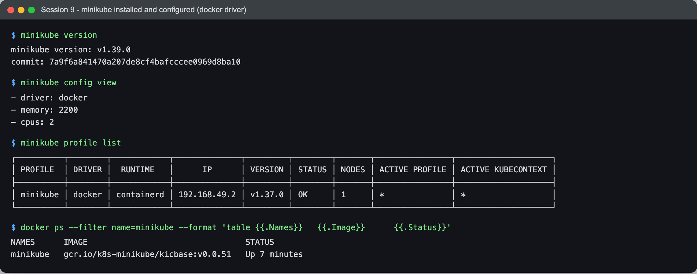

```text
$ minikube version
minikube version: v1.39.0
commit: 7a9f6a841470a207de8cf4bafcccee0969d8ba10

$ minikube config view
- driver: docker
- memory: 2200
- cpus: 2

$ minikube profile list
┌──────────┬────────┬────────────┬──────────────┬─────────┬────────┬───────┬────────────────┬────────────────────┐
│ PROFILE  │ DRIVER │  RUNTIME   │      IP      │ VERSION │ STATUS │ NODES │ ACTIVE PROFILE │ ACTIVE KUBECONTEXT │
├──────────┼────────┼────────────┼──────────────┼─────────┼────────┼───────┼────────────────┼────────────────────┤
│ minikube │ docker │ containerd │ 192.168.49.2 │ v1.37.0 │ OK     │ 1     │ *              │ *                  │
└──────────┴────────┴────────────┴──────────────┴─────────┴────────┴───────┴────────────────┴────────────────────┘

$ docker ps --filter name=minikube --format 'table {{.Names}}	{{.Image}}	{{.Status}}'
NAMES      IMAGE                                 STATUS
minikube   gcr.io/k8s-minikube/kicbase:v0.0.51   Up 7 minutes
```

The `docker ps` line is the important one for understanding what minikube is with this driver:
the Kubernetes "node" is a single Docker container called `minikube`, running the `kicbase`
image. Inside it run systemd, containerd, the kubelet and the control-plane containers.
`minikube config set` only changes the defaults for the next `minikube start`, which is why it
printed `These changes will take effect upon a minikube delete and then a minikube start`.

## 2. Verify cluster status

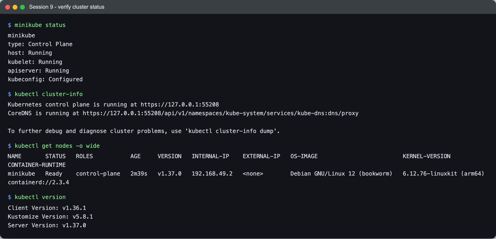

```text
$ minikube status
minikube
type: Control Plane
host: Running
kubelet: Running
apiserver: Running
kubeconfig: Configured

$ kubectl cluster-info
Kubernetes control plane is running at https://127.0.0.1:55208
CoreDNS is running at https://127.0.0.1:55208/api/v1/namespaces/kube-system/services/kube-dns:dns/proxy

To further debug and diagnose cluster problems, use 'kubectl cluster-info dump'.

$ kubectl get nodes -o wide
NAME       STATUS   ROLES           AGE     VERSION   INTERNAL-IP    EXTERNAL-IP   OS-IMAGE                         KERNEL-VERSION             CONTAINER-RUNTIME
minikube   Ready    control-plane   2m39s   v1.37.0   192.168.49.2   <none>        Debian GNU/Linux 12 (bookworm)   6.12.76-linuxkit (arm64)   containerd://2.3.4

$ kubectl version
Client Version: v1.36.1
Kustomize Version: v5.8.1
Server Version: v1.37.0
```

- `minikube status` checks the three layers separately: the host (the container), the kubelet
  (the node agent) and the API server.
- `cluster-info` shows the API server on `127.0.0.1:55208`. That is Docker Desktop forwarding
  a random host port to port 8443 inside the node container. kubectl never talks to
  `192.168.49.2` directly.
- The node is `Ready`, has the `control-plane` role, and runs containerd 2.3.4 as its runtime
  on an arm64 `linuxkit` kernel, which is Docker Desktop's VM kernel shared by every container.
- kubectl v1.36 against a v1.37 server is fine: kubectl supports one minor version of skew in
  either direction.

## 3. Kubernetes architecture

### Short notes

```text
                       kubectl / clients
                              |
                              v  (HTTPS, port 8443)
  +-------------------- control plane ---------------------+
  |  kube-apiserver  <---->  etcd (the only stateful part)  |
  |      ^      ^                                           |
  |      |      +---- kube-scheduler (picks a node per pod) |
  |      +----------- kube-controller-manager (control      |
  |                   loops: Deployment, ReplicaSet, Node..) |
  +---------------------------------------------------------+
                              |  watches
         +--------------------+---------------------+
         v                                          v
   node: kubelet  ->  containerd  ->  pods     kube-proxy (Service rules)
         CNI plugin (kindnet) gives every pod an IP, CoreDNS = cluster DNS
```

- **kube-apiserver** is the front door. Every component, including the scheduler and the
  kubelet, reads and writes cluster state only through it. It is the only thing that talks to
  etcd.
- **etcd** is a key-value store holding the desired and current state of every object. Lose
  etcd without a backup and you lose the cluster.
- **kube-scheduler** watches for pods with no `nodeName` and picks a node, based on resources,
  affinity, taints and so on. It only writes the decision; it starts nothing.
- **kube-controller-manager** runs the reconcile loops: "a ReplicaSet wants 4 pods, 3 exist,
  create 1". Almost all Kubernetes behaviour is a controller comparing desired to actual
  state.
- **kubelet** (on every node) makes sure the containers for the pods bound to its node are
  running, through the container runtime (containerd here), and reports their status back.
- **kube-proxy** (on every node) turns Services into packet-forwarding rules so a Service's
  virtual IP reaches the pods behind it.
- **CNI plugin** gives each pod its own IP. minikube picked **kindnet** here.
- **CoreDNS** gives Services DNS names.

### Seeing it on the cluster

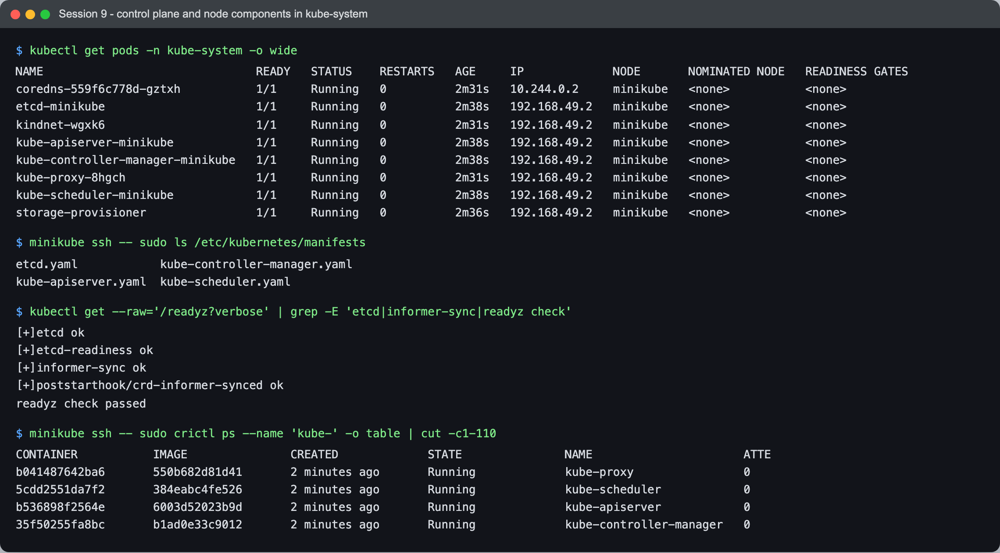

```text
$ kubectl get pods -n kube-system -o wide
NAME                               READY   STATUS    RESTARTS   AGE     IP             NODE       NOMINATED NODE   READINESS GATES
coredns-559f6c778d-gztxh           1/1     Running   0          2m31s   10.244.0.2     minikube   <none>           <none>
etcd-minikube                      1/1     Running   0          2m38s   192.168.49.2   minikube   <none>           <none>
kindnet-wgxk6                      1/1     Running   0          2m31s   192.168.49.2   minikube   <none>           <none>
kube-apiserver-minikube            1/1     Running   0          2m38s   192.168.49.2   minikube   <none>           <none>
kube-controller-manager-minikube   1/1     Running   0          2m38s   192.168.49.2   minikube   <none>           <none>
kube-proxy-8hgch                   1/1     Running   0          2m31s   192.168.49.2   minikube   <none>           <none>
kube-scheduler-minikube            1/1     Running   0          2m38s   192.168.49.2   minikube   <none>           <none>
storage-provisioner                1/1     Running   0          2m36s   192.168.49.2   minikube   <none>           <none>

$ minikube ssh -- sudo ls /etc/kubernetes/manifests
etcd.yaml	     kube-controller-manager.yaml
kube-apiserver.yaml  kube-scheduler.yaml

$ kubectl get --raw='/readyz?verbose' | grep -E 'etcd|informer-sync|readyz check'
[+]etcd ok
[+]etcd-readiness ok
[+]informer-sync ok
[+]poststarthook/crd-informer-synced ok
readyz check passed

$ minikube ssh -- sudo crictl ps --name 'kube-' -o table | cut -c1-110
CONTAINER           IMAGE               CREATED             STATE               NAME                      ATTE
b041487642ba6       550b682d81d41       2 minutes ago       Running             kube-proxy                0   
5cdd2551da7f2       384eabc4fe526       2 minutes ago       Running             kube-scheduler            0   
b536898f2564e       6003d52023b9d       2 minutes ago       Running             kube-apiserver            0   
35f50255fa8bc       b1ad0e33c9012       2 minutes ago       Running             kube-controller-manager   0
```

What this showed me:

- The control-plane components are **ordinary pods** in `kube-system`. The four in
  `/etc/kubernetes/manifests` (etcd, apiserver, controller-manager, scheduler) are **static
  pods**: the kubelet starts them directly from those files, before any API server exists to
  ask. That solves the bootstrapping chicken-and-egg problem.
- Static pods and `kindnet`/`kube-proxy` show the **node's IP** (`192.168.49.2`) as their pod
  IP, because they run with `hostNetwork: true`. CoreDNS has a real pod IP from the pod range
  (`10.244.0.2`).
- `/readyz?verbose` is the API server's own health checklist; `[+]etcd ok` proves it can
  reach etcd.
- `crictl` talks to containerd directly, underneath Kubernetes. It is what you use on a node
  when the API server itself is broken.

## 4. Basic objects and commands

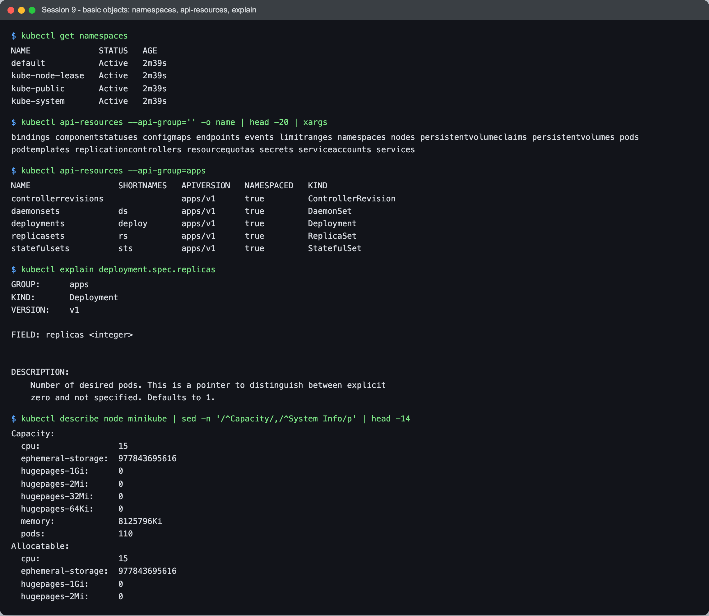

```text
$ kubectl get namespaces
NAME              STATUS   AGE
default           Active   2m39s
kube-node-lease   Active   2m39s
kube-public       Active   2m39s
kube-system       Active   2m39s

$ kubectl api-resources --api-group='' -o name | head -20 | xargs
bindings componentstatuses configmaps endpoints events limitranges namespaces nodes persistentvolumeclaims persistentvolumes pods podtemplates replicationcontrollers resourcequotas secrets serviceaccounts services

$ kubectl api-resources --api-group=apps
NAME                  SHORTNAMES   APIVERSION   NAMESPACED   KIND
controllerrevisions                apps/v1      true         ControllerRevision
daemonsets            ds           apps/v1      true         DaemonSet
deployments           deploy       apps/v1      true         Deployment
replicasets           rs           apps/v1      true         ReplicaSet
statefulsets          sts          apps/v1      true         StatefulSet

$ kubectl explain deployment.spec.replicas
GROUP:      apps
KIND:       Deployment
VERSION:    v1

FIELD: replicas <integer>


DESCRIPTION:
    Number of desired pods. This is a pointer to distinguish between explicit
    zero and not specified. Defaults to 1.

$ kubectl describe node minikube | sed -n '/^Capacity/,/^System Info/p' | head -14
Capacity:
  cpu:                15
  ephemeral-storage:  977843695616
  hugepages-1Gi:      0
  hugepages-2Mi:      0
  hugepages-32Mi:     0
  hugepages-64Ki:     0
  memory:             8125796Ki
  pods:               110
Allocatable:
  cpu:                15
  ephemeral-storage:  977843695616
  hugepages-1Gi:      0
  hugepages-2Mi:      0
```

| Object | What it is for |
|---|---|
| Pod | Smallest deployable unit: one or more containers sharing a network namespace and volumes |
| ReplicaSet | Keeps N identical pods running |
| Deployment | Manages ReplicaSets, which gives rolling updates and rollbacks |
| Service | Stable virtual IP + DNS name in front of a changing set of pods |
| Namespace | A scope for names, quotas and access rules |
| ConfigMap / Secret | Configuration and sensitive values, injected into pods |
| DaemonSet / StatefulSet | One pod per node / pods with stable identity and storage |

| Command | What I used it for |
|---|---|
| `kubectl get <kind> [-o wide]` | List objects, `-o wide` adds node and IP |
| `kubectl describe <kind> <name>` | Full detail plus the **events** at the bottom |
| `kubectl logs <pod>` | Container stdout/stderr |
| `kubectl exec <pod> -- <cmd>` | Run a command inside a running container |
| `kubectl api-resources` | Which kinds exist, their short names and API group |
| `kubectl explain <field.path>` | Schema docs for any field, offline from the API server |

One surprise in the node capacity: I started minikube with `--cpus=2 --memory=2200`, yet the
node reports `cpu: 15` and about `8 GiB` memory. With the Docker driver those flags become
cgroup **limits** on the node container, but the kubelet reads capacity from the kernel, and it
sees the whole Docker Desktop VM. So the scheduler thinks it has more room than the container
will actually allow.

---

## 5. Kubernetes Basics tutorial

Module 1 ("create a cluster") is sections 1 and 2 above. Modules 2 to 6 follow.

### Module 2 - Deploy an app

```bash
kubectl create deployment kubernetes-bootcamp --image=gcr.io/google-samples/kubernetes-bootcamp:v1
```

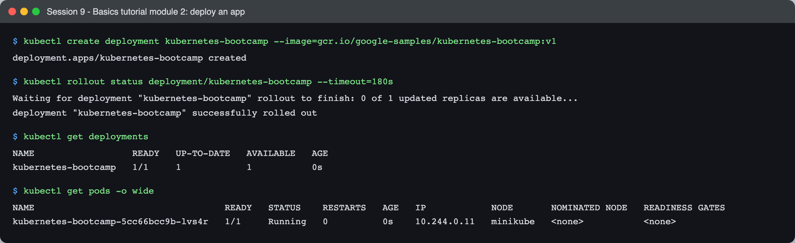

```text
$ kubectl create deployment kubernetes-bootcamp --image=gcr.io/google-samples/kubernetes-bootcamp:v1
deployment.apps/kubernetes-bootcamp created

$ kubectl rollout status deployment/kubernetes-bootcamp --timeout=180s
Waiting for deployment "kubernetes-bootcamp" rollout to finish: 0 of 1 updated replicas are available...
deployment "kubernetes-bootcamp" successfully rolled out

$ kubectl get deployments
NAME                  READY   UP-TO-DATE   AVAILABLE   AGE
kubernetes-bootcamp   1/1     1            1           0s

$ kubectl get pods -o wide
NAME                                   READY   STATUS    RESTARTS   AGE   IP            NODE       NOMINATED NODE   READINESS GATES
kubernetes-bootcamp-5cc66bcc9b-lvs4r   1/1     Running   0          0s    10.244.0.11   minikube   <none>           <none>
```

One command created three objects: the Deployment, a ReplicaSet (`...-5cc66bcc9b`, the hash of
the pod template) and the pod. The scheduler put the pod on the only node, and kindnet gave it
`10.244.0.x`.

### Module 3 - Explore the app: describe, logs, exec, proxy

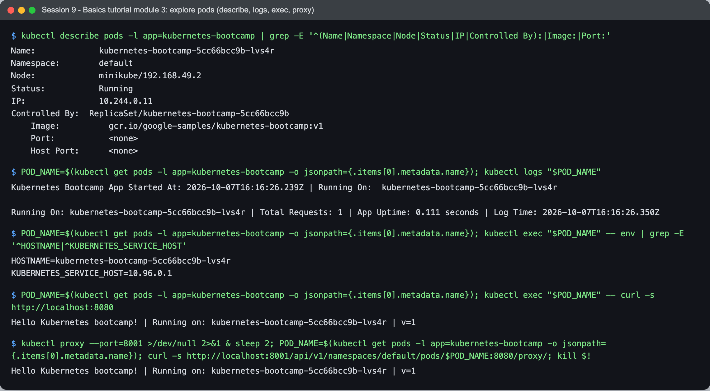

```text
$ kubectl describe pods -l app=kubernetes-bootcamp | grep -E '^(Name|Namespace|Node|Status|IP|Controlled By):|Image:|Port:'
Name:             kubernetes-bootcamp-5cc66bcc9b-lvs4r
Namespace:        default
Node:             minikube/192.168.49.2
Status:           Running
IP:               10.244.0.11
Controlled By:  ReplicaSet/kubernetes-bootcamp-5cc66bcc9b
    Image:          gcr.io/google-samples/kubernetes-bootcamp:v1
    Port:           <none>
    Host Port:      <none>

$ POD_NAME=$(kubectl get pods -l app=kubernetes-bootcamp -o jsonpath={.items[0].metadata.name}); kubectl logs "$POD_NAME"
Kubernetes Bootcamp App Started At: 2026-10-07T16:16:26.239Z | Running On:  kubernetes-bootcamp-5cc66bcc9b-lvs4r 

Running On: kubernetes-bootcamp-5cc66bcc9b-lvs4r | Total Requests: 1 | App Uptime: 0.111 seconds | Log Time: 2026-10-07T16:16:26.350Z

$ POD_NAME=$(kubectl get pods -l app=kubernetes-bootcamp -o jsonpath={.items[0].metadata.name}); kubectl exec "$POD_NAME" -- env | grep -E '^HOSTNAME|^KUBERNETES_SERVICE_HOST'
HOSTNAME=kubernetes-bootcamp-5cc66bcc9b-lvs4r
KUBERNETES_SERVICE_HOST=10.96.0.1

$ POD_NAME=$(kubectl get pods -l app=kubernetes-bootcamp -o jsonpath={.items[0].metadata.name}); kubectl exec "$POD_NAME" -- curl -s http://localhost:8080
Hello Kubernetes bootcamp! | Running on: kubernetes-bootcamp-5cc66bcc9b-lvs4r | v=1

$ kubectl proxy --port=8001 >/dev/null 2>&1 & sleep 2; POD_NAME=$(kubectl get pods -l app=kubernetes-bootcamp -o jsonpath={.items[0].metadata.name}); curl -s http://localhost:8001/api/v1/namespaces/default/pods/$POD_NAME:8080/proxy/; kill $!
Hello Kubernetes bootcamp! | Running on: kubernetes-bootcamp-5cc66bcc9b-lvs4r | v=1
```

- `Controlled By: ReplicaSet/...` is the ownership chain: Deployment owns the ReplicaSet, the
  ReplicaSet owns the pod.
- `KUBERNETES_SERVICE_HOST=10.96.0.1` is injected into every container: the ClusterIP of the
  built-in `kubernetes` Service, so code inside a pod can find the API server.
- `kubectl proxy` opens an authenticated tunnel to the API server on `localhost:8001`. The
  `/pods/<name>:8080/proxy/` URL makes the **API server** forward my request to the pod. No
  Service is involved yet, which is why it is a debugging tool, not a way to publish an app.

### Module 4 - Expose the app with a Service

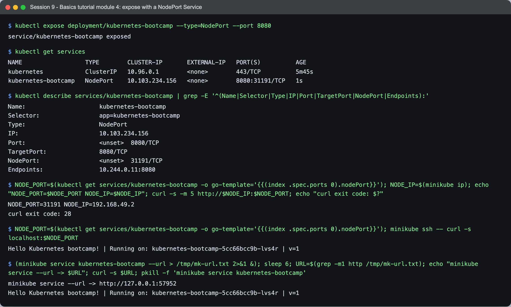

```text
$ kubectl expose deployment/kubernetes-bootcamp --type=NodePort --port 8080
service/kubernetes-bootcamp exposed

$ kubectl get services
NAME                  TYPE        CLUSTER-IP       EXTERNAL-IP   PORT(S)          AGE
kubernetes            ClusterIP   10.96.0.1        <none>        443/TCP          5m45s
kubernetes-bootcamp   NodePort    10.103.234.156   <none>        8080:31191/TCP   1s

$ kubectl describe services/kubernetes-bootcamp | grep -E '^(Name|Selector|Type|IP|Port|TargetPort|NodePort|Endpoints):'
Name:                     kubernetes-bootcamp
Selector:                 app=kubernetes-bootcamp
Type:                     NodePort
IP:                       10.103.234.156
Port:                     <unset>  8080/TCP
TargetPort:               8080/TCP
NodePort:                 <unset>  31191/TCP
Endpoints:                10.244.0.11:8080

$ NODE_PORT=$(kubectl get services/kubernetes-bootcamp -o go-template='{{(index .spec.ports 0).nodePort}}'); NODE_IP=$(minikube ip); echo "NODE_PORT=$NODE_PORT NODE_IP=$NODE_IP"; curl -s -m 5 http://$NODE_IP:$NODE_PORT; echo "curl exit code: $?"
NODE_PORT=31191 NODE_IP=192.168.49.2
curl exit code: 28

$ NODE_PORT=$(kubectl get services/kubernetes-bootcamp -o go-template='{{(index .spec.ports 0).nodePort}}'); minikube ssh -- curl -s localhost:$NODE_PORT
Hello Kubernetes bootcamp! | Running on: kubernetes-bootcamp-5cc66bcc9b-lvs4r | v=1

$ (minikube service kubernetes-bootcamp --url > /tmp/mk-url.txt 2>&1 &); sleep 6; URL=$(grep -m1 http /tmp/mk-url.txt); echo "minikube service --url -> $URL"; curl -s $URL; pkill -f 'minikube service kubernetes-bootcamp'
minikube service --url -> http://127.0.0.1:57952
Hello Kubernetes bootcamp! | Running on: kubernetes-bootcamp-5cc66bcc9b-lvs4r | v=1
```

The tutorial's `curl $(minikube ip):$NODE_PORT` **timed out on my machine** (`exit code: 28`).
The Service was fine (`Endpoints: 10.244.0.x:8080`), and it answered on the same NodePort from
inside the node (`minikube ssh -- curl localhost:31191`). The issue is where the node lives: on
macOS, Docker containers run inside Docker Desktop's Linux VM, and `192.168.49.2` is an
address on a bridge **inside that VM**. My Mac has no route to it. `minikube service --url`
works around it by opening a tunnel from `127.0.0.1:<random port>` on the Mac to the
NodePort. It prints a warning that the terminal has to stay open because the tunnel lives only
as long as that process.

#### Labels

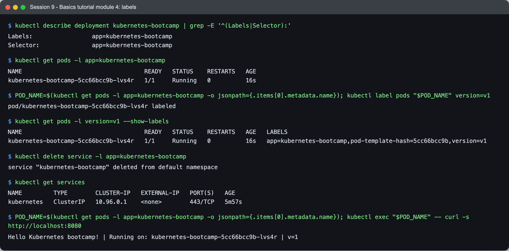

```text
$ kubectl describe deployment kubernetes-bootcamp | grep -E '^(Labels|Selector):'
Labels:                 app=kubernetes-bootcamp
Selector:               app=kubernetes-bootcamp

$ kubectl get pods -l app=kubernetes-bootcamp
NAME                                   READY   STATUS    RESTARTS   AGE
kubernetes-bootcamp-5cc66bcc9b-lvs4r   1/1     Running   0          16s

$ POD_NAME=$(kubectl get pods -l app=kubernetes-bootcamp -o jsonpath={.items[0].metadata.name}); kubectl label pods "$POD_NAME" version=v1
pod/kubernetes-bootcamp-5cc66bcc9b-lvs4r labeled

$ kubectl get pods -l version=v1 --show-labels
NAME                                   READY   STATUS    RESTARTS   AGE   LABELS
kubernetes-bootcamp-5cc66bcc9b-lvs4r   1/1     Running   0          16s   app=kubernetes-bootcamp,pod-template-hash=5cc66bcc9b,version=v1

$ kubectl delete service -l app=kubernetes-bootcamp
service "kubernetes-bootcamp" deleted from default namespace

$ kubectl get services
NAME         TYPE        CLUSTER-IP   EXTERNAL-IP   PORT(S)   AGE
kubernetes   ClusterIP   10.96.0.1    <none>        443/TCP   5m57s

$ POD_NAME=$(kubectl get pods -l app=kubernetes-bootcamp -o jsonpath={.items[0].metadata.name}); kubectl exec "$POD_NAME" -- curl -s http://localhost:8080
Hello Kubernetes bootcamp! | Running on: kubernetes-bootcamp-5cc66bcc9b-lvs4r | v=1
```

Labels are how every link in Kubernetes is made: the Deployment's selector, the ReplicaSet's
`pod-template-hash`, and the Service's selector are all label queries. Deleting the Service
removed only the network entry point; `curl localhost:8080` inside the pod shows the app kept
running, because the Deployment does not depend on the Service.

### Module 5 - Scale the app

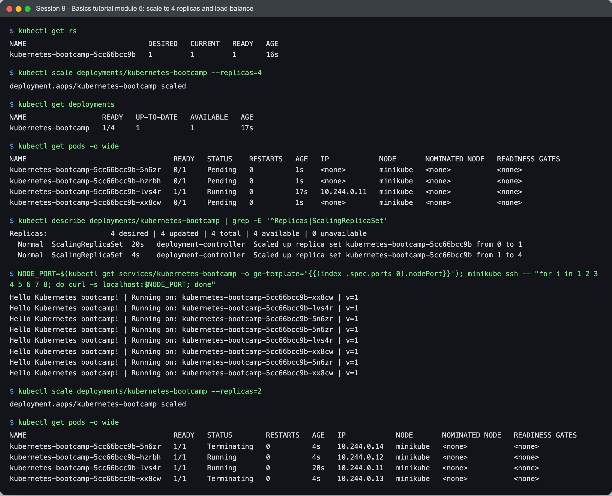

```text
$ kubectl get rs
NAME                             DESIRED   CURRENT   READY   AGE
kubernetes-bootcamp-5cc66bcc9b   1         1         1       16s

$ kubectl scale deployments/kubernetes-bootcamp --replicas=4
deployment.apps/kubernetes-bootcamp scaled

$ kubectl get deployments
NAME                  READY   UP-TO-DATE   AVAILABLE   AGE
kubernetes-bootcamp   1/4     1            1           17s

$ kubectl get pods -o wide
NAME                                   READY   STATUS    RESTARTS   AGE   IP            NODE       NOMINATED NODE   READINESS GATES
kubernetes-bootcamp-5cc66bcc9b-5n6zr   0/1     Pending   0          1s    <none>        minikube   <none>           <none>
kubernetes-bootcamp-5cc66bcc9b-hzrbh   0/1     Pending   0          1s    <none>        minikube   <none>           <none>
kubernetes-bootcamp-5cc66bcc9b-lvs4r   1/1     Running   0          17s   10.244.0.11   minikube   <none>           <none>
kubernetes-bootcamp-5cc66bcc9b-xx8cw   0/1     Pending   0          1s    <none>        minikube   <none>           <none>

$ kubectl describe deployments/kubernetes-bootcamp | grep -E '^Replicas|ScalingReplicaSet'
Replicas:               4 desired | 4 updated | 4 total | 4 available | 0 unavailable
  Normal  ScalingReplicaSet  20s   deployment-controller  Scaled up replica set kubernetes-bootcamp-5cc66bcc9b from 0 to 1
  Normal  ScalingReplicaSet  4s    deployment-controller  Scaled up replica set kubernetes-bootcamp-5cc66bcc9b from 1 to 4

$ NODE_PORT=$(kubectl get services/kubernetes-bootcamp -o go-template='{{(index .spec.ports 0).nodePort}}'); minikube ssh -- "for i in 1 2 3 4 5 6 7 8; do curl -s localhost:$NODE_PORT; done"
Hello Kubernetes bootcamp! | Running on: kubernetes-bootcamp-5cc66bcc9b-xx8cw | v=1
Hello Kubernetes bootcamp! | Running on: kubernetes-bootcamp-5cc66bcc9b-lvs4r | v=1
Hello Kubernetes bootcamp! | Running on: kubernetes-bootcamp-5cc66bcc9b-5n6zr | v=1
Hello Kubernetes bootcamp! | Running on: kubernetes-bootcamp-5cc66bcc9b-5n6zr | v=1
Hello Kubernetes bootcamp! | Running on: kubernetes-bootcamp-5cc66bcc9b-lvs4r | v=1
Hello Kubernetes bootcamp! | Running on: kubernetes-bootcamp-5cc66bcc9b-xx8cw | v=1
Hello Kubernetes bootcamp! | Running on: kubernetes-bootcamp-5cc66bcc9b-5n6zr | v=1
Hello Kubernetes bootcamp! | Running on: kubernetes-bootcamp-5cc66bcc9b-xx8cw | v=1

$ kubectl scale deployments/kubernetes-bootcamp --replicas=2
deployment.apps/kubernetes-bootcamp scaled

$ kubectl get pods -o wide
NAME                                   READY   STATUS        RESTARTS   AGE   IP            NODE       NOMINATED NODE   READINESS GATES
kubernetes-bootcamp-5cc66bcc9b-5n6zr   1/1     Terminating   0          4s    10.244.0.14   minikube   <none>           <none>
kubernetes-bootcamp-5cc66bcc9b-hzrbh   1/1     Running       0          4s    10.244.0.12   minikube   <none>           <none>
kubernetes-bootcamp-5cc66bcc9b-lvs4r   1/1     Running       0          20s   10.244.0.11   minikube   <none>           <none>
kubernetes-bootcamp-5cc66bcc9b-xx8cw   1/1     Terminating   0          4s    10.244.0.13   minikube   <none>           <none>
```

- Right after `scale --replicas=4` the Deployment shows `1/4` ready and three pods in
  `ContainerCreating`. Scaling is just changing a number; the ReplicaSet controller then
  creates pods to match.
- The 8 requests through the NodePort were answered by three different pods. The Service
  spreads **connections** across its endpoints (kube-proxy picks one at random), so with only 8
  requests one pod happened to get none.
- Scaling back to 2 put two pods in `Terminating`. The ReplicaSet picks which pods to delete
  (newest and least-ready first), not the oldest.

### Module 6 - Rolling update and rollback

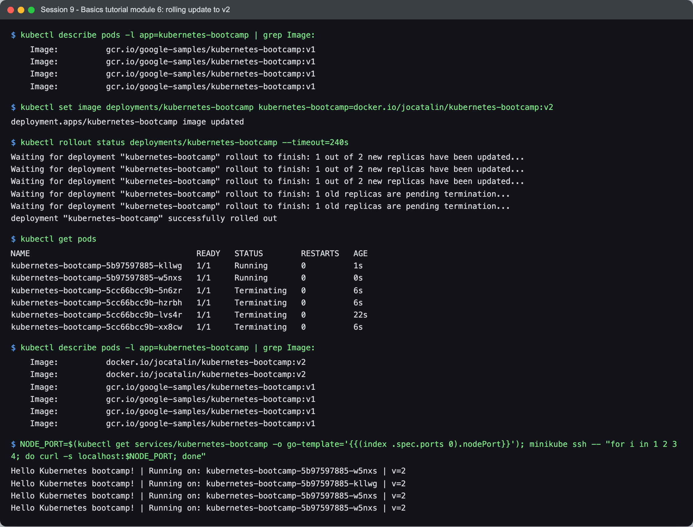

```text
$ kubectl describe pods -l app=kubernetes-bootcamp | grep Image:
    Image:          gcr.io/google-samples/kubernetes-bootcamp:v1
    Image:          gcr.io/google-samples/kubernetes-bootcamp:v1
    Image:          gcr.io/google-samples/kubernetes-bootcamp:v1
    Image:          gcr.io/google-samples/kubernetes-bootcamp:v1

$ kubectl set image deployments/kubernetes-bootcamp kubernetes-bootcamp=docker.io/jocatalin/kubernetes-bootcamp:v2
deployment.apps/kubernetes-bootcamp image updated

$ kubectl rollout status deployments/kubernetes-bootcamp --timeout=240s
Waiting for deployment "kubernetes-bootcamp" rollout to finish: 1 out of 2 new replicas have been updated...
Waiting for deployment "kubernetes-bootcamp" rollout to finish: 1 out of 2 new replicas have been updated...
Waiting for deployment "kubernetes-bootcamp" rollout to finish: 1 out of 2 new replicas have been updated...
Waiting for deployment "kubernetes-bootcamp" rollout to finish: 1 old replicas are pending termination...
Waiting for deployment "kubernetes-bootcamp" rollout to finish: 1 old replicas are pending termination...
deployment "kubernetes-bootcamp" successfully rolled out

$ kubectl get pods
NAME                                   READY   STATUS        RESTARTS   AGE
kubernetes-bootcamp-5b97597885-kllwg   1/1     Running       0          1s
kubernetes-bootcamp-5b97597885-w5nxs   1/1     Running       0          0s
kubernetes-bootcamp-5cc66bcc9b-5n6zr   1/1     Terminating   0          6s
kubernetes-bootcamp-5cc66bcc9b-hzrbh   1/1     Terminating   0          6s
kubernetes-bootcamp-5cc66bcc9b-lvs4r   1/1     Terminating   0          22s
kubernetes-bootcamp-5cc66bcc9b-xx8cw   1/1     Terminating   0          6s

$ kubectl describe pods -l app=kubernetes-bootcamp | grep Image:
    Image:          docker.io/jocatalin/kubernetes-bootcamp:v2
    Image:          docker.io/jocatalin/kubernetes-bootcamp:v2
    Image:          gcr.io/google-samples/kubernetes-bootcamp:v1
    Image:          gcr.io/google-samples/kubernetes-bootcamp:v1
    Image:          gcr.io/google-samples/kubernetes-bootcamp:v1
    Image:          gcr.io/google-samples/kubernetes-bootcamp:v1

$ NODE_PORT=$(kubectl get services/kubernetes-bootcamp -o go-template='{{(index .spec.ports 0).nodePort}}'); minikube ssh -- "for i in 1 2 3 4; do curl -s localhost:$NODE_PORT; done"
Hello Kubernetes bootcamp! | Running on: kubernetes-bootcamp-5b97597885-w5nxs | v=2
Hello Kubernetes bootcamp! | Running on: kubernetes-bootcamp-5b97597885-kllwg | v=2
Hello Kubernetes bootcamp! | Running on: kubernetes-bootcamp-5b97597885-w5nxs | v=2
Hello Kubernetes bootcamp! | Running on: kubernetes-bootcamp-5b97597885-w5nxs | v=2
```

`set image` changed the pod template, so the Deployment created a **new** ReplicaSet
(`...-5b97597885`) and moved pods across a few at a time. Every response afterwards says `v=2`.

Then I updated to a tag that does not exist (`v10`) and rolled back:

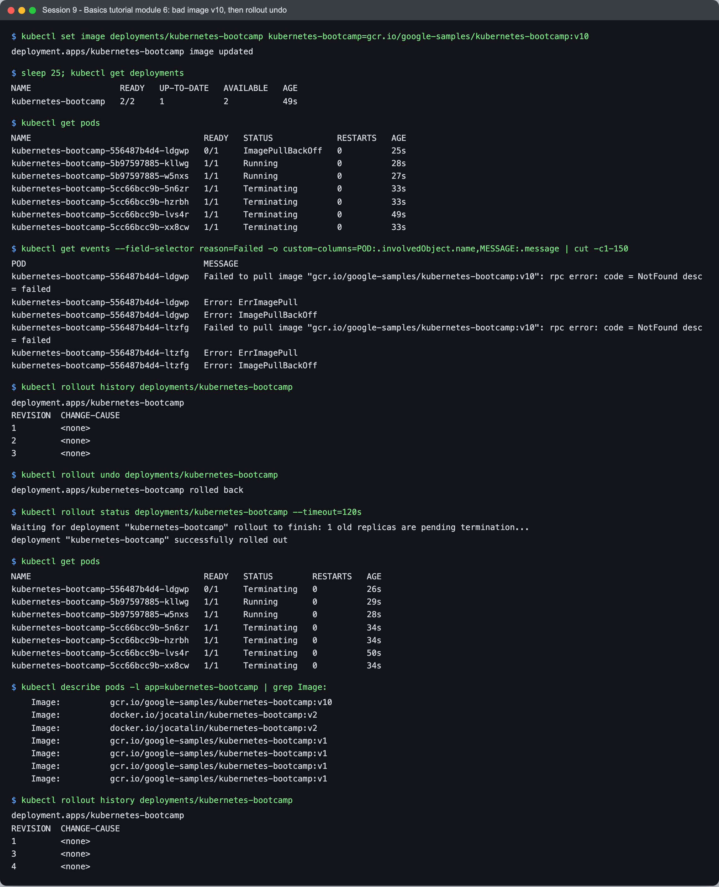

```text
$ kubectl set image deployments/kubernetes-bootcamp kubernetes-bootcamp=gcr.io/google-samples/kubernetes-bootcamp:v10
deployment.apps/kubernetes-bootcamp image updated

$ sleep 25; kubectl get deployments
NAME                  READY   UP-TO-DATE   AVAILABLE   AGE
kubernetes-bootcamp   2/2     1            2           49s

$ kubectl get pods
NAME                                   READY   STATUS             RESTARTS   AGE
kubernetes-bootcamp-556487b4d4-ldgwp   0/1     ImagePullBackOff   0          25s
kubernetes-bootcamp-5b97597885-kllwg   1/1     Running            0          28s
kubernetes-bootcamp-5b97597885-w5nxs   1/1     Running            0          27s
kubernetes-bootcamp-5cc66bcc9b-5n6zr   1/1     Terminating        0          33s
kubernetes-bootcamp-5cc66bcc9b-hzrbh   1/1     Terminating        0          33s
kubernetes-bootcamp-5cc66bcc9b-lvs4r   1/1     Terminating        0          49s
kubernetes-bootcamp-5cc66bcc9b-xx8cw   1/1     Terminating        0          33s

$ kubectl get events --field-selector reason=Failed -o custom-columns=POD:.involvedObject.name,MESSAGE:.message | cut -c1-150
POD                                    MESSAGE
kubernetes-bootcamp-556487b4d4-ldgwp   Failed to pull image "gcr.io/google-samples/kubernetes-bootcamp:v10": rpc error: code = NotFound desc = failed 
kubernetes-bootcamp-556487b4d4-ldgwp   Error: ErrImagePull
kubernetes-bootcamp-556487b4d4-ldgwp   Error: ImagePullBackOff
kubernetes-bootcamp-556487b4d4-ltzfg   Failed to pull image "gcr.io/google-samples/kubernetes-bootcamp:v10": rpc error: code = NotFound desc = failed 
kubernetes-bootcamp-556487b4d4-ltzfg   Error: ErrImagePull
kubernetes-bootcamp-556487b4d4-ltzfg   Error: ImagePullBackOff

$ kubectl rollout history deployments/kubernetes-bootcamp
deployment.apps/kubernetes-bootcamp 
REVISION  CHANGE-CAUSE
1         <none>
2         <none>
3         <none>

$ kubectl rollout undo deployments/kubernetes-bootcamp
deployment.apps/kubernetes-bootcamp rolled back

$ kubectl rollout status deployments/kubernetes-bootcamp --timeout=120s
Waiting for deployment "kubernetes-bootcamp" rollout to finish: 1 old replicas are pending termination...
deployment "kubernetes-bootcamp" successfully rolled out

$ kubectl get pods
NAME                                   READY   STATUS        RESTARTS   AGE
kubernetes-bootcamp-556487b4d4-ldgwp   0/1     Terminating   0          26s
kubernetes-bootcamp-5b97597885-kllwg   1/1     Running       0          29s
kubernetes-bootcamp-5b97597885-w5nxs   1/1     Running       0          28s
kubernetes-bootcamp-5cc66bcc9b-5n6zr   1/1     Terminating   0          34s
kubernetes-bootcamp-5cc66bcc9b-hzrbh   1/1     Terminating   0          34s
kubernetes-bootcamp-5cc66bcc9b-lvs4r   1/1     Terminating   0          50s
kubernetes-bootcamp-5cc66bcc9b-xx8cw   1/1     Terminating   0          34s

$ kubectl describe pods -l app=kubernetes-bootcamp | grep Image:
    Image:          gcr.io/google-samples/kubernetes-bootcamp:v10
    Image:          docker.io/jocatalin/kubernetes-bootcamp:v2
    Image:          docker.io/jocatalin/kubernetes-bootcamp:v2
    Image:          gcr.io/google-samples/kubernetes-bootcamp:v1
    Image:          gcr.io/google-samples/kubernetes-bootcamp:v1
    Image:          gcr.io/google-samples/kubernetes-bootcamp:v1
    Image:          gcr.io/google-samples/kubernetes-bootcamp:v1

$ kubectl rollout history deployments/kubernetes-bootcamp
deployment.apps/kubernetes-bootcamp 
REVISION  CHANGE-CAUSE
1         <none>
3         <none>
4         <none>
```

This is the part I found most useful:

- The broken rollout **did not take the app down**. With 2 replicas and the default
  `maxUnavailable: 25%` (rounded down to 0) and `maxSurge: 25%` (rounded up to 1), the
  Deployment may add one extra pod but never remove a working one first. So it created one
  `v10` pod, that pod sat in `ErrImagePull` / `ImagePullBackOff`, and the two `v2` pods kept
  serving (`READY 2/2`, `UP-TO-DATE 1`). The rollout just stalls.
- The event says `not found`: the registry answered and the tag does not exist. That is
  different from an auth or network failure, and it is why reading the event message beats
  guessing from the status. (The second pod name in the events list, `...ltzfg`, is left over
  from my first attempt at this module a few minutes earlier; events stay for an hour.)
- `rollout undo` goes to the **previous** revision, which was v2 (revision 2), not v1. In
  the history afterwards, revision 2 is gone and a revision 4 has appeared: rolling back
  re-applies the old template as a new revision instead of rewinding the counter.

Cleanup:

```bash
kubectl delete deployment,service -l app=kubernetes-bootcamp
```

---

## What I learned

- Kubernetes is a set of independent control loops around one API server. The scheduler, the
  ReplicaSet controller and the kubelet never call each other; each watches the API for
  objects it cares about and moves actual state toward desired state.
- Labels and selectors are the wiring. Deployment to ReplicaSet to Pod, and Service to Pod,
  are all label queries, not hard links.
- A Deployment's rolling-update settings decide whether a bad release causes an outage. With
  the defaults, a bad image stalls the rollout instead of breaking the app.
- `Running` is not the same as "serving traffic". Without a readiness probe, Kubernetes
  cannot know the difference (see below).

## Problems I hit

- **The tutorial image is amd64-only; my Mac is arm64.** `kubernetes-bootcamp` has a single
  `linux/amd64` manifest, no multi-arch index. containerd pulled it anyway, and it ran under
  Docker Desktop's x86 emulation (`kubectl exec ... -- uname -m` printed `x86_64` on an arm64
  node). On my very first run, the pod was `1/1 Running` but `curl localhost:8080` inside it
  failed with exit code 7 (connection refused) for about a minute: the Node.js app was slow to
  start under emulation. Kubernetes reported it as Ready because the image defines no readiness
  probe, so "container process started" counted as ready. Later runs answered immediately, most
  likely because the emulator had already translated and cached the binary. This is exactly the gap readiness probes exist to close.
- **NodePort not reachable from the Mac.** Covered in module 4: the Docker driver's node IP
  is inside Docker Desktop's VM. `minikube service --url` or `minikube ssh` are the fixes.
- **Pods stuck in `Terminating` for about 30 seconds** after every scale-down and update. The
  container's PID 1 is `/bin/sh -c node server.js` (I saw it in `ps aux` inside the pod). `sh`
  does not forward SIGTERM to `node`, so the app ignores the polite stop. The kubelet waits the
  full `terminationGracePeriodSeconds: 30` and then SIGKILLs it. An exec-form `CMD ["node",
  "server.js"]` in the image would make node PID 1 and shut down immediately.
- **My first capture of module 4 printed `exit code: 0` for the failing curl.** I had written
  `echo "... $(minikube ip) ... exit code: $?"`, and the `$(minikube ip)` inside the echo runs
  first and resets `$?`. I re-ran the module and saved `$NODE_IP` before the curl, which
  showed the real `28` (timeout).
- **Other clusters on the same Docker.** This machine already had other kind clusters running,
  and `minikube start` normally switches the current kubectl context. I gave minikube its own
  kubeconfig file (`KUBECONFIG=<file> minikube start`) so it would not change the context those
  clusters were using.
